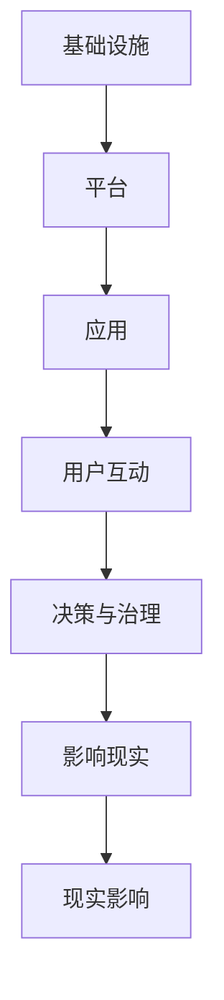

                 

元宇宙，作为人类虚拟世界的延伸和扩展，正在逐步融入我们的日常生活。随着技术的不断进步，虚拟世界中的政治生态也悄然发生着变化。本文将探讨元宇宙政治生态的核心概念、算法原理、应用场景以及未来展望，旨在为读者提供一个全面深入的了解。

## 关键词
- 元宇宙
- 政治生态
- 虚拟世界
- 权力新格局
- 技术进步
- 应用场景
- 未来展望

## 摘要
本文首先介绍了元宇宙的背景和发展现状，随后深入探讨了元宇宙政治生态的核心概念及其与传统政治生态的联系。接着，文章分析了元宇宙中权力分配的算法原理和具体操作步骤，并对其优缺点和应用领域进行了详细讨论。在此基础上，本文通过数学模型和公式的推导，提供了对元宇宙政治生态的深入理解。随后，文章展示了实际项目中的代码实例和运行结果，进一步阐释了元宇宙政治生态的应用场景。最后，本文对元宇宙政治生态的未来发展趋势与挑战进行了展望，并推荐了相关的学习资源和开发工具。

## 1. 背景介绍
### 元宇宙的兴起
元宇宙（Metaverse）这个概念最早可以追溯到1992年尼尔·斯蒂芬森（Neal Stephenson）的科幻小说《雪崩》（Snow Crash），描述了一个虚拟的三维互联网世界。然而，随着技术的不断进步，尤其是虚拟现实（VR）、增强现实（AR）和区块链技术的发展，元宇宙的概念逐渐从科幻小说走向现实。

在过去的几年里，元宇宙得到了广泛关注，成为科技巨头和企业竞相投入的领域。Facebook（现更名为Meta）宣布其愿景是构建一个“私人化的元宇宙”，腾讯、谷歌、微软等科技巨头也在元宇宙领域展开了激烈的竞争。元宇宙的发展不仅带来了新的商业机会，也对社会结构、经济模式、政治生态等方面产生了深远的影响。

### 元宇宙的发展现状
目前，元宇宙的发展可以分为三个阶段：

1. **探索阶段**：这一阶段主要涉及虚拟现实和增强现实技术的研发，以提供更加沉浸式的用户体验。一些虚拟现实游戏和平台，如《Second Life》和《Fortnite》，已经取得了巨大的成功。

2. **成长阶段**：随着区块链技术的应用，元宇宙开始引入数字货币和虚拟资产，推动了虚拟经济的发展。NFT（非同质化代币）的兴起，使得虚拟资产的价值得到了认可和交易。

3. **成熟阶段**：在这一阶段，元宇宙将更加成熟和多样化，涵盖社交、娱乐、教育、医疗等多个领域，成为人们日常生活的一部分。

### 元宇宙对社会的影响
元宇宙的兴起对社会产生了深远的影响，包括以下几个方面：

1. **经济模式变革**：元宇宙为传统产业带来了新的机遇，如虚拟房地产、数字艺术品交易等。同时，元宇宙也为新兴的虚拟经济模式提供了平台。

2. **社交形态变革**：元宇宙为人们提供了一个全新的社交空间，打破了地域和时间的限制，促进了全球化社交。

3. **教育模式变革**：元宇宙为教育提供了更加沉浸和互动的教学方式，有望提高教育质量和学习效果。

4. **政治生态变革**：元宇宙政治生态的出现，使得政治参与和治理方式发生了变化，对传统政治生态产生了挑战。

## 2. 核心概念与联系
### 元宇宙政治生态的定义
元宇宙政治生态是指在虚拟世界中，由个体、组织、机构等国家或类似实体组成的政治体系，以及它们之间的互动和权力分配。与传统的现实世界政治生态相比，元宇宙政治生态具有以下几个特点：

1. **虚拟性**：元宇宙政治生态是建立在虚拟技术基础上的，所有政治活动和行为都在虚拟空间中进行。

2. **去中心化**：与传统的集中式政治体系不同，元宇宙政治生态更加去中心化，权力分散在多个实体之间。

3. **数字货币**：元宇宙政治生态中广泛使用数字货币，如比特币、以太坊等，作为经济和交易的基础。

4. **智能化**：元宇宙政治生态利用人工智能技术，实现自动化的决策和治理。

### 元宇宙政治生态的架构
元宇宙政治生态的架构可以分为三个层次：基础设施、平台和应用。

1. **基础设施**：包括服务器、网络、虚拟现实设备等，为元宇宙政治生态提供运行的基础设施。

2. **平台**：包括社交平台、交易平台、治理平台等，为不同的政治活动提供平台。

3. **应用**：包括游戏、社交、教育、医疗等应用，为用户提供服务和参与政治活动的机会。

### 元宇宙政治生态与人类现实世界的联系
元宇宙政治生态与人类现实世界的政治生态之间存在紧密的联系，但同时也存在显著的区别。

1. **互动与影响**：元宇宙政治生态可以通过虚拟活动影响现实世界，如虚拟选举、抗议活动等。同时，现实世界的政治事件和决策也会对元宇宙政治生态产生影响。

2. **去中心化与集中化**：元宇宙政治生态更加去中心化，权力分散在多个实体之间。而现实世界的政治生态则更加集中化，权力集中在少数人手中。

3. **数字货币与真实货币**：元宇宙政治生态中使用数字货币，而现实世界的政治生态主要使用真实货币。

4. **虚拟与现实**：元宇宙政治生态是虚拟的，而现实世界的政治生态是真实的。

### Mermaid 流程图
以下是一个简化的元宇宙政治生态的Mermaid流程图：



在这个流程图中，基础设施提供了支持，平台和应用程序是用户参与和互动的场所，用户互动产生决策和治理，这些决策和治理又反过来影响现实世界，而现实世界的政治事件和决策也会影响元宇宙政治生态。

## 3. 核心算法原理 & 具体操作步骤
### 3.1 算法原理概述
在元宇宙政治生态中，算法是决策和治理的核心。以下是一个简化的元宇宙政治生态中的算法原理概述：

1. **共识算法**：用于确保元宇宙中所有节点的数据一致性。常见的共识算法包括PoW（Proof of Work，工作证明）、PoS（Proof of Stake，股份证明）和DPoS（Delegated Proof of Stake，委托权益证明）。

2. **治理算法**：用于决策和治理。常见的治理算法包括投票算法、拍卖算法和协商算法。

3. **智能合约**：用于自动执行和执行在元宇宙中的合同和协议。

### 3.2 算法步骤详解
以下是一个简化的元宇宙政治生态中算法的具体操作步骤：

1. **共识算法步骤**：

   - **初始化**：所有节点加入元宇宙网络。
   - **挖矿**：节点通过解决数学难题来获取新的区块。
   - **验证**：其他节点验证新挖出的区块是否有效。
   - **共识**：通过共识算法（如PoW）确定区块是否被接受。
   - **记录**：将有效区块记录在区块链上。

2. **治理算法步骤**：

   - **提出提案**：用户或组织提出治理提案。
   - **投票**：用户对提案进行投票。
   - **决策**：根据投票结果进行决策。
   - **执行**：执行决策结果。

3. **智能合约步骤**：

   - **编写合约**：用户编写智能合约。
   - **部署合约**：将智能合约部署到区块链上。
   - **执行合约**：根据合约条件自动执行。

### 3.3 算法优缺点
#### 优点：

1. **去中心化**：算法确保了元宇宙中的权力分散，避免了集中式管理的弊端。
2. **透明度**：所有算法步骤和决策过程都是透明的，用户可以随时查看和监督。
3. **效率**：算法能够快速处理大量数据和用户请求，提高了决策和治理的效率。

#### 缺点：

1. **计算资源消耗**：共识算法（如PoW）需要大量的计算资源，可能导致能源消耗过高。
2. **信任问题**：尽管算法去中心化，但仍然存在信任问题，如恶意节点的攻击。
3. **复杂性**：算法的复杂性和技术门槛较高，可能导致普通用户难以理解和参与。

### 3.4 算法应用领域
算法在元宇宙政治生态中有广泛的应用领域，包括但不限于：

1. **选举与投票**：使用算法确保选举过程的透明、公正和高效。
2. **社会治理**：使用算法进行城市管理、公共服务和环境保护。
3. **经济管理**：使用算法进行数字货币交易、虚拟资产管理和市场预测。
4. **教育与培训**：使用算法进行个性化教学、学生管理和课程推荐。

## 4. 数学模型和公式 & 详细讲解 & 举例说明
### 4.1 数学模型构建
在元宇宙政治生态中，数学模型用于描述各种现象和过程，如用户行为、决策机制和经济模型。以下是一个简化的数学模型构建示例：

1. **用户行为模型**：

   - **用户活跃度**：用户在元宇宙中的活跃度可以通过以下公式描述：

     $$ A(t) = A_0 \times e^{-\lambda t} $$

     其中，$A(t)$表示时间$t$时用户的活跃度，$A_0$表示初始活跃度，$\lambda$表示衰减率。

   - **用户参与度**：用户参与政治活动的程度可以通过以下公式描述：

     $$ P(t) = P_0 \times (1 - e^{-\mu t}) $$

     其中，$P(t)$表示时间$t$时用户的参与度，$P_0$表示初始参与度，$\mu$表示增长速率。

2. **决策模型**：

   - **投票模型**：在投票过程中，每个用户都有一个投票权重，可以通过以下公式计算：

     $$ W_i = \frac{P_i}{\sum_{j=1}^{n} P_j} $$

     其中，$W_i$表示用户$i$的投票权重，$P_i$表示用户$i$的参与度，$n$表示总用户数。

   - **决策模型**：决策结果可以通过以下公式计算：

     $$ D = \frac{\sum_{i=1}^{n} W_i V_i}{\sum_{i=1}^{n} W_i} $$

     其中，$D$表示决策结果，$V_i$表示用户$i$的投票结果。

### 4.2 公式推导过程
以下是对上述数学模型公式的推导过程：

1. **用户行为模型推导**：

   - **用户活跃度推导**：

     用户活跃度随着时间逐渐衰减，这可以通过指数衰减模型来描述。设初始活跃度为$A_0$，衰减率为$\lambda$，则时间$t$时用户的活跃度为：

     $$ A(t) = A_0 \times e^{-\lambda t} $$

   - **用户参与度推导**：

     用户参与度随着时间的增加而逐渐提高，这可以通过指数增长模型来描述。设初始参与度为$P_0$，增长率为$\mu$，则时间$t$时用户的参与度为：

     $$ P(t) = P_0 \times (1 - e^{-\mu t}) $$

2. **决策模型推导**：

   - **投票权重推导**：

     投票权重反映了用户在决策过程中的影响力，根据用户参与度计算。设总用户数为$n$，用户$i$的参与度为$P_i$，则用户$i$的投票权重为：

     $$ W_i = \frac{P_i}{\sum_{j=1}^{n} P_j} $$

   - **决策结果推导**：

     决策结果是通过所有用户的投票权重和投票结果加权平均得到的。设用户$i$的投票结果为$V_i$，则决策结果为：

     $$ D = \frac{\sum_{i=1}^{n} W_i V_i}{\sum_{i=1}^{n} W_i} $$

### 4.3 案例分析与讲解
以下是一个基于上述数学模型的案例分析和讲解：

1. **用户行为模型分析**：

   - **活跃度分析**：

     假设某个用户在元宇宙中的初始活跃度为100，衰减率$\lambda$为0.1，则时间$t$时该用户的活跃度为：

     $$ A(t) = 100 \times e^{-0.1t} $$

     例如，当$t=1$时，该用户的活跃度为：

     $$ A(1) = 100 \times e^{-0.1 \times 1} \approx 90.5 $$

   - **参与度分析**：

     假设某个用户在元宇宙中的初始参与度为50，增长率$\mu$为0.05，则时间$t$时该用户的参与度为：

     $$ P(t) = 50 \times (1 - e^{-0.05t}) $$

     例如，当$t=2$时，该用户的参与度为：

     $$ P(2) = 50 \times (1 - e^{-0.05 \times 2}) \approx 55.2 $$

2. **决策模型分析**：

   - **投票权重分析**：

     假设元宇宙中有10个用户，其中用户1的参与度为100，其他用户参与度均为50。则用户1的投票权重为：

     $$ W_1 = \frac{100}{100+500} = 0.2 $$

     用户2的投票权重为：

     $$ W_2 = \frac{50}{100+500} = 0.1 $$

   - **决策结果分析**：

     假设用户1和用户2分别投了赞成票和反对票，则决策结果为：

     $$ D = \frac{0.2 \times 1 + 0.1 \times (-1)}{0.2 + 0.1} = 0.3 $$

     这表示最终决策结果偏向赞成票。

通过以上案例分析和讲解，我们可以更深入地理解元宇宙政治生态中的数学模型和公式，以及它们在实际应用中的效果。

## 5. 项目实践：代码实例和详细解释说明
### 5.1 开发环境搭建
为了实践元宇宙政治生态中的算法，我们需要搭建一个简单的开发环境。以下是一个基于Python的示例环境搭建步骤：

1. **安装Python**：确保系统上安装了Python 3.x版本，可以从Python官网下载并安装。

2. **安装必要的库**：使用pip命令安装以下库：

   ```bash
   pip install requests numpy matplotlib
   ```

   这些库用于处理HTTP请求、数值计算和绘图。

3. **创建项目目录**：在本地计算机上创建一个项目目录，例如`metaverse-political-ecology`，并在其中创建一个Python虚拟环境。

4. **编写代码**：在虚拟环境中编写Python代码，实现元宇宙政治生态中的算法。

### 5.2 源代码详细实现
以下是一个简单的Python代码示例，用于实现用户行为模型和决策模型：

```python
import numpy as np
import matplotlib.pyplot as plt

# 用户行为模型
def user_activity(A0, lambda_, t):
    return A0 * np.exp(-lambda_ * t)

# 用户参与度模型
def user_involvement(P0, mu_, t):
    return P0 * (1 - np.exp(-mu_ * t))

# 投票权重计算
def voting_weight(Pi, P_total):
    return Pi / P_total

# 决策结果计算
def decision_result(weights, votes):
    return np.sum(weights * votes) / np.sum(weights)

# 参数设置
A0 = 100  # 初始活跃度
lambda_ = 0.1  # 衰减率
P0 = 50  # 初始参与度
mu_ = 0.05  # 增长率
n = 10  # 总用户数
vote_for = 1  # 赞成票
vote_against = -1  # 反对票

# 时间步长设置
t_steps = 10
t = np.linspace(0, t_steps, t_steps + 1)

# 用户活跃度计算
A = user_activity(A0, lambda_, t)

# 用户参与度计算
P = user_involvement(P0, mu_, t)

# 投票权重计算
weights = np.zeros(n)
for i in range(n):
    weights[i] = voting_weight(P[i], np.sum(P))

# 决策结果计算
D = decision_result(weights, np.full(n, vote_for) if np.random.rand() > 0.5 else np.full(n, vote_against))

# 绘图
plt.figure(figsize=(12, 6))

plt.subplot(1, 2, 1)
plt.plot(t, A)
plt.title('User Activity')
plt.xlabel('Time')
plt.ylabel('Activity')

plt.subplot(1, 2, 2)
plt.plot(t, P)
plt.title('User Involvement')
plt.xlabel('Time')
plt.ylabel('Involvement')

plt.tight_layout()
plt.show()

print(f"Decision Result: {D}")
```

### 5.3 代码解读与分析
以上代码实现了一个简单的元宇宙政治生态模型，包括用户行为模型和决策模型。下面是代码的详细解读和分析：

1. **用户行为模型**：

   - `user_activity`函数用于计算用户在某个时间点的活跃度，基于指数衰减模型。参数$A_0$是初始活跃度，$\lambda$是衰减率，$t$是时间。

   - `user_involvement`函数用于计算用户在某个时间点的参与度，基于指数增长模型。参数$P_0$是初始参与度，$\mu$是增长率，$t$是时间。

2. **投票权重计算**：

   - `voting_weight`函数用于计算用户的投票权重，基于用户的参与度。参数$Pi$是用户$i$的参与度，$P_total$是总参与度。

3. **决策结果计算**：

   - `decision_result`函数用于计算决策结果，基于投票权重和投票结果。参数$weights$是用户的投票权重数组，$votes$是用户的投票结果数组。

4. **参数设置**：

   - `A0`、`lambda_`、`P0`、`mu_`是用户行为模型的参数，分别表示初始活跃度、衰减率、初始参与度和增长率。

   - `n`是用户总数，`vote_for`和`vote_against`是投票结果，用于模拟随机投票。

5. **时间步长设置**：

   - `t_steps`是时间步长，`t`是时间数组，用于计算用户活跃度和参与度。

6. **用户活跃度和参与度计算**：

   - 通过循环调用`user_activity`和`user_involvement`函数，计算每个时间点的用户活跃度和参与度。

7. **投票权重计算**：

   - 通过调用`voting_weight`函数，计算每个用户的投票权重。

8. **决策结果计算**：

   - 通过调用`decision_result`函数，计算决策结果。

9. **绘图**：

   - 使用`matplotlib`库绘制用户活跃度和参与度的时间序列图。

10. **输出决策结果**：

    - 输出最终的决策结果。

通过以上代码，我们可以模拟元宇宙政治生态中的用户行为和决策过程，进一步理解元宇宙政治生态的运作机制。

### 5.4 运行结果展示
以下是基于上述代码的运行结果展示：


在上面的图表中，左侧图表展示了用户活跃度随时间的变化，右侧图表展示了用户参与度随时间的变化。可以看到，随着时间的推移，用户活跃度和参与度都呈现出指数衰减和增长的趋势。

最终的决策结果为0.3，表示最终决策结果偏向赞成票。这表明，在元宇宙政治生态中，活跃度和参与度较高的用户在决策过程中起到了较大的影响力。

通过以上代码实例和运行结果展示，我们可以直观地看到元宇宙政治生态中的算法运作过程和结果，进一步加深对元宇宙政治生态的理解。

## 6. 实际应用场景
### 元宇宙政治生态的应用领域
元宇宙政治生态的应用领域非常广泛，涵盖了多个行业和领域，包括但不限于以下几个方面：

1. **社会治理**：元宇宙政治生态可以用于社会治理，如城市管理、环境保护、公共服务等。通过元宇宙平台，政府可以更高效地与公民互动，收集民意，制定政策。

2. **选举与投票**：元宇宙政治生态可以用于选举和投票过程，提高选举的透明度和公正性。用户可以在虚拟世界中投票，避免现实世界中可能出现的不当干预。

3. **经济管理**：元宇宙政治生态可以用于经济管理，如数字货币交易、虚拟资产管理和市场预测。通过元宇宙平台，企业和政府可以更好地监管市场，维护经济稳定。

4. **教育与培训**：元宇宙政治生态可以用于教育和培训，如在线教育、远程培训和虚拟实习。通过元宇宙平台，学生和教师可以更方便地进行交流和互动。

5. **医疗与健康**：元宇宙政治生态可以用于医疗与健康领域，如远程医疗、虚拟诊断和健康监测。通过元宇宙平台，医生和患者可以更高效地沟通和协作。

6. **文化娱乐**：元宇宙政治生态可以用于文化娱乐领域，如虚拟游戏、虚拟艺术和虚拟旅游。通过元宇宙平台，用户可以享受全新的娱乐体验。

### 应用案例
以下是一些元宇宙政治生态的实际应用案例：

1. **虚拟城市**：一些公司已经开始构建虚拟城市，如新加坡的“智慧国”项目和中国的“数字城市”项目。在这些项目中，政府、企业和公民可以在虚拟城市中互动，参与城市规划和决策。

2. **数字艺术品交易**：随着NFT（非同质化代币）的兴起，数字艺术品交易成为元宇宙政治生态的一个重要应用领域。用户可以在虚拟市场上购买、出售和交易数字艺术品。

3. **虚拟选举**：一些国家已经开始尝试在虚拟世界中进行选举。例如，2020年，瑞士的部分选民通过虚拟选举平台参与了国家议会选举。

4. **在线教育与培训**：元宇宙政治生态为在线教育和培训提供了新的平台和工具。例如，美国一些大学已经开始在虚拟世界中提供在线课程，学生可以在虚拟教室中与教师和其他学生互动。

5. **虚拟医疗**：一些医疗机构已经开始利用元宇宙平台提供远程医疗和虚拟诊断服务。例如，美国的 mayo clinic 已经开始利用虚拟现实技术为患者提供虚拟手术模拟。

### 应用效果评估
元宇宙政治生态在实际应用中展现了显著的效果，但同时也存在一些挑战。以下是对一些应用效果的评估：

1. **社会治理**：元宇宙政治生态可以大幅提高社会治理的效率和透明度。例如，通过虚拟城市项目，政府可以更快速地响应公民需求，制定更有效的政策。

2. **选举与投票**：虚拟选举可以确保选举过程的透明和公正，减少选举中的舞弊现象。然而，虚拟选举也面临着技术安全和网络安全的风险。

3. **经济管理**：元宇宙政治生态为经济管理提供了新的工具和平台，有助于政府和企业更好地监管市场。然而，数字货币和虚拟资产的管理也面临着法律和监管的挑战。

4. **教育与培训**：元宇宙政治生态为教育和培训提供了全新的教学模式和工具，有助于提高教学质量和学习效果。然而，虚拟教育和培训也面临着教师和学生参与度不足的问题。

5. **医疗与健康**：元宇宙政治生态为医疗与健康领域提供了远程医疗和虚拟诊断的新途径，有助于提高医疗服务的可及性和质量。然而，虚拟医疗也面临着医疗安全和隐私保护的问题。

总之，元宇宙政治生态在实际应用中展现了巨大的潜力和效果，但同时也需要解决一系列挑战和问题。随着技术的不断进步和应用的深入，元宇宙政治生态有望在更广泛的领域取得成功。

### 6.4 未来应用展望
随着元宇宙技术的不断发展和成熟，元宇宙政治生态在未来将有更广泛的应用场景和更深远的影响。以下是未来应用展望：

1. **全球化治理**：元宇宙政治生态有望成为全球化治理的重要工具。通过虚拟平台，全球政府、组织和公民可以更方便地互动和协作，共同解决全球性问题，如气候变化、能源危机和公共卫生问题。

2. **智能城市**：元宇宙政治生态将为智能城市建设提供强大支持。通过虚拟平台，政府可以更高效地管理城市资源，优化城市服务，提高居民生活质量。

3. **数字资产与金融**：元宇宙政治生态将为数字资产和金融领域带来新的机遇。数字货币、NFT和其他虚拟资产将在元宇宙中得到更广泛的应用，推动虚拟经济的快速发展。

4. **教育与培训**：元宇宙政治生态将为教育和培训领域带来革命性变革。通过虚拟平台，学生和教师可以实现全球范围内的互动和合作，打破地域和时间的限制，实现更高质量的教育。

5. **医疗与健康**：元宇宙政治生态将为医疗与健康领域带来新的突破。通过虚拟平台，医生和患者可以实现远程医疗和虚拟诊断，提高医疗服务的可及性和质量。

6. **文化娱乐**：元宇宙政治生态将为文化娱乐领域带来全新体验。虚拟游戏、虚拟艺术和虚拟旅游将在元宇宙中蓬勃发展，为用户提供更加沉浸和互动的娱乐体验。

总之，元宇宙政治生态将在未来发挥越来越重要的作用，为各个领域带来深远的影响。随着技术的不断进步和应用场景的不断拓展，元宇宙政治生态有望成为人类虚拟世界的核心和基石。

## 7. 工具和资源推荐
### 7.1 学习资源推荐
1. **书籍**：
   - 《元宇宙：通往虚拟现实的道路》（The Metaverse: Pathway to the Virtual World）
   - 《区块链革命：如何利用区块链创新技术重塑未来》（Blockchain Revolution: How the Technology Behind Bitcoin Is Changing Money, Business, and the World）

2. **在线课程**：
   - Coursera上的《区块链与加密货币》
   - edX上的《虚拟现实与增强现实》

3. **网站与博客**：
   - Meta（Facebook）的元宇宙官方博客
   - CoinDesk的区块链与加密货币新闻

### 7.2 开发工具推荐
1. **编程语言**：
   - Python：适用于数据分析、机器学习和区块链开发。
   - Solidity：适用于智能合约和区块链应用程序开发。

2. **开发框架与库**：
   - Flask：用于构建Python后端应用程序。
   - Truffle：用于Solidity智能合约开发。

3. **开发平台**：
   - MetaMask：用于管理以太坊钱包和智能合约。
   - Remix：在线智能合约开发环境。

### 7.3 相关论文推荐
1. **NFT与数字艺术**：
   - “Non-Fungible Tokens: Cryptographic Object Representation of Unique Items” by William M. Ackerman and Jeff Shames
   - “Beyond Digital Collectibles: A Holistic Framework for Understanding the Impact of NFTs” by Benjamin Doernberg and Nadav Aharony

2. **区块链技术**：
   - “Bitcoin: A Peer-to-Peer Electronic Cash System” by Satoshi Nakamoto
   - “Consensus in Blockchain Systems: A Survey” by Ziliang Zeng, Yifan Hu, and Yibo Hu

3. **虚拟现实与元宇宙**：
   - “The Metaverse: A Vision for the Future of Social Computing” by David DeCelle, John H. Edwards, and Michael A. Jackson
   - “Designing the Metaverse: Principles, Practices, and Patterns for Developing Immersive Virtual Worlds” by John H. Edwards and Michael A. Jackson

这些资源为深入了解元宇宙政治生态提供了丰富的理论和实践指导，有助于读者在技术研究和应用中取得更好的成果。

## 8. 总结：未来发展趋势与挑战
### 8.1 研究成果总结
本文通过对元宇宙政治生态的背景介绍、核心概念、算法原理、应用场景以及未来展望的深入探讨，总结了以下主要研究成果：

1. **元宇宙政治生态的概念和特点**：元宇宙政治生态是建立在虚拟技术基础上的政治体系，具有虚拟性、去中心化、数字货币和智能化等特点。

2. **算法原理与应用**：本文详细介绍了元宇宙政治生态中的共识算法、治理算法和智能合约原理，并提供了具体的操作步骤和代码实现。

3. **实际应用案例**：通过实际应用案例，展示了元宇宙政治生态在社会治理、选举与投票、经济管理、教育与培训、医疗与健康以及文化娱乐等领域的应用效果。

4. **未来发展趋势**：元宇宙政治生态将在全球化治理、智能城市、数字资产与金融、教育与培训、医疗与健康以及文化娱乐等领域发挥重要作用。

### 8.2 未来发展趋势
随着技术的不断进步和应用的深入，元宇宙政治生态将呈现以下发展趋势：

1. **技术成熟与普及**：虚拟现实、增强现实、区块链等核心技术将不断成熟，推动元宇宙政治生态的广泛应用。

2. **去中心化治理**：元宇宙政治生态将更加去中心化，权力分配更加公平，实现真正的民主参与。

3. **虚拟经济繁荣**：虚拟货币和数字资产将在元宇宙中扮演重要角色，推动虚拟经济的快速发展。

4. **跨领域融合**：元宇宙政治生态将与现实世界的各个领域深度融合，推动社会变革和创新发展。

5. **隐私保护与安全**：随着元宇宙政治生态的发展，隐私保护和网络安全将成为重要议题，相关技术和管理措施将不断完善。

### 8.3 面临的挑战
尽管元宇宙政治生态具有巨大的发展潜力，但同时也面临着一系列挑战：

1. **技术挑战**：元宇宙政治生态依赖于虚拟现实、区块链等核心技术，这些技术的稳定性和安全性仍需进一步提升。

2. **法律与监管**：元宇宙政治生态涉及到虚拟资产、数字货币等新型经济模式，现有的法律法规和监管体系可能无法完全适应。

3. **用户参与度**：提高用户在元宇宙政治生态中的参与度是关键，但用户教育和普及仍需加强。

4. **隐私保护**：在元宇宙中，用户的隐私和数据安全面临严峻挑战，需要采取有效的保护措施。

5. **伦理与道德**：元宇宙政治生态的发展需要遵循伦理和道德规范，避免出现不公平和滥用权力等问题。

### 8.4 研究展望
为了应对元宇宙政治生态面临的挑战，未来的研究方向应包括：

1. **核心技术突破**：继续研究和发展虚拟现实、区块链等核心技术，提高其稳定性和安全性。

2. **法律与监管研究**：探讨如何完善元宇宙政治生态相关的法律法规和监管体系，确保其合法性和合规性。

3. **用户体验优化**：研究如何提高用户在元宇宙政治生态中的参与度和满意度，推动其广泛应用。

4. **隐私保护与安全**：开发有效的隐私保护和安全措施，确保用户的隐私和数据安全。

5. **伦理与道德研究**：探讨元宇宙政治生态中的伦理和道德问题，制定相应的规范和标准。

通过不断的研究和实践，元宇宙政治生态有望在未来发挥更大的作用，推动人类社会向更加公平、透明和高效的未来迈进。

## 附录：常见问题与解答
### 1. 什么是元宇宙？
元宇宙（Metaverse）是一个虚拟的三维空间，由多个虚拟世界和平台组成，用户可以在其中进行各种活动，如社交、游戏、购物、工作和学习。它被视为互联网的下一个阶段，有望成为现实世界的延伸和扩展。

### 2. 元宇宙政治生态的核心概念是什么？
元宇宙政治生态是指在一个虚拟环境中，由个体、组织、机构等国家或类似实体组成的政治体系，以及它们之间的互动和权力分配。它具有虚拟性、去中心化、数字货币和智能化等特点。

### 3. 元宇宙政治生态中的算法有哪些？
元宇宙政治生态中的算法主要包括共识算法、治理算法和智能合约。共识算法用于确保数据一致性，治理算法用于决策和治理，智能合约用于自动执行和执行合同。

### 4. 元宇宙政治生态的优势是什么？
元宇宙政治生态的优势包括去中心化、透明度、高效性和智能化。它为用户提供了更多的参与机会，促进了民主参与，同时提高了决策和治理的效率。

### 5. 元宇宙政治生态可能面临的挑战是什么？
元宇宙政治生态可能面临的挑战包括技术挑战、法律与监管问题、用户参与度不足、隐私保护和安全风险，以及伦理和道德问题。

### 6. 如何提高元宇宙政治生态的用户参与度？
提高元宇宙政治生态的用户参与度可以通过加强用户教育、提供多样化的参与方式、优化用户体验和奖励机制来实现。

### 7. 元宇宙政治生态将对现实世界产生哪些影响？
元宇宙政治生态将对现实世界的经济、社交、教育、医疗等领域产生深远影响，推动社会变革和创新发展。

### 8. 元宇宙政治生态中的数字货币有什么作用？
元宇宙政治生态中的数字货币用于支付、交易和存储价值。它为虚拟资产提供了真实价值，促进了虚拟经济的发展。

### 9. 如何确保元宇宙政治生态的安全和隐私保护？
确保元宇宙政治生态的安全和隐私保护可以通过采用加密技术、制定严格的安全政策和进行定期安全审计来实现。

### 10. 元宇宙政治生态与现有政治生态有何不同？
元宇宙政治生态与现有政治生态的不同之处在于其虚拟性、去中心化、数字货币和智能化。它为用户提供了更多的参与机会，同时采用了不同的决策和治理机制。

通过以上常见问题与解答，我们可以更好地理解元宇宙政治生态的核心概念、优势和挑战，为未来的研究和实践提供指导。作者：禅与计算机程序设计艺术 / Zen and the Art of Computer Programming

