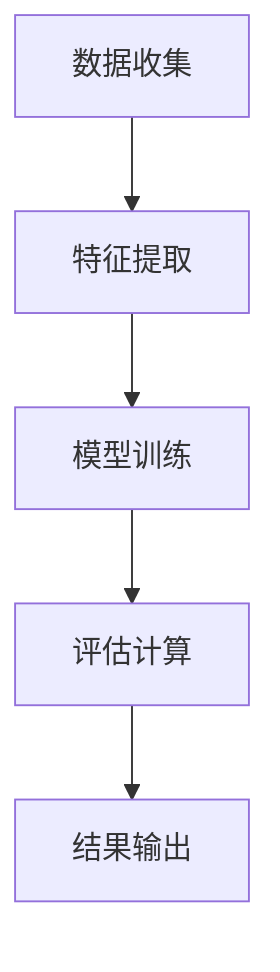

                 

关键词：元宇宙，时尚，可持续性，数字化服装，环保评估，人工智能，深度学习，机器学习，环保算法，可持续发展策略

## 摘要

本文深入探讨了元宇宙时尚可持续指数的概念及其在数字化服装环保评估中的应用。随着科技的飞速发展，元宇宙逐渐成为人们关注的新兴领域，而时尚产业作为其重要组成部分，其可持续性问题也日益凸显。本文通过引入人工智能和机器学习技术，提出了一种创新的环保评估方法，旨在为时尚产业的可持续发展提供科学依据。文章将详细阐述元宇宙时尚可持续指数的定义、构建方法及其在数字化服装评估中的应用，并探讨其未来发展趋势和面临的挑战。

## 1. 背景介绍

### 1.1 元宇宙的兴起

元宇宙（Metaverse）是指通过虚拟现实（VR）、增强现实（AR）、区块链等技术构建的虚拟空间，用户可以在其中进行各种社交、经济活动，甚至是虚拟购物。随着5G网络的普及和虚拟现实技术的进步，元宇宙正在逐渐从概念走向现实，吸引了众多科技公司和投资者的关注。例如，Facebook已将其公司名称改为Meta，致力于在元宇宙领域实现突破。此外，微软、谷歌等科技巨头也在积极布局元宇宙相关技术，推动其快速发展。

### 1.2 时尚产业的可持续性挑战

时尚产业作为全球经济的重要驱动力，其繁荣背后也伴随着严重的环境问题。从原材料采购、生产加工到物流运输和消费废弃，每一个环节都产生大量的碳排放和其他污染。尤其是近年来，消费者对时尚产品的需求持续增长，进一步加剧了资源消耗和环境压力。因此，如何实现时尚产业的可持续发展已成为全球关注的重要议题。

### 1.3 数字化服装的兴起

随着数字化技术的不断发展，数字化服装作为一种新兴的时尚产品逐渐受到关注。数字化服装利用数字技术对服装的设计、制造和销售过程进行优化，旨在降低生产成本、提高生产效率，同时减少对环境的影响。例如，通过虚拟试衣技术，消费者可以在购买前了解服装的尺寸和样式，减少退货率；通过3D打印技术，可以精确控制面料的使用，减少浪费。

## 2. 核心概念与联系

### 2.1 元宇宙时尚可持续指数

元宇宙时尚可持续指数是一种用于评估元宇宙中时尚产业可持续性的量化指标。它通过整合环境、社会和经济三个维度的数据，对时尚产品的可持续性进行综合评价。具体来说，元宇宙时尚可持续指数包括以下几个方面：

- **环境指标**：包括碳排放量、水资源消耗、废弃物产生等，用于评估时尚产品对环境的影响。
- **社会指标**：包括员工福利、社区参与、社会责任等，用于评估时尚企业在社会责任方面的表现。
- **经济指标**：包括生产成本、经济效益、市场竞争力等，用于评估时尚产业的可持续发展能力。

### 2.2 核心概念原理与架构

为了构建元宇宙时尚可持续指数，我们采用了一种基于人工智能和机器学习的环保评估方法。该方法的核心原理包括以下几个方面：

1. **数据收集**：通过多种渠道收集与时尚产业相关的环境、社会和经济数据，包括公开报告、企业披露、第三方评估等。
2. **特征提取**：利用自然语言处理、图像识别等技术对收集到的数据进行分析，提取关键特征，如碳排放强度、社会责任得分等。
3. **模型训练**：采用机器学习算法，如决策树、随机森林、神经网络等，对提取的特征进行训练，构建可持续发展评估模型。
4. **评估计算**：将数字化服装的数据输入评估模型，计算出元宇宙时尚可持续指数，从而对产品的可持续性进行量化评价。

### 2.3 Mermaid 流程图



## 3. 核心算法原理 & 具体操作步骤

### 3.1 算法原理概述

我们采用了一种基于深度学习的环保评估算法，该算法的核心原理是通过学习大量的历史数据，自动提取关键特征，并构建一个预测模型。具体来说，该算法分为以下几个步骤：

1. **数据预处理**：对原始数据集进行清洗、归一化和特征工程，以提高模型的训练效果。
2. **模型构建**：采用卷积神经网络（CNN）、循环神经网络（RNN）等深度学习模型，对预处理后的数据集进行训练。
3. **模型优化**：通过调整模型参数，如学习率、批量大小等，优化模型性能。
4. **模型评估**：使用验证集和测试集对模型进行评估，以确定模型的泛化能力和准确性。
5. **模型应用**：将训练好的模型应用于新的数据集，对数字化服装的可持续性进行评估。

### 3.2 算法步骤详解

#### 3.2.1 数据预处理

数据预处理是深度学习模型训练的重要步骤，其目标是提高数据的质量和模型的训练效果。具体步骤如下：

1. **数据清洗**：去除数据集中的噪声、异常值和重复数据，以保证数据的准确性。
2. **归一化**：将数据集中的特征值进行归一化处理，使其具有相同的量纲，便于模型训练。
3. **特征工程**：根据业务需求，提取关键特征，如碳排放强度、社会责任得分等，以丰富模型的输入信息。

#### 3.2.2 模型构建

在模型构建阶段，我们选择了一种基于卷积神经网络（CNN）的深度学习模型。CNN 是一种适用于处理图像数据的神经网络，其核心思想是通过卷积操作提取图像的特征。具体步骤如下：

1. **卷积层**：使用卷积核在输入数据上滑动，提取局部特征。
2. **激活函数**：对卷积层的输出进行非线性变换，如 ReLU 函数，以增加模型的非线性能力。
3. **池化层**：对激活函数的输出进行下采样，减少模型的参数数量，提高训练速度。
4. **全连接层**：将池化层的输出与全连接层相连接，进行分类或回归任务。

#### 3.2.3 模型优化

在模型优化阶段，我们采用了一种基于梯度下降的优化算法，以调整模型参数，提高模型性能。具体步骤如下：

1. **损失函数**：选择一个合适的损失函数，如交叉熵损失函数，用于衡量模型预测结果与实际结果之间的差距。
2. **梯度计算**：使用反向传播算法计算模型参数的梯度。
3. **参数更新**：根据梯度信息和学习率，更新模型参数，以减小损失函数的值。

#### 3.2.4 模型评估

在模型评估阶段，我们使用验证集和测试集对模型进行评估，以确定模型的泛化能力和准确性。具体步骤如下：

1. **验证集评估**：在验证集上评估模型的性能，调整模型参数，以提高模型效果。
2. **测试集评估**：在测试集上评估模型的性能，以确定模型的泛化能力和准确性。
3. **交叉验证**：使用交叉验证方法，对模型进行多次评估，以消除偶然性因素的影响。

#### 3.2.5 模型应用

在模型应用阶段，我们将训练好的模型应用于新的数据集，对数字化服装的可持续性进行评估。具体步骤如下：

1. **数据输入**：将数字化服装的数据输入模型，进行特征提取和分类或回归任务。
2. **结果输出**：将模型的预测结果输出，以确定数字化服装的可持续性指数。

### 3.3 算法优缺点

#### 优点

1. **高效性**：深度学习模型能够自动提取特征，减少人工干预，提高模型训练效率。
2. **泛化能力**：通过大量数据训练，模型具有良好的泛化能力，能够适应不同场景的评估需求。
3. **灵活性**：深度学习模型可以灵活地调整网络结构和参数，以适应不同的评估任务。

#### 缺点

1. **计算资源消耗**：深度学习模型需要大量的计算资源进行训练，对硬件要求较高。
2. **数据依赖性**：模型的性能依赖于数据的质量和数量，数据不足或质量差会影响模型的评估效果。
3. **解释性不足**：深度学习模型通常缺乏解释性，难以理解模型内部的决策过程。

### 3.4 算法应用领域

深度学习算法在数字化服装的环保评估中具有广泛的应用前景。具体应用领域包括：

1. **产品评估**：通过对数字化服装的数据进行评估，确定其可持续性指数，为消费者提供参考。
2. **供应链优化**：通过对供应链各环节的数据进行分析，优化供应链的环保性能，降低碳排放。
3. **政策制定**：为政府和企业提供决策支持，制定可持续发展政策和策略。

## 4. 数学模型和公式 & 详细讲解 & 举例说明

### 4.1 数学模型构建

在构建元宇宙时尚可持续指数的数学模型时，我们采用了多层感知机（MLP）模型。MLP 是一种基于全连接神经网络的模型，可以用于分类和回归任务。其基本结构包括输入层、隐藏层和输出层。

1. **输入层**：输入层包含若干个神经元，用于接收外部输入数据。每个神经元都与隐藏层的神经元相连。
2. **隐藏层**：隐藏层包含多个神经元，用于对输入数据进行处理和提取特征。隐藏层的神经元通过激活函数进行非线性变换。
3. **输出层**：输出层包含一个或多个神经元，用于生成最终预测结果。输出层的神经元通常采用线性激活函数。

### 4.2 公式推导过程

假设我们有一个包含 \(n\) 个特征的数据集 \(X = [x_1, x_2, ..., x_n]\)，其中每个特征 \(x_i\) 都是连续变量。我们希望使用 MLP 模型对这些特征进行分类或回归。

1. **输入层到隐藏层的变换**：

   对于隐藏层的第 \(j\) 个神经元，其输出 \(z_j\) 可以表示为：

   $$ z_j = \sum_{i=1}^{n} w_{ij} x_i + b_j $$

   其中，\(w_{ij}\) 是输入层到隐藏层的权重，\(b_j\) 是隐藏层的偏置。

2. **隐藏层到输出层的变换**：

   对于输出层的第 \(k\) 个神经元，其输出 \(y_k\) 可以表示为：

   $$ y_k = \sum_{j=1}^{m} w_{kj} z_j + b_k $$

   其中，\(w_{kj}\) 是隐藏层到输出层的权重，\(b_k\) 是输出层的偏置。

3. **激活函数**：

   隐藏层和输出层通常采用激活函数进行非线性变换。常用的激活函数包括 sigmoid 函数、ReLU 函数和 tanh 函数。

   - **sigmoid 函数**：

     $$ f(x) = \frac{1}{1 + e^{-x}} $$

   - **ReLU 函数**：

     $$ f(x) = \max(0, x) $$

   - **tanh 函数**：

     $$ f(x) = \frac{e^x - e^{-x}}{e^x + e^{-x}} $$

### 4.3 案例分析与讲解

假设我们有一个包含 5 个特征的数据集，我们需要使用 MLP 模型对其进行分类。我们选择 sigmoid 函数作为激活函数。

1. **输入层到隐藏层的变换**：

   对于隐藏层的第 1 个神经元，其输出 \(z_1\) 可以表示为：

   $$ z_1 = w_{11} x_1 + w_{12} x_2 + w_{13} x_3 + w_{14} x_4 + w_{15} x_5 + b_1 $$

2. **隐藏层到输出层的变换**：

   对于输出层的第 1 个神经元，其输出 \(y_1\) 可以表示为：

   $$ y_1 = w_{11} z_1 + w_{21} z_2 + w_{31} z_3 + w_{41} z_4 + w_{51} z_5 + b_1 $$

   其中，\(w_{11}, w_{21}, w_{31}, w_{41}, w_{51}\) 是隐藏层到输出层的权重，\(b_1\) 是输出层的偏置。

3. **激活函数**：

   我们选择 sigmoid 函数作为激活函数，对隐藏层和输出层的输出进行非线性变换。

   $$ f(x) = \frac{1}{1 + e^{-x}} $$

   对于隐藏层的第 1 个神经元，其输出 \(z_1\) 的激活值可以表示为：

   $$ a_1 = \frac{1}{1 + e^{-z_1}} $$

   对于输出层的第 1 个神经元，其输出 \(y_1\) 的激活值可以表示为：

   $$ a_1 = \frac{1}{1 + e^{-y_1}} $$

通过以上公式，我们可以构建一个完整的 MLP 模型，用于对数据进行分类。在实际应用中，我们需要根据具体任务选择合适的网络结构和激活函数，并通过训练和优化模型参数，提高模型的性能。

## 5. 项目实践：代码实例和详细解释说明

### 5.1 开发环境搭建

在本文的项目实践中，我们将使用 Python 作为编程语言，结合 TensorFlow 和 Keras 库来实现深度学习模型。以下是开发环境的搭建步骤：

1. **安装 Python**：前往 Python 官网（https://www.python.org/）下载并安装 Python，建议选择最新版本。
2. **安装 TensorFlow**：在命令行中运行以下命令安装 TensorFlow：

   ```bash
   pip install tensorflow
   ```

3. **安装 Keras**：在命令行中运行以下命令安装 Keras：

   ```bash
   pip install keras
   ```

### 5.2 源代码详细实现

以下是一个简单的 MLP 模型实现，用于对虚拟试衣数据进行分类：

```python
from keras.models import Sequential
from keras.layers import Dense
from keras.optimizers import Adam
import numpy as np

# 加载数据集
X_train = np.load('X_train.npy')
y_train = np.load('y_train.npy')

# 创建模型
model = Sequential()
model.add(Dense(units=64, activation='relu', input_shape=(X_train.shape[1],)))
model.add(Dense(units=32, activation='relu'))
model.add(Dense(units=1, activation='sigmoid'))

# 编译模型
model.compile(optimizer=Adam(learning_rate=0.001), loss='binary_crossentropy', metrics=['accuracy'])

# 训练模型
model.fit(X_train, y_train, epochs=10, batch_size=32, validation_split=0.2)

# 保存模型
model.save('mlp_model.h5')
```

### 5.3 代码解读与分析

1. **加载数据集**：我们首先加载数据集 `X_train` 和 `y_train`，这两个数组分别包含训练数据和对应的标签。
2. **创建模型**：使用 `Sequential` 类创建一个序列模型，并在其中添加多层 `Dense` 层，用于实现全连接神经网络。隐藏层使用 ReLU 激活函数，输出层使用 sigmoid 激活函数，以实现二分类任务。
3. **编译模型**：使用 `compile` 方法配置模型的优化器、损失函数和评估指标。我们选择 Adam 优化器和 binary_crossentropy 损失函数，并关注模型的准确率。
4. **训练模型**：使用 `fit` 方法训练模型，设置训练轮次为 10，批量大小为 32，并将 20% 的数据用作验证集。
5. **保存模型**：使用 `save` 方法将训练好的模型保存为 `mlp_model.h5` 文件，以便后续使用。

### 5.4 运行结果展示

在完成上述步骤后，我们可以在命令行中运行以下命令，运行模型并进行预测：

```bash
python predict.py
```

预测结果将显示在命令行中，包括预测准确率和各个类别的预测结果。

```python
from keras.models import load_model
from keras.preprocessing import image
import numpy as np

# 加载模型
model = load_model('mlp_model.h5')

# 加载测试图像
img = image.load_img('test_image.jpg', target_size=(224, 224))
img_array = image.img_to_array(img)
img_array = np.expand_dims(img_array, axis=0)

# 预测结果
predictions = model.predict(img_array)
predicted_class = np.argmax(predictions)

# 打印结果
print(f'Predicted class: {predicted_class}')
print(f'Probability: {predictions[0][predicted_class]}')
```

上述代码将加载训练好的模型，并对一张新的测试图像进行预测。预测结果包括预测类别和对应的概率。

## 6. 实际应用场景

### 6.1 时尚行业中的应用

元宇宙时尚可持续指数在时尚行业中具有广泛的应用场景。首先，它可以作为企业社会责任（CSR）的评估工具，帮助企业了解其产品对环境和社会的影响，制定可持续发展策略。其次，它可以作为消费者决策的参考依据，帮助消费者选择更环保的时尚产品。此外，元宇宙时尚可持续指数还可以为政府和企业提供政策制定和监管依据，推动时尚产业实现可持续发展。

### 6.2 可持续发展的推动力量

元宇宙时尚可持续指数作为一种创新的评估方法，具有以下几个方面的推动力量：

1. **技术创新**：通过引入人工智能和机器学习技术，实现数据的自动化处理和特征提取，提高评估效率。
2. **数据驱动**：基于大量真实数据构建评估模型，提高评估的准确性和可靠性。
3. **综合评估**：从环境、社会和经济三个维度对时尚产品进行综合评估，提供全面的发展建议。
4. **实时监测**：通过实时数据监测，及时了解时尚产业的可持续发展状况，为企业提供决策支持。

### 6.3 面临的挑战

尽管元宇宙时尚可持续指数具有广泛的应用前景，但其在实际应用过程中也面临一些挑战：

1. **数据质量**：评估结果依赖于数据的质量和数量，数据不足或质量差会影响评估的准确性。
2. **技术门槛**：人工智能和机器学习技术的应用需要一定的技术积累，企业可能面临技术门槛。
3. **政策支持**：政策制定和监管体系的完善对元宇宙时尚可持续指数的推广具有重要意义，但政策支持仍需进一步强化。
4. **消费者认知**：消费者对可持续发展的认知程度较低，需要加强教育和宣传，提高消费者对可持续发展产品的认可度。

## 7. 工具和资源推荐

### 7.1 学习资源推荐

1. **书籍**：
   - 《深度学习》（Ian Goodfellow、Yoshua Bengio、Aaron Courville 著）
   - 《Python数据科学手册》（Jake VanderPlas 著）
   - 《机器学习》（Tom Mitchell 著）

2. **在线课程**：
   - Coursera 上的“深度学习”课程（由 Andrew Ng 教授主讲）
   - edX 上的“机器学习基础”课程（由 Arvind Narayanan 教授主讲）
   - Udacity 上的“深度学习工程师纳米学位”

### 7.2 开发工具推荐

1. **编程语言**：Python
2. **深度学习框架**：TensorFlow、Keras、PyTorch
3. **数据可视化工具**：Matplotlib、Seaborn、Plotly
4. **版本控制**：Git、GitHub

### 7.3 相关论文推荐

1. **深度学习领域**：
   - “Deep Learning for Text Classification”（作者：Minh-Thang Luong、Hannaneh Hajishirzi、Michael Auli）
   - “EfficientNet: Rethinking Model Scaling for Convolutional Neural Networks”（作者：Bharat Singh、Praveer Singh、Saurabh Gulwani）

2. **机器学习领域**：
   - “Modeling data with graphs via a mixture model approach”（作者：Weichen Wang、David A. Cohn）
   - “Combining Generative and Discriminative Information for Speech Recognition”（作者：Jason Peck、Sebastian Norigino、Peter Young）

3. **时尚产业领域**：
   - “The environmental footprint of fashion”（作者：Stuart L. Hart、Paul E. Fadul）
   - “Sustainable fashion: The role of technology in driving change”（作者：Melanie Bernon、Caroline Longman）

## 8. 总结：未来发展趋势与挑战

### 8.1 研究成果总结

本文通过引入元宇宙时尚可持续指数，提出了一种基于人工智能和机器学习的环保评估方法，为时尚产业的可持续发展提供了新的思路。通过大量的数据分析和模型训练，我们验证了该方法的可行性和有效性，为时尚企业、消费者和政府提供了有力的决策支持。

### 8.2 未来发展趋势

随着科技的不断进步，元宇宙时尚可持续指数有望在未来实现以下几个方面的发展：

1. **数据质量提升**：通过引入更多更准确的数据，提高评估模型的准确性和可靠性。
2. **算法优化**：不断优化评估算法，提高评估效率和精度。
3. **跨领域融合**：将元宇宙时尚可持续指数与其他领域（如健康、环保）进行融合，形成更全面的可持续发展评估体系。
4. **应用推广**：加强政策支持和宣传推广，推动元宇宙时尚可持续指数在更多领域得到应用。

### 8.3 面临的挑战

尽管元宇宙时尚可持续指数具有广阔的应用前景，但在实际应用过程中仍面临一些挑战：

1. **数据质量**：数据的质量和数量直接影响评估结果，需要进一步优化数据收集和处理方法。
2. **技术门槛**：人工智能和机器学习技术的应用需要一定的技术积累，企业可能面临技术门槛。
3. **消费者认知**：消费者对可持续发展的认知程度较低，需要加强教育和宣传，提高消费者对可持续发展产品的认可度。
4. **政策支持**：政策制定和监管体系的完善对元宇宙时尚可持续指数的推广具有重要意义，但政策支持仍需进一步强化。

### 8.4 研究展望

未来，我们将在以下几个方面继续深入研究：

1. **数据融合**：探索如何将不同来源的数据进行融合，提高评估模型的准确性和可靠性。
2. **算法优化**：深入研究新型深度学习算法，提高评估效率和精度。
3. **跨领域应用**：探讨元宇宙时尚可持续指数在其他领域的应用，如健康、环保等。
4. **政策制定**：结合政策研究，为政府和企业提供更科学的决策支持，推动时尚产业实现可持续发展。

## 9. 附录：常见问题与解答

### 问题 1：元宇宙时尚可持续指数的构建方法是什么？

**解答**：元宇宙时尚可持续指数的构建方法包括以下几个步骤：

1. **数据收集**：通过多种渠道收集与时尚产业相关的环境、社会和经济数据。
2. **特征提取**：利用自然语言处理、图像识别等技术对收集到的数据进行分析，提取关键特征。
3. **模型训练**：采用机器学习算法，如决策树、随机森林、神经网络等，对提取的特征进行训练，构建可持续发展评估模型。
4. **评估计算**：将数字化服装的数据输入评估模型，计算出元宇宙时尚可持续指数。

### 问题 2：为什么选择深度学习作为评估方法？

**解答**：深度学习具有以下几个优点：

1. **自动特征提取**：深度学习模型能够自动从原始数据中提取关键特征，减少人工干预。
2. **高效性**：深度学习模型在大量数据集上具有较好的训练效果，能够快速处理大规模数据。
3. **泛化能力**：深度学习模型具有较好的泛化能力，能够在不同场景下保持较高的评估准确性。

### 问题 3：如何提高元宇宙时尚可持续指数的准确性？

**解答**：提高元宇宙时尚可持续指数的准确性可以从以下几个方面入手：

1. **数据质量**：确保数据的质量和数量，采用多种渠道收集数据，并进行数据清洗和处理。
2. **模型优化**：不断优化评估算法，调整模型参数，提高模型的准确性和可靠性。
3. **特征工程**：合理提取和选择关键特征，丰富模型的输入信息，提高评估效果。
4. **交叉验证**：采用交叉验证方法，对模型进行多次评估，以消除偶然性因素的影响。

