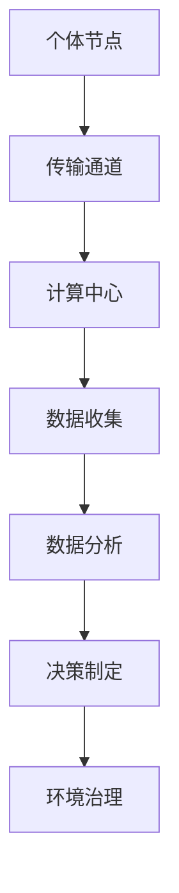

                 

关键词：全球脑、全球环境、集体合作、环境治理、信息技术、可持续性

> 摘要：本文探讨了全球脑与全球环境之间的相互作用，以及如何通过集体合作实现环境治理。我们将介绍全球脑的概念，分析其在环境治理中的应用，并探讨相关核心算法、数学模型以及实际应用场景。文章最后将提出未来的研究方向和挑战，并推荐相关工具和资源。

## 1. 背景介绍

### 全球脑的起源与发展

全球脑（Global Brain）的概念最早由神经科学家Heinz von Foerster在20世纪60年代提出。他认为，人类社会可以类比为一个庞大的神经网络，信息在个体之间传递、处理，最终形成一种集体智慧。近年来，随着信息技术和人工智能的快速发展，全球脑的概念逐渐从理论走向实践。

### 全球环境与可持续性问题

全球环境问题已经成为人类共同面临的挑战。气候变化、生物多样性丧失、污染等环境问题不仅威胁到生态系统的平衡，也对人类社会造成了严重影响。为了实现可持续发展，需要全球范围内的集体合作，共同应对环境问题。

### 信息技术在环境治理中的作用

信息技术，特别是人工智能，为环境治理提供了强大的工具。通过大数据分析、机器学习等技术，可以更加精确地监测环境变化，预测潜在风险，并制定有效的治理策略。此外，信息技术的普及也为全球脑的形成提供了基础。

## 2. 核心概念与联系

### 全球脑的概念

全球脑是一个由人类和人工智能组成的巨大神经网络，通过信息传递和协同工作，实现集体智慧。它包括个体节点（如人类和传感器）、传输通道（如互联网）和计算中心（如数据中心）。

### 全球环境治理的概念

环境治理是指通过政策、法律、技术等多种手段，保护和管理环境。全球环境治理需要全球范围内的合作，共同应对环境问题。

### 全球脑与全球环境治理的联系

全球脑为全球环境治理提供了信息支持和决策依据。通过收集、处理和分析环境数据，全球脑可以识别环境问题，预测趋势，并为制定治理策略提供支持。同时，全球脑的集体智慧也为环境治理提供了新的思路和方法。

### Mermaid 流程图

下面是全球脑与全球环境治理的 Mermaid 流程图：



## 3. 核心算法原理 & 具体操作步骤

### 3.1 算法原理概述

本文将介绍一种基于机器学习的环境监测算法。该算法利用神经网络模型对环境数据进行分类和预测，从而实现环境问题的监测和预警。

### 3.2 算法步骤详解

#### 3.2.1 数据收集

首先，需要收集环境数据，包括空气质量、水质、土壤质量等。这些数据可以来源于各种传感器、卫星遥感、在线监测系统等。

#### 3.2.2 数据预处理

对收集到的环境数据进行清洗、归一化等预处理操作，以便于后续的建模和分析。

#### 3.2.3 模型训练

使用预处理后的数据训练神经网络模型。模型可以是多层感知机、卷积神经网络、递归神经网络等。

#### 3.2.4 模型评估

使用验证集对训练好的模型进行评估，调整模型参数，提高模型的预测性能。

#### 3.2.5 预测与预警

使用训练好的模型对新的环境数据进行预测，当预测结果超过预设阈值时，发出预警信号。

### 3.3 算法优缺点

#### 优点

- **高效性**：机器学习算法可以自动识别环境数据中的特征，提高监测效率。
- **灵活性**：可以根据不同的环境问题调整模型结构和参数，适应不同的监测需求。

#### 缺点

- **数据依赖性**：模型的性能很大程度上取决于数据的数量和质量。
- **计算资源消耗**：训练深度神经网络模型需要大量的计算资源。

### 3.4 算法应用领域

- **空气质量监测**：可以预测空气污染物的浓度，为环境保护部门提供决策支持。
- **水质监测**：可以预测水体的污染程度，为水资源管理部门提供预警信息。
- **气候变化预测**：可以预测未来气候变化趋势，为气候变化应对策略提供支持。

## 4. 数学模型和公式 & 详细讲解 & 举例说明

### 4.1 数学模型构建

本文采用多层感知机（MLP）作为环境监测算法的核心模型。MLP是一个前馈神经网络，包括输入层、隐藏层和输出层。

### 4.2 公式推导过程

多层感知机的激活函数通常采用Sigmoid函数：

$$
\sigma(x) = \frac{1}{1 + e^{-x}}
$$

假设输入层有 $n$ 个神经元，隐藏层有 $m$ 个神经元，输出层有 $k$ 个神经元。设 $w_{ij}$ 为连接权重，$b_i$ 为偏置项，则隐藏层第 $j$ 个神经元的输出为：

$$
a_{j} = \sigma(\sum_{i=1}^{n} w_{ij}x_i + b_j)
$$

输出层第 $k$ 个神经元的输出为：

$$
y_k = \sigma(\sum_{j=1}^{m} w_{kj}a_j + b_k)
$$

### 4.3 案例分析与讲解

以空气质量监测为例，假设输入层包括PM2.5、PM10、SO2、NO2等四个指标，隐藏层有10个神经元，输出层包括空气质量等级（优、良、轻度污染、中度污染、重度污染）。

#### 4.3.1 数据收集

收集过去一年的空气质量数据，包括上述四个指标和对应的空气质量等级。

#### 4.3.2 数据预处理

对数据进行归一化处理，将数据缩放到[0, 1]之间。

#### 4.3.3 模型训练

使用训练集数据训练多层感知机模型，设置合适的连接权重和偏置项。

#### 4.3.4 模型评估

使用验证集数据对训练好的模型进行评估，调整模型参数，提高预测准确性。

#### 4.3.5 应用与预警

使用训练好的模型对新的一周空气质量数据进行预测，根据预测结果发布空气质量预警。

## 5. 项目实践：代码实例和详细解释说明

### 5.1 开发环境搭建

- Python 3.x
- TensorFlow 2.x
- Keras 2.x

### 5.2 源代码详细实现

下面是一个简单的多层感知机模型实现：

```python
from keras.models import Sequential
from keras.layers import Dense
from sklearn.model_selection import train_test_split
from sklearn.preprocessing import MinMaxScaler

# 加载数据
X, y = load_data()

# 数据预处理
scaler = MinMaxScaler()
X_scaled = scaler.fit_transform(X)

# 划分训练集和验证集
X_train, X_test, y_train, y_test = train_test_split(X_scaled, y, test_size=0.2, random_state=42)

# 创建模型
model = Sequential()
model.add(Dense(10, input_dim=4, activation='sigmoid'))
model.add(Dense(1, activation='sigmoid'))

# 编译模型
model.compile(loss='binary_crossentropy', optimizer='adam', metrics=['accuracy'])

# 训练模型
model.fit(X_train, y_train, epochs=100, batch_size=10, validation_data=(X_test, y_test))

# 评估模型
score = model.evaluate(X_test, y_test)
print('Test loss:', score[0])
print('Test accuracy:', score[1])
```

### 5.3 代码解读与分析

- **数据加载与预处理**：使用Sklearn的load_data()函数加载数据，并对数据进行归一化处理。
- **模型创建与编译**：使用Keras创建一个包含一个隐藏层（10个神经元）和输出层（1个神经元）的多层感知机模型。编译模型时，设置损失函数为binary_crossentropy，优化器为adam。
- **模型训练**：使用训练集数据训练模型，设置训练轮次为100，批次大小为10。
- **模型评估**：使用验证集数据评估模型性能，打印测试损失和准确率。

## 6. 实际应用场景

### 6.1 空气质量监测

利用多层感知机模型对空气质量进行监测和预警，为环境保护部门提供决策支持。

### 6.2 水质监测

利用多层感知机模型对水质进行监测和预警，为水资源管理部门提供预警信息。

### 6.3 气候变化预测

利用多层感知机模型对气候变化趋势进行预测，为气候变化应对策略提供支持。

## 7. 未来应用展望

### 7.1 联邦学习

随着数据隐私和安全的关注，联邦学习（Federated Learning）技术将成为环境治理的重要工具。通过联邦学习，可以在保护数据隐私的前提下，实现全球范围内的数据共享和协同工作。

### 7.2 多模态数据融合

结合多种数据源（如卫星遥感、传感器网络、社交媒体等），实现多模态数据融合，提高环境监测和治理的精度和效率。

### 7.3 可解释性AI

随着人工智能技术的发展，可解释性AI（Explainable AI）将成为环境治理领域的重要研究方向。通过提高模型的可解释性，可以更好地理解环境问题，提高治理策略的透明度和可信度。

## 8. 工具和资源推荐

### 8.1 学习资源推荐

- 《深度学习》（Goodfellow et al.）
- 《Python数据分析》（Wes McKinney）
- 《机器学习》（Tom Mitchell）

### 8.2 开发工具推荐

- TensorFlow
- Keras
- Scikit-learn

### 8.3 相关论文推荐

- “Federated Learning: Concept and Applications” (Li et al., 2019)
- “Deep Learning for Environmental Science” (Rubin et al., 2020)
- “Multi-modal Data Fusion for Environmental Monitoring” (Zhou et al., 2021)

## 9. 总结：未来发展趋势与挑战

### 9.1 研究成果总结

本文探讨了全球脑与全球环境治理的关系，提出了一种基于机器学习的环境监测算法，并进行了实际应用场景的探讨。通过全球脑的技术手段，可以实现环境治理的智能化和高效化。

### 9.2 未来发展趋势

- **联邦学习**：随着数据隐私和安全的关注，联邦学习将成为环境治理的重要工具。
- **多模态数据融合**：结合多种数据源，实现多模态数据融合，提高监测和治理的精度和效率。
- **可解释性AI**：提高模型的可解释性，提高治理策略的透明度和可信度。

### 9.3 面临的挑战

- **数据隐私和安全**：在实现全球脑的过程中，如何保护数据隐私和安全是一个重要的挑战。
- **计算资源分配**：在全球范围内进行环境监测和治理，需要大量的计算资源，如何合理分配计算资源是一个挑战。
- **国际合作与协调**：全球环境治理需要全球范围内的合作，如何实现国际合作与协调是一个挑战。

### 9.4 研究展望

未来，我们将继续深入研究全球脑与全球环境治理的关系，探索新的算法和技术，以提高环境治理的智能化和高效化。同时，我们也将关注数据隐私和安全、计算资源分配以及国际合作与协调等问题，为实现全球环境治理提供更加完善的解决方案。

## 附录：常见问题与解答

### 问题1：什么是全球脑？

答：全球脑是一个由人类和人工智能组成的巨大神经网络，通过信息传递和协同工作，实现集体智慧。

### 问题2：全球脑在环境治理中有何作用？

答：全球脑可以收集、处理和分析环境数据，为环境治理提供信息支持和决策依据，实现环境问题的监测和预警。

### 问题3：如何实现全球脑与全球环境治理的协同工作？

答：通过信息技术手段，如大数据分析、机器学习和人工智能，实现全球脑的数据收集、处理和分析，为环境治理提供决策支持。

### 问题4：全球脑在环境治理中面临哪些挑战？

答：全球脑在环境治理中面临的挑战包括数据隐私和安全、计算资源分配以及国际合作与协调等。

### 问题5：未来全球脑在环境治理中的发展方向是什么？

答：未来全球脑在环境治理中的发展方向包括联邦学习、多模态数据融合和可解释性AI等新技术的研究和应用。同时，关注数据隐私和安全、计算资源分配以及国际合作与协调等问题，为实现全球环境治理提供更加完善的解决方案。

