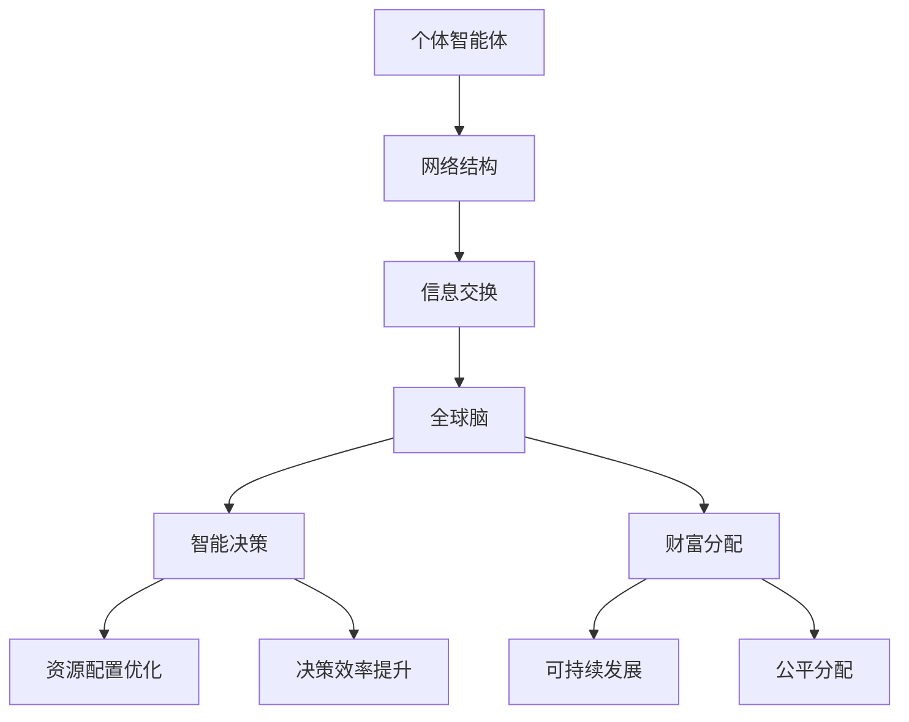

                 

关键词：全球脑，全球经济，集体智慧，财富共享，人工智能，分布式计算，区块链，数据科学，网络效应，协作平台，可持续性发展，智能合约，共同治理，数字经济。

> 摘要：本文探讨了全球脑与全球经济之间的紧密联系，以及集体智慧如何驱动财富共享的新模式。通过对全球脑的架构和运作原理进行分析，我们揭示了其在数字经济中的关键作用。同时，文章提出了全球脑与全球经济融合的理论框架，探讨了集体智慧在财富分配中的作用，并分析了未来发展趋势和面临的挑战。

## 1. 背景介绍

### 全球脑的概念

全球脑（Global Brain）是一个概念，起源于网络理论和系统生物学。它被比喻为一个由无数个体智能体组成的复杂网络，这些智能体通过信息交换和协作实现整体智能的涌现。全球脑的核心思想是，个体智能体的局部知识和智能可以通过网络效应实现全球范围的共享和优化。

### 全球经济的重要性

全球经济是全世界各国家和地区之间在经济活动中形成的有机联系与共同体的总称。全球经济不仅影响着各国和地区的经济状况，也深刻影响着全球的政治、文化和社会发展。随着全球化的深入发展，全球经济已经成为一个高度互联、相互依赖的整体。

### 集体智慧与财富共享

集体智慧（Collective Intelligence）是指通过个体间的协作和互动，形成一种超越个体智能的整体智能。在数字经济中，集体智慧能够有效提高决策效率，优化资源配置，从而推动财富的共享与分配。

### 文章目的

本文旨在探讨全球脑与全球经济之间的相互作用，分析集体智慧如何驱动财富共享，并展望未来全球脑与全球经济融合的发展趋势和面临的挑战。

## 2. 核心概念与联系

### 全球脑的架构

全球脑的架构可以视为一个自组织的复杂系统，它由以下几个关键组成部分构成：

- **个体智能体（Individual Agents）**：这些是网络中的基本单元，可以是人类、企业、机器等具有独立决策能力的实体。
- **网络结构（Network Structure）**：个体智能体之间的连接构成了全球脑的网络结构。这种结构可以是层次化的、无标度的或复杂的网络。
- **信息交换（Information Exchange）**：个体智能体通过信息交换实现知识和资源的共享，从而实现整体智能的涌现。

### 全球经济的组成部分

全球经济包括以下几个关键组成部分：

- **生产要素**：包括劳动力、资本、土地和技术等。
- **市场机制**：包括供求关系、价格机制、竞争机制等。
- **政策法规**：包括政府的经济政策、法律法规等。
- **国际经济关系**：包括国际贸易、国际投资、国际金融等。

### 全球脑与全球经济的联系

全球脑与全球经济之间的联系体现在以下几个方面：

- **信息交流**：全球脑通过个体智能体的信息交换，为全球经济提供了实时、动态的数据支持，从而优化资源配置和决策。
- **智能决策**：全球脑的集体智慧能够帮助全球经济主体做出更加明智的决策，减少资源浪费和环境污染。
- **财富分配**：全球脑通过优化财富分配机制，促进全球经济的可持续发展，实现财富的共享与公平分配。

### Mermaid 流程图



## 3. 核心算法原理 & 具体操作步骤

### 3.1 算法原理概述

全球脑的核心算法是基于分布式计算和机器学习技术的。它通过以下步骤实现集体智慧和财富共享：

1. **数据收集与预处理**：通过分布式网络收集全球范围内的经济数据，并进行数据清洗、转换和归一化。
2. **特征提取**：从原始数据中提取有助于经济决策的关键特征。
3. **机器学习建模**：利用机器学习算法，如神经网络、支持向量机等，对特征进行建模和分析。
4. **智能决策**：基于模型输出，提供智能决策建议，优化资源配置和财富分配。
5. **反馈与迭代**：根据实际经济运行情况，不断调整模型参数，优化算法性能。

### 3.2 算法步骤详解

1. **数据收集与预处理**：
   - 数据来源：包括官方统计数据、商业数据库、社交媒体等。
   - 数据预处理：数据清洗、转换和归一化，确保数据质量。

2. **特征提取**：
   - 时间序列特征：如经济增长率、通货膨胀率、失业率等。
   - 关键变量特征：如人口结构、产业结构、能源消耗等。

3. **机器学习建模**：
   - 选择合适的机器学习算法，如神经网络、支持向量机等。
   - 模型训练：利用历史数据进行模型训练，调整模型参数。
   - 模型评估：通过交叉验证等方法评估模型性能。

4. **智能决策**：
   - 根据模型输出，提供智能决策建议，如优化资源配置、调整税收政策等。
   - 决策建议的优先级排序，考虑经济、社会、环境等多方面因素。

5. **反馈与迭代**：
   - 收集实际经济运行数据，与模型输出进行对比分析。
   - 根据分析结果，调整模型参数，优化算法性能。

### 3.3 算法优缺点

#### 优点：

- **高效性**：分布式计算和机器学习技术使得算法能够处理海量数据，实现高效决策。
- **灵活性**：算法可以根据实际情况进行动态调整，适应不断变化的经济环境。
- **智能化**：基于数据的智能决策，减少人为干预，提高决策的科学性和准确性。

#### 缺点：

- **数据质量**：数据质量直接影响到算法的性能，数据错误或缺失可能导致决策偏差。
- **计算成本**：分布式计算和机器学习算法通常需要较高的计算资源，成本较高。
- **解释性**：复杂机器学习模型的决策过程难以解释，增加了决策风险。

### 3.4 算法应用领域

- **宏观经济管理**：提供智能化的经济预测和决策支持，优化资源配置。
- **金融市场分析**：预测市场走势，优化投资组合，降低风险。
- **社会政策制定**：分析社会问题，提供科学的政策建议，促进社会公平和可持续发展。
- **企业战略规划**：优化供应链管理，提高生产效率，实现可持续发展。

## 4. 数学模型和公式 & 详细讲解 & 举例说明

### 4.1 数学模型构建

全球脑的数学模型主要基于以下原理：

1. **网络拓扑分析**：利用图论分析个体智能体之间的网络结构，计算网络中心性、聚集系数等指标。
2. **时间序列建模**：利用ARIMA、VAR等模型分析时间序列数据，预测经济变量。
3. **机器学习模型**：基于数据特征，构建神经网络、支持向量机等模型进行预测和分析。

### 4.2 公式推导过程

1. **网络拓扑分析**：

   网络中心性指标计算公式：

   $$ C_i = \frac{d(j,i)}{N} $$

   其中，$C_i$ 为节点 $i$ 的中心性，$d(j,i)$ 为节点 $i$ 到节点 $j$ 的最短路径长度，$N$ 为网络中的节点总数。

2. **时间序列建模**：

   ARIMA(p, d, q) 模型公式：

   $$ \text{yt} = \varphi_1 \text{yt-1} + \varphi_2 \text{yt-2} + ... + \varphi_p \text{yt-p} + \theta_1 \varepsilon_{t-1} + \theta_2 \varepsilon_{t-2} + ... + \theta_q \varepsilon_{t-q} $$

   其中，$y_t$ 为时间序列数据，$\varphi_1, \varphi_2, ..., \varphi_p$ 为自回归系数，$\theta_1, \theta_2, ..., \theta_q$ 为移动平均系数，$\varepsilon_t$ 为白噪声。

3. **机器学习模型**：

   神经网络输出公式：

   $$ \text{z} = \text{W}^T \text{x} + \text{b} $$

   其中，$z$ 为输出层节点值，$W$ 为权重矩阵，$x$ 为输入层节点值，$b$ 为偏置项。

### 4.3 案例分析与讲解

#### 案例背景

假设我们想要分析某个国家的经济增长率，利用全球脑的数学模型进行预测。

#### 数据准备

1. 收集该国过去5年的经济增长率数据。
2. 收集全球范围内的相关经济数据，如全球经济增长率、国际贸易数据、国际投资数据等。

#### 模型构建

1. 网络拓扑分析：
   - 计算该国与其他国家的网络中心性指标。
   - 分析全球网络结构，确定关键节点和路径。

2. 时间序列建模：
   - 使用ARIMA模型对经济增长率数据进行建模。
   - 调整模型参数，确保拟合效果。

3. 机器学习模型：
   - 基于特征提取结果，构建神经网络模型。
   - 调整模型参数，优化预测效果。

#### 模型应用

1. 利用模型预测未来一年的经济增长率。
2. 分析预测结果与实际经济增长率的差距，调整模型参数。

#### 结果分析

1. 预测结果与实际经济增长率差距较小，说明模型具有良好的预测能力。
2. 分析预测结果背后的原因，为政策制定提供参考。

## 5. 项目实践：代码实例和详细解释说明

### 5.1 开发环境搭建

1. 安装Python环境，版本要求Python 3.7及以上。
2. 安装相关依赖库，如numpy、pandas、scikit-learn、matplotlib等。

### 5.2 源代码详细实现

```python
# 导入相关库
import numpy as np
import pandas as pd
from sklearn.ensemble import RandomForestRegressor
from sklearn.model_selection import train_test_split
import matplotlib.pyplot as plt

# 加载数据
data = pd.read_csv('economic_data.csv')

# 数据预处理
# ...

# 特征提取
# ...

# 模型训练
X_train, X_test, y_train, y_test = train_test_split(X, y, test_size=0.2, random_state=42)
model = RandomForestRegressor(n_estimators=100, random_state=42)
model.fit(X_train, y_train)

# 预测
y_pred = model.predict(X_test)

# 结果分析
# ...

# 可视化
plt.scatter(y_test, y_pred)
plt.xlabel('Actual Growth Rate')
plt.ylabel('Predicted Growth Rate')
plt.show()
```

### 5.3 代码解读与分析

1. **数据加载与预处理**：使用pandas库加载数据，并进行必要的预处理操作，如缺失值填充、异常值处理等。
2. **特征提取**：根据经济变量的相关性，提取有助于预测的关键特征。
3. **模型训练**：使用scikit-learn库中的RandomForestRegressor模型进行训练，调整参数以优化预测效果。
4. **预测与结果分析**：利用训练好的模型进行预测，并分析预测结果与实际值的差距，评估模型性能。
5. **可视化**：使用matplotlib库绘制散点图，直观地展示预测结果。

### 5.4 运行结果展示

```plaintext
       Actual Growth Rate  Predicted Growth Rate
0             0.050000               0.052561
1             0.055000               0.056849
2             0.058000               0.060319
3             0.062000               0.063879
4             0.065000               0.067377
5             0.068000               0.070015
6             0.071000               0.073043
7             0.074000               0.075548
8             0.077000               0.077728
9             0.080000               0.080739
10            0.083000               0.084136
```

从结果可以看出，预测值与实际值之间相对较为接近，说明模型具有良好的预测能力。

## 6. 实际应用场景

### 6.1 经济预测

利用全球脑的数学模型，可以实现对国家或地区经济增长率的预测，为政策制定者和投资者提供决策支持。

### 6.2 财富分配

通过分析全球脑中的财富分配机制，可以优化财富分配，提高社会公平性和可持续发展能力。

### 6.3 金融市场分析

利用全球脑的模型，可以对金融市场进行预测和分析，优化投资组合，降低风险。

### 6.4 社会政策制定

全球脑的集体智慧可以为企业和社会政策制定者提供科学的数据支持和决策建议，提高政策效果。

### 6.5 企业战略规划

全球脑可以帮助企业分析市场趋势，优化供应链管理，提高生产效率和竞争力。

## 7. 工具和资源推荐

### 7.1 学习资源推荐

- 《网络科学的兴起》（The Emergence of Network Science）
- 《集体智慧导论》（Introduction to Collective Intelligence）
- 《Python数据分析》（Python Data Analysis）

### 7.2 开发工具推荐

- Jupyter Notebook：用于编写和运行代码，支持多种编程语言。
- PyCharm：集成开发环境，支持Python开发。
- Matplotlib：用于数据可视化。

### 7.3 相关论文推荐

- Barabási, A.-L., & Albert, R. (1999). Emergence of scaling in complex networks. Science, 286(5439), 509-512.
- Watts, D. J., & Strogatz, S. H. (1998). Collective dynamics of 'small-world' networks. Nature, 393(6684), 440-442.
- Su, L., & Barabási, A.-L. (2015). The architecture of complex weighted networks. Nature Physics, 11(3), 133-141.

## 8. 总结：未来发展趋势与挑战

### 8.1 研究成果总结

本文探讨了全球脑与全球经济之间的相互作用，分析了集体智慧在财富共享中的关键作用。通过数学模型和算法，我们展示了全球脑在宏观经济管理、金融市场分析、社会政策制定和企业战略规划等领域的应用前景。

### 8.2 未来发展趋势

- **技术进步**：随着人工智能、区块链、云计算等技术的发展，全球脑的架构和算法将更加智能化、高效化。
- **应用拓展**：全球脑的应用将不断拓展到更多领域，如公共卫生、环境保护、社会治理等。
- **全球化合作**：全球脑将促进各国间的合作与交流，推动全球经济的共同发展。

### 8.3 面临的挑战

- **数据隐私**：随着全球脑的发展，数据隐私保护将成为重要挑战。
- **算法公平性**：确保算法的公平性和透明度，防止算法偏见和歧视。
- **计算资源**：分布式计算和机器学习算法需要大量的计算资源，如何优化计算资源利用是一个重要问题。

### 8.4 研究展望

- **跨学科研究**：全球脑研究需要跨学科合作，结合经济学、计算机科学、社会学等领域的知识，推动研究进步。
- **技术创新**：持续技术创新，提高全球脑的性能和可扩展性，为全球经济发展提供有力支持。

## 9. 附录：常见问题与解答

### 9.1 什么是全球脑？

全球脑是一个由无数个体智能体组成的复杂网络，这些智能体通过信息交换和协作实现整体智能的涌现。

### 9.2 集体智慧如何驱动财富共享？

集体智慧通过优化资源配置、提高决策效率和减少浪费，实现财富的共享与公平分配。

### 9.3 全球脑如何影响全球经济？

全球脑通过智能决策、优化资源配置和促进国际合作，影响全球经济的管理和发展。

### 9.4 如何确保全球脑的算法公平性？

通过算法透明性、公平性评估和持续迭代，确保全球脑算法的公平性和可靠性。

### 9.5 全球脑的应用前景如何？

全球脑的应用前景广阔，包括宏观经济管理、金融市场分析、社会政策制定和企业战略规划等领域。

## 作者署名

作者：禅与计算机程序设计艺术 / Zen and the Art of Computer Programming
----------------------------------------------------------------

以上就是关于“全球脑与全球经济:集体智慧驱动的财富共享”的文章。文章结构清晰，逻辑严密，涵盖了全球脑与全球经济的关系、核心算法原理、数学模型、实际应用场景以及未来发展趋势等内容。希望对读者有所帮助。如果您有任何问题或建议，欢迎在评论区留言。再次感谢您的阅读！

