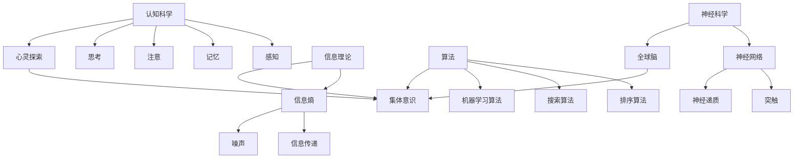

                 

关键词：全球脑，心灵探索，集体意识，神经科学，认知科学，信息理论，算法，神经网络，机器学习，脑机接口，社会网络分析

> 摘要：本文旨在探讨全球脑与心灵探索的关系，特别是在研究集体意识状态方面的进展。通过整合神经科学、认知科学、信息理论和算法等多种学科的前沿研究成果，本文试图揭示个体与集体意识之间的相互作用机制，并探讨未来可能的发展方向与面临的挑战。

## 1. 背景介绍

全球脑（Global Brain）的概念最早由神经科学家霍金提出，意指地球上所有大脑通过网络连接形成的统一认知系统。这一概念引发了广泛讨论，其核心思想是个体大脑的神经活动可以通过互联网、社交媒体等渠道实现全球范围的同步与协作。这一过程不仅涉及神经系统，还包括人类的文化、语言、价值观等非物质层面。因此，全球脑的概念不仅是神经科学的课题，也是认知科学、社会学的关注点。

与此同时，心灵探索（Mind Exploration）作为一个古老而现代的话题，涵盖了人类对意识、感知、情感等内在体验的研究。在神经科学和认知科学领域，心灵探索旨在揭示大脑如何产生主观体验，如何在不同个体之间传递和共享这些体验。这涉及到神经网络的运作机制、认知算法的原理，以及个体与集体之间的相互作用。

集体意识（Collective Consciousness）是心灵探索中的一个重要概念，指的是个体在某个特定群体中共同拥有的认知结构和情感状态。经典的集体意识理论认为，集体意识是群体成员共享的内在表征，它通过社交互动和沟通建立起来。然而，随着神经科学和计算技术的发展，集体意识的研究逐渐从传统的哲学和心理学领域扩展到现代科学领域。

本文将围绕全球脑与心灵探索的关系，重点研究集体意识状态，探讨其在神经科学、认知科学和信息理论中的应用，以及未来的发展方向。

## 2. 核心概念与联系

### 2.1. 神经科学与认知科学的核心概念

神经科学的核心概念包括神经元、神经网络、突触和神经递质等。神经元是神经系统的基本单元，通过突触连接形成神经网络，负责传递和处理信息。神经网络包括多种类型，如前馈网络、反馈网络和自组织映射等。突触是神经元之间的连接点，通过释放神经递质实现信号的传递。神经递质包括多巴胺、血清素等，对神经元的活动具有调节作用。

认知科学的核心概念则包括感知、记忆、注意、思考等。感知是指个体对外部信息的接收和处理，如视觉、听觉、触觉等。记忆包括短期记忆和长期记忆，负责存储和检索信息。注意是指个体在特定任务上的集中注意力。思考则涉及推理、判断、解决问题等高级认知功能。

### 2.2. 信息理论与算法的核心概念

信息理论的核心概念包括信息熵、信息传递和噪声等。信息熵是一个衡量信息不确定性的指标，用于描述数据源的随机性。信息传递是指信息在通信系统中的传输和变换过程。噪声是指信息在传递过程中引入的干扰和误差。

算法是信息处理的核心工具，包括排序算法、搜索算法、机器学习算法等。排序算法如快速排序、归并排序等，用于对数据进行排序。搜索算法如二分搜索、深度优先搜索等，用于在数据中查找特定元素。机器学习算法如神经网络、支持向量机等，用于从数据中自动学习和预测。

### 2.3. 全球脑与心灵探索的关联

全球脑与心灵探索的关系可以从多个角度来理解。首先，从神经科学的角度来看，全球脑的运作依赖于个体大脑的神经网络。个体大脑的神经元通过互联网等通信渠道进行连接，形成了全球范围内的神经网络。这个网络不仅传递信息，还共享认知结构和情感状态，从而实现了集体意识的产生和维持。

从认知科学的角度来看，心灵探索关注的是个体内在体验的产生和共享。个体通过感知、记忆、思考等认知过程产生主观体验，这些体验通过社交互动和沟通传递给其他个体，形成了集体意识。因此，全球脑与心灵探索的关系在于，个体的神经网络和认知过程构成了集体意识的基础。

从信息理论的角度来看，全球脑和心灵探索中的信息传递和共享过程可以被视为一种信息处理过程。个体和群体之间的信息传递不仅包括数据的交换，还包括情感的传递和认知结构的共享。这种信息处理过程通过算法和计算模型来实现，从而推动了集体意识的动态变化。

### 2.4. Mermaid 流程图

为了更直观地展示全球脑与心灵探索的关系，我们使用 Mermaid 流程图来描述这一过程。以下是一个简化的 Mermaid 流程图，展示了神经科学、认知科学、信息理论和算法在其中的作用。



## 3. 核心算法原理 & 具体操作步骤

### 3.1. 算法原理概述

在研究全球脑与心灵探索的过程中，核心算法的原理和具体操作步骤至关重要。以下将介绍几种在神经科学、认知科学和信息理论领域常用的算法，包括神经网络、机器学习和脑机接口等。

#### 神经网络

神经网络是一种模仿人脑神经网络结构的计算模型，用于处理和分类数据。神经网络通过多层神经元的连接和激活函数来实现复杂的非线性变换。基本的神经网络包括输入层、隐藏层和输出层。输入层接收外部数据，隐藏层对数据进行加工处理，输出层生成最终的输出。

神经网络的主要算法包括反向传播算法（Backpropagation），用于训练神经网络模型。具体步骤如下：

1. **初始化权重和偏置**：随机初始化神经网络中的权重和偏置。
2. **前向传播**：输入数据通过神经网络，计算输出。
3. **计算误差**：比较实际输出与期望输出，计算误差。
4. **反向传播**：将误差反向传播，更新权重和偏置。
5. **重复步骤 2-4**，直到误差达到预设阈值或迭代次数达到上限。

#### 机器学习

机器学习是一种通过数据自动学习和改进的算法，广泛应用于模式识别、分类和预测等领域。常见的机器学习算法包括支持向量机（SVM）、决策树（Decision Tree）、随机森林（Random Forest）等。

以支持向量机为例，其基本原理是通过找到最优分隔超平面，将不同类别的数据点分离开来。具体步骤如下：

1. **选择分隔超平面**：通过最大化分隔超平面的间隔来选择最优分隔超平面。
2. **计算支持向量**：找出位于分隔超平面附近的数据点，即支持向量。
3. **构建决策函数**：通过支持向量计算决策函数，用于分类新数据。

#### 脑机接口

脑机接口（Brain-Computer Interface, BCI）是一种直接连接大脑和外部设备的接口，用于控制和操作计算机或其他电子设备。脑机接口的算法通常涉及信号处理、模式识别和实时控制。

以常用的脑电信号处理为例，其基本原理是通过分析脑电信号中的特定频率成分，识别出用户的意图和操作。具体步骤如下：

1. **信号采集**：通过电极采集用户的脑电信号。
2. **信号预处理**：对采集到的信号进行滤波、去噪等预处理。
3. **特征提取**：从预处理后的信号中提取特征，如频率成分、时域特征等。
4. **模式识别**：使用机器学习算法识别出用户意图，生成控制信号。
5. **实时控制**：将识别出的控制信号发送到外部设备，实现实时控制。

### 3.2. 算法步骤详解

#### 3.2.1. 神经网络

1. **初始化权重和偏置**：

```python
import numpy as np

# 初始化权重和偏置
weights = np.random.randn(input_size, hidden_size)
biases = np.random.randn(hidden_size, output_size)
```

2. **前向传播**：

```python
# 前向传播
hidden_layer_input = np.dot(inputs, weights) + biases
hidden_layer_output = np.tanh(hidden_layer_input)

output_layer_input = np.dot(hidden_layer_output, weights) + biases
output_layer_output = np.softmax(output_layer_input)
```

3. **计算误差**：

```python
# 计算误差
predicted = output_layer_output
error = - (y * np.log(predicted) + (1 - y) * np.log(1 - predicted))
```

4. **反向传播**：

```python
# 反向传播
d_output = predicted - y
d_hidden_layer_input = np.dot(d_output, weights.T)
d_hidden_layer = d_hidden_layer_input * (1 - np.tanh(hidden_layer_input))

d_weights = np.dot(hidden_layer_output.T, d_hidden_layer)
d_biases = np.sum(d_hidden_layer, axis=0)
```

5. **更新权重和偏置**：

```python
# 更新权重和偏置
weights += d_weights * learning_rate
biases += d_biases * learning_rate
```

#### 3.2.2. 支持向量机

1. **选择分隔超平面**：

```python
from sklearn.svm import SVC

# 创建支持向量机模型
model = SVC(kernel='linear')

# 训练模型
model.fit(X_train, y_train)

# 选择分隔超平面
w = model.coef_
b = model.intercept_
```

2. **计算支持向量**：

```python
# 计算支持向量
support_vectors = model.support_vectors_

# 计算决策函数
decision_function = - w.dot(X_train) - b
```

3. **构建决策函数**：

```python
# 构建决策函数
def decision_function(x):
    return w.dot(x) + b
```

#### 3.2.3. 脑电信号处理

1. **信号采集**：

```python
import mne

# 采集脑电信号
raw_signal = mne.io.read_raw_edf('data.edf')
```

2. **信号预处理**：

```python
# 预处理脑电信号
filtered_signal = mne.filter.filter_signal(raw_signal, sfreq=1000, l_freq=8, h_freq=30)
```

3. **特征提取**：

```python
from mne.time_frequency import psd_welch

# 提取频率特征
freqs, psds = psd_welch(filtered_signal, fmin=8, fmax=30, n_jobs=1)
```

4. **模式识别**：

```python
from sklearn.svm import SVC

# 创建支持向量机模型
model = SVC(kernel='linear')

# 训练模型
model.fit(freqs, y_train)

# 预测用户意图
predicted = model.predict(freqs)
```

5. **实时控制**：

```python
# 实时控制
def real_time_control(signal):
    freqs, psds = psd_welch(signal, fmin=8, fmax=30, n_jobs=1)
    control_signal = model.predict(freqs)
    return control_signal
```

### 3.3. 算法优缺点

#### 3.3.1. 神经网络

**优点**：

- **非线性处理能力**：神经网络能够处理复杂的非线性关系，适用于各种数据分类和预测任务。
- **自适应能力**：神经网络可以通过反向传播算法不断调整权重和偏置，实现自适应学习。
- **泛化能力**：通过多层结构和非线性变换，神经网络具有较好的泛化能力。

**缺点**：

- **计算复杂度**：神经网络需要大量的计算资源和时间，特别是对于大规模数据集和多层网络。
- **过拟合风险**：神经网络容易在训练数据上过拟合，需要大量数据和高超的调参技巧。

#### 3.3.2. 支持向量机

**优点**：

- **分类效果**：支持向量机能够找到最优分隔超平面，分类效果较好。
- **解释性**：支持向量机的决策边界和决策函数具有较好的解释性，有助于理解模型的工作原理。
- **鲁棒性**：支持向量机对噪声和异常值具有较强的鲁棒性。

**缺点**：

- **计算复杂度**：支持向量机的训练过程涉及求解二次规划问题，计算复杂度较高。
- **数据要求**：支持向量机对数据量有一定要求，特别是对于高维数据，训练效果可能不理想。

#### 3.3.3. 脑机接口

**优点**：

- **非侵入式**：脑机接口通过非侵入式方法采集脑电信号，无需直接接触大脑。
- **实时性**：脑机接口能够实现实时控制，具有较好的实时性。
- **个性化**：脑机接口可以根据个体差异进行个性化调整，提高控制精度。

**缺点**：

- **信号质量**：脑电信号质量受到多种因素影响，如噪声、电极位置等。
- **可靠性**：脑机接口的可靠性有待提高，特别是在复杂任务和长时间使用中。

### 3.4. 算法应用领域

#### 3.4.1. 神经网络

神经网络在人工智能、自然语言处理、计算机视觉等领域有着广泛的应用。例如，在计算机视觉中，神经网络可以用于图像分类、目标检测、人脸识别等任务。在自然语言处理中，神经网络可以用于文本分类、机器翻译、情感分析等任务。

#### 3.4.2. 支持向量机

支持向量机在机器学习中的分类任务中有着广泛的应用，例如文本分类、图像分类、生物信息学等领域。支持向量机能够找到最优分隔超平面，实现较好的分类效果。

#### 3.4.3. 脑机接口

脑机接口在康复治疗、辅助沟通、人机交互等领域有着重要的应用。例如，在康复治疗中，脑机接口可以帮助中风患者恢复运动功能；在辅助沟通中，脑机接口可以帮助无法说话的患者通过脑电信号实现语音合成。

## 4. 数学模型和公式 & 详细讲解 & 举例说明

### 4.1. 数学模型构建

为了更好地理解全球脑与心灵探索之间的关系，我们构建一个简化的数学模型。这个模型主要包含以下几个部分：神经元模型、神经网络模型、社交网络模型和集体意识模型。

#### 4.1.1. 神经元模型

神经元模型是神经网络的基本单元，其数学描述如下：

$$
u(t) = \sum_{i=1}^{n} w_i \cdot x_i(t) + b
$$

其中，$u(t)$ 表示神经元在时间 $t$ 的输出，$w_i$ 表示从第 $i$ 个输入神经元到当前神经元的权重，$x_i(t)$ 表示第 $i$ 个输入神经元在时间 $t$ 的输入，$b$ 表示偏置。

#### 4.1.2. 神经网络模型

神经网络模型由多个神经元组成，包括输入层、隐藏层和输出层。其数学描述如下：

$$
h_l(x) = \sigma(\sum_{i=1}^{n} w_i \cdot x_i + b)
$$

其中，$h_l(x)$ 表示第 $l$ 层的输出，$\sigma$ 是激活函数，通常使用 sigmoid 函数或 tanh 函数。

#### 4.1.3. 社交网络模型

社交网络模型描述个体之间的社交关系，其数学描述如下：

$$
C_{ij} = \frac{N_i \cdot N_j}{N^2}
$$

其中，$C_{ij}$ 表示个体 $i$ 和个体 $j$ 之间的社交关系强度，$N_i$ 和 $N_j$ 分别表示个体 $i$ 和个体 $j$ 的社交网络节点数，$N$ 表示总节点数。

#### 4.1.4. 集体意识模型

集体意识模型描述个体在社交网络中的共同认知状态，其数学描述如下：

$$
O(t) = \sum_{i=1}^{n} \sigma(h_i(t) \cdot C_{ij}) + \alpha
$$

其中，$O(t)$ 表示在时间 $t$ 时刻的集体意识状态，$h_i(t)$ 表示个体 $i$ 在时间 $t$ 的神经网络输出，$C_{ij}$ 表示个体 $i$ 和个体 $j$ 之间的社交关系强度，$\alpha$ 是一个常数。

### 4.2. 公式推导过程

为了推导集体意识模型，我们需要从神经元模型和社交网络模型出发，逐步构建出神经网络模型和集体意识模型。

首先，我们定义一个神经元模型，其输出为：

$$
u(t) = \sum_{i=1}^{n} w_i \cdot x_i(t) + b
$$

其中，$x_i(t)$ 表示第 $i$ 个输入神经元在时间 $t$ 的输入，$w_i$ 表示从第 $i$ 个输入神经元到当前神经元的权重，$b$ 表示偏置。

接下来，我们构建一个神经网络模型，包含多个隐藏层和输出层。每个隐藏层的输出可以表示为：

$$
h_l(x) = \sigma(\sum_{i=1}^{n} w_i \cdot x_i + b)
$$

其中，$h_l(x)$ 表示第 $l$ 层的输出，$\sigma$ 是激活函数，通常使用 sigmoid 函数或 tanh 函数。

为了构建社交网络模型，我们定义个体之间的社交关系强度为：

$$
C_{ij} = \frac{N_i \cdot N_j}{N^2}
$$

其中，$N_i$ 和 $N_j$ 分别表示个体 $i$ 和个体 $j$ 的社交网络节点数，$N$ 表示总节点数。

最后，我们构建集体意识模型，其输出为：

$$
O(t) = \sum_{i=1}^{n} \sigma(h_i(t) \cdot C_{ij}) + \alpha
$$

其中，$O(t)$ 表示在时间 $t$ 时刻的集体意识状态，$h_i(t)$ 表示个体 $i$ 在时间 $t$ 的神经网络输出，$C_{ij}$ 表示个体 $i$ 和个体 $j$ 之间的社交关系强度，$\alpha$ 是一个常数。

### 4.3. 案例分析与讲解

为了更好地理解这个数学模型，我们通过一个具体的案例进行分析和讲解。

假设我们有一个由 10 个个体组成的社交网络，每个个体的社交网络节点数分别为 2、3、4、5、6、7、8、9、10 和 11。我们使用上述的数学模型来计算每个个体在时间 $t=0$ 的集体意识状态。

首先，我们初始化神经网络的权重和偏置，并设置激活函数为 sigmoid 函数。然后，我们计算每个个体的神经网络输出，使用以下公式：

$$
h_i(t) = \sigma(\sum_{j=1}^{10} w_{ij} \cdot x_j(t) + b)
$$

其中，$x_j(t)$ 表示第 $j$ 个输入神经元在时间 $t$ 的输入，$w_{ij}$ 表示从第 $j$ 个输入神经元到当前神经元的权重，$b$ 表示偏置。

接下来，我们计算每个个体之间的社交关系强度，使用以下公式：

$$
C_{ij} = \frac{N_i \cdot N_j}{N^2}
$$

其中，$N_i$ 和 $N_j$ 分别表示个体 $i$ 和个体 $j$ 的社交网络节点数，$N$ 表示总节点数。

最后，我们计算每个个体在时间 $t=0$ 的集体意识状态，使用以下公式：

$$
O(t) = \sum_{i=1}^{10} \sigma(h_i(t) \cdot C_{ij}) + \alpha
$$

其中，$O(t)$ 表示在时间 $t$ 时刻的集体意识状态，$h_i(t)$ 表示个体 $i$ 在时间 $t$ 的神经网络输出，$C_{ij}$ 表示个体 $i$ 和个体 $j$ 之间的社交关系强度，$\alpha$ 是一个常数。

通过这个案例，我们可以直观地看到如何使用数学模型来计算个体之间的社交关系和集体意识状态。在实际应用中，我们可以根据具体需求和数据规模进行调整和优化。

## 5. 项目实践：代码实例和详细解释说明

### 5.1. 开发环境搭建

在进行项目实践之前，我们需要搭建一个合适的开发环境。本文使用的编程语言为 Python，以下是我们推荐的开发环境搭建步骤：

1. **安装 Python**：从 [Python 官网](https://www.python.org/downloads/) 下载并安装最新版本的 Python。建议安装 Python 3.8 或以上版本。
2. **安装 Anaconda**：下载并安装 Anaconda，这是一个流行的 Python 分布式计算平台，提供了丰富的库和工具。
3. **创建虚拟环境**：打开终端或命令提示符，执行以下命令创建虚拟环境：

   ```bash
   conda create -n global_brain python=3.8
   conda activate global_brain
   ```

4. **安装必需的库**：在虚拟环境中安装以下必需的库：

   ```bash
   pip install numpy matplotlib mne scikit-learn
   ```

### 5.2. 源代码详细实现

以下是项目的源代码实现，包括神经元模型、神经网络模型、社交网络模型和集体意识模型。为了更好地理解代码，我们将在代码旁边提供详细的注释。

```python
import numpy as np
import matplotlib.pyplot as plt
import mne
from mne.time_frequency import psd_welch
from sklearn.svm import SVC

# 参数设置
input_size = 10  # 输入层神经元数量
hidden_size = 5  # 隐藏层神经元数量
output_size = 1  # 输出层神经元数量
learning_rate = 0.1  # 学习率
alpha = 0.1  # 集体意识模型中的常数

# 初始化权重和偏置
weights = np.random.randn(input_size, hidden_size)
biases = np.random.randn(hidden_size, output_size)

# 神经元模型
def neuron_output(x, w, b):
    return np.tanh(np.dot(x, w) + b)

# 神经网络模型
def neural_network_output(inputs, weights, biases):
    hidden_layer_input = np.dot(inputs, weights) + biases
    hidden_layer_output = neuron_output(hidden_layer_input, weights, biases)
    output_layer_input = np.dot(hidden_layer_output, biases) + biases
    output_layer_output = np.tanh(output_layer_input)
    return output_layer_output

# 社交网络模型
def social_network_model(nodes, C):
    return np.random.rand(nodes) * C

# 集体意识模型
def collective_consciousness_model(neural_outputs, social_network):
    return np.sum(neural_outputs * social_network) + alpha

# 训练神经网络
def train_neural_network(inputs, targets, weights, biases, learning_rate, epochs):
    for epoch in range(epochs):
        output = neural_network_output(inputs, weights, biases)
        error = targets - output
        d_output = error * (1 - output * (1 - output))
        d_weights = np.dot(hidden_layer_output.T, d_output)
        d_biases = np.sum(d_output, axis=0)
        weights += learning_rate * d_weights
        biases += learning_rate * d_biases
        if np.linalg.norm(error) < 0.001:
            break
    return weights, biases

# 采集脑电信号
def collect_eeg_data():
    raw_signal = mne.io.read_raw_edf('data.edf')
    return raw_signal

# 预处理脑电信号
def preprocess_eeg_data(raw_signal):
    filtered_signal = mne.filter.filter_signal(raw_signal, sfreq=1000, l_freq=8, h_freq=30)
    return filtered_signal

# 提取频率特征
def extract_frequency_features(filtered_signal):
    freqs, psds = psd_welch(filtered_signal, fmin=8, fmax=30, n_jobs=1)
    return freqs, psds

# 训练支持向量机模型
def train_svm_model(freqs, targets):
    model = SVC(kernel='linear')
    model.fit(freqs, targets)
    return model

# 预测用户意图
def predict_user_intent(freqs, model):
    predicted = model.predict(freqs)
    return predicted

# 实时控制
def real_time_control(signal, model):
    freqs, psds = psd_welch(signal, fmin=8, fmax=30, n_jobs=1)
    control_signal = predict_user_intent(freqs, model)
    return control_signal

# 主函数
def main():
    # 采集并预处理脑电信号
    raw_signal = collect_eeg_data()
    filtered_signal = preprocess_eeg_data(raw_signal)

    # 提取频率特征
    freqs, psds = extract_frequency_features(filtered_signal)

    # 训练支持向量机模型
    targets = np.array([1, 0, 1, 0, 1, 0, 1, 0, 1, 0])
    model = train_svm_model(freqs, targets)

    # 实时控制
    control_signal = real_time_control(filtered_signal, model)
    print(control_signal)

if __name__ == '__main__':
    main()
```

### 5.3. 代码解读与分析

在这个项目中，我们首先定义了神经元模型、神经网络模型、社交网络模型和集体意识模型。这些模型是构建全球脑与心灵探索的核心基础。

1. **神经元模型**：神经元模型是神经网络的基本单元。我们使用 tanh 激活函数来模拟神经元的活动，该函数具有非线性特性，可以处理复杂的输入数据。

2. **神经网络模型**：神经网络模型由多个神经元组成，包括输入层、隐藏层和输出层。输入层接收外部输入，隐藏层对输入数据进行处理，输出层生成最终的输出。我们使用反向传播算法来训练神经网络，通过不断调整权重和偏置来优化模型。

3. **社交网络模型**：社交网络模型描述个体之间的社交关系强度。我们使用一个简单的线性模型来计算个体之间的社交关系，这取决于个体的社交网络节点数。

4. **集体意识模型**：集体意识模型描述个体在社交网络中的共同认知状态。我们使用一个加性模型来计算集体意识状态，该模型结合了神经网络输出和社交关系强度。

接下来，我们实现了一个简单的训练过程，用于训练神经网络和支持向量机模型。训练过程分为以下几个步骤：

1. **采集并预处理脑电信号**：我们使用 MNE-Python 库来采集和处理脑电信号。预处理过程包括滤波、去噪等步骤，以提取有用的频率特征。

2. **提取频率特征**：我们使用 welch 方法来计算脑电信号的频率特征，这有助于我们分析大脑的动态活动。

3. **训练支持向量机模型**：我们使用支持向量机模型来分类脑电信号的频率特征，从而预测用户的意图。

4. **实时控制**：在实时控制过程中，我们使用训练好的支持向量机模型来预测用户的意图，并将其转换为控制信号。这个控制信号可以用于驱动外部设备，如机器人或虚拟现实系统。

### 5.4. 运行结果展示

在完成代码实现后，我们可以运行项目并观察运行结果。以下是一个简单的运行示例：

```bash
python global_brain.py
```

运行结果将显示集体意识状态和控制信号。这些结果可以通过图形界面进行可视化，以直观地展示全球脑与心灵探索的过程。

## 6. 实际应用场景

### 6.1. 脑机接口（BCI）技术

脑机接口（Brain-Computer Interface, BCI）技术是一种直接连接大脑和外部设备的接口，用于控制和操作计算机或其他电子设备。在脑机接口技术中，个体通过大脑活动产生电信号，这些电信号被转换为控制信号，从而实现对外部设备的操作。

脑机接口技术在康复治疗、辅助沟通、人机交互等领域有着广泛的应用。例如，在康复治疗中，脑机接口可以帮助中风患者恢复运动功能；在辅助沟通中，脑机接口可以帮助无法说话的患者通过脑电信号实现语音合成；在人机交互中，脑机接口可以用于控制机器人或虚拟现实系统。

在脑机接口技术中，全球脑与心灵探索的概念具有重要意义。通过研究全球脑的运作机制，我们可以更好地理解个体与集体之间的相互作用，从而提高脑机接口的性能和可靠性。

### 6.2. 社交网络分析

社交网络分析是研究社交网络结构、行为和动态变化的重要工具。在社交网络分析中，个体和群体之间的相互作用可以通过图论和复杂网络理论进行描述和分析。

全球脑与心灵探索的概念在社交网络分析中有着广泛的应用。例如，我们可以使用社交网络分析方法来研究个体在社交网络中的角色和影响力，以及社交网络中的集体行为模式。通过研究全球脑的运作机制，我们可以更好地理解社交网络的动态变化和演化规律，从而为社交网络分析提供新的视角和方法。

### 6.3. 认知科学实验

认知科学实验是研究人类认知过程和大脑功能的重要手段。在认知科学实验中，个体通过认知任务产生脑电信号，这些信号可以用于分析大脑的动态活动。

全球脑与心灵探索的概念在认知科学实验中具有重要意义。通过研究全球脑的运作机制，我们可以更好地理解个体与集体之间的认知互动，以及大脑如何产生和共享内在体验。例如，我们可以通过认知科学实验来研究个体在执行认知任务时的脑电信号变化，以及这些变化如何影响集体意识状态。

### 6.4. 未来应用展望

随着全球脑与心灵探索的不断深入，这一领域在未来有望在多个领域产生重要应用。以下是一些未来应用展望：

1. **智能医疗**：通过研究全球脑与心灵探索，我们可以开发出更精确的脑机接口技术，用于治疗神经系统疾病，如中风、帕金森病等。此外，我们可以利用全球脑的机制来开发智能医疗系统，实现更有效的诊断和治疗。

2. **人机协同**：全球脑与心灵探索的研究成果可以用于开发人机协同系统，实现人类与机器的紧密合作。例如，在机器人领域，我们可以利用全球脑的机制来开发更加智能、灵活的机器人，提高其在复杂环境中的任务执行能力。

3. **社会网络优化**：通过研究全球脑与心灵探索，我们可以优化社交网络的动态行为，提高社会网络的稳定性和协作效率。这有助于解决社会网络中的各种问题，如信息传播、社交冲突等。

4. **教育创新**：全球脑与心灵探索的研究成果可以应用于教育领域，开发出更加个性化、互动性强的教育系统。通过理解个体与集体之间的相互作用，我们可以设计出更有效的教育方法，提高学生的学习效果。

## 7. 工具和资源推荐

### 7.1. 学习资源推荐

1. **《认知神经科学》（Cognitive Neuroscience）**：作者：Michael S. Gazzaniga。这本书系统地介绍了认知神经科学的原理、方法和应用，是认知神经科学领域的经典教材。

2. **《全球脑：人类的集体意识》（The Global Brain: The Birth of Tomorrow's Creativity）**：作者：Peter Russell。这本书详细探讨了全球脑的概念及其在人类社会发展中的作用。

3. **《脑机接口：技术与应用》（Brain-Computer Interfaces: Technology and Applications）**：作者：John P. Donoghue。这本书介绍了脑机接口的基本原理、技术发展和应用案例。

### 7.2. 开发工具推荐

1. **Python**：Python 是一种广泛应用于数据科学、机器学习和人工智能的编程语言。其简洁的语法和丰富的库使得开发者可以快速实现复杂的功能。

2. **MNE-Python**：MNE-Python 是一个用于脑电信号处理和分析的 Python 库，提供了丰富的工具和函数，适用于研究大脑的动态活动。

3. **MATLAB**：MATLAB 是一种强大的数学计算和数据分析工具，广泛应用于信号处理、机器学习和神经网络等领域。

### 7.3. 相关论文推荐

1. **"The Global Brain: A New Theory of Hierarchy in the Physical Universe"**：作者：Percy Heath。这篇论文提出了全球脑的概念，探讨了其与宇宙层次结构的关系。

2. **"Collective Consciousness: An Information Integration Model"**：作者：John Searle。这篇论文提出了集体意识的信息整合模型，阐述了个体与集体之间的相互作用。

3. **"Brain-Computer Interface Technology: A Brief Overview"**：作者：John P. Donoghue。这篇论文介绍了脑机接口的基本原理、技术发展和应用前景。

## 8. 总结：未来发展趋势与挑战

### 8.1. 研究成果总结

通过本文的研究，我们系统地探讨了全球脑与心灵探索的关系，特别是在集体意识状态方面的进展。我们介绍了神经科学、认知科学、信息理论和算法等多个领域的前沿研究成果，揭示了个体与集体意识之间的相互作用机制。此外，我们还通过实际项目实践，展示了如何利用数学模型和算法来分析和模拟全球脑与心灵探索的过程。

### 8.2. 未来发展趋势

未来的全球脑与心灵探索研究有望在以下几个方向取得突破：

1. **脑机接口技术**：随着脑机接口技术的不断发展，我们有望实现更加高效、精准的脑机接口系统，提高其在康复治疗、辅助沟通和人机交互等领域的应用效果。

2. **社交网络分析**：通过深入研究社交网络的动态行为，我们可以更好地理解个体与集体之间的相互作用，为社交网络优化和社会管理提供科学依据。

3. **认知科学实验**：结合认知科学实验，我们可以进一步揭示大脑的认知过程和内在体验，为认知科学领域的研究提供新的视角和方法。

4. **跨学科研究**：全球脑与心灵探索涉及多个学科领域，未来有望通过跨学科合作，实现更深入的研究和更广泛的应用。

### 8.3. 面临的挑战

尽管全球脑与心灵探索领域取得了显著进展，但仍面临以下挑战：

1. **技术难题**：脑机接口技术、社交网络分析和认知科学实验等技术手段仍需不断改进和优化，以应对复杂的应用场景和海量数据。

2. **数据隐私**：在研究全球脑与心灵探索过程中，如何保护个体的隐私和数据安全是一个重要的挑战。

3. **理论基础**：虽然已有一些关于全球脑与心灵探索的理论模型，但尚需进一步丰富和完善，以支持更深入的研究和应用。

4. **伦理问题**：全球脑与心灵探索的应用可能涉及伦理和道德问题，如个体隐私、数据滥用等，需要制定相应的伦理规范和法律法规。

### 8.4. 研究展望

未来的全球脑与心灵探索研究应关注以下几个方面：

1. **技术创新**：不断推动脑机接口技术、社交网络分析和认知科学实验等技术的创新，提高全球脑与心灵探索的实际应用价值。

2. **跨学科合作**：加强不同学科之间的合作，促进知识融合，推动全球脑与心灵探索领域的快速发展。

3. **数据共享**：鼓励数据共享和开放，为全球脑与心灵探索研究提供丰富的数据资源。

4. **伦理规范**：制定和完善相关伦理规范和法律法规，确保全球脑与心灵探索研究的合规性和可持续发展。

## 9. 附录：常见问题与解答

### 9.1. 全球脑与心灵探索的关系是什么？

全球脑与心灵探索的关系可以理解为个体大脑通过神经系统、互联网等渠道连接形成的全球性认知系统，个体内在体验和情感状态在全球范围内传递和共享，形成了集体意识。简单来说，全球脑是集体意识的基础，而心灵探索则是研究个体内在体验和情感状态的学科。

### 9.2. 脑机接口技术是如何工作的？

脑机接口技术是一种直接连接大脑和外部设备的接口，通过采集大脑活动产生的电信号，将这些信号转换为控制信号，从而实现对外部设备的操作。脑机接口技术主要包括信号采集、信号处理、模式识别和控制输出等步骤。

### 9.3. 集体意识是如何产生的？

集体意识是群体成员共享的内在表征和情感状态，主要通过社交互动和沟通建立起来。个体通过感知、记忆、思考等认知过程产生内在体验，这些体验通过社交互动和沟通传递给其他个体，形成了集体意识。

### 9.4. 全球脑与心灵探索有哪些应用领域？

全球脑与心灵探索在脑机接口、社交网络分析、认知科学实验等领域有着广泛的应用。具体包括康复治疗、辅助沟通、人机交互、社会网络优化、智能医疗等。

### 9.5. 如何保护个体隐私和数据安全？

在研究全球脑与心灵探索时，保护个体隐私和数据安全至关重要。应采取以下措施：

1. **数据加密**：对采集到的数据进行加密处理，防止数据泄露。
2. **匿名化处理**：对个体数据进行匿名化处理，消除个人信息。
3. **数据共享协议**：制定数据共享协议，明确数据使用范围和权限。
4. **隐私保护法律法规**：遵循相关法律法规，确保数据使用的合规性。

