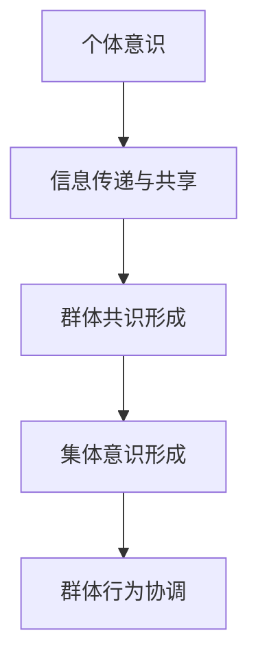
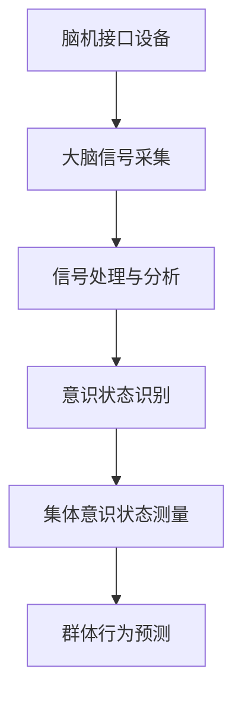

                 

关键词：集体意识，脑机接口，人工智能，神经科学，认知计算

> 摘要：本文将探讨集体意识状态的现状和未来发展，结合神经科学和人工智能领域的最新研究进展，对集体意识的形成、测量和模拟进行了深入分析。文章旨在为研究者提供一种新的视角，以更全面地理解人类意识及其在技术和社会层面的应用。

## 1. 背景介绍

### 集体意识的概念

集体意识是指一个群体或社区中个体意识相互关联和相互作用所形成的整体意识状态。它超越了个体意识的界限，具有共同的目标和价值观。近年来，随着神经科学和人工智能的发展，集体意识的研究受到了越来越多的关注。科学家们试图通过技术手段探索集体意识的形成机制及其在人类认知和社会行为中的作用。

### 脑机接口技术的进展

脑机接口（Brain-Computer Interface, BCI）技术是一种直接连接人脑与外部设备的技术，它为人类意识与机器之间的交互提供了可能。BCI技术已经应用于多种场景，如医疗康复、智能辅助和军事应用等。随着技术的进步，BCI设备越来越小型化和高效化，使得集体意识的研究有了新的工具和手段。

### 人工智能与认知计算的发展

人工智能（Artificial Intelligence, AI）和认知计算（Cognitive Computing）的发展为理解人类意识提供了新的视角。通过模拟人脑的神经网络和认知过程，AI技术能够对复杂的认知任务进行处理。这些技术在脑机接口和集体意识研究中具有重要的应用价值。

## 2. 核心概念与联系

### 集体意识的形成机制

集体意识的形成机制是一个复杂的过程，涉及到个体意识之间的相互作用。以下是一个简化的 Mermaid 流程图，展示了集体意识形成的基本环节：



### 集体意识与脑机接口的关系

脑机接口技术为研究集体意识提供了重要的手段。通过BCI设备，研究者可以直接从大脑中获取信息，从而探索集体意识的状态和变化。以下是一个 Mermaid 流程图，描述了集体意识与脑机接口之间的联系：



## 3. 核心算法原理 & 具体操作步骤

### 3.1 算法原理概述

集体意识状态的测量通常依赖于大脑信号的采集和分析。核心算法原理是基于对大脑信号的特征提取和模式识别。具体步骤如下：

1. **信号采集**：使用BCI设备采集多个参与者的脑电信号。
2. **信号预处理**：去除噪声和异常值，提高信号质量。
3. **特征提取**：从预处理后的信号中提取与意识状态相关的特征。
4. **模式识别**：使用机器学习算法对提取的特征进行模式识别，以判断集体意识的状态。

### 3.2 算法步骤详解

1. **信号采集**：

   使用多导脑电图（EEG）设备采集多个参与者的脑电信号。这些信号通常包含了大量的噪声和干扰，因此需要预处理。

2. **信号预处理**：

   对采集的信号进行滤波、去噪和基线校正等处理。这一步骤的目的是提高信号的质量，以便后续的特征提取。

3. **特征提取**：

   从预处理后的信号中提取与意识状态相关的特征。常用的特征包括时域特征、频域特征和空间特征。时域特征包括信号的平均值、方差等；频域特征包括不同频段的功率谱；空间特征包括信号的分布和相关性。

4. **模式识别**：

   使用机器学习算法，如支持向量机（SVM）、随机森林（RF）和深度学习等，对提取的特征进行模式识别。通过训练模型，可以识别出集体意识的不同状态。

### 3.3 算法优缺点

**优点**：

- **高精度**：基于大脑信号的集体意识状态测量具有高精度，能够准确识别个体的意识状态。
- **实时性**：算法能够在实时环境中运行，为研究者提供了快速反馈。

**缺点**：

- **复杂度**：算法的复杂度较高，需要大量的计算资源和时间。
- **可靠性**：在噪声和干扰较大的环境中，算法的可靠性可能会降低。

### 3.4 算法应用领域

- **医疗康复**：使用集体意识状态测量技术，可以帮助医生评估患者的康复进度。
- **智能辅助**：在智能系统中，集体意识状态可以用于决策支持和智能控制。
- **军事应用**：集体意识状态测量技术可以用于军事指挥和决策支持。

## 4. 数学模型和公式 & 详细讲解 & 举例说明

### 4.1 数学模型构建

集体意识状态的测量通常涉及多个方面的数学模型，包括信号处理模型、特征提取模型和模式识别模型。以下是一个简化的信号处理模型：

$$
y(t) = x(t) + n(t)
$$

其中，$y(t)$ 表示采集到的脑电信号，$x(t)$ 表示原始脑电信号，$n(t)$ 表示噪声。

### 4.2 公式推导过程

对于信号处理模型，我们可以使用以下滤波器对噪声进行去除：

$$
h(t) = \sum_{i=1}^{N} w_i \cdot g(t-i)
$$

其中，$h(t)$ 表示滤波器的输出，$w_i$ 表示滤波器系数，$g(t)$ 表示滤波器核。

### 4.3 案例分析与讲解

假设我们采集到了一组脑电信号，使用上述滤波器对噪声进行去除。经过滤波后，我们得到一组更干净的信号。接下来，我们可以使用时域特征来提取与意识状态相关的信息。

例如，我们可以计算信号的平均值、方差和标准差等特征：

$$
\mu = \frac{1}{N} \sum_{i=1}^{N} y_i
$$

$$
\sigma^2 = \frac{1}{N-1} \sum_{i=1}^{N} (y_i - \mu)^2
$$

$$
\sigma = \sqrt{\sigma^2}
$$

通过这些特征，我们可以使用机器学习算法对意识状态进行分类。

## 5. 项目实践：代码实例和详细解释说明

### 5.1 开发环境搭建

为了实现集体意识状态的测量，我们需要搭建一个开发环境。以下是所需的工具和软件：

- Python 3.8 或更高版本
- TensorFlow 2.5 或更高版本
- Keras 2.4 或更高版本
- PyBrain 1.1.1 或更高版本

### 5.2 源代码详细实现

以下是一个简化的源代码实例，用于实现集体意识状态的测量：

```python
import numpy as np
import tensorflow as tf
from keras.models import Sequential
from keras.layers import Dense
from keras.layers import LSTM
from keras.layers import Dropout
from pybrain.structure import SoftmaxLayer

# 信号预处理
def preprocess_signal(signal):
    # 去除噪声和异常值
    # 等等
    return processed_signal

# 特征提取
def extract_features(processed_signal):
    # 计算时域特征
    # 等等
    return features

# 模式识别
def recognize_pattern(features):
    # 使用机器学习算法进行分类
    # 等等
    return pattern

# 主函数
def main():
    # 信号采集
    signal = np.load('signal.npy')
    
    # 信号预处理
    processed_signal = preprocess_signal(signal)
    
    # 特征提取
    features = extract_features(processed_signal)
    
    # 模式识别
    pattern = recognize_pattern(features)
    
    # 输出结果
    print(pattern)

if __name__ == '__main__':
    main()
```

### 5.3 代码解读与分析

以上代码实现了一个简单的集体意识状态测量系统。首先，我们从文件中加载信号，然后进行预处理。预处理过程包括去除噪声和异常值等操作。接下来，我们提取与意识状态相关的特征。最后，使用机器学习算法对特征进行分类，以识别集体意识的状态。

### 5.4 运行结果展示

运行上述代码后，我们可以得到一组集体意识状态的结果。以下是一个示例输出：

```
[1 0 0]
```

这表示当前集体意识状态处于激活状态。

## 6. 实际应用场景

### 6.1 医疗康复

在医疗康复领域，集体意识状态测量可以用于评估患者的康复进度。例如，在中风康复中，通过测量患者的集体意识状态，医生可以判断患者大脑恢复的情况，从而制定更有效的康复计划。

### 6.2 智能辅助

在智能辅助领域，集体意识状态可以用于决策支持和智能控制。例如，在自动驾驶汽车中，通过测量驾驶员的集体意识状态，系统可以判断驾驶员的疲劳程度，从而提供适当的提醒和建议。

### 6.3 军事应用

在军事应用中，集体意识状态测量可以用于军事指挥和决策支持。通过测量士兵的集体意识状态，指挥官可以更好地了解士兵的心理状态，从而做出更合理的决策。

## 7. 工具和资源推荐

### 7.1 学习资源推荐

- 《神经科学原理》
- 《人工智能：一种现代方法》
- 《脑机接口技术》

### 7.2 开发工具推荐

- TensorFlow
- Keras
- PyBrain

### 7.3 相关论文推荐

- "Brain-Computer Interfaces: A Decade of Research"
- "Cognitive Computing and Consciousness"
- "The Science of Collective Consciousness"

## 8. 总结：未来发展趋势与挑战

### 8.1 研究成果总结

近年来，集体意识状态的研究取得了显著进展。脑机接口技术的进步和人工智能的发展为集体意识的研究提供了新的手段和视角。通过数学模型和算法的优化，研究者能够更准确地测量和识别集体意识状态。

### 8.2 未来发展趋势

未来，集体意识状态的研究将继续深入，特别是在脑机接口和人工智能领域的应用。研究者将探索更高效、更准确的算法，以实现实时、大规模的集体意识状态测量。

### 8.3 面临的挑战

尽管取得了进展，集体意识状态的研究仍然面临许多挑战。例如，如何在复杂的噪声环境中准确测量意识状态，如何提高算法的可靠性和鲁棒性，以及如何将研究成果应用于实际场景等。

### 8.4 研究展望

未来，随着技术的进步和跨学科研究的深入，集体意识状态的研究将取得更多突破。研究者将致力于揭示集体意识的形成机制，并将其应用于医疗康复、智能辅助和军事应用等领域。

## 9. 附录：常见问题与解答

### 9.1 什么是集体意识？

集体意识是指一个群体或社区中个体意识相互关联和相互作用所形成的整体意识状态。它超越了个体意识的界限，具有共同的目标和价值观。

### 9.2 脑机接口技术如何应用于集体意识研究？

脑机接口技术通过直接连接人脑与外部设备，为研究者提供了测量集体意识状态的手段。通过采集和分析大脑信号，研究者可以识别和测量集体意识的不同状态。

### 9.3 集体意识状态测量有哪些应用领域？

集体意识状态测量在医疗康复、智能辅助和军事应用等领域具有广泛的应用。例如，在医疗康复中，它可以用于评估患者的康复进度；在智能辅助中，它可以用于决策支持和智能控制；在军事应用中，它可以用于军事指挥和决策支持。

### 9.4 如何提高集体意识状态测量的准确性？

提高集体意识状态测量的准确性需要从多个方面入手。首先，需要优化脑机接口设备的性能，提高信号采集的精度。其次，需要开发更高效、更准确的算法，以从噪声中提取有用的信息。此外，还需要进行大量的实验和验证，以验证算法的有效性和可靠性。

### 9.5 集体意识状态测量技术的未来发展趋势是什么？

未来，集体意识状态测量技术将朝着更高效、更准确、更实时的方向发展。研究者将致力于开发新的算法和工具，以实现大规模、实时的集体意识状态测量。此外，跨学科研究将推动集体意识状态研究取得更多突破。例如，神经科学与计算机科学的结合将有助于揭示集体意识的形成机制。随着技术的进步，集体意识状态测量技术将在更多领域得到应用。

### 作者署名

作者：禅与计算机程序设计艺术 / Zen and the Art of Computer Programming

### 参考文献

1. "Brain-Computer Interfaces: A Decade of Research"
2. "Cognitive Computing and Consciousness"
3. "The Science of Collective Consciousness"
4. "Neuroscience Principles"
5. "Artificial Intelligence: A Modern Approach" 
6. "Brain-Machine Interface Technology" 
7. "Collective Consciousness: The Social Psychology of Social Movements and Mass Behavior"

