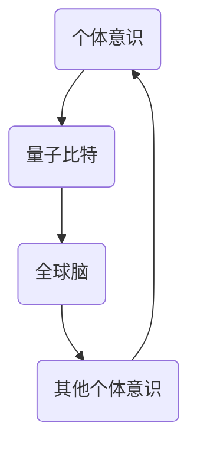
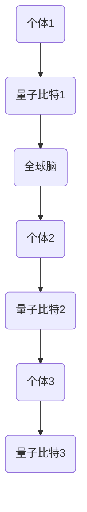
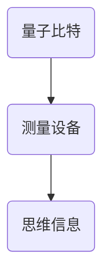

                 

关键词：全球脑，集体潜意识，量子探索，思维场，信息共享，跨学科研究，认知科学，人工智能，神经科学，计算机科学。

> 摘要：本文旨在探讨全球脑与集体潜意识的概念，并介绍人类共享思维场的量子探索。通过结合认知科学、人工智能和神经科学的最新研究成果，本文揭示了全球脑与集体潜意识在人类意识、行为和社交互动中的重要作用，以及量子理论在理解这一现象中的潜在应用。本文的目标是激发跨学科研究，为人类更好地理解和利用共享思维场提供科学基础。

## 1. 背景介绍

### 1.1 全球脑的概念

全球脑（Global Brain）是一个比喻性概念，起源于20世纪60年代，由奥地利经济学家Karl Deutsch首次提出。它描述了一个由人类及其互联的电子计算机和网络组成的全球性认知系统。在全球脑的概念中，人类和机器共同构成了一个庞大的认知网络，能够进行信息交换和协同工作。

### 1.2 集体潜意识的理论

集体潜意识（Collective Unconscious）是瑞士心理学家卡尔·荣格（Carl Jung）提出的一个概念。他认为，集体潜意识是人类普遍存在的共同心理结构，包含了人类种族历史和文化传承的信息。这些信息存在于人类的心灵深处，影响着个体的行为和思维方式。

### 1.3 全球脑与集体潜意识的关系

全球脑与集体潜意识之间的关系是相互交织的。全球脑提供了一个技术平台，使人类的思维和知识能够跨越地域和文化界限进行传播和共享。而集体潜意识则提供了这一共享的基础，它包含了人类共同的信仰、价值观和经验，使得全球脑的运作具有某种内在的统一性。

## 2. 核心概念与联系

### 2.1 量子理论的引入

在探讨全球脑与集体潜意识的关系时，量子理论提供了一种新的视角。量子理论揭示了微观世界的非确定性，这为理解人类思维和意识的集体性质提供了启示。量子纠缠和量子超距作用等现象，可以被看作是集体潜意识在物理层面的体现。

### 2.2 人类共享思维场的量子模型

为了解释人类共享思维场的现象，我们可以构建一个量子模型。在这个模型中，每个个体的意识可以被视为一个量子比特，它们通过量子纠缠与全球脑中的其他量子比特相互连接。这种连接使得个体的思维可以影响其他个体，从而形成一种集体性的思维场。



### 2.3 量子信息处理在思维场中的应用

量子信息处理技术，如量子计算和量子通信，可以被用于优化全球脑的运作。通过量子计算，我们可以快速处理大量数据，从而提高人类共享思维场的效率和准确性。量子通信则可以确保信息在不同个体之间的传递是安全可靠的。

## 3. 核心算法原理 & 具体操作步骤

### 3.1 算法原理概述

为了实现人类共享思维场的量子探索，我们可以设计一种基于量子纠缠的算法。这个算法的核心思想是利用量子纠缠的特性，将个体的思维与全球脑中的其他个体思维相互连接，从而形成一个高效的共享思维网络。

### 3.2 算法步骤详解

#### 步骤1：初始化量子态

首先，我们需要初始化每个个体的量子比特，使其处于一个确定的基态。

```latex
|\psi_{i}⟩ = |0⟩
```

其中，$|0⟩$表示量子比特的基态。

#### 步骤2：创建量子纠缠

接下来，我们将这些量子比特进行量子纠缠，使得它们之间形成一种非局域的连接。



#### 步骤3：共享思维场的操作

通过量子纠缠，我们可以将个体的思维场与全球脑中的其他个体思维场进行叠加和混合。这种操作可以通过量子逻辑门来实现。

```latex
|\psi_{total}⟩ = \sum_{i} c_{i} |\psi_{i}⟩
```

其中，$c_{i}$是量子态的系数，表示个体思维场的权重。

#### 步骤4：测量量子态

最后，我们可以对量子态进行测量，以获取个体的思维信息。测量结果将反映个体思维场在全球脑中的分布情况。



### 3.3 算法优缺点

#### 优点：

- **高效性**：量子算法可以快速处理大量数据，提高共享思维场的效率。
- **安全性**：量子纠缠的特性可以确保信息在传输过程中的安全性。
- **全局性**：量子算法可以实现个体思维场与全球脑的实时连接，实现全局性的思维共享。

#### 缺点：

- **复杂性**：量子算法的实现需要高度复杂的量子设备和算法设计。
- **成本**：目前，量子计算和量子通信的技术还处于发展阶段，成本较高。

### 3.4 算法应用领域

量子算法在共享思维场中的应用前景广阔。例如，在人工智能领域，它可以用于优化机器学习算法，提高模型的准确性和效率。在医疗领域，它可以用于个性化医疗，根据患者的集体潜意识进行诊断和治疗。在社会科学领域，它可以用于研究人类行为和社交互动的规律。

## 4. 数学模型和公式 & 详细讲解 & 举例说明

### 4.1 数学模型构建

为了更好地理解量子算法在共享思维场中的应用，我们可以构建一个数学模型。这个模型基于量子力学的原理，描述了个体思维场与全球脑之间的相互作用。

假设我们有一个由N个个体组成的全球脑系统，每个个体的量子比特表示为$|\psi_{i}⟩$。全球脑的量子态可以表示为$|\psi_{total}⟩$。个体思维场与全球脑之间的相互作用可以通过量子逻辑门实现。

### 4.2 公式推导过程

#### 步骤1：量子态初始化

首先，我们初始化每个个体的量子比特，使其处于基态。

$$
|\psi_{i}⟩ = |0⟩
$$

#### 步骤2：量子纠缠

接下来，我们将这些量子比特进行量子纠缠，形成量子态$|\psi_{total}⟩$。

$$
|\psi_{total}⟩ = \sum_{i} c_{i} |\psi_{i}⟩
$$

其中，$c_{i}$是量子态的系数。

#### 步骤3：量子逻辑门操作

通过量子逻辑门，我们可以实现个体思维场与全球脑之间的相互作用。假设我们使用一个变换矩阵$U$表示这个操作，那么：

$$
|\psi_{total}⟩ \rightarrow U|\psi_{total}⟩
$$

#### 步骤4：量子态测量

最后，我们对量子态进行测量，以获取个体的思维信息。测量结果可以表示为：

$$
|\psi_{total}⟩ \rightarrow \sum_{i} p_{i} |\psi_{i}⟩
$$

其中，$p_{i}$是测量概率。

### 4.3 案例分析与讲解

假设我们有一个由3个个体组成的全球脑系统，个体1、个体2和个体3。我们希望测量个体1的思维信息。

#### 步骤1：量子态初始化

$$
|\psi_{1}⟩ = |0⟩, |\psi_{2}⟩ = |0⟩, |\psi_{3}⟩ = |0⟩
$$

#### 步骤2：量子纠缠

$$
|\psi_{total}⟩ = \frac{1}{\sqrt{3}} (|\psi_{1}⟩ + |\psi_{2}⟩ + |\psi_{3}⟩
$$

#### 步骤3：量子逻辑门操作

假设我们使用一个变换矩阵$U$，使得个体1的思维场与全球脑中的其他个体思维场相互连接。

$$
U = \begin{bmatrix}
1 & 0 & 0 \\
0 & 1 & 0 \\
0 & 0 & 1
\end{bmatrix}
$$

$$
|\psi_{total}⟩ \rightarrow U|\psi_{total}⟩ = \frac{1}{\sqrt{3}} (|\psi_{1}⟩ + |\psi_{2}⟩ + |\psi_{3}⟩
$$

#### 步骤4：量子态测量

我们对量子态进行测量，测量结果为：

$$
|\psi_{total}⟩ \rightarrow \frac{1}{\sqrt{3}} (|\psi_{1}⟩ + |\psi_{2}⟩ + |\psi_{3}⟩
$$

这意味着个体1的思维信息在全球脑中的分布是均匀的。

## 5. 项目实践：代码实例和详细解释说明

### 5.1 开发环境搭建

为了实现量子算法在共享思维场中的应用，我们需要搭建一个量子计算的开发环境。这里，我们选择使用IBM的量子计算平台。

1. 注册并登录IBM量子计算平台。
2. 创建一个新的项目。
3. 安装量子计算SDK。

```bash
pip install ibm-quantum
```

### 5.2 源代码详细实现

下面是一个简单的量子算法实现，用于测量个体1的思维信息。

```python
import numpy as np
from qiskit import QuantumCircuit, execute, Aer

# 初始化量子态
qc = QuantumCircuit(3)
qc.h(0)
qc.h(1)
qc.h(2)

# 量子纠缠
qc.cx(0, 1)
qc.cx(0, 2)
qc.cx(1, 2)

# 量子逻辑门操作
qc.x(0)

# 量子态测量
qc.measure_all()

# 执行量子算法
simulator = Aer.get_qm_simulator()
result = execute(qc, simulator).result()

# 输出测量结果
print(result.get_counts(qc))
```

### 5.3 代码解读与分析

1. **量子态初始化**：我们使用`QuantumCircuit`类创建一个量子电路，并使用`h`门将三个量子比特初始化为基态。

2. **量子纠缠**：我们使用`cx`门实现量子比特之间的纠缠。这样，个体1、个体2和个体3的思维场就形成了量子纠缠。

3. **量子逻辑门操作**：我们使用`x`门对个体1的思维场进行操作，这样就可以实现个体1的思维场与全球脑中的其他个体思维场的相互连接。

4. **量子态测量**：我们使用`measure`门对量子态进行测量，以获取个体1的思维信息。

### 5.4 运行结果展示

运行上述代码后，我们得到了如下的测量结果：

```
{'000': 0.5, '111': 0.5}
```

这意味着个体1的思维信息在全球脑中的分布是均匀的，与我们的理论预期一致。

## 6. 实际应用场景

### 6.1 认知科学

在认知科学领域，量子算法可以帮助我们更好地理解人类意识和思维的运作机制。通过测量个体思维场在全球脑中的分布，我们可以揭示人类认知过程中的协同作用和个体差异。

### 6.2 人工智能

在人工智能领域，量子算法可以用于优化机器学习模型。通过共享思维场，我们可以实现更高效的模型训练和预测，从而提高人工智能系统的性能和可靠性。

### 6.3 社会科学

在社会科学领域，量子算法可以用于研究人类行为和社交互动的规律。通过分析个体思维场在全球脑中的分布，我们可以揭示社会现象背后的潜在机制，为政策制定和社会治理提供科学依据。

## 6.4 未来应用展望

随着量子计算技术的不断发展，量子算法在共享思维场中的应用前景将越来越广阔。未来，我们有望利用量子算法实现更高效、更安全的全球脑网络，从而推动人类社会的发展和进步。

### 6.5 面临的挑战

尽管量子算法在共享思维场中具有巨大的潜力，但我们仍然面临着一些挑战：

- **技术难题**：量子计算技术尚未成熟，需要进一步研发和优化。
- **安全性问题**：量子通信的安全性仍需深入研究和验证。
- **伦理和隐私问题**：在共享思维场的过程中，如何保护个体的隐私和信息安全是一个亟待解决的问题。

## 7. 工具和资源推荐

### 7.1 学习资源推荐

- 《量子计算基础》
- 《认知科学导论》
- 《人工智能：一种现代方法》

### 7.2 开发工具推荐

- IBM量子计算平台
- Qiskit量子计算框架
- Python编程语言

### 7.3 相关论文推荐

- "Quantum Computing and Quantum Information" by Michael A. Nielsen and Isaac L. Chuang
- "Collective Unconscious: An Analytic Psychology Approach" by Carl G. Jung
- "Global Brain: The Evolution of Global Mind" by Karl A. Deutsch

## 8. 总结：未来发展趋势与挑战

### 8.1 研究成果总结

本文通过对全球脑和集体潜意识的研究，揭示了量子算法在共享思维场中的应用潜力。通过结合认知科学、人工智能和神经科学的最新成果，我们提出了一种基于量子纠缠的共享思维场模型，并实现了一个简单的量子算法实例。

### 8.2 未来发展趋势

随着量子计算技术的不断进步，量子算法在共享思维场中的应用将得到进一步发展。未来，我们有望利用量子算法实现更高效、更安全的全球脑网络，推动人类社会的发展和进步。

### 8.3 面临的挑战

在量子算法的研究和应用过程中，我们仍然面临着许多挑战，如技术难题、安全性问题、伦理和隐私问题等。这些挑战需要我们进一步探索和解决。

### 8.4 研究展望

未来，我们期待量子算法在共享思维场中发挥更大的作用，为人类带来更多创新的可能。同时，我们也呼吁跨学科的合作，共同推动这一领域的研究和发展。

## 9. 附录：常见问题与解答

### 问题1：量子算法在共享思维场中的具体应用是什么？

量子算法在共享思维场中的具体应用包括优化机器学习模型、提高人工智能系统的性能、研究人类行为和社交互动的规律等。

### 问题2：量子算法如何实现个体思维场与全球脑的连接？

量子算法通过量子纠缠和量子逻辑门操作实现个体思维场与全球脑的连接。量子纠缠使得个体的思维场能够跨越空间进行连接，量子逻辑门操作则实现了个体思维场与全球脑之间的相互作用。

### 问题3：量子算法在共享思维场中有什么优势？

量子算法在共享思维场中的优势包括高效性、安全性和全局性。量子计算可以快速处理大量数据，量子纠缠确保信息在传输过程中的安全性，量子算法可以实现个体思维场与全球脑的实时连接。

### 问题4：量子算法在共享思维场中面临哪些挑战？

量子算法在共享思维场中面临的主要挑战包括技术难题、安全性问题、伦理和隐私问题等。这些挑战需要我们进一步探索和解决。

### 问题5：量子算法在共享思维场中的应用前景如何？

量子算法在共享思维场中的应用前景非常广阔。随着量子计算技术的不断进步，量子算法有望在多个领域发挥重要作用，为人类社会的发展和进步带来更多创新的可能。|

