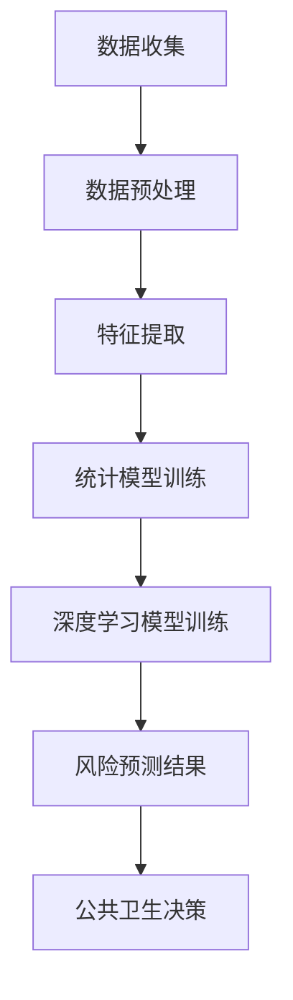

                 

关键词：脑健康风险预测、集体预防医学、大数据分析、人工智能、统计模型、深度学习

## 摘要

本文旨在探讨全球脑健康风险预测模型，这是一种基于大数据分析和人工智能技术的集体预防医学工具。随着全球人口老龄化趋势加剧，脑健康问题日益凸显，本文提出了一套系统性的风险预测模型，旨在提前预警脑健康风险，为公共卫生决策提供科学依据。本文将详细介绍该模型的背景、核心概念、算法原理、数学模型、应用实践以及未来展望。

## 1. 背景介绍

随着科技的进步和生活方式的改变，脑健康问题已经成为全球公共卫生领域的重要议题。脑部疾病，如阿尔茨海默病、中风和抑郁症等，不仅给患者及其家庭带来巨大的痛苦，而且对医疗系统构成了巨大压力。据统计，到2050年，全球阿尔茨海默病的患者数量可能会增加到目前的四倍，这一数字令人震惊。

传统的疾病预防模式往往依赖于疾病诊断后的干预和治疗，而集体预防医学的核心在于早期预测和预防。大数据分析和人工智能技术的发展为集体预防医学提供了新的契机。通过收集和分析大量脑健康相关的数据，我们可以发现潜在的疾病风险因素，从而在疾病发生前进行干预，降低疾病的发生率和严重程度。

## 2. 核心概念与联系

为了构建全球脑健康风险预测模型，我们首先需要明确以下几个核心概念：

### 2.1 数据来源

脑健康风险预测所需的数据来源主要包括以下几个方面：

- **临床数据**：包括患者的诊断记录、病史、治疗信息等。
- **基因组数据**：通过基因测序获取的个体基因信息。
- **环境数据**：如生活习惯、饮食、居住环境等。
- **社会人口数据**：如年龄、性别、教育程度、经济状况等。

### 2.2 统计模型

统计模型是脑健康风险预测的核心。常见的统计模型包括线性回归、逻辑回归、决策树等。这些模型能够帮助我们识别出影响脑健康的主要风险因素。

### 2.3 深度学习

随着数据量的增加和计算能力的提升，深度学习技术在脑健康风险预测中得到了广泛应用。深度学习模型，如卷积神经网络（CNN）和循环神经网络（RNN），能够从海量数据中自动提取特征，实现更高精度的风险预测。

### 2.4 Mermaid 流程图

下面是一个简化的 Mermaid 流程图，描述了脑健康风险预测模型的基本架构：

## 3. 核心算法原理 & 具体操作步骤

### 3.1 算法原理概述

脑健康风险预测模型主要基于以下几个步骤：

1. **数据收集**：从各种来源收集与脑健康相关的数据。
2. **数据预处理**：对收集到的数据进行清洗、归一化等处理，以便后续分析。
3. **特征提取**：从预处理后的数据中提取出与脑健康风险相关的特征。
4. **模型训练**：使用统计模型和深度学习模型对特征进行训练，以预测脑健康风险。
5. **风险预测**：根据模型预测结果，对个体进行脑健康风险的评估。
6. **公共卫生决策**：根据风险预测结果，制定公共卫生干预措施。

### 3.2 算法步骤详解

1. **数据收集**：
   - **临床数据**：通过电子健康记录（EHR）系统收集。
   - **基因组数据**：通过基因测序中心获取。
   - **环境数据**：通过问卷调查和传感器收集。
   - **社会人口数据**：通过人口普查和统计数据获取。

2. **数据预处理**：
   - **数据清洗**：去除重复、错误和无用数据。
   - **归一化**：将不同数据源的数据进行标准化处理。

3. **特征提取**：
   - **统计特征**：如年龄、性别、疾病历史等。
   - **生物特征**：如基因序列、生物标志物等。
   - **环境特征**：如生活习惯、居住环境等。

4. **模型训练**：
   - **统计模型**：如逻辑回归、决策树等。
   - **深度学习模型**：如卷积神经网络、循环神经网络等。

5. **风险预测**：
   - **统计预测**：根据统计模型输出个体风险评分。
   - **深度学习预测**：通过深度学习模型进行个体风险预测。

6. **公共卫生决策**：
   - **高风

