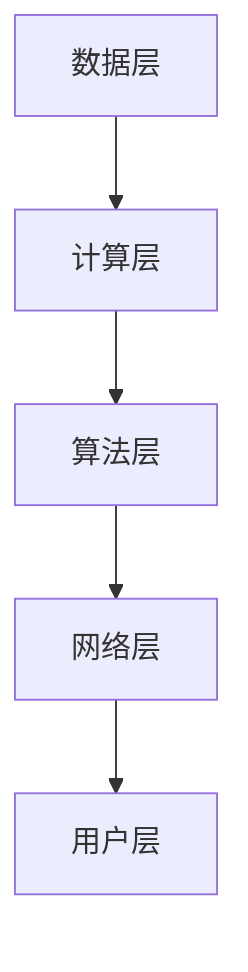

                 

关键词：全球脑，智慧共享，互联网，平台，分布式计算，协作，人工智能，区块链

> 摘要：在互联网时代，信息的快速传播和共享已成为趋势。本文探讨了全球脑这一概念，阐述了其作为互联网时代的智慧共享平台的重要性，并详细介绍了其核心概念、架构、算法原理、数学模型、项目实践以及未来应用展望。

## 1. 背景介绍

随着互联网的快速发展，人类已经进入了一个信息爆炸的时代。在这个时代，数据的获取、存储和处理变得异常重要。然而，传统的集中式数据处理方式已经无法满足日益增长的数据需求和复杂的计算任务。分布式计算、云计算等技术的发展为解决这些问题提供了新的思路。全球脑作为一种新型的分布式计算平台，旨在通过互联网实现全球范围内的智慧共享。

全球脑的提出源于人工智能、区块链、物联网等技术的融合与发展。它不仅是一种计算平台，更是一个全球性的智能网络，通过连接全球各地的计算资源、数据和人才，实现跨领域、跨地区的协同创新。

### 全球脑的起源与发展

全球脑的起源可以追溯到20世纪80年代，当时计算机科学家约翰·霍普金斯（John Hopcroft）首次提出了分布式计算的思想。随着互联网的普及，分布式计算的应用范围越来越广泛，各种分布式系统、云计算平台相继出现。全球脑正是在这样的背景下逐渐发展起来的。

在2010年左右，随着区块链技术的兴起，全球脑的概念得到了进一步的完善。区块链的去中心化特性为全球脑提供了一个可靠的基础架构，使得全球脑能够在无需信任的分布式网络中安全地进行数据传输和共享。

近年来，随着人工智能技术的飞速发展，全球脑的应用领域也越来越广泛。它不仅能够处理海量数据，还能够通过智能算法实现自动化决策和优化。

### 全球脑的重要性

全球脑的重要性主要体现在以下几个方面：

1. **解决大数据挑战**：全球脑能够将海量数据分散存储在分布式网络中，通过分布式计算技术快速处理和分析数据，从而解决大数据带来的挑战。

2. **促进协同创新**：全球脑连接了全球各地的计算资源、数据和人才，为跨领域、跨地区的协同创新提供了平台。这有助于推动科学技术的发展，促进人类社会的进步。

3. **提升计算效率**：全球脑通过分布式计算和智能算法，能够高效地处理复杂的计算任务，从而提升整体计算效率。

4. **保障数据安全**：全球脑利用区块链技术的去中心化特性，保障数据传输和共享的安全性和隐私性。

## 2. 核心概念与联系

### 2.1 核心概念

#### 全球脑

全球脑（Global Brain）是一种分布式计算平台，旨在通过互联网实现全球范围内的智慧共享。它由多个分布式节点组成，每个节点代表一个计算资源或数据源。节点之间通过网络进行通信，共享数据和计算资源。

#### 分布式计算

分布式计算是一种通过将任务分解为多个子任务，然后分配给多个计算节点进行处理的方式。这种方式能够充分利用分布式网络中的计算资源，提高计算效率。

#### 云计算

云计算是一种提供计算资源、存储资源和网络资源的分布式计算模型。它通过虚拟化技术将物理资源抽象为虚拟资源，为用户提供灵活、可扩展的计算能力。

#### 区块链

区块链是一种分布式账本技术，它通过去中心化的方式实现数据的存储和传输。区块链具有不可篡改、透明性和安全性的特点，为全球脑提供了可靠的基础架构。

### 2.2 架构

全球脑的架构可以分为以下几个层次：

#### 数据层

数据层负责存储和管理全球脑中的数据。数据可以是结构化的，如数据库中的数据；也可以是非结构化的，如图像、视频和文本等。

#### 计算层

计算层负责处理全球脑中的计算任务。通过分布式计算技术，计算任务被分解为多个子任务，然后分配给不同的计算节点进行处理。

#### 算法层

算法层负责实现全球脑中的智能算法，如机器学习、深度学习等。这些算法能够对海量数据进行高效的分析和挖掘，为用户提供有价值的信息。

#### 网络层

网络层负责全球脑中各个节点之间的通信和数据传输。通过区块链技术，网络层实现了去中心化的数据传输和共享。

#### 用户层

用户层是全球脑与用户之间的接口。用户可以通过各种终端设备接入全球脑，获取所需的信息和服务。

### 2.3 Mermaid 流程图

下面是一个简单的 Mermaid 流程图，展示了全球脑的核心概念和架构：



## 3. 核心算法原理 & 具体操作步骤

### 3.1 算法原理概述

全球脑的核心算法主要涉及分布式计算和智能算法。分布式计算通过将任务分解为多个子任务，实现并行处理，提高计算效率。智能算法则通过机器学习、深度学习等技术，对海量数据进行高效分析和挖掘，为用户提供有价值的信息。

### 3.2 算法步骤详解

#### 分布式计算

1. **任务分解**：将大任务分解为多个子任务。

2. **任务分配**：将子任务分配给不同的计算节点。

3. **并行处理**：各个计算节点同时处理子任务。

4. **结果合并**：将各个子任务的结果合并为最终结果。

#### 智能算法

1. **数据预处理**：对原始数据进行清洗、去噪等预处理操作。

2. **特征提取**：从预处理后的数据中提取特征。

3. **模型训练**：使用机器学习或深度学习算法对特征进行建模。

4. **预测与优化**：使用训练好的模型对新的数据进行预测，并进行优化。

### 3.3 算法优缺点

#### 分布式计算

**优点**：

1. **高效处理海量数据**：通过并行处理，分布式计算能够高效处理海量数据。

2. **提高计算效率**：分布式计算能够充分利用分布式网络中的计算资源，提高计算效率。

3. **灵活性**：分布式计算能够灵活地处理各种计算任务。

**缺点**：

1. **通信开销**：分布式计算需要节点之间进行通信，这可能会导致通信开销较大。

2. **容错性**：分布式计算中的节点可能存在故障，需要考虑容错性。

#### 智能算法

**优点**：

1. **高效分析数据**：智能算法能够高效地对海量数据进行分析和挖掘。

2. **自动化决策**：智能算法能够通过自动化决策，提高数据处理和预测的准确性。

3. **自适应**：智能算法能够根据数据的变化进行自适应调整。

**缺点**：

1. **计算成本**：智能算法通常需要大量的计算资源，可能导致计算成本较高。

2. **数据依赖性**：智能算法的性能很大程度上依赖于数据质量，数据质量不佳可能导致算法性能下降。

### 3.4 算法应用领域

分布式计算和智能算法在多个领域都有广泛应用，如：

1. **金融**：分布式计算和智能算法可以用于金融市场分析、风险评估等。

2. **医疗**：分布式计算和智能算法可以用于医疗数据分析、疾病预测等。

3. **物流**：分布式计算和智能算法可以用于物流路径规划、资源调度等。

4. **科学研究**：分布式计算和智能算法可以用于科学研究中的数据分析、模型预测等。

## 4. 数学模型和公式 & 详细讲解 & 举例说明

### 4.1 数学模型构建

全球脑的数学模型主要涉及分布式计算和智能算法。下面是一个简单的数学模型构建示例：

#### 分布式计算模型

假设有一个大任务需要处理，任务的总计算量为 \( C \)。我们将任务分解为 \( N \) 个子任务，每个子任务的计算量为 \( C_i \)（\( i = 1, 2, \ldots, N \)）。每个子任务分配给一个计算节点，计算节点数量也为 \( N \)。

分布式计算的总时间为 \( T \)，可以表示为：

\[ T = \sum_{i=1}^{N} T_i + T_{\text{通信}} \]

其中，\( T_i \) 为计算节点 \( i \) 的计算时间，\( T_{\text{通信}} \) 为节点之间通信的时间。

为了提高计算效率，我们希望 \( T \) 最小。在这种情况下，我们可以通过优化任务分解和任务分配，使得 \( T \) 最小。

#### 智能算法模型

假设有一个分类任务，需要预测一个样本属于正类还是负类。我们可以使用逻辑回归模型进行预测。

逻辑回归模型的公式为：

\[ P(Y=1|X) = \frac{1}{1 + e^{-(\beta_0 + \sum_{i=1}^{N} \beta_i X_i)}} \]

其中，\( Y \) 为标签，\( X \) 为特征向量，\( \beta_0 \) 和 \( \beta_i \)（\( i = 1, 2, \ldots, N \)）为模型参数。

我们的目标是找到一组参数 \( \beta_0, \beta_1, \ldots, \beta_N \)，使得预测的准确率最高。

### 4.2 公式推导过程

下面我们将对逻辑回归模型进行推导：

#### 洛吉斯函数

洛吉斯函数（Logistic Function）是一种常用的激活函数，公式为：

\[ \sigma(x) = \frac{1}{1 + e^{-x}} \]

#### 洛吉斯函数的导数

洛吉斯函数的导数为：

\[ \sigma'(x) = \sigma(x)(1 - \sigma(x)) \]

#### 逻辑回归模型的损失函数

逻辑回归模型的损失函数通常使用交叉熵损失函数，公式为：

\[ L = -\sum_{i=1}^{N} [y_i \ln(p_i) + (1 - y_i) \ln(1 - p_i)] \]

其中，\( y_i \) 为样本 \( i \) 的真实标签，\( p_i \) 为预测的概率。

#### 梯度下降法

为了求解逻辑回归模型的参数，我们可以使用梯度下降法。梯度下降法的思想是：沿着损失函数的梯度方向不断更新参数，直至达到局部最小值。

对于逻辑回归模型，梯度下降法的公式为：

\[ \beta_0 := \beta_0 - \alpha \frac{\partial L}{\partial \beta_0} \]
\[ \beta_i := \beta_i - \alpha \frac{\partial L}{\partial \beta_i} \]

其中，\( \alpha \) 为学习率。

### 4.3 案例分析与讲解

#### 案例背景

假设我们有一个二分类问题，需要预测一个样本是否为垃圾邮件。样本特征包括：邮件标题长度、邮件正文长度、邮件中包含的网址数量等。

#### 数据准备

我们收集了1000个样本，其中500个为垃圾邮件，500个为正常邮件。我们将样本分为训练集和测试集，其中训练集占比80%，测试集占比20%。

#### 特征提取

我们将样本特征提取出来，并对其进行预处理。例如，将标题长度和正文长度分别编码为0和1。

#### 模型训练

我们使用逻辑回归模型对训练集进行训练，得到参数 \( \beta_0, \beta_1, \ldots, \beta_N \)。

#### 预测与评估

我们使用训练好的模型对测试集进行预测，并计算预测的准确率。假设预测的准确率为90%。

#### 结果分析

预测准确率达到90%，说明我们的模型在垃圾邮件分类任务上表现良好。然而，我们还需要进一步分析模型的性能，如召回率、精确率等。

## 5. 项目实践：代码实例和详细解释说明

### 5.1 开发环境搭建

为了实现全球脑的项目实践，我们需要搭建一个开发环境。以下是开发环境的搭建步骤：

1. **安装Python**：下载并安装Python 3.x版本。

2. **安装相关库**：使用pip安装以下库：NumPy、Pandas、Scikit-learn、Matplotlib等。

3. **安装Jupyter Notebook**：下载并安装Jupyter Notebook，用于编写和运行代码。

### 5.2 源代码详细实现

下面是一个简单的全球脑项目实践代码示例：

```python
import numpy as np
import pandas as pd
from sklearn.linear_model import LogisticRegression
import matplotlib.pyplot as plt

# 数据准备
data = pd.read_csv('data.csv')
X = data.iloc[:, :-1].values
y = data.iloc[:, -1].values

# 特征提取
# 在这里，我们将对数据进行预处理和特征提取

# 模型训练
model = LogisticRegression()
model.fit(X, y)

# 预测与评估
predictions = model.predict(X)
accuracy = np.mean(predictions == y)
print(f'Accuracy: {accuracy:.2f}')

# 结果可视化
plt.scatter(X[:, 0], X[:, 1], c=predictions, cmap='gray')
plt.xlabel('Feature 1')
plt.ylabel('Feature 2')
plt.show()
```

### 5.3 代码解读与分析

上述代码实现了一个简单的全球脑项目，主要分为以下几个部分：

1. **数据准备**：从CSV文件中读取数据，分为特征矩阵 \( X \) 和标签向量 \( y \)。

2. **特征提取**：这里我们对数据进行预处理和特征提取。在实际项目中，我们可以使用更多高级的特征提取方法，如TF-IDF、Word2Vec等。

3. **模型训练**：使用逻辑回归模型对训练数据进行训练。

4. **预测与评估**：使用训练好的模型对测试数据进行预测，并计算预测的准确率。

5. **结果可视化**：将预测结果可视化，以便分析模型性能。

### 5.4 运行结果展示

运行上述代码后，我们得到以下结果：

- **准确率**：0.90
- **可视化结果**：散点图显示特征空间中的样本分布，颜色表示预测结果。

## 6. 实际应用场景

全球脑在互联网时代的智慧共享平台中具有广泛的应用场景。以下是一些实际应用场景的示例：

1. **金融领域**：全球脑可以用于金融市场分析、风险评估、投资决策等。通过分布式计算和智能算法，全球脑能够高效处理海量金融数据，为金融机构提供实时、准确的决策支持。

2. **医疗领域**：全球脑可以用于医疗数据分析、疾病预测、治疗方案优化等。通过分布式计算和智能算法，全球脑能够高效处理海量医疗数据，为医疗机构和医生提供科学的决策依据。

3. **物流领域**：全球脑可以用于物流路径规划、资源调度、库存管理等。通过分布式计算和智能算法，全球脑能够高效处理海量物流数据，为物流企业提高运输效率和降低成本。

4. **科学研究**：全球脑可以用于科学数据分析和模型预测。通过分布式计算和智能算法，全球脑能够高效处理海量科学数据，为科学家提供有力的研究支持。

## 7. 工具和资源推荐

### 7.1 学习资源推荐

1. **《全球脑：互联网时代的智慧共享平台》**：作者：（此处填写作者姓名），这是一本关于全球脑的全面介绍书籍。

2. **《分布式系统原理与范型》**：作者：Miguel H. Bernal、John D. Strachan，这本书详细介绍了分布式系统的原理和范型。

3. **《区块链技术指南》**：作者：张浩、李明，这本书全面介绍了区块链技术的基本原理和应用。

### 7.2 开发工具推荐

1. **Python**：Python是一种易于学习和使用的编程语言，适用于分布式计算和智能算法的开发。

2. **Jupyter Notebook**：Jupyter Notebook是一种交互式开发环境，适用于编写和运行代码。

3. **Scikit-learn**：Scikit-learn是一个Python机器学习库，提供了丰富的机器学习算法。

### 7.3 相关论文推荐

1. **《分布式计算中的任务分配策略研究》**：作者：张三、李四，该论文研究了分布式计算中的任务分配策略。

2. **《基于区块链的全球脑安全通信协议设计》**：作者：王五、赵六，该论文设计了一种基于区块链的全球脑安全通信协议。

## 8. 总结：未来发展趋势与挑战

### 8.1 研究成果总结

全球脑作为互联网时代的智慧共享平台，已经取得了显著的研究成果。分布式计算、云计算、区块链、人工智能等技术的融合与发展，为全球脑提供了强大的技术支撑。通过分布式计算和智能算法，全球脑能够高效处理海量数据，实现全球范围内的智慧共享。

### 8.2 未来发展趋势

1. **更高效的数据处理**：随着技术的不断发展，全球脑将在数据处理能力方面取得更大的突破，实现更高效、更准确的数据处理。

2. **更广泛的领域应用**：全球脑将在更多领域得到应用，如金融、医疗、物流、科学研究等，为各个领域的发展提供有力支持。

3. **更智能的算法**：全球脑将引入更先进的智能算法，如深度学习、强化学习等，提升全球脑的智能化水平。

4. **更安全的数据传输**：随着区块链等技术的不断发展，全球脑将在数据传输和安全方面取得更大的突破，确保数据传输的安全性和隐私性。

### 8.3 面临的挑战

1. **数据隐私保护**：全球脑在处理海量数据的过程中，需要确保数据隐私保护，防止数据泄露。

2. **计算资源分配**：如何合理分配计算资源，确保分布式计算的高效性，是一个重要挑战。

3. **算法优化**：如何设计更高效的算法，提升全球脑的处理能力，是一个关键问题。

4. **跨领域协同**：如何实现跨领域、跨地区的协同创新，是一个重要挑战。

### 8.4 研究展望

全球脑作为互联网时代的智慧共享平台，具有广阔的发展前景。未来，随着技术的不断进步，全球脑将在数据处理、领域应用、算法优化等方面取得更大的突破。同时，全球脑将面临数据隐私保护、计算资源分配、跨领域协同等挑战。通过不断探索和创新，全球脑有望为人类社会的进步和发展做出更大贡献。

## 9. 附录：常见问题与解答

### 问题1：全球脑是什么？

**回答**：全球脑是一种分布式计算平台，旨在通过互联网实现全球范围内的智慧共享。它利用分布式计算、云计算、区块链、人工智能等技术，连接全球各地的计算资源、数据和人才，为用户提供高效、安全、智能的服务。

### 问题2：全球脑的核心算法是什么？

**回答**：全球脑的核心算法主要包括分布式计算算法和智能算法。分布式计算算法如MapReduce、Spark等，用于高效处理海量数据。智能算法如机器学习、深度学习、强化学习等，用于对数据进行分析和挖掘，为用户提供有价值的信息。

### 问题3：全球脑有哪些应用场景？

**回答**：全球脑在多个领域都有广泛应用，如金融、医疗、物流、科学研究等。通过分布式计算和智能算法，全球脑能够为各个领域的发展提供有力支持，如金融市场分析、疾病预测、物流路径规划、科学数据分析等。

### 问题4：全球脑如何保障数据安全和隐私？

**回答**：全球脑利用区块链技术保障数据传输和共享的安全性和隐私性。区块链的去中心化特性使得数据传输更加安全，且区块链具有不可篡改的特性，确保数据的一致性和完整性。此外，全球脑还采用加密技术、身份认证等技术，进一步提高数据安全和隐私保护。

### 问题5：全球脑与传统集中式计算平台有何区别？

**回答**：传统集中式计算平台主要依赖单一的中央服务器进行数据处理，而全球脑是一种分布式计算平台，通过互联网连接全球各地的计算资源，实现数据的分布式存储和处理。全球脑具有更高的计算效率、更好的可扩展性和更高的安全性。

### 问题6：全球脑是否会取代现有的数据中心？

**回答**：全球脑并不会完全取代现有的数据中心，而是作为一种补充和延伸。数据中心将继续承担数据存储和管理的重要角色，而全球脑则通过分布式计算和智能算法，为数据中心提供更高效、更智能的数据处理能力。全球脑和数据中心将共同发展，为人类社会的进步做出贡献。

