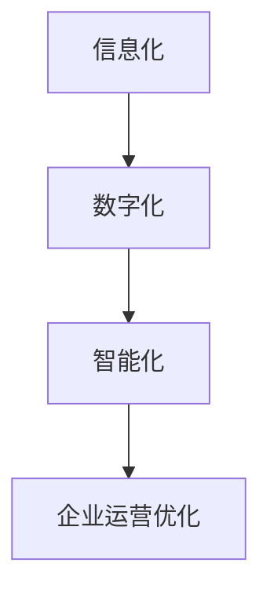

                 

关键词：信息化，数字化，智能化，企业规划，技术战略

> 摘要：本文将详细探讨公司在未来五年内的信息化、数字化和智能化发展规划，包括关键的技术概念、算法原理、项目实践、实际应用场景和未来展望，旨在为企业提供一套科学、实用、前瞻性的规划方案。

## 1. 背景介绍

在当今全球化、数字化和信息化的浪潮中，企业竞争已经不仅仅是产品和服务的竞争，更是信息技术和信息资源的竞争。信息化、数字化和智能化已经成为企业转型升级的关键驱动力。本规划方案旨在帮助公司应对市场变化，提升竞争力，实现可持续发展。

### 1.1 行业趋势分析

- **信息化**：信息技术的广泛应用，从企业管理到客户服务，信息化已经深入到企业的每一个环节。
- **数字化**：数据的产生、收集、处理和分析已经成为企业运营的重要组成部分。
- **智能化**：人工智能、大数据、云计算等新兴技术的应用，正在推动企业运营模式的变革。

### 1.2 公司现状分析

- **信息化水平**：公司已经具备一定的基础信息化建设，但部分业务系统仍存在数据孤岛、信息不对称等问题。
- **数字化程度**：数据管理和分析能力不足，无法充分发挥数据价值。
- **智能化应用**：部分业务环节引入了智能技术，但整体智能化水平有待提升。

## 2. 核心概念与联系

为了更好地进行信息化、数字化和智能化建设，我们需要明确以下几个核心概念：

### 2.1 信息化

信息化是指通过计算机技术、网络技术和数据库技术等，对企业的信息进行收集、处理、存储、传输和应用，从而实现企业的信息化管理。

### 2.2 数字化

数字化是指将物理世界中的各种信息转化为数字信号，通过计算机进行处理和分析，从而实现信息的高效管理和利用。

### 2.3 智能化

智能化是指通过人工智能、大数据、云计算等新兴技术，使企业系统能够自动学习、自主决策，从而实现智能化运营和管理。

### 2.4 Mermaid 流程图

以下是信息化、数字化和智能化的Mermaid流程图：



## 3. 核心算法原理 & 具体操作步骤

### 3.1 算法原理概述

本规划方案将采用以下核心算法：

- **大数据分析算法**：用于企业数据收集、处理和分析。
- **机器学习算法**：用于企业智能化运营和管理。
- **云计算算法**：用于企业资源调度和管理。

### 3.2 算法步骤详解

#### 3.2.1 大数据分析算法

1. 数据采集：通过各类传感器、应用程序等，收集企业运营数据。
2. 数据清洗：对收集到的数据进行清洗、去重、格式转换等预处理。
3. 数据分析：利用统计分析、机器学习等方法，对企业数据进行深入分析。
4. 数据可视化：将分析结果以图表、报表等形式进行展示。

#### 3.2.2 机器学习算法

1. 数据准备：收集并预处理企业数据，为训练模型做准备。
2. 特征提取：从数据中提取出有用的特征，用于训练模型。
3. 模型训练：利用训练数据，训练出预测模型。
4. 模型评估：评估模型的性能，进行调优。

#### 3.2.3 云计算算法

1. 资源调度：根据企业需求，动态分配计算资源。
2. 弹性扩展：根据负载情况，自动扩展或缩减资源。
3. 负载均衡：将任务合理分配到多台服务器，提高系统性能。

### 3.3 算法优缺点

#### 3.3.1 大数据分析算法

- 优点：能够高效处理海量数据，为企业提供有价值的洞见。
- 缺点：对数据质量要求较高，数据预处理复杂。

#### 3.3.2 机器学习算法

- 优点：能够自主学习，提升企业运营效率。
- 缺点：对数据量有较高要求，模型调优复杂。

#### 3.3.3 云计算算法

- 优点：灵活、高效，降低企业运营成本。
- 缺点：对网络环境要求较高，安全性问题需关注。

### 3.4 算法应用领域

- **大数据分析算法**：应用于企业数据采集、处理和分析。
- **机器学习算法**：应用于企业智能化运营和管理。
- **云计算算法**：应用于企业资源调度和管理。

## 4. 数学模型和公式 & 详细讲解 & 举例说明

### 4.1 数学模型构建

本规划方案将采用以下数学模型：

- **线性回归模型**：用于预测企业销售数据。
- **支持向量机**：用于企业客户分类。

### 4.2 公式推导过程

#### 4.2.1 线性回归模型

线性回归模型公式如下：

$$
Y = \beta_0 + \beta_1X_1 + \beta_2X_2 + \cdots + \beta_nX_n
$$

其中，$Y$ 为预测值，$X_1, X_2, \cdots, X_n$ 为特征值，$\beta_0, \beta_1, \beta_2, \cdots, \beta_n$ 为模型参数。

#### 4.2.2 支持向量机

支持向量机公式如下：

$$
\max_{\beta, \beta_0} W^T W
$$

其中，$W$ 为支持向量机权重矩阵，$\beta$ 为支持向量机参数。

### 4.3 案例分析与讲解

#### 4.3.1 线性回归模型应用

以企业销售数据预测为例，我们收集了企业过去一年的销售数据，包括销售额、广告投放费用等。通过线性回归模型，我们可以预测下一个月的销售额。

#### 4.3.2 支持向量机应用

以企业客户分类为例，我们收集了企业客户的消费数据，通过支持向量机模型，我们可以将客户分为高价值客户和普通客户。

## 5. 项目实践：代码实例和详细解释说明

### 5.1 开发环境搭建

在本项目实践中，我们将使用 Python 作为开发语言，搭建以下开发环境：

- Python 3.8
- Jupyter Notebook
- pandas
- scikit-learn
- matplotlib

### 5.2 源代码详细实现

以下是一个简单的线性回归模型实现：

```python
import pandas as pd
from sklearn.linear_model import LinearRegression
from sklearn.model_selection import train_test_split
import matplotlib.pyplot as plt

# 数据加载
data = pd.read_csv('sales_data.csv')
X = data[['ad expenditure', 'sales volume']]
y = data['sales revenue']

# 数据划分
X_train, X_test, y_train, y_test = train_test_split(X, y, test_size=0.2, random_state=42)

# 模型训练
model = LinearRegression()
model.fit(X_train, y_train)

# 模型评估
score = model.score(X_test, y_test)
print('Model score:', score)

# 预测
predictions = model.predict(X_test)

# 可视化
plt.scatter(X_test['ad expenditure'], y_test, color='red', label='Actual')
plt.plot(X_test['ad expenditure'], predictions, color='blue', label='Predicted')
plt.xlabel('Ad Expenditure')
plt.ylabel('Sales Revenue')
plt.legend()
plt.show()
```

### 5.3 代码解读与分析

以上代码实现了一个简单的线性回归模型，用于预测企业销售额。代码首先加载了销售数据，然后划分了训练集和测试集。接着，使用线性回归模型进行训练，评估模型的性能，并绘制了实际销售额与预测销售额的散点图。

## 6. 实际应用场景

### 6.1 信息化建设

- **企业资源规划（ERP）系统**：实现企业资源的统一管理和调度，提高运营效率。
- **客户关系管理（CRM）系统**：帮助企业更好地管理客户信息，提升客户满意度。

### 6.2 数字化应用

- **大数据分析平台**：通过大数据分析，为企业提供有价值的商业洞见。
- **物联网应用**：通过物联网技术，实现设备数据的实时采集和分析。

### 6.3 智能化运营

- **智能客服系统**：通过人工智能技术，提供24小时在线客服，提升客户服务体验。
- **智能供应链管理系统**：通过智能技术，优化供应链管理，提高供应链效率。

## 7. 工具和资源推荐

### 7.1 学习资源推荐

- 《大数据时代：生活、工作与思维的大变革》
- 《机器学习实战》
- 《深度学习》

### 7.2 开发工具推荐

- Jupyter Notebook
- PyCharm
- Docker

### 7.3 相关论文推荐

- “大数据技术在企业中的应用研究”
- “机器学习在智能客服系统中的应用”
- “物联网技术及其在企业管理中的应用”

## 8. 总结：未来发展趋势与挑战

### 8.1 研究成果总结

本规划方案从信息化、数字化和智能化三个方面，为企业提供了一套完整的技术解决方案。通过大数据分析、机器学习和云计算等技术的应用，企业可以实现运营效率的提升、商业价值的挖掘和市场竞争力的增强。

### 8.2 未来发展趋势

- **云计算**：云计算技术将继续发展，为企业提供更加灵活、高效的计算资源。
- **物联网**：物联网技术将广泛应用于各个领域，为企业提供丰富的数据资源。
- **人工智能**：人工智能技术将深入到企业运营的各个环节，推动企业智能化转型。

### 8.3 面临的挑战

- **数据安全**：随着数据量的增长，数据安全问题将越来越突出。
- **技术更新**：新技术不断涌现，企业需要不断学习、更新技术。
- **人才培养**：具备信息技术能力的人才需求将持续增长。

### 8.4 研究展望

本规划方案仅为企业信息化、数字化和智能化建设提供了一个初步的框架。未来，我们将进一步深入研究，探索更加先进的技术，为企业提供更加全面、高效的技术支持。

## 9. 附录：常见问题与解答

### 9.1 信息化与数字化的区别是什么？

信息化主要侧重于信息技术的应用，实现企业信息的自动化处理和管理。而数字化则更加关注数据的价值挖掘，通过数据分析和应用，为企业提供有价值的商业洞见。

### 9.2 智能化与信息化的关系是什么？

智能化是信息化的高级阶段，通过人工智能、大数据等技术的应用，实现企业系统的自主学习和自主决策，从而提升企业的运营效率和管理水平。

### 9.3 如何评估信息化、数字化和智能化的效果？

可以通过以下指标进行评估：

- **运营效率**：如生产效率、销售转化率等。
- **成本节约**：如运营成本、人力成本等。
- **商业价值**：如市场份额、利润增长等。
- **用户满意度**：如客户满意度、员工满意度等。作者：禅与计算机程序设计艺术 / Zen and the Art of Computer Programming
----------------------------------------------------------------

以上是本文的完整内容。希望本文能够为企业信息化、数字化和智能化建设提供有益的指导。在未来的日子里，我们将继续探索新的技术，为企业创造更多的价值。作者：禅与计算机程序设计艺术 / Zen and the Art of Computer Programming。

