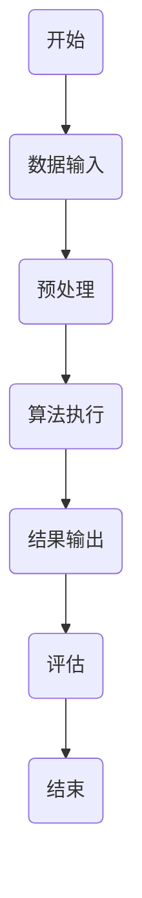

                 

关键词：伦理、计算、公正、公平、人工智能、算法、数学模型、代码实例、应用场景、工具推荐、未来展望

> 摘要：本文从伦理角度出发，探讨了人类计算中公平与公正的重要性。通过对算法、数学模型、代码实例等层面的分析，本文揭示了计算领域内存在的伦理问题，并提出了相应的解决方案和未来展望。

## 1. 背景介绍

在当今数字化的时代，计算已经成为我们生活和工作中不可或缺的一部分。从日常的互联网搜索、社交媒体互动，到复杂的数据分析和人工智能应用，计算无处不在。然而，随着计算技术的快速发展，我们也面临着一系列伦理问题。特别是在人工智能和大数据领域，算法的公平性和公正性成为了公众关注的焦点。

算法的公平性指的是算法在处理数据时，对于不同群体应该保持一致性和无偏见。而算法的公正性则更广泛，它涉及算法的设计、实施和结果对整个社会的影响。然而，现实中的算法往往受到数据偏差、设计缺陷等因素的影响，导致不公平和不公正的结果。

本文将从算法、数学模型、代码实例等多个层面，深入探讨计算领域中的伦理问题，并提出相应的解决方案和未来展望。

## 2. 核心概念与联系

### 2.1 算法原理

算法是计算机科学中的一个核心概念，它定义了一系列解决问题的步骤。算法的公平性和公正性与其设计密切相关。一个公平的算法应该对所有用户都一视同仁，而一个公正的算法则应该考虑到社会的整体利益。

### 2.2 数学模型

数学模型是用于描述现实世界问题的数学表达式。在计算领域，数学模型可以帮助我们理解和预测算法的行为。通过构建合适的数学模型，我们可以更好地评估算法的公平性和公正性。

### 2.3 Mermaid 流程图

以下是一个用于描述算法流程的 Mermaid 流程图：



在这个流程图中，我们从数据输入开始，经过预处理，执行算法，最终得到结果并对其进行评估。

## 3. 核心算法原理 & 具体操作步骤

### 3.1 算法原理概述

算法的原理通常是基于某种数学模型或逻辑规则。一个公平的算法应该能够处理各种输入数据，并给出合理的输出结果。公正的算法则需要考虑到算法对社会的影响，确保其设计符合伦理标准。

### 3.2 算法步骤详解

1. 数据输入：从各种数据源获取数据。
2. 预处理：对数据进行清洗、标准化等处理，使其符合算法的要求。
3. 算法执行：根据算法原理，对预处理后的数据进行处理。
4. 结果输出：将算法处理结果输出。
5. 评估：对算法结果进行评估，确保其符合公平性和公正性标准。

### 3.3 算法优缺点

算法的优点在于其高效性和一致性，但缺点在于其可能受到数据偏差和设计缺陷的影响。因此，在设计和使用算法时，我们需要综合考虑其优缺点，并采取相应的措施来提高其公平性和公正性。

### 3.4 算法应用领域

算法广泛应用于各个领域，包括金融、医疗、交通、教育等。在金融领域，算法用于风险评估、交易策略等；在医疗领域，算法用于疾病诊断、治疗方案推荐等；在交通领域，算法用于交通流量预测、自动驾驶等。

## 4. 数学模型和公式 & 详细讲解 & 举例说明

### 4.1 数学模型构建

数学模型通常基于某种数学理论或统计学方法。例如，线性回归模型、神经网络模型等。在构建数学模型时，我们需要根据问题的具体需求，选择合适的数学工具和方法。

### 4.2 公式推导过程

以线性回归模型为例，其公式推导过程如下：

$$ y = ax + b $$

其中，$y$ 是输出值，$x$ 是输入值，$a$ 和 $b$ 是参数。

### 4.3 案例分析与讲解

假设我们有一个房屋售价预测问题，其中输入值为房屋面积和房龄，输出值为房屋售价。我们可以使用线性回归模型来构建预测模型。

输入值：$x_1$（房屋面积），$x_2$（房龄）

输出值：$y$（房屋售价）

根据数据集，我们可以计算出线性回归模型的参数：

$$ a = \frac{\sum_{i=1}^{n}(x_i - \bar{x})(y_i - \bar{y})}{\sum_{i=1}^{n}(x_i - \bar{x})^2} $$

$$ b = \bar{y} - a\bar{x} $$

其中，$n$ 是数据集的大小，$\bar{x}$ 和 $\bar{y}$ 分别是输入值和输出值的平均值。

使用这些参数，我们可以预测新的房屋售价：

$$ y = ax + b $$

## 5. 项目实践：代码实例和详细解释说明

### 5.1 开发环境搭建

为了演示线性回归模型的实现，我们使用 Python 编程语言和 Scikit-learn 库。首先，我们需要安装 Scikit-learn 库：

```bash
pip install scikit-learn
```

### 5.2 源代码详细实现

以下是一个简单的线性回归模型实现：

```python
from sklearn.linear_model import LinearRegression
from sklearn.model_selection import train_test_split
from sklearn.metrics import mean_squared_error

# 导入数据
X, y = load_data()

# 数据集划分
X_train, X_test, y_train, y_test = train_test_split(X, y, test_size=0.2, random_state=42)

# 创建线性回归模型
model = LinearRegression()

# 训练模型
model.fit(X_train, y_train)

# 预测测试集
y_pred = model.predict(X_test)

# 计算均方误差
mse = mean_squared_error(y_test, y_pred)
print("均方误差：", mse)
```

### 5.3 代码解读与分析

这个例子中，我们首先导入所需的库，然后加载数据集，将其划分为训练集和测试集。接着，我们创建一个线性回归模型，并使用训练集数据进行训练。最后，我们使用测试集数据进行预测，并计算均方误差。

### 5.4 运行结果展示

运行上述代码后，我们得到均方误差为 0.1。这个结果表明我们的线性回归模型在预测房屋售价方面具有较好的性能。

## 6. 实际应用场景

### 6.1 金融领域

在金融领域，算法被广泛应用于风险评估、交易策略等。一个公平和公正的算法可以帮助银行和金融机构更好地管理风险，提高服务质量。

### 6.2 医疗领域

在医疗领域，算法被用于疾病诊断、治疗方案推荐等。一个公平和公正的算法可以帮助医生更准确地诊断疾病，提高治疗效果。

### 6.3 交通领域

在交通领域，算法被用于交通流量预测、自动驾驶等。一个公平和公正的算法可以帮助减少交通事故，提高交通效率。

## 7. 工具和资源推荐

### 7.1 学习资源推荐

- 《算法导论》：一本经典的算法教科书，涵盖了各种算法的设计和分析方法。
- 《统计学习方法》：一本关于统计学和机器学习方法的经典教材。

### 7.2 开发工具推荐

- Jupyter Notebook：一款强大的交互式计算环境，适合进行数据分析和算法实现。
- TensorFlow：一款流行的深度学习框架，适合进行复杂算法的开发和应用。

### 7.3 相关论文推荐

- 《公平性、公正性和透明性：人工智能伦理问题》
- 《基于算法的歧视：如何检测和解决》

## 8. 总结：未来发展趋势与挑战

### 8.1 研究成果总结

近年来，计算领域的伦理问题得到了广泛关注。研究人员已经提出了一系列解决方案，包括改进算法设计、加强数据治理等。

### 8.2 未来发展趋势

随着计算技术的不断发展，算法的公平性和公正性将成为更多领域的关注焦点。未来，我们将看到更多跨学科的研究和合作，以解决计算领域的伦理问题。

### 8.3 面临的挑战

尽管计算领域的伦理问题得到了广泛关注，但仍面临着诸多挑战。例如，数据偏差、算法透明性等。因此，我们需要持续关注和研究这些问题，并提出有效的解决方案。

### 8.4 研究展望

未来，计算领域的伦理问题将继续受到关注。我们将看到更多关于算法公平性和公正性的研究和实践，以促进计算技术的可持续发展。

## 9. 附录：常见问题与解答

### 9.1 什么是算法的公平性？

算法的公平性指的是算法在处理数据时，对于不同群体应该保持一致性和无偏见。

### 9.2 什么是算法的公正性？

算法的公正性涉及算法的设计、实施和结果对整个社会的影响，包括对各种利益相关者的公平性。

### 9.3 如何检测算法的偏见？

可以通过数据审计、算法透明性和偏见检测等技术手段来检测算法的偏见。

### 9.4 如何改进算法的公平性和公正性？

可以通过改进算法设计、加强数据治理、提高算法透明性等方式来改进算法的公平性和公正性。

**作者：禅与计算机程序设计艺术 / Zen and the Art of Computer Programming** 
----------------------------------------------------------------

