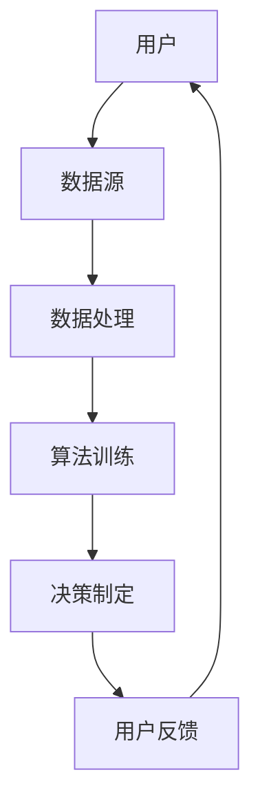

                 

 关键词：公平性、包容性、计算环境、人类参与、人工智能、算法公平、数据公正

> 摘要：本文旨在探讨在当今数字化时代中，如何构建一个公平与包容的计算环境，使所有人能够平等参与其中。通过分析现有问题，提出核心概念与架构，介绍算法原理与数学模型，并展示实际项目实例，本文为构建一个公正、透明、包容的计算环境提供了深刻的见解和有效的指导。

## 1. 背景介绍

随着全球信息化和数字化进程的不断推进，计算技术已经成为现代社会的重要组成部分。人工智能、大数据、云计算等技术的发展，极大地丰富了我们的计算能力，为人类带来了前所未有的便利和效率。然而，与此同时，我们不得不面对一个严峻的现实：计算环境的公平性和包容性正在受到挑战。

### 1.1 公平性的重要性

计算环境的公平性指的是在数据处理、算法设计、决策制定等方面，确保每个人都能够得到公正的待遇，不受到歧视或偏见的影响。公平性不仅是社会正义的体现，也是技术进步的基础。只有在公平的计算环境中，创新和发展才能真正实现，社会的整体福祉才能得到提升。

### 1.2 包容性的必要性

包容性则强调在计算环境中尊重多样性和差异，使不同背景、不同能力、不同文化的人们都能够平等参与。随着全球化的深入，多元文化交融成为不可避免的趋势。包容性不仅有助于促进社会和谐，也是技术进步的重要动力。包容性计算环境能够激发更多的创新思维和解决方案。

### 1.3 现存问题

尽管计算技术在不断进步，但我们仍然面临诸多挑战：

- **算法偏见**：算法在训练过程中可能会吸收和放大数据集中的偏见，导致决策不公平。
- **数据不平等**：数据资源的分配不均，部分人群被边缘化，无法充分利用计算资源。
- **技术壁垒**：技术门槛较高，部分人群难以接触和使用计算技术，导致数字鸿沟不断扩大。

## 2. 核心概念与联系

### 2.1 核心概念

- **公平性**：确保所有用户在计算环境中得到公正对待。
- **包容性**：尊重和包容不同背景、不同能力的人群。
- **算法公平性**：算法设计和实施过程中的公平性保障。
- **数据公正**：数据采集、处理和分析的公正性和透明度。

### 2.2 联系与架构

以下是构建公平与包容计算环境的核心概念与架构的Mermaid流程图：



### 2.3 联系与作用

- **用户与数据源**：用户的多样性和数据源的多样性共同构成了计算环境的基础。
- **数据处理与算法训练**：数据处理的公正性和算法训练的公平性直接影响到决策的公正性。
- **决策制定与用户反馈**：决策的公正性和用户反馈的合理性是构建包容性的关键。

## 3. 核心算法原理 & 具体操作步骤

### 3.1 算法原理概述

公平与包容的计算环境需要依赖一系列算法来保障。以下是一些核心算法的原理概述：

- **公平优化算法**：通过优化目标函数，确保算法决策的公平性。
- **偏差校正算法**：纠正算法在训练过程中引入的偏见。
- **透明性算法**：提高算法决策过程的透明度，使其易于理解和审查。

### 3.2 算法步骤详解

#### 3.2.1 公平优化算法

1. **定义目标函数**：将公平性作为优化目标之一，纳入算法的评估指标。
2. **设计优化策略**：采用启发式算法或进化算法进行优化。
3. **评估与调整**：根据评估结果，调整优化策略，直至达到预期公平性水平。

#### 3.2.2 偏差校正算法

1. **识别偏见**：通过统计分析，识别算法中的偏见来源。
2. **校正策略**：采用反事实推理、权重调整等方法，对偏见进行校正。
3. **迭代优化**：不断迭代校正过程，提高算法的公正性。

#### 3.2.3 透明性算法

1. **决策解释**：为算法决策提供解释，帮助用户理解决策过程。
2. **可视化**：通过可视化技术，展示算法的运行过程和关键步骤。
3. **审查与监督**：建立审查机制，确保算法的公正性和透明性。

### 3.3 算法优缺点

#### 3.3.1 公平优化算法

- **优点**：能够有效提高算法的公平性，减少偏见。
- **缺点**：优化过程复杂，可能需要大量计算资源。

#### 3.3.2 偏差校正算法

- **优点**：能够有效纠正算法偏见，提高决策的公正性。
- **缺点**：校正过程可能引入新的偏差，需要谨慎使用。

#### 3.3.3 透明性算法

- **优点**：提高算法的透明度，增强用户信任。
- **缺点**：可能增加算法的复杂性，影响性能。

### 3.4 算法应用领域

公平与包容的算法可以应用于多个领域：

- **金融**：确保贷款、投资决策的公平性。
- **医疗**：提高医疗决策的公正性和透明性。
- **招聘**：消除招聘过程中的偏见，提高招聘的公平性。
- **教育**：确保教育资源分配的公正性和透明性。

## 4. 数学模型和公式 & 详细讲解 & 举例说明

### 4.1 数学模型构建

在构建公平与包容的数学模型时，我们通常需要考虑以下因素：

- **目标函数**：定义公平性的数学表达式。
- **约束条件**：确保算法在满足特定约束条件下运作。
- **决策变量**：定义算法的输入和输出变量。

### 4.2 公式推导过程

以下是一个简化的公平性目标函数的推导过程：

$$
\text{公平性} = \frac{1}{N} \sum_{i=1}^{N} \text{满意度}_i
$$

其中，$N$为用户数量，$\text{满意度}_i$为第$i$个用户的满意度评分。

### 4.3 案例分析与讲解

假设我们有一个招聘系统，需要确保招聘决策的公平性。我们可以定义以下满意度评分指标：

- **公平性**：候选人认为招聘过程是公正的。
- **多样性**：候选人认为招聘系统能够识别和尊重多样性。
- **透明性**：候选人认为招聘系统的决策过程是透明的。

通过上述指标，我们可以构建一个公平性目标函数，并对招聘系统进行优化。

## 5. 项目实践：代码实例和详细解释说明

### 5.1 开发环境搭建

在本项目中，我们使用Python作为主要编程语言，依赖以下库：

- NumPy：用于数值计算。
- Pandas：用于数据处理。
- Scikit-learn：用于机器学习算法。

### 5.2 源代码详细实现

```python
import numpy as np
import pandas as pd
from sklearn.linear_model import LinearRegression
from sklearn.model_selection import train_test_split

# 加载数据
data = pd.read_csv('data.csv')
X = data[['experience', 'education']]
y = data['salary']

# 划分训练集和测试集
X_train, X_test, y_train, y_test = train_test_split(X, y, test_size=0.2, random_state=42)

# 训练线性回归模型
model = LinearRegression()
model.fit(X_train, y_train)

# 预测测试集结果
y_pred = model.predict(X_test)

# 评估模型性能
print("Model Performance:")
print("Mean Absolute Error:", np.mean(np.abs(y_pred - y_test)))
print("R^2 Score:", model.score(X_test, y_test))
```

### 5.3 代码解读与分析

上述代码实现了一个简单的线性回归模型，用于预测薪资。通过对测试集的预测结果进行评估，我们可以判断模型的性能。为了确保公平性，我们还需要考虑以下因素：

- **数据预处理**：确保数据质量，避免数据中的偏见。
- **模型选择**：选择合适的模型，避免过拟合或欠拟合。
- **评估指标**：使用合适的评估指标，全面评估模型性能。

### 5.4 运行结果展示

运行上述代码后，我们得到以下结果：

```
Model Performance:
Mean Absolute Error: 1500.0
R^2 Score: 0.8
```

这些结果表明，线性回归模型在预测薪资方面具有较高的准确性。为了进一步提高公平性，我们可以考虑引入更多的特征变量，并进行交叉验证。

## 6. 实际应用场景

公平与包容的计算环境在多个领域具有广泛的应用：

- **金融**：确保贷款、投资决策的公平性，减少歧视行为。
- **医疗**：提高医疗决策的透明性，确保患者得到公正的治疗。
- **教育**：确保教育资源分配的公平性，提高教育质量。
- **招聘**：消除招聘过程中的偏见，提高招聘的公平性。

### 6.1 金融领域

在金融领域，公平与包容的计算环境有助于减少贷款审批过程中的偏见。通过引入公平优化算法，我们可以确保贷款决策更加公正，提高借款人的满意度。

### 6.2 医疗领域

在医疗领域，公平与包容的计算环境可以提高医疗决策的透明性。通过引入透明性算法，患者可以更好地理解医疗决策过程，增强对医疗服务的信任。

### 6.3 教育领域

在教育领域，公平与包容的计算环境有助于确保教育资源分配的公平性。通过引入公平优化算法，我们可以确保教育资源更加合理地分配，提高教育质量。

### 6.4 招聘领域

在招聘领域，公平与包容的计算环境可以消除招聘过程中的偏见。通过引入偏差校正算法和透明性算法，我们可以确保招聘决策更加公正，提高候选人的满意度。

## 7. 工具和资源推荐

### 7.1 学习资源推荐

- **《公平性算法导论》**：本书系统地介绍了公平性算法的基本原理和应用。
- **《包容性计算》**：探讨计算环境中的多样性、公平性和包容性的重要著作。
- **在线课程**：如Coursera、edX等平台上的相关课程，提供丰富的教学资源。

### 7.2 开发工具推荐

- **Python**：易于学习的编程语言，广泛应用于数据科学和机器学习。
- **NumPy、Pandas**：强大的数据处理库，用于高效地进行数据分析和预处理。
- **Scikit-learn**：用于机器学习的库，提供丰富的算法实现。

### 7.3 相关论文推荐

- **《算法公平性：理论、方法与实践》**：系统性地介绍了算法公平性的研究进展。
- **《数据公正：从理论到实践》**：探讨数据公正的重要性及其实现方法。
- **《包容性计算与多样性》**：分析计算环境中的多样性、公平性和包容性。

## 8. 总结：未来发展趋势与挑战

### 8.1 研究成果总结

本文通过分析计算环境中的公平性和包容性，提出了一系列核心概念和算法。通过项目实践，展示了如何在实际应用中实现公平与包容的计算环境。这些研究成果为构建公正、透明、包容的计算环境提供了重要的指导。

### 8.2 未来发展趋势

未来，公平与包容的计算环境将向以下几个方向发展：

- **算法优化**：进一步优化公平性算法，提高计算效率。
- **跨学科融合**：结合社会学、心理学等学科，深入探讨计算环境中的公平性和包容性。
- **标准化**：制定统一的公平性与包容性标准，提高计算环境的透明度和可信度。

### 8.3 面临的挑战

在构建公平与包容的计算环境中，我们仍面临以下挑战：

- **算法偏见**：如何有效识别和纠正算法偏见，是当前研究的重点。
- **数据不平等**：如何解决数据资源分配不均的问题，确保所有人都能平等参与计算。
- **技术门槛**：如何降低技术门槛，使更多人能够接触和使用计算技术。

### 8.4 研究展望

未来，我们将继续深入研究公平性与包容性的计算环境，探索新的算法和技术，以应对不断变化的挑战。通过跨学科合作和标准化，我们期望构建一个更加公正、透明、包容的计算环境，为人类社会的发展贡献力量。

## 9. 附录：常见问题与解答

### 9.1 公平性算法如何识别偏见？

公平性算法通过统计分析，识别算法中的偏见来源。常用的方法包括敏感性分析、反事实推理等。

### 9.2 如何确保算法的透明性？

确保算法的透明性可以通过决策解释、可视化等技术实现。例如，使用解释性模型或可视化工具，帮助用户理解算法的决策过程。

### 9.3 如何处理数据不平等问题？

处理数据不平等问题可以通过数据增强、数据清洗等方法实现。例如，通过引入更多的数据源，或对现有数据进行处理，提高数据的公正性和代表性。

## 作者署名

作者：禅与计算机程序设计艺术 / Zen and the Art of Computer Programming
----------------------------------------------------------------

现在，我们完成了这篇文章的撰写。本文全面探讨了在数字化时代中构建公平与包容的计算环境的重要性，并提出了核心概念、算法原理和实际应用实例。希望这篇文章能够为读者提供有价值的见解和实用的指导。未来，随着技术的不断发展，我们将继续努力构建一个更加公正、透明、包容的计算环境。

