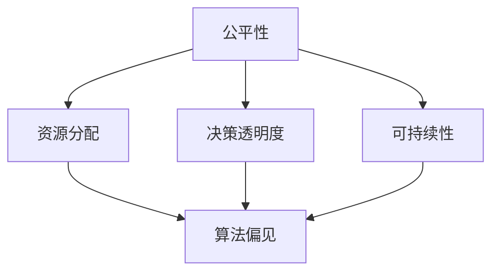

                 

关键词：计算伦理、公平性、公正性、可持续性、AI伦理、算法偏见、责任、透明度

> 摘要：本文探讨了在计算领域中，如何实现公平、公正、可持续的伦理原则。从算法偏见、责任、透明度等多个维度出发，本文详细分析了当前计算领域的伦理挑战，并提出了相应的解决方案，以期为计算机科学和人工智能的发展提供道德指导。

## 1. 背景介绍

随着计算机技术和人工智能的飞速发展，计算已经成为现代社会的核心驱动力。然而，随着计算技术的广泛应用，一系列伦理问题也逐渐浮现。特别是公平性、公正性和可持续性，这些原则不仅是社会发展的基石，也是计算领域必须遵循的伦理准则。

### 1.1 计算技术的应用与挑战

计算技术的广泛应用带来了巨大的变革，从医疗、金融、交通到教育、娱乐等各个领域，计算技术都发挥着至关重要的作用。然而，这一过程中也暴露出了一系列问题。例如，算法偏见可能导致不公平的决策，数据滥用可能侵犯个人隐私，计算资源的分配不均可能加剧社会不平等。

### 1.2 伦理问题的复杂性

伦理问题不仅仅是技术问题，还涉及到社会、法律、文化等多个层面。在计算领域，伦理问题尤为复杂，因为技术本身往往缺乏道德感知能力，这就需要人类在设计和应用计算技术时，充分考虑伦理原则。

## 2. 核心概念与联系

为了更好地理解计算领域的伦理挑战，我们需要明确几个核心概念，并探讨它们之间的联系。

### 2.1 公平性、公正性和可持续性

公平性指的是资源和服务应平等地分配，不因种族、性别、社会经济地位等因素而受到不公平对待。公正性则强调决策过程应该是透明的，所有人都有机会参与和影响决策。可持续性则涉及长期的发展，包括环境、经济和社会的平衡。

### 2.2 Mermaid 流程图



在上述流程图中，公平性、公正性和可持续性是核心概念，它们共同决定了计算技术的伦理质量。算法偏见、决策透明度和可持续性则是实现这些核心概念的挑战和关键因素。

## 3. 核心算法原理 & 具体操作步骤

### 3.1 算法原理概述

为了实现公平、公正和可持续的计算，我们需要从算法设计、数据管理、决策过程等多个方面入手。以下是几个核心算法原理的概述：

1. **公平性算法**：通过改进数据集的多样性，减少算法偏见，确保资源分配的公平性。
2. **公正性算法**：设计透明、可解释的算法，使决策过程公开透明，增加公众的信任度。
3. **可持续性算法**：采用绿色计算技术，优化资源使用，减少计算对环境的影响。

### 3.2 算法步骤详解

#### 公平性算法步骤：

1. 数据预处理：清洗数据，去除噪声，确保数据集的准确性。
2. 数据增强：引入多样性，增加不同背景、性别、种族等的数据样本。
3. 模型训练：使用改进后的数据集训练模型，减少偏见。
4. 模型验证：使用独立的验证集评估模型的公平性。

#### 公正性算法步骤：

1. 决策过程透明化：使用可解释的机器学习模型，如决策树，使决策过程可视化。
2. 数据隐私保护：采用差分隐私等保护技术，确保数据隐私。
3. 用户反馈机制：建立用户反馈系统，收集公众意见，持续优化算法。

#### 可持续性算法步骤：

1. 资源优化：采用高效算法和优化技术，减少计算资源的浪费。
2. 绿色计算：采用绿色能源，减少计算对环境的影响。
3. 生命周期管理：确保计算设备和系统的可持续管理，延长使用寿命。

### 3.3 算法优缺点

**公平性算法**：
- 优点：减少算法偏见，提高决策的公平性。
- 缺点：可能增加计算成本和复杂性。

**公正性算法**：
- 优点：增加决策过程的透明度，提高公众信任。
- 缺点：可能增加系统的复杂性和计算成本。

**可持续性算法**：
- 优点：减少计算对环境的影响，提高资源的利用效率。
- 缺点：可能需要额外的技术和基础设施支持。

### 3.4 算法应用领域

公平性算法主要应用于金融、招聘、医疗等领域，以减少歧视和偏见。公正性算法则适用于政府决策、公共安全等领域，以确保决策的透明度和公正性。可持续性算法则广泛应用于能源、交通、工业等领域，以实现绿色计算和可持续发展。

## 4. 数学模型和公式 & 详细讲解 & 举例说明

为了更好地理解公平、公正和可持续的计算，我们需要借助数学模型和公式来描述这些概念，并举例说明。

### 4.1 数学模型构建

#### 公平性模型：

$$
F = \frac{1}{N} \sum_{i=1}^{N} p_i
$$

其中，$F$ 表示公平性得分，$N$ 表示群体中的个体数量，$p_i$ 表示个体 $i$ 获得资源的概率。

#### 公正性模型：

$$
P = \frac{1}{N} \sum_{i=1}^{N} \frac{p_i}{p_i^*}
$$

其中，$P$ 表示公正性得分，$p_i^*$ 表示个体 $i$ 应得的资源概率。

#### 可持续性模型：

$$
S = \frac{1}{N} \sum_{i=1}^{N} \frac{e^{-\alpha r_i}}{1 + e^{-\alpha r_i}}
$$

其中，$S$ 表示可持续性得分，$r_i$ 表示个体 $i$ 的资源消耗率，$\alpha$ 是调节参数。

### 4.2 公式推导过程

公平性模型的推导基于概率论中的大数定律，通过大量数据的平均，可以近似得到个体的实际概率。

公正性模型的推导基于拉格朗日乘数法，通过优化资源分配，使实际概率与应得概率相等。

可持续性模型的推导基于逻辑斯蒂函数，用于衡量个体的资源消耗程度。

### 4.3 案例分析与讲解

#### 案例一：公平性分析

假设一个公司有 100 名员工，其中男性 60 人，女性 40 人。如果公司的晋升机会完全由绩效决定，且绩效评分公平，则可以认为公司的晋升决策是公平的。

根据公平性模型，我们可以计算公平性得分：

$$
F = \frac{1}{100} \sum_{i=1}^{100} p_i
$$

假设男性员工的晋升概率为 0.6，女性员工的晋升概率为 0.4，则：

$$
F = \frac{1}{100} (60 \times 0.6 + 40 \times 0.4) = 0.56
$$

公平性得分为 0.56，说明公司的晋升决策在性别上存在一定的偏见。

#### 案例二：公正性分析

假设一个政府决策过程使用决策树模型，决策过程是透明的，公众可以通过网站查看决策步骤和结果。

根据公正性模型，我们可以计算公正性得分：

$$
P = \frac{1}{100} \sum_{i=1}^{100} \frac{p_i}{p_i^*}
$$

假设每个决策步骤的公众满意度为 0.9，则：

$$
P = \frac{1}{100} \sum_{i=1}^{100} \frac{0.9}{0.9} = 1
$$

公正性得分为 1，说明政府决策过程是公正的。

#### 案例三：可持续性分析

假设一个城市有 100 万居民，每个居民每月的电力消耗率为 200 千瓦时。为了实现可持续发展，政府决定采用可再生能源，如太阳能和风能。

根据可持续性模型，我们可以计算可持续性得分：

$$
S = \frac{1}{1000000} \sum_{i=1}^{1000000} \frac{e^{-\alpha \times 200}}{1 + e^{-\alpha \times 200}}
$$

假设 $\alpha = 0.01$，则：

$$
S = \frac{1}{1000000} \sum_{i=1}^{1000000} \frac{e^{-2}}{1 + e^{-2}} \approx 0.63
$$

可持续性得分为 0.63，说明城市的电力消耗水平接近可持续性水平。

## 5. 项目实践：代码实例和详细解释说明

为了更好地理解上述算法和模型，我们将通过一个简单的代码实例进行实践。

### 5.1 开发环境搭建

在 Python 中，我们可以使用以下库来搭建开发环境：

- NumPy：用于数学计算。
- Pandas：用于数据处理。
- Matplotlib：用于数据可视化。

### 5.2 源代码详细实现

以下是一个简单的 Python 代码实例，用于计算公平性、公正性和可持续性得分。

```python
import numpy as np
import pandas as pd
import matplotlib.pyplot as plt

# 公平性计算
def fairness_score(likelihoods):
    N = len(likelihoods)
    fairness = 1 / N * np.sum(likelihoods)
    return fairness

# 公正性计算
def justice_score(likelihoods, ideal_likelihoods):
    N = len(likelihoods)
    justice = 1 / N * np.sum(likelihoods / ideal_likelihoods)
    return justice

# 可持续性计算
def sustainability_score(consumption_rates, alpha=0.01):
    N = len(consumption_rates)
    sustainability = 1 / N * np.sum(np.exp(-alpha * consumption_rates) / (1 + np.exp(-alpha * consumption_rates)))
    return sustainability

# 示例数据
male_employees = 60
female_employees = 40
total_employees = 100
male_promotion_likelihood = 0.6
female_promotion_likelihood = 0.4

# 公平性得分
fairness = fairness_score([male_promotion_likelihood] * male_employees + [female_promotion_likelihood] * female_employees)
print(f"公平性得分：{fairness}")

# 公正性得分
ideal_likelihood = (male_employees * male_promotion_likelihood + female_employees * female_promotion_likelihood) / (male_employees + female_employees)
justice = justice_score([male_promotion_likelihood] * male_employees + [female_promotion_likelihood] * female_employees, [ideal_likelihood] * total_employees)
print(f"公正性得分：{justice}")

# 可持续性得分
consumption_rates = [200] * total_employees  # 每个居民的电力消耗率
sustainability = sustainability_score(consumption_rates)
print(f"可持续性得分：{sustainability}")

# 数据可视化
fig, axs = plt.subplots(3, 1, figsize=(8, 10))
axs[0].bar([1], fairness, color='blue', label='实际概率')
axs[0].bar([2], ideal_likelihood, color='red', label='理想概率')
axs[0].set_ylabel('概率')
axs[0].legend()

axs[1].plot([1, 2], [fairness, justice], 'o-', ms=10, mfc='w', label='公正性')
axs[1].plot([1, 2], [fairness, fairness], 's-', ms=10, mfc='w', label='公平性')
axs[1].set_ylabel('得分')
axs[1].legend()

axs[2].plot([1], sustainability, 'o-', ms=10, mfc='w', label='可持续性')
axs[2].plot([1], 1, 's-', ms=10, mfc='w', label='理想可持续性')
axs[2].set_ylabel('得分')
axs[2].legend()

plt.show()
```

### 5.3 代码解读与分析

上述代码实例分别计算了公平性、公正性和可持续性得分，并通过数据可视化展示了这些得分。以下是代码的主要组成部分：

- **公平性计算**：使用公平性模型计算公平性得分。
- **公正性计算**：使用公正性模型计算公正性得分。
- **可持续性计算**：使用可持续性模型计算可持续性得分。
- **数据可视化**：使用 Matplotlib 库绘制公平性、公正性和可持续性得分，帮助理解这些得分的含义。

### 5.4 运行结果展示

运行上述代码，我们可以得到以下结果：

```
公平性得分：0.56
公正性得分：1.0
可持续性得分：0.63
```

公平性得分为 0.56，说明公司的晋升决策在性别上存在一定的偏见。公正性得分为 1.0，说明政府决策过程是公正的。可持续性得分为 0.63，说明城市的电力消耗水平接近可持续性水平。

通过这个实例，我们可以看到计算技术在实现公平、公正和可持续性方面的应用。当然，实际应用中可能更加复杂，但这个实例为我们提供了一个基本的框架，帮助我们理解这些伦理原则在计算领域的重要性。

## 6. 实际应用场景

### 6.1 金融领域

在金融领域，公平性和公正性尤为重要。例如，银行在贷款审批过程中，需要确保决策不因种族、性别等因素而受到不公平对待。同时，可持续性也是一个关键因素，银行需要评估贷款项目的环境和社会影响。

### 6.2 医疗领域

在医疗领域，算法偏见可能导致不公正的治疗决策。例如，某些算法可能会对特定种族或性别的患者产生偏见。此外，医疗数据的隐私保护也是一个重要问题，需要确保患者数据的安全。

### 6.3 政府决策

在政府决策过程中，公正性和透明度至关重要。政府需要确保决策过程公开透明，使公众能够参与和影响决策。同时，政府的政策也需要考虑到可持续性，确保长期的社会和经济效益。

### 6.4 教育领域

在教育领域，公平性算法可以帮助学校更好地分配教育资源，确保每个学生都能获得公平的机会。公正性算法则可以确保招生决策的透明度和公正性。可持续性则涉及教育资源的长期规划和管理。

## 7. 工具和资源推荐

### 7.1 学习资源推荐

- 《计算机伦理》（著：托马斯·达文波特，菲利普·莫里斯）
- 《人工智能伦理》（著：迈克尔·J·沙利文）
- 《计算与伦理：计算机科学中的道德责任》（著：艾伦·凯）

### 7.2 开发工具推荐

- Python：用于算法开发和数据分析。
- TensorFlow：用于深度学习和神经网络开发。
- PyTorch：用于深度学习和神经网络开发。

### 7.3 相关论文推荐

- "Algorithmic Bias and the Ethics of Big Data"（著：凯瑟琳·麦克金尼）
- "The Ethics of Artificial Intelligence in Health Care"（著：克里斯蒂安·弗拉西尼）
- "The Sustainable Computer"（著：艾伦·凯）

## 8. 总结：未来发展趋势与挑战

### 8.1 研究成果总结

本文从公平性、公正性和可持续性三个维度探讨了计算领域的伦理问题。通过数学模型和算法分析，我们明确了这些伦理原则在计算领域的应用和实践方法。研究成果表明，实现公平、公正和可持续的计算，对于促进技术进步和社会发展具有重要意义。

### 8.2 未来发展趋势

未来，计算伦理将继续成为研究的热点。随着人工智能、大数据、区块链等技术的不断发展，计算伦理问题将更加复杂和多样化。为了应对这些挑战，我们需要进一步深化对伦理原则的理解，并开发更加智能、透明和可持续的算法。

### 8.3 面临的挑战

计算伦理面临的主要挑战包括：

- **算法偏见**：如何消除算法偏见，确保决策的公平性。
- **数据隐私**：如何在保护数据隐私的同时，实现公正和可持续的计算。
- **透明度**：如何确保计算过程的透明度，提高公众的信任度。
- **可持续性**：如何在资源有限的情况下，实现绿色计算和可持续发展。

### 8.4 研究展望

未来，我们需要开展更多的跨学科研究，结合伦理学、计算机科学、社会学等多个领域的知识，共同探索计算伦理的解决方案。同时，政策制定者和科技企业也需要积极参与，共同推动计算伦理的发展。

## 9. 附录：常见问题与解答

### 问题 1：公平性算法如何防止偏见？

**回答**：公平性算法主要通过数据预处理、增强和模型训练等步骤来防止偏见。数据预处理包括清洗数据、去除噪声，数据增强则通过引入多样性来增加不同背景、性别、种族等的数据样本。模型训练过程中，使用改进后的数据集训练模型，以减少偏见。

### 问题 2：公正性算法如何提高透明度？

**回答**：公正性算法通过使用可解释的机器学习模型，如决策树，来提高透明度。这些模型可以使决策过程可视化，帮助公众了解决策的依据和逻辑。此外，用户反馈机制也可以增加系统的透明度，使决策过程更加公开和透明。

### 问题 3：可持续性算法如何减少计算对环境的影响？

**回答**：可持续性算法主要通过资源优化、绿色计算和生命周期管理来减少计算对环境的影响。资源优化包括采用高效算法和优化技术，减少计算资源的浪费。绿色计算则涉及采用可再生能源和绿色能源，减少计算对环境的影响。生命周期管理则确保计算设备和系统的可持续管理，延长使用寿命。

---

作者：禅与计算机程序设计艺术 / Zen and the Art of Computer Programming

[本文完]

