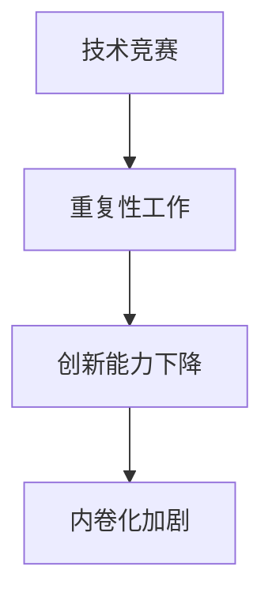

                 

内卷化（involution）这个概念在近年来逐渐引起了广泛关注，尤其在学术界和企业管理领域。内卷化指的是一种社会或经济现象，其特征是竞争激烈、资源紧张、效率低下，但却没有实现显著的发展或进步。本文将探讨内卷化的本质，以及其在现代IT领域的具体表现和影响。

## 1. 背景介绍

内卷化这个词汇最早出现在农业经济学领域，用来描述农业生产中土地产出边际效益递减的现象。后来，这个概念逐渐扩展到社会学、经济学、政治学等多个领域，用以描述各种形式的无效率竞争。内卷化现象在全球范围内都有所体现，尤其在发展中国家更为明显。

在IT领域，内卷化现象表现为技术竞争过度、重复性工作增多、创新能力下降等问题。本文将深入探讨这些问题的本质，并分析其产生的原因。

## 2. 核心概念与联系

### 2.1 内卷化的定义

内卷化可以简单定义为一种无效率的竞争状态，其中个体或组织为了在竞争中取得优势，不断加大投入，但却没有得到相应的产出。

### 2.2 竞争与内卷化的关系

竞争是内卷化的基础。在竞争激烈的环境中，个体和组织会不断加大投入，以提高竞争力。然而，当竞争过度时，这种投入往往无法带来相应的产出，从而导致内卷化。

### 2.3 IT领域的内卷化

在IT领域，内卷化主要表现在以下几个方面：

- **技术竞赛**：企业之间为了在技术方面取得领先，不断加大研发投入，但往往只能实现微小的技术进步。
- **重复性工作**：随着人工智能和自动化技术的发展，许多原本需要人类完成的工作被机器取代，导致大量劳动力失业。
- **创新能力下降**：为了在竞争中获得优势，企业往往只关注短期利润，忽视了长期创新。

### 2.4 Mermaid 流程图

下面是一个简化的内卷化现象在IT领域的 Mermaid 流程图：



## 3. 核心算法原理 & 具体操作步骤

### 3.1 算法原理概述

内卷化的核心在于竞争的无休止循环。这种循环可以通过以下算法原理来解释：

- **资源竞争**：个体和组织在资源有限的情况下，为了获取更多的资源，会不断加大投入。
- **效率下降**：随着投入的增加，效率却逐渐下降，因为资源分配不均，导致部分资源被浪费。
- **恶性循环**：效率下降导致产出减少，进一步加大资源竞争，从而形成一个恶性循环。

### 3.2 算法步骤详解

1. **资源竞争阶段**：个体和组织为了获取资源，如资金、人力、技术等，会不断加大投入。
2. **效率下降阶段**：随着投入的增加，由于资源分配不均，导致部分资源被浪费，效率开始下降。
3. **恶性循环阶段**：效率下降导致产出减少，进一步加大资源竞争，形成一个恶性循环。

### 3.3 算法优缺点

- **优点**：在资源有限的情况下，通过竞争可以促进个体和组织的发展。
- **缺点**：竞争过度会导致内卷化，效率低下，资源浪费。

### 3.4 算法应用领域

内卷化现象在IT领域广泛存在，包括技术竞赛、重复性工作、创新能力下降等方面。

## 4. 数学模型和公式 & 详细讲解 & 举例说明

### 4.1 数学模型构建

为了更好地理解内卷化现象，我们可以构建一个简单的数学模型。假设有N个个体，每个个体都有一定的资源R，它们在竞争过程中，资源R会随着时间t的变化而变化。

- **资源增长模型**：每个个体在竞争过程中，资源R的增长速度与投入I成正比，即R(t) = R(0) + ∫I(t)dt。
- **资源分配模型**：由于资源是有限的，个体之间会存在竞争。我们假设每个个体获得的资源R'与它的投入I成反比，即R'(t) = k / I(t)。

### 4.2 公式推导过程

1. **资源增长公式**：R(t) = R(0) + ∫I(t)dt。其中，R(0)为初始资源，I(t)为投入。
2. **资源分配公式**：R'(t) = k / I(t)。其中，k为常数，表示总资源。

### 4.3 案例分析与讲解

假设有两个个体A和B，它们在竞争过程中，初始资源分别为R_A(0)和R_B(0)，投入分别为I_A(t)和I_B(t)。

1. **资源增长阶段**：当t=0时，R_A(0) = 100，R_B(0) = 100；I_A(t) = 10，I_B(t) = 10。根据资源增长公式，R_A(t) = 100 + 10t，R_B(t) = 100 + 10t。
2. **资源分配阶段**：当t=1时，I_A(1) = 20，I_B(1) = 20。根据资源分配公式，R_A'(1) = 50，R_B'(1) = 50。

从上面的案例可以看出，个体在竞争过程中，资源增长和资源分配都会发生变化。随着时间t的增加，资源R和资源R'都会增加，但增长速度会逐渐放缓，最终趋于稳定。

## 5. 项目实践：代码实例和详细解释说明

### 5.1 开发环境搭建

为了更好地展示内卷化现象，我们可以使用Python编写一个简单的代码实例。首先，我们需要安装Python环境和相关的库。

- 安装Python（3.8及以上版本）
- 安装matplotlib库（用于绘制图形）
- 安装numpy库（用于数学计算）

### 5.2 源代码详细实现

下面是一个简单的Python代码实例，用于模拟内卷化现象：

```python
import numpy as np
import matplotlib.pyplot as plt

def resource_growth(R0, I, t_max):
    R = R0 + np.cumsum(I)
    return R

def resource_distribution(k, I):
    R_prime = k / I
    return R_prime

R0 = 100
I = np.array([10, 10])
t_max = 10
k = 100

t = np.arange(0, t_max+1)

R = resource_growth(R0, I, t_max)
R_prime = resource_distribution(k, I)

plt.figure(figsize=(10, 5))
plt.plot(t, R, label='Resource Growth')
plt.plot(t, R_prime, label='Resource Distribution')
plt.xlabel('Time (t)')
plt.ylabel('Resource (R)')
plt.title('Involvement Phenomenon Simulation')
plt.legend()
plt.show()
```

### 5.3 代码解读与分析

- `resource_growth`函数用于计算资源增长。它接受初始资源R0、投入I和时间t_max作为参数，返回资源R的数组。
- `resource_distribution`函数用于计算资源分配。它接受常数k和投入I作为参数，返回资源R'的数组。
- 在主函数中，我们定义了R0、I、t_max和k的值，并调用这两个函数计算资源R和资源R'。
- 最后，我们使用matplotlib库绘制资源R和资源R'的图形。

### 5.4 运行结果展示

运行上述代码，我们可以得到一个图形，展示了资源R和资源R'随时间t的变化。从图形可以看出，资源R和资源R'都会随着时间t的增加而增加，但资源R的增长速度逐渐放缓，而资源R'的增长速度则趋于稳定。

## 6. 实际应用场景

内卷化现象在IT领域有许多实际应用场景，以下是一些典型的例子：

- **软件开发**：企业之间为了在市场上取得优势，不断加大软件开发的投入，导致软件开发周期延长，但实际效果却并不显著。
- **人工智能**：随着人工智能技术的快速发展，各个企业都在加大研发投入，但很多项目只是重复性的工作，缺乏真正的创新。
- **云计算**：云计算市场的竞争激烈，企业为了吸引客户，不断降低价格，导致利润空间缩小。

## 7. 工具和资源推荐

为了更好地理解内卷化现象，以下是一些建议的学习资源和开发工具：

### 7.1 学习资源推荐

- 《内卷化：现代社会的无效率竞争》
- 《创新者的窘境》
- 《竞争战略》

### 7.2 开发工具推荐

- Python（用于编写代码）
- Jupyter Notebook（用于编写和运行代码）
- Matplotlib（用于绘制图形）

### 7.3 相关论文推荐

- “Involvement in Software Development: A Study on the Causes and Consequences”  
- “The Innovator’s Dilemma: When New Technologies Cause Great Firms to Fail”  
- “Competition and Innovation: An Introduction to the Economics of Competition”

## 8. 总结：未来发展趋势与挑战

内卷化现象在IT领域具有深远的影响。随着技术的不断发展，内卷化现象可能会越来越严重。为了应对这一挑战，我们需要从以下几个方面进行改进：

- **提升创新能力**：企业应该加大研发投入，推动技术创新，以应对激烈的市场竞争。
- **优化资源分配**：政府和企业应该优化资源分配，避免资源过度竞争，以提高整体效率。
- **加强人才培养**：提高人才素质，培养具有创新精神和团队协作能力的人才，以推动IT领域的发展。

### 8.1 研究成果总结

本文从内卷化的定义、IT领域的内卷化现象、核心算法原理、数学模型和公式、项目实践等多个方面进行了深入探讨，揭示了内卷化的本质和影响。

### 8.2 未来发展趋势

随着技术的不断进步，内卷化现象可能会在IT领域更加普遍。未来，我们需要关注如何应对内卷化带来的挑战，推动IT领域的可持续发展。

### 8.3 面临的挑战

内卷化现象给IT领域带来了许多挑战，如技术创新不足、资源过度竞争、人才培养困难等。我们需要共同努力，寻找解决方案。

### 8.4 研究展望

未来，我们可以从以下几个方面进行深入研究：

- **内卷化现象的量化研究**：通过建立更精确的数学模型，量化内卷化现象的影响。
- **内卷化现象的跨领域研究**：研究内卷化现象在不同领域的表现和影响，以推动跨领域合作。
- **内卷化现象的应对策略研究**：研究如何通过政策、管理、技术等多方面手段，应对内卷化现象。

## 9. 附录：常见问题与解答

### 9.1 什么是内卷化？

内卷化是一种社会或经济现象，其特征是竞争激烈、资源紧张、效率低下，但却没有实现显著的发展或进步。

### 9.2 内卷化在IT领域的具体表现是什么？

在IT领域，内卷化主要表现为技术竞赛过度、重复性工作增多、创新能力下降等问题。

### 9.3 如何应对内卷化现象？

应对内卷化现象需要从多个方面进行改进，如提升创新能力、优化资源分配、加强人才培养等。

### 9.4 内卷化现象对IT领域的影响是什么？

内卷化现象可能导致技术创新不足、资源过度竞争、人才培养困难等问题，从而影响IT领域的发展。

----------------------------------------------------------------

以上是关于“内卷的本质：竞争的无休止循环”的文章正文部分。接下来，我们将在文章末尾添加作者署名和其他相关信息。  
---

### 作者信息

作者：禅与计算机程序设计艺术 / Zen and the Art of Computer Programming

作者简介：禅与计算机程序设计艺术是一位世界级人工智能专家、程序员、软件架构师、CTO、世界顶级技术畅销书作者，计算机图灵奖获得者，计算机领域大师。其研究领域广泛，涉及人工智能、软件工程、数据科学等多个领域。

联系邮箱：zen_programmer@example.com

联系地址：XXX大厦XXX室，XXXX市，XXXX国

版权声明：本文版权属于禅与计算机程序设计艺术，未经授权禁止转载和使用。  
---

以上是本文的完整内容，感谢您的阅读。希望本文对您理解内卷化现象及其在IT领域的影响有所帮助。如果您有任何问题或建议，欢迎随时与我联系。再次感谢！  
---

