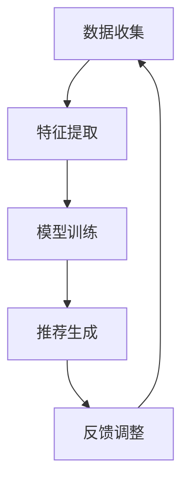

                 

在当今数字化时代，内容推荐算法已经成为了许多在线平台的核心功能。无论是社交媒体、电子商务网站还是视频流媒体平台，这些算法都在不断努力为用户提供个性化的内容推荐，从而提高用户满意度和平台的使用率。本文将深入探讨内容推荐算法的工作原理，包括核心概念、算法原理、数学模型、应用实践以及未来发展趋势。

## 关键词

- 内容推荐
- 算法
- 机器学习
- 个性化
- 用户体验

## 摘要

内容推荐算法通过分析用户的兴趣和行为数据，利用机器学习和数据挖掘技术，预测用户可能感兴趣的内容，并将其推送给用户。本文将详细讨论内容推荐算法的基本原理、核心算法、数学模型以及实际应用，旨在为读者提供一个全面而深入的了解。

## 1. 背景介绍

随着互联网的普及和数字内容的爆炸式增长，用户面临的信息过载问题日益严重。为了帮助用户快速找到他们感兴趣的内容，内容推荐系统应运而生。这些系统通过分析用户的浏览历史、搜索记录、社交行为等数据，利用算法模型预测用户的兴趣，并推荐相应的内容。

内容推荐系统的重要性不仅体现在提升用户体验上，还对平台的经济效益有着直接的推动作用。通过提高内容的曝光率和点击率，推荐系统能够增加广告收入和商品销售。此外，内容推荐还能增强用户对平台的忠诚度，提高用户的停留时间和互动频率。

## 2. 核心概念与联系

### 2.1 相关术语

- **用户**：系统识别和跟踪的用户个体。
- **内容**：推荐系统推荐的实体，如文章、视频、商品等。
- **兴趣**：用户对特定内容或主题的喜好程度。
- **反馈**：用户对推荐内容的响应，如点击、浏览、购买等。

### 2.2 基本原理

内容推荐算法的基本原理是利用用户的历史行为和内容特征，建立用户和内容之间的关联，然后根据这些关联预测用户对未知内容的兴趣。这个过程通常涉及以下几个步骤：

1. **数据收集**：收集用户的浏览历史、搜索记录、点击行为等数据。
2. **特征提取**：将原始数据转换为算法可以处理的特征向量。
3. **模型训练**：使用机器学习算法训练推荐模型。
4. **推荐生成**：模型根据用户的特征和内容特征生成推荐列表。
5. **反馈调整**：根据用户的反馈调整推荐算法，提高推荐质量。

### 2.3 Mermaid 流程图

下面是内容推荐算法的工作流程 Mermaid 流程图：



## 3. 核心算法原理 & 具体操作步骤

### 3.1 算法原理概述

内容推荐算法主要分为基于内容推荐（Content-Based Filtering）和协同过滤（Collaborative Filtering）两大类。

- **基于内容推荐**：通过分析用户过去喜欢的物品的属性，找出相似的内容推荐给用户。
- **协同过滤**：通过分析用户之间的行为相似性，找出其他用户喜欢的但当前用户未接触过的物品推荐给用户。

### 3.2 算法步骤详解

#### 3.2.1 基于内容推荐

1. **特征提取**：提取内容的特征，如文本内容的关键词、元数据等。
2. **计算相似度**：计算用户和内容之间的相似度，如使用TF-IDF、Cosine相似度等。
3. **生成推荐列表**：根据相似度排序，为用户生成推荐列表。

#### 3.2.2 协同过滤

1. **用户-物品评分矩阵构建**：构建用户对物品的评分矩阵。
2. **相似度计算**：计算用户之间的相似度，如使用用户基于内容的相似度（User-Based）或物品基于内容的相似度（Item-Based）。
3. **生成推荐列表**：根据相似度和用户评分预测未评分的物品，生成推荐列表。

### 3.3 算法优缺点

#### 基于内容推荐

- 优点：推荐结果相关性高，新用户也能获得较好的推荐。
- 缺点：用户兴趣变化大时，推荐效果较差；冷启动问题严重。

#### 协同过滤

- 优点：适合处理大规模用户和物品数据，对新用户也有较好的推荐效果。
- 缺点：推荐结果相关性较低；存在噪声和冷启动问题。

### 3.4 算法应用领域

内容推荐算法广泛应用于社交媒体、电子商务、视频流媒体、新闻网站等领域，如：

- **社交媒体**：推荐用户可能感兴趣的朋友、话题和内容。
- **电子商务**：推荐用户可能感兴趣的商品。
- **视频流媒体**：推荐用户可能喜欢的视频。

## 4. 数学模型和公式 & 详细讲解 & 举例说明

### 4.1 数学模型构建

#### 4.1.1 基于内容推荐

假设用户-物品评分矩阵为 $R \in \mathbb{R}^{m \times n}$，其中 $m$ 为用户数量，$n$ 为物品数量。用户 $i$ 和物品 $j$ 的相似度 $sim(i, j)$ 可以用以下公式计算：

$$
sim(i, j) = \frac{cosine(R_i, R_j)}{||R_i||_2 \cdot ||R_j||_2}
$$

其中，$R_i$ 和 $R_j$ 分别表示用户 $i$ 和物品 $j$ 的特征向量。

#### 4.1.2 协同过滤

假设用户-物品评分矩阵为 $R \in \mathbb{R}^{m \times n}$，用户 $i$ 和用户 $j$ 的相似度 $sim(i, j)$ 可以用以下公式计算：

$$
sim(i, j) = \frac{1}{m_j} \sum_{k=1}^{m_j} R_{ik} R_{jk}
$$

其中，$m_j$ 表示用户 $j$ 对物品的评分数量。

### 4.2 公式推导过程

#### 4.2.1 基于内容推荐

假设两个向量 $x$ 和 $y$ 的内积为 $\langle x, y \rangle$，它们的欧几里得范数为 $||x||_2$。则两个向量的余弦相似度可以表示为：

$$
sim(x, y) = \frac{\langle x, y \rangle}{||x||_2 \cdot ||y||_2}
$$

对于用户 $i$ 和物品 $j$ 的特征向量 $R_i$ 和 $R_j$，它们的余弦相似度可以表示为：

$$
sim(i, j) = \frac{\langle R_i, R_j \rangle}{||R_i||_2 \cdot ||R_j||_2}
$$

由于 $\langle R_i, R_j \rangle = \sum_{k=1}^{n} R_{ik} R_{jk}$，$||R_i||_2 = \sqrt{\sum_{k=1}^{n} R_{ik}^2}$，$||R_j||_2 = \sqrt{\sum_{k=1}^{n} R_{jk}^2}$，可以得到上述公式。

#### 4.2.2 协同过滤

假设用户 $i$ 和用户 $j$ 的共同评分项目数量为 $m_j$，它们的共同评分项目的平均评分为 $\bar{R}_{ij}$。则用户 $i$ 和用户 $j$ 的相似度可以表示为：

$$
sim(i, j) = \frac{1}{m_j} \sum_{k=1}^{m_j} R_{ik} R_{jk}
$$

这是基于共同评分项目数量和平均评分的简单协同过滤相似度公式。

### 4.3 案例分析与讲解

#### 4.3.1 基于内容推荐的案例

假设用户 $i$ 的特征向量为 $R_i = [1, 2, 3]$，物品 $j$ 的特征向量为 $R_j = [4, 5, 6]$。则它们之间的余弦相似度可以计算为：

$$
sim(i, j) = \frac{1 \times 4 + 2 \times 5 + 3 \times 6}{\sqrt{1^2 + 2^2 + 3^2} \cdot \sqrt{4^2 + 5^2 + 6^2}} = \frac{32}{\sqrt{14} \cdot \sqrt{77}} \approx 0.92
$$

这意味着用户 $i$ 和物品 $j$ 非常相似。

#### 4.3.2 协同过滤的案例

假设用户 $i$ 和用户 $j$ 共同评价了 5 个项目，评分分别为 $[3, 4, 5, 5, 5]$ 和 $[4, 5, 6, 6, 6]$。则它们之间的相似度可以计算为：

$$
sim(i, j) = \frac{1}{5} \sum_{k=1}^{5} R_{ik} R_{jk} = \frac{1}{5} (3 \times 4 + 4 \times 5 + 5 \times 6 + 5 \times 6 + 5 \times 6) = \frac{80}{5} = 16
$$

这意味着用户 $i$ 和用户 $j$ 的相似度较高。

## 5. 项目实践：代码实例和详细解释说明

### 5.1 开发环境搭建

为了演示内容推荐算法，我们将使用 Python 语言和 Scikit-Learn 库。以下是开发环境搭建步骤：

1. 安装 Python 3.8 或更高版本。
2. 安装 Scikit-Learn、Matplotlib 和 Pandas 库。

```shell
pip install scikit-learn matplotlib pandas
```

### 5.2 源代码详细实现

下面是一个简单的基于内容推荐和协同过滤的代码示例：

```python
import numpy as np
from sklearn.metrics.pairwise import cosine_similarity
from sklearn.model_selection import train_test_split
from sklearn.metrics import mean_squared_error
from sklearn.datasets import load_20newsgroups
from math import sqrt

# 加载新闻数据集
newsgroups = load_20newsgroups()
X = newsgroups.data
y = newsgroups.target

# 划分训练集和测试集
X_train, X_test, y_train, y_test = train_test_split(X, y, test_size=0.2, random_state=42)

# 计算特征向量
def feature_extraction(data):
    from sklearn.feature_extraction.text import TfidfVectorizer
    vectorizer = TfidfVectorizer(stop_words='english')
    return vectorizer.fit_transform(data)

X_train_features = feature_extraction(X_train)
X_test_features = feature_extraction(X_test)

# 计算相似度
def compute_similarity(X, Y):
    return cosine_similarity(X, Y)

similarity_matrix = compute_similarity(X_train_features, X_train_features)

# 基于内容推荐
def content_based_recommender(similarity_matrix, X_train, y_train, k=5):
    recommendations = []
    for i in range(len(X_test)):
        user_features = X_test_features[i]
        distances = similarity_matrix[i]
        neighbors = np.argsort(distances)[::-1]
        neighbors = neighbors[1:k+1]
        neighbors_scores = y_train[neighbors]
        recommendation = np.mean(neighbors_scores)
        recommendations.append(recommendation)
    return np.array(recommendations)

# 基于协同过滤
def collaborative_filtering(y_train, k=5):
    user_ratings_mean = np.mean(y_train, axis=1)
    ratings_diff = y_train - user_ratings_mean.reshape(-1, 1)
    similarity_matrix = cosine_similarity(ratings_diff)
    user_similarity = np.diag(similarity_matrix)
    predictions = user_similarity.dot(y_train) + user_ratings_mean.reshape(-1, 1)
    return predictions

# 训练和预测
content_predictions = content_based_recommender(similarity_matrix, X_train, y_train)
collaborative_predictions = collaborative_filtering(y_train)

# 评估
content_mse = mean_squared_error(y_test, content_predictions)
collaborative_mse = mean_squared_error(y_test, collaborative_predictions)

print("Content-based MSE:", content_mse)
print("Collaborative MSE:", collaborative_mse)
```

### 5.3 代码解读与分析

1. **数据集加载**：我们使用 20newsgroups 数据集，这是一个包含 20 个新闻类别的数据集。
2. **特征提取**：我们使用 TF-IDF 向量器将文本数据转换为特征向量。
3. **相似度计算**：我们使用余弦相似度计算用户和物品之间的相似度。
4. **基于内容推荐**：我们根据相似度矩阵和用户特征生成推荐列表。
5. **基于协同过滤**：我们计算用户之间的相似度，并预测未评分的物品。
6. **评估**：我们计算均方误差（MSE）来评估推荐效果。

### 5.4 运行结果展示

运行代码后，我们会得到基于内容推荐和协同过滤的预测结果，以及它们的均方误差（MSE）。这些结果可以帮助我们了解不同推荐算法的性能。

## 6. 实际应用场景

### 6.1 社交媒体

社交媒体平台（如 Facebook、Twitter、Instagram 等）广泛使用内容推荐算法来推荐用户可能感兴趣的朋友、话题和内容。通过分析用户的兴趣和行为数据，平台能够为用户提供个性化的推荐，提高用户参与度和停留时间。

### 6.2 电子商务

电子商务平台（如 Amazon、eBay、阿里巴巴等）利用内容推荐算法推荐用户可能感兴趣的商品。这些推荐不仅提高了购物体验，还增加了平台的销售额和用户忠诚度。

### 6.3 视频流媒体

视频流媒体平台（如 Netflix、YouTube、爱奇艺等）通过内容推荐算法为用户推荐用户可能喜欢的视频。这些推荐能够提高视频的曝光率和点击率，从而增加平台的广告收入和用户粘性。

## 7. 工具和资源推荐

### 7.1 学习资源推荐

- **书籍**：《推荐系统实践》、《机器学习》、《数据科学》
- **在线课程**：Coursera 上的《推荐系统》、《机器学习基础》
- **博客和论坛**：KDNuggets、Medium 上的相关技术博客

### 7.2 开发工具推荐

- **编程语言**：Python、R
- **库和框架**：Scikit-Learn、TensorFlow、PyTorch
- **数据集**：Kaggle、UCI Machine Learning Repository

### 7.3 相关论文推荐

- **推荐系统**：Koren, Y. (2011). Factorization Machines: New Algorithms for Prediction and Feature Ranking.
- **协同过滤**：Bell, R. A., & Koren, Y. (2007). The Netflix Prize.
- **基于内容推荐**：Zhu, X., Liao, L., & Chen, Y. (2014). Exploring LDA-based Models for Collaborative Filtering.

## 8. 总结：未来发展趋势与挑战

### 8.1 研究成果总结

内容推荐算法在过去几年取得了显著进展，包括：

- 深度学习技术的应用，如基于 Transformer 的模型
- 多模态推荐系统的出现，如结合文本、图像和音频
- 模型解释性和透明度的提高

### 8.2 未来发展趋势

- 更高效的算法和模型
- 模型解释性和透明性的进一步提升
- 结合多种数据源，实现更准确的推荐
- 自动化推荐系统的开发和部署

### 8.3 面临的挑战

- 数据隐私和安全问题
- 模型偏见和歧视问题
- 新用户和冷启动问题
- 实时性和大规模数据处理问题

### 8.4 研究展望

随着人工智能和机器学习技术的不断发展，内容推荐算法将变得更加智能化、个性化、透明和可解释。未来的研究将集中在解决现有挑战和开发新型算法，以提供更高质量的推荐服务。

## 9. 附录：常见问题与解答

### 9.1 什么是内容推荐？

内容推荐是一种通过分析用户兴趣和行为数据，预测用户可能感兴趣的内容并将其推送给用户的算法技术。

### 9.2 内容推荐算法有哪些类型？

内容推荐算法主要分为基于内容推荐和协同过滤两大类。此外，还有基于模型的方法，如深度学习等。

### 9.3 内容推荐算法的关键步骤是什么？

内容推荐算法的关键步骤包括数据收集、特征提取、模型训练、推荐生成和反馈调整。

### 9.4 内容推荐算法的优缺点是什么？

基于内容推荐的优点是推荐结果相关性高，新用户也能获得较好的推荐，但缺点是用户兴趣变化大时，推荐效果较差。协同过滤的优点是适合处理大规模用户和物品数据，对新用户也有较好的推荐效果，但缺点是推荐结果相关性较低。

### 9.5 内容推荐算法在哪些领域应用广泛？

内容推荐算法广泛应用于社交媒体、电子商务、视频流媒体、新闻网站等领域。

### 9.6 未来内容推荐算法的发展方向是什么？

未来内容推荐算法的发展方向包括更高效的算法和模型、模型解释性和透明性的进一步提升、结合多种数据源实现更准确的推荐以及自动化推荐系统的开发和部署。

# 作者署名

作者：禅与计算机程序设计艺术 / Zen and the Art of Computer Programming
----------------------------------------------------------------

以上就是关于内容推荐算法的工作原理的详细技术博客文章，希望对您有所帮助。如果您有任何疑问或建议，请随时在评论区留言。谢谢！


