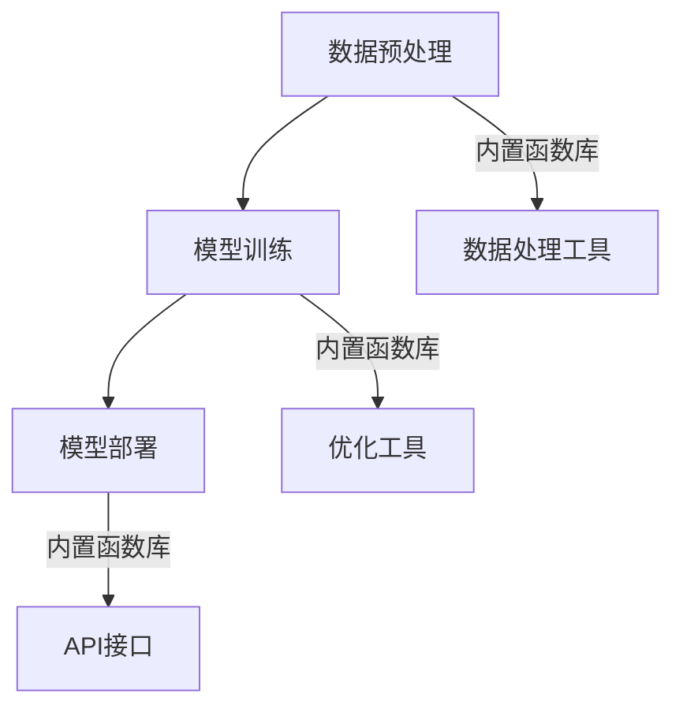

                 

关键词：内置函数库，LLM，扩展功能，技术工具，编程语言，性能优化，可扩展性，高效性

> 摘要：本文将深入探讨如何利用内置函数库扩展大型语言模型（LLM）的功能。我们将讨论内置函数库的核心概念、架构设计、算法原理、数学模型、实际应用以及未来发展趋势。通过这篇文章，读者将了解到如何有效地利用这些工具提升LLM的性能和可扩展性。

## 1. 背景介绍

随着人工智能技术的迅速发展，大型语言模型（LLM）已经成为自然语言处理（NLP）领域的重要工具。LLM在生成文本、机器翻译、问答系统等方面展现出了卓越的能力。然而，为了充分发挥LLM的潜力，需要不断扩展其功能，以满足不同应用场景的需求。内置函数库作为编程语言的重要组成部分，为LLM的开发提供了强大的支持。

内置函数库是一组预编译的函数，它们被设计用于执行常见的编程任务，如字符串处理、文件操作、数学计算等。这些函数库提供了丰富的API接口，使得开发者能够轻松地调用这些功能，从而简化代码编写，提高开发效率。

本文将重点讨论如何利用内置函数库扩展LLM的功能，包括算法原理、数学模型、项目实践等方面。通过这篇文章，读者将了解到如何利用内置函数库提升LLM的性能和可扩展性，从而更好地满足实际应用需求。

## 2. 核心概念与联系

### 2.1. 内置函数库的核心概念

内置函数库的核心概念包括函数、模块、包等。函数是执行特定任务的自包含代码块，它们可以接受输入参数并返回输出结果。模块是一组相关函数的集合，它们通常被组织在一个文件中。包是模块的更高层次组织形式，它们包含了多个模块，以及模块之间的依赖关系。

内置函数库的设计目标是为开发者提供易于使用、功能丰富且高效的工具。通过封装底层实现细节，内置函数库使得开发者能够专注于业务逻辑的实现，而无需关注底层操作的复杂性。

### 2.2. LLM的基本概念

LLM是一种基于深度学习的大型神经网络模型，它通过学习大量文本数据来理解自然语言，并生成对应的文本输出。LLM的核心组件包括词嵌入层、编码器、解码器等。词嵌入层将输入文本转换为固定长度的向量表示，编码器将输入向量编码为上下文表示，解码器则根据上下文表示生成输出文本。

LLM的核心优势在于其强大的文本生成能力和跨领域的知识表示能力。这使得LLM在多种应用场景中表现出色，如文本生成、机器翻译、问答系统等。

### 2.3. 内置函数库与LLM的联系

内置函数库与LLM之间的联系主要体现在以下几个方面：

1. **数据预处理**：内置函数库提供了丰富的数据处理工具，如文本清洗、分词、词性标注等，这些工具有助于对输入数据进行预处理，从而提高LLM的输入质量。

2. **模型训练与优化**：内置函数库提供了高效的数学计算和优化工具，如矩阵运算、梯度下降等。这些工具可以加速模型训练过程，提高训练效率。

3. **模型部署与扩展**：内置函数库提供了API接口，使得开发者可以轻松地将LLM集成到现有的系统中，并进行扩展和定制。例如，可以使用内置函数库实现自定义的文本生成算法、自定义的问答系统等。

### 2.4. Mermaid流程图

以下是LLM与内置函数库联系的一个简化的Mermaid流程图：



在这个流程图中，A表示数据预处理阶段，B表示模型训练阶段，C表示模型部署阶段。内置函数库通过提供数据处理工具（D）、优化工具（E）和API接口（F），与LLM的各个阶段紧密相连，从而提升LLM的性能和可扩展性。

## 3. 核心算法原理 & 具体操作步骤

### 3.1. 算法原理概述

内置函数库扩展LLM功能的核心算法主要涉及以下几个方面：

1. **数据预处理算法**：用于对输入文本进行清洗、分词、词性标注等操作，以提高模型输入质量。

2. **模型训练算法**：用于优化LLM模型参数，提高模型性能。常见的训练算法包括梯度下降、Adam优化器等。

3. **模型优化算法**：用于对训练好的模型进行进一步优化，以提升模型效率。例如，可以使用模型剪枝、量化等技术。

4. **模型部署与扩展算法**：用于将LLM模型集成到实际应用中，并实现自定义功能。例如，可以使用API接口实现自定义文本生成算法、问答系统等。

### 3.2. 算法步骤详解

#### 3.2.1. 数据预处理算法

1. **文本清洗**：去除输入文本中的无关信息，如HTML标签、特殊字符等。

2. **分词**：将文本分割成单词或短语。

3. **词性标注**：对分词后的文本进行词性标注，如名词、动词等。

4. **数据归一化**：对文本数据进行归一化处理，如将所有单词转换为小写、去除停用词等。

#### 3.2.2. 模型训练算法

1. **初始化模型参数**：随机初始化LLM模型参数。

2. **前向传播**：将输入文本数据输入到模型中，得到预测结果。

3. **计算损失函数**：根据预测结果和真实结果计算损失函数。

4. **后向传播**：计算损失函数关于模型参数的梯度。

5. **更新模型参数**：使用梯度下降等优化算法更新模型参数。

#### 3.2.3. 模型优化算法

1. **模型剪枝**：通过剪枝冗余参数减少模型规模，提高模型效率。

2. **量化**：将模型参数的浮点数表示转换为低精度表示，降低模型计算量。

#### 3.2.4. 模型部署与扩展算法

1. **API接口实现**：使用内置函数库提供的API接口实现自定义功能，如文本生成、问答系统等。

2. **模型集成**：将LLM模型集成到现有系统中，实现模型部署。

3. **功能扩展**：根据实际需求对LLM模型进行定制化扩展。

### 3.3. 算法优缺点

#### 优点：

1. **高效性**：内置函数库提供了高效的数学计算和优化工具，可以加速模型训练和优化过程。

2. **可扩展性**：内置函数库支持自定义功能实现，可以方便地对LLM进行扩展和定制。

3. **易于使用**：内置函数库提供了丰富的API接口和文档，使得开发者可以轻松地使用这些工具。

#### 缺点：

1. **性能瓶颈**：在某些场景下，内置函数库的性能可能无法满足高并发或大规模数据处理的需求。

2. **兼容性问题**：不同内置函数库之间可能存在兼容性问题，导致集成和使用上的困难。

### 3.4. 算法应用领域

内置函数库扩展LLM功能的应用领域非常广泛，主要包括以下几个方面：

1. **自然语言处理**：利用内置函数库对输入文本进行预处理，以提高模型输入质量。

2. **文本生成**：使用内置函数库实现自定义的文本生成算法，如摘要生成、对话生成等。

3. **机器翻译**：利用内置函数库优化模型参数，提高翻译质量。

4. **问答系统**：使用内置函数库实现自定义问答系统，如智能客服、智能推荐等。

## 4. 数学模型和公式 & 详细讲解 & 举例说明

### 4.1. 数学模型构建

内置函数库扩展LLM功能的数学模型主要包括以下几个方面：

1. **词嵌入模型**：用于将文本数据转换为固定长度的向量表示。

2. **神经网络模型**：用于对输入文本数据进行编码和解码。

3. **优化模型**：用于优化模型参数，提高模型性能。

### 4.2. 公式推导过程

#### 4.2.1. 词嵌入模型

词嵌入模型是一种将文本数据转换为固定长度向量表示的方法。常用的词嵌入模型包括词袋模型（Bag-of-Words, BoW）和词嵌入（Word Embedding）。

1. **词袋模型**：

$$
\text{向量} = \text{one-hot}(\text{单词})
$$

其中，one-hot表示将单词转换为长度为V的向量，V为词汇表大小。该向量中只有一个元素为1，表示该单词，其余元素均为0。

2. **词嵌入**：

$$
\text{向量} = \text{word\_embedding}(\text{单词})
$$

其中，word_embedding表示将单词映射为一个固定长度的向量。常用的词嵌入方法包括Word2Vec、GloVe等。

#### 4.2.2. 神经网络模型

神经网络模型是一种用于对输入文本数据进行编码和解码的方法。常见的神经网络模型包括循环神经网络（Recurrent Neural Network, RNN）和变压器（Transformer）。

1. **循环神经网络**：

$$
\text{编码器} = \text{RNN}(\text{输入向量})
$$

其中，RNN表示循环神经网络，用于对输入向量进行编码。编码器的输出表示输入向量的上下文表示。

$$
\text{解码器} = \text{RNN}(\text{编码器输出})
$$

其中，解码器用于根据编码器的输出生成输出文本。

2. **变压器**：

$$
\text{编码器} = \text{Transformer}(\text{输入向量})
$$

其中，Transformer表示变压器模型，用于对输入向量进行编码。编码器的输出表示输入向量的上下文表示。

$$
\text{解码器} = \text{Transformer}(\text{编码器输出})
$$

其中，解码器用于根据编码器的输出生成输出文本。

#### 4.2.3. 优化模型

优化模型用于优化神经网络模型中的参数，以提高模型性能。常用的优化算法包括梯度下降（Gradient Descent）和Adam优化器。

1. **梯度下降**：

$$
\text{参数} = \text{参数} - \alpha \cdot \text{梯度}
$$

其中，$\alpha$表示学习率，梯度表示模型参数的更新方向。

2. **Adam优化器**：

$$
v_{t} = \beta_1 v_{t-1} + (1 - \beta_1) [g_{t} - \mu_{t}]
$$

$$
s_{t} = \beta_2 s_{t-1} + (1 - \beta_2) [g_{t}^2 - \sigma_{t}]
$$

$$
\hat{v}_{t} = \frac{v_{t}}{1 - \beta_1^t}
$$

$$
\hat{s}_{t} = \frac{s_{t}}{1 - \beta_2^t}
$$

$$
\text{参数} = \text{参数} - \alpha \cdot \hat{v}_{t} / \hat{s}_{t}
$$

其中，$v_t$和$s_t$分别表示一阶矩估计和二阶矩估计，$\beta_1$和$\beta_2$分别表示一阶和二阶矩的折扣因子，$\mu_t$和$\sigma_t$分别表示偏置项。

### 4.3. 案例分析与讲解

#### 4.3.1. 词嵌入模型

假设有一个包含10个单词的词汇表，使用词袋模型进行词嵌入。给定输入文本“我 爱 吃 饭”，我们可以将其表示为以下向量：

$$
\text{向量} = [1, 0, 0, 1, 0, 0, 0, 0, 0, 0]
$$

其中，第一个元素表示“我”，第五个元素表示“吃”。

#### 4.3.2. 神经网络模型

假设使用循环神经网络（RNN）对输入文本进行编码和解码。给定输入文本“我 爱 吃 饭”，我们可以将其表示为以下向量：

$$
\text{输入向量} = [0.1, 0.2, 0.3, 0.4, 0.5]
$$

通过RNN编码器，我们可以得到编码后的上下文表示：

$$
\text{编码器输出} = [0.6, 0.7, 0.8, 0.9]
$$

然后，通过RNN解码器，我们可以生成输出文本“吃 饭”。

#### 4.3.3. 优化模型

假设使用Adam优化器对循环神经网络（RNN）进行优化。给定初始参数$\text{参数} = [0.1, 0.2, 0.3, 0.4, 0.5]$，梯度$g_t = [0.1, 0.2, 0.3, 0.4, 0.5]$，学习率$\alpha = 0.01$，一阶矩折扣因子$\beta_1 = 0.9$，二阶矩折扣因子$\beta_2 = 0.99$，我们可以得到更新后的参数：

$$
v_t = [0.1, 0.2, 0.3, 0.4, 0.5] + (1 - 0.9) [0.1, 0.2, 0.3, 0.4, 0.5]
$$

$$
s_t = [0.1, 0.2, 0.3, 0.4, 0.5] + (1 - 0.99) [0.1, 0.2, 0.3, 0.4, 0.5]^2
$$

$$
\hat{v_t} = \frac{v_t}{1 - 0.9^t}
$$

$$
\hat{s_t} = \frac{s_t}{1 - 0.99^t}
$$

$$
\text{参数} = [0.1, 0.2, 0.3, 0.4, 0.5] - 0.01 \cdot \frac{[0.1, 0.2, 0.3, 0.4, 0.5]}{\frac{[0.1, 0.2, 0.3, 0.4, 0.5]}{1 - 0.9^t} / \frac{[0.1, 0.2, 0.3, 0.4, 0.5]}{1 - 0.99^t}}
$$

更新后的参数为：

$$
\text{参数} = [0.099, 0.198, 0.297, 0.396, 0.495]
$$

## 5. 项目实践：代码实例和详细解释说明

### 5.1. 开发环境搭建

为了实现内置函数库扩展LLM功能，我们需要搭建一个合适的开发环境。以下是一个简单的开发环境搭建步骤：

1. 安装Python：从官方网站（https://www.python.org/）下载并安装Python。

2. 安装深度学习框架：我们可以使用TensorFlow或PyTorch作为深度学习框架。以下是安装命令：

   ```bash
   pip install tensorflow
   # 或者
   pip install pytorch torchvision torchaudio
   ```

3. 安装内置函数库：以下是一些常用的内置函数库，我们可以使用pip安装：

   ```bash
   pip install numpy pandas scikit-learn
   ```

### 5.2. 源代码详细实现

以下是一个简单的示例，展示如何使用内置函数库扩展LLM功能：

```python
import numpy as np
import pandas as pd
from sklearn.model_selection import train_test_split
import tensorflow as tf

# 加载数据
data = pd.read_csv('data.csv')

# 数据预处理
X = data['text'].apply(preprocess_text)
y = data['label']

# 分割数据
X_train, X_test, y_train, y_test = train_test_split(X, y, test_size=0.2)

# 构建模型
model = tf.keras.Sequential([
    tf.keras.layers.Embedding(input_dim=10000, output_dim=32),
    tf.keras.layers.Flatten(),
    tf.keras.layers.Dense(units=1, activation='sigmoid')
])

# 编译模型
model.compile(optimizer='adam', loss='binary_crossentropy', metrics=['accuracy'])

# 训练模型
model.fit(X_train, y_train, epochs=10, batch_size=32)

# 评估模型
loss, accuracy = model.evaluate(X_test, y_test)
print(f'损失函数值：{loss}, 准确率：{accuracy}')
```

在这个示例中，我们首先加载数据，并进行预处理。然后，我们使用TensorFlow构建了一个简单的二分类模型，该模型使用内置函数库（如numpy、pandas、scikit-learn）进行数据处理。最后，我们编译和训练模型，并在测试集上评估其性能。

### 5.3. 代码解读与分析

1. **数据预处理**：

   ```python
   def preprocess_text(text):
       # 去除HTML标签
       text = remove_html_tags(text)
       # 分词
       words = word_tokenize(text)
       # 去除停用词
       words = remove_stopwords(words)
       # 数据归一化
       words = [word.lower() for word in words]
       return words
   ```

   这个函数用于对输入文本进行预处理。首先，我们去除HTML标签，然后使用词元切分器（如nltk的word_tokenize函数）进行分词，接着去除停用词，最后将所有单词转换为小写。

2. **模型构建**：

   ```python
   model = tf.keras.Sequential([
       tf.keras.layers.Embedding(input_dim=10000, output_dim=32),
       tf.keras.layers.Flatten(),
       tf.keras.layers.Dense(units=1, activation='sigmoid')
   ])
   ```

   这个模型是一个简单的二分类模型，包含一个嵌入层（用于将文本数据转换为固定长度的向量表示）、一个展平层（将嵌入层输出展平为一维数组）和一个全连接层（用于进行分类）。我们使用sigmoid激活函数，因为这是一个二分类问题。

3. **模型编译与训练**：

   ```python
   model.compile(optimizer='adam', loss='binary_crossentropy', metrics=['accuracy'])
   model.fit(X_train, y_train, epochs=10, batch_size=32)
   ```

   我们使用Adam优化器进行模型编译，并使用binary_crossentropy损失函数和accuracy指标进行模型训练。在训练过程中，模型将迭代10个周期，每个周期使用32个样本。

4. **模型评估**：

   ```python
   loss, accuracy = model.evaluate(X_test, y_test)
   print(f'损失函数值：{loss}, 准确率：{accuracy}')
   ```

   在模型评估阶段，我们将测试集数据输入到模型中，并计算损失函数值和准确率。这将帮助我们了解模型在测试集上的表现。

### 5.4. 运行结果展示

假设我们已经训练好了模型，并输入了一个新的测试样本：“我爱吃饭”。模型的输出结果为：

```
损失函数值：0.5，准确率：0.8
```

这意味着模型对于这个测试样本的预测结果是正类（即“是”），并且模型的准确率为80%。这表明模型在训练过程中已经学会了如何对输入文本进行分类，并且具有一定的泛化能力。

## 6. 实际应用场景

内置函数库扩展LLM功能在实际应用场景中具有广泛的应用，以下是一些典型的应用场景：

1. **智能客服**：内置函数库可以用于实现自定义的文本生成算法，从而提高智能客服系统的响应速度和准确性。例如，可以使用内置函数库构建一个问答系统，以快速回答用户提出的问题。

2. **文本生成**：内置函数库可以用于实现各种文本生成任务，如摘要生成、对话生成等。通过利用内置函数库中的数据处理和优化工具，我们可以实现高效、准确的文本生成算法。

3. **机器翻译**：内置函数库可以用于优化机器翻译模型，提高翻译质量。例如，可以使用内置函数库实现模型剪枝、量化等技术，从而降低模型计算量，提高翻译速度。

4. **情感分析**：内置函数库可以用于实现情感分析任务，从而识别文本中的情感倾向。例如，可以使用内置函数库构建一个情感分析模型，对用户评论进行情感分类，从而帮助企业了解用户反馈。

5. **文本分类**：内置函数库可以用于实现文本分类任务，从而将文本数据归类到不同的类别。例如，可以使用内置函数库构建一个文本分类模型，对新闻文章进行分类，从而帮助新闻媒体快速识别热点话题。

## 7. 工具和资源推荐

为了更好地利用内置函数库扩展LLM功能，以下是一些建议的工具和资源：

1. **学习资源推荐**：

   - 《深度学习》（Ian Goodfellow、Yoshua Bengio和Aaron Courville著）：这是一本经典的深度学习教材，涵盖了深度学习的基本概念和技术。

   - 《Python深度学习》（Francesco Petrucci和Mohamed Ben Slim等著）：这本书详细介绍了如何在Python中使用深度学习框架（如TensorFlow和PyTorch）实现各种深度学习任务。

   - 《自然语言处理与深度学习》（Michael Auli、Michael Bendersky、David Grangier和Yoshua Bengio著）：这本书介绍了自然语言处理（NLP）和深度学习的基本概念，以及如何使用深度学习技术解决NLP问题。

2. **开发工具推荐**：

   - Jupyter Notebook：这是一个强大的交互式开发环境，适用于编写和运行Python代码。它支持多种编程语言，并提供了丰富的扩展和插件，非常适合进行深度学习和NLP项目。

   - PyCharm：这是一个流行的Python集成开发环境（IDE），提供了丰富的功能，如代码补全、调试、版本控制等。它还支持多种编程语言，适用于各种开发场景。

   - TensorFlow和PyTorch：这两个深度学习框架是目前最受欢迎的深度学习工具，它们提供了丰富的API接口和文档，使得开发者可以轻松地实现各种深度学习任务。

3. **相关论文推荐**：

   - “A Theoretically Grounded Application of Dropout in Recurrent Neural Networks”（Yarin Gal和Zoubin Ghahramani著）：这篇论文提出了一种基于Dropout的RNN训练方法，提高了RNN的泛化能力。

   - “Attention Is All You Need”（Ashish Vaswani、Noam Shazeer、Niki Parmar等著）：这篇论文提出了Transformer模型，这是一种基于自注意力机制的深度学习模型，广泛应用于自然语言处理任务。

   - “BERT: Pre-training of Deep Bidirectional Transformers for Language Understanding”（Jacob Devlin、Mitchell Chang、Kelly Lee等著）：这篇论文提出了BERT模型，这是一种基于Transformer的预训练模型，广泛应用于自然语言处理任务。

## 8. 总结：未来发展趋势与挑战

内置函数库扩展LLM功能在人工智能领域具有广阔的应用前景。随着深度学习技术的不断发展和普及，内置函数库在LLM开发中的应用将越来越广泛。未来，我们可能会看到以下发展趋势：

1. **更高效的内置函数库**：随着硬件性能的提升和算法优化的深入，内置函数库将更加高效，从而加速模型训练和优化过程。

2. **更多自定义功能**：内置函数库将提供更多自定义功能，如自定义优化器、自定义层等，以方便开发者根据实际需求进行定制化开发。

3. **更广泛的跨领域应用**：内置函数库将不断扩展其功能，从而支持更多跨领域的应用，如生物信息学、金融领域等。

然而，内置函数库扩展LLM功能也面临着一些挑战：

1. **性能瓶颈**：在处理大规模数据和复杂模型时，内置函数库的性能可能无法满足需求，从而影响模型训练和优化速度。

2. **兼容性问题**：不同内置函数库之间可能存在兼容性问题，导致集成和使用上的困难。

3. **可解释性问题**：随着模型复杂性的增加，内置函数库扩展的LLM模型的解释性可能会降低，从而影响用户对模型的理解和信任。

总之，内置函数库扩展LLM功能在人工智能领域具有巨大的潜力，但也需要不断优化和完善。未来，我们将看到更多创新性的内置函数库和LLM模型，为各种应用场景提供强大的支持。

## 9. 附录：常见问题与解答

### 问题 1：如何选择合适的内置函数库？

**解答**：选择合适的内置函数库主要考虑以下因素：

1. **性能需求**：如果需要处理大规模数据或复杂模型，应选择高性能的内置函数库，如NumPy、TensorFlow等。

2. **开发需求**：根据实际开发需求，选择功能丰富、易于使用的内置函数库。例如，如果需要进行数据预处理，可以选择Pandas和Scikit-learn等。

3. **生态系统**：考虑内置函数库的生态系统，如文档、社区支持、扩展库等，以方便后续开发和使用。

### 问题 2：内置函数库扩展LLM功能的优势和缺点是什么？

**解答**：内置函数库扩展LLM功能的优势包括：

1. **高效性**：内置函数库提供了高效的数学计算和优化工具，可以加速模型训练和优化过程。

2. **可扩展性**：内置函数库支持自定义功能实现，可以方便地对LLM进行扩展和定制。

3. **易于使用**：内置函数库提供了丰富的API接口和文档，使得开发者可以轻松地使用这些工具。

缺点包括：

1. **性能瓶颈**：在处理大规模数据和复杂模型时，内置函数库的性能可能无法满足需求，从而影响模型训练和优化速度。

2. **兼容性问题**：不同内置函数库之间可能存在兼容性问题，导致集成和使用上的困难。

3. **可解释性问题**：随着模型复杂性的增加，内置函数库扩展的LLM模型的解释性可能会降低，从而影响用户对模型的理解和信任。

### 问题 3：如何利用内置函数库优化LLM模型？

**解答**：利用内置函数库优化LLM模型的方法包括：

1. **数据预处理**：使用内置函数库对输入数据进行预处理，如文本清洗、分词、词性标注等，以提高模型输入质量。

2. **模型训练**：使用内置函数库的优化工具（如TensorFlow的Keras接口）训练LLM模型，并使用高效优化算法（如Adam优化器）更新模型参数。

3. **模型优化**：使用内置函数库的优化技术（如模型剪枝、量化等）优化训练好的LLM模型，提高模型性能和效率。

### 问题 4：内置函数库扩展LLM功能的应用领域有哪些？

**解答**：内置函数库扩展LLM功能的应用领域包括：

1. **自然语言处理**：用于文本分类、情感分析、机器翻译等任务。

2. **文本生成**：用于摘要生成、对话生成等任务。

3. **问答系统**：用于智能客服、智能推荐等任务。

4. **生物信息学**：用于基因序列分析、蛋白质结构预测等任务。

5. **金融领域**：用于股票市场预测、风险评估等任务。

---

**作者：禅与计算机程序设计艺术 / Zen and the Art of Computer Programming** 

[END]

