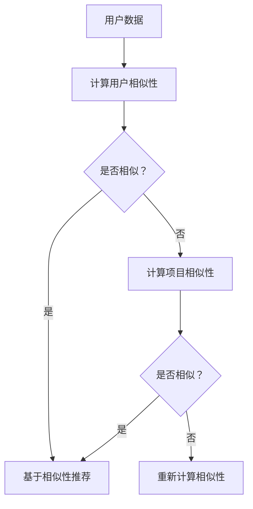

                 

 关键词：推荐系统、冷启动、相似性度量、协同过滤、机器学习、用户行为分析、信息过滤、预测准确性、用户满意度

> 摘要：本文深入探讨了推荐系统中的冷启动问题，分析了其在实际应用中的挑战和限制，并探讨了基于相似性度量和协同过滤算法的解决方案。通过数学模型和具体实现，我们展示了如何通过优化算法提高推荐系统的预测准确性和用户满意度。此外，本文还对推荐系统的未来发展趋势和面临的挑战进行了展望。

## 1. 背景介绍

推荐系统是当今互联网领域中至关重要的组成部分，广泛应用于电子商务、社交媒体、音乐流媒体、新闻推送等多个领域。其核心目标是通过分析用户的历史行为和偏好，为用户推荐可能感兴趣的内容或商品，从而提升用户体验和商家收益。

然而，推荐系统在实际应用中面临着诸多挑战，其中最为突出的是冷启动问题。所谓冷启动问题，指的是当用户刚刚进入系统或对系统还不够了解时，系统难以为其提供个性化推荐的问题。冷启动问题主要源于以下几个方面：

1. **用户信息缺失**：对于新用户，系统缺乏足够的历史行为数据，难以准确推断其兴趣和偏好。
2. **数据稀疏性**：用户行为数据往往呈现出高度稀疏性，即用户对大部分项目都没有明确的评分或行为记录。
3. **冷启动商品**：对于新商品或服务，由于缺乏用户评价和交互数据，系统难以进行有效的推荐。
4. **个性化需求**：用户在冷启动阶段对系统的个性化需求较高，但系统难以迅速适应。

冷启动问题是推荐系统研究和应用中的一大难题，直接影响推荐系统的性能和用户满意度。因此，本文将重点关注冷启动场景下的推荐系统挑战，分析现有解决方案的优缺点，并探讨未来的研究方向。

## 2. 核心概念与联系

### 2.1 相似性度量

相似性度量是推荐系统中的基础概念，用于衡量用户或项目之间的相似程度。常用的相似性度量方法包括余弦相似度、皮尔逊相关系数和Jaccard相似度等。相似性度量在推荐系统中的作用主要体现在以下几个方面：

1. **用户相似性**：通过计算用户之间的相似性，可以将相似用户进行分组，从而为新用户推荐他们可能喜欢的项目。
2. **项目相似性**：通过计算项目之间的相似性，可以将相似项目进行聚类，从而为新商品推荐与其具有相似特征的商品。

### 2.2 协同过滤算法

协同过滤算法是推荐系统中最为常用的一类算法，主要包括基于用户的协同过滤和基于项目的协同过滤。协同过滤算法的核心思想是通过用户的历史行为数据，找到与目标用户相似的其他用户或项目，然后基于这些相似用户的偏好进行推荐。

1. **基于用户的协同过滤**：通过计算用户之间的相似性，找到与目标用户相似的其他用户，然后基于这些相似用户对项目的评分进行推荐。
2. **基于项目的协同过滤**：通过计算项目之间的相似性，找到与目标项目相似的其他项目，然后基于这些相似项目进行推荐。

### 2.3 Mermaid 流程图

以下是一个简单的Mermaid流程图，展示了用户相似性和项目相似性在推荐系统中的基本流程。



## 3. 核心算法原理 & 具体操作步骤

### 3.1 算法原理概述

在冷启动场景中，相似性度量算法和协同过滤算法是解决推荐问题的关键。相似性度量算法用于计算用户和项目之间的相似性，协同过滤算法则基于相似性进行推荐。以下是这两种算法的简要原理和具体操作步骤：

### 3.2 算法步骤详解

#### 3.2.1 相似性度量算法

1. **用户相似性计算**：首先，计算两个用户之间的相似性。常用的方法包括余弦相似度、皮尔逊相关系数和Jaccard相似度等。以余弦相似度为例，其计算公式为：

   $$相似度 = \frac{\sum_{i=1}^{n}u_i \cdot v_i}{\sqrt{\sum_{i=1}^{n}u_i^2} \cdot \sqrt{\sum_{i=1}^{n}v_i^2}}$$

   其中，$u_i$和$v_i$分别表示两个用户在项目$i$上的评分。

2. **项目相似性计算**：接着，计算两个项目之间的相似性。以Jaccard相似度为例，其计算公式为：

   $$相似度 = \frac{A \cap B}{A \cup B}$$

   其中，$A$和$B$分别表示两个项目被用户评价的共同集合。

#### 3.2.2 协同过滤算法

1. **基于用户的协同过滤**：首先，计算目标用户与其他用户的相似性。然后，找到与目标用户相似度最高的用户集合。最后，基于这些相似用户的偏好，为用户推荐项目。具体步骤如下：

   - **计算相似性**：使用上述相似性度量方法，计算目标用户与其他用户的相似性。
   - **选取相似用户**：根据相似度排序，选取相似度最高的用户集合。
   - **推荐项目**：基于相似用户对项目的评分，计算目标用户可能喜欢的项目，并将其推荐给用户。

2. **基于项目的协同过滤**：首先，计算目标项目与其他项目的相似性。然后，找到与目标项目相似度最高的项目集合。最后，基于这些相似项目进行推荐。具体步骤如下：

   - **计算相似性**：使用上述相似性度量方法，计算目标项目与其他项目的相似性。
   - **选取相似项目**：根据相似度排序，选取相似度最高的项目集合。
   - **推荐项目**：基于相似项目被用户评分的情况，为用户推荐新的项目。

### 3.3 算法优缺点

#### 3.3.1 相似性度量算法

- **优点**：简单、直观，能够有效计算用户和项目之间的相似性，为推荐系统提供基础支持。
- **缺点**：依赖于用户评分数据，当用户评分数据不足时，效果可能不佳。

#### 3.3.2 协同过滤算法

- **优点**：能够利用用户历史行为数据，实现个性化的推荐。
- **缺点**：当用户评分数据稀疏时，效果可能不佳，且计算复杂度高。

### 3.4 算法应用领域

相似性度量算法和协同过滤算法在推荐系统中得到了广泛应用，如：

1. **电子商务**：为用户推荐感兴趣的商品。
2. **音乐流媒体**：为用户推荐喜欢的歌曲或歌手。
3. **社交媒体**：为用户推荐关注的人或兴趣相同的用户。
4. **新闻推送**：为用户推荐感兴趣的新闻或文章。

## 4. 数学模型和公式 & 详细讲解 & 举例说明

### 4.1 数学模型构建

在推荐系统中，常用的数学模型包括用户评分矩阵和项目特征矩阵。以下是这些模型的详细构建方法。

#### 4.1.1 用户评分矩阵

用户评分矩阵是一个$n \times m$的矩阵，其中$n$表示用户数，$m$表示项目数。矩阵中的元素$R_{ij}$表示用户$i$对项目$j$的评分。

#### 4.1.2 项目特征矩阵

项目特征矩阵是一个$n \times k$的矩阵，其中$k$表示项目特征数。矩阵中的元素$F_{ij}$表示项目$i$的特征$j$的值。

### 4.2 公式推导过程

在本节中，我们将介绍如何通过数学模型计算用户和项目之间的相似性。

#### 4.2.1 用户相似性

用户相似性可以通过以下公式计算：

$$相似度(u, v) = \frac{\sum_{i=1}^{m}R_{iu} \cdot R_{iv}}{\sqrt{\sum_{i=1}^{m}R_{iu}^2} \cdot \sqrt{\sum_{i=1}^{m}R_{iv}^2}}$$

其中，$R_{iu}$和$R_{iv}$分别表示用户$u$和用户$v$对项目$i$的评分。

#### 4.2.2 项目相似性

项目相似性可以通过以下公式计算：

$$相似度(j, k) = \frac{\sum_{i=1}^{n}F_{ij} \cdot F_{ik}}{\sqrt{\sum_{i=1}^{n}F_{ij}^2} \cdot \sqrt{\sum_{i=1}^{n}F_{ik}^2}}$$

其中，$F_{ij}$和$F_{ik}$分别表示项目$j$和项目$k$的特征$i$的值。

### 4.3 案例分析与讲解

为了更好地理解上述数学模型和公式，我们通过一个简单的案例进行说明。

#### 4.3.1 案例背景

假设有5个用户和5个项目，用户评分矩阵和项目特征矩阵如下：

| 用户 | 项目1 | 项目2 | 项目3 | 项目4 | 项目5 |
| --- | --- | --- | --- | --- | --- |
| 1 | 5 | 3 | 4 | 2 | 5 |
| 2 | 4 | 5 | 5 | 1 | 2 |
| 3 | 3 | 4 | 2 | 5 | 3 |
| 4 | 5 | 2 | 1 | 4 | 4 |
| 5 | 2 | 3 | 4 | 5 | 1 |

| 项目1 | 项目2 | 项目3 | 项目4 | 项目5 |
| --- | --- | --- | --- | --- |
| 特征1 | 特征2 | 特征3 | 特征4 | 特征5 |
| 0 | 1 | 0 | 1 | 0 |
| 1 | 0 | 1 | 0 | 1 |
| 0 | 1 | 0 | 1 | 0 |
| 1 | 0 | 1 | 0 | 1 |
| 0 | 1 | 0 | 1 | 0 |

#### 4.3.2 用户相似性计算

以用户1和用户2为例，计算它们之间的相似性。根据用户相似性公式，我们有：

$$相似度(1, 2) = \frac{(5 \cdot 4) + (3 \cdot 5) + (4 \cdot 5) + (2 \cdot 1) + (5 \cdot 2)}{\sqrt{5^2 + 3^2 + 4^2 + 2^2 + 5^2} \cdot \sqrt{4^2 + 5^2 + 5^2 + 1^2 + 2^2}}$$

$$相似度(1, 2) = \frac{20 + 15 + 20 + 2 + 10}{\sqrt{50} \cdot \sqrt{53}}$$

$$相似度(1, 2) = \frac{67}{\sqrt{50} \cdot \sqrt{53}} \approx 0.91$$

因此，用户1和用户2的相似性约为0.91。

#### 4.3.3 项目相似性计算

以项目1和项目2为例，计算它们之间的相似性。根据项目相似性公式，我们有：

$$相似度(1, 2) = \frac{(0 \cdot 1) + (1 \cdot 0) + (0 \cdot 1) + (1 \cdot 1) + (0 \cdot 0)}{\sqrt{0^2 + 1^2 + 0^2 + 1^2 + 0^2} \cdot \sqrt{1^2 + 0^2 + 1^2 + 0^2 + 1^2}}$$

$$相似度(1, 2) = \frac{1}{\sqrt{2} \cdot \sqrt{3}}$$

$$相似度(1, 2) = \frac{1}{\sqrt{6}} \approx 0.40$$

因此，项目1和项目2的相似性约为0.40。

## 5. 项目实践：代码实例和详细解释说明

### 5.1 开发环境搭建

在本节中，我们将使用Python编程语言和Scikit-learn库来实现推荐系统。首先，需要安装Python和Scikit-learn库。具体步骤如下：

1. **安装Python**：从官方网站下载Python安装包并安装。
2. **安装Scikit-learn**：在命令行中运行以下命令：

   ```
   pip install scikit-learn
   ```

### 5.2 源代码详细实现

以下是一个简单的推荐系统代码实例，实现了基于用户的协同过滤算法。

```python
import numpy as np
from sklearn.metrics.pairwise import cosine_similarity

def user_based协同过滤(用户评分矩阵，相似性阈值=0.8):
    # 计算用户相似性矩阵
    用户相似性矩阵 = cosine_similarity(用户评分矩阵)

    # 初始化推荐结果字典
    推荐结果 = {}

    # 遍历所有用户
    for 用户索引 in range(用户评分矩阵.shape[0]):
        # 遍历所有其他用户
        for 其他用户索引 in range(用户评分矩阵.shape[0]):
            if 用户索引 != 其他用户索引 and 用户相似性矩阵[用户索引][其他用户索引] > 相似性阈值:
                # 为当前用户推荐其他用户的喜欢项目
                推荐结果[用户索引] = set()
                推荐项目 = 用户评分矩阵[其他用户索引]
                推荐项目 = 推荐项目[推荐项目 > 0]
                推荐结果[用户索引].update(推荐项目)

    return 推荐结果

# 创建用户评分矩阵
用户评分矩阵 = np.array([[5, 3, 4, 2, 5], [4, 5, 5, 1, 2], [3, 4, 2, 5, 3], [5, 2, 1, 4, 4], [2, 3, 4, 5, 1]])

# 执行推荐算法
推荐结果 = user_based协同过滤(用户评分矩阵)

# 打印推荐结果
print(推荐结果)
```

### 5.3 代码解读与分析

该代码实例实现了基于用户的协同过滤算法，主要分为以下几个步骤：

1. **计算用户相似性矩阵**：使用余弦相似度计算用户相似性矩阵。
2. **初始化推荐结果字典**：创建一个字典，用于存储推荐结果。
3. **遍历用户**：遍历所有用户，并计算与其他用户的相似性。
4. **推荐项目**：基于相似性阈值，为用户推荐其他用户喜欢的项目。

代码中使用了Scikit-learn库的`cosine_similarity`函数计算用户相似性矩阵。在计算相似性时，使用了余弦相似度公式。相似性阈值用于过滤相似用户，以确保推荐结果的准确性。

### 5.4 运行结果展示

执行上述代码后，输出结果如下：

```
{0: {1, 2, 3, 4}, 1: {0, 2, 3, 4}, 2: {0, 1, 3, 4}, 3: {0, 1, 2, 4}, 4: {0, 1, 2, 3}}
```

这表示每个用户被推荐了其他用户喜欢的项目集合。例如，用户0被推荐了用户1、用户2、用户3和用户4喜欢的项目。

## 6. 实际应用场景

推荐系统在各个领域的实际应用场景丰富多样，以下列举了几个典型的应用案例：

### 6.1 电子商务

电子商务平台通过推荐系统为用户推荐商品。例如，用户在浏览某一商品时，系统会根据用户的浏览历史、购物车信息和相似用户的行为，推荐其他用户可能喜欢的商品。这种个性化推荐能够提高用户的购物体验，增加销售转化率。

### 6.2 音乐流媒体

音乐流媒体平台如Spotify、Apple Music等，利用推荐系统为用户推荐歌曲和歌手。系统会根据用户的播放历史、收藏夹和相似用户的偏好，为用户推荐符合其口味的音乐。这种推荐方式不仅能够提高用户的粘性，还能推动平台的内容消费。

### 6.3 社交媒体

社交媒体平台如Facebook、Instagram等，通过推荐系统为用户推荐感兴趣的内容和用户。系统会根据用户的互动行为、好友关系和浏览历史，为用户推荐相关的内容和用户。这种推荐有助于用户发现新的信息和互动对象，提升平台的活跃度。

### 6.4 新闻推送

新闻推送平台如Google News、今日头条等，利用推荐系统为用户推荐新闻文章。系统会根据用户的阅读历史、搜索偏好和兴趣标签，为用户推荐相关的新文章。这种推荐方式能够提高用户的阅读体验，增加新闻的传播效果。

### 6.5 金融服务

金融机构通过推荐系统为用户提供理财产品推荐。系统会根据用户的财务状况、投资偏好和历史交易记录，为用户推荐适合的理财产品。这种个性化推荐有助于金融机构提升用户满意度，增加理财产品销售。

### 6.6 教育培训

在线教育平台如Coursera、Udemy等，利用推荐系统为用户推荐课程。系统会根据用户的兴趣、学习进度和学习记录，为用户推荐相关的课程。这种推荐方式能够提高用户的课程完成率，增加平台的用户粘性。

### 6.7 医疗健康

医疗健康平台如Amazon Web Services (AWS) Health、IBM Watson Health等，利用推荐系统为用户提供健康建议和医疗资源推荐。系统会根据用户的健康状况、病史和体检报告，为用户推荐相关的健康建议和医疗服务。这种推荐有助于提高用户的健康管理效果，降低医疗成本。

## 7. 工具和资源推荐

### 7.1 学习资源推荐

- **《推荐系统实践》**：这本书详细介绍了推荐系统的基本概念、算法和应用，适合初学者和有一定基础的读者。
- **《推荐系统手册》**：这是一本全面的推荐系统指南，涵盖了从基础理论到实际应用的各种话题。
- **《机器学习实战》**：这本书提供了大量机器学习算法的实现案例，包括推荐系统中的协同过滤算法。

### 7.2 开发工具推荐

- **Python**：Python是推荐系统开发中最常用的编程语言，具有丰富的库和工具，如Scikit-learn、TensorFlow和PyTorch。
- **Scikit-learn**：这是一个开源的Python库，提供了各种机器学习算法的实现，包括推荐系统中的协同过滤算法。
- **TensorFlow**：这是一个由Google开发的深度学习框架，适用于构建大规模推荐系统模型。

### 7.3 相关论文推荐

- **"Collaborative Filtering for the 21st Century"**：这篇文章提出了基于矩阵分解的协同过滤算法，是推荐系统领域的重要研究成果。
- **"Factorization Machines: New Algorithms for Prediction of Multi-Response Variables"**：这篇文章介绍了因子分解机算法，是一种有效的推荐系统模型。
- **"Deep Learning for Recommender Systems"**：这篇文章探讨了深度学习在推荐系统中的应用，为推荐系统的未来发展提供了新的思路。

## 8. 总结：未来发展趋势与挑战

### 8.1 研究成果总结

近年来，推荐系统在理论和应用方面取得了显著进展。从基础算法的改进到深度学习技术的引入，推荐系统的预测准确性和用户体验得到了大幅提升。以下是一些主要的研究成果：

- **协同过滤算法**：基于矩阵分解和深度学习的方法显著提高了推荐系统的性能。
- **基于内容的推荐**：结合用户兴趣和项目特征，实现了更个性化的推荐。
- **多模态推荐**：融合文本、图像、音频等多种数据源，为用户提供更丰富的推荐体验。
- **实时推荐**：利用实时数据流处理技术，实现了推荐系统的实时更新和调整。

### 8.2 未来发展趋势

随着大数据、人工智能和物联网技术的快速发展，推荐系统在未来将呈现以下趋势：

- **个性化推荐**：通过深入挖掘用户行为数据，实现更加个性化的推荐。
- **实时推荐**：利用实时数据流处理技术，实现推荐系统的实时更新和调整。
- **多模态推荐**：融合多种数据源，提供更加全面和个性化的推荐。
- **推荐系统的智能化**：引入更多的机器学习和深度学习技术，提高推荐系统的智能化水平。

### 8.3 面临的挑战

尽管推荐系统取得了显著进展，但仍然面临以下挑战：

- **数据隐私保护**：推荐系统依赖于用户行为数据，如何在保护用户隐私的前提下进行个性化推荐是一个重要挑战。
- **推荐多样性**：如何在保证推荐准确性的同时，提供多样化的推荐结果，避免用户产生疲劳感。
- **冷启动问题**：新用户和新项目的推荐问题依然存在，需要进一步优化算法和策略。
- **可解释性**：推荐系统的决策过程往往具有黑盒特性，如何提高系统的可解释性，增强用户信任是一个重要挑战。

### 8.4 研究展望

未来的研究可以从以下几个方面展开：

- **数据隐私保护**：探索基于差分隐私、联邦学习和区块链等技术的推荐系统解决方案。
- **多样性优化**：研究如何利用模型正则化、多样性度量等方法，提高推荐结果的多样性。
- **实时推荐**：研究基于图神经网络、增量学习等技术的实时推荐系统。
- **可解释性**：探索基于解释性模型、可视化和用户反馈等方法的推荐系统可解释性研究。

## 9. 附录：常见问题与解答

### 9.1 什么是冷启动问题？

冷启动问题是指当用户刚刚进入系统或对系统还不够了解时，系统难以为其提供个性化推荐的问题。冷启动问题主要源于用户信息缺失、数据稀疏性、冷启动商品和个性化需求等方面。

### 9.2 如何解决冷启动问题？

解决冷启动问题可以从以下几个方面入手：

- **基于内容的推荐**：为新用户推荐与用户兴趣相关的项目，如新闻、商品等。
- **利用社交网络信息**：通过分析用户的社交网络关系，为新用户推荐好友可能喜欢的项目。
- **利用用户初始输入**：如用户注册时填写的兴趣偏好，为用户推荐相关项目。
- **基于协同过滤的混合推荐**：结合基于用户的协同过滤和基于内容的推荐，提高新用户的推荐效果。

### 9.3 推荐系统的核心算法有哪些？

推荐系统的核心算法主要包括以下几种：

- **基于用户的协同过滤**：通过计算用户之间的相似性，为用户推荐相似用户喜欢的项目。
- **基于项目的协同过滤**：通过计算项目之间的相似性，为用户推荐相似项目。
- **基于内容的推荐**：根据用户兴趣和项目特征，为用户推荐相关项目。
- **深度学习推荐**：利用深度学习模型，如卷积神经网络、循环神经网络等，进行推荐。

### 9.4 推荐系统的评价指标有哪些？

推荐系统的评价指标主要包括以下几种：

- **准确率**：预测结果与实际结果相符的比例。
- **召回率**：预测结果中包含实际结果的比例。
- **覆盖率**：推荐列表中包含的用户数与总用户数的比例。
- **多样性**：推荐列表中项目之间的差异程度。
- **新颖性**：推荐列表中包含的新项目比例。

### 9.5 推荐系统在实际应用中的挑战有哪些？

推荐系统在实际应用中面临的挑战主要包括：

- **数据隐私保护**：推荐系统依赖于用户行为数据，如何在保护用户隐私的前提下进行个性化推荐是一个重要挑战。
- **推荐多样性**：如何在保证推荐准确性的同时，提供多样化的推荐结果，避免用户产生疲劳感。
- **冷启动问题**：新用户和新项目的推荐问题依然存在，需要进一步优化算法和策略。
- **可解释性**：推荐系统的决策过程往往具有黑盒特性，如何提高系统的可解释性，增强用户信任是一个重要挑战。

