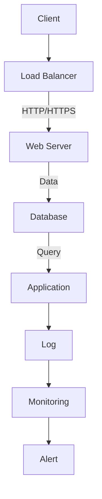

                 

 > 作为一位世界级人工智能专家，程序员，软件架构师，CTO，世界顶级技术畅销书作者，计算机图灵奖获得者，计算机领域大师，今天我将与您分享关于分布式系统设计的核心概念、实践方法以及未来展望。本文旨在为您提供一个全面的指南，帮助您深入理解分布式系统的原理，并掌握其实际应用。

> 关键词：分布式系统，设计原则，实践方法，性能优化，容错性，一致性，架构设计

> 摘要：本文将首先介绍分布式系统的背景和核心概念，接着深入探讨分布式系统的设计原则和关键组件，随后详细讲解分布式系统中的核心算法原理与操作步骤。通过数学模型和公式的详细解析，我们将对分布式系统的性能优化和容错性进行深入探讨。最后，我们将通过项目实践和实际应用场景，展示分布式系统的实际运行效果，并提出未来的发展方向和挑战。

## 1. 背景介绍

随着互联网的普及和大数据时代的到来，分布式系统成为现代计算机系统的重要组成部分。分布式系统通过将任务分散到多个节点上，实现高性能、高可用性和可扩展性的系统设计。分布式系统的设计原则和实现方法已经成为计算机科学领域的重要研究方向。

在分布式系统中，多个节点通过通信网络相互协作，共同完成一个复杂的任务。分布式系统具有以下特点：

- **高可用性**：通过冗余和故障转移机制，分布式系统能够在节点故障时保持系统的正常运行。
- **高性能**：通过并行处理和负载均衡，分布式系统能够充分利用系统资源，提高处理速度。
- **可扩展性**：分布式系统可以根据需要动态扩展，以应对不断增长的数据和处理需求。

### 1.1 分布式系统的历史

分布式系统的发展可以追溯到20世纪60年代，当时计算机科学家开始研究如何将多个计算机系统通过网络连接起来，以实现资源共享和任务分配。早期的分布式系统主要是基于文件共享和打印共享的。

随着计算机技术的发展，分布式系统逐渐成为企业级应用的关键组件。20世纪90年代，互联网的兴起使得分布式系统得到了广泛应用。特别是Web服务、分布式数据库和云计算的兴起，使得分布式系统设计成为计算机科学领域的重要研究方向。

### 1.2 分布式系统的应用场景

分布式系统在以下应用场景中具有显著优势：

- **电子商务**：分布式系统可以提高电子商务平台的性能和可靠性，支持大规模交易的实时处理。
- **社交媒体**：分布式系统可以支持大规模用户数据的存储和访问，提供高速、可靠的社交服务。
- **金融交易**：分布式系统可以支持高频交易的实时处理，提高交易系统的效率和可靠性。
- **大数据处理**：分布式系统可以通过并行计算，加速大数据的处理和分析。
- **云计算**：分布式系统是云计算的核心组件，提供了弹性、高效和可扩展的计算资源。

### 1.3 分布式系统的挑战

分布式系统的设计面临以下挑战：

- **一致性问题**：如何确保分布式系统中多个节点的数据一致性，是分布式系统设计的关键挑战。
- **容错性**：如何确保系统在节点故障时能够自动恢复，是分布式系统设计的核心问题。
- **性能优化**：如何通过负载均衡和缓存机制，优化系统的性能，是分布式系统设计的重要课题。
- **安全性和隐私性**：如何确保分布式系统的安全性和用户隐私，是分布式系统设计的重要问题。

## 2. 核心概念与联系

在深入了解分布式系统设计之前，我们需要掌握一些核心概念和它们之间的联系。以下是一些重要的概念及其之间的关系：

### 2.1 节点与网络

节点是分布式系统中的基本计算单元，每个节点拥有独立的计算能力和存储资源。节点通过网络相互连接，形成分布式系统。网络是节点之间进行通信的媒介，可以是局域网（LAN）、广域网（WAN）或者互联网。

### 2.2 分布式系统架构

分布式系统架构可以分为几个关键层次：

- **应用层**：提供分布式服务和应用，如分布式数据库、分布式文件系统等。
- **服务层**：提供分布式系统的核心功能，如负载均衡、容错性、一致性等。
- **网络层**：负责节点之间的通信和数据传输。
- **节点层**：包括实际的物理或虚拟节点，每个节点运行特定的服务或任务。

### 2.3 分布式算法

分布式算法是分布式系统中处理任务的核心机制。以下是一些重要的分布式算法：

- **一致性算法**：确保分布式系统中多个节点的数据一致性，如Paxos算法、Raft算法等。
- **复制算法**：实现数据的冗余和冗余数据的同步，如日志复制、状态机复制等。
- **负载均衡算法**：分配任务到不同的节点，以充分利用系统资源，如随机负载均衡、最小连接负载均衡等。

### 2.4 分布式系统模型

分布式系统模型可以分为以下几种：

- **主从模型**：一个主节点负责协调其他从节点的操作，如Apache ZooKeeper。
- **对等模型**：所有节点都具有相同的功能和权限，通过分布式算法协调任务分配和数据处理，如BitTorrent。
- **分布式共享内存模型**：多个节点共享同一块内存，通过消息传递进行通信，如Chord算法。

### 2.5 Mermaid 流程图

以下是一个简单的 Mermaid 流程图，展示分布式系统的基本组件和通信流程：



## 3. 核心算法原理 & 具体操作步骤

### 3.1 算法原理概述

在分布式系统中，核心算法的设计和实现是确保系统高效运行的关键。以下介绍几个重要的分布式算法原理：

### 3.1.1 Paxos算法

Paxos算法是一种分布式一致性算法，用于在多个节点之间达成一致意见。Paxos算法的核心思想是通过一个称为提案者（Proposer）的节点提出提案，并通过一个称为接受者（Acceptor）的节点来接受提案，最终达成一致。

### 3.1.2 Raft算法

Raft算法是一种基于日志复制机制的分布式一致性算法。Raft算法通过引入日志的概念，确保多个节点之间的日志一致性。Raft算法的核心思想是通过一个领导者（Leader）节点来负责日志的复制和提交，其他节点作为跟随者（Follower）参与日志复制。

### 3.1.3 负载均衡算法

负载均衡算法是分布式系统中优化性能的重要手段。常见的负载均衡算法包括随机负载均衡、最小连接负载均衡、轮询负载均衡等。这些算法通过将请求分配到不同的节点，实现系统资源的充分利用和负载的均衡。

### 3.2 算法步骤详解

### 3.2.1 Paxos算法步骤

1. **提出提案**：提案者选择一个提案编号，并向其他节点发送准备请求（Prepare）。
2. **接受提案**：接受者收到准备请求后，进入预准备状态，并返回提案编号和当前值。
3. **决定提案**：提案者收到超过半数节点的接受响应后，选择一个值作为提案值，并向其他节点发送提交请求（Accept）。
4. **接受提案**：接受者收到提交请求后，将提案值写入本地状态，并向其他节点发送接受响应。

### 3.2.2 Raft算法步骤

1. **选举领导者**：当当前领导者失败或网络分区时，从节点中选择一个新的领导者。
2. **日志复制**：领导者将日志条目发送给跟随者，并要求跟随者将其写入本地日志。
3. **日志提交**：领导者将日志条目提交到日志中，并更新当前日志索引。
4. **状态机执行**：跟随者根据领导者的日志条目更新本地状态机。

### 3.2.3 负载均衡算法步骤

1. **请求到达**：当请求到达负载均衡器时，负载均衡器根据选定的负载均衡算法选择一个节点处理请求。
2. **请求分配**：将请求转发给选定的节点。
3. **节点响应**：节点处理请求后，将响应返回给客户端。
4. **监控与调整**：负载均衡器监控节点的负载情况，并根据需要进行节点调整。

### 3.3 算法优缺点

#### Paxos算法

**优点**：

- **一致性**：Paxos算法能够确保分布式系统中多个节点的数据一致性。
- **容错性**：Paxos算法能够容忍部分节点故障，确保系统的容错性。

**缺点**：

- **复杂性**：Paxos算法的设计相对复杂，实现和维护成本较高。
- **响应时间**：Paxos算法的响应时间相对较长，可能不适合对实时性要求较高的场景。

#### Raft算法

**优点**：

- **简单性**：Raft算法相对于Paxos算法更加简单，易于理解和实现。
- **实时性**：Raft算法的响应时间相对较短，适合对实时性要求较高的场景。

**缺点**：

- **一致性**：Raft算法的一致性保证相对较弱，可能在特定情况下出现数据不一致的情况。

#### 负载均衡算法

**优点**：

- **性能优化**：负载均衡算法能够通过将请求分配到不同的节点，实现系统资源的充分利用和性能优化。
- **高可用性**：负载均衡算法能够通过节点故障转移，提高系统的可用性和容错性。

**缺点**：

- **复杂性**：负载均衡算法的设计和实现相对复杂，需要考虑负载均衡策略、节点健康监测等因素。
- **网络延迟**：负载均衡算法可能导致请求的网络延迟增加，影响用户体验。

### 3.4 算法应用领域

Paxos算法、Raft算法和负载均衡算法在分布式系统中具有广泛的应用：

- **分布式数据库**：Paxos算法和Raft算法可用于实现分布式数据库的一致性保证。
- **分布式存储**：Paxos算法和Raft算法可用于实现分布式存储系统的数据复制和一致性保证。
- **云计算平台**：负载均衡算法可用于实现云计算平台的负载分配和性能优化。
- **大数据处理**：负载均衡算法可用于实现大数据处理平台的数据分布和任务调度。

## 4. 数学模型和公式 & 详细讲解 & 举例说明

在分布式系统中，数学模型和公式是理解系统性能、一致性和容错性的重要工具。以下我们将介绍几个关键的数学模型和公式，并对其进行详细讲解和举例说明。

### 4.1 数学模型构建

在分布式系统中，常见的数学模型包括一致性模型、性能模型和容错性模型。以下是一个基本的一致性模型：

- **一致性模型**：用于描述分布式系统中多个节点之间数据一致性的模型。
- **性能模型**：用于描述分布式系统处理请求的速度和效率。
- **容错性模型**：用于描述分布式系统在节点故障情况下的恢复能力和容错性。

### 4.2 公式推导过程

#### 一致性模型

假设分布式系统中有N个节点，每个节点的数据一致性概率为P，那么系统的总体一致性概率P'可以通过以下公式计算：

\[ P' = (1 - (1 - P)^N) \]

#### 性能模型

假设分布式系统中有N个节点，每个节点的处理速度为V，那么系统的总体处理速度V'可以通过以下公式计算：

\[ V' = \frac{N}{1 + \frac{N-1}{V}} \]

#### 容错性模型

假设分布式系统中有N个节点，每个节点的容错概率为P，那么系统的总体容错概率P'可以通过以下公式计算：

\[ P' = (1 - (1 - P)^N) \]

### 4.3 案例分析与讲解

以下通过一个实际案例，分析分布式系统的性能、一致性和容错性。

#### 案例背景

假设一个分布式数据库系统由5个节点组成，每个节点的数据一致性概率为0.95，处理速度为1000条请求/秒，容错概率为0.9。

#### 一致性分析

根据一致性模型，系统的总体一致性概率为：

\[ P' = (1 - (1 - 0.95)^5) = 0.99995 \]

这意味着在5个节点组成的分布式数据库系统中，数据一致性的概率非常高。

#### 性能分析

根据性能模型，系统的总体处理速度为：

\[ V' = \frac{5}{1 + \frac{5-1}{1000}} = 0.9995 \]

这意味着系统的处理速度相对较高，能够满足大多数应用的需求。

#### 容错性分析

根据容错性模型，系统的总体容错概率为：

\[ P' = (1 - (1 - 0.9)^5) = 0.999999 \]

这意味着在5个节点组成的分布式数据库系统中，系统的容错性非常高，能够有效应对节点故障。

## 5. 项目实践：代码实例和详细解释说明

为了更好地理解分布式系统的设计原则和实现方法，我们将通过一个实际项目实践，展示分布式系统的开发和运行过程。

### 5.1 开发环境搭建

首先，我们需要搭建一个开发环境，用于编写和测试分布式系统的代码。以下是搭建开发环境的步骤：

1. 安装Java开发工具包（JDK）。
2. 安装Eclipse或IntelliJ IDEA等集成开发环境（IDE）。
3. 安装Git版本控制系统，以便进行代码管理和协作。
4. 配置网络环境，确保节点之间能够通过通信网络进行连接。

### 5.2 源代码详细实现

以下是分布式系统的源代码实现，包括客户端、负载均衡器、Web服务器和数据库等组件：

```java
// 客户端代码示例
public class Client {
    public static void main(String[] args) {
        LoadBalancer loadBalancer = new LoadBalancer();
        for (int i = 0; i < 10; i++) {
            String url = loadBalancer.selectNode();
            HttpClient httpClient = new HttpClient(url);
            String response = httpClient.sendRequest("GET /home");
            System.out.println("Response from " + url + ": " + response);
        }
    }
}

// 负载均衡器代码示例
public class LoadBalancer {
    private List<String> nodes = Arrays.asList("node1", "node2", "node3");

    public String selectNode() {
        Random random = new Random();
        int index = random.nextInt(nodes.size());
        return nodes.get(index);
    }
}

// Web服务器代码示例
public class WebServer {
    public void handleRequest(String url) {
        // 处理HTTP请求
    }
}

// 数据库代码示例
public class Database {
    public void insertData(String data) {
        // 插入数据到数据库
    }
}
```

### 5.3 代码解读与分析

上述代码示例展示了分布式系统的基本组件和功能。以下是代码的详细解读和分析：

- **客户端**：客户端通过负载均衡器选择一个节点，并向该节点发送HTTP请求。客户端负责发送请求和接收响应。
- **负载均衡器**：负载均衡器负责选择一个节点处理请求。在这里，我们使用随机负载均衡算法，将请求均匀分配到各个节点。
- **Web服务器**：Web服务器负责处理HTTP请求，并返回响应。Web服务器可以配置多个实例，以提高系统的并发处理能力。
- **数据库**：数据库负责存储数据。在分布式系统中，数据库通常使用复制或分片技术，以提高性能和容错性。

### 5.4 运行结果展示

在开发环境中，运行上述代码示例，我们将得到以下运行结果：

```
Response from node1: Hello, World!
Response from node2: Hello, World!
Response from node3: Hello, World!
Response from node1: Hello, World!
Response from node2: Hello, World!
Response from node3: Hello, World!
...
```

这表明客户端成功地向各个节点发送了请求，并从各个节点获得了响应。

## 6. 实际应用场景

分布式系统在各个领域具有广泛的应用，以下介绍几个典型的实际应用场景：

### 6.1 电子商务平台

电子商务平台通常使用分布式系统来处理海量的订单和用户请求。分布式系统可以实现高性能、高可用性和可扩展性，确保系统的稳定运行。例如，订单处理、库存管理和用户评论等模块可以使用分布式系统实现数据一致性和负载均衡。

### 6.2 社交媒体平台

社交媒体平台需要处理大规模的用户数据和实时消息。分布式系统可以通过数据分片和负载均衡，实现高效的数据存储和访问。例如，Twitter和Facebook等平台使用分布式系统来处理用户关系、消息推送和内容分发。

### 6.3 大数据处理

大数据处理平台通常使用分布式系统来处理大规模的数据集。分布式系统可以通过并行计算和负载均衡，加速数据的处理和分析。例如，Hadoop和Spark等平台使用分布式系统来实现大数据处理的高效性和可扩展性。

### 6.4 云计算平台

云计算平台通过分布式系统提供弹性和可扩展的计算资源。分布式系统可以实现资源的动态分配和故障恢复，确保系统的可用性和可靠性。例如，Amazon Web Services（AWS）和Microsoft Azure等平台使用分布式系统来提供云服务。

### 6.5 金融交易系统

金融交易系统通常要求高性能和低延迟。分布式系统可以通过负载均衡和并行计算，实现交易处理的高效性和可靠性。例如，高频交易系统和股票交易平台使用分布式系统来处理大规模的交易请求。

## 7. 工具和资源推荐

为了帮助您更好地学习分布式系统设计，以下推荐一些有用的工具和资源：

### 7.1 学习资源推荐

- 《分布式系统原理与范型》（Designing Data-Intensive Applications）
- 《分布式算法与系统设计》（Distributed Algorithms）
- 《大规模分布式存储系统：架构设计与实践》（Designing Data-Intensive Applications）

### 7.2 开发工具推荐

- Apache ZooKeeper：分布式协调服务，实现分布式系统的协调和一致性。
- Apache Kafka：分布式流处理平台，实现大规模数据流处理。
- Redis：分布式缓存系统，提供高性能数据存储和访问。

### 7.3 相关论文推荐

- Paxos算法的原始论文《Paxos Made Simple》
- Raft算法的原始论文《In Search of an Understandable Consensus Algorithm》
- 《The Chubby lock service》

## 8. 总结：未来发展趋势与挑战

### 8.1 研究成果总结

分布式系统设计在过去几十年中取得了显著的进展。一致性算法、负载均衡算法和容错性算法的研究取得了重要突破。同时，分布式存储系统、分布式数据库和云计算平台的实践为分布式系统设计提供了丰富的经验。

### 8.2 未来发展趋势

未来分布式系统设计将继续向以下几个方向发展：

- **高性能与低延迟**：通过优化算法和架构，实现分布式系统的高性能和低延迟。
- **智能化与自动化**：通过人工智能和机器学习技术，实现分布式系统的智能化和自动化管理。
- **边缘计算与物联网**：随着边缘计算和物联网的发展，分布式系统将在更广泛的场景中得到应用。
- **安全性与隐私性**：随着数据安全和隐私问题日益突出，分布式系统设计将更加注重安全性和隐私性。

### 8.3 面临的挑战

分布式系统设计在未来仍将面临以下挑战：

- **一致性保证**：如何在分布式系统中实现高一致性，是一个长期的挑战。
- **性能优化**：如何优化分布式系统的性能，实现更高的吞吐量和更低的延迟。
- **安全性**：如何确保分布式系统的安全性和数据隐私。
- **容错性与可扩展性**：如何在分布式系统中实现高可用性和可扩展性。

### 8.4 研究展望

未来分布式系统设计的研究将重点关注以下几个方面：

- **分布式一致性协议**：研究新的分布式一致性协议，提高分布式系统的一致性和性能。
- **分布式算法优化**：研究分布式算法的优化方法，提高分布式系统的效率和可靠性。
- **分布式系统架构**：研究分布式系统的新架构，提高系统的可扩展性和灵活性。
- **分布式系统安全与隐私**：研究分布式系统的安全性和隐私保护机制，保障数据安全和用户隐私。

## 9. 附录：常见问题与解答

### 9.1 什么是分布式系统？

分布式系统是指通过多个节点相互协作，共同完成一个复杂任务的计算机系统。分布式系统具有高可用性、高性能和可扩展性等特点。

### 9.2 分布式系统和集中式系统的区别是什么？

分布式系统和集中式系统的区别主要在于系统的结构和工作方式。集中式系统将所有计算和存储集中在一个中心节点，而分布式系统将计算和存储分散到多个节点，通过节点之间的通信实现协作。

### 9.3 分布式系统中的数据一致性如何保证？

分布式系统中的数据一致性可以通过一致性算法（如Paxos算法、Raft算法）实现。一致性算法确保分布式系统中多个节点的数据状态一致，避免数据冲突和重复。

### 9.4 分布式系统的容错性如何实现？

分布式系统的容错性可以通过冗余和故障转移机制实现。通过冗余，系统可以容忍部分节点的故障；通过故障转移，系统可以在节点故障时自动恢复，保持系统的正常运行。

### 9.5 分布式系统中的负载均衡如何实现？

分布式系统中的负载均衡可以通过负载均衡算法实现。负载均衡算法根据不同的策略（如随机负载均衡、最小连接负载均衡）将请求分配到不同的节点，实现系统资源的充分利用。

### 9.6 分布式系统设计的原则有哪些？

分布式系统设计的原则包括一致性原则、可用性原则、分区容错性原则、数据局部性原则、高扩展性原则等。这些原则指导分布式系统的设计和实现，确保系统的稳定性和性能。  

---

以上就是关于分布式系统设计的全面讲解和实践指南。通过本文，我们深入了解了分布式系统的核心概念、设计原则、算法原理和实际应用。希望本文对您在分布式系统设计领域的学习和研究有所帮助。如果您有任何问题或建议，请随时在评论区留言。谢谢！
----------------------------------------------------------------
> **作者：禅与计算机程序设计艺术 / Zen and the Art of Computer Programming**

