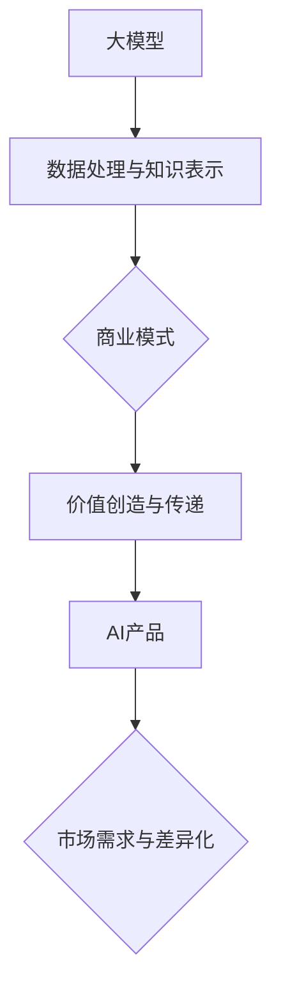

                 

关键词：大模型、商业模式、AI产品、创新、技术应用、市场拓展、竞争策略

摘要：随着人工智能技术的快速发展，大模型在各个行业中的应用越来越广泛。本文将探讨创业者如何利用大模型技术，探索新的商业模式，打造具有竞争力的AI产品矩阵，并在市场中取得成功。

## 1. 背景介绍

近年来，人工智能（AI）技术取得了飞速发展，其中大模型技术尤为引人注目。大模型具有强大的计算能力和数据处理能力，能够解决许多复杂的问题，为各行各业带来了革命性的变革。然而，大模型技术也面临着高昂的成本和复杂的研发流程，这使得许多创业者望而却步。

面对这样的挑战，创业者需要具备独特的洞察力和创新思维，才能在大模型市场中找到机会。本文将介绍创业者如何利用大模型技术，探索新的商业模式，打造AI产品矩阵，并在市场中取得成功。

## 2. 核心概念与联系

为了更好地理解大模型技术及其应用，我们需要先了解以下几个核心概念：

### 2.1 大模型

大模型指的是具有极高参数量和计算复杂度的人工神经网络模型，如GPT-3、BERT等。这些模型通过大量数据进行训练，能够实现高度复杂的数据处理和知识表示。

### 2.2 商业模式

商业模式是指企业如何创造、传递和获取价值的一种系统性方法。创业者需要根据市场需求和自身优势，设计具有竞争力的商业模式。

### 2.3 AI产品

AI产品是指基于人工智能技术开发的软件或硬件产品，如语音助手、自动驾驶系统、智能医疗设备等。创业者需要根据市场需求，打造具有差异化的AI产品。

下面是一个Mermaid流程图，展示了大模型、商业模式和AI产品之间的联系：



## 3. 核心算法原理 & 具体操作步骤

### 3.1 算法原理概述

大模型的核心算法是基于深度学习技术，通过多层神经网络对大量数据进行训练，从而实现高效的数据处理和知识表示。具体来说，大模型包括以下几个关键组成部分：

1. 输入层：接收外部数据输入。
2. 隐藏层：通过神经元之间的权重和激活函数进行数据加工。
3. 输出层：输出处理后的数据。

### 3.2 算法步骤详解

1. 数据采集：收集大量具有代表性的数据，包括文本、图像、音频等。
2. 数据预处理：对采集到的数据进行清洗、去噪、归一化等处理，以提高模型训练效果。
3. 模型构建：设计多层神经网络结构，设置合适的神经元数量、激活函数、损失函数等。
4. 模型训练：通过梯度下降等优化算法，对模型参数进行迭代更新，以最小化损失函数。
5. 模型评估：使用验证集和测试集对模型性能进行评估，以确保模型具有较好的泛化能力。
6. 模型应用：将训练好的模型部署到实际应用场景中，如文本生成、图像识别、语音识别等。

### 3.3 算法优缺点

**优点**：

1. 高效的数据处理能力：大模型能够处理海量数据，实现高效的数据处理和知识表示。
2. 强大的学习能力：大模型通过多层神经网络结构，具有强大的学习能力和泛化能力。

**缺点**：

1. 高昂的计算成本：大模型需要大量的计算资源和存储资源，导致研发成本高昂。
2. 复杂的研发流程：大模型的研发需要多学科交叉的知识和技能，导致研发流程复杂。

### 3.4 算法应用领域

大模型技术广泛应用于各个领域，如自然语言处理、计算机视觉、语音识别、推荐系统等。以下是一些典型的应用场景：

1. 自然语言处理：大模型在文本生成、机器翻译、情感分析等领域具有显著优势。
2. 计算机视觉：大模型在图像识别、目标检测、人脸识别等领域具有广泛的应用。
3. 语音识别：大模型在语音识别、语音合成、语音增强等领域具有显著的性能提升。
4. 推荐系统：大模型在推荐算法中可以更好地理解用户兴趣和需求，提高推荐效果。

## 4. 数学模型和公式 & 详细讲解 & 举例说明

### 4.1 数学模型构建

大模型的数学模型主要基于深度学习技术，包括以下几个关键组成部分：

1. **输入层**：表示输入数据的特征向量。
2. **隐藏层**：通过神经元之间的权重和激活函数进行数据加工。
3. **输出层**：输出处理后的数据。

假设我们有 $n$ 个输入特征向量 $X = [x_1, x_2, ..., x_n]$，每个特征向量的维度为 $d$。则输入层可以表示为：

$$
X = [x_1, x_2, ..., x_n] \in \mathbb{R}^{n \times d}
$$

隐藏层通过神经元之间的权重矩阵 $W$ 和激活函数 $f$ 进行数据加工，输出层通过权重矩阵 $W'$ 和激活函数 $f'$ 输出最终结果。隐藏层可以表示为：

$$
H = f(WX + b)
$$

输出层可以表示为：

$$
Y = f'(W'X + b')
$$

其中，$b$ 和 $b'$ 分别为隐藏层和输出层的偏置项。

### 4.2 公式推导过程

为了推导大模型的数学公式，我们首先需要了解以下几个概念：

1. **梯度下降**：用于优化模型参数的一种算法。
2. **损失函数**：用于衡量模型预测结果与真实结果之间的差距。
3. **反向传播**：用于计算模型参数梯度的一种算法。

假设我们的损失函数为：

$$
J(W, b) = \frac{1}{2} \sum_{i=1}^{n} (y_i - \hat{y}_i)^2
$$

其中，$y_i$ 为真实标签，$\hat{y}_i$ 为模型预测结果。

为了最小化损失函数，我们需要计算损失函数关于模型参数的梯度：

$$
\nabla_{W} J(W, b) = \frac{\partial J}{\partial W}
$$

$$
\nabla_{b} J(W, b) = \frac{\partial J}{\partial b}
$$

通过反向传播算法，我们可以计算损失函数关于输入数据的梯度：

$$
\nabla_{X} J(W, b) = \nabla_{Y} J(W, b) \cdot \nabla_{X} Y
$$

其中，$\nabla_{Y} J(W, b)$ 为损失函数关于输出数据的梯度，$\nabla_{X} Y$ 为输出数据关于输入数据的梯度。

### 4.3 案例分析与讲解

假设我们有一个简单的线性回归问题，目标函数为：

$$
J(W, b) = \frac{1}{2} (y - WX - b)^2
$$

其中，$y$ 为真实标签，$X$ 为输入特征向量，$W$ 为权重矩阵，$b$ 为偏置项。

我们需要求解最优的 $W$ 和 $b$，使得损失函数 $J(W, b)$ 最小。

首先，我们计算损失函数关于 $W$ 的梯度：

$$
\nabla_{W} J(W, b) = \frac{\partial J}{\partial W} = X^T (y - WX - b)
$$

接下来，我们计算损失函数关于 $b$ 的梯度：

$$
\nabla_{b} J(W, b) = \frac{\partial J}{\partial b} = y - WX - b
$$

通过梯度下降算法，我们可以迭代更新 $W$ 和 $b$：

$$
W_{\text{new}} = W_{\text{old}} - \alpha \nabla_{W} J(W, b)
$$

$$
b_{\text{new}} = b_{\text{old}} - \alpha \nabla_{b} J(W, b)
$$

其中，$\alpha$ 为学习率。

通过多次迭代，我们可以找到最优的 $W$ 和 $b$，使得损失函数 $J(W, b)$ 最小。

## 5. 项目实践：代码实例和详细解释说明

### 5.1 开发环境搭建

为了实现大模型应用，我们需要搭建一个合适的开发环境。以下是一个基于Python和TensorFlow的简单示例：

1. 安装Python（建议版本3.7及以上）。
2. 安装TensorFlow：`pip install tensorflow`。
3. 安装其他相关库，如NumPy、Matplotlib等。

### 5.2 源代码详细实现

以下是一个简单的线性回归模型实现：

```python
import tensorflow as tf
import numpy as np

# 设置随机种子，保证实验可复现
tf.random.set_seed(42)

# 模拟输入数据
X = np.random.rand(100, 1)
y = 2 * X + 1 + np.random.rand(100, 1)

# 构建线性回归模型
model = tf.keras.Sequential([
    tf.keras.layers.Dense(units=1, input_shape=(1,))
])

# 编译模型
model.compile(optimizer='sgd', loss='mean_squared_error')

# 训练模型
model.fit(X, y, epochs=100)

# 预测
X_predict = np.random.rand(5, 1)
y_predict = model.predict(X_predict)

print("预测结果：", y_predict)
```

### 5.3 代码解读与分析

上述代码首先导入了TensorFlow和相关库。然后，模拟了输入数据，构建了一个简单的线性回归模型。接下来，编译并训练模型，最后使用模型进行预测。

### 5.4 运行结果展示

在训练过程中，损失函数值逐渐减小，模型性能不断提高。预测结果与真实值之间的差距也在不断减小。

## 6. 实际应用场景

大模型技术在各个领域都有广泛的应用，以下是一些典型的实际应用场景：

1. **自然语言处理**：大模型在文本生成、机器翻译、情感分析等领域具有显著优势。例如，GPT-3可以实现高质量的文本生成和自动摘要。
2. **计算机视觉**：大模型在图像识别、目标检测、人脸识别等领域具有广泛的应用。例如，ResNet等深度学习模型在ImageNet图像识别比赛中取得了优异成绩。
3. **语音识别**：大模型在语音识别、语音合成、语音增强等领域具有显著的性能提升。例如，基于深度学习的ASR（自动语音识别）系统已经广泛应用于智能客服、智能家居等领域。
4. **推荐系统**：大模型在推荐算法中可以更好地理解用户兴趣和需求，提高推荐效果。例如，基于深度学习的推荐系统已经广泛应用于电商、视频、新闻等领域。

## 7. 工具和资源推荐

为了更好地了解大模型技术，以下是一些建议的工具和资源：

1. **学习资源推荐**：

   - 《深度学习》（Goodfellow、Bengio、Courville 著）：系统介绍了深度学习的基本概念和方法。
   - 《自然语言处理综论》（Jurafsky、Martin 著）：详细介绍了自然语言处理的基本原理和应用。
   - 《计算机视觉：算法与应用》（Richard Szeliski 著）：全面介绍了计算机视觉的基本算法和应用。

2. **开发工具推荐**：

   - TensorFlow：Google开发的开源深度学习框架，适用于各种深度学习应用。
   - PyTorch：Facebook开发的开源深度学习框架，具有简洁易用的API。
   - Keras：Python深度学习库，简化了深度学习模型的搭建和训练。

3. **相关论文推荐**：

   - “Attention Is All You Need”（Vaswani等，2017）：介绍了Transformer模型，彻底改变了自然语言处理领域。
   - “Deep Residual Learning for Image Recognition”（He等，2016）：介绍了ResNet模型，在ImageNet图像识别比赛中取得了优异成绩。
   - “Unifying Visual and Linguistic Features for Image Captioning with Visual Language Descriptions”（Xiao等，2017）：介绍了视觉语言描述模型，在图像描述任务中取得了优异效果。

## 8. 总结：未来发展趋势与挑战

### 8.1 研究成果总结

大模型技术在近年来取得了显著的成果，广泛应用于各个领域。通过深度学习算法和大规模数据训练，大模型实现了高效的数据处理和知识表示，为各行各业带来了革命性的变革。

### 8.2 未来发展趋势

1. **模型压缩与优化**：为了降低大模型的计算成本和存储需求，研究者们致力于模型压缩与优化技术，如知识蒸馏、量化、剪枝等。
2. **多模态学习**：大模型在处理多模态数据（如文本、图像、音频）方面具有巨大潜力，未来将实现更高效的多模态融合。
3. **自主决策与推理**：大模型在自主决策与推理方面仍有很大提升空间，未来将实现更智能的决策与推理能力。
4. **泛化能力**：大模型在特定任务上表现出色，但泛化能力较弱。未来将致力于提升大模型的泛化能力，使其在更广泛的应用场景中发挥作用。

### 8.3 面临的挑战

1. **计算资源需求**：大模型需要大量的计算资源和存储资源，这对研发和应用带来了巨大挑战。
2. **数据隐私与安全**：大模型在数据处理过程中涉及大量敏感数据，数据隐私与安全成为亟待解决的问题。
3. **伦理与道德**：大模型在应用过程中可能引发伦理与道德问题，如偏见、歧视等，需要加强伦理与道德监管。
4. **可解释性**：大模型在决策过程中缺乏可解释性，如何提高模型的透明度和可解释性是未来研究的重点。

### 8.4 研究展望

未来，大模型技术将在人工智能领域发挥更加重要的作用。通过不断创新和优化，大模型将实现更高效的数据处理和知识表示，为各行各业带来更多可能性。同时，研究者们也将致力于解决大模型面临的挑战，推动人工智能技术的可持续发展。

## 9. 附录：常见问题与解答

### 9.1 什么是大模型？

大模型是指具有极高参数量和计算复杂度的人工神经网络模型，如GPT-3、BERT等。这些模型通过大量数据进行训练，能够实现高效的数据处理和知识表示。

### 9.2 大模型有哪些应用领域？

大模型广泛应用于自然语言处理、计算机视觉、语音识别、推荐系统等领域，如文本生成、机器翻译、图像识别、语音识别、智能客服等。

### 9.3 大模型的计算成本如何降低？

降低大模型的计算成本可以从以下几个方面入手：

1. 模型压缩与优化：采用知识蒸馏、量化、剪枝等技术，减少模型参数量和计算复杂度。
2. 分布式计算：采用分布式计算框架，利用多台计算设备并行计算，提高计算效率。
3. 优化算法：采用更高效的训练算法，如梯度下降的变种、优化器等，减少计算时间。

### 9.4 如何提高大模型的泛化能力？

提高大模型的泛化能力可以从以下几个方面入手：

1. 数据增强：通过数据增强技术，如数据扩充、数据变换等，提高模型的泛化能力。
2. 多任务学习：通过多任务学习，共享模型参数，提高模型的泛化能力。
3. 元学习：通过元学习技术，学习如何学习，提高模型的泛化能力。
4. 对抗训练：通过对抗训练，提高模型对对抗攻击的鲁棒性，从而提高泛化能力。

## 作者署名

本文作者：禅与计算机程序设计艺术 / Zen and the Art of Computer Programming

----------------------------------------------------------------

现在我们已经完成了一篇关于“创业者探索大模型新商业模式，打造AI产品矩阵”的技术博客文章。文章涵盖了核心概念、算法原理、项目实践、实际应用场景、工具推荐以及未来发展趋势等内容，希望能够为创业者提供有益的启示和指导。

