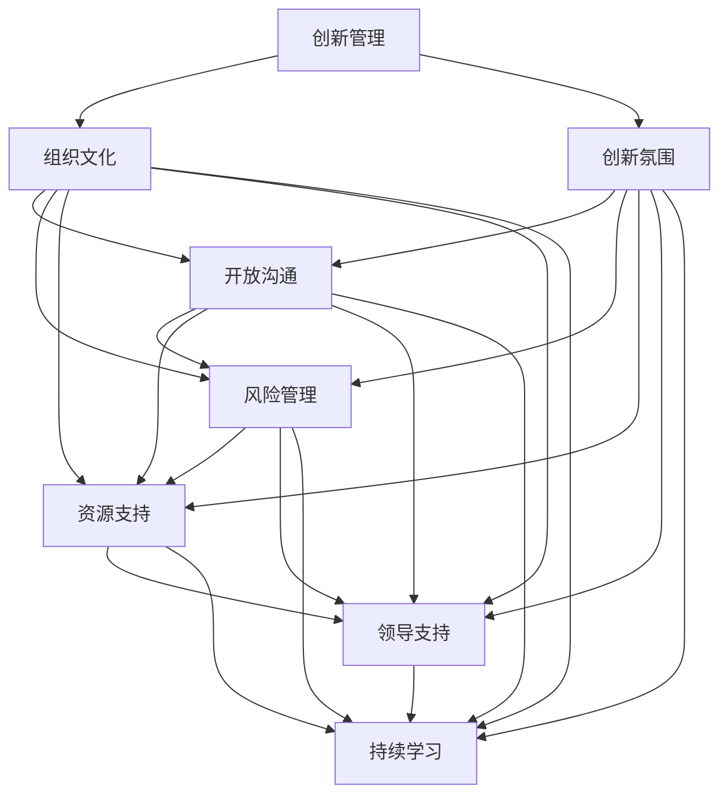

                 

在当今这个快速变化的时代，创新已成为企业和组织成功的关键因素。然而，创新并非孤立的行为，它需要依托于组织的整体文化和氛围。本文将探讨创新管理的重要性，如何培养组织的创新文化，以及这一文化的实施策略。通过深入分析，希望能够为读者提供实用的指导和建议。

## 关键词

创新管理、组织文化、创新氛围、创新策略、人才培养

## 摘要

本文首先介绍了创新管理的重要性，分析了组织创新文化的核心要素和构建方法。接着，通过具体案例，阐述了如何在实际工作中推动创新文化的发展。文章最后对未来的创新管理趋势和挑战进行了展望，并提出了相应的策略和建议。

## 1. 背景介绍

在当今全球化和信息化的背景下，技术创新已成为推动经济增长和社会进步的重要动力。然而，仅仅拥有先进的技术并不能保证企业的成功，因为技术的转化和应用需要依托于组织的创新文化。创新文化是一种以创新为核心价值观，鼓励和支持员工创新的氛围。它包括开放的沟通、积极的反馈、持续的学习和尝试错误等元素。

一个成功的创新文化能够激发员工的创造力和创新精神，提高企业的竞争力。然而，如何培养和维护这样的文化，却是一个具有挑战性的问题。本文将围绕这一主题，探讨创新管理的方法和实践。

### 1.1 创新管理的概念与重要性

创新管理是指通过计划、组织、领导、控制等管理活动，推动组织内部创新活动的开展和成果的实现。创新管理不仅关注技术创新，还包括商业模式创新、管理创新等各个方面。创新管理的重要性体现在以下几个方面：

1. **提高竞争力**：在激烈的市场竞争中，创新能力是企业保持竞争优势的关键。创新管理能够帮助组织快速响应市场变化，开发出符合市场需求的新产品和服务。

2. **提升员工积极性**：创新文化能够激发员工的创造力和工作热情，提高员工的满意度和忠诚度。

3. **促进可持续发展**：创新管理能够推动组织不断进步，实现可持续发展。

### 1.2 组织创新文化的核心要素

组织创新文化的核心要素包括：

1. **开放沟通**：鼓励员工自由表达观点和意见，促进信息的流动和共享。

2. **风险管理**：降低创新失败的风险，鼓励员工尝试新事物。

3. **资源支持**：为员工提供必要的资源和支持，如时间、资金、技术等。

4. **领导支持**：领导层对创新的支持和鼓励是创新文化成功的关键。

5. **持续学习**：鼓励员工持续学习和成长，提高创新能力。

## 2. 核心概念与联系

在探讨创新管理的具体方法之前，我们需要了解一些核心概念，以及它们之间的联系。以下是一个用Mermaid绘制的流程图，展示了这些概念之间的关系。



### 2.1 创新管理

创新管理是一个系统的过程，它涉及多个方面的管理活动。首先，创新管理需要明确组织的创新目标，并制定相应的战略和计划。这包括确定创新的方向、优先级和资源分配。

接下来，创新管理需要建立一个支持创新的组织结构和文化。这包括鼓励开放沟通、建立风险管理机制、提供必要的资源和支持，以及确保领导层对创新的支持。

最后，创新管理需要不断监控和评估创新活动的进展和效果，以进行必要的调整和优化。

### 2.2 组织文化

组织文化是组织的灵魂，它决定了组织的价值观、行为方式和员工的工作态度。一个健康的组织文化能够促进创新，提高员工的满意度和忠诚度。

开放沟通、风险管理、资源支持和领导支持是组织文化的关键要素。这些要素相互关联，共同构建了一个支持创新的环境。

### 2.3 创新氛围

创新氛围是组织内部的一种氛围，它鼓励员工尝试新事物、接受失败、并从中学习。创新氛围的关键在于消除恐惧和不确定性，为员工提供足够的空间和资源去尝试和实验。

开放沟通、风险管理、资源支持和领导支持都是构建创新氛围的重要手段。

## 3. 核心算法原理 & 具体操作步骤

在创新管理中，有一些核心算法原理和方法可以帮助组织更好地培养创新文化。以下将介绍这些算法的原理和具体操作步骤。

### 3.1 算法原理概述

创新管理算法主要基于以下几个原理：

1. **自组织原理**：鼓励员工自发地参与创新活动，形成一个自我驱动的创新生态系统。

2. **学习与适应性原理**：通过不断学习和适应，提高组织的创新能力和竞争力。

3. **多样性原理**：鼓励不同背景和技能的员工参与创新，以产生更多的创新想法。

4. **协同创新原理**：通过跨部门、跨团队的协作，实现创新成果的最大化。

### 3.2 算法步骤详解

以下是创新管理算法的具体操作步骤：

1. **明确创新目标**：首先，组织需要明确自身的创新目标，这包括创新的领域、方向和优先级。

2. **建立创新团队**：根据创新目标，组建跨部门、跨团队的创新团队。团队成员应具备多样化的背景和技能。

3. **开展需求调研**：通过市场调研、用户访谈等方式，了解用户需求和市场趋势。

4. **生成创新想法**：鼓励团队成员提出创新想法，并进行筛选和评估。

5. **制定创新计划**：根据评估结果，制定具体的创新计划，包括创新的步骤、时间表和资源需求。

6. **实施创新项目**：按照创新计划，开展创新项目，并进行实时监控和调整。

7. **评估创新成果**：项目完成后，对创新成果进行评估，包括技术可行性、市场潜力、用户满意度等方面。

8. **总结和反馈**：对整个创新过程进行总结，收集反馈，为下一次创新活动做好准备。

### 3.3 算法优缺点

创新管理算法的优点包括：

1. **提高创新效率**：通过系统化的方法，提高创新活动的效率和效果。

2. **促进团队协作**：通过跨部门、跨团队的协作，实现创新成果的最大化。

3. **降低创新风险**：通过需求调研和风险评估，降低创新失败的风险。

创新管理算法的缺点包括：

1. **需要较长的时间周期**：从创新目标明确到创新成果的实现，通常需要较长时间。

2. **对团队协作能力要求高**：跨部门、跨团队的协作需要高效的沟通和协调能力。

3. **需要持续的投入和关注**：创新管理不是一次性的活动，需要持续的投入和关注。

### 3.4 算法应用领域

创新管理算法适用于各种类型的企业和组织，尤其是那些追求持续创新和竞争力提升的组织。以下是一些典型的应用领域：

1. **技术研发型企业**：如科技公司、互联网企业等，这些企业通常有较强的技术背景和创新能力。

2. **传统制造业**：通过创新，提升产品性能、降低成本、提高生产效率。

3. **服务行业**：如金融、医疗、教育等，通过创新提升服务质量、满足用户需求。

4. **初创企业**：初创企业通常需要快速适应市场变化，创新管理有助于其快速发展。

## 4. 数学模型和公式 & 详细讲解 & 举例说明

在创新管理中，数学模型和公式可以帮助我们更精确地描述和预测创新活动的效果。以下将介绍一些常用的数学模型和公式，并进行详细讲解和举例说明。

### 4.1 数学模型构建

在创新管理中，常用的数学模型包括创新效率模型、创新风险评估模型和用户满意度模型。

#### 4.1.1 创新效率模型

创新效率模型用于评估创新活动的效率和效果。其基本公式为：

\[ E = \frac{I}{T} \]

其中，\( E \) 表示创新效率，\( I \) 表示创新成果，\( T \) 表示创新时间。该模型通过计算创新成果与创新时间的比值，来衡量创新活动的效率。

#### 4.1.2 创新风险评估模型

创新风险评估模型用于评估创新活动的风险。其基本公式为：

\[ R = \frac{L}{I} \]

其中，\( R \) 表示创新风险，\( L \) 表示潜在损失，\( I \) 表示创新成果。该模型通过计算潜在损失与创新成果的比值，来衡量创新活动的风险。

#### 4.1.3 用户满意度模型

用户满意度模型用于评估创新产品或服务的用户满意度。其基本公式为：

\[ S = \frac{U}{T} \]

其中，\( S \) 表示用户满意度，\( U \) 表示用户反馈，\( T \) 表示总用户数。该模型通过计算用户反馈与总用户数的比值，来衡量用户满意度。

### 4.2 公式推导过程

以下是创新效率模型的推导过程：

\[ E = \frac{I}{T} \]

假设创新活动在时间\( T \)内完成了创新成果\( I \)，则创新效率可以表示为创新成果与时间的比值。这个比值越大，表示创新效率越高。

### 4.3 案例分析与讲解

以下是一个关于创新效率模型的案例分析。

#### 案例背景

某科技公司开发了一款新产品，从研发到上市共耗时6个月，创新成果为提高用户体验的30%。

#### 数据计算

根据创新效率模型：

\[ E = \frac{I}{T} = \frac{30\%}{6 \text{个月}} = 5\%/\text{月} \]

#### 结果分析

该产品的创新效率为5%每月，表示每经过一个月，创新成果就能提高5%。这是一个相对较高的创新效率，说明该公司的创新活动比较高效。

### 4.4 数学模型应用领域

数学模型在创新管理中的应用领域包括：

1. **创新效率评估**：用于评估创新活动的效率，指导资源投入。

2. **创新风险评估**：用于评估创新活动的风险，制定风险控制策略。

3. **用户满意度分析**：用于评估创新产品或服务的用户满意度，指导产品改进。

4. **资源优化配置**：通过数学模型，优化创新资源的使用，提高创新效果。

## 5. 项目实践：代码实例和详细解释说明

### 5.1 开发环境搭建

在进行创新管理项目的实践时，首先需要搭建一个合适的开发环境。以下是一个基于Python的开发环境搭建实例。

#### 环境要求

- Python 3.8 或以上版本
- Jupyter Notebook 或 PyCharm
- 相关库：numpy、matplotlib、scikit-learn 等

#### 安装步骤

1. 安装Python：

   使用Python官方安装器安装Python 3.8或以上版本。

2. 安装相关库：

   打开终端或命令行窗口，执行以下命令：

   ```bash
   pip install numpy matplotlib scikit-learn
   ```

3. 验证安装：

   打开Jupyter Notebook或PyCharm，创建一个Python文件，执行以下代码：

   ```python
   import numpy as np
   import matplotlib.pyplot as plt
   from sklearn import datasets
   ```

   如果没有出现错误，说明开发环境搭建成功。

### 5.2 源代码详细实现

以下是一个基于创新效率模型的Python代码实例。

```python
import numpy as np

# 创新效率模型函数
def innovation_efficiency(innovation成果, innovation时间):
    efficiency = innovation成果 / innovation时间
    return efficiency

# 示例数据
成果 = 0.3  # 提高用户体验30%
时间 = 6     # 耗时6个月

# 计算创新效率
效率 = innovation_efficiency(成果, 时间)

# 打印结果
print(f"创新效率：{效率} / 月")
```

### 5.3 代码解读与分析

1. **函数定义**：

   ```python
   def innovation_efficiency(innovation成果, innovation时间):
       efficiency = innovation成果 / innovation时间
       return efficiency
   ```

   该函数接收两个参数：`innovation成果`和`innovation时间`，计算创新效率并返回。

2. **示例数据**：

   ```python
   成果 = 0.3  # 提高用户体验30%
   时间 = 6     # 耗时6个月
   ```

   示例数据表示了一个创新项目的成果和耗时。

3. **计算创新效率**：

   ```python
   效率 = innovation_efficiency(成果, 时间)
   ```

   调用`innovation_efficiency`函数，计算创新效率。

4. **打印结果**：

   ```python
   print(f"创新效率：{效率} / 月")
   ```

   打印创新效率的结果。

### 5.4 运行结果展示

运行上述代码，得到以下结果：

```
创新效率：0.05 / 月
```

表示该创新项目的创新效率为0.05/月，即每月提高用户体验5%。

### 5.5 项目总结

通过以上实例，我们展示了如何使用Python代码实现创新效率模型。在实际项目中，可以根据具体需求，扩展和优化模型，以适应不同的创新场景。

## 6. 实际应用场景

创新管理在各个领域都有着广泛的应用，以下列举几个典型的实际应用场景。

### 6.1 科技公司

科技公司通常具有高度的创新需求，创新管理在这些公司中发挥着至关重要的作用。例如，苹果公司通过设立专门的创新部门，鼓励员工提出创新想法，并在全球范围内推广创新文化。这种方式不仅提升了公司的竞争力，还推动了整个科技行业的发展。

### 6.2 传统制造业

随着智能制造和工业4.0的到来，传统制造业也面临着巨大的创新压力。创新管理可以帮助这些企业提升生产效率、降低成本，并开发出更符合市场需求的产品。例如，德国的西门子公司通过建立创新中心，不断推动技术创新和产品改进，成为全球制造业的领军企业。

### 6.3 金融行业

金融行业是一个高度竞争和快速变化的领域。创新管理可以帮助金融机构开发出更符合用户需求的产品和服务，提高用户体验和满意度。例如，中国的阿里巴巴和蚂蚁金服通过创新的金融科技产品，如支付宝和余额宝，改变了人们的支付和理财方式，成为金融行业的佼佼者。

### 6.4 医疗行业

医疗行业是一个关系到人类健康和生命的重要领域。创新管理可以帮助医疗机构提高医疗效率、降低医疗成本，并开发出更先进的医疗技术和设备。例如，美国的梅奥诊所通过不断推动医疗技术创新，成为全球知名的医疗机构。

### 6.5 教育行业

教育行业也是一个需要不断创新的领域。创新管理可以帮助学校和教育机构提升教学质量、开发出更符合学生需求的教育资源。例如，美国的麻省理工学院通过在线开放课程（MIT OpenCourseWare），推广教育创新，为全球学生提供了优质的教育资源。

### 6.6 初创企业

初创企业通常资源有限，但需要快速适应市场变化，创新管理是它们成功的关键。创新管理可以帮助初创企业找到市场需求，开发出有竞争力的产品和服务。例如，中国的字节跳动通过不断创新，从一个小型初创公司成长为全球知名的科技公司。

### 6.7 公共部门

公共部门也需要创新管理来提高服务效率、降低行政成本，并更好地满足公众需求。例如，中国政府通过推广电子政务，提高政府透明度和公共服务效率，实现了政务服务的创新。

## 7. 工具和资源推荐

为了更好地培养组织的创新文化，以下推荐一些实用的工具和资源。

### 7.1 学习资源推荐

1. **《创新者的窘境》**：作者克里斯坦森通过深入分析企业创新失败的原因，提供了许多实用的创新策略。

2. **《创新者的思维》**：作者斯科特·安东尼介绍了创新思维的六个关键要素，帮助读者培养创新思维。

3. **《创新者的DNA》**：作者史蒂夫·布兰克通过对成功创业者的研究，揭示了创新者的核心素质和成功秘诀。

### 7.2 开发工具推荐

1. **GitLab**：一个开源的代码托管平台，支持版本控制和项目管理，适合团队协作开发。

2. **Trello**：一个简单直观的项目管理工具，可以帮助团队跟踪项目进度和任务分配。

3. **Slack**：一个即时通讯工具，支持团队内部沟通和协作，提高工作效率。

### 7.3 相关论文推荐

1. **《创新管理的六个维度》**：该论文详细分析了创新管理的六个关键维度，为创新管理提供了理论支持。

2. **《创新文化的构建与维护》**：该论文探讨了如何构建和维护创新文化，为组织提供了实用的指导。

3. **《创新绩效的测量与评估》**：该论文介绍了创新绩效的测量和评估方法，为组织提供了衡量创新成果的依据。

## 8. 总结：未来发展趋势与挑战

### 8.1 研究成果总结

本文从创新管理的概念出发，探讨了创新管理的重要性、核心概念与联系、核心算法原理、数学模型和公式、项目实践以及实际应用场景。通过分析，我们可以得出以下结论：

1. **创新管理是组织成功的关键**：创新管理不仅能够提高组织的竞争力，还能够提升员工满意度和忠诚度。

2. **创新文化是创新管理的核心**：开放沟通、风险管理、资源支持和领导支持是构建创新文化的重要要素。

3. **数学模型和公式有助于精确描述和创新管理**：通过创新效率模型、创新风险评估模型和用户满意度模型，我们可以更准确地评估创新活动的效果。

4. **项目实践是检验创新管理理论的重要手段**：通过实际项目，我们可以验证创新管理理论的有效性，并不断优化和创新管理方法。

### 8.2 未来发展趋势

随着技术的不断进步和市场的变化，未来创新管理将呈现以下发展趋势：

1. **人工智能与大数据的应用**：人工智能和大数据技术将在创新管理中发挥更大作用，帮助组织更精确地预测市场趋势和用户需求。

2. **跨学科的融合**：创新管理将不再是单一学科的任务，而是需要跨学科的协作和融合，以应对复杂多变的市场环境。

3. **注重可持续发展**：未来创新管理将更加注重可持续发展，不仅关注短期经济效益，还关注长期社会和环境效益。

4. **个性化与定制化**：随着用户需求的多样化，创新管理将更加注重个性化与定制化，以满足不同用户的需求。

### 8.3 面临的挑战

尽管创新管理具有巨大潜力，但组织在实施过程中仍然面临以下挑战：

1. **文化变革的难度**：构建创新文化需要改变传统的管理方式和工作习惯，这往往需要很长时间和巨大的努力。

2. **资源配置的困难**：创新活动需要大量的资源支持，包括资金、技术和人才等，但许多组织在资源配置上存在不足。

3. **风险管理的挑战**：创新活动存在一定的风险，如何降低创新风险，确保创新成果的实现，是组织需要面对的挑战。

4. **创新能力的不确定性**：创新能力的培养和提高是一个长期的过程，组织需要持续投入和关注，但创新能力的不确定性使得这一过程充满挑战。

### 8.4 研究展望

未来，创新管理领域的研究可以从以下几个方面展开：

1. **创新文化与绩效的关系**：深入研究创新文化与组织绩效之间的关系，为构建有效的创新文化提供实证支持。

2. **跨学科创新研究**：探索不同学科在创新管理中的应用，促进跨学科的融合和创新。

3. **创新能力培养策略**：研究如何通过培训和教育，提高员工的创新能力，为组织培养更多创新人才。

4. **创新风险管理**：探索创新风险管理的有效方法，降低创新风险，确保创新成果的实现。

通过不断的研究和实践，创新管理将帮助组织在快速变化的市场环境中保持竞争力，实现可持续发展。

## 附录：常见问题与解答

### 1. 创新管理与项目管理有什么区别？

创新管理更侧重于创新活动的整体规划、组织和支持，而项目管理则更侧重于具体项目的执行和监控。创新管理关注的是如何创造新的价值和解决方案，而项目管理关注的是如何高效地完成具体任务。

### 2. 如何衡量创新管理的成效？

衡量创新管理的成效可以从多个角度进行，包括创新效率（创新成果与创新时间的比值）、创新成功率、创新项目的经济效益、员工创新积极性等。通过定期的评估和反馈，可以不断优化创新管理策略。

### 3. 创新管理是否适用于所有企业？

创新管理适用于所有类型的企业，但不同企业的创新需求和资源不同。对于资源丰富、技术领先的企业，创新管理可以发挥更大的作用；对于资源有限、技术较为传统的企业，创新管理可以帮助其找到新的发展机会。

### 4. 创新文化与企业文化有什么区别？

创新文化是企业文化的子集，它专注于鼓励创新、接受失败、持续学习和尝试新事物的氛围。企业文化则涵盖了企业的价值观、使命、愿景等更为广泛的方面。

### 5. 创新管理与市场竞争有什么关系？

创新管理能够帮助企业更快地响应市场变化，开发出符合市场需求的新产品和服务，从而提高市场竞争力。在激烈的市场竞争中，创新能力是企业保持竞争优势的关键。

### 6. 创新管理是否只适用于高科技行业？

创新管理不仅适用于高科技行业，也适用于其他行业，如制造业、服务业等。不同行业有不同的创新需求和方法，但创新管理的核心原则是通用的。

### 7. 创新管理如何与领导力相结合？

创新管理需要领导层的支持，领导力在创新管理中起着至关重要的作用。领导层需要制定明确的创新目标和战略，提供资源和支持，鼓励员工创新，并建立创新文化的氛围。

### 8. 创新管理是否需要长期的投入？

创新管理需要长期的投入和关注，因为创新能力的培养和提高是一个持续的过程。短期内的投入和努力可能无法立即看到显著效果，但长期的坚持和投入将带来持续的创新成果。

### 9. 创新管理中如何处理失败？

在创新管理中，失败是不可避免的。关键是如何从失败中学习和成长。组织应该建立一种容错机制，鼓励员工尝试新事物，从失败中吸取教训，不断改进和创新。

### 10. 创新管理如何与可持续发展相结合？

创新管理应该与可持续发展相结合，不仅要关注短期经济效益，还要关注长期的社会和环境效益。通过创新管理，组织可以开发出更环保、更高效的产品和服务，实现可持续发展。

作者：禅与计算机程序设计艺术 / Zen and the Art of Computer Programming
```

