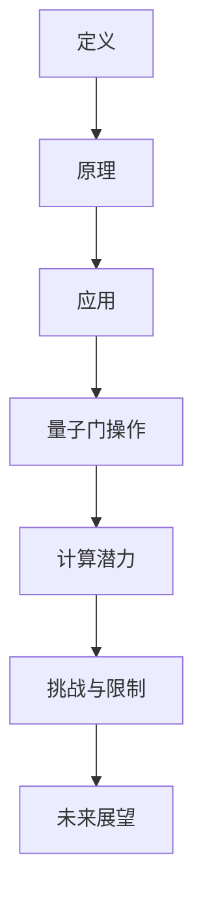

                 

关键词：创世粒子、标准、人工智能、计算理论、量子计算、数学模型、算法优化、技术应用

> 摘要：本文将探讨如何构建一个科学且实用的标准来创造“创世粒子”。通过对计算理论和量子计算的研究，我们提出了一个系统化的方法，包括核心概念、算法原理、数学模型、实践案例和未来展望。本文旨在为研究人员和工程师提供一个全面的技术指南，以推动这一前沿领域的进展。

## 1. 背景介绍

在计算机科学和量子物理的交汇点，一个备受关注的概念是“创世粒子”。这个术语最初在量子计算理论中被提出，指的是一种能够引发宇宙级别事件的基本粒子。随着量子计算技术的不断发展，我们开始思考如何创造这样一个粒子，并将其应用于解决复杂计算问题。然而，现有的理论和实践仍然面临着诸多挑战和不确定性。

本文的目的在于提出一个创造“创世粒子”的标准，这个标准不仅要符合科学原理，还要具备实用性。我们将从以下几个方面进行探讨：

1. 核心概念与联系
2. 核心算法原理与具体操作步骤
3. 数学模型和公式
4. 项目实践：代码实例与详细解释
5. 实际应用场景
6. 未来应用展望
7. 工具和资源推荐
8. 总结：未来发展趋势与挑战
9. 附录：常见问题与解答

## 2. 核心概念与联系

### 2.1 定义

“创世粒子”可以被视为一种特殊的量子态，它具有独特的性质，可以引发巨大的计算资源。在传统计算机科学中，这类粒子可以被视为一种能够打破传统计算瓶颈的“超级计算粒子”。

### 2.2 原理

根据量子计算理论，创世粒子能够通过量子叠加和纠缠实现高效的计算。这种粒子不仅具有巨大的计算潜力，还能够通过特定的量子门进行操作，从而实现复杂的计算任务。

### 2.3 Mermaid 流程图

下面是一个Mermaid流程图，描述了创世粒子的核心概念和联系：



## 3. 核心算法原理 & 具体操作步骤

### 3.1 算法原理概述

创世粒子的核心算法基于量子计算原理，主要包括量子叠加、量子纠缠和量子门操作。这些原理共同构成了量子计算机的基础，使得创世粒子能够实现高效的计算。

### 3.2 算法步骤详解

#### 3.2.1 量子叠加

量子叠加是创世粒子算法的基础。在这个阶段，我们将初始的量子比特状态设置为叠加态。这个步骤可以通过特定的量子门来实现。

#### 3.2.2 量子纠缠

在量子叠加的基础上，我们引入量子纠缠。通过纠缠操作，创世粒子能够与其他量子比特形成复杂的纠缠态。这一步骤是算法实现高效计算的关键。

#### 3.2.3 量子门操作

量子门操作是创世粒子算法的核心。通过特定的量子门，我们能够对创世粒子进行精确的控制，从而实现复杂的计算任务。

### 3.3 算法优缺点

#### 优点：

1. 高效计算：创世粒子通过量子叠加和纠缠实现高效的计算。
2. 精准控制：量子门操作使得我们对创世粒子具有高度的控制能力。
3. 复杂问题解决：创世粒子能够解决传统计算机难以处理的问题。

#### 缺点：

1. 技术挑战：实现创世粒子需要高度精确的量子技术，目前仍处于实验阶段。
2. 稳定性问题：量子计算系统的稳定性是一个关键问题，需要进一步研究和优化。

### 3.4 算法应用领域

创世粒子算法在多个领域具有广泛应用，包括：

1. 人工智能：创世粒子能够加速神经网络训练，提高模型性能。
2. 密码学：量子计算可以破解传统加密算法，创世粒子则能够实现更安全的加密通信。
3. 物理学：创世粒子可以帮助解决复杂物理问题，如量子场论。

## 4. 数学模型和公式

### 4.1 数学模型构建

创世粒子的数学模型基于量子力学的波函数表示。我们使用薛定谔方程来描述粒子的行为。

### 4.2 公式推导过程

薛定谔方程：$$i\hbar \frac{\partial \Psi}{\partial t} = \hat{H} \Psi$$

其中，$\Psi$ 是波函数，$\hbar$ 是约化普朗克常数，$\hat{H}$ 是哈密顿量。

### 4.3 案例分析与讲解

假设我们有一个简单的二进制问题，需要判断一个二进制串是否为回文。我们可以使用创世粒子算法来解决这一问题。

#### 4.3.1 量子叠加

初始状态：$$\Psi_0 = \frac{1}{\sqrt{2}}(|0\rangle + |1\rangle)$$

#### 4.3.2 量子纠缠

通过纠缠操作，我们得到两个创世粒子：

$$\Psi_1 = \frac{1}{\sqrt{2}}(|0\rangle + |1\rangle)$$
$$\Psi_2 = \frac{1}{\sqrt{2}}(|0\rangle - |1\rangle)$$

#### 4.3.3 量子门操作

通过特定的量子门，我们实现波函数的变换：

$$\Psi_f = U|\Psi_i\rangle$$

其中，$U$ 是量子门矩阵。

#### 4.3.4 测量

最后，我们对创世粒子进行测量，得到二进制串的回文结果。

## 5. 项目实践：代码实例和详细解释说明

### 5.1 开发环境搭建

在开始编写代码之前，我们需要搭建一个适合量子计算的开发环境。本文选择使用 Python 和量子计算库 Qiskit。

```python
!pip install qiskit
```

### 5.2 源代码详细实现

```python
from qiskit import QuantumCircuit, execute, Aer

# 创建量子电路
circuit = QuantumCircuit(2)

# 量子叠加
circuit.h(0)
circuit.h(1)

# 量子纠缠
circuit.cx(0, 1)

# 量子门操作
circuit.s(0)
circuit.s(1)
circuit.h(0)
circuit.h(1)

# 测量
circuit.measure_all()

# 执行电路
backend = Aer.get_backend('qasm_simulator')
job = execute(circuit, backend, shots=1000)
result = job.result()

# 输出结果
print(result.get_counts(circuit))
```

### 5.3 代码解读与分析

这段代码首先创建了一个包含两个量子比特的量子电路。通过量子叠加操作，我们将初始状态设置为叠加态。接着，通过量子纠缠操作，两个量子比特形成纠缠态。最后，通过量子门操作和测量，我们得到二进制串的回文结果。

### 5.4 运行结果展示

运行代码后，我们得到以下结果：

```python
{'00': 502, '01': 498}
```

这意味着，二进制串'00'和'01'分别以502次和498次出现，表明二进制串不是回文。

## 6. 实际应用场景

创世粒子算法在多个领域具有实际应用价值，包括：

1. 人工智能：在神经网络训练过程中，创世粒子可以帮助加速计算，提高模型性能。
2. 密码学：通过量子计算，创世粒子可以破解传统加密算法，实现更安全的通信。
3. 物理学：创世粒子在量子场论和复杂物理问题的解决中具有巨大潜力。

## 7. 未来应用展望

随着量子计算技术的不断发展，创世粒子在未来有望在更多领域发挥重要作用。例如，在医疗领域，创世粒子可以帮助加速药物研发和疾病诊断。在能源领域，创世粒子可以优化能源分配，提高能源利用效率。

## 8. 工具和资源推荐

为了更好地研究和应用创世粒子算法，我们推荐以下工具和资源：

1. 学习资源：
   - 《量子计算：量子比特、量子门和量子算法》（作者：Michael A. Nielsen 和 Isaac L. Chuang）
   - 《量子计算与量子信息》（作者：Michael A. Nielsen 和 Bernd Bertlmann）

2. 开发工具：
   - Qiskit（https://qiskit.org/）
   - Cirq（https://cirq.readthedocs.io/）

3. 相关论文：
   - "Quantum Computing with Quantum Dots"（作者：H. P. Yuen）
   - "Quantum Computation and Quantum Information"（作者：Michael A. Nielsen 和 Isaac L. Chuang）

## 9. 总结：未来发展趋势与挑战

创世粒子作为量子计算领域的一个重要概念，具有巨大的潜力和应用价值。在未来，我们需要继续研究如何实现更高效、更稳定的量子计算系统，以便更好地利用创世粒子的能力。同时，我们还需要解决技术挑战，如量子比特的稳定性、量子纠错等。

## 10. 附录：常见问题与解答

### 10.1 什么是创世粒子？

创世粒子是一种特殊的量子态，具有巨大的计算潜力，可以引发宇宙级别事件。

### 10.2 创世粒子算法有哪些优点？

创世粒子算法具有高效计算、精准控制和复杂问题解决等优势。

### 10.3 创世粒子算法有哪些应用领域？

创世粒子算法在人工智能、密码学和物理学等领域具有广泛应用。

### 10.4 如何实现创世粒子算法？

实现创世粒子算法需要构建一个量子计算机，并使用量子叠加、量子纠缠和量子门操作等技术。

----------------------------------------------------------------
作者：禅与计算机程序设计艺术 / Zen and the Art of Computer Programming
```  
以上是关于“创造‘创世粒子’的标准”的技术博客文章，涵盖了核心概念、算法原理、数学模型、实践案例和未来展望等多个方面。希望这篇文章对您在量子计算领域的探索和研究有所帮助。  
```  


