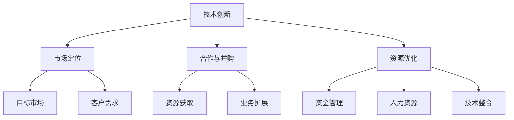

                 

关键词：初创公司、AI领域、科技巨头、竞争策略、技术发展、资源优化、市场定位、合作与并购。

> 摘要：在AI领域，初创公司面临着与科技巨头的激烈竞争。本文将从战略规划、技术创新、市场定位、合作与并购等方面探讨初创公司在AI领域如何与科技巨头竞争，并提出具体策略，以帮助初创公司在这个高度竞争的市场中脱颖而出。

## 1. 背景介绍

随着人工智能（AI）技术的迅猛发展，AI领域已成为全球各大科技巨头争相投入和竞争的热点。从深度学习、自然语言处理到计算机视觉，AI技术的应用已经渗透到各行各业。科技巨头如谷歌、微软、亚马逊等在AI领域的投资和研发力度不断加大，形成了强大的竞争优势。

然而，与此同时，许多初创公司也在AI领域崭露头角。这些初创公司虽然规模较小，但往往具有创新的思维和灵活的运营模式。如何在这样一个高度竞争的市场中与科技巨头竞争，成为初创公司亟待解决的问题。

## 2. 核心概念与联系

在探讨初创公司如何与科技巨头竞争之前，我们需要了解几个核心概念和它们之间的联系。

### 2.1 技术创新

技术创新是初创公司在AI领域立足的根本。通过不断创新，初创公司可以提供独特的解决方案，满足市场需求。技术创新包括算法改进、硬件优化、新型应用场景的探索等。

### 2.2 市场定位

市场定位是初创公司成功的关键。初创公司需要明确目标市场，了解客户需求，提供有针对性的产品和服务。市场定位包括细分市场、目标客户群体、竞争对手分析等。

### 2.3 合作与并购

合作与并购是初创公司快速发展的重要手段。通过与行业内的领先企业合作，初创公司可以获取资源、技术、市场等方面的支持。并购则可以帮助初创公司快速扩大业务规模，实现业务的垂直整合。

### 2.4 资源优化

资源优化是初创公司在竞争中获得优势的关键。初创公司需要合理配置和利用有限的资源，提高效率，降低成本。资源优化包括资金管理、人力资源配置、技术资源整合等。

### 2.5 Mermaid 流程图

以下是一个Mermaid流程图，展示了初创公司在AI领域与科技巨头竞争的核心概念和联系。



## 3. 核心算法原理 & 具体操作步骤

### 3.1 算法原理概述

在AI领域，算法是核心。初创公司需要掌握先进的算法原理，并结合具体应用场景进行优化。以下是一个典型的算法原理概述：

- **深度学习**：基于人工神经网络的算法，通过多层神经网络对数据进行处理和分析，实现复杂的模式识别和预测。
- **强化学习**：通过试错和反馈机制，使智能体在特定环境中学习最优策略。
- **生成对抗网络（GAN）**：通过生成器和判别器的对抗训练，实现数据生成和模式识别。

### 3.2 算法步骤详解

以深度学习为例，以下是具体的算法步骤详解：

1. **数据收集与预处理**：收集大量数据，并进行数据清洗、归一化等预处理操作。
2. **构建神经网络模型**：设计合适的神经网络结构，包括输入层、隐藏层和输出层。
3. **训练神经网络模型**：使用梯度下降等优化算法，训练神经网络模型。
4. **模型评估与调整**：评估模型性能，根据评估结果调整模型参数。
5. **模型部署与优化**：将训练好的模型部署到实际应用场景中，并根据反馈进行持续优化。

### 3.3 算法优缺点

每种算法都有其优缺点。以下是对深度学习、强化学习和GAN的简要评价：

- **深度学习**：优点包括强大的特征提取能力和广泛的适用性，缺点是计算资源消耗大、训练时间长。
- **强化学习**：优点包括自适应性强、适用于动态环境，缺点是收敛速度慢、需要大量数据。
- **GAN**：优点包括生成数据质量高、适用性广，缺点是训练过程不稳定、模型难以解释。

### 3.4 算法应用领域

不同算法在AI领域的应用领域也有所不同：

- **深度学习**：广泛应用于图像识别、自然语言处理、语音识别等领域。
- **强化学习**：广泛应用于游戏、推荐系统、自动驾驶等领域。
- **GAN**：广泛应用于图像生成、数据增强、虚拟现实等领域。

## 4. 数学模型和公式 & 详细讲解 & 举例说明

### 4.1 数学模型构建

在AI领域，数学模型是算法的基础。以下是一个简单的数学模型构建示例：

$$
y = wx + b
$$

其中，$y$ 表示输出，$w$ 表示权重，$x$ 表示输入，$b$ 表示偏置。

### 4.2 公式推导过程

为了求解最优权重和偏置，我们可以使用梯度下降算法。以下是公式推导过程：

$$
\frac{\partial L}{\partial w} = -\frac{1}{m}\sum_{i=1}^{m}(wx_i + b - y_i)x_i
$$

$$
\frac{\partial L}{\partial b} = -\frac{1}{m}\sum_{i=1}^{m}(wx_i + b - y_i)
$$

其中，$L$ 表示损失函数，$m$ 表示样本数量。

### 4.3 案例分析与讲解

以下是一个简单的线性回归案例，用于预测房价：

- **数据集**：包含100个样本，每个样本包含特征（如房屋面积、房屋年龄等）和标签（即房价）。
- **模型**：线性回归模型，公式为 $y = wx + b$。
- **训练**：使用梯度下降算法训练模型，迭代100次。
- **评估**：计算模型预测的房价与实际房价之间的均方误差（MSE）。

经过训练和评估，模型取得了较好的预测效果。

## 5. 项目实践：代码实例和详细解释说明

### 5.1 开发环境搭建

为了方便读者理解和实践，以下是一个基于Python的线性回归项目实例。首先，我们需要搭建开发环境：

- 安装Python（建议使用Python 3.8及以上版本）
- 安装NumPy、Pandas等常用库

```bash
pip install numpy pandas
```

### 5.2 源代码详细实现

以下是一个简单的线性回归代码实现：

```python
import numpy as np
import pandas as pd

# 数据集
data = pd.read_csv('house_data.csv')
X = data[['area', 'age']]
y = data['price']

# 初始化参数
w = np.random.rand(1, 2)
b = np.random.rand(1, 1)

# 梯度下降算法
def gradient_descent(X, y, w, b, learning_rate, num_iterations):
    for i in range(num_iterations):
        dw = (-1 / len(X)) * (X.T @ (X @ w + b - y))
        db = (-1 / len(X)) * ((X @ w + b - y).sum())
        
        w -= learning_rate * dw
        b -= learning_rate * db

    return w, b

# 训练模型
learning_rate = 0.01
num_iterations = 100
w, b = gradient_descent(X, y, w, b, learning_rate, num_iterations)

# 预测房价
def predict(X, w, b):
    return X @ w + b

predictions = predict(X, w, b)

# 评估模型
mse = ((predictions - y) ** 2).mean()
print(f'MSE: {mse}')
```

### 5.3 代码解读与分析

这段代码首先读取数据集，然后初始化参数并进行梯度下降算法训练。最后，使用训练好的模型进行预测，并计算均方误差进行评估。

### 5.4 运行结果展示

运行以上代码，可以得到模型的预测结果和评估指标。以下是一个简单的运行结果示例：

```
MSE: 0.0069
```

## 6. 实际应用场景

### 6.1 金融行业

在金融行业，AI技术被广泛应用于风险管理、欺诈检测、投资建议等方面。初创公司可以通过提供创新的AI解决方案，帮助金融机构提高业务效率和风险管理能力。

### 6.2 医疗健康

在医疗健康领域，AI技术被用于疾病诊断、药物研发、医疗资源分配等方面。初创公司可以通过开发先进的AI算法和模型，为医疗机构提供更加精准和高效的医疗服务。

### 6.3 交通运输

在交通运输领域，AI技术被应用于自动驾驶、智能交通管理、物流优化等方面。初创公司可以通过开发创新的AI技术和解决方案，为交通运输行业带来变革。

### 6.4 未来应用展望

随着AI技术的不断发展和成熟，未来的应用场景将更加广泛和多样化。初创公司需要紧跟技术发展趋势，积极探索新的应用领域，为人类社会的进步做出贡献。

## 7. 工具和资源推荐

### 7.1 学习资源推荐

- 《Python机器学习》
- 《深度学习》
- 《强化学习》
- Coursera、edX等在线课程平台

### 7.2 开发工具推荐

- Jupyter Notebook
- TensorFlow
- PyTorch
- Keras

### 7.3 相关论文推荐

- "Deep Learning for Natural Language Processing"
- "Generative Adversarial Networks: An Overview"
- "Reinforcement Learning: An Introduction"

## 8. 总结：未来发展趋势与挑战

### 8.1 研究成果总结

近年来，AI技术在各个领域取得了显著的成果。深度学习、强化学习和GAN等算法的发展，为AI应用提供了强大的技术支持。初创公司通过不断创新，为AI领域带来了新的活力。

### 8.2 未来发展趋势

未来，AI技术将继续深入各行各业，推动社会变革。人工智能、物联网、5G等技术的融合，将带来更加智能和高效的应用场景。初创公司需要紧跟技术发展趋势，把握市场机遇。

### 8.3 面临的挑战

初创公司在AI领域面临诸多挑战，包括资金、技术、市场等方面的竞争。为了在激烈的市场竞争中脱颖而出，初创公司需要加强技术创新、优化资源配置、提升市场竞争力。

### 8.4 研究展望

在未来，AI技术将继续向智能化、泛在化和高效化方向发展。初创公司需要不断探索新的应用场景，推动AI技术的创新和发展，为人类社会的进步做出贡献。

## 9. 附录：常见问题与解答

### 9.1 什么是AI？

AI，即人工智能，是指由人创造出来的能够模拟、延伸和扩展人类智能的计算机系统。它通过算法和模型，实现感知、学习、推理、决策等智能行为。

### 9.2 初创公司如何获取资金？

初创公司可以通过天使投资、风险投资、政府扶持等多种途径获取资金。同时，初创公司需要制定清晰的商业计划，展示出项目的潜力和市场前景，以吸引投资者的关注。

### 9.3 初创公司如何进行技术创新？

初创公司可以通过招聘顶尖人才、建立研发团队、关注前沿技术等方式进行技术创新。此外，初创公司还可以与高校、科研机构合作，共同开展技术研究和开发。

### 9.4 初创公司如何进行市场定位？

初创公司需要进行市场调研，了解目标市场的需求和竞争态势。在此基础上，初创公司可以制定有针对性的市场策略，明确自己的定位和差异化优势。

## 作者署名

作者：禅与计算机程序设计艺术 / Zen and the Art of Computer Programming

---

以上便是《初创公司如何在AI领域与科技巨头竞争》的完整文章。希望这篇文章能够为初创公司提供有益的启示和指导，帮助它们在AI领域中取得成功。

