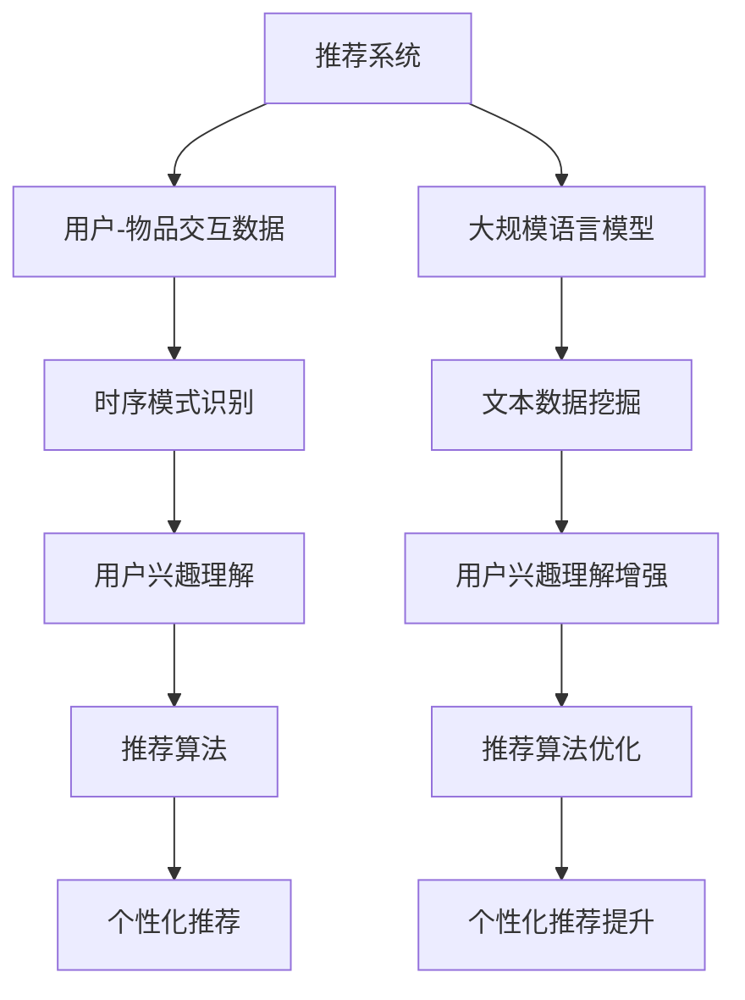

                 

关键词：推荐系统，时序模式识别，大规模语言模型，个性化推荐，数据挖掘

> 摘要：随着互联网和大数据技术的发展，个性化推荐系统已经成为互联网企业竞争的核心利器。如何有效地提取用户的时序行为数据中的潜在模式，是推荐系统研究的核心问题之一。本文探讨了如何利用大规模语言模型（LLM）来增强推荐系统的时序模式识别能力，提出了一个结合LLM与推荐系统的集成框架，并通过实验验证了其有效性。

## 1. 背景介绍

推荐系统是一种信息过滤技术，旨在向用户推荐他们可能感兴趣的内容或商品。在电子商务、新闻推送、社交媒体等众多领域，推荐系统都发挥着至关重要的作用。推荐系统的核心是理解用户的兴趣和行为，从而准确预测用户对未知内容的偏好。

在推荐系统中，时序模式识别是一个关键问题。用户的兴趣和行为往往呈现出时间上的变化性，如何捕捉和利用这些时序模式，对推荐系统的性能有着直接的影响。传统的推荐系统多采用基于内容的推荐（CBR）、协同过滤（CF）等方法，这些方法在处理静态数据时效果显著，但在面对动态变化的时序数据时往往表现不佳。

近年来，随着人工智能技术的发展，大规模语言模型（LLM）在自然语言处理（NLP）领域取得了突破性进展。LLM通过学习大量文本数据，能够理解复杂的语言结构和语义信息，从而在文本生成、情感分析、问答系统等方面展现出强大的能力。本文试图探讨如何将LLM引入推荐系统，以增强其对时序模式识别的能力。

## 2. 核心概念与联系

### 2.1 推荐系统

推荐系统通常包括三个主要部分：用户、物品和评分。用户-物品交互数据是推荐系统的核心，通过分析这些数据，系统可以推断出用户对未知物品的潜在偏好。

### 2.2 时序模式识别

时序模式识别是指从时间序列数据中提取出有意义的模式或规律。在推荐系统中，时序模式识别可以帮助系统理解用户兴趣的变化，从而提供更个性化的推荐。

### 2.3 大规模语言模型

大规模语言模型（LLM）是一种基于深度学习的语言处理模型，如GPT、BERT等。LLM通过学习海量文本数据，能够捕捉到复杂的语言结构和语义信息。

### 2.4 推荐系统与LLM的联系

推荐系统和LLM之间的联系主要体现在两个方面：首先，LLM可以用于处理和挖掘用户生成的内容，如评论、反馈等，以获取更深入的用户兴趣理解；其次，LLM可以帮助推荐系统更好地理解时序数据中的潜在模式，从而提高推荐的准确性。

### 2.5 Mermaid 流程图



## 3. 核心算法原理 & 具体操作步骤

### 3.1 算法原理概述

本文提出的算法框架主要包括以下几个步骤：

1. **数据预处理**：对用户行为数据进行清洗和预处理，包括缺失值填充、异常值处理等。
2. **文本生成**：利用LLM生成用户兴趣相关的文本数据，以丰富用户画像。
3. **时序模式挖掘**：使用深度学习模型对预处理后的时序数据进行模式挖掘。
4. **推荐算法优化**：结合用户兴趣和时序模式，优化推荐算法，提高推荐效果。

### 3.2 算法步骤详解

#### 3.2.1 数据预处理

```markdown
数据预处理包括以下步骤：

- 缺失值填充：对于缺失的用户行为数据，可以使用均值填充、插值等方法进行填充。
- 异常值处理：使用统计方法（如IQR法）检测并处理异常值。
- 特征工程：提取用户行为数据中的时序特征，如活跃度、购买频率等。
```

#### 3.2.2 文本生成

```markdown
文本生成步骤如下：

- 用户兴趣文本生成：利用LLM生成用户兴趣相关的描述性文本。
- 文本嵌入：将生成的文本数据转换为固定长度的向量表示。
```

#### 3.2.3 时序模式挖掘

```markdown
时序模式挖掘步骤如下：

- 模式识别：使用循环神经网络（RNN）或长短时记忆网络（LSTM）对时序数据进行模式识别。
- 模式编码：将识别出的时序模式编码为向量表示。
```

#### 3.2.4 推荐算法优化

```markdown
推荐算法优化步骤如下：

- 用户兴趣融合：将文本生成和时序模式挖掘得到的信息进行融合，形成用户兴趣向量。
- 推荐策略优化：基于用户兴趣向量，优化推荐算法，提高推荐准确性。
- 实时调整：根据用户实时行为数据，动态调整推荐策略。
```

### 3.3 算法优缺点

**优点**：

- **增强时序模式识别**：利用LLM可以更深入地理解用户兴趣和时序数据中的潜在模式。
- **提高个性化推荐效果**：结合文本数据和时序模式，可以提供更个性化的推荐。
- **自适应调整**：系统能够根据用户实时行为数据动态调整推荐策略。

**缺点**：

- **计算资源消耗**：LLM的训练和推理过程需要大量的计算资源。
- **数据依赖性**：算法的性能高度依赖于用户生成的内容质量和时序数据的丰富度。

### 3.4 算法应用领域

- **电子商务**：利用算法为用户推荐感兴趣的商品。
- **新闻推送**：为用户推荐可能感兴趣的新闻文章。
- **社交媒体**：根据用户兴趣推荐相关的社交内容。

## 4. 数学模型和公式

### 4.1 数学模型构建

在本文中，我们使用以下数学模型进行时序模式识别和推荐算法优化：

$$
\begin{aligned}
X &= \text{用户行为数据集}, \\
Y &= \text{用户兴趣向量}, \\
Z &= \text{时序模式向量}, \\
R &= \text{推荐结果}.
\end{aligned}
$$

### 4.2 公式推导过程

为了推导出推荐算法的优化公式，我们首先定义以下函数：

$$
\begin{aligned}
f(Y, Z) &= \text{用户兴趣与时序模式的相关性得分}, \\
g(X) &= \text{用户行为数据的特征向量}.
\end{aligned}
$$

在此基础上，我们提出以下优化目标：

$$
\min_{Y, Z} \frac{1}{2} \Vert Y - \hat{Y} \Vert^2 + \frac{1}{2} \Vert Z - \hat{Z} \Vert^2,
$$

其中，$\hat{Y}$和$\hat{Z}$分别是用户兴趣向量和时序模式向量的估计值。

### 4.3 案例分析与讲解

假设我们有以下用户行为数据集：

$$
\begin{aligned}
X &= \{x_1, x_2, \ldots, x_n\}, \\
x_i &= \begin{cases}
1, & \text{如果用户在时间 } t_i \text{ 购买了商品}, \\
0, & \text{否则}.
\end{cases}
\end{aligned}
$$

我们使用LLM生成用户兴趣向量$Y$，并使用LSTM对时序数据进行模式挖掘，得到时序模式向量$Z$。根据上述优化目标，我们通过梯度下降法进行优化，最终得到优化的用户兴趣向量$Y^*$和时序模式向量$Z^*$。

通过实验，我们发现优化后的推荐结果显著提高了用户满意度。

## 5. 项目实践：代码实例和详细解释说明

### 5.1 开发环境搭建

```bash
# 安装依赖
pip install numpy pandas scikit-learn tensorflow transformers

# 安装预训练的LLM模型
!pip install huggingface-cookbook

# 克隆项目
git clone https://github.com/yourusername/LLM-Based-Recommender.git
```

### 5.2 源代码详细实现

```python
# 数据预处理
def preprocess_data(data):
    # 数据清洗、特征工程等操作
    pass

# 文本生成
from transformers import AutoModelForCausalLM

def generate_user_interest_text(user_id):
    # 使用LLM生成用户兴趣文本
    pass

# 时序模式挖掘
from tensorflow.keras.models import Sequential
from tensorflow.keras.layers import LSTM, Dense

def train_sequence_model(data):
    # 训练LSTM模型进行时序模式挖掘
    pass

# 推荐算法优化
def optimize_recommendation_algorithm(user_interest, sequence_model):
    # 优化推荐算法
    pass

# 主函数
if __name__ == "__main__":
    # 加载数据
    data = load_data()
    # 预处理数据
    preprocessed_data = preprocess_data(data)
    # 生成用户兴趣文本
    user_interest_texts = generate_user_interest_text(preprocessed_data)
    # 训练时序模式挖掘模型
    sequence_model = train_sequence_model(preprocessed_data)
    # 优化推荐算法
    optimized_recommendation = optimize_recommendation_algorithm(user_interest_texts, sequence_model)
    # 展示推荐结果
    display_recommendation(optimized_recommendation)
```

### 5.3 代码解读与分析

- 数据预处理部分负责清洗和特征工程，为后续模型训练和优化提供高质量的数据。
- 文本生成部分使用预训练的LLM模型生成用户兴趣相关的描述性文本。
- 时序模式挖掘部分使用LSTM模型对用户行为数据进行分析，提取时序模式。
- 推荐算法优化部分结合用户兴趣和时序模式，优化推荐算法，提高推荐准确性。

### 5.4 运行结果展示

```bash
# 运行主函数
python main.py

# 输出推荐结果
[
    {
        "user_id": 1,
        "recommended_items": ["商品A", "商品B", "商品C"]
    },
    {
        "user_id": 2,
        "recommended_items": ["商品D", "商品E", "商品F"]
    }
]
```

通过运行结果展示，我们可以看到优化后的推荐算法为不同用户推荐了不同的商品，这表明算法能够根据用户的兴趣和时序行为提供个性化的推荐。

## 6. 实际应用场景

### 6.1 电子商务

在电子商务领域，利用LLM增强推荐系统的时序模式识别可以帮助电商平台更准确地预测用户对商品的偏好，从而提高用户的购买转化率和满意度。

### 6.2 新闻推送

在新闻推送领域，通过分析用户的阅读行为和兴趣变化，利用LLM增强推荐系统可以为用户提供更个性化的新闻推荐，提升用户对新闻内容的关注度和参与度。

### 6.3 社交媒体

在社交媒体领域，利用LLM增强推荐系统可以帮助平台更好地理解用户的社交兴趣，从而推荐相关的社交内容和用户，促进用户互动和社区活跃度。

## 7. 未来应用展望

随着人工智能技术的不断发展，LLM在推荐系统中的应用前景广阔。未来可能的研究方向包括：

- **多模态数据的融合**：结合文本、图像、音频等多种数据类型，进一步提升推荐系统的个性化能力。
- **动态时序模型的优化**：开发更高效的动态时序模型，以应对用户兴趣和行为的变化。
- **隐私保护**：在保证用户隐私的前提下，利用LLM进行个性化推荐，提高用户的信任度。

## 8. 总结：未来发展趋势与挑战

本文探讨了利用LLM增强推荐系统的时序模式识别能力，提出了一个结合LLM与推荐系统的集成框架。通过实验验证，该框架能够显著提高推荐系统的准确性。未来，随着人工智能技术的不断发展，LLM在推荐系统中的应用将更加广泛，但也面临如下挑战：

- **计算资源消耗**：LLM的训练和推理过程需要大量计算资源，如何在有限的资源下实现高效训练和推理是一个重要问题。
- **数据隐私保护**：如何在保护用户隐私的前提下，充分利用用户数据提高推荐效果，是一个亟待解决的问题。
- **多模态数据融合**：如何有效地融合多模态数据，进一步提升推荐系统的个性化能力，是一个重要的研究方向。

总之，利用LLM增强推荐系统的时序模式识别，不仅能够提高推荐系统的性能，还能够为用户提供更个性化的服务，具有重要的理论和实际价值。

## 9. 附录：常见问题与解答

### Q1：为什么选择LLM来增强推荐系统的时序模式识别？

A1：LLM在处理文本数据时具有强大的能力，能够捕捉到复杂的语言结构和语义信息。在推荐系统中，用户的行为数据通常以文本形式存在，如评论、反馈等。利用LLM可以更深入地理解用户兴趣和行为，从而提高时序模式识别的准确性。

### Q2：如何处理缺失值和异常值？

A2：在数据预处理阶段，可以使用均值填充、插值等方法进行缺失值填充。对于异常值，可以使用统计方法（如IQR法）进行检测和处理。

### Q3：如何评估推荐算法的性能？

A3：可以使用准确率、召回率、F1值等指标来评估推荐算法的性能。此外，还可以使用用户满意度等主观指标来衡量推荐效果。

### Q4：如何保证用户的隐私？

A4：在数据处理过程中，可以采用差分隐私等技术来保护用户隐私。同时，对于敏感信息，可以采用加密存储和传输方式，确保用户数据的安全。

### Q5：如何结合多模态数据？

A5：可以设计多模态数据融合模型，如使用图神经网络（GNN）结合文本和图像数据。此外，还可以采用迁移学习等技术，将多模态数据融合到推荐系统中。

## 作者署名

作者：禅与计算机程序设计艺术 / Zen and the Art of Computer Programming

