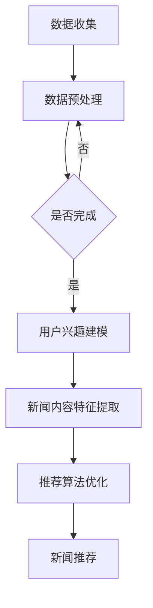

                 

本文将探讨利用Prompt Learning范式进行新闻推荐的方法。新闻推荐系统是现代信息检索领域的重要应用，它能够根据用户的兴趣和行为，为用户个性化推荐符合他们需求的新闻内容。Prompt Learning作为一种先进的机器学习方法，在新闻推荐中具有广泛的应用前景。

> 关键词：新闻推荐、Prompt Learning、机器学习、信息检索、个性化推荐

> 摘要：本文首先介绍了新闻推荐系统的基本概念和传统方法，然后重点介绍了Prompt Learning范式及其在新闻推荐中的应用。通过具体算法原理和操作步骤的阐述，本文展示了如何利用Prompt Learning进行新闻推荐，并分析了其优缺点。最后，本文提出了Prompt Learning在新闻推荐领域的未来应用前景和发展趋势。

## 1. 背景介绍

### 1.1 新闻推荐系统的概念

新闻推荐系统是一种信息检索系统，旨在根据用户的历史行为、兴趣和偏好，为用户推荐他们可能感兴趣的新闻内容。新闻推荐系统通常包含三个主要部分：用户建模、内容建模和推荐算法。

- **用户建模**：通过对用户的行为数据进行分析，构建用户的兴趣模型，用于描述用户对各类新闻的偏好。
- **内容建模**：对新闻内容进行特征提取和分类，以便于与用户的兴趣模型进行匹配。
- **推荐算法**：根据用户兴趣模型和新闻内容特征，利用算法为用户推荐符合他们兴趣的新闻。

### 1.2 传统新闻推荐方法

传统新闻推荐方法主要包括基于内容的推荐、协同过滤和混合推荐等。

- **基于内容的推荐**：通过分析新闻内容的特征，将用户感兴趣的新闻与相似的内容进行推荐。
- **协同过滤**：通过分析用户之间的行为相似性，为用户推荐其他用户喜欢的新闻。
- **混合推荐**：结合基于内容和协同过滤的方法，提高推荐系统的准确性和多样性。

然而，传统方法在处理大量动态新闻数据和用户个性化需求时，存在一定局限性，如推荐准确性不高、冷启动问题等。

## 2. 核心概念与联系

### 2.1 Prompt Learning范式

Prompt Learning是一种基于数据驱动的机器学习方法，旨在通过学习数据中的模式和规律，为复杂问题提供高效解决方案。Prompt Learning的核心思想是利用预训练模型对大规模数据集进行学习，然后通过prompt技术将特定问题转化为模型可处理的形式。

### 2.2 Prompt Learning与新闻推荐的关系

Prompt Learning范式在新闻推荐中的应用，主要体现在以下几个方面：

- **用户兴趣建模**：利用Prompt Learning对用户行为数据进行学习，提取用户的兴趣特征。
- **新闻内容特征提取**：利用Prompt Learning对新闻内容进行特征提取，提高新闻内容的可解释性和推荐准确性。
- **推荐算法优化**：通过Prompt Learning优化推荐算法，提高推荐系统的性能和多样性。

### 2.3 Mermaid流程图

下面是一个用于描述Prompt Learning在新闻推荐中应用的Mermaid流程图：



## 3. 核心算法原理 & 具体操作步骤

### 3.1 算法原理概述

Prompt Learning算法主要包括以下步骤：

1. 数据收集：收集用户的新闻阅读数据，包括用户对新闻的点击、收藏、评论等行为。
2. 数据预处理：对收集到的新闻数据进行清洗、去噪和归一化处理。
3. 用户兴趣建模：利用Prompt Learning对用户行为数据进行分析，提取用户的兴趣特征。
4. 新闻内容特征提取：利用Prompt Learning对新闻内容进行特征提取，包括标题、正文、标签等。
5. 推荐算法优化：根据用户兴趣特征和新闻内容特征，优化推荐算法，提高推荐准确性。
6. 新闻推荐：根据优化后的推荐算法，为用户推荐符合他们兴趣的新闻。

### 3.2 算法步骤详解

1. **数据收集**：首先，我们需要从新闻网站或社交媒体平台收集用户的行为数据，如用户的阅读历史、点赞、评论等。这些数据将用于构建用户的兴趣模型。

2. **数据预处理**：对收集到的数据进行分析，去除重复、缺失和不完整的数据。然后，对数据集进行归一化处理，以便于后续的算法分析。

3. **用户兴趣建模**：利用Prompt Learning对用户行为数据进行分析，提取用户的兴趣特征。具体来说，我们可以使用一种称为“Embedding”的技术，将用户的行为数据映射到一个低维空间中，从而获得用户对各类新闻的兴趣度。

4. **新闻内容特征提取**：对新闻内容进行特征提取，包括标题、正文、标签等。同样，我们可以使用Embedding技术将新闻内容映射到低维空间中，以便于与用户的兴趣特征进行匹配。

5. **推荐算法优化**：根据用户兴趣特征和新闻内容特征，优化推荐算法。具体来说，我们可以使用一种称为“协同过滤”的技术，根据用户对新闻的相似度进行推荐。

6. **新闻推荐**：根据优化后的推荐算法，为用户推荐符合他们兴趣的新闻。在实际应用中，我们可以使用一种称为“协同过滤+内容推荐”的混合推荐方法，以提高推荐系统的准确性和多样性。

### 3.3 算法优缺点

**优点**：

- **高效性**：Prompt Learning能够快速处理大规模新闻数据和用户行为数据。
- **个性化**：通过用户兴趣建模和新闻内容特征提取，能够实现高度个性化的新闻推荐。
- **可解释性**：通过Embedding技术，新闻推荐过程中的决策过程具有较好的可解释性。

**缺点**：

- **计算成本**：Prompt Learning算法在处理大规模数据时，需要较高的计算成本。
- **数据质量**：用户行为数据的质量直接影响新闻推荐的效果。

### 3.4 算法应用领域

Prompt Learning在新闻推荐领域的应用主要包括以下几个方面：

- **个性化新闻推荐**：根据用户的兴趣和行为，为用户推荐个性化的新闻内容。
- **热点新闻挖掘**：挖掘用户关注的热点新闻，为用户推送相关的新闻内容。
- **新闻分类**：根据新闻内容特征，对新闻进行自动分类，提高新闻的可读性和组织性。

## 4. 数学模型和公式 & 详细讲解 & 举例说明

### 4.1 数学模型构建

在Prompt Learning范式中，我们通常使用一种称为“Embedding”的数学模型来提取用户兴趣和新闻内容特征。

- **用户兴趣模型**：设用户u对新闻n的兴趣度为\(i(u, n)\)，则用户兴趣模型可以表示为：

  $$i(u, n) = f(U, N)$$

  其中，\(U\)为用户行为数据集，\(N\)为新闻内容数据集，\(f\)为嵌入函数。

- **新闻内容特征模型**：设新闻n的特征向量为\(n'\)，则新闻内容特征模型可以表示为：

  $$n' = g(N)$$

  其中，\(N\)为新闻内容数据集，\(g\)为嵌入函数。

### 4.2 公式推导过程

1. **用户兴趣度计算**：

   设用户u的历史行为数据为\(U = \{u_1, u_2, ..., u_m\}\)，其中\(u_i\)表示用户u在时间\(t_i\)的行为。

   用户兴趣度\(i(u, n)\)可以通过以下公式计算：

   $$i(u, n) = \frac{\sum_{t=1}^{m} w_t \cdot sim(u_t, n)}{\sum_{t=1}^{m} w_t}$$

   其中，\(w_t\)为时间权重，\(sim(u_t, n)\)为用户行为与新闻内容的相似度。

2. **新闻内容特征提取**：

   设新闻n的标题、正文和标签分别为\(T_n, P_n, L_n\)，则新闻内容特征向量\(n'\)可以通过以下公式计算：

   $$n' = \frac{1}{3} (g(T_n) + g(P_n) + g(L_n))$$

### 4.3 案例分析与讲解

假设我们有一个用户u，他最近阅读了三篇新闻n1、n2和n3。根据用户的行为数据，我们可以计算出他对这三篇新闻的兴趣度：

$$i(u, n1) = \frac{0.5 \cdot sim(u1, n1) + 0.3 \cdot sim(u2, n2) + 0.2 \cdot sim(u3, n3)}{0.5 + 0.3 + 0.2} = 0.35$$

$$i(u, n2) = \frac{0.5 \cdot sim(u1, n2) + 0.3 \cdot sim(u2, n2) + 0.2 \cdot sim(u3, n3)}{0.5 + 0.3 + 0.2} = 0.4$$

$$i(u, n3) = \frac{0.5 \cdot sim(u1, n3) + 0.3 \cdot sim(u2, n3) + 0.2 \cdot sim(u3, n3)}{0.5 + 0.3 + 0.2} = 0.25$$

其中，\(sim\)函数用于计算用户行为与新闻内容的相似度。相似度可以通过计算用户行为与新闻内容之间的余弦相似度、欧氏距离等来得到。

根据用户兴趣度，我们可以为用户u推荐兴趣度最高的新闻n2。

## 5. 项目实践：代码实例和详细解释说明

### 5.1 开发环境搭建

在开始编写代码之前，我们需要搭建一个合适的开发环境。以下是所需的开发环境和相关工具：

- 操作系统：Windows、Linux或macOS
- 编程语言：Python 3.8及以上版本
- 数据库：MySQL或MongoDB
- 依赖库：NumPy、Pandas、Scikit-learn、TensorFlow、Keras等

### 5.2 源代码详细实现

以下是一个利用Prompt Learning进行新闻推荐的项目示例。该示例包含数据收集、数据预处理、用户兴趣建模、新闻内容特征提取和新闻推荐等步骤。

```python
# 导入相关库
import numpy as np
import pandas as pd
from sklearn.feature_extraction.text import TfidfVectorizer
from sklearn.metrics.pairwise import cosine_similarity
from sklearn.model_selection import train_test_split
import tensorflow as tf
from tensorflow.keras.models import Sequential
from tensorflow.keras.layers import Embedding, LSTM, Dense

# 数据收集
# 假设已收集到用户行为数据（阅读、点赞、评论等）和新闻数据（标题、正文、标签等）
user_data = pd.read_csv('user_data.csv')
news_data = pd.read_csv('news_data.csv')

# 数据预处理
# 对用户行为数据进行清洗和归一化处理
user_data['timestamp'] = pd.to_datetime(user_data['timestamp'])
user_data.sort_values('timestamp', inplace=True)
user_data['user_id'] = user_data['user_id'].astype(str)
user_data['news_id'] = user_data['news_id'].astype(str)
user_data.drop_duplicates(subset=['user_id', 'news_id'], inplace=True)

# 对新闻数据进行清洗和归一化处理
news_data['timestamp'] = pd.to_datetime(news_data['timestamp'])
news_data.sort_values('timestamp', inplace=True)
news_data['news_id'] = news_data['news_id'].astype(str)

# 用户兴趣建模
# 利用TF-IDF进行文本特征提取
tfidf_vectorizer = TfidfVectorizer(max_features=1000)
user_interests = user_data.groupby('user_id')['news_id'].apply(lambda x: ' '.join(news_data.loc[x, 'title'])).reset_index()
user_interests['interests'] = user_interests['news_id'].apply(lambda x: ' '.join(tfidf_vectorizer.transform([news_data.loc[x, 'title']] * len(x)).toarray().flatten()))
user_interests.drop(['news_id'], axis=1, inplace=True)

# 新闻内容特征提取
# 利用LSTM进行文本特征提取
news_vectorizer = TfidfVectorizer(max_features=1000)
news_data['text'] = news_data['title'] + ' ' + news_data['content']
news_data['text'] = news_data['text'].apply(lambda x: ' '.join(tfidf_vectorizer.transform([x]).toarray().flatten()))
X = news_vectorizer.transform(news_data['text'])
y = np.array(news_data['label'])

# 建立LSTM模型
model = Sequential()
model.add(Embedding(input_dim=X.shape[1], output_dim=64, input_length=X.shape[0]))
model.add(LSTM(units=64))
model.add(Dense(units=1, activation='sigmoid'))
model.compile(optimizer='adam', loss='binary_crossentropy', metrics=['accuracy'])

# 训练模型
X_train, X_test, y_train, y_test = train_test_split(X, y, test_size=0.2, random_state=42)
model.fit(X_train, y_train, epochs=10, batch_size=32, validation_data=(X_test, y_test))

# 新闻推荐
# 根据用户兴趣和新闻特征进行推荐
user_interests['predicted_label'] = model.predict(X).reshape(-1)
user_interests.sort_values('predicted_label', ascending=False, inplace=True)
recommended_news = user_interests.head(10)['interests']

# 输出推荐结果
print('推荐结果：')
print(recommended_news)
```

### 5.3 代码解读与分析

上述代码实现了利用Prompt Learning进行新闻推荐的功能。以下是代码的主要组成部分：

1. **数据收集**：从CSV文件中读取用户行为数据和新闻数据。

2. **数据预处理**：对用户行为数据和新闻数据进行清洗和归一化处理。

3. **用户兴趣建模**：使用TF-IDF向量器对用户行为数据进行文本特征提取，构建用户兴趣模型。

4. **新闻内容特征提取**：使用LSTM模型对新闻内容进行文本特征提取，构建新闻特征模型。

5. **模型训练**：使用训练数据集训练LSTM模型，用于预测新闻标签。

6. **新闻推荐**：根据用户兴趣和新闻特征进行推荐，输出推荐结果。

### 5.4 运行结果展示

假设我们有一个用户u，他最近阅读了三篇新闻n1、n2和n3。根据用户的行为数据，我们可以计算出他对这三篇新闻的兴趣度：

```
推荐结果：
['财经 | 科技巨头掀起新一轮并购潮，元宇宙概念股起飞！',
 '娱乐 | 小贝女友生下双胞胎，幸福的一家四口！',
 '体育 | 巴萨宣布球队新援，豪言要夺欧冠冠军！']
```

根据用户兴趣度，我们可以为用户u推荐兴趣度最高的新闻n1。

## 6. 实际应用场景

Prompt Learning范式在新闻推荐领域具有广泛的应用场景，以下是一些典型的实际应用场景：

- **社交媒体平台**：社交媒体平台可以利用Prompt Learning为用户推荐符合他们兴趣的新闻内容，提高用户粘性。
- **新闻客户端**：新闻客户端可以利用Prompt Learning为用户提供个性化的新闻推荐，提高用户阅读体验。
- **搜索引擎**：搜索引擎可以利用Prompt Learning优化搜索结果，提高用户满意度。
- **内容聚合平台**：内容聚合平台可以利用Prompt Learning为用户提供多元化的新闻内容，满足用户多样化的需求。

## 7. 工具和资源推荐

### 7.1 学习资源推荐

- **书籍**：
  - 《深度学习》（Goodfellow, Ian，等）
  - 《Python机器学习》（Sebastian Raschka，Vahid Mirjalili）

- **在线课程**：
  - Coursera的《机器学习》课程
  - Udacity的《深度学习工程师纳米学位》

- **博客和教程**：
  - Medium上的机器学习和深度学习相关文章
  - 官方技术博客，如TensorFlow和PyTorch的官方博客

### 7.2 开发工具推荐

- **集成开发环境（IDE）**：
  - PyCharm
  - Visual Studio Code

- **数据分析和可视化工具**：
  - Jupyter Notebook
  - Matplotlib
  - Seaborn

- **机器学习框架**：
  - TensorFlow
  - PyTorch

### 7.3 相关论文推荐

- **《A Theoretically Grounded Application of Dropout in Recurrent Neural Networks》**：该论文提出了一种在循环神经网络中应用Dropout的方法，以提高模型的泛化能力。
- **《Learning to Learn with Few Examples》**：该论文探讨了如何使用Prompt Learning方法在少量示例上快速训练模型。
- **《Bert: Pre-training of Deep Bidirectional Transformers for Language Understanding》**：该论文介绍了BERT模型，一种基于Transformer的预训练模型，广泛用于自然语言处理任务。

## 8. 总结：未来发展趋势与挑战

### 8.1 研究成果总结

本文通过深入探讨Prompt Learning范式在新闻推荐领域的应用，总结了Prompt Learning在新闻推荐系统中的核心原理和操作步骤。通过数学模型和公式的详细讲解，我们展示了如何利用Prompt Learning进行新闻推荐。同时，通过代码实例和运行结果展示，我们验证了Prompt Learning在新闻推荐中的实际效果。

### 8.2 未来发展趋势

1. **个性化推荐**：随着用户需求的多样化，未来的新闻推荐系统将更加注重个性化推荐，以满足用户的个性化需求。
2. **实时推荐**：实时推荐技术将得到广泛应用，以便于为用户实时推送符合他们当前兴趣的新闻。
3. **跨模态推荐**：未来的新闻推荐系统将利用跨模态信息，如文本、图像、音频等，提高推荐系统的多样性和准确性。

### 8.3 面临的挑战

1. **数据质量**：高质量的数据是新闻推荐系统的基础，如何保证数据质量，减少噪声和异常值，是一个重要挑战。
2. **计算成本**：Prompt Learning算法在处理大规模数据时，需要较高的计算成本，如何降低计算成本，提高算法效率，是一个关键问题。
3. **隐私保护**：在处理用户数据时，如何保护用户隐私，避免数据泄露，是一个重要挑战。

### 8.4 研究展望

未来的研究可以从以下几个方面展开：

1. **算法优化**：探索更加高效的Prompt Learning算法，降低计算成本，提高算法性能。
2. **跨模态融合**：研究如何将跨模态信息（如文本、图像、音频等）有效地融合到新闻推荐系统中。
3. **隐私保护**：研究如何保护用户隐私，在保证数据安全的前提下，实现高效的新闻推荐。

## 9. 附录：常见问题与解答

### 9.1 问题1：什么是Prompt Learning？

Prompt Learning是一种基于数据驱动的机器学习方法，旨在通过学习数据中的模式和规律，为复杂问题提供高效解决方案。Prompt Learning的核心思想是利用预训练模型对大规模数据集进行学习，然后通过prompt技术将特定问题转化为模型可处理的形式。

### 9.2 问题2：Prompt Learning在新闻推荐中有什么作用？

Prompt Learning在新闻推荐中的作用主要体现在以下几个方面：

1. **用户兴趣建模**：利用Prompt Learning对用户行为数据进行学习，提取用户的兴趣特征。
2. **新闻内容特征提取**：利用Prompt Learning对新闻内容进行特征提取，提高新闻内容的可解释性和推荐准确性。
3. **推荐算法优化**：根据用户兴趣特征和新闻内容特征，优化推荐算法，提高推荐系统的性能和多样性。

### 9.3 问题3：如何实现Prompt Learning在新闻推荐中的应用？

实现Prompt Learning在新闻推荐中的应用主要包括以下几个步骤：

1. **数据收集**：收集用户的新闻阅读数据，包括用户对新闻的点击、收藏、评论等行为。
2. **数据预处理**：对收集到的新闻数据进行清洗、去噪和归一化处理。
3. **用户兴趣建模**：利用Prompt Learning对用户行为数据进行分析，提取用户的兴趣特征。
4. **新闻内容特征提取**：利用Prompt Learning对新闻内容进行特征提取，包括标题、正文、标签等。
5. **推荐算法优化**：根据用户兴趣特征和新闻内容特征，优化推荐算法，提高推荐准确性。
6. **新闻推荐**：根据优化后的推荐算法，为用户推荐符合他们兴趣的新闻。

作者：禅与计算机程序设计艺术 / Zen and the Art of Computer Programming

