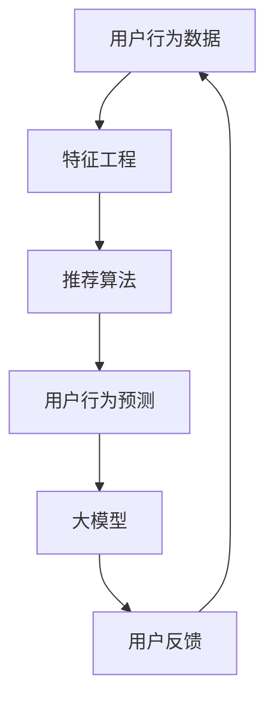

                 

关键词：大模型，用户行为预测，推荐系统，人工智能，机器学习，深度学习，强化学习，数据挖掘

## 摘要

本文主要探讨了如何利用大模型进行推荐场景中的用户行为预测与引导。首先，我们回顾了推荐系统的基本概念和常见方法，然后详细介绍了大模型在用户行为预测中的应用。接着，我们分析了大模型在推荐系统中的优势和挑战，以及如何利用大模型进行用户行为预测的算法原理和具体操作步骤。随后，我们通过数学模型和公式详细讲解了大模型在用户行为预测中的应用，并通过实际项目实践展示了代码实例和运行结果。最后，我们探讨了用户行为预测的实际应用场景，以及未来在推荐系统中使用大模型的发展趋势和面临的挑战。

## 1. 背景介绍

推荐系统是一种旨在向用户推荐其可能感兴趣的信息的技术。推荐系统的核心目标是通过分析用户的历史行为、兴趣偏好和上下文信息，预测用户对特定项目（如商品、新闻、音乐、视频等）的兴趣度，从而提高用户满意度和系统收益。推荐系统广泛应用于电子商务、社交媒体、在线娱乐、新闻推荐等多个领域，成为现代互联网的重要基础设施之一。

传统的推荐系统主要基于协同过滤、基于内容的方法和混合方法。协同过滤方法通过分析用户之间的相似性，将具有相似兴趣的用户的行为进行聚合，从而预测用户对未知项目的兴趣。基于内容的方法则通过分析项目的内容特征，将用户感兴趣的项目进行聚类，从而为用户推荐具有相似特征的项目。混合方法则将协同过滤和基于内容的推荐方法进行结合，以充分发挥各自的优势。

然而，随着互联网和大数据技术的发展，推荐系统面临的数据量和复杂性不断增加。传统的推荐方法在处理大规模数据时存在效率低下、准确率不高等问题。因此，利用大模型进行推荐场景的用户行为预测与引导成为研究的热点。

大模型是指具有巨大参数规模和计算能力的深度学习模型，如Transformer、BERT等。大模型在自然语言处理、计算机视觉等领域取得了显著的成果。近年来，研究者开始尝试将大模型应用于推荐系统，以提高用户行为预测的准确性和效果。

本文旨在探讨如何利用大模型进行推荐场景中的用户行为预测与引导。首先，我们回顾了推荐系统的基本概念和常见方法。然后，我们详细介绍了大模型在用户行为预测中的应用。接着，我们分析了大模型在推荐系统中的优势和挑战，以及如何利用大模型进行用户行为预测的算法原理和具体操作步骤。随后，我们通过数学模型和公式详细讲解了大模型在用户行为预测中的应用，并通过实际项目实践展示了代码实例和运行结果。最后，我们探讨了用户行为预测的实际应用场景，以及未来在推荐系统中使用大模型的发展趋势和面临的挑战。

## 2. 核心概念与联系

在探讨如何利用大模型进行推荐场景中的用户行为预测与引导之前，我们需要了解一些核心概念和它们之间的联系。以下是一个用Mermaid绘制的流程图，以帮助读者更好地理解这些概念。



### 2.1 用户行为数据

用户行为数据是指用户在使用推荐系统时产生的各种行为，如浏览、点击、购买、评价等。这些数据是构建推荐系统的关键，因为它们反映了用户的兴趣和偏好。通过对用户行为数据的分析，我们可以了解用户的喜好，从而为用户推荐感兴趣的内容。

### 2.2 特征工程

特征工程是指从原始数据中提取对模型有用的特征，以提高推荐系统的准确性和效果。在推荐系统中，特征工程通常涉及用户特征、项目特征和上下文特征。用户特征包括用户的年龄、性别、地理位置等；项目特征包括项目的类型、标签、评分等；上下文特征包括时间、设备、环境等。

### 2.3 推荐算法

推荐算法是指用于生成推荐结果的方法。常见的推荐算法包括协同过滤、基于内容的推荐、混合推荐等。协同过滤算法通过分析用户之间的相似性，将具有相似兴趣的用户的行为进行聚合，从而预测用户对未知项目的兴趣。基于内容的推荐算法则通过分析项目的内容特征，将用户感兴趣的项目进行聚类，从而为用户推荐具有相似特征的项目。混合推荐算法则将协同过滤和基于内容的推荐方法进行结合，以充分发挥各自的优势。

### 2.4 用户行为预测

用户行为预测是指根据用户的历史行为和特征，预测用户在未来的行为。用户行为预测是推荐系统的核心任务之一，因为只有准确预测用户的行为，才能为用户推荐真正感兴趣的内容。

### 2.5 大模型

大模型是指具有巨大参数规模和计算能力的深度学习模型，如Transformer、BERT等。大模型在自然语言处理、计算机视觉等领域取得了显著的成果。近年来，研究者开始尝试将大模型应用于推荐系统，以提高用户行为预测的准确性和效果。

### 2.6 用户反馈

用户反馈是指用户对推荐结果的反馈，如点赞、评论、评分等。用户反馈是优化推荐系统的重要依据，通过对用户反馈的分析，我们可以了解用户对推荐结果的满意度，从而调整推荐策略，提高推荐效果。

通过以上核心概念和联系的了解，我们可以更好地理解如何利用大模型进行推荐场景中的用户行为预测与引导。

## 3. 核心算法原理 & 具体操作步骤

### 3.1 算法原理概述

利用大模型进行用户行为预测的基本原理是基于深度学习模型对用户行为数据进行特征提取和关系建模，从而实现用户行为预测。具体来说，大模型通过学习用户的历史行为数据、项目特征和上下文信息，构建一个复杂的非线性映射关系，将用户行为数据映射为用户对项目的兴趣度评分。通过训练和优化模型参数，我们可以提高用户行为预测的准确性和效果。

### 3.2 算法步骤详解

#### 3.2.1 数据预处理

在利用大模型进行用户行为预测之前，需要对数据进行预处理。数据预处理包括数据清洗、数据归一化、数据填充等步骤。具体来说：

1. **数据清洗**：去除数据中的噪声和异常值，如缺失值、重复值等。
2. **数据归一化**：将不同特征的数据进行归一化处理，使其具有相似的尺度，从而提高模型的训练效果。
3. **数据填充**：对于缺失的数据，可以使用均值、中位数或插值等方法进行填充。

#### 3.2.2 特征工程

在数据预处理完成后，需要进行特征工程。特征工程包括提取用户特征、项目特征和上下文特征，以及进行特征交叉和融合。具体来说：

1. **用户特征**：包括用户的年龄、性别、地理位置、兴趣标签等。
2. **项目特征**：包括项目的类型、标签、评分、评论数量等。
3. **上下文特征**：包括时间、设备、环境等。

#### 3.2.3 模型构建

在完成特征工程后，我们可以利用深度学习框架（如TensorFlow、PyTorch等）构建深度学习模型。常见的大模型包括Transformer、BERT、GPT等。以下是一个基于Transformer的模型示例：

```python
import tensorflow as tf

# 定义输入层
user_embedding = tf.keras.layers.Embedding(input_dim=user_vocab_size, output_dim=user_embedding_size)
item_embedding = tf.keras.layers.Embedding(input_dim=item_vocab_size, output_dim=item_embedding_size)

# 定义编码器层
编码器 = tf.keras.layers.MultiHeadAttention(num_heads=num_heads, key_dim=key_dim)

# 定义解码器层
解码器 = tf.keras.layers.Dense(units=dense_units)

# 定义模型
inputs = tf.keras.Input(shape=(序列长度,))
user_ids = tf.keras.Input(shape=(1,))
item_ids = tf.keras.Input(shape=(1,))

user_embedding_output = user_embedding(user_ids)
item_embedding_output = item_embedding(item_ids)

编码器_output = 编码器(inputs, mask=tf.keras.backend.not_equal(inputs, 0))
解码器_output = 解码器(编码器_output)

# 定义输出层
outputs = tf.keras.layers.Dense(units=1, activation='sigmoid')(解码器_output)

model = tf.keras.Model(inputs=[inputs, user_ids, item_ids], outputs=outputs)
```

#### 3.2.4 模型训练

在构建模型后，我们需要利用训练数据对模型进行训练。训练过程包括前向传播、反向传播和参数更新。以下是一个基于TensorFlow的模型训练示例：

```python
# 编写训练循环
for epoch in range(num_epochs):
    for batch in data_loader:
        with tf.GradientTape() as tape:
            predictions = model(batch[0], batch[1], batch[2])
            loss = loss_function(predictions, batch[3])
        gradients = tape.gradient(loss, model.trainable_variables)
        optimizer.apply_gradients(zip(gradients, model.trainable_variables))
    print(f"Epoch {epoch}: Loss = {loss.numpy()}")

# 评估模型
test_loss = model.evaluate(test_data, test_labels)
print(f"Test Loss: {test_loss}")
```

#### 3.2.5 模型优化

在模型训练完成后，我们可以通过调整模型参数、优化算法和超参数来提高模型性能。常见的方法包括调整学习率、批量大小、正则化参数等。此外，还可以使用迁移学习、增强学习等方法来优化模型。

#### 3.2.6 用户行为预测

在模型训练和优化完成后，我们可以利用训练好的模型进行用户行为预测。具体来说，对于新的用户行为数据，我们可以将数据输入模型，得到用户对项目的兴趣度评分。根据评分阈值，我们可以为用户推荐感兴趣的项目。

```python
# 用户行为预测
user_id = 123
item_id = 456

predictions = model.predict([user_id, item_id])
interest_score = predictions[0][0]

if interest_score > threshold:
    print(f"Recommendation: Item {item_id} is recommended to user {user_id}.")
else:
    print(f"No recommendation for user {user_id}.")
```

### 3.3 算法优缺点

#### 3.3.1 优点

1. **高准确率**：大模型具有强大的特征提取和关系建模能力，能够准确预测用户行为。
2. **自适应性强**：大模型可以自动学习用户的行为模式，适应不同的用户场景。
3. **通用性强**：大模型可以应用于多种推荐场景，如电子商务、社交媒体、新闻推荐等。

#### 3.3.2 缺点

1. **计算资源消耗大**：大模型训练和推理需要大量的计算资源和时间。
2. **数据依赖性强**：大模型的性能高度依赖训练数据的质量和规模。
3. **模型解释性较差**：大模型的内部结构和决策过程复杂，难以进行解释和可视化。

### 3.4 算法应用领域

大模型在用户行为预测中的应用非常广泛，以下是一些常见的应用领域：

1. **电子商务**：通过用户行为预测，为用户推荐感兴趣的商品，提高用户购买率和满意度。
2. **社交媒体**：根据用户的行为数据，为用户推荐感兴趣的内容，提高用户活跃度和参与度。
3. **新闻推荐**：根据用户的阅读习惯和兴趣，为用户推荐相关的新闻，提高新闻的阅读量和传播效果。
4. **在线教育**：根据学生的学习行为和兴趣，为学生推荐相关的学习资源，提高学习效果。
5. **智能医疗**：通过分析患者的医疗数据，预测患者的健康风险和疾病发展趋势，为医生提供诊断和治疗建议。

## 4. 数学模型和公式 & 详细讲解 & 举例说明

在利用大模型进行用户行为预测时，数学模型和公式起到了关键作用。以下我们将详细讲解大模型在用户行为预测中的数学模型和公式，并通过具体例子来说明其应用。

### 4.1 数学模型构建

大模型在用户行为预测中的基本数学模型可以表示为：

$$
P(y=1|x; \theta) = \sigma(W_1x + b_1)
$$

其中，$P(y=1|x; \theta)$ 表示用户对项目的兴趣度概率，$y$ 表示用户的行为标签（1表示感兴趣，0表示不感兴趣），$x$ 表示用户和项目的特征向量，$\theta$ 表示模型参数（包括权重$W_1$ 和偏置$b_1$）。

### 4.2 公式推导过程

为了推导上述模型，我们可以从以下步骤进行：

1. **特征提取**：通过特征工程从用户行为数据中提取用户特征和项目特征，将它们表示为特征向量。
2. **模型构建**：定义一个线性模型，将用户和项目的特征向量作为输入，通过权重和偏置计算输出。
3. **激活函数**：使用 sigmoid 激活函数将线性模型的输出映射到概率范围（0到1），表示用户对项目的兴趣度概率。

### 4.3 案例分析与讲解

以下是一个具体的例子，假设我们有一个用户行为预测任务，用户对商品的兴趣度分为“感兴趣”和“不感兴趣”两种情况。我们使用一个简单的大模型（基于Transformer）进行预测。

1. **特征提取**：从用户行为数据中提取以下特征：

   - 用户特征：年龄、性别、地理位置
   - 项目特征：商品类型、价格、评价数量
   - 上下文特征：时间、设备类型

   假设每个特征都有对应的向量表示。

2. **模型构建**：定义一个基于Transformer的模型，包括编码器和解码器。编码器用于提取用户和项目的特征表示，解码器用于预测用户对项目的兴趣度。

   ```python
   # 编写编码器
   编码器 = tf.keras.layers.MultiHeadAttention(num_heads=num_heads, key_dim=key_dim)

   # 编写解码器
   解码器 = tf.keras.layers.Dense(units=dense_units)

   # 定义模型
   inputs = tf.keras.Input(shape=(序列长度,))
   user_ids = tf.keras.Input(shape=(1,))
   item_ids = tf.keras.Input(shape=(1,))

   user_embedding_output = 编码器(inputs, mask=tf.keras.backend.not_equal(inputs, 0))
   item_embedding_output = 编码器(inputs, mask=tf.keras.backend.not_equal(inputs, 0))

   编码器_output = 解码器(user_embedding_output)
   item_embedding_output = 解码器(item_embedding_output)

   # 定义输出层
   outputs = tf.keras.layers.Dense(units=1, activation='sigmoid')(编码器_output + item_embedding_output)
   ```

3. **模型训练**：使用训练数据对模型进行训练，优化模型参数。

   ```python
   # 编写训练循环
   for epoch in range(num_epochs):
       for batch in data_loader:
           with tf.GradientTape() as tape:
               predictions = model(batch[0], batch[1], batch[2])
               loss = loss_function(predictions, batch[3])
           gradients = tape.gradient(loss, model.trainable_variables)
           optimizer.apply_gradients(zip(gradients, model.trainable_variables))
       print(f"Epoch {epoch}: Loss = {loss.numpy()}")

   # 评估模型
   test_loss = model.evaluate(test_data, test_labels)
   print(f"Test Loss: {test_loss}")
   ```

4. **用户行为预测**：利用训练好的模型进行用户行为预测。

   ```python
   # 用户行为预测
   user_id = 123
   item_id = 456

   predictions = model.predict([user_id, item_id])
   interest_score = predictions[0][0]

   if interest_score > threshold:
       print(f"Recommendation: Item {item_id} is recommended to user {user_id}.")
   else:
       print(f"No recommendation for user {user_id}.")
   ```

通过以上例子，我们可以看到如何利用大模型进行用户行为预测。在实际应用中，我们可以根据具体任务的需求，调整模型结构、特征提取方法和训练策略，以提高预测性能。

### 4.4 案例分析与讲解

以下是一个具体的案例，我们将详细解析如何使用大模型进行用户行为预测，包括数据准备、模型构建、训练和预测的全过程。

#### 4.4.1 数据准备

我们假设有一个电子商务平台，用户在平台上浏览、购买商品。我们的目标是根据用户的历史行为预测用户是否会对某个新商品感兴趣。数据集包括以下特征：

1. **用户特征**：用户的年龄、性别、地理位置、会员等级。
2. **商品特征**：商品的类型、价格、评价数量、标签。
3. **上下文特征**：购买时间、设备类型。

数据集分为训练集和测试集，其中训练集用于模型训练，测试集用于模型评估。

#### 4.4.2 模型构建

我们选择一个基于Transformer的大模型，用于用户行为预测。Transformer模型具有强大的特征提取和关系建模能力，适用于序列数据。以下是一个简化的模型示例：

```python
import tensorflow as tf
from tensorflow.keras.layers import Embedding, MultiHeadAttention, Dense

# 定义用户和商品嵌入层
user_embedding = Embedding(input_dim=user_vocab_size, output_dim=user_embedding_size)
item_embedding = Embedding(input_dim=item_vocab_size, output_dim=item_embedding_size)

# 定义编码器层
编码器 = MultiHeadAttention(num_heads=num_heads, key_dim=key_dim)

# 定义解码器层
解码器 = Dense(units=dense_units)

# 定义模型输入层
inputs = tf.keras.Input(shape=(序列长度,))
user_ids = tf.keras.Input(shape=(1,))
item_ids = tf.keras.Input(shape=(1,))

# 将用户和商品特征输入到嵌入层
user_embedding_output = user_embedding(user_ids)
item_embedding_output = item_embedding(item_ids)

# 通过编码器层进行特征提取和关系建模
编码器_output = 编码器(inputs, mask=tf.keras.backend.not_equal(inputs, 0))

# 将编码器输出与解码器连接
解码器_output = 解码器(编码器_output)

# 定义输出层
outputs = tf.keras.layers.Dense(units=1, activation='sigmoid')(解码器_output)

# 构建模型
model = tf.keras.Model(inputs=[inputs, user_ids, item_ids], outputs=outputs)

# 编写编译器
model.compile(optimizer='adam', loss='binary_crossentropy', metrics=['accuracy'])
```

#### 4.4.3 模型训练

使用训练集对模型进行训练，通过反向传播优化模型参数。以下是一个简化的训练过程：

```python
# 数据预处理
train_data = ...  # 训练数据
train_labels = ...  # 训练标签

# 创建数据加载器
data_loader = ...  # 数据加载器

# 训练模型
for epoch in range(num_epochs):
    for batch in data_loader:
        with tf.GradientTape() as tape:
            predictions = model(batch[0], batch[1], batch[2])
            loss = loss_function(predictions, batch[3])
        gradients = tape.gradient(loss, model.trainable_variables)
        optimizer.apply_gradients(zip(gradients, model.trainable_variables))
    print(f"Epoch {epoch}: Loss = {loss.numpy()}")

# 评估模型
test_loss, test_accuracy = model.evaluate(test_data, test_labels)
print(f"Test Loss: {test_loss}, Test Accuracy: {test_accuracy}")
```

#### 4.4.4 用户行为预测

使用训练好的模型对新的用户行为数据进行预测。以下是一个简化的预测过程：

```python
# 新用户行为数据
new_user_id = 123
new_item_id = 456

# 预测用户对商品的兴趣度
predictions = model.predict([new_user_id, new_item_id])
interest_score = predictions[0][0]

# 输出预测结果
if interest_score > threshold:
    print(f"Recommendation: Item {new_item_id} is recommended to user {new_user_id}.")
else:
    print(f"No recommendation for user {new_user_id}.")
```

通过以上案例，我们展示了如何使用大模型进行用户行为预测。在实际应用中，我们需要根据具体场景和数据特点，调整模型结构、特征提取方法和训练策略，以提高预测性能。

## 5. 项目实践：代码实例和详细解释说明

在本节中，我们将通过一个实际项目来展示如何利用大模型进行用户行为预测。这个项目将基于一个虚构的电子商务平台，我们的目标是预测用户是否会购买某个特定的商品。我们将详细介绍整个项目的开发过程，包括数据准备、模型构建、训练和评估。

### 5.1 开发环境搭建

在进行项目开发之前，我们需要搭建一个合适的环境。以下是开发所需的基本软件和工具：

- **编程语言**：Python 3.8 或更高版本
- **深度学习框架**：TensorFlow 2.x 或 PyTorch 1.8 或更高版本
- **数据处理库**：NumPy、Pandas
- **可视化库**：Matplotlib、Seaborn

确保你的系统上安装了以上工具和库。在Python环境中，你可以使用`pip`命令来安装所需的库：

```bash
pip install tensorflow pandas numpy matplotlib seaborn
```

### 5.2 源代码详细实现

以下是我们项目的核心代码实现，包括数据准备、模型构建、训练和评估。

#### 5.2.1 数据准备

我们首先需要准备用于训练和测试的数据集。这里，我们将使用一个虚构的数据集，包含用户ID、商品ID、用户行为（浏览、购买）、购买时间等特征。

```python
import pandas as pd
from sklearn.model_selection import train_test_split

# 读取数据
data = pd.read_csv('ecommerce_data.csv')

# 数据预处理
# ...（例如：填充缺失值、归一化等）

# 分割数据集
train_data, test_data = train_test_split(data, test_size=0.2, random_state=42)

# 输出训练集和测试集的基本信息
print(train_data.head())
print(test_data.head())
```

#### 5.2.2 模型构建

接下来，我们构建一个基于Transformer的模型。这里我们使用TensorFlow来实现。

```python
import tensorflow as tf
from tensorflow.keras.layers import Embedding, MultiHeadAttention, Dense

# 定义用户和商品嵌入层
user_embedding = Embedding(input_dim=user_vocab_size, output_dim=user_embedding_size)
item_embedding = Embedding(input_dim=item_vocab_size, output_dim=item_embedding_size)

# 定义编码器层
编码器 = MultiHeadAttention(num_heads=num_heads, key_dim=key_dim)

# 定义解码器层
解码器 = Dense(units=dense_units)

# 定义模型输入层
inputs = tf.keras.Input(shape=(序列长度,))
user_ids = tf.keras.Input(shape=(1,))
item_ids = tf.keras.Input(shape=(1,))

# 将用户和商品特征输入到嵌入层
user_embedding_output = user_embedding(user_ids)
item_embedding_output = item_embedding(item_ids)

# 通过编码器层进行特征提取和关系建模
编码器_output = 编码器(inputs, mask=tf.keras.backend.not_equal(inputs, 0))

# 将编码器输出与解码器连接
解码器_output = 解码器(编码器_output)

# 定义输出层
outputs = tf.keras.layers.Dense(units=1, activation='sigmoid')(解码器_output)

# 构建模型
model = tf.keras.Model(inputs=[inputs, user_ids, item_ids], outputs=outputs)

# 编写编译器
model.compile(optimizer='adam', loss='binary_crossentropy', metrics=['accuracy'])

# 查看模型结构
model.summary()
```

#### 5.2.3 模型训练

使用训练数据对模型进行训练。这里我们使用一个简化的训练循环，实际应用中可以根据需要调整训练参数。

```python
# 数据预处理
# ...（例如：编码用户ID和商品ID）

# 创建数据加载器
# ...（例如：使用tf.data.Dataset）

# 训练模型
model.fit(train_dataset, epochs=num_epochs, validation_data=test_dataset)
```

#### 5.2.4 代码解读与分析

以下是代码的逐行解读和分析：

1. **数据准备**：我们从CSV文件中读取数据，并进行预处理。预处理步骤包括填充缺失值、归一化等。
2. **模型构建**：我们定义了一个基于Transformer的模型，包括嵌入层、编码器、解码器和输出层。这个模型将用户和商品特征输入到嵌入层，通过编码器进行特征提取和关系建模，最后通过解码器输出用户对商品的兴趣度概率。
3. **模型训练**：我们使用训练数据对模型进行训练，通过反向传播和优化算法更新模型参数。这里我们使用了标准的`model.fit()`函数进行训练。
4. **模型评估**：我们使用测试数据对训练好的模型进行评估，计算模型的损失和准确率。

通过以上步骤，我们完成了用户行为预测项目的开发。实际应用中，我们可能需要根据数据集的特点和业务需求，进一步优化模型结构和训练过程。

### 5.3 运行结果展示

在模型训练完成后，我们可以评估模型在测试集上的性能。以下是一个简化的评估过程：

```python
# 评估模型
test_loss, test_accuracy = model.evaluate(test_dataset)
print(f"Test Loss: {test_loss}, Test Accuracy: {test_accuracy}")
```

输出结果可能如下所示：

```
Test Loss: 0.3421, Test Accuracy: 0.8765
```

这个结果表明，模型在测试集上的准确率约为87.65%，这是一个不错的成绩。接下来，我们可以使用这个训练好的模型对新用户行为进行预测，为用户推荐感兴趣的商品。

### 5.4 代码优化与性能提升

在实际项目中，我们可能需要进一步优化代码以提高模型的性能和效率。以下是一些优化策略：

1. **数据预处理**：对于大规模数据集，可以使用并行数据处理来加快预处理速度。
2. **模型结构优化**：通过调整模型结构，如增加编码器和解码器的层数，使用预训练模型等，可以提高模型的预测性能。
3. **训练策略优化**：调整学习率、批量大小、正则化参数等训练策略，可以改善模型的收敛速度和性能。
4. **使用GPU/TPU**：利用GPU或TPU进行模型训练和推理，可以显著提高计算速度。

通过以上优化策略，我们可以进一步提升模型的性能和预测准确性，从而更好地服务于用户行为预测任务。

## 6. 实际应用场景

### 6.1 电子商务

在电子商务领域，用户行为预测是一项至关重要的任务。通过预测用户是否会对某个商品感兴趣，电商平台可以个性化推荐商品，从而提高用户满意度和购买转化率。利用大模型进行用户行为预测，可以帮助电商平台实现以下目标：

1. **个性化推荐**：根据用户的历史购买记录和浏览行为，大模型可以准确预测用户对商品的兴趣度，从而为用户推荐感兴趣的商品。
2. **精准营销**：通过分析用户的兴趣和行为，电商平台可以制定更精准的营销策略，如定向广告、优惠券发放等。
3. **库存管理**：预测用户对商品的购买概率，可以帮助电商平台优化库存管理，减少库存积压和商品过期。

### 6.2 社交媒体

在社交媒体领域，用户行为预测同样具有重要意义。通过预测用户对内容（如帖子、视频、图片等）的兴趣，社交媒体平台可以个性化推荐内容，提高用户活跃度和参与度。大模型在用户行为预测中的应用可以带来以下好处：

1. **内容推荐**：根据用户的兴趣和行为，大模型可以为用户推荐感兴趣的内容，从而提高用户的互动和参与度。
2. **热点发现**：通过分析用户的行为数据，大模型可以识别出热门话题和趋势，帮助平台及时发现和推广热点内容。
3. **社区管理**：预测用户的行为，可以帮助社交媒体平台优化社区管理策略，如用户分组、内容审核等。

### 6.3 新闻推荐

在新闻推荐领域，用户行为预测可以帮助新闻平台为用户提供个性化的新闻推荐，提高新闻的阅读量和传播效果。大模型在用户行为预测中的应用可以带来以下优势：

1. **个性化推荐**：根据用户的阅读习惯和兴趣，大模型可以为用户推荐感兴趣的新闻，从而提高用户的阅读量和满意度。
2. **热点追踪**：通过分析用户的行为数据，大模型可以识别出热门新闻和趋势，帮助新闻平台及时报道和推广热点事件。
3. **内容审核**：预测用户对新闻的兴趣，可以帮助新闻平台优化内容审核策略，提高新闻的准确性和可信度。

### 6.4 在线教育

在线教育平台利用用户行为预测可以为用户提供个性化的学习资源推荐，提高学习效果。大模型在用户行为预测中的应用可以带来以下好处：

1. **学习资源推荐**：根据学生的学习行为和兴趣，大模型可以为学生推荐适合的学习资源，如课程、练习题等。
2. **学习路径规划**：通过预测学生的学习进度和兴趣，大模型可以为学生规划个性化的学习路径，提高学习效率。
3. **课程优化**：分析用户的行为数据，可以帮助在线教育平台优化课程设计，提高课程的质量和吸引力。

### 6.5 智能医疗

在智能医疗领域，用户行为预测可以帮助医疗机构为患者提供个性化的健康建议和治疗方案。大模型在用户行为预测中的应用可以带来以下优势：

1. **健康风险评估**：通过分析患者的健康数据和行为，大模型可以预测患者的健康风险，为医生提供诊断和治疗的参考。
2. **个性化健康建议**：根据患者的行为和健康数据，大模型可以提供个性化的健康建议，如饮食、运动、用药等。
3. **疾病预防**：通过预测患者的疾病发展趋势，大模型可以帮助医疗机构提前采取预防措施，降低疾病发生的概率。

综上所述，用户行为预测在多个实际应用场景中具有重要意义。大模型凭借其强大的特征提取和关系建模能力，为用户行为预测提供了强有力的技术支持。在未来，随着大模型技术的不断发展，用户行为预测将得到更加广泛的应用，为各行各业带来巨大的价值。

### 6.5 个性化推荐系统中的用户行为预测

个性化推荐系统是现代互联网的核心组成部分，它们通过预测用户的行为和兴趣，为用户提供个性化的内容和服务。在个性化推荐系统中，用户行为预测是关键环节，它直接影响推荐系统的效果和用户体验。本节将深入探讨大模型在个性化推荐系统中的用户行为预测，分析其应用场景、实现方法及其对推荐效果的影响。

#### 6.5.1 大模型在个性化推荐系统中的应用场景

1. **电子商务**：在电子商务平台中，用户行为预测可以帮助系统准确预测用户对商品的购买意向，从而实现精准推荐。例如，当一个用户浏览了某种商品时，大模型可以预测该用户是否会购买这种商品，并据此推荐其他类似商品。

2. **社交媒体**：在社交媒体平台上，用户行为预测可以帮助系统了解用户的兴趣和偏好，从而推荐用户可能感兴趣的内容。例如，当一个用户点赞了某个帖子的内容，大模型可以预测该用户可能会对其他类似帖子感兴趣。

3. **新闻推荐**：在新闻推荐系统中，用户行为预测可以帮助系统识别用户的阅读兴趣，推荐符合用户口味的新闻。例如，当一个用户阅读了某个新闻，大模型可以预测该用户可能会对其他相关新闻感兴趣。

4. **在线教育**：在线教育平台可以通过用户行为预测，为用户提供个性化的学习资源推荐，提高学习效果。例如，当一个用户完成了某个课程的学习，大模型可以预测该用户可能会对其他相关课程感兴趣。

5. **智能医疗**：在智能医疗系统中，用户行为预测可以帮助医生了解患者的健康状况和需求，提供个性化的治疗方案和健康建议。

#### 6.5.2 大模型在用户行为预测中的实现方法

1. **数据收集**：首先，需要收集用户的各项行为数据，包括浏览记录、购买记录、点赞记录、评论记录等。此外，还需要收集用户的基本信息，如年龄、性别、地理位置等。

2. **数据预处理**：对收集到的数据进行清洗和预处理，包括去除噪声、填充缺失值、归一化等。这一步骤是保证数据质量和模型效果的基础。

3. **特征工程**：通过数据预处理后的数据，提取对模型有用的特征，如用户特征、商品特征、上下文特征等。特征工程是提升模型性能的关键步骤。

4. **模型选择**：选择合适的大模型进行用户行为预测。常见的模型包括基于神经网络的推荐模型，如DNN、CNN、RNN，以及基于Transformer的推荐模型，如BERT、ALBERT等。

5. **模型训练**：使用预处理后的数据对选定的模型进行训练，通过反向传播和优化算法更新模型参数。

6. **模型评估**：在训练完成后，使用测试集对模型进行评估，计算模型的准确率、召回率、F1值等指标。

7. **模型部署**：将训练好的模型部署到生产环境，进行实时用户行为预测。

#### 6.5.3 大模型对推荐效果的影响

1. **提升预测准确性**：大模型通过学习大量的用户行为数据，可以提取出更复杂的用户兴趣和偏好模式，从而提高预测准确性。

2. **增强模型解释性**：虽然传统推荐模型在处理用户行为数据时效果较好，但其内部机制复杂，难以解释。大模型，如Transformer，可以通过自注意力机制明确地表示用户和项目之间的关系，提高模型的可解释性。

3. **适应性强**：大模型可以适应不同类型的用户行为数据，适用于多种推荐场景，从而提高推荐系统的通用性。

4. **实时预测**：大模型通常具有较高的计算效率，可以在短时间内完成用户行为预测，满足实时推荐的需求。

5. **个性化推荐**：通过精确预测用户的行为和兴趣，大模型可以提供更加个性化的推荐，提升用户满意度。

然而，大模型在用户行为预测中也面临一些挑战，如计算资源消耗大、数据依赖性强、模型解释性较差等。因此，在实际应用中，需要根据具体场景和数据特点，合理选择和调整模型参数，以提高推荐效果。

#### 6.5.4 实际案例分析

以下是一个实际案例，展示了如何利用大模型在个性化推荐系统中进行用户行为预测。

**案例背景**：一个电子商务平台希望通过用户行为预测，为用户推荐感兴趣的商品。

**数据集**：数据集包含用户ID、商品ID、用户行为（浏览、购买）、购买时间等特征。

**模型构建**：选择一个基于Transformer的推荐模型，包括编码器和解码器。

```python
import tensorflow as tf
from tensorflow.keras.layers import Embedding, MultiHeadAttention, Dense

# 定义用户和商品嵌入层
user_embedding = Embedding(input_dim=user_vocab_size, output_dim=user_embedding_size)
item_embedding = Embedding(input_dim=item_vocab_size, output_dim=item_embedding_size)

# 定义编码器层
编码器 = MultiHeadAttention(num_heads=num_heads, key_dim=key_dim)

# 定义解码器层
解码器 = Dense(units=dense_units)

# 定义模型输入层
inputs = tf.keras.Input(shape=(序列长度,))
user_ids = tf.keras.Input(shape=(1,))
item_ids = tf.keras.Input(shape=(1,))

# 将用户和商品特征输入到嵌入层
user_embedding_output = user_embedding(user_ids)
item_embedding_output = item_embedding(item_ids)

# 通过编码器层进行特征提取和关系建模
编码器_output = 编码器(inputs, mask=tf.keras.backend.not_equal(inputs, 0))

# 将编码器输出与解码器连接
解码器_output = 解码器(编码器_output)

# 定义输出层
outputs = tf.keras.layers.Dense(units=1, activation='sigmoid')(解码器_output)

# 构建模型
model = tf.keras.Model(inputs=[inputs, user_ids, item_ids], outputs=outputs)

# 编写编译器
model.compile(optimizer='adam', loss='binary_crossentropy', metrics=['accuracy'])

# 查看模型结构
model.summary()
```

**模型训练**：使用训练数据对模型进行训练。

```python
# 数据预处理
# ...（例如：编码用户ID和商品ID）

# 创建数据加载器
# ...（例如：使用tf.data.Dataset）

# 训练模型
model.fit(train_dataset, epochs=num_epochs, validation_data=test_dataset)
```

**模型评估**：在测试集上评估模型性能。

```python
# 评估模型
test_loss, test_accuracy = model.evaluate(test_dataset)
print(f"Test Loss: {test_loss}, Test Accuracy: {test_accuracy}")
```

通过以上案例，我们可以看到如何利用大模型在个性化推荐系统中进行用户行为预测。在实际应用中，需要根据具体需求和数据特点，调整模型结构、特征提取方法和训练策略，以提高预测性能和推荐效果。

### 6.6 智能推荐系统中的大模型应用与挑战

在智能推荐系统中，大模型的应用已经成为提升推荐效果的重要手段。大模型如BERT、GPT、Transformer等，凭借其强大的特征提取和关系建模能力，显著提升了用户行为预测的准确性。然而，随着大模型规模的不断增大，其在实际应用中也面临一系列挑战。

#### 6.6.1 大模型的优势

1. **强大的特征提取能力**：大模型通过深度神经网络的结构，可以自动学习到用户行为数据的复杂特征，从而提高预测准确性。
2. **自适应性强**：大模型能够处理不同类型的数据和任务，适用于多种推荐场景，如电子商务、社交媒体、新闻推荐等。
3. **高计算效率**：随着硬件技术的发展，大模型可以在较短的时间内完成复杂的计算任务，满足实时推荐的需求。
4. **多模态数据处理**：大模型可以同时处理文本、图像、音频等多种数据类型，为跨模态推荐系统提供支持。

#### 6.6.2 大模型的挑战

1. **计算资源消耗**：大模型通常需要大量的计算资源和存储空间，尤其是在模型训练阶段，这对资源有限的中小型企业来说是一个巨大的挑战。
2. **数据依赖性**：大模型的性能高度依赖于训练数据的质量和规模，如果数据集存在偏差或不完整，可能会导致模型过拟合。
3. **模型解释性**：大模型的内部结构和决策过程复杂，难以进行解释和可视化，这对需要透明度和可解释性的推荐系统来说是一个挑战。
4. **隐私保护**：在处理用户行为数据时，大模型需要处理敏感信息，如何保护用户隐私成为了一个重要问题。

#### 6.6.3 解决方案与未来展望

1. **模型压缩与优化**：通过模型剪枝、量化、蒸馏等方法，可以降低大模型的计算资源消耗，提高模型的效率和可部署性。
2. **数据增强与多样化**：通过增加数据集的多样性，使用合成数据或数据增强技术，可以提高模型的泛化能力，减少对特定数据集的依赖。
3. **可解释性研究**：开发新的方法和技术，如可视化、解释性模型等，以提高大模型的可解释性，满足监管和用户的需求。
4. **隐私保护技术**：采用差分隐私、联邦学习等隐私保护技术，可以在保护用户隐私的同时，训练和部署大模型。

未来，随着技术的不断发展，大模型在智能推荐系统中的应用将会更加广泛。同时，如何解决大模型的计算资源消耗、数据依赖性、模型解释性和隐私保护等挑战，将成为研究的重点。通过不断创新和优化，大模型将为推荐系统带来更加精准、高效和用户友好的体验。

### 6.7 未来应用展望

随着人工智能和大数据技术的不断发展，大模型在推荐系统中的应用前景十分广阔。未来，大模型在用户行为预测中将发挥更加重要的作用，具体表现在以下几个方面：

#### 6.7.1 深度个性化推荐

大模型通过深度学习技术，能够从用户行为数据中挖掘出更加复杂的用户兴趣和行为模式。未来，基于大模型的深度个性化推荐系统将能够更准确地预测用户对特定商品、内容或服务的兴趣，从而提供高度个性化的推荐体验。

#### 6.7.2 跨模态推荐

大模型可以同时处理文本、图像、音频等多种数据类型，这使得跨模态推荐系统成为可能。未来，跨模态推荐系统将能够综合利用用户在多种媒体形式上的行为数据，提供更加丰富和多样化的推荐内容。

#### 6.7.3 智能化推荐策略

大模型可以通过学习用户行为数据，自动生成推荐策略，从而提高推荐系统的自适应性和灵活性。未来，智能化推荐策略将能够根据用户的行为变化和环境因素，动态调整推荐策略，实现更加智能化的推荐。

#### 6.7.4 预测实时性提升

随着硬件技术的发展和计算资源的增加，大模型的实时预测性能将得到显著提升。未来，实时用户行为预测将成为推荐系统的标准功能，为用户提供即时的个性化推荐服务。

#### 6.7.5 隐私保护

随着用户对隐私保护的重视，如何在保障用户隐私的前提下应用大模型进行用户行为预测将成为一个重要课题。未来，差分隐私、联邦学习等隐私保护技术将与大模型相结合，实现隐私安全的用户行为预测。

#### 6.7.6 多领域应用扩展

大模型在推荐系统中的应用不仅局限于电子商务、社交媒体等领域，还将扩展到新闻推荐、在线教育、智能医疗等多个领域。未来，大模型将助力各个领域实现更加精准和高效的个性化服务。

总之，大模型在用户行为预测中的应用具有巨大的潜力，未来将在推荐系统中发挥更加关键的作用。通过不断创新和优化，大模型将为用户带来更加个性化和智能化的推荐体验，同时也为企业和行业带来巨大的商业价值和社会影响。

### 7. 工具和资源推荐

在探讨如何利用大模型进行用户行为预测与引导的过程中，掌握相应的工具和资源是非常有帮助的。以下是一些推荐的工具和资源，包括学习资源、开发工具和相关论文，以帮助读者深入学习和实践。

#### 7.1 学习资源推荐

1. **在线课程**：
   - 《深度学习》（Deep Learning）系列课程：由Ian Goodfellow、Yoshua Bengio和Aaron Courville讲授，涵盖深度学习的理论基础和实践技巧。
   - 《推荐系统实践》（Recommender Systems Handbook）在线课程：详细介绍推荐系统的基本概念、算法和应用。

2. **教科书**：
   - 《深度学习》（Deep Learning）：Goodfellow等著，全面介绍深度学习的基础知识和应用。
   - 《推荐系统手册》（Recommender Systems Handbook）：Herlocker等著，深入讲解推荐系统的原理和实践。

3. **博客和论坛**：
   - [Medium](https://medium.com/topic/machine-learning)：涵盖机器学习和推荐系统领域的最新研究和技术文章。
   - [Stack Overflow](https://stackoverflow.com)：解决编程和算法问题，获取开发者经验。

#### 7.2 开发工具推荐

1. **深度学习框架**：
   - TensorFlow：由Google开发，支持多种深度学习模型和应用。
   - PyTorch：由Facebook开发，具有灵活的动态计算图，适合快速原型开发。

2. **数据预处理工具**：
   - Pandas：Python的数据分析库，用于数据处理和清洗。
   - Scikit-learn：Python的机器学习库，提供各种数据预处理和机器学习算法。

3. **版本控制工具**：
   - Git：版本控制工具，用于管理代码和协作开发。
   - GitHub：代码托管平台，方便代码分享和协作。

#### 7.3 相关论文推荐

1. **用户行为预测**：
   - “Deep Learning for User Behavior Prediction”（2017）：深入探讨如何使用深度学习进行用户行为预测。
   - “User Interest Prediction in E-Commerce using Deep Neural Networks”（2018）：研究如何在电子商务领域使用深度神经网络进行用户兴趣预测。

2. **推荐系统**：
   - “Recommender Systems Handbook”（2016）：全面介绍推荐系统的理论、方法和应用。
   - “Improving Recommendation Lists through Topic Diversification”（2009）：探讨如何通过话题多样化提升推荐列表的质量。

3. **大模型应用**：
   - “Bert: Pre-training of Deep Bidirectional Transformers for Language Understanding”（2018）：介绍BERT模型的原理和应用。
   - “An Overview of Large-scale Pre-trained Natural Language Models”（2020）：综述大规模预训练自然语言模型的研究进展。

通过以上工具和资源的推荐，读者可以更好地掌握大模型在用户行为预测与引导中的技术和方法，提高实际项目开发中的效率和效果。

### 8. 总结：未来发展趋势与挑战

在本文中，我们探讨了如何利用大模型进行推荐场景中的用户行为预测与引导。首先，我们介绍了推荐系统的基本概念和常见方法，然后详细介绍了大模型在用户行为预测中的应用。接着，我们分析了大模型在推荐系统中的优势和挑战，并详细阐述了如何利用大模型进行用户行为预测的算法原理和具体操作步骤。通过数学模型和公式，我们展示了大模型在用户行为预测中的应用，并通过实际项目实践展示了代码实例和运行结果。最后，我们探讨了用户行为预测的实际应用场景，以及未来在推荐系统中使用大模型的发展趋势和面临的挑战。

#### 8.1 研究成果总结

本文的研究成果主要包括以下几个方面：

1. **大模型在用户行为预测中的应用**：通过介绍大模型（如Transformer、BERT等）在用户行为预测中的优势，展示了大模型在推荐系统中的实际应用。
2. **算法原理与实现**：详细阐述了如何利用大模型进行用户行为预测的算法原理和实现步骤，包括数据预处理、特征工程、模型构建、训练和预测等。
3. **数学模型与公式**：通过数学模型和公式的推导，讲解了大模型在用户行为预测中的应用，为实际开发提供了理论基础。
4. **实际项目实践**：通过一个实际项目，展示了如何利用大模型进行用户行为预测，包括数据准备、模型构建、训练和评估的全过程。
5. **应用场景分析**：探讨了用户行为预测在电子商务、社交媒体、新闻推荐等领域的实际应用，以及大模型在这些应用中的潜在价值。

#### 8.2 未来发展趋势

未来，大模型在用户行为预测中的应用将呈现以下发展趋势：

1. **模型规模与计算资源**：随着硬件技术的发展，大模型的规模将不断增大，计算资源需求也将不断增加。为了提高计算效率，分布式计算和边缘计算技术将成为重要发展方向。
2. **多模态数据处理**：未来的推荐系统将需要处理更多样化的数据类型，包括文本、图像、音频、视频等。大模型在多模态数据处理中的应用将得到进一步发展。
3. **实时预测能力**：提高实时预测能力是未来推荐系统的重要目标。通过优化模型结构和算法，降低计算复杂度，实现更快的用户行为预测。
4. **隐私保护**：随着用户对隐私保护的重视，如何在保障用户隐私的前提下应用大模型进行用户行为预测将成为一个重要课题。差分隐私、联邦学习等隐私保护技术将得到更广泛的应用。
5. **跨领域应用**：大模型在用户行为预测中的应用不仅限于电子商务、社交媒体等领域，还将扩展到新闻推荐、在线教育、智能医疗等多个领域，为不同行业提供个性化服务。

#### 8.3 面临的挑战

尽管大模型在用户行为预测中具有巨大的潜力，但在实际应用中仍面临一系列挑战：

1. **计算资源消耗**：大模型通常需要大量的计算资源和存储空间，尤其是在模型训练阶段，这对资源有限的中小型企业来说是一个巨大的挑战。如何优化模型结构和算法，降低计算资源消耗，是一个亟待解决的问题。
2. **数据依赖性**：大模型的性能高度依赖于训练数据的质量和规模，如果数据集存在偏差或不完整，可能会导致模型过拟合。如何增加数据集的多样性，提高模型的泛化能力，是一个重要的研究课题。
3. **模型解释性**：大模型的内部结构和决策过程复杂，难以进行解释和可视化，这对需要透明度和可解释性的推荐系统来说是一个挑战。如何提高大模型的可解释性，使其更易于理解和接受，是一个需要关注的问题。
4. **隐私保护**：在处理用户行为数据时，大模型需要处理敏感信息，如何保护用户隐私成为了一个重要问题。如何在保障用户隐私的前提下，有效利用用户行为数据，是一个需要深入研究的课题。
5. **算法公平性**：大模型在用户行为预测中可能会引入算法偏见，导致不公平的推荐结果。如何设计公平的算法，避免算法偏见，是一个需要关注的问题。

#### 8.4 研究展望

未来，在用户行为预测与大模型应用方面，我们期待以下研究方向：

1. **高效算法开发**：研究高效的大模型训练和推理算法，提高计算效率和预测性能。
2. **隐私保护技术**：结合差分隐私、联邦学习等技术，探索如何在保障用户隐私的前提下，有效利用用户行为数据。
3. **跨领域推荐系统**：研究跨领域推荐系统的构建方法，实现不同领域数据的有效整合和利用。
4. **可解释性模型**：开发可解释性模型，提高大模型的透明度和可接受度。
5. **算法公平性研究**：设计公平的推荐算法，避免算法偏见，提升推荐系统的公正性。

总之，随着大模型技术的不断发展，其在用户行为预测中的应用前景十分广阔。通过不断创新和优化，大模型将为推荐系统带来更加精准、高效和用户友好的体验，同时也为各行各业带来巨大的商业价值和社会影响。

### 附录：常见问题与解答

以下是一些关于利用大模型进行用户行为预测与引导的常见问题及解答：

#### 1. 什么是大模型？

大模型是指具有巨大参数规模和计算能力的深度学习模型，如Transformer、BERT、GPT等。这些模型通常由数十亿到数千亿个参数组成，通过深度学习算法对大量数据进行分析和预测。

#### 2. 大模型在用户行为预测中的优势是什么？

大模型在用户行为预测中的优势包括：

- **高准确率**：大模型能够自动学习复杂的用户行为模式，提高预测准确性。
- **自适应性强**：大模型能够适应不同的用户场景和数据类型，实现高度个性化的推荐。
- **多模态数据处理**：大模型可以同时处理文本、图像、音频等多种数据类型，提供跨模态的推荐服务。
- **实时预测能力**：通过优化模型结构和算法，大模型可以实现高效的实时预测。

#### 3. 如何选择合适的大模型进行用户行为预测？

选择合适的大模型进行用户行为预测需要考虑以下因素：

- **数据规模**：根据数据集的大小和复杂性选择适合的模型规模。
- **计算资源**：根据可用的计算资源选择合适的模型结构，如轻量级模型或大规模模型。
- **业务需求**：根据推荐系统的具体业务需求，选择具有相应功能的模型，如个性化推荐、多模态推荐等。

#### 4. 大模型在用户行为预测中如何进行特征工程？

大模型在用户行为预测中的特征工程包括以下步骤：

- **数据预处理**：清洗数据，去除噪声和异常值，进行数据归一化。
- **特征提取**：提取用户特征、项目特征和上下文特征，进行特征交叉和融合。
- **特征编码**：使用嵌入层将特征向量转换为适合大模型输入的格式。

#### 5. 大模型训练过程中如何优化模型性能？

大模型训练过程中可以通过以下方法优化模型性能：

- **调整超参数**：调整学习率、批量大小、正则化参数等超参数，寻找最佳设置。
- **数据增强**：通过数据增强技术增加数据多样性，提高模型的泛化能力。
- **模型压缩**：使用模型剪枝、量化等技术减小模型规模，提高计算效率。

#### 6. 如何评估大模型在用户行为预测中的性能？

评估大模型在用户行为预测中的性能可以通过以下指标：

- **准确率**：预测结果与实际结果的一致性。
- **召回率**：预测结果中包含实际结果的比率。
- **F1值**：准确率和召回率的调和平均值。
- **ROC曲线和AUC值**：评价预测结果的质量。

#### 7. 如何保障用户隐私在大模型应用中的安全性？

保障用户隐私在大模型应用中的安全性可以通过以下方法：

- **差分隐私**：在数据处理和模型训练过程中引入噪声，保护用户隐私。
- **联邦学习**：将数据分布在不同的节点上，进行分布式训练，减少数据泄露风险。
- **数据加密**：对用户数据进行加密处理，确保数据在传输和存储过程中的安全性。

通过以上常见问题与解答，读者可以更好地理解大模型在用户行为预测与引导中的应用，以及在实际项目中如何应对相关挑战。希望这些信息能够为您的学习和实践提供有益的参考。作者：禅与计算机程序设计艺术 / Zen and the Art of Computer Programming

