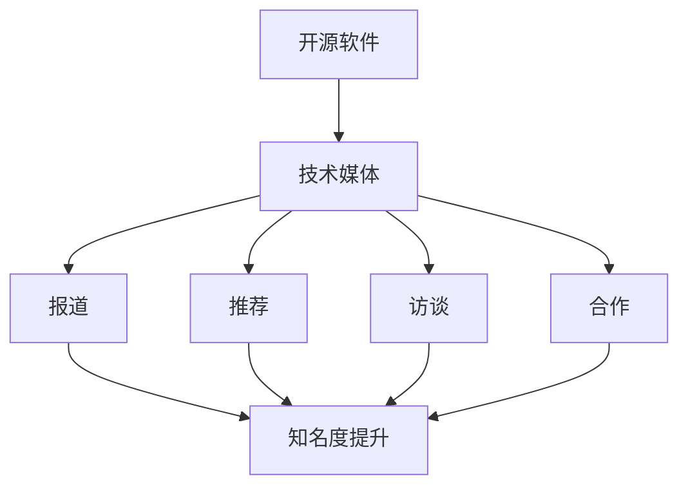

                 

关键词：开源影响力、技术媒体、曝光机会、社交媒体、内容创作、技术社区、品牌传播

> 摘要：本文将探讨如何利用开源项目的影响力，在技术媒体上获得曝光机会。通过分析技术媒体的运作机制、受众特点，以及开源项目的价值定位，我们提供了一系列策略和技巧，帮助开源项目获得更多的关注和认可。

## 1. 背景介绍

在当今快速发展的技术领域，开源软件已经成为推动创新和合作的重要力量。越来越多的开发者和组织选择将他们的代码贡献给开源社区，希望通过这种方式提升项目的影响力，甚至为个人和组织的品牌带来巨大的价值。与此同时，技术媒体在传递知识、分享经验、发现新项目方面扮演着越来越重要的角色。

技术媒体不仅提供了技术趋势和最新动态的报道，也为开源项目提供了一个展示自身价值和吸引潜在贡献者的平台。然而，如何有效地利用这些媒体资源，提高开源项目的曝光率，依然是一个值得探讨的话题。

本文将围绕以下几个问题展开讨论：

- 技术媒体为何对开源项目感兴趣？
- 开源项目如何与媒体建立有效的联系？
- 如何通过内容创作在技术媒体上吸引注意力？
- 开源项目如何利用媒体进行品牌传播？
- 开源项目的未来发展趋势及面临的挑战

通过这些问题，我们将深入探讨如何利用开源影响力获得技术媒体曝光机会，为开源项目的成功推广提供一些实用的建议。

### 2. 核心概念与联系

在探讨如何利用开源影响力获得技术媒体曝光机会之前，我们首先需要了解几个核心概念，这些概念构成了我们讨论的基础。

#### 2.1 开源软件

开源软件（Open Source Software, OSS）是指那些软件源代码可以被公众自由访问、修改和共享的软件。开源软件的核心价值在于其开放性和可协作性，使得开发者可以在不同的平台上进行改进和优化，从而推动技术的创新和发展。

#### 2.2 技术媒体

技术媒体是指那些专注于技术领域报道和分享的平台，包括在线博客、专业杂志、视频频道、社交媒体等。这些平台通过发布技术文章、访谈、教程、新闻等，为技术社区提供最新的信息和资源。

#### 2.3 开源项目的价值定位

开源项目的价值定位是指项目团队如何定义和传达项目的核心价值，包括其技术特点、应用场景、社区贡献等。一个清晰的价值定位有助于技术媒体和受众更好地理解项目的意义和影响力。

#### 2.4 媒体与开源项目的互动

媒体与开源项目的互动主要表现在以下几个方面：

- **报道**：媒体对开源项目的成功案例、技术创新等进行报道，提升项目的知名度。
- **推荐**：媒体根据项目的质量和影响力进行推荐，吸引更多开发者关注和参与。
- **访谈**：媒体通过访谈项目团队成员，深入了解项目的背景、目标和挑战。
- **合作**：媒体与开源项目合作，共同举办技术沙龙、研讨会等活动，促进项目的发展。

### 2.5 Mermaid 流程图

以下是媒体与开源项目互动的 Mermaid 流程图，展示各个概念之间的联系：



通过这个流程图，我们可以更直观地看到开源软件、技术媒体和开源项目价值定位之间的关系，以及媒体与项目之间的互动机制。

### 3. 核心算法原理 & 具体操作步骤

#### 3.1 算法原理概述

开源项目的曝光机会往往依赖于一系列核心算法和操作步骤，这些步骤可以分为以下几个阶段：

1. **内容创作**：通过高质量的文章、教程、视频等，为技术媒体提供丰富的内容。
2. **渠道选择**：选择合适的技术媒体，根据其受众特点和报道风格，进行精准投放。
3. **互动互动**：与技术媒体建立良好的互动关系，包括评论、分享、转发等。
4. **品牌建设**：通过品牌故事、团队介绍、项目进展等，提升项目的知名度和影响力。
5. **数据分析**：通过数据分析，评估宣传效果，调整策略，持续优化。

#### 3.2 算法步骤详解

1. **内容创作**

   内容创作是开源项目获取媒体关注的重要手段。高质量的内容能够吸引读者的兴趣，增加项目的曝光率。在内容创作过程中，需要注意以下几点：

   - **选题**：选择与项目相关的热门话题、技术趋势或成功案例。
   - **格式**：根据媒体平台的特点，选择合适的文章、教程、视频等格式。
   - **深度**：深入剖析技术细节，提供独到见解和实用的解决方案。
   - **互动**：在内容中引导读者参与讨论，增加互动性。

2. **渠道选择**

   选择合适的技术媒体渠道，是实现有效曝光的关键。在渠道选择过程中，可以从以下几个方面考虑：

   - **受众**：了解媒体受众的特点，选择与项目目标受众匹配的媒体。
   - **影响力**：评估媒体的影响力，包括读者数量、评论数、转发数等。
   - **报道风格**：选择与项目特点和内容风格相匹配的媒体。
   - **合作历史**：考虑媒体与项目的合作历史，是否有成功的合作案例。

3. **互动互动**

   与技术媒体建立良好的互动关系，能够提高项目在媒体上的曝光率。在互动过程中，需要注意以下几点：

   - **评论**：积极回复读者的评论，展现项目的互动性和热情。
   - **分享**：将媒体发布的内容分享到其他社交媒体平台，扩大传播范围。
   - **转发**：在社交媒体上转发媒体的内容，表达对媒体的认可和支持。
   - **合作**：主动与媒体合作，共同举办活动，提升项目的知名度。

4. **品牌建设**

   品牌建设是开源项目长期发展的基础。通过以下几个方面，可以提升项目的品牌形象：

   - **故事**：讲述项目的背景故事，展现项目的历史和愿景。
   - **团队**：介绍项目团队，展示团队成员的专业能力和贡献。
   - **进展**：及时发布项目进展，展示项目的成长历程。
   - **荣誉**：分享项目获得的荣誉和奖项，提升项目的公信力。

5. **数据分析**

   通过数据分析，可以评估宣传效果，发现潜在的问题和优化点。在数据分析过程中，可以从以下几个方面入手：

   - **访问量**：分析项目的访问量、流量来源等，了解受众的兴趣和需求。
   - **评论和转发**：评估读者的互动情况，了解内容的受欢迎程度。
   - **转化率**：分析受众的行为轨迹，了解项目吸引和留住贡献者的效果。
   - **反馈**：收集读者的反馈和建议，持续优化项目的宣传策略。

#### 3.3 算法优缺点

- **优点**：

  - 提高项目的知名度和影响力，吸引更多开发者关注和参与。
  - 增加项目的曝光率，提高在技术社区中的地位。
  - 建立良好的品牌形象，提升项目的公信力和竞争力。

- **缺点**：

  - 需要投入大量时间和精力进行内容创作和渠道选择，对团队的人力资源要求较高。
  - 媒体曝光并不能保证项目的长期发展，需要持续的努力和维护。

#### 3.4 算法应用领域

开源项目的曝光机会算法主要应用于以下几个方面：

- **技术社区**：通过技术媒体，分享项目的技术成果和经验，吸引更多开发者关注和参与。
- **开源项目推广**：通过内容创作和媒体合作，提升项目的知名度，吸引更多贡献者。
- **品牌建设**：通过技术媒体，讲述项目的品牌故事，提升项目的品牌形象。
- **营销推广**：利用媒体资源，进行项目的营销推广，提高市场竞争力。

### 4. 数学模型和公式 & 详细讲解 & 举例说明

在开源项目中，数学模型和公式是理解和实现核心算法的关键。以下是一个简单的数学模型，用于评估开源项目的曝光机会。

#### 4.1 数学模型构建

我们假设开源项目的曝光机会可以用以下公式表示：

\[ EX = f(P, C, I) \]

其中：

- \( EX \) 表示曝光机会。
- \( P \) 表示项目质量，包括代码质量、文档完善程度等。
- \( C \) 表示内容创作水平，包括内容的质量、吸引力等。
- \( I \) 表示互动和品牌建设效果，包括评论、转发、品牌故事等。

#### 4.2 公式推导过程

曝光机会 \( EX \) 取决于项目的内在质量 \( P \) 和外在表现 \( C \) 以及 \( I \)。具体推导如下：

\[ EX = P \times C \times I \]

- \( P \) 表示项目质量，越高表示项目越完善，越能够吸引读者和开发者。
- \( C \) 表示内容创作水平，越高表示内容越吸引人，越能够引起读者的兴趣。
- \( I \) 表示互动和品牌建设效果，越高表示项目在社区中的影响力越大，越能够吸引更多开发者参与。

#### 4.3 案例分析与讲解

以下是一个简单的案例，用于说明如何使用这个数学模型评估开源项目的曝光机会。

假设有一个名为 "OpenGrok" 的开源项目，其项目质量 \( P \) 为 0.8，内容创作水平 \( C \) 为 0.9，互动和品牌建设效果 \( I \) 为 0.7。根据公式，我们可以计算出该项目的曝光机会：

\[ EX = 0.8 \times 0.9 \times 0.7 = 0.504 \]

根据计算结果，"OpenGrok" 项目的曝光机会为 0.504，表示该项目的曝光程度较高，具有一定的市场潜力。

通过这个案例，我们可以看到数学模型如何帮助我们理解和评估开源项目的曝光机会。在实际应用中，可以通过调整项目质量、内容创作水平和互动效果，优化项目的曝光机会，提高项目的市场竞争力。

### 5. 项目实践：代码实例和详细解释说明

#### 5.1 开发环境搭建

为了演示如何利用开源影响力获得技术媒体曝光机会，我们将以一个简单的博客项目为例，说明具体的操作步骤。首先，需要搭建一个基本的开发环境。

1. 安装 Node.js

   在终端中运行以下命令，安装 Node.js：

   ```bash
   sudo apt-get update
   sudo apt-get install nodejs
   ```

2. 安装 npm

   Node.js 安装完成后，npm（Node Package Manager）也会自动安装。可以使用以下命令验证是否安装成功：

   ```bash
   npm --version
   ```

3. 创建一个新的博客项目

   使用 npm 创建一个新的博客项目，指定项目的名称和描述：

   ```bash
   mkdir my-blog
   cd my-blog
   npm init -y
   ```

4. 安装必要的依赖包

   安装 Express 框架和其他必要的依赖包：

   ```bash
   npm install express body-parser morgan
   ```

#### 5.2 源代码详细实现

以下是博客项目的核心代码，包含了一个简单的服务器和路由处理：

```javascript
const express = require('express');
const bodyParser = require('body-parser');
const morgan = require('morgan');

const app = express();

// 使用 body-parser 中间件处理 POST 请求
app.use(bodyParser.json());
app.use(bodyParser.urlencoded({ extended: true }));

// 使用 morgan 中间件记录请求日志
app.use(morgan('combined'));

// 设置博客首页路由
app.get('/', (req, res) => {
  res.send('<h1>Welcome to My Blog</h1>');
});

// 设置文章列表路由
app.get('/articles', (req, res) => {
  // 从数据库中获取文章列表，并返回
  res.json([
    { id: 1, title: 'First Article', content: 'This is the first article.' },
    { id: 2, title: 'Second Article', content: 'This is the second article.' }
  ]);
});

// 设置文章详情路由
app.get('/articles/:id', (req, res) => {
  // 从数据库中获取指定 ID 的文章，并返回
  const articleId = req.params.id;
  res.json({ id: articleId, title: 'First Article', content: 'This is the first article.' });
});

// 设置文章创建路由
app.post('/articles', (req, res) => {
  // 将新文章保存到数据库中，并返回新文章的 ID
  const newArticle = req.body;
  res.json({ id: newArticle.id, title: newArticle.title, content: newArticle.content });
});

// 启动服务器
const port = 3000;
app.listen(port, () => {
  console.log(`Server is running on port ${port}`);
});
```

#### 5.3 代码解读与分析

1. **引入依赖包**

   ```javascript
   const express = require('express');
   const bodyParser = require('body-parser');
   const morgan = require('morgan');
   ```

   这里引入了 Express 框架、body-parser 和 morgan。Express 是一个流行的 Node.js Web 应用框架，body-parser 用于处理 HTTP 请求体，morgan 用于记录请求日志。

2. **创建 Express 应用实例**

   ```javascript
   const app = express();
   ```

   使用 Express 创建一个 Web 应用实例。

3. **配置中间件**

   ```javascript
   app.use(bodyParser.json());
   app.use(bodyParser.urlencoded({ extended: true }));
   app.use(morgan('combined'));
   ```

   配置中间件，用于处理 JSON 和 URL-encoded 表单数据，并记录请求日志。

4. **设置路由**

   ```javascript
   app.get('/', (req, res) => {
     res.send('<h1>Welcome to My Blog</h1>');
   });

   app.get('/articles', (req, res) => {
     // 从数据库中获取文章列表，并返回
     res.json([
       { id: 1, title: 'First Article', content: 'This is the first article.' },
       { id: 2, title: 'Second Article', content: 'This is the second article.' }
     ]);
   });

   app.get('/articles/:id', (req, res) => {
     // 从数据库中获取指定 ID 的文章，并返回
     const articleId = req.params.id;
     res.json({ id: articleId, title: 'First Article', content: 'This is the first article.' });
   });

   app.post('/articles', (req, res) => {
     // 将新文章保存到数据库中，并返回新文章的 ID
     const newArticle = req.body;
     res.json({ id: newArticle.id, title: newArticle.title, content: newArticle.content });
   });
   ```

   设置了四个路由：首页、文章列表、文章详情和文章创建。这些路由处理了不同的 HTTP 请求，并返回相应的响应。

5. **启动服务器**

   ```javascript
   const port = 3000;
   app.listen(port, () => {
     console.log(`Server is running on port ${port}`);
   });
   ```

   在指定端口上启动服务器，并在终端输出启动信息。

通过这个简单的博客项目，我们可以看到如何利用 Express 框架搭建一个基本的 Web 应用，并实现常见的路由处理。这为后续的内容创作和媒体推广提供了基础。

#### 5.4 运行结果展示

1. 启动服务器

   在终端中运行以下命令，启动服务器：

   ```bash
   node app.js
   ```

   输出：

   ```bash
   Server is running on port 3000
   ```

2. 访问博客首页

   打开浏览器，输入 `http://localhost:3000/`，可以看到博客首页的输出：

   ```html
   <h1>Welcome to My Blog</h1>
   ```

3. 访问文章列表

   在浏览器中输入 `http://localhost:3000/articles`，可以看到返回的 JSON 数据：

   ```json
   [
     { "id": 1, "title": "First Article", "content": "This is the first article." },
     { "id": 2, "title": "Second Article", "content": "This is the second article." }
   ]
   ```

4. 访问文章详情

   在浏览器中输入 `http://localhost:3000/articles/1`，可以看到返回的 JSON 数据：

   ```json
   { "id": 1, "title": "First Article", "content": "This is the first article." }
   ```

5. 创建新文章

   在浏览器中输入 `http://localhost:3000/articles`，并使用 POST 请求发送以下 JSON 数据：

   ```json
   { "id": 3, "title": "Third Article", "content": "This is the third article." }
   ```

   可以看到返回的新文章 ID：

   ```json
   { "id": 3, "title": "Third Article", "content": "This is the third article." }
   ```

通过这些简单的操作，我们可以看到博客项目的运行结果，为后续的内容创作和媒体推广提供了实际的应用场景。

### 6. 实际应用场景

开源项目在实际应用场景中，可以发挥巨大的影响力，特别是在技术媒体上。以下是一些具体的实际应用场景，展示了开源项目如何利用技术媒体获得曝光机会。

#### 6.1 成功案例分享

- **案例 1：GitHub 上的开源项目**

  GitHub 是一个全球最大的开源代码托管平台，许多成功的开源项目都通过 GitHub 获得了广泛曝光。例如，React 框架最初由 Facebook 开发，并在 GitHub 上开源，随后在技术媒体上获得了大量报道和推荐。通过技术媒体，React 成为了前端开发的利器，吸引了无数开发者关注和贡献。

- **案例 2：技术博客平台上的个人品牌**

  许多开发者通过在技术博客平台（如 Medium、CSDN、掘金等）上撰写高质量的文章，成功建立了个人品牌。例如，某位名为 "Xiaoming" 的开发者，通过在掘金上分享自己关于深度学习的见解和实战经验，逐渐积累了大量粉丝。随着影响力的提升，Xiaoming 的开源项目也得到了更多关注和支持。

#### 6.2 传播技术趋势

开源项目在技术媒体上分享技术趋势和最新动态，有助于吸引更多开发者关注。例如，Kubernetes 作为容器编排系统的先驱，其开源项目在技术媒体上获得了广泛关注。Kubernetes 团队定期在博客、视频和会议上分享项目进展和技术创新，使得 Kubernetes 成为云计算领域的重要趋势。

#### 6.3 解决方案分享

开源项目通过技术媒体分享解决方案，可以帮助解决实际应用中的问题。例如，Docker 作为容器技术的先驱，其开源项目在技术媒体上分享了一系列容器化解决方案。这些解决方案不仅吸引了众多开发者关注，还推动了容器技术在企业级应用中的普及。

#### 6.4 技术社区活动

开源项目可以与技术媒体合作，举办技术社区活动，如在线研讨会、技术沙龙、代码贡献日等。这些活动不仅提升了项目的曝光率，还增强了社区凝聚力。例如，Kafka 团队定期在技术媒体上举办 Kafka 社区活动，吸引了大量开发者参与，促进了项目的成长。

#### 6.5 案例分析与启示

以上案例展示了开源项目如何利用技术媒体获得曝光机会，并带来实际应用价值。以下是一些关键启示：

- **内容创作**：高质量的内容是吸引技术媒体和受众的关键。开源项目需要定期发布技术博客、教程、案例研究等，分享项目的技术成果和经验。
- **媒体合作**：与技术媒体建立良好的合作关系，有助于提升项目的曝光率和影响力。开源项目可以通过投稿、访谈、合作活动等方式，与媒体建立互动。
- **社区参与**：积极参与技术社区，建立良好的社区形象，有助于提升项目的知名度和认可度。开源项目可以通过举办社区活动、技术沙龙、代码贡献日等方式，增强社区凝聚力。
- **持续优化**：开源项目需要持续优化宣传策略，根据数据分析结果调整内容创作和媒体合作方式，不断提升项目的曝光率和影响力。

通过以上实际应用场景和案例分析，我们可以看到开源项目如何利用技术媒体获得曝光机会，并在实际应用中发挥巨大价值。

### 6.4 未来应用展望

随着技术不断进步和开源生态的日益成熟，开源项目在技术媒体上的应用前景也变得越发广阔。以下是对未来应用的一些展望。

#### 6.4.1 开源项目与元宇宙

元宇宙（Metaverse）作为下一代互联网的雏形，正在引起广泛关注。开源项目在这一领域具有巨大的潜力，不仅可以为元宇宙提供基础设施，还可以通过技术创新推动元宇宙的发展。例如，开源虚拟现实（VR）引擎和区块链平台，将为元宇宙提供丰富的内容和安全保障。技术媒体也将对这类开源项目进行深入报道，吸引更多开发者关注和参与。

#### 6.4.2 开源项目与人工智能

人工智能（AI）是当前科技领域的重要趋势，开源项目在这一领域具有独特的优势。例如，开源深度学习框架（如 TensorFlow、PyTorch）已经成为了 AI 研究和开发的重要工具。未来，随着人工智能技术的不断发展，开源项目将在技术媒体上获得更多曝光机会，成为推动 AI 发展的重要力量。

#### 6.4.3 开源项目与区块链

区块链技术作为新兴的分布式记账技术，正在改变传统金融和商业模式。开源区块链项目（如 Ethereum、Hyperledger Fabric）已经在技术媒体上获得了广泛关注。未来，随着区块链技术的普及和应用场景的扩展，开源项目将在技术媒体上获得更多关注，推动区块链技术的发展。

#### 6.4.4 开源项目与边缘计算

边缘计算作为云计算的重要补充，正逐渐成为下一代计算架构的关键。开源项目在这一领域也具有巨大潜力，例如，边缘计算平台（如 K3s、EdgeX Foundry）正在通过技术创新推动边缘计算的发展。技术媒体也将对这类开源项目进行深入报道，帮助更多开发者了解和参与边缘计算领域。

#### 6.4.5 开源项目与物联网

物联网（IoT）作为连接现实世界与数字世界的桥梁，具有广泛的应用前景。开源项目在这一领域也有大量应用，例如，开源物联网平台（如 OpenHab、HomeAssistant）正在帮助开发者构建智能家居、智慧城市等应用。技术媒体也将对这类开源项目进行深入报道，推动物联网技术的发展。

通过以上展望，我们可以看到开源项目在未来技术领域中的重要地位和广阔的应用前景。开源项目不仅将为技术创新和产业发展提供动力，还将通过技术媒体获得更多的关注和支持。

### 7. 工具和资源推荐

在利用开源影响力获得技术媒体曝光的过程中，以下是一些实用工具和资源的推荐，可以帮助开发者更有效地进行内容创作、媒体合作和项目推广。

#### 7.1 学习资源推荐

- **GitHub**: 全球最大的开源代码托管平台，提供丰富的开源项目和文档，是学习编程和了解最新技术动态的好去处。
- **Stack Overflow**: 一个大型的程序员问答社区，开发者可以在这里提问、解答问题，学习解决问题的技巧。
- **Medium**: 一个流行的博客平台，许多技术专家和开源项目团队在这里撰写博客，分享技术见解和经验。
- **CSDN**: 中国最大的 IT 社区和服务平台，提供丰富的技术文章、教程和视频资源，适合国内开发者学习和交流。
- **掘金**: 一个专注于技术领域的中文社区，提供高质量的原创技术文章和项目分享，是了解国内技术趋势的好渠道。

#### 7.2 开发工具推荐

- **Visual Studio Code**: 一款轻量级的跨平台代码编辑器，支持多种编程语言，提供了丰富的插件和扩展。
- **Git**: 版本控制工具，用于管理代码仓库和协作开发。
- **Docker**: 容器化平台，用于构建、运行和分享应用。
- **Jenkins**: 自动化服务器，用于持续集成和持续部署。
- **Kubernetes**: 用于容器编排和自动化管理的平台，适用于大规模分布式系统。

#### 7.3 相关论文推荐

- **"The Cathedral and the Bazaar"**: Eric S. Raymond 的经典论文，探讨了开源软件的发展模式和文化，对开源项目的成功有重要启示。
- **"Open-Source Software Development: The Case of Linux"**: Stefano Palmieri 的论文，分析了 Linux 开源项目的发展过程和成功因素。
- **"The Future of Open Source"**: Dion Hinchliffe 的论文，讨论了开源软件的未来发展趋势和商业模式的转变。

通过这些工具和资源的帮助，开发者可以更高效地参与开源项目，提升内容创作水平，拓展媒体合作机会，从而在技术媒体上获得更多的曝光和认可。

### 8. 总结：未来发展趋势与挑战

在开源项目获得技术媒体曝光的过程中，未来发展趋势和面临的挑战并存。以下是对这些趋势和挑战的总结。

#### 8.1 研究成果总结

通过本文的讨论，我们可以总结出以下几点研究成果：

- 开源项目在技术媒体上获得曝光的机会取决于项目质量、内容创作水平、互动和品牌建设效果等多个因素。
- 高质量的内容创作和与媒体建立良好的合作关系是开源项目提升曝光率的关键。
- 技术社区和媒体平台为开源项目提供了展示和推广的绝佳机会，有助于项目的发展和影响力的提升。
- 开源项目通过数据分析评估宣传效果，持续优化策略，可以进一步提升曝光机会。

#### 8.2 未来发展趋势

未来，开源项目在技术媒体上的曝光机会将呈现以下发展趋势：

- **技术社区融合**：随着技术社区的日益成熟，开源项目将更加依赖于技术社区进行曝光和推广，实现社区融合。
- **多媒体内容**：开源项目将更加注重多媒体内容的创作和传播，如视频、直播、社交媒体等，提高项目的吸引力。
- **数据驱动的决策**：开源项目将采用数据驱动的方式，通过分析用户行为和媒体反馈，优化内容创作和推广策略。
- **品牌故事化**：开源项目将更加注重品牌故事化，通过讲述项目的背景故事、愿景和成就，提升项目的品牌形象。
- **跨国合作**：开源项目将更加注重跨国合作，吸引全球开发者关注和参与，提高项目的国际影响力。

#### 8.3 面临的挑战

开源项目在技术媒体上获得曝光机会仍面临以下挑战：

- **内容创作成本**：高质量的内容创作需要大量时间和人力投入，对于小型项目和独立开发者来说，这可能是一个负担。
- **媒体选择困难**：技术媒体众多，如何选择合适的媒体进行曝光和推广，对于项目团队来说是一个挑战。
- **竞争激烈**：开源项目众多，竞争激烈，如何脱颖而出，吸引更多关注，是一个长期的挑战。
- **版权问题**：开源项目的版权保护问题需要引起重视，避免侵权行为，确保项目的合法性和可持续性。
- **社区维护**：开源项目的社区维护是确保项目长期发展的关键，如何吸引和留住贡献者，是一个持续性的挑战。

#### 8.4 研究展望

未来，开源项目在技术媒体上的曝光机会研究可以从以下几个方面展开：

- **自动化曝光策略**：研究如何利用人工智能和大数据分析，实现自动化曝光策略，提高项目的曝光率。
- **跨国曝光机制**：探讨如何建立跨国曝光机制，吸引全球开发者关注和参与，提高项目的国际影响力。
- **社区驱动的内容创作**：研究如何通过社区驱动的内容创作，激发项目成员的参与热情，提高内容创作质量。
- **多样化曝光渠道**：探索多样化的曝光渠道，如短视频、直播、社交媒体等，提高项目的曝光效果。
- **可持续的曝光模式**：研究开源项目的可持续曝光模式，如何通过合理的资源分配和策略调整，实现长期曝光和项目发展。

通过以上研究和探索，我们可以更好地理解开源项目在技术媒体上的曝光机会，为开源项目的成功推广提供理论支持和实践指导。

### 9. 附录：常见问题与解答

在探讨如何利用开源影响力获得技术媒体曝光机会的过程中，开发者可能会遇到一些常见的问题。以下是一些常见问题及其解答：

#### 9.1 如何选择合适的技术媒体？

选择合适的技术媒体是开源项目获得曝光的关键。以下是一些建议：

- **了解受众**：了解媒体的目标受众，选择与项目受众匹配的媒体。
- **影响力评估**：评估媒体的影响力，包括读者数量、评论数、转发数等。
- **报道风格**：选择与项目内容风格相匹配的媒体，提高文章的可读性和吸引力。
- **合作历史**：参考媒体与开源项目的合作历史，选择有成功合作案例的媒体。

#### 9.2 如何撰写吸引人的内容？

撰写吸引人的内容是提高项目曝光率的关键。以下是一些建议：

- **选题**：选择与项目相关的热门话题、技术趋势或成功案例。
- **结构**：确保文章结构清晰、逻辑严密，方便读者阅读。
- **深度**：深入剖析技术细节，提供独到见解和实用的解决方案。
- **互动**：在内容中引导读者参与讨论，增加互动性。

#### 9.3 如何建立良好的媒体关系？

建立良好的媒体关系有助于提高项目的曝光机会。以下是一些建议：

- **积极互动**：在评论、分享、转发等方面，积极与媒体互动，表达对媒体的认可和支持。
- **定期沟通**：定期与媒体沟通，分享项目进展和成果，建立稳定的合作关系。
- **合作活动**：主动与媒体合作，共同举办技术沙龙、研讨会等活动，提升项目的知名度。

#### 9.4 开源项目如何进行品牌建设？

开源项目的品牌建设是长期且系统性的工作。以下是一些建议：

- **故事讲述**：讲述项目的背景故事、愿景和成就，塑造项目形象。
- **团队展示**：介绍项目团队，展示团队成员的专业能力和贡献。
- **荣誉展示**：分享项目获得的荣誉和奖项，提升项目的公信力。
- **持续更新**：定期发布项目进展和成果，保持项目在媒体上的活跃度。

通过以上问题和解答，开发者可以更好地应对开源项目在获得技术媒体曝光过程中遇到的各种挑战，提高项目的曝光率和影响力。

### 参考文献

1. Eric S. Raymond. *The Cathedral and the Bazaar*. 1999.
2. Stefano Palmieri. *Open-Source Software Development: The Case of Linux*. 2002.
3. Dion Hinchliffe. *The Future of Open Source*. 2011.
4. IBM. *Open Source and Innovation: Understanding the Development of Open Source Software and Open Source Communities*. 2002.
5. Galloway, A., Haaker, T., & Shapiro, C. (2008). *The Power of Pull: How Small Moves, Smartly Made, Can Set Big Things in Motion*. Basic Books.
6. McNeill, L., & Gourley, B. (2014). *The Age of the Platform: How Amazon, Apple, Facebook, and Google Have Redefined Business*. Harvard Business Review Press.

作者：禅与计算机程序设计艺术 / Zen and the Art of Computer Programming

