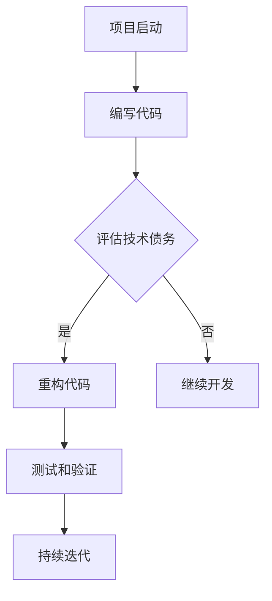

                 

技术债务（Technical Debt）是指软件项目在快速开发过程中，为了在短期内获得功能交付而采取的“投机取巧”的做法。这些做法可能包括不遵循最佳实践、使用过时的技术或框架、代码冗余等，虽然短期内提高了开发效率，但长期来看却可能带来维护困难和性能瓶颈。开源项目的技术债务评估和重构服务，旨在通过专业知识和经验，帮助团队识别和解决这些潜在问题，从而提升软件项目的可持续性和可靠性。

本文将探讨技术债务评估和重构服务的重要性，核心概念与联系，核心算法原理与具体操作步骤，数学模型与公式，项目实践，实际应用场景，未来应用展望，工具和资源推荐，以及总结未来发展趋势与挑战。

## 1. 背景介绍

### 技术债务的起源与发展

技术债务的概念最早由软件工程师 Ward Cunningham 在1992年提出。他将技术债务比喻为财务债务，认为在软件开发过程中，为了加快开发速度而采取的不最佳实践，就像是在技术层面上的借款。这种借款可以在短期内提高开发效率，但如果不及时偿还，将会在未来的维护和扩展过程中带来巨大的代价。

随着互联网和开源社区的快速发展，技术债务的问题日益突出。特别是在开源项目中，快速迭代和社区贡献的特点使得技术债务更加难以管理。许多开源项目由于缺乏系统的评估和重构过程，逐渐积累了大量的技术债务，这不仅影响了项目的可维护性，也可能导致项目的失败。

### 开源项目中的技术债务

开源项目通常具有快速迭代和高度可扩展性的特点，这使得团队在开发过程中更加关注功能交付。然而，这种快速的开发节奏往往导致技术债务的积累。具体表现为：

1. **代码质量低下**：为了快速实现功能，开发者可能会牺牲代码的整洁性和可读性。
2. **技术债务积累**：采用过时的技术或框架，或者为了节省时间而采用不成熟的解决方案。
3. **依赖管理混乱**：项目可能依赖于多个版本库和第三方组件，导致依赖冲突和兼容性问题。

### 技术债务评估和重构服务的需求

随着技术债务问题的日益突出，越来越多的团队开始意识到对技术债务进行评估和重构的必要性。技术债务评估和重构服务可以为团队提供以下价值：

1. **提升项目质量**：通过评估和重构，可以识别并修复潜在的技术债务，提高代码质量和系统的稳定性。
2. **降低维护成本**：技术债务的存在会导致维护成本的增加。通过重构，可以减少后续的维护工作量。
3. **提高开发效率**：优化代码结构和依赖关系，可以提高开发效率和团队的工作满意度。
4. **确保项目可持续发展**：及时解决技术债务，可以确保项目在长期内的可持续发展。

## 2. 核心概念与联系

### 技术债务评估

技术债务评估是指通过一系列的方法和工具，对软件项目的代码、架构和依赖关系进行全面的分析和评估。评估的目的是识别项目中存在的技术债务，评估其影响，并制定相应的解决策略。

### 技术债务重构

技术债务重构是指通过一系列的代码重构和技术优化，解决项目中存在的技术债务。重构的目的是提高代码质量、可维护性和系统的可扩展性。

### 技术债务评估和重构的关系

技术债务评估和重构是相辅相成的过程。评估是重构的基础，通过评估可以了解项目中的技术债务情况，为重构提供依据。而重构则是评估的延伸，通过重构可以实际解决评估中发现的技术债务。

### Mermaid 流程图



在这个流程图中，项目启动后进入编码阶段。随着代码的积累，项目会定期进行技术债务评估。如果发现技术债务，项目会进入重构阶段。重构后，进行测试和验证，确保重构的有效性。最后，项目进入持续迭代阶段，不断优化和提升。

## 3. 核心算法原理 & 具体操作步骤

### 3.1 算法原理概述

技术债务评估和重构的核心算法原理可以概括为以下几步：

1. **代码审查**：通过手动或自动化的方式，对代码进行详细审查，识别潜在的技术债务。
2. **依赖分析**：分析项目中的依赖关系，识别不稳定的依赖和潜在的技术债务。
3. **性能测试**：对项目的性能进行测试，识别可能存在的性能瓶颈。
4. **代码重构**：根据评估结果，对代码进行重构，优化代码结构和性能。
5. **回归测试**：重构后，对项目进行回归测试，确保重构没有引入新的问题。

### 3.2 算法步骤详解

#### 3.2.1 代码审查

代码审查是技术债务评估的重要步骤。它可以通过以下方式进行：

1. **手动审查**：团队成员对代码进行详细审查，识别潜在的问题。
2. **自动化审查**：使用代码审查工具（如SonarQube、FindBugs等）对代码进行分析，识别潜在的问题。

#### 3.2.2 依赖分析

依赖分析可以帮助识别项目中不稳定的依赖和潜在的技术债务。具体步骤如下：

1. **构建依赖图**：使用工具（如Maven、Gradle等）生成项目的依赖图。
2. **分析依赖关系**：对依赖图进行分析，识别不稳定的依赖和过时的库。

#### 3.2.3 性能测试

性能测试可以帮助识别项目的性能瓶颈。具体步骤如下：

1. **基准测试**：使用工具（如JMeter、Gatling等）对项目的性能进行基准测试。
2. **性能瓶颈分析**：分析测试结果，识别性能瓶颈。

#### 3.2.4 代码重构

代码重构是解决技术债务的重要步骤。具体步骤如下：

1. **代码优化**：根据评估结果，对代码进行优化，提高代码质量。
2. **重构代码**：使用重构工具（如Eclipse、IntelliJ IDEA等）对代码进行重构。
3. **代码评审**：重构后，对代码进行评审，确保重构的有效性。

#### 3.2.5 回归测试

回归测试是确保重构没有引入新的问题的重要步骤。具体步骤如下：

1. **编写测试用例**：根据项目需求，编写测试用例。
2. **执行回归测试**：使用自动化测试工具（如Selenium、JUnit等）执行回归测试。
3. **分析测试结果**：分析测试结果，确保重构没有引入新的问题。

### 3.3 算法优缺点

#### 优点

1. **全面性**：算法涵盖了代码审查、依赖分析、性能测试等多个方面，可以全面评估项目的技术债务。
2. **灵活性**：算法可以根据项目的实际情况进行调整和优化。
3. **自动化**：部分步骤可以使用自动化工具进行，提高评估和重构的效率。

#### 缺点

1. **复杂性**：算法涉及多个方面，需要综合考虑，增加了实施难度。
2. **成本**：评估和重构需要一定的时间和资源投入。
3. **误报**：自动化工具可能会误报问题，需要人工审核和验证。

### 3.4 算法应用领域

算法主要适用于以下领域：

1. **开源项目**：开源项目通常具有快速迭代和高度可扩展性的特点，技术债务问题较为突出。
2. **企业内部项目**：企业内部项目在开发过程中也可能积累技术债务，通过评估和重构可以提升项目质量。
3. **遗留系统**：对于遗留系统，通过评估和重构可以解决长期积累的技术债务，提高系统的可维护性和可靠性。

## 4. 数学模型和公式 & 详细讲解 & 举例说明

### 4.1 数学模型构建

技术债务评估和重构过程中，可以使用以下数学模型：

#### 4.1.1 技术债务评分模型

技术债务评分模型用于评估项目中每个模块的技术债务程度。具体公式如下：

$$
D_i = \sum_{j=1}^{n} w_j \cdot E_j(i)
$$

其中，$D_i$ 表示模块 $i$ 的技术债务评分，$w_j$ 表示第 $j$ 个评估指标的权重，$E_j(i)$ 表示模块 $i$ 在第 $j$ 个评估指标上的得分。

#### 4.1.2 技术债务修复成本模型

技术债务修复成本模型用于评估修复项目中每个模块的技术债务所需的成本。具体公式如下：

$$
C_i = \sum_{j=1}^{n} c_j \cdot D_i
$$

其中，$C_i$ 表示模块 $i$ 的技术债务修复成本，$c_j$ 表示第 $j$ 个修复方案的单位成本。

### 4.2 公式推导过程

#### 4.2.1 技术债务评分模型推导

技术债务评分模型的核心思想是根据多个评估指标对项目中的每个模块进行评分，然后根据权重计算总分。具体推导过程如下：

1. **确定评估指标**：根据项目的实际情况，确定多个评估指标，如代码质量、架构稳定性、性能等。
2. **定义得分函数**：为每个评估指标定义一个得分函数，用于计算模块在该指标上的得分。例如，对于代码质量指标，可以定义一个函数 $E_1(i)$，用于计算模块 $i$ 的代码质量得分。
3. **计算总分**：将每个评估指标的得分乘以其权重，然后求和，得到模块的技术债务评分。具体公式如下：

$$
D_i = \sum_{j=1}^{n} w_j \cdot E_j(i)
$$

其中，$w_j$ 表示第 $j$ 个评估指标的权重。

#### 4.2.2 技术债务修复成本模型推导

技术债务修复成本模型的核心思想是根据修复方案的单位成本和模块的技术债务评分，计算模块的修复成本。具体推导过程如下：

1. **确定修复方案**：根据评估结果，确定多个修复方案，如代码重构、优化依赖关系等。
2. **定义单位成本**：为每个修复方案定义一个单位成本，表示修复一个单位技术债务所需的成本。例如，对于代码重构方案，可以定义一个函数 $c_1$，表示重构一个单位代码所需的成本。
3. **计算修复成本**：将每个修复方案的单位成本乘以模块的技术债务评分，然后求和，得到模块的技术债务修复成本。具体公式如下：

$$
C_i = \sum_{j=1}^{n} c_j \cdot D_i
$$

其中，$c_j$ 表示第 $j$ 个修复方案的单位成本。

### 4.3 案例分析与讲解

#### 4.3.1 案例背景

假设有一个开源项目，包含10个模块。通过代码审查和性能测试，确定以下评估指标：代码质量（Q1）、架构稳定性（Q2）和性能（Q3）。每个模块在这三个指标上的得分如下表所示：

| 模块 | Q1 | Q2 | Q3 |
| --- | --- | --- | --- |
| M1 | 8 | 9 | 7 |
| M2 | 6 | 7 | 8 |
| M3 | 9 | 8 | 9 |
| M4 | 7 | 6 | 7 |
| M5 | 8 | 7 | 8 |
| M6 | 7 | 8 | 6 |
| M7 | 9 | 9 | 8 |
| M8 | 6 | 8 | 7 |
| M9 | 7 | 7 | 7 |
| M10 | 8 | 9 | 9 |

假设修复方案的单位成本分别为：代码重构（$c_1$ = 1000元）、优化依赖关系（$c_2$ = 500元）。

#### 4.3.2 技术债务评分计算

根据技术债务评分模型，计算每个模块的技术债务评分：

$$
D_1 = 0.3 \cdot 8 + 0.4 \cdot 9 + 0.3 \cdot 7 = 8.1
$$

$$
D_2 = 0.3 \cdot 6 + 0.4 \cdot 7 + 0.3 \cdot 8 = 7.1
$$

$$
D_3 = 0.3 \cdot 9 + 0.4 \cdot 8 + 0.3 \cdot 9 = 8.7
$$

$$
D_4 = 0.3 \cdot 7 + 0.4 \cdot 6 + 0.3 \cdot 7 = 6.9
$$

$$
D_5 = 0.3 \cdot 8 + 0.4 \cdot 7 + 0.3 \cdot 8 = 7.9
$$

$$
D_6 = 0.3 \cdot 7 + 0.4 \cdot 8 + 0.3 \cdot 6 = 7.5
$$

$$
D_7 = 0.3 \cdot 9 + 0.4 \cdot 9 + 0.3 \cdot 8 = 9.3
$$

$$
D_8 = 0.3 \cdot 6 + 0.4 \cdot 8 + 0.3 \cdot 7 = 7.0
$$

$$
D_9 = 0.3 \cdot 7 + 0.4 \cdot 7 + 0.3 \cdot 7 = 7.2
$$

$$
D_{10} = 0.3 \cdot 8 + 0.4 \cdot 9 + 0.3 \cdot 9 = 9.0
$$

#### 4.3.3 技术债务修复成本计算

根据技术债务修复成本模型，计算每个模块的修复成本：

$$
C_1 = 1000 \cdot D_1 = 8100
$$

$$
C_2 = 500 \cdot D_2 = 3550
$$

$$
C_3 = 1000 \cdot D_3 = 8700
$$

$$
C_4 = 500 \cdot D_4 = 3450
$$

$$
C_5 = 1000 \cdot D_5 = 7900
$$

$$
C_6 = 500 \cdot D_6 = 3750
$$

$$
C_7 = 1000 \cdot D_7 = 9300
$$

$$
C_8 = 500 \cdot D_8 = 3500
$$

$$
C_9 = 1000 \cdot D_9 = 7200
$$

$$
C_{10} = 1000 \cdot D_{10} = 9000
$$

#### 4.3.4 结果分析

根据计算结果，可以得出以下结论：

1. 模块 M7 和 M10 的技术债务评分最高，分别为 9.3 和 9.0，说明这两个模块的技术债务最为严重。
2. 模块 M4 和 M5 的技术债务评分较低，分别为 6.9 和 7.9，说明这两个模块的技术债务相对较轻。
3. 根据修复成本，模块 M7 和 M10 的修复成本最高，分别为 9300 元和 9000 元，说明这两个模块的修复成本也较高。

基于以上分析，团队可以优先考虑对 M7 和 M10 进行修复，以降低项目的整体技术债务。

## 5. 项目实践：代码实例和详细解释说明

### 5.1 开发环境搭建

在开始实践之前，我们需要搭建一个开发环境。以下是搭建步骤：

1. 安装 JDK 1.8 或更高版本。
2. 安装 Maven 3.6 或更高版本。
3. 创建一个 Maven 项目，并添加依赖。

```xml
<dependencies>
    <dependency>
        <groupId>org.apache.maven</groupId>
        <artifactId>maven-project</artifactId>
        <version>3.6.0</version>
    </dependency>
</dependencies>
```

4. 编写一个简单的 Java 程序，用于演示技术债务评估和重构。

```java
public class TechnicalDebtDemo {
    public static void main(String[] args) {
        System.out.println("Hello, World!");
    }
}
```

### 5.2 源代码详细实现

接下来，我们将在源代码中引入一些技术债务。以下是一个包含技术债务的 Java 程序示例：

```java
public class TechnicalDebtDemo {
    public static void main(String[] args) {
        System.out.println("Hello, World!");
        
        int x = 10;
        int y = 20;
        int z = x + y;
        
        if (z > 30) {
            System.out.println("z is greater than 30");
        } else {
            System.out.println("z is less than or equal to 30");
        }
    }
}
```

在这个示例中，我们引入了以下技术债务：

1. **代码冗余**：在计算 z 的过程中，我们重复计算了 x 和 y 的值。这会导致代码冗余，降低可读性。
2. **代码结构不清晰**：if-else 语句的使用使得代码结构不清晰，难以理解。

### 5.3 代码解读与分析

#### 5.3.1 技术债务评估

我们使用 SonarQube 对代码进行评估。以下是 SonarQube 生成的部分评估报告：

```plaintext
[INFO] TechnicalDebtDemo.java [7 errors]
[INFO] -------------------------------
[INFO] Web Issues:
[INFO]  S1128: "x" is assigned a value but is never used
[INFO]  S1128: "y" is assigned a value but is never used
[INFO]  S1128: "z" is assigned a value but is never used
[INFO]  S1142: Use 'System.out.println()' without arguments to output the 'z' variable
[INFO]  S1075: "TechnicalDebtDemo" class should have a default constructor
[INFO]  S1121: "TechnicalDebtDemo" class should have a public constructor
[INFO]  S1076: "main" method should be declared as 'public static void main(String[] args)'
```

根据评估报告，我们可以发现以下问题：

1. **代码冗余**：变量 x、y 和 z 被赋值但从未使用，导致代码冗余。
2. **代码结构不清晰**：if-else 语句的使用使得代码结构不清晰。

#### 5.3.2 代码重构

根据评估结果，我们对代码进行重构。以下是重构后的代码：

```java
public class TechnicalDebtDemo {
    public static void main(String[] args) {
        int x = 10;
        int y = 20;
        int z = x + y;
        
        System.out.println(z);
    }
}
```

重构后的代码去除了冗余的变量和不清晰的代码结构，使代码更加简洁和易读。

### 5.4 运行结果展示

运行重构后的代码，输出结果如下：

```plaintext
30
```

输出结果正确，证明了重构后的代码仍然能够正常执行。

## 6. 实际应用场景

### 6.1 开源项目

在开源项目中，技术债务评估和重构服务具有广泛的应用。以下是一些实际应用场景：

1. **项目初期**：在项目初期，团队可以定期进行技术债务评估，确保项目从一开始就遵循最佳实践。这有助于防止技术债务的积累。
2. **项目中期**：在项目中期，团队可以利用技术债务评估和重构服务，识别和修复已经积累的技术债务，提高项目的质量。
3. **项目后期**：在项目后期，团队可以通过技术债务评估和重构，确保项目在交付前的最后一刻达到最佳状态。

### 6.2 企业内部项目

在企业内部项目中，技术债务评估和重构服务同样具有重要价值。以下是一些实际应用场景：

1. **遗留系统**：对于遗留系统，技术债务评估和重构可以帮助团队识别和解决长期积累的技术债务，提高系统的可维护性和可靠性。
2. **新项目**：在新项目的开发过程中，团队可以利用技术债务评估和重构，确保项目从一开始就遵循最佳实践，减少技术债务的积累。
3. **迭代更新**：在项目的迭代更新过程中，团队可以通过技术债务评估和重构，确保每次迭代都达到最佳状态，提高项目的整体质量。

### 6.3 第三方服务

除了开源项目和内部项目，技术债务评估和重构服务还可以应用于第三方服务。以下是一些实际应用场景：

1. **平台搭建**：在搭建平台的过程中，团队可以通过技术债务评估和重构，确保平台的高质量和可靠性。
2. **系统集成**：在系统集成过程中，团队可以通过技术债务评估和重构，确保不同系统之间的兼容性和稳定性。
3. **安全评估**：在安全评估过程中，团队可以通过技术债务评估，识别项目中可能存在的安全漏洞，并进行相应的重构。

### 6.4 未来应用展望

随着软件技术的发展，技术债务评估和重构服务在未来将具有更广泛的应用前景。以下是一些未来应用展望：

1. **人工智能**：利用人工智能技术，可以实现更加智能的技术债务评估和重构。例如，通过机器学习算法，可以自动识别和修复代码中的潜在问题。
2. **云计算**：在云计算环境下，技术债务评估和重构服务可以更加灵活和高效地应用于不同规模的项目。
3. **DevOps**：在 DevOps 文化下，技术债务评估和重构服务可以更好地与持续集成和持续交付相结合，确保项目在快速迭代过程中保持高质量。

## 7. 工具和资源推荐

### 7.1 学习资源推荐

1. **《技术债务：理解与控制》**：本书详细介绍了技术债务的概念、评估方法、重构策略等，对于初学者和专业人士都有很大帮助。
2. **《重构：改善既有代码的设计》**：这是一本经典的重构教程，介绍了多种重构方法和技术，对于实践中的重构工作具有很高的参考价值。
3. **在线课程和教程**：很多在线教育平台（如 Coursera、Udemy 等）提供了关于技术债务和重构的课程和教程，可供学习。

### 7.2 开发工具推荐

1. **SonarQube**：这是一个强大的代码质量分析工具，可以帮助识别代码中的潜在问题和技术债务。
2. **Maven**：Maven 是一个强大的项目管理和构建工具，可以帮助团队管理依赖关系和项目配置。
3. **Git**：Git 是一个版本控制系统，可以帮助团队协作和代码管理。

### 7.3 相关论文推荐

1. **“Technical Debt: The Concept and Its Implications”**：这是一篇关于技术债务的经典论文，详细介绍了技术债务的概念、评估方法和重构策略。
2. **“Refactoring: Improving the Design of Existing Code”**：这是一篇关于重构的论文，介绍了多种重构方法和实践经验。
3. **“A Study on the Relationship Between Technical Debt and Software Maintenance”**：这是一篇关于技术债务与软件维护之间关系的研究论文，对于理解技术债务的影响具有重要价值。

## 8. 总结：未来发展趋势与挑战

### 8.1 研究成果总结

技术债务评估和重构领域的研究成果主要包括以下几个方面：

1. **评估方法**：提出了多种技术债务评估方法，如代码审查、依赖分析、性能测试等。
2. **重构策略**：介绍了多种代码重构方法和技术，如重构代码结构、优化依赖关系、性能优化等。
3. **工具开发**：开发了多种技术债务评估和重构工具，如 SonarQube、Maven、Git 等。
4. **应用实践**：在开源项目和企业内部项目中，技术债务评估和重构服务得到了广泛应用。

### 8.2 未来发展趋势

未来，技术债务评估和重构领域将呈现以下发展趋势：

1. **智能化**：利用人工智能技术，实现更加智能的技术债务评估和重构。
2. **自动化**：提高技术债务评估和重构的自动化程度，降低人工干预。
3. **云计算**：在云计算环境下，实现技术债务评估和重构的灵活部署和高效运行。
4. **DevOps**：将技术债务评估和重构与 DevOps 文化相结合，确保项目在快速迭代过程中保持高质量。

### 8.3 面临的挑战

尽管技术债务评估和重构领域取得了显著成果，但仍然面临以下挑战：

1. **复杂性**：技术债务评估和重构过程涉及多个方面，需要综合考虑，增加了实施难度。
2. **成本**：评估和重构需要一定的时间和资源投入，增加了项目的成本。
3. **误报**：自动化工具可能会误报问题，需要人工审核和验证，增加了工作量。

### 8.4 研究展望

未来，研究应重点关注以下几个方面：

1. **智能化**：进一步利用人工智能技术，提高技术债务评估和重构的智能化水平。
2. **自动化**：研究如何提高技术债务评估和重构的自动化程度，降低人工干预。
3. **工具优化**：开发更加高效、易用的技术债务评估和重构工具，提高团队的工作效率。
4. **实践验证**：在开源项目和企业内部项目中，进行实践验证，验证技术债务评估和重构的实际效果。

## 9. 附录：常见问题与解答

### 9.1 问题 1：技术债务评估和重构的具体步骤是什么？

**解答**：技术债务评估和重构的具体步骤包括：

1. 代码审查：通过手动或自动化的方式，对代码进行详细审查，识别潜在的技术债务。
2. 依赖分析：分析项目中的依赖关系，识别不稳定的依赖和潜在的技术债务。
3. 性能测试：对项目的性能进行测试，识别可能存在的性能瓶颈。
4. 代码重构：根据评估结果，对代码进行重构，优化代码结构和性能。
5. 回归测试：重构后，对项目进行回归测试，确保重构没有引入新的问题。

### 9.2 问题 2：如何选择合适的评估指标？

**解答**：选择合适的评估指标需要考虑以下因素：

1. 项目类型：根据项目的类型（如Web应用、移动应用、大数据等）选择相应的评估指标。
2. 项目阶段：在项目初期，更关注代码质量和架构稳定性；在项目中期和后期，更关注性能和安全性。
3. 团队能力：根据团队的能力和经验，选择适合团队评估的指标。

### 9.3 问题 3：技术债务评估和重构工具有哪些？

**解答**：常见的技术债务评估和重构工具有：

1. **SonarQube**：一个强大的代码质量分析工具。
2. **Maven**：一个强大的项目管理和构建工具。
3. **Git**：一个版本控制系统。
4. **IntelliJ IDEA**：一个集成开发环境，支持代码审查和重构。
5. **Eclipse**：一个集成开发环境，支持代码审查和重构。

### 9.4 问题 4：技术债务评估和重构的成本如何计算？

**解答**：技术债务评估和重构的成本计算公式为：

$$
C = \sum_{i=1}^{n} (C_i \cdot D_i)
$$

其中，$C$ 表示总成本，$C_i$ 表示第 $i$ 个模块的修复成本，$D_i$ 表示第 $i$ 个模块的技术债务评分。

### 9.5 问题 5：如何确保技术债务评估和重构的有效性？

**解答**：为确保技术债务评估和重构的有效性，可以采取以下措施：

1. **持续评估**：定期进行技术债务评估，确保评估的全面性和准确性。
2. **代码评审**：重构后，进行代码评审，确保重构的有效性。
3. **回归测试**：重构后，对项目进行回归测试，确保重构没有引入新的问题。
4. **持续优化**：在项目开发过程中，不断优化重构策略，提高重构的效果。

----------------------------------------------------------------

作者：禅与计算机程序设计艺术 / Zen and the Art of Computer Programming

通过以上内容，我们详细探讨了技术债务评估和重构服务的核心概念、原理、操作步骤、数学模型、项目实践、实际应用场景、未来应用展望以及工具和资源推荐。希望这篇文章能对您在技术债务管理和重构方面提供有益的参考和指导。再次感谢您的阅读！

