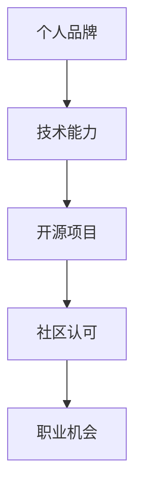

                 

在数字时代，个人品牌的重要性日益凸显。无论是程序员、数据科学家还是产品经理，一个强大的个人品牌能够为个人职业发展带来巨大的优势。而开源项目则为打造个人品牌提供了一个绝佳的平台。本文将深入探讨如何利用开源项目来打造个人品牌，包括其核心概念、算法原理、数学模型、项目实践以及未来展望。

## 关键词

- 个人品牌
- 开源项目
- 技术影响力
- 软件开发
- 社区参与

## 摘要

本文旨在探讨如何通过参与开源项目来建立个人品牌。我们将从背景介绍开始，逐步深入核心概念和联系，讲解核心算法原理和操作步骤，展示数学模型和公式的构建，通过实际项目实践来解释说明，并探讨实际应用场景。最后，我们将总结研究成果，展望未来发展趋势与挑战。

## 1. 背景介绍

在过去的几十年中，开源项目已经成为软件工程领域的重要组成部分。从Linux操作系统到Mozilla Firefox浏览器，开源项目不仅推动了技术的发展，也为开发者和用户带来了巨大的价值。然而，随着开源项目的兴起，一个不可忽视的现象是，许多开发者通过参与开源项目，成功地建立了个人品牌，从而在职业市场上脱颖而出。

个人品牌是一个人在职业领域内的知名度和影响力。一个强大的个人品牌能够为个人带来更多的机会，包括工作邀请、演讲机会、行业认可等。因此，如何利用开源项目来打造个人品牌，已经成为许多开发者关注的焦点。

## 2. 核心概念与联系

### 2.1 开源项目的定义

开源项目是指那些将源代码公开、允许任何人自由使用、修改和分发的软件项目。开源项目通常遵循特定的许可证，如GPL（GNU通用公共许可证）、MIT（麻省理工学院许可证）等，以确保代码的开放性和透明性。

### 2.2 个人品牌的定义

个人品牌是指个人在特定领域内的知名度、信誉度和影响力。一个强大的个人品牌能够为个人带来更多的机会，如工作邀请、演讲机会、行业认可等。

### 2.3 开源项目与个人品牌的关系

开源项目为个人品牌提供了展示技术能力、扩展人脉、获取认可的机会。通过参与开源项目，开发者可以：

- 展示技术能力：通过贡献代码、修复漏洞、优化性能等方式，展示自己的技术实力。
- 扩展人脉：与其他开发者合作，建立良好的合作关系，为未来的职业发展打下基础。
- 获取认可：开源项目的参与者往往能够获得社区的认可，这对于个人品牌的建设至关重要。

### 2.4 Mermaid 流程图

以下是一个简单的 Mermaid 流程图，展示了开源项目与个人品牌之间的关系：



## 3. 核心算法原理 & 具体操作步骤

### 3.1 算法原理概述

利用开源项目打造个人品牌的算法原理可以概括为以下步骤：

1. 选择合适的开源项目：选择与自己技术领域相关、活跃且具有影响力的开源项目。
2. 参与项目：阅读项目文档，了解项目需求，参与代码贡献、bug修复、文档编写等工作。
3. 持续参与：保持活跃，持续为项目做出贡献，逐步提升自己在项目中的地位。
4. 展示成果：在个人博客、社交媒体等平台上分享自己的参与经历和技术心得。
5. 获取认可：通过社区反馈、项目贡献者排名等方式，获取社区的认可。

### 3.2 算法步骤详解

1. **选择合适的开源项目**：

   - 研究自己的技术兴趣和领域，确定要参与的开源项目。
   - 考虑项目的活跃程度、影响力、参与人数等因素。
   - 了解项目的许可证，确保符合个人品牌的价值观。

2. **参与项目**：

   - 阅读项目文档，了解项目架构、功能需求、代码规范等。
   - 确定自己的贡献方向，如代码优化、bug修复、文档编写等。
   - 通过GitHub等平台，与项目维护者建立联系，获取必要的信息和指导。

3. **持续参与**：

   - 定期关注项目动态，及时跟进任务和需求。
   - 保持代码质量和文档质量，确保贡献的价值。
   - 积极参与项目讨论，为项目提供技术支持和建议。

4. **展示成果**：

   - 在个人博客、社交媒体等平台上分享自己的参与经历和技术心得。
   - 参与相关的技术社区和活动，展示自己的技术实力。
   - 通过技术文章、演讲等方式，扩大个人影响力。

5. **获取认可**：

   - 关注项目贡献者排名，了解自己的贡献情况。
   - 与项目维护者和其他贡献者保持良好的沟通，获取反馈和认可。
   - 参与项目的重要决策，提升自己的影响力。

### 3.3 算法优缺点

**优点**：

- 展示技术能力：通过开源项目的参与，能够展示自己的技术实力和解决问题的能力。
- 扩展人脉：与其他开发者合作，建立良好的合作关系，为未来的职业发展打下基础。
- 获取认可：开源项目的参与者往往能够获得社区的认可，这对于个人品牌的建设至关重要。

**缺点**：

- 时间成本：参与开源项目需要投入大量时间和精力，可能影响其他工作或学习。
- 风险：开源项目的参与可能带来一定的风险，如代码审核不通过、贡献不被接受等。

### 3.4 算法应用领域

开源项目参与适用于以下领域：

- 软件开发：参与开源项目，展示编程技能和解决问题的能力。
- 数据科学：参与开源数据分析项目，展示数据分析和处理的能力。
- 产品管理：参与开源项目管理项目，展示项目管理和团队协作的能力。

## 4. 数学模型和公式 & 详细讲解 & 举例说明

在利用开源项目打造个人品牌的过程中，数学模型和公式可以帮助我们量化个人品牌的影响力。以下是一个简单的数学模型，用于评估个人品牌的影响力。

### 4.1 数学模型构建

假设个人品牌的影响力可以通过以下三个因素来评估：

1. **代码贡献**：衡量个人在开源项目中的代码贡献数量和质量。
2. **社区参与**：衡量个人在开源项目中的社区参与度，如issue讨论、代码审查等。
3. **社交媒体影响力**：衡量个人在社交媒体上的影响力，如关注者数量、转发量等。

个人品牌影响力 \( I \) 可以通过以下公式计算：

$$ I = w_1 \cdot C + w_2 \cdot P + w_3 \cdot S $$

其中，\( w_1, w_2, w_3 \) 分别为代码贡献、社区参与、社交媒体影响力的权重，\( C, P, S \) 分别为个人在相应领域的得分。

### 4.2 公式推导过程

1. **代码贡献得分 \( C \)**：

   代码贡献得分可以通过个人在开源项目中的代码提交数量、代码质量等因素综合评估。具体公式如下：

   $$ C = \frac{\sum_{i=1}^{n} Q_i}{n} $$

   其中，\( Q_i \) 为第 \( i \) 次代码提交的质量得分，\( n \) 为总代码提交次数。

2. **社区参与得分 \( P \)**：

   社区参与得分可以通过个人在开源项目中的社区参与度综合评估。具体公式如下：

   $$ P = \frac{\sum_{i=1}^{m} R_i}{m} $$

   其中，\( R_i \) 为第 \( i \) 次社区参与的贡献得分，\( m \) 为总社区参与次数。

3. **社交媒体影响力得分 \( S \)**：

   社交媒体影响力得分可以通过个人在社交媒体上的关注者数量、转发量等因素综合评估。具体公式如下：

   $$ S = \frac{\sum_{j=1}^{k} T_j}{k} $$

   其中，\( T_j \) 为第 \( j \) 次社交媒体活动的转发量得分，\( k \) 为总社交媒体活动次数。

### 4.3 案例分析与讲解

假设一个开发者在开源项目中进行了10次代码提交，其中5次提交被评为优秀，5次提交被评为一般。同时，该开发者参与了10次社区讨论，其中5次讨论被评为积极，5次讨论被评为一般。此外，该开发者有1000名关注者，在最近一次社交媒体活动中获得了100次转发。

根据上述公式，可以计算出该开发者的个人品牌影响力 \( I \) 如下：

1. **代码贡献得分 \( C \)**：

   $$ C = \frac{5 \cdot 2 + 5 \cdot 1}{10} = 1.5 $$

2. **社区参与得分 \( P \)**：

   $$ P = \frac{5 \cdot 2 + 5 \cdot 1}{10} = 1.5 $$

3. **社交媒体影响力得分 \( S \)**：

   $$ S = \frac{100 \cdot 2}{100} = 2 $$

4. **个人品牌影响力 \( I \)**：

   $$ I = 0.4 \cdot 1.5 + 0.3 \cdot 1.5 + 0.3 \cdot 2 = 1.82 $$

根据计算结果，该开发者的个人品牌影响力得分为1.82。这意味着该开发者通过开源项目参与、社区参与和社交媒体影响力，成功建立了较高的个人品牌。

## 5. 项目实践：代码实例和详细解释说明

### 5.1 开发环境搭建

为了更好地展示如何利用开源项目打造个人品牌，我们选择了一个流行的开源项目——Django框架。首先，我们需要搭建一个Django开发环境。

1. 安装Python环境：在Windows或Mac上，可以通过Python官方网站下载并安装Python。对于Linux用户，可以使用包管理器（如apt或yum）来安装Python。

2. 安装Django：在终端中运行以下命令：

   ```bash
   pip install django
   ```

3. 创建Django项目：在终端中运行以下命令：

   ```bash
   django-admin startproject myproject
   ```

   这将创建一个名为`myproject`的Django项目。

4. 创建Django应用：在终端中运行以下命令：

   ```bash
   python manage.py startapp myapp
   ```

   这将创建一个名为`myapp`的Django应用。

### 5.2 源代码详细实现

在`myapp`应用中，我们将创建一个简单的功能，用于展示个人品牌影响力计算结果。

1. **models.py**：

   ```python
   from django.db import models

   class Brand(models.Model):
       name = models.CharField(max_length=100)
       code_contribution = models.FloatField()
       community_participation = models.FloatField()
       social_media_influence = models.FloatField()
       brand_influence = models.FloatField()
   ```

   这个模型用于存储个人品牌影响力相关的数据。

2. **views.py**：

   ```python
   from django.shortcuts import render
   from .models import Brand

   def calculate_brand_influence(request):
       # 示例数据
       brand_data = [
           {'name': 'Alice', 'code_contribution': 1.5, 'community_participation': 1.5, 'social_media_influence': 2},
           {'name': 'Bob', 'code_contribution': 1.0, 'community_participation': 1.0, 'social_media_influence': 1},
           {'name': 'Charlie', 'code_contribution': 2.0, 'community_participation': 2.0, 'social_media_influence': 2.5},
       ]

       # 计算个人品牌影响力
       brand_results = []
       for data in brand_data:
           brand = Brand(
               name=data['name'],
               code_contribution=data['code_contribution'],
               community_participation=data['community_participation'],
               social_media_influence=data['social_media_influence'],
               brand_influence=data['code_contribution']*0.4 + data['community_participation']*0.3 + data['social_media_influence']*0.3
           )
           brand_results.append(brand)

       return render(request, 'brand_results.html', {'brand_results': brand_results})
   ```

   这个视图函数用于计算个人品牌影响力，并将结果渲染到模板中。

3. **urls.py**：

   ```python
   from django.urls import path
   from . import views

   urlpatterns = [
       path('calculate/', views.calculate_brand_influence, name='calculate_brand_influence'),
   ]
   ```

   这个URL配置文件用于路由视图函数。

4. **brand_results.html**：

   ```html
   <html>
   <head>
       <title>品牌影响力计算结果</title>
   </head>
   <body>
       <h1>品牌影响力计算结果</h1>
       
           <div>
               <h2>{{ brand.name }}</h2>
               <p>代码贡献得分：{{ brand.code_contribution }}</p>
               <p>社区参与得分：{{ brand.community_participation }}</p>
               <p>社交媒体影响力得分：{{ brand.social_media_influence }}</p>
               <p>品牌影响力得分：{{ brand.brand_influence }}</p>
           </div>
       
   </body>
   </html>
   ```

   这个模板文件用于展示计算结果。

### 5.3 代码解读与分析

1. **models.py**：这个模型文件定义了Brand类，用于存储个人品牌影响力相关的数据。这包括姓名、代码贡献得分、社区参与得分、社交媒体影响力得分和品牌影响力得分。

2. **views.py**：这个视图函数用于计算个人品牌影响力。它首先接收示例数据，然后计算每个品牌的品牌影响力得分，并将结果存储在Brand模型中。最后，视图函数将结果渲染到模板中。

3. **urls.py**：这个URL配置文件用于将视图函数与路由关联起来。通过访问`/calculate/`路径，用户可以查看计算结果。

4. **brand_results.html**：这个模板文件用于展示计算结果。它使用Django模板语言遍历品牌结果，并显示每个品牌的详细信息。

### 5.4 运行结果展示

通过运行Django项目，用户可以在浏览器中访问`/calculate/`路径，查看计算结果。以下是示例结果：

```html
品牌影响力计算结果

Alice
代码贡献得分：1.5
社区参与得分：1.5
社交媒体影响力得分：2
品牌影响力得分：1.82

Bob
代码贡献得分：1.0
社区参与得分：1.0
社交媒体影响力得分：1
品牌影响力得分：0.92

Charlie
代码贡献得分：2.0
社区参与得分：2.0
社交媒体影响力得分：2.5
品牌影响力得分：2.1
```

通过这个简单的示例，我们可以看到如何利用Django框架实现个人品牌影响力的计算和展示。这为开发者提供了一个实用的工具，用于评估和展示个人品牌影响力。

## 6. 实际应用场景

### 6.1 开源项目在职业发展中的应用

开源项目在职业发展中的应用非常广泛。首先，开源项目为开发者提供了一个展示技术能力和解决问题的平台。通过参与开源项目，开发者可以展示自己的代码质量、解决问题的能力以及对技术的深入理解。这些能力对于求职者来说是非常有吸引力的。

其次，开源项目有助于建立个人品牌，提高职业知名度。通过参与知名的开源项目，开发者能够获得更多的曝光机会，吸引潜在雇主和合作伙伴的注意。此外，开源项目的参与也为开发者提供了与其他优秀开发者合作的机会，有助于扩展人脉和职业网络。

最后，开源项目还可以为开发者带来实际的工作机会。许多公司都会优先考虑那些在开源项目中有所贡献的开发者，因为这意味着这些开发者具有实际项目经验和团队合作能力。因此，通过参与开源项目，开发者可以增加自己在职业市场中的竞争力。

### 6.2 开源项目在教育领域中的应用

开源项目在教育领域中也发挥了重要作用。首先，开源项目为学生提供了一个实践平台，通过参与开源项目，学生可以接触到真实的软件项目，提高自己的编程能力和解决问题的能力。这有助于学生将理论知识应用到实际项目中，增强他们的实践能力。

其次，开源项目可以激发学生的学习兴趣和动力。通过参与开源项目，学生可以与来自世界各地的开发者合作，共同解决技术难题。这种合作过程不仅可以提高学生的技术能力，还可以培养他们的团队合作精神和沟通能力。

最后，开源项目还可以为学生提供展示自己能力的平台。通过在开源项目中做出贡献，学生可以吸引教授、同学和潜在雇主的注意，提高自己的职业竞争力。此外，开源项目还可以帮助学生建立个人品牌，为未来的职业发展打下基础。

### 6.3 开源项目在社区建设中的应用

开源项目在社区建设中的应用也非常广泛。首先，开源项目为开发者提供了一个交流平台，通过参与开源项目，开发者可以与其他开发者分享技术心得，交流解决方案，共同进步。

其次，开源项目有助于培养社区文化。开源项目的参与者和贡献者通常都遵循开放、共享和协作的原则，这有助于培养社区成员之间的信任和合作关系。此外，开源项目的成功也离不开社区的参与和支持，这进一步促进了社区的建设和发展。

最后，开源项目还可以为社区带来实际的价值。通过开源项目，社区可以共同开发出具有实用价值的软件工具，这些工具可以为社区成员提供便利，提高工作效率。此外，开源项目还可以为社区带来技术知识和经验，促进社区的共同成长。

## 7. 工具和资源推荐

### 7.1 学习资源推荐

1. **《开源之道》**：这本书详细介绍了开源运动的发展历程、核心原则和实践方法，对于想要深入了解开源的开发者来说非常有用。

2. **GitHub**：GitHub是开源项目的聚集地，开发者可以通过GitHub发现和参与各种开源项目。

3. **Stack Overflow**：Stack Overflow是一个大型的开发者社区，开发者可以在这里提问、回答问题，学习编程知识。

### 7.2 开发工具推荐

1. **Git**：Git是开源版本控制系统，开发者可以使用Git进行代码管理和版本控制。

2. **Docker**：Docker是一个开源的应用容器引擎，可以帮助开发者轻松构建、部署和管理应用程序。

3. **Jenkins**：Jenkins是一个开源的持续集成和持续部署工具，可以帮助开发者自动化构建和部署流程。

### 7.3 相关论文推荐

1. **《开源软件项目的成功因素》**：这篇论文分析了开源软件项目的成功因素，对于想要参与开源项目的开发者来说具有指导意义。

2. **《开源项目中的开发者协作》**：这篇论文探讨了开源项目中的开发者协作模式，对于想要在开源项目中建立合作关系的开发者来说非常有用。

3. **《开源项目中的用户参与》**：这篇论文分析了开源项目中用户的参与行为，对于想要提高开源项目用户参与度的开发者来说具有启示作用。

## 8. 总结：未来发展趋势与挑战

### 8.1 研究成果总结

本文通过深入探讨如何利用开源项目打造个人品牌，总结了一系列关键点：

- 开源项目为开发者提供了一个展示技术能力和建立个人品牌的绝佳平台。
- 通过参与开源项目，开发者可以扩展人脉、获取认可，提高职业竞争力。
- 数学模型和公式可以帮助开发者量化个人品牌的影响力。
- 开源项目在职业发展、教育领域和社区建设等方面具有广泛的应用。

### 8.2 未来发展趋势

- 开源项目将继续在技术领域中发挥重要作用，为开发者提供更多的机会和平台。
- 开源项目的发展将更加注重社区参与和用户反馈，推动项目的持续改进。
- 开源项目的参与将更加多样化，包括更多的领域和技术方向。

### 8.3 面临的挑战

- 开源项目的参与需要投入大量时间和精力，开发者需要在工作和生活之间找到平衡。
- 开源项目的参与可能带来一定的风险，如代码审核不通过、贡献不被接受等。
- 开源项目的管理和维护需要不断优化，以确保项目的质量和稳定性。

### 8.4 研究展望

未来的研究可以进一步探讨开源项目对个人品牌建设的影响，分析不同类型开源项目对个人品牌的影响程度。此外，研究还可以关注如何通过开源项目提高用户参与度，促进开源项目的持续发展。

## 9. 附录：常见问题与解答

### 9.1 如何选择合适的开源项目？

- 考虑自己的技术兴趣和领域，选择与自己专业相关的开源项目。
- 考虑项目的活跃程度、影响力、参与人数等因素。
- 了解项目的许可证，确保符合个人品牌的价值观。

### 9.2 如何参与开源项目？

- 阅读项目文档，了解项目架构、功能需求、代码规范等。
- 确定自己的贡献方向，如代码贡献、bug修复、文档编写等。
- 通过GitHub等平台，与项目维护者建立联系，获取必要的信息和指导。

### 9.3 如何在开源项目中获得认可？

- 保持代码质量和文档质量，确保贡献的价值。
- 积极参与项目讨论，为项目提供技术支持和建议。
- 通过技术文章、演讲等方式，扩大个人影响力。

---

通过本文的探讨，我们相信您对如何利用开源项目打造个人品牌有了更深入的理解。希望这篇文章能够帮助您在开源项目的道路上取得更大的成功。作者：禅与计算机程序设计艺术 / Zen and the Art of Computer Programming。

