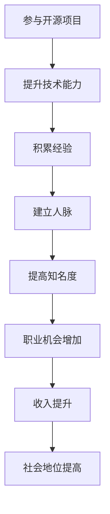

                 

关键词：开源项目、个人品牌、技术影响力、编程技巧、社交媒体、社区参与

> 摘要：在当今数字化时代，开源项目成为技术从业者展示才华、提升技能和建立个人品牌的重要途径。本文将探讨如何通过参与开源项目来打造个人品牌，从而在技术领域中脱颖而出。

## 1. 背景介绍

开源项目，顾名思义，是那些允许公众自由查看、使用、修改和分享的软件项目。随着互联网技术的发展，开源项目已经成为软件开发的主要模式之一。它们不仅为全球开发者提供了丰富的资源和交流平台，还推动了整个技术行业的创新与发展。

在这个背景下，技术从业者如何利用开源项目提升个人品牌，成为了越来越多人的关注焦点。通过参与开源项目，个人不仅能够提升技术能力，还能获得宝贵的经验、人脉和认可。此外，个人品牌的建立有助于在职业发展中获得更多机会，提高收入和社会地位。

## 2. 核心概念与联系

### 2.1 开源项目的基本概念

- **开源定义**：开源意味着项目的源代码可以被自由地查看、修改和分发。
- **许可证**：常见的开源许可证包括GPL、Apache、MIT等，不同的许可证对代码的再分发和使用有不同的规定。
- **贡献**：贡献是指开发者向开源项目提交的代码、文档或其他形式的工作。

### 2.2 个人品牌的定义与重要性

- **个人品牌**：个人品牌是指一个人在专业领域内的声誉、形象和认知度。
- **重要性**：个人品牌有助于在职业发展中脱颖而出，提高收入和社会地位，同时也是获取更多机会的关键。

### 2.3 Mermaid 流程图



## 3. 核心算法原理 & 具体操作步骤

### 3.1 算法原理概述

参与开源项目的过程可以看作是一种“算法”，其原理是通过一系列步骤（如学习、贡献、交流等）来实现个人品牌的提升。

### 3.2 算法步骤详解

#### 3.2.1 选择合适的开源项目

- **目标定位**：根据自己的兴趣和专业领域选择合适的项目。
- **调研分析**：了解项目的背景、技术栈、活跃度等信息。

#### 3.2.2 学习项目代码

- **阅读文档**：熟悉项目的文档，了解项目的架构和功能。
- **代码审查**：学习项目的代码，了解其实现细节。

#### 3.2.3 提交贡献

- **修复bug**：找出项目中的bug，提交修复。
- **增加功能**：为项目增加新功能，提交代码。
- **编写文档**：完善项目的文档，提高项目的可维护性。

#### 3.2.4 参与社区交流

- **提问与解答**：在社区中提出问题，参与讨论。
- **分享经验**：分享自己的技术心得和项目经验。

### 3.3 算法优缺点

#### 优点：

- **提升技术能力**：通过参与开源项目，可以深入了解各种技术细节，提升自己的技术能力。
- **建立人脉**：参与开源项目可以结识志同道合的朋友，拓宽人脉。
- **提高知名度**：在开源社区中活跃，可以提高自己的知名度，增加个人品牌的曝光率。

#### 缺点：

- **时间成本**：参与开源项目需要投入大量的时间和精力。
- **心理压力**：在开源社区中，个人需要承受一定的压力，包括接受他人的批评和挑战。

### 3.4 算法应用领域

- **软件开发**：开源项目是软件开发的重要途径。
- **技术研究**：开源项目为技术研究者提供了丰富的资源和平台。
- **教育培训**：开源项目可以作为教学案例，帮助学生和初学者学习编程。

## 4. 数学模型和公式 & 详细讲解 & 举例说明

### 4.1 数学模型构建

个人品牌提升的过程可以看作是一个数学模型，其核心公式为：

\[ 品牌提升度 = f(技术能力, 经验积累, 人脉关系, 知识分享) \]

其中，技术能力、经验积累、人脉关系和知识分享是影响品牌提升度的四个主要因素。

### 4.2 公式推导过程

\[ 品牌提升度 \]
\[ = (技术能力 \times 时间) + (经验积累 \times 成果) + (人脉关系 \times 合作) + (知识分享 \times 影响力) \]

### 4.3 案例分析与讲解

假设某人A在开源项目中参与了以下活动：

- **技术能力**：修复了10个bug，增加了2个新功能。
- **经验积累**：从项目中学习了3种新技术。
- **人脉关系**：结识了5位志同道合的朋友。
- **知识分享**：在社区中分享了10篇技术文章。

根据上述公式，可以计算出：

\[ 品牌提升度 = (10 \times 1) + (2 \times 1) + (5 \times 0.5) + (10 \times 0.2) = 13 \]

因此，A在开源项目中的品牌提升度为13。

## 5. 项目实践：代码实例和详细解释说明

### 5.1 开发环境搭建

在参与开源项目之前，首先需要搭建一个合适的开发环境。以下是一个简单的示例：

```bash
# 安装Git
sudo apt-get install git

# 安装Python开发环境
sudo apt-get install python3-pip
pip3 install -r requirements.txt

# 安装Docker
sudo apt-get install docker
```

### 5.2 源代码详细实现

以下是一个简单的Python程序，用于计算两个数的和：

```python
def add(a, b):
    return a + b

if __name__ == "__main__":
    print(add(1, 2))
```

### 5.3 代码解读与分析

- **函数定义**：定义了一个名为`add`的函数，用于计算两个数的和。
- **主程序**：主程序中调用了`add`函数，并输出了结果。

### 5.4 运行结果展示

运行上述程序，输出结果为`3`。

## 6. 实际应用场景

### 6.1 软件开发

参与开源项目是提升软件开发技能的绝佳途径。通过修复bug、增加新功能和编写文档，开发者可以深入了解软件开发的各个方面。

### 6.2 技术研究

开源项目为技术研究者提供了丰富的资源和平台。通过参与开源项目，研究者可以学习最新的技术动态和研究成果。

### 6.3 教育培训

开源项目可以作为教学案例，帮助学生和初学者学习编程。通过参与开源项目，学生和初学者可以更好地理解编程概念和技巧。

## 7. 工具和资源推荐

### 7.1 学习资源推荐

- **GitHub**：GitHub是开源项目的首选平台，提供了丰富的开源项目和资源。
- **Stack Overflow**：Stack Overflow是编程问答社区，提供了大量的编程问题和解决方案。

### 7.2 开发工具推荐

- **Git**：Git是版本控制工具，用于管理和追踪代码变更。
- **Docker**：Docker是容器化工具，用于构建和部署应用程序。

### 7.3 相关论文推荐

- **《开源软件的经济学研究》**：该论文分析了开源软件的经济模式和影响因素。
- **《开源软件的社区治理》**：该论文探讨了开源社区的治理机制和组织结构。

## 8. 总结：未来发展趋势与挑战

### 8.1 研究成果总结

通过参与开源项目，技术从业者可以提升个人品牌，获得职业发展机会，提高收入和社会地位。

### 8.2 未来发展趋势

随着数字化转型的推进，开源项目将继续发挥重要作用，成为技术从业者提升个人品牌的主要途径。

### 8.3 面临的挑战

参与开源项目需要投入大量的时间和精力，同时还需要面对心理压力和不确定性。

### 8.4 研究展望

未来，开源项目和个人品牌之间的联系将更加紧密，个人品牌将成为技术从业者的重要资产。

## 9. 附录：常见问题与解答

### 9.1 如何选择开源项目？

- **兴趣**：选择自己感兴趣的项目。
- **活跃度**：选择活跃度较高的项目，更有可能得到反馈和支持。
- **难度**：选择难度适中的项目，既能挑战自己，又能保持动力。

### 9.2 如何在开源项目中获得认可？

- **贡献质量**：提交高质量的代码和文档。
- **积极参与**：积极参与社区讨论，帮助他人解决问题。
- **持续贡献**：持续为项目做出贡献，建立长期合作关系。

作者：禅与计算机程序设计艺术 / Zen and the Art of Computer Programming
-------------------------------------------------------------------

