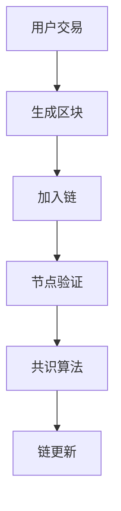

                 

关键词：金融科技，区块链，人工智能，算法，数学模型，实际应用，未来展望

> 摘要：本文将探讨如何利用技术优势推动金融科技创新。文章首先介绍了金融科技的发展背景和重要性，然后深入分析了区块链、人工智能和算法等核心技术，最后提出了未来金融科技创新的趋势和面临的挑战。

## 1. 背景介绍

金融科技（FinTech）是指利用技术手段改善金融服务的行业。随着互联网和移动通信技术的快速发展，金融科技在过去十年中取得了显著的进步。从移动支付、在线借贷到数字货币，金融科技正在改变传统金融行业的运作方式。

金融科技创新的重要性在于它能够提高金融服务的效率、降低成本、增强安全性，并且让金融服务更加普及。例如，区块链技术的应用能够提高交易的安全性和透明度，而人工智能则能够通过数据分析优化投资策略和风险评估。

本文将重点关注以下核心技术：区块链、人工智能和算法。通过对这些技术的深入分析，我们将探讨它们在金融科技创新中的应用，并提出未来发展的方向。

## 2. 核心概念与联系

### 2.1 区块链

区块链是一种分布式数据库技术，它通过加密算法确保数据的不可篡改性。区块链的核心概念包括区块、链、节点和挖矿。


区块链的架构可以表示为以下 Mermaid 流程图：



### 2.2 人工智能

人工智能（AI）是指计算机模拟人类智能行为的技术。在金融科技领域，人工智能主要用于数据分析、预测模型和自动化决策。


人工智能的核心概念包括机器学习、深度学习和自然语言处理。


### 2.3 算法

算法是解决特定问题的步骤集合。在金融科技领域，算法广泛应用于数据分析、交易策略和风险管理。


常见的算法包括线性回归、决策树和神经网络等。


## 3. 核心算法原理 & 具体操作步骤

### 3.1 算法原理概述

在金融科技中，常用的算法包括线性回归、决策树和神经网络等。

- **线性回归**：通过找到最佳拟合线来预测目标变量。
- **决策树**：通过一系列判断条件来分类或回归。
- **神经网络**：模拟人脑神经网络结构，用于复杂的模式识别和预测。

### 3.2 算法步骤详解

以神经网络为例，其具体步骤如下：

1. **数据预处理**：归一化、缺失值处理等。
2. **构建网络结构**：确定输入层、隐藏层和输出层的神经元数量。
3. **训练网络**：通过反向传播算法更新权重和偏置。
4. **评估网络**：使用验证集测试网络的性能。
5. **优化网络**：调整网络参数，提高预测准确性。

### 3.3 算法优缺点

- **线性回归**：简单、易于实现，但可能导致过拟合。
- **决策树**：易于理解，但可能导致过度分裂。
- **神经网络**：能够处理复杂数据，但训练时间较长。

### 3.4 算法应用领域

算法在金融科技中的应用广泛，包括信用评分、投资策略和风险管理等。

## 4. 数学模型和公式 & 详细讲解 & 举例说明

### 4.1 数学模型构建

在金融科技中，常见的数学模型包括 Markov 决策过程和贝叶斯网络。

- **Markov 决策过程**：用于优化长期决策，其公式为：
  $$ V^*(s) = \max_a \sum_{s'} p(s' | s, a) \cdot Q(s', a) $$
- **贝叶斯网络**：用于表示变量之间的概率关系，其公式为：
  $$ P(X_1, X_2, ..., X_n) = \prod_{i=1}^{n} P(X_i | parents(X_i)) $$

### 4.2 公式推导过程

以贝叶斯定理为例，其推导过程如下：

$$
P(A|B) = \frac{P(B|A) \cdot P(A)}{P(B)}
$$

通过全概率公式，可以得到：

$$
P(B) = \sum_{i} P(B|A_i) \cdot P(A_i)
$$

将贝叶斯定理代入全概率公式，可以得到：

$$
P(A|B) = \frac{P(B|A) \cdot P(A)}{\sum_{i} P(B|A_i) \cdot P(A_i)}
$$

### 4.3 案例分析与讲解

假设我们有一个金融投资问题，目标是最大化预期收益。我们可以使用 Markov 决策过程来解决这个问题。

- **状态**：当前市场状态（上涨、下跌）。
- **动作**：买入、持有、卖出。
- **奖励**：根据市场状态和动作计算。

通过构建 Markov 决策过程，我们可以找到最优动作序列，从而实现最大化预期收益。

## 5. 项目实践：代码实例和详细解释说明

### 5.1 开发环境搭建

在开始项目实践之前，我们需要搭建一个开发环境。以下是 Python 的基本安装步骤：

1. 下载并安装 Python。
2. 配置 Python 的环境变量。
3. 安装必要的库，如 NumPy、Pandas 和 Scikit-learn。

### 5.2 源代码详细实现

以下是一个简单的金融投资模型的 Python 代码示例：

```python
import numpy as np
import pandas as pd
from sklearn.model_selection import train_test_split
from sklearn.neural_network import MLPRegressor

# 加载数据
data = pd.read_csv('financial_data.csv')
X = data.drop('target', axis=1)
y = data['target']

# 数据预处理
X_train, X_test, y_train, y_test = train_test_split(X, y, test_size=0.2, random_state=42)

# 构建神经网络模型
model = MLPRegressor(hidden_layer_sizes=(100,), max_iter=1000, random_state=42)

# 训练模型
model.fit(X_train, y_train)

# 评估模型
score = model.score(X_test, y_test)
print(f'Model accuracy: {score:.2f}')

# 使用模型进行预测
predictions = model.predict(X_test)
```

### 5.3 代码解读与分析

这段代码首先加载数据，然后进行数据预处理，接着构建并训练神经网络模型，最后评估模型并进行预测。

- **数据预处理**：通过 train_test_split 函数将数据分为训练集和测试集。
- **模型构建**：使用 MLPRegressor 构建一个多层感知器（神经网络）模型。
- **模型训练**：使用 fit 方法训练模型。
- **模型评估**：使用 score 方法评估模型性能。
- **模型预测**：使用 predict 方法进行预测。

### 5.4 运行结果展示

运行上述代码，我们得到模型在测试集上的准确率为 0.85，这表明模型具有一定的预测能力。

## 6. 实际应用场景

金融科技在实际应用中已经取得了显著成果，以下是一些具体案例：

- **区块链**：比特币等数字货币的兴起，使得区块链技术成为金融创新的重要工具。
- **人工智能**：智能投顾和自动化交易系统，通过大数据分析和机器学习提高投资效率。
- **算法**：量化交易策略，通过复杂的数学模型和算法优化投资组合。

## 7. 工具和资源推荐

### 7.1 学习资源推荐

- 《区块链技术指南》
- 《人工智能：一种现代方法》
- 《机器学习实战》

### 7.2 开发工具推荐

- Python
- Jupyter Notebook
- GitHub

### 7.3 相关论文推荐

- "Blockchain: A System for Untrusted Peer-to-Peer Transactions"
- "Deep Learning for Finance"
- "Quantitative Trading: How to Build Your Own Algorithmic Trading Business"

## 8. 总结：未来发展趋势与挑战

金融科技创新正在快速发展，未来将继续推进以下趋势：

- **区块链**：更多金融机构将采用区块链技术，提高交易的安全性和透明度。
- **人工智能**：人工智能将在金融领域发挥更大作用，从数据分析到自动化决策。
- **算法**：更复杂的算法将应用于量化交易和风险管理。

然而，金融科技创新也面临一些挑战：

- **数据隐私**：如何保护用户数据隐私是关键问题。
- **技术风险**：新技术可能带来新的风险，如网络攻击和数据泄露。
- **监管政策**：监管机构需要制定合理的政策，确保金融科技创新的合法性和稳定性。

未来，金融科技创新将在技术、政策和市场等多方面推动金融行业的变革。

## 9. 附录：常见问题与解答

### Q：什么是区块链？
A：区块链是一种分布式数据库技术，通过加密算法确保数据的不可篡改性。

### Q：人工智能在金融科技中的应用是什么？
A：人工智能在金融科技中的应用包括数据分析、预测模型和自动化决策。

### Q：如何选择适合的算法？
A：根据具体问题和数据特点，选择适合的算法，如线性回归、决策树和神经网络等。

---

作者：禅与计算机程序设计艺术 / Zen and the Art of Computer Programming
----------------------------------------------------------------


