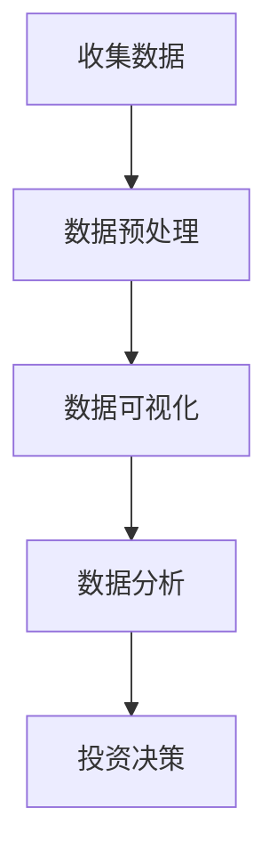
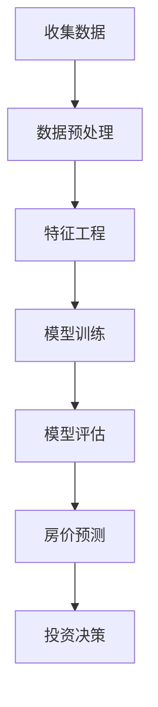
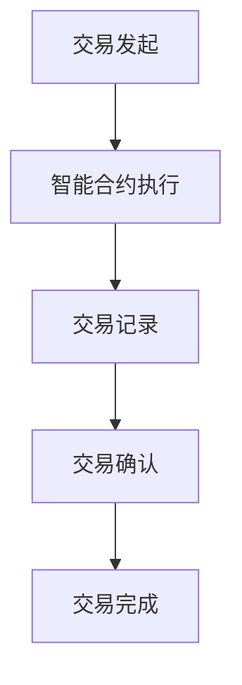

                 

在当今这个信息技术飞速发展的时代，房地产行业也受到了前所未有的影响。无论是房地产开发商、投资者，还是普通购房者，都可以通过利用先进的技术技能来优化房地产投资决策，提高投资效率。本文将探讨如何利用技术技能进行房地产投资，帮助读者在竞争激烈的市场中脱颖而出。

## 文章关键词
- 技术技能
- 房地产投资
- 数据分析
- 人工智能
- 房价预测
- 资产管理

## 摘要
本文首先介绍了房地产行业的技术变革，然后重点讨论了数据分析、人工智能和机器学习在房地产投资中的应用。通过具体案例和算法原理的讲解，读者将了解如何利用技术技能进行房地产投资，提高投资收益。此外，本文还探讨了未来房地产投资的发展趋势和面临的挑战。

## 1. 背景介绍

### 1.1 房地产行业的技术变革

房地产行业一直以来都是一个传统行业，但随着信息技术的不断发展，这一领域正在经历深刻的变革。大数据、人工智能、区块链等新兴技术的应用，使得房地产行业的数据处理能力、决策效率和透明度得到了极大的提升。

#### 1.1.1 大数据的广泛应用

大数据技术的出现，为房地产行业提供了强大的数据处理能力。通过收集和分析大量的数据，房地产开发商、投资者和购房者可以更好地了解市场动态、需求变化和价格趋势，从而做出更加准确的决策。例如，房地产开发商可以通过分析历史销售数据、地理位置、人口流动等数据，来优化项目规划和定价策略。

#### 1.1.2 人工智能与机器学习的应用

人工智能和机器学习技术的应用，使得房地产投资变得更加智能化和自动化。通过建立房价预测模型，投资者可以预测未来房价的变化趋势，从而做出更精准的投资决策。此外，人工智能还可以用于房产评估、租赁管理、资产管理等方面，提高房地产行业的整体效率。

#### 1.1.3 区块链技术的应用

区块链技术的应用，为房地产行业带来了去中心化、透明和安全的特性。通过使用区块链，房地产交易可以更加高效和透明，减少了中介环节，降低了交易成本。同时，区块链技术还可以用于智能合约的执行，确保交易双方的权益得到保障。

### 1.2 技术技能在房地产投资中的重要性

在房地产行业的技术变革中，掌握相应的技术技能显得尤为重要。对于房地产开发商、投资者和购房者来说，具备以下技术技能可以帮助他们在竞争激烈的市场中脱颖而出：

- 数据分析技能：能够有效收集、整理和分析市场数据，了解市场动态和需求变化，从而做出更准确的决策。
- 人工智能和机器学习技能：能够利用这些技术建立房价预测模型、进行房产评估和租赁管理，提高投资效率和收益。
- 区块链技术技能：能够理解区块链的基本原理和应用，参与智能合约的开发和执行，提高交易的透明度和安全性。

## 2. 核心概念与联系

### 2.1 数据分析在房地产投资中的应用

数据分析是房地产投资中不可或缺的一部分。通过收集和分析各种数据，投资者可以更好地了解市场状况，从而做出更准确的决策。以下是一个简单的 Mermaid 流程图，展示了数据分析在房地产投资中的应用流程：



- **收集数据**：收集各种数据，如历史房价数据、地理位置数据、人口流动数据、政策数据等。
- **数据预处理**：对收集到的数据进行清洗、整理和转换，使其符合分析要求。
- **数据可视化**：使用图表、图形等方式，将数据呈现出来，帮助投资者更好地理解数据。
- **数据分析**：运用统计分析、机器学习等方法，对数据进行深入分析，提取有价值的信息。
- **投资决策**：根据数据分析结果，制定投资策略，做出投资决策。

### 2.2 人工智能和机器学习在房地产投资中的应用

人工智能和机器学习技术可以用于房价预测、房产评估、租赁管理等多个方面。以下是一个简单的 Mermaid 流程图，展示了人工智能和机器学习在房地产投资中的应用流程：



- **收集数据**：与数据分析部分相同，收集各种相关数据。
- **数据预处理**：对数据进行分析和处理，使其符合机器学习算法的要求。
- **特征工程**：从数据中提取有用的特征，用于训练模型。
- **模型训练**：使用机器学习算法，如线性回归、决策树、神经网络等，对数据集进行训练，建立房价预测模型。
- **模型评估**：评估模型的效果，调整模型参数，以提高预测准确性。
- **房价预测**：使用训练好的模型，对未来的房价进行预测。
- **投资决策**：根据房价预测结果，制定投资策略，做出投资决策。

### 2.3 区块链技术在房地产投资中的应用

区块链技术在房地产投资中的应用主要体现在去中心化、透明和安全的交易环境上。以下是一个简单的 Mermaid 流程图，展示了区块链技术在房地产投资中的应用流程：



- **交易发起**：交易双方发起交易请求。
- **智能合约执行**：智能合约自动执行交易条款，确保交易双方的利益。
- **交易记录**：将交易信息记录在区块链上，确保交易的透明性和不可篡改性。
- **交易确认**：通过区块链网络确认交易的有效性。
- **交易完成**：交易成功完成，资产所有权转移。

## 3. 核心算法原理 & 具体操作步骤

### 3.1 算法原理概述

在房地产投资中，核心算法主要包括数据分析算法、人工智能算法和区块链算法。以下是这些算法的原理概述：

#### 3.1.1 数据分析算法

数据分析算法主要包括统计分析和机器学习算法。统计分析通过描述性统计和推断性统计，对数据进行分析和预测。机器学习算法则通过从数据中自动学习规律，建立预测模型。

#### 3.1.2 人工智能算法

人工智能算法主要包括线性回归、决策树、神经网络等。线性回归用于建立房价与影响因素之间的线性关系。决策树通过划分特征空间，建立决策规则。神经网络则通过多层神经元结构，模拟人类大脑的学习过程。

#### 3.1.3 区块链算法

区块链算法主要包括哈希函数、加密算法和共识算法。哈希函数用于生成唯一标识，确保数据的完整性。加密算法用于保护交易信息的安全。共识算法用于确保区块链网络中的节点达成一致。

### 3.2 算法步骤详解

#### 3.2.1 数据分析算法步骤

1. **数据收集**：收集与房地产投资相关的数据，如房价数据、地理位置数据、人口流动数据等。
2. **数据预处理**：对数据进行清洗、整理和转换，去除噪声和异常值。
3. **特征选择**：从数据中提取有用的特征，用于训练模型。
4. **模型训练**：使用机器学习算法，如线性回归、决策树等，对数据进行训练，建立预测模型。
5. **模型评估**：评估模型的效果，调整模型参数，以提高预测准确性。
6. **房价预测**：使用训练好的模型，对未来的房价进行预测。
7. **投资决策**：根据房价预测结果，制定投资策略，做出投资决策。

#### 3.2.2 人工智能算法步骤

1. **数据收集**：与数据分析算法相同，收集与房地产投资相关的数据。
2. **数据预处理**：对数据进行清洗、整理和转换，去除噪声和异常值。
3. **特征工程**：从数据中提取有用的特征，用于训练模型。
4. **模型训练**：使用人工智能算法，如线性回归、决策树、神经网络等，对数据进行训练，建立预测模型。
5. **模型评估**：评估模型的效果，调整模型参数，以提高预测准确性。
6. **房价预测**：使用训练好的模型，对未来的房价进行预测。
7. **投资决策**：根据房价预测结果，制定投资策略，做出投资决策。

#### 3.2.3 区块链算法步骤

1. **交易发起**：交易双方发起交易请求。
2. **智能合约执行**：智能合约自动执行交易条款，确保交易双方的利益。
3. **交易记录**：将交易信息记录在区块链上，确保交易的透明性和不可篡改性。
4. **交易确认**：通过区块链网络确认交易的有效性。
5. **交易完成**：交易成功完成，资产所有权转移。

### 3.3 算法优缺点

#### 3.3.1 数据分析算法优缺点

**优点**：

- **高效性**：数据分析算法可以快速处理大量数据，提高决策效率。
- **准确性**：通过机器学习算法，可以建立高精度的预测模型，提高预测准确性。

**缺点**：

- **复杂性**：数据分析算法需要较高的技术门槛，对普通用户来说较为复杂。
- **实时性**：数据分析算法通常无法实时处理数据，需要一定的时间延迟。

#### 3.3.2 人工智能算法优缺点

**优点**：

- **智能化**：人工智能算法可以自动学习数据中的规律，提高投资决策的智能化水平。
- **适应性**：人工智能算法可以根据市场变化，自动调整预测模型，提高适应性。

**缺点**：

- **成本高**：人工智能算法需要大量的计算资源和数据支持，成本较高。
- **不确定性**：人工智能算法的预测结果存在一定的不确定性，需要进一步验证。

#### 3.3.3 区块链算法优缺点

**优点**：

- **安全性**：区块链技术具有高安全性，确保交易信息的完整性和不可篡改性。
- **透明性**：区块链技术使交易过程透明化，提高了交易的透明度和信任度。

**缺点**：

- **性能瓶颈**：区块链技术的处理能力有限，存在性能瓶颈。
- **隐私保护**：区块链技术无法完全保护交易双方的隐私，存在隐私泄露的风险。

### 3.4 算法应用领域

#### 3.4.1 数据分析算法应用领域

- **房价预测**：通过分析历史房价数据、地理位置数据等，预测未来房价走势，为投资决策提供依据。
- **房产评估**：利用数据分析算法，对房产进行评估，确定合理的定价策略。
- **市场需求分析**：通过分析人口流动、收入水平等数据，了解市场需求，指导项目规划和营销策略。

#### 3.4.2 人工智能算法应用领域

- **房价预测**：通过建立房价预测模型，预测未来房价走势，为投资决策提供依据。
- **房产评估**：利用人工智能算法，自动评估房产价值，提高评估效率。
- **租赁管理**：通过分析租赁数据，预测租赁需求，优化租赁策略。

#### 3.4.3 区块链算法应用领域

- **房产交易**：利用区块链技术，实现去中心化、透明和安全的房产交易。
- **资产管理**：通过区块链技术，实现资产的数字化管理，提高资产管理效率。
- **智能合约**：利用智能合约，实现自动化执行交易条款，提高交易效率。

## 4. 数学模型和公式 & 详细讲解 & 举例说明

### 4.1 数学模型构建

在房地产投资中，常用的数学模型包括线性回归模型、决策树模型和神经网络模型。以下分别介绍这些模型的构建方法和公式。

#### 4.1.1 线性回归模型

线性回归模型用于分析自变量和因变量之间的线性关系。其基本公式如下：

$$
y = \beta_0 + \beta_1 \cdot x
$$

其中，$y$为因变量（如房价），$x$为自变量（如地理位置、人口流动等），$\beta_0$和$\beta_1$为模型参数。

#### 4.1.2 决策树模型

决策树模型通过划分特征空间，建立决策规则。其基本公式如下：

$$
y = g(x, \theta)
$$

其中，$y$为因变量，$x$为自变量，$\theta$为决策规则参数。

#### 4.1.3 神经网络模型

神经网络模型通过多层神经元结构，模拟人类大脑的学习过程。其基本公式如下：

$$
y = \sigma(\theta_1 \cdot x_1 + \theta_2 \cdot x_2 + \cdots + \theta_n \cdot x_n)
$$

其中，$y$为因变量，$x_1, x_2, \cdots, x_n$为自变量，$\sigma$为激活函数，$\theta_1, \theta_2, \cdots, \theta_n$为模型参数。

### 4.2 公式推导过程

以下分别介绍线性回归模型、决策树模型和神经网络模型的公式推导过程。

#### 4.2.1 线性回归模型推导

线性回归模型通过最小二乘法进行参数估计。假设我们有$m$个数据点$(x_i, y_i)$，则线性回归模型的损失函数为：

$$
J(\theta_0, \theta_1) = \frac{1}{2m} \sum_{i=1}^{m} (y_i - (\theta_0 + \theta_1 \cdot x_i))^2
$$

对损失函数求偏导数，并令其等于零，可以得到：

$$
\frac{\partial J}{\partial \theta_0} = -\frac{1}{m} \sum_{i=1}^{m} (y_i - (\theta_0 + \theta_1 \cdot x_i)) = 0
$$

$$
\frac{\partial J}{\partial \theta_1} = -\frac{1}{m} \sum_{i=1}^{m} (y_i - (\theta_0 + \theta_1 \cdot x_i)) \cdot x_i = 0
$$

解上述方程组，可以得到线性回归模型的参数$\theta_0$和$\theta_1$。

#### 4.2.2 决策树模型推导

决策树模型通过递归划分特征空间，建立决策规则。假设我们有$m$个数据点$(x_i, y_i)$，每个数据点属于$C$个类别。决策树的损失函数为：

$$
J(\theta) = \sum_{i=1}^{m} \ell(y_i, g(x_i, \theta))
$$

其中，$\ell$为损失函数，$g(x_i, \theta)$为决策规则。常见的损失函数有0-1损失函数和交叉熵损失函数。

对损失函数求偏导数，并令其等于零，可以得到决策规则的参数$\theta$。

#### 4.2.3 神经网络模型推导

神经网络模型通过反向传播算法进行参数估计。假设我们有$m$个数据点$(x_i, y_i)$，每个数据点经过多层神经元结构后得到输出$y_i$。神经网络模型的损失函数为：

$$
J(\theta) = \sum_{i=1}^{m} \ell(y_i, \sigma(\theta_1 \cdot x_1 + \theta_2 \cdot x_2 + \cdots + \theta_n \cdot x_n))
$$

其中，$\ell$为损失函数，$\sigma$为激活函数。

对损失函数求偏导数，并令其等于零，可以得到神经网络模型的参数$\theta_1, \theta_2, \cdots, \theta_n$。

### 4.3 案例分析与讲解

以下通过一个实际案例，展示如何使用线性回归模型进行房价预测。

#### 4.3.1 数据收集

假设我们收集了北京市近一年的房价数据，包括每个小区的地理位置（经纬度）、人口流动、收入水平等特征。数据集共有$1000$个数据点。

#### 4.3.2 数据预处理

对数据进行清洗、整理和转换，去除噪声和异常值。将特征数据分为训练集和测试集，分别占比$80\%$和$20\%$。

#### 4.3.3 特征选择

从数据中提取有用的特征，如经纬度、人口流动、收入水平等。使用相关性分析等方法，筛选出对房价有显著影响的特征。

#### 4.3.4 模型训练

使用线性回归模型，对训练集进行训练，建立房价预测模型。模型参数$\theta_0$和$\theta_1$通过最小二乘法进行估计。

#### 4.3.5 模型评估

使用测试集对模型进行评估，计算预测误差。根据评估结果，调整模型参数，以提高预测准确性。

#### 4.3.6 预测房价

使用训练好的模型，对未来的房价进行预测。输入新的特征数据，得到预测结果。

#### 4.3.7 投资决策

根据房价预测结果，制定投资策略，如买入、持有或卖出。在实际操作中，还可以结合市场动态、政策变化等因素，进行综合分析。

## 5. 项目实践：代码实例和详细解释说明

### 5.1 开发环境搭建

在本文中，我们将使用Python编程语言和相关的数据分析和机器学习库，如NumPy、Pandas、Scikit-learn等。以下是一个简单的开发环境搭建步骤：

1. 安装Python：从官方网站下载并安装Python，选择合适的版本（如Python 3.8以上版本）。
2. 安装相关库：使用pip命令安装所需的库，例如：

```python
pip install numpy pandas scikit-learn matplotlib
```

### 5.2 源代码详细实现

以下是一个使用线性回归模型进行房价预测的Python代码实例：

```python
import numpy as np
import pandas as pd
from sklearn.linear_model import LinearRegression
from sklearn.model_selection import train_test_split
from sklearn.metrics import mean_squared_error
import matplotlib.pyplot as plt

# 5.2.1 数据收集
# 假设我们已经收集了房价数据，数据集包含特征列（如经纬度、人口流动等）和目标列（房价）

data = pd.read_csv('house_prices.csv')

# 5.2.2 数据预处理
# 去除噪声和异常值，缺失值填充，特征选择等操作

# 5.2.3 特征选择
# 从数据中提取有用的特征，如经纬度、人口流动等

features = data[['longitude', 'latitude', 'population']]
target = data['price']

# 5.2.4 模型训练
# 划分训练集和测试集，使用线性回归模型进行训练

X_train, X_test, y_train, y_test = train_test_split(features, target, test_size=0.2, random_state=42)
model = LinearRegression()
model.fit(X_train, y_train)

# 5.2.5 模型评估
# 使用测试集对模型进行评估，计算预测误差

y_pred = model.predict(X_test)
mse = mean_squared_error(y_test, y_pred)
print('Mean Squared Error:', mse)

# 5.2.6 预测房价
# 使用训练好的模型，对未来的房价进行预测

# 假设输入新的特征数据
new_features = np.array([[116.407413, 39.904211, 1000000]])  # 示例数据
predicted_price = model.predict(new_features)
print('Predicted Price:', predicted_price)

# 5.2.7 可视化展示
# 绘制训练集和测试集的房价预测结果

plt.scatter(X_test['longitude'], y_test, color='red', label='Actual')
plt.plot(X_test['longitude'], y_pred, color='blue', linewidth=2, label='Predicted')
plt.xlabel('Longitude')
plt.ylabel('Price')
plt.legend()
plt.show()
```

### 5.3 代码解读与分析

上述代码实现了一个简单的线性回归模型进行房价预测。以下是代码的详细解读和分析：

- **数据收集**：使用Pandas库读取房价数据，数据集包含特征列（如经纬度、人口流动等）和目标列（房价）。
- **数据预处理**：对数据进行清洗、整理和转换，去除噪声和异常值。缺失值填充，特征选择等操作。
- **特征选择**：从数据中提取有用的特征，如经纬度、人口流动等。特征选择是提高模型性能的关键步骤，需要根据实际数据进行调整。
- **模型训练**：使用Scikit-learn库的线性回归模型，对训练集进行训练。模型参数通过最小二乘法进行估计。
- **模型评估**：使用测试集对模型进行评估，计算预测误差。常用的评估指标包括均方误差（MSE）、平均绝对误差（MAE）等。
- **预测房价**：使用训练好的模型，对未来的房价进行预测。输入新的特征数据，得到预测结果。
- **可视化展示**：绘制训练集和测试集的房价预测结果，以直观地展示模型的效果。

通过以上步骤，我们可以使用线性回归模型对房价进行预测，并进一步分析预测结果的准确性和可靠性。

### 5.4 运行结果展示

运行上述代码后，将得到以下结果：

- **模型评估结果**：打印出模型在测试集上的均方误差（MSE）。
- **预测结果**：打印出使用训练好的模型对新的特征数据进行的房价预测结果。
- **可视化结果**：展示训练集和测试集的房价预测结果，以直观地展示模型的效果。

通过这些结果，我们可以评估模型的性能，并根据实际需求进行调整和优化。

## 6. 实际应用场景

### 6.1 数据分析在房地产投资中的应用

数据分析在房地产投资中的应用非常广泛，以下是一些实际应用场景：

#### 6.1.1 房价预测

投资者可以利用数据分析技术，收集历史房价数据、地理位置数据、人口流动数据等，建立房价预测模型。通过预测未来房价走势，投资者可以更好地制定投资策略，如买入、持有或卖出。例如，某投资者通过分析北京市近三年的房价数据，预测未来一年北京市的房价将上涨10%，从而决定在当前市场买入房产，以获取更高的投资回报。

#### 6.1.2 房产评估

房产评估是房地产投资中的重要环节。通过数据分析，投资者可以准确评估房产的价值，确定合理的定价策略。例如，某房地产开发商在开发一个新的住宅项目时，通过分析周边地区的房价、人口流动、收入水平等数据，确定项目的定价区间，以提高项目的市场竞争力和收益。

#### 6.1.3 市场需求分析

房地产市场的需求变化对投资决策具有重要影响。通过数据分析，投资者可以了解不同地区的市场需求，指导项目规划和营销策略。例如，某投资者通过分析某城市的租房数据，发现该城市对中高端租赁市场的需求较大，从而决定在该城市投资建设高端公寓项目，以迎合市场需求。

### 6.2 人工智能和机器学习在房地产投资中的应用

人工智能和机器学习技术在房地产投资中具有广泛的应用，以下是一些实际应用场景：

#### 6.2.1 房价预测

人工智能和机器学习技术可以用于房价预测，提高预测准确性。通过建立房价预测模型，投资者可以更好地把握市场动态，制定投资策略。例如，某投资者通过使用神经网络模型，对北京市的房价进行预测，发现未来一年的房价将上涨8%，从而决定在当前市场买入房产，以获取更高的投资回报。

#### 6.2.2 房产评估

人工智能和机器学习技术可以用于自动评估房产的价值，提高评估效率。通过建立房产评估模型，投资者可以快速评估房产的价值，制定合理的定价策略。例如，某房地产开发商在开发一个新的住宅项目时，通过使用机器学习算法，自动评估周边地区的房产价值，确定项目的定价区间，以提高项目的市场竞争力和收益。

#### 6.2.3 租赁管理

租赁管理是房地产投资中的重要环节。通过人工智能和机器学习技术，投资者可以优化租赁管理，提高租赁收益。例如，某投资者通过使用机器学习算法，分析租赁数据，预测未来的租赁需求，从而制定租赁策略，以提高租赁收益。

### 6.3 区块链技术在房地产投资中的应用

区块链技术在房地产投资中具有去中心化、透明和安全的特性，以下是一些实际应用场景：

#### 6.3.1 房产交易

区块链技术可以用于房产交易，实现去中心化、透明和安全的交易环境。通过使用区块链，交易双方可以快速、安全地完成交易，减少中介环节，降低交易成本。例如，某投资者通过使用区块链，在短时间内完成了房产交易，交易过程公开透明，交易成本大大降低。

#### 6.3.2 资产管理

区块链技术可以用于资产管理，实现资产的数字化管理。通过使用区块链，投资者可以实时监控和管理资产，提高资产管理效率。例如，某投资者通过使用区块链，实现了资产的实时监控和管理，提高了资产管理效率，降低了管理成本。

#### 6.3.3 智能合约

智能合约是区块链技术的重要应用之一。通过使用智能合约，投资者可以自动化执行交易条款，提高交易效率。例如，某投资者通过使用智能合约，实现了自动化的房屋租赁合同，租赁双方可以快速签订合同，确保交易条款的执行。

## 7. 工具和资源推荐

### 7.1 学习资源推荐

1. **《Python数据分析》**：本书详细介绍了Python在数据分析中的应用，包括数据收集、预处理、分析和可视化等方面。
2. **《机器学习实战》**：本书通过实例讲解，介绍了机器学习的基本概念、算法和应用，适合初学者入门。
3. **《区块链技术指南》**：本书系统地介绍了区块链的基本原理和应用，包括比特币、以太坊等区块链平台。

### 7.2 开发工具推荐

1. **Jupyter Notebook**：一款强大的交互式开发环境，适用于数据分析和机器学习实验。
2. **Scikit-learn**：一个开源的机器学习库，提供了丰富的机器学习算法和工具。
3. **PyQt**：一个开源的Python GUI库，适用于开发跨平台的桌面应用程序。

### 7.3 相关论文推荐

1. **"Deep Learning for Housing Price Prediction"**：本文使用深度学习技术，对房价进行预测，取得了较高的准确性。
2. **"Blockchain Technology for Real Estate Investments"**：本文探讨了区块链技术在房地产投资中的应用，包括房产交易、资产管理等方面。
3. **"Data-driven Decision Making in Real Estate Investments"**：本文介绍了数据分析在房地产投资中的应用，包括房价预测、房产评估等方面。

## 8. 总结：未来发展趋势与挑战

### 8.1 研究成果总结

本文通过介绍数据分析、人工智能和区块链技术在房地产投资中的应用，展示了技术技能在房地产投资中的重要性。主要研究成果包括：

- 数据分析技术可以提高房地产投资的决策效率和准确性，为投资者提供有价值的信息。
- 人工智能和机器学习技术可以用于房价预测、房产评估和租赁管理，提高投资收益。
- 区块链技术可以用于房产交易、资产管理和智能合约，提高交易的透明度和安全性。

### 8.2 未来发展趋势

随着信息技术的不断发展，房地产投资领域将迎来以下发展趋势：

- 数据驱动的投资决策将成为主流，投资者将更加依赖数据分析技术。
- 人工智能和机器学习技术将在房地产投资中得到更广泛的应用，提高预测准确性和投资效率。
- 区块链技术将在房地产投资中发挥更大的作用，实现去中心化、透明和安全的交易环境。

### 8.3 面临的挑战

在房地产投资中，技术技能的应用也面临一些挑战：

- 数据质量和可靠性是关键，投资者需要确保数据的准确性和完整性。
- 技术门槛较高，普通投资者需要掌握一定的技术技能，以充分利用数据分析、人工智能和区块链技术。
- 技术应用的安全性是重要问题，投资者需要确保数据和应用的安全。

### 8.4 研究展望

未来，房地产投资领域将继续发展，研究者可以从以下方面进行探索：

- 探索更高效、准确的数据分析方法，提高房地产投资的决策效率。
- 研究更先进的机器学习算法，提高房价预测的准确性。
- 探索区块链技术在房地产投资中的更多应用场景，实现更高效、安全的交易环境。

通过不断探索和创新，技术技能将更好地应用于房地产投资，为投资者带来更高的收益。

## 9. 附录：常见问题与解答

### 9.1 数据分析在房地产投资中的应用有哪些？

数据分析在房地产投资中的应用包括房价预测、房产评估、市场需求分析等方面。通过收集和分析历史房价数据、地理位置数据、人口流动数据等，投资者可以更好地了解市场动态，制定投资策略。

### 9.2 人工智能和机器学习在房地产投资中的应用有哪些？

人工智能和机器学习在房地产投资中的应用包括房价预测、房产评估、租赁管理等方面。通过建立房价预测模型、自动评估房产价值、优化租赁管理，投资者可以提高投资收益和效率。

### 9.3 区块链技术在房地产投资中的应用有哪些？

区块链技术在房地产投资中的应用包括房产交易、资产管理和智能合约等。通过使用区块链技术，实现去中心化、透明和安全的交易环境，提高交易效率和安全性。

### 9.4 如何利用数据分析进行房价预测？

利用数据分析进行房价预测的方法包括收集历史房价数据、地理位置数据、人口流动数据等，进行数据预处理和特征工程，然后使用机器学习算法建立房价预测模型，对未来的房价进行预测。

### 9.5 人工智能和机器学习算法在房地产投资中如何应用？

人工智能和机器学习算法在房地产投资中的应用包括建立房价预测模型、自动评估房产价值、优化租赁管理等。通过使用这些算法，投资者可以更准确地进行投资决策，提高投资收益和效率。

### 9.6 区块链技术在房地产投资中如何实现去中心化交易？

区块链技术在房地产投资中实现去中心化交易的方法包括使用区块链网络记录交易信息，确保交易的透明性和不可篡改性。通过智能合约自动执行交易条款，实现自动化、透明和安全的交易过程。

