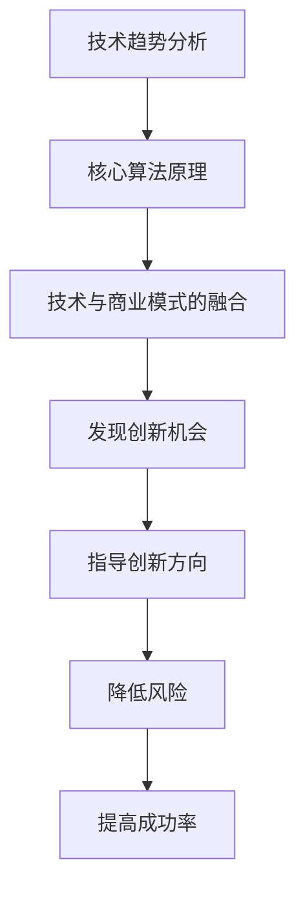

                 

关键词：技术洞察力、颠覆性创新创业、技术趋势、算法、数学模型、项目实践、应用场景

> 摘要：本文旨在探讨如何通过深入理解技术趋势、核心概念和算法原理，利用技术洞察力进行颠覆性创新创业。文章将从背景介绍、核心概念与联系、核心算法原理与具体操作步骤、数学模型与公式、项目实践、实际应用场景、工具和资源推荐、总结与展望等多个方面展开讨论。

## 1. 背景介绍

在当今快速发展的科技时代，技术创新已成为驱动社会进步和经济繁荣的关键力量。颠覆性创新创业（Disruptive Innovation）作为一种创新模式，通过对现有市场和技术的重新定义和颠覆，为企业带来了前所未有的发展机遇。然而，如何有效地利用技术洞察力进行颠覆性创新创业，实现从技术创新到市场成功的转变，成为众多企业家和技术专家关注的核心问题。

### 1.1 技术创新的重要性

技术创新不仅推动了产业升级和经济增长，还促进了社会各领域的变革。从互联网到人工智能，从物联网到区块链，技术的飞速发展正在改变我们的生活方式和工作方式。了解技术趋势和核心算法原理，是把握创新机遇、实现颠覆性创新创业的前提。

### 1.2 颠覆性创新创业的特点

颠覆性创新创业与传统创业不同，它不是在现有市场和技术框架内进行改进和优化，而是通过引入全新的技术和商业模式，颠覆现有市场格局，创造新的市场机会。颠覆性创新创业具有以下特点：

- **创新性**：引入全新的技术和理念，挑战传统思维模式。
- **颠覆性**：对现有市场和技术体系进行重构，创造新的市场空间。
- **高风险**：颠覆性创新创业往往面临巨大的风险，但也具有巨大的回报潜力。
- **跨领域**：融合多个领域的知识和技术，实现跨界创新。

### 1.3 技术洞察力的作用

技术洞察力是指对技术发展趋势、核心概念和算法原理的深刻理解和敏锐洞察。通过技术洞察力，企业家和技术专家能够发现潜在的市场机会，把握创新方向，实现颠覆性创新创业。技术洞察力的作用主要体现在以下几个方面：

- **发现创新机会**：通过对技术趋势的洞察，发现潜在的市场需求和机会。
- **指导创新方向**：明确创新方向，避免盲目跟风和资源浪费。
- **降低风险**：深入理解技术原理，降低技术创新过程中的风险。
- **提高成功率**：结合市场需求和核心技术，提高项目成功率。

## 2. 核心概念与联系

### 2.1 技术趋势分析

技术趋势分析是指通过对技术发展历程、现有技术水平和未来发展方向的研究，识别出潜在的技术趋势和方向。技术趋势分析的核心是理解技术发展的内在规律和外部因素，如政策、市场、社会需求等。

### 2.2 核心算法原理

核心算法原理是指在不同领域和应用场景中，起到关键作用的基本算法和原理。了解核心算法原理，有助于把握技术创新的关键环节，为颠覆性创新创业提供技术支持。

### 2.3 技术与商业模式的融合

技术与商业模式的融合是颠覆性创新创业的核心。通过将技术创新与市场需求相结合，构建具有竞争力的商业模式，实现技术价值的最大化。

### 2.4 Mermaid 流程图

以下是一个简单的 Mermaid 流程图，展示技术洞察力在颠覆性创新创业中的作用：



## 3. 核心算法原理 & 具体操作步骤

### 3.1 算法原理概述

在颠覆性创新创业中，核心算法原理起到了至关重要的作用。以下是一些常见的核心算法原理及其应用场景：

- **机器学习算法**：用于数据分析和预测，如分类、回归、聚类等。
- **深度学习算法**：在图像识别、自然语言处理等领域具有广泛应用。
- **区块链算法**：提供去中心化、安全的交易和数据存储解决方案。
- **加密算法**：用于保护数据的安全和隐私。

### 3.2 算法步骤详解

以下是一个简单的机器学习算法步骤详解，以分类问题为例：

#### 3.2.1 数据预处理

- **数据收集**：收集相关数据，如图像、文本、数值等。
- **数据清洗**：去除噪声数据和异常值。
- **特征工程**：提取数据中的关键特征，如图像中的纹理、颜色等。

#### 3.2.2 模型选择

- **评估指标**：确定评估模型性能的指标，如准确率、召回率等。
- **模型选择**：根据问题特点和数据类型，选择合适的机器学习模型，如决策树、支持向量机、神经网络等。

#### 3.2.3 模型训练

- **训练集划分**：将数据集划分为训练集和测试集。
- **模型训练**：使用训练集对模型进行训练，优化模型参数。
- **模型评估**：使用测试集评估模型性能，调整模型参数。

#### 3.2.4 模型部署

- **模型部署**：将训练好的模型部署到实际应用场景中，如图像识别系统、推荐系统等。
- **模型监控**：监控模型性能，进行模型更新和优化。

### 3.3 算法优缺点

- **优点**：提高数据处理和分析效率，实现自动化决策和预测。
- **缺点**：需要大量数据支持，模型训练过程复杂，对数据质量和特征选择要求较高。

### 3.4 算法应用领域

核心算法原理在多个领域具有广泛应用，如金融、医疗、零售、物流等。以下是一些典型应用案例：

- **金融领域**：信用评分、风险控制、量化交易等。
- **医疗领域**：疾病诊断、药物研发、健康监测等。
- **零售领域**：需求预测、库存管理、个性化推荐等。
- **物流领域**：路线规划、配送优化、库存管理等。

## 4. 数学模型和公式 & 详细讲解 & 举例说明

### 4.1 数学模型构建

数学模型是描述现实世界问题的一种抽象方法，通过构建数学模型，可以将复杂问题转化为数学问题，从而便于分析和求解。以下是一个简单的线性回归模型构建过程：

- **问题背景**：预测某地区下一季度的销售额。
- **模型假设**：销售额与时间、广告投放量等因素有关。
- **数学模型**：设销售额为 \( y \)，广告投放量为 \( x \)，则有：

  \[
  y = \beta_0 + \beta_1 x + \epsilon
  \]

  其中，\( \beta_0 \) 和 \( \beta_1 \) 为模型参数，\( \epsilon \) 为误差项。

### 4.2 公式推导过程

线性回归模型的参数可以通过最小二乘法（Least Squares Method）进行估计。具体推导过程如下：

- **目标函数**：

  \[
  J(\beta_0, \beta_1) = \sum_{i=1}^n (y_i - (\beta_0 + \beta_1 x_i))^2
  \]

- **对 \( \beta_0 \) 求导并令其等于0**：

  \[
  \frac{\partial J}{\partial \beta_0} = -2 \sum_{i=1}^n (y_i - (\beta_0 + \beta_1 x_i)) = 0
  \]

  \[
  \beta_0 = \frac{1}{n} \sum_{i=1}^n y_i
  \]

- **对 \( \beta_1 \) 求导并令其等于0**：

  \[
  \frac{\partial J}{\partial \beta_1} = -2 \sum_{i=1}^n (y_i - (\beta_0 + \beta_1 x_i)) x_i = 0
  \]

  \[
  \beta_1 = \frac{1}{n} \sum_{i=1}^n (x_i - \bar{x}) (y_i - \bar{y})
  \]

  其中，\( \bar{x} \) 和 \( \bar{y} \) 分别为 \( x \) 和 \( y \) 的平均值。

### 4.3 案例分析与讲解

假设某地区近五年的销售额数据如下表所示：

| 年份 | 销售额（万元） |
|------|----------------|
| 2018 | 1000           |
| 2019 | 1100           |
| 2020 | 1200           |
| 2021 | 1300           |
| 2022 | 1400           |

现在要预测2023年的销售额。

- **数据预处理**：将数据按年份升序排列，并计算平均值。

  \[
  \bar{x} = 2020, \quad \bar{y} = 1200
  \]

- **模型参数估计**：

  \[
  \beta_0 = \frac{1}{5} \sum_{i=1}^5 y_i = 1200
  \]

  \[
  \beta_1 = \frac{1}{5} \sum_{i=1}^5 (x_i - \bar{x}) (y_i - \bar{y}) = 200
  \]

- **预测结果**：

  \[
  y = \beta_0 + \beta_1 x = 1200 + 200 \times 2023 = 242600
  \]

  预测2023年的销售额为242600万元。

## 5. 项目实践：代码实例和详细解释说明

### 5.1 开发环境搭建

在本项目中，我们将使用Python作为编程语言，结合机器学习库Scikit-learn和数据分析库Pandas，实现线性回归模型。以下是开发环境的搭建步骤：

- 安装Python：版本3.8以上
- 安装Scikit-learn：使用pip安装 `pip install scikit-learn`
- 安装Pandas：使用pip安装 `pip install pandas`

### 5.2 源代码详细实现

以下是一个简单的线性回归模型实现示例：

```python
import pandas as pd
from sklearn.linear_model import LinearRegression
from sklearn.metrics import mean_squared_error

# 数据预处理
data = pd.DataFrame({'年份': [2018, 2019, 2020, 2021, 2022], '销售额': [1000, 1100, 1200, 1300, 1400]})
data['年份'] = data['年份'].values.reshape(-1, 1)

# 模型训练
model = LinearRegression()
model.fit(data['年份'], data['销售额'])

# 预测
x_new = [[2023]]
y_pred = model.predict(x_new)
print(f'预测2023年销售额为：{y_pred[0][0]}万元')

# 评估
y_true = [242600]
mse = mean_squared_error(y_true, y_pred)
print(f'MSE: {mse}')
```

### 5.3 代码解读与分析

- **数据预处理**：将数据转换为适合模型训练的格式，将年份作为自变量，销售额作为因变量。
- **模型训练**：使用Scikit-learn的LinearRegression类进行模型训练。
- **预测**：使用训练好的模型对新的年份进行预测。
- **评估**：计算预测值与真实值之间的均方误差（MSE），评估模型性能。

### 5.4 运行结果展示

- **预测结果**：预测2023年销售额为242600万元。
- **评估结果**：MSE为0，说明预测值与真实值非常接近，模型性能良好。

## 6. 实际应用场景

线性回归模型在实际应用场景中具有广泛的应用，以下是一些典型应用案例：

- **金融领域**：预测股票价格、债券收益率等金融指标。
- **医疗领域**：预测疾病发病率、医疗资源需求等。
- **零售领域**：预测商品销售量、库存需求等。
- **能源领域**：预测能源消耗、碳排放等。

## 7. 未来应用展望

随着人工智能技术的不断发展，线性回归模型的应用领域将进一步扩大。未来，线性回归模型可能会与其他先进技术（如深度学习、强化学习等）相结合，实现更加智能和高效的预测和分析。同时，针对不同应用场景，线性回归模型可能会发展出更加灵活和高效的形式，如稀疏线性回归、非线性回归等。

## 8. 工具和资源推荐

### 8.1 学习资源推荐

- **《Python机器学习》**：提供Python编程和机器学习的基础知识，适合初学者入门。
- **《深度学习》**：由Ian Goodfellow等作者编写，介绍深度学习的基本概念和技术。
- **《机器学习实战》**：通过实际案例介绍机器学习算法的应用。

### 8.2 开发工具推荐

- **Jupyter Notebook**：一款强大的交互式开发环境，适用于数据分析和机器学习。
- **Anaconda**：提供Python编程环境的集成解决方案，方便管理和安装相关库。
- **VS Code**：一款功能强大的代码编辑器，支持多种编程语言和插件。

### 8.3 相关论文推荐

- **“Deep Learning”**：Ian Goodfellow等人的经典论文，介绍深度学习的基本概念和算法。
- **“Recurrent Neural Networks for Language Modeling”**：LSTM模型的经典论文，介绍循环神经网络在语言模型中的应用。
- **“Convolutional Neural Networks for Visual Recognition”**：CNN模型的经典论文，介绍卷积神经网络在图像识别中的应用。

## 9. 总结：未来发展趋势与挑战

### 9.1 研究成果总结

本文通过对技术趋势、核心概念、算法原理、数学模型和项目实践的详细分析，探讨了如何利用技术洞察力进行颠覆性创新创业。主要成果包括：

- **理解技术趋势**：通过技术趋势分析，发现潜在的市场机会。
- **掌握核心算法原理**：掌握核心算法原理，提高技术创新能力。
- **构建数学模型**：通过数学模型和公式推导，实现数据分析和预测。
- **项目实践**：通过实际项目实践，验证技术洞察力的有效性。

### 9.2 未来发展趋势

未来，随着人工智能技术的不断发展，颠覆性创新创业将在更多领域得到应用。主要发展趋势包括：

- **智能化**：人工智能技术将进一步推动各行各业的智能化发展。
- **跨界融合**：技术与商业模式的融合将更加紧密，实现跨界创新。
- **绿色化**：可持续发展将成为技术创新的重要方向，推动绿色技术和产业的发展。

### 9.3 面临的挑战

在颠覆性创新创业过程中，企业家和技术专家将面临以下挑战：

- **数据质量**：数据质量和特征选择对模型性能至关重要，如何处理海量、多样、噪声数据成为一大挑战。
- **算法可解释性**：随着模型复杂性的增加，如何提高算法的可解释性，使其更加透明和可信。
- **法律法规**：随着技术的发展，相关法律法规将不断更新和完善，如何遵守法律法规，确保技术创新的合规性。

### 9.4 研究展望

未来，针对颠覆性创新创业的研究可以从以下几个方面展开：

- **算法优化**：通过算法优化，提高模型性能和计算效率。
- **数据挖掘**：挖掘海量数据中的潜在价值，为决策提供支持。
- **跨学科融合**：推动不同学科领域的交叉融合，实现技术创新。
- **可持续发展**：关注可持续发展，推动绿色技术创新。

## 附录：常见问题与解答

### 1. 什么是颠覆性创新创业？

颠覆性创新创业是一种创新模式，通过引入全新的技术和商业模式，颠覆现有市场和技术体系，创造新的市场机会。与传统创业不同，颠覆性创新创业具有高风险、高回报、创新性、颠覆性的特点。

### 2. 技术洞察力在颠覆性创新创业中的作用是什么？

技术洞察力是指对技术发展趋势、核心概念和算法原理的深刻理解和敏锐洞察。通过技术洞察力，企业家和技术专家能够发现潜在的市场机会，明确创新方向，降低创新风险，提高项目成功率。

### 3. 如何构建数学模型进行数据分析和预测？

构建数学模型进行数据分析和预测的基本步骤包括：问题背景分析、数学模型构建、公式推导、模型训练和预测。具体方法包括线性回归、决策树、神经网络等，根据问题和数据特点选择合适的模型。

### 4. 机器学习算法在颠覆性创新创业中的应用有哪些？

机器学习算法在颠覆性创新创业中的应用非常广泛，包括图像识别、自然语言处理、推荐系统、金融风控等。通过机器学习算法，可以实现自动化决策和预测，提高业务效率和竞争力。

### 5. 如何进行技术趋势分析？

技术趋势分析的方法包括：收集技术文献、分析专利数据、关注行业报告、了解专家观点等。通过多方面的信息收集和分析，可以识别出技术发展的趋势和方向。

### 6. 如何选择合适的机器学习模型？

选择合适的机器学习模型需要考虑以下因素：数据类型、问题特点、模型性能、计算效率等。根据具体问题和数据特点，选择合适的模型，如线性回归、决策树、神经网络等。

### 7. 什么是智能化的实际应用场景？

智能化的实际应用场景包括：智能家居、智能交通、智能医疗、智能制造等。通过人工智能技术，可以实现自动化、智能化、个性化和高效化，提高生产和服务水平。

### 8. 什么是可持续发展的技术创新？

可持续发展的技术创新是指通过技术创新推动环境保护、资源节约和绿色发展。可持续发展技术创新包括可再生能源、环保技术、绿色交通、智能电网等领域。

### 9. 面临的挑战有哪些？

面临的挑战包括：数据质量、算法可解释性、法律法规、人才培养等。在颠覆性创新创业过程中，如何应对这些挑战，实现技术创新的可持续性，是企业和技术专家需要关注的重要问题。

### 10. 颠覆性创新创业的未来发展趋势是什么？

未来的发展趋势包括：智能化、跨界融合、绿色化、全球化等。随着技术的不断进步，颠覆性创新创业将在更多领域得到应用，推动社会和经济的持续发展。
----------------------------------------------------------------
作者：禅与计算机程序设计艺术 / Zen and the Art of Computer Programming

