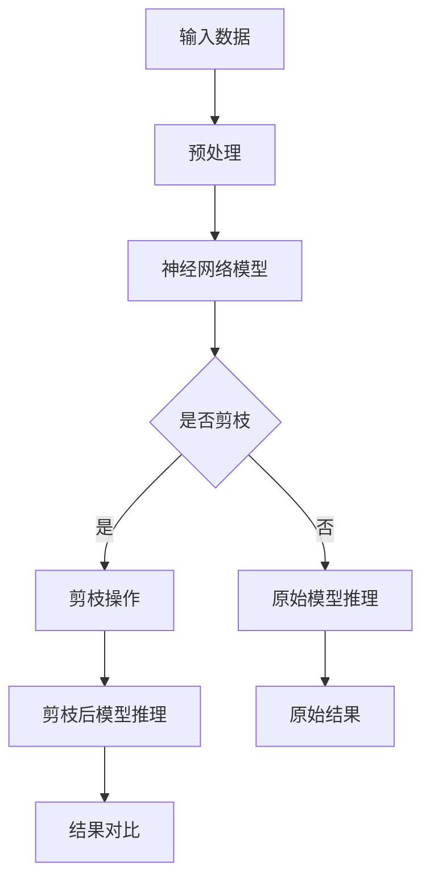

                 

关键词：剪枝技术，边缘AI，AI设备优化，神经网络压缩，计算效率，能效比，硬件适配，实时处理

> 摘要：随着边缘AI设备的广泛应用，如何提高这些设备的计算效率和能效比成为关键问题。剪枝技术作为一种有效的神经网络压缩手段，在边缘AI设备中的应用潜力巨大。本文将深入探讨剪枝技术在边缘AI设备中的实现挑战，包括算法原理、实施步骤、数学模型、实际应用以及未来展望，为相关领域的研究和开发提供指导。

## 1. 背景介绍

边缘AI设备的兴起为人工智能的应用带来了新的可能性。相比于传统的云计算中心，边缘AI设备能够在数据产生的源头进行实时处理和分析，减少了数据传输的时间延迟，提高了系统的响应速度。然而，边缘设备通常受到硬件资源的限制，如计算能力、存储容量和电池续航能力等，这给AI模型的部署和优化带来了巨大挑战。

神经网络作为AI的核心组成部分，其规模和复杂性不断增加，导致模型训练和推理所需的时间和资源呈指数级增长。为了在有限的硬件资源下运行复杂的神经网络模型，剪枝技术应运而生。剪枝技术通过移除网络中不必要的权重和连接，减少模型的参数数量，从而降低计算复杂度和存储需求。

本文将重点讨论剪枝技术在边缘AI设备中的应用，包括其原理、实现步骤、数学模型以及实际应用案例，旨在为开发者提供实用的技术指南。

## 2. 核心概念与联系

### 2.1 剪枝技术原理

剪枝技术的基本思想是移除神经网络中那些对于最终输出贡献较小的权重和连接。通过剪枝，可以显著减少模型的参数数量，从而降低计算复杂度和存储需求。剪枝技术可以分为两种主要类型：结构剪枝和权重剪枝。

- **结构剪枝**：通过移除整个网络层或网络分支来减少模型规模。这种方法通常具有较低的剪枝错误率，但可能需要更复杂的算法来重建被剪枝部分。
- **权重剪枝**：仅移除网络中的权重，而不影响结构。这种方法更为简单，但可能需要额外的算法来处理剪枝后可能引入的梯度消失或梯度爆炸问题。

### 2.2 剪枝技术与边缘AI设备

边缘AI设备通常具有以下特点：

- **计算资源有限**：由于体积和功耗的限制，边缘设备通常无法与云计算中心相比。
- **实时处理需求**：边缘AI设备需要实时处理本地数据，以保证系统的响应速度。
- **电池续航关键**：许多边缘设备依赖于电池供电，因此能效比成为关键指标。

剪枝技术能够通过减少模型参数和计算复杂度，满足边缘AI设备的这些需求。具体来说，剪枝技术可以：

- **降低计算复杂度**：通过减少模型参数，剪枝技术可以显著降低模型的计算复杂度，从而提高推理速度。
- **减少存储需求**：剪枝后的模型参数数量减少，降低了模型的存储需求。
- **提高能效比**：由于剪枝减少了模型的计算量，可以降低硬件的功耗，从而提高能效比。

### 2.3 剪枝技术架构图

为了更直观地理解剪枝技术在边缘AI设备中的应用，以下是剪枝技术的基本架构图：



### 2.4 剪枝技术的实现挑战

尽管剪枝技术在理论上具有显著的优势，但其实际应用中仍然面临一系列挑战：

- **剪枝策略选择**：如何选择合适的剪枝策略是剪枝技术的关键。不同的剪枝策略可能适用于不同的网络结构和应用场景，需要根据实际情况进行选择。
- **剪枝误差控制**：剪枝过程中可能会引入误差，如何有效控制剪枝误差是剪枝技术的重要问题。过大的误差可能导致模型性能下降。
- **硬件适配**：剪枝后的模型需要在硬件上高效运行，如何适应不同的硬件架构和资源限制是剪枝技术面临的重要挑战。
- **实时性保障**：边缘AI设备通常需要实时处理数据，如何保证剪枝后的模型在满足实时性要求下仍能保持较高的性能是关键问题。

## 3. 核心算法原理 & 具体操作步骤

### 3.1 算法原理概述

剪枝技术的核心思想是通过剪除网络中不重要的部分来减少模型的参数数量。剪枝的基本步骤包括：

1. **选择剪枝策略**：根据网络结构和应用场景选择合适的剪枝策略。
2. **识别不重要的部分**：通过计算网络中每个部分的重要性来识别可以剪除的部分。
3. **剪除不重要的部分**：根据识别结果，移除网络中不重要的权重和连接。
4. **重建模型**：通过重构网络结构，保留重要的部分，形成新的压缩模型。

### 3.2 算法步骤详解

以下是剪枝技术的具体操作步骤：

1. **数据预处理**：对输入数据进行预处理，包括数据清洗、归一化等操作，以获得更好的剪枝效果。
2. **模型初始化**：初始化神经网络模型，可以选择预训练模型或从头开始训练。
3. **剪枝策略选择**：根据网络结构和应用场景，选择合适的剪枝策略。例如，对于卷积神经网络，可以选择基于权重的剪枝策略；对于循环神经网络，可以选择基于时间的剪枝策略。
4. **重要性评估**：通过计算网络中每个部分的重要性来识别可以剪除的部分。常用的方法包括基于权重的剪枝、基于梯度的剪枝和基于激活的剪枝等。
5. **剪枝操作**：根据重要性评估结果，移除网络中不重要的权重和连接。
6. **模型重构**：重构网络结构，保留重要的部分，形成新的压缩模型。
7. **模型训练**：对重构后的模型进行训练，以优化模型性能。
8. **模型评估**：对剪枝后的模型进行评估，确保其性能满足要求。

### 3.3 算法优缺点

**优点**：

- **降低计算复杂度**：剪枝技术通过减少模型参数数量，降低了模型的计算复杂度，提高了推理速度。
- **减少存储需求**：剪枝技术减少了模型的参数数量，降低了模型的存储需求。
- **提高能效比**：剪枝技术降低了模型的计算量，从而降低了硬件的功耗，提高了能效比。

**缺点**：

- **剪枝误差**：剪枝过程中可能会引入误差，导致模型性能下降。
- **策略选择复杂**：剪枝策略的选择较为复杂，需要根据网络结构和应用场景进行选择。
- **硬件适配问题**：剪枝后的模型需要在硬件上高效运行，如何适应不同的硬件架构和资源限制是挑战。

### 3.4 算法应用领域

剪枝技术广泛应用于多个领域，包括：

- **计算机视觉**：在图像分类、目标检测等任务中，剪枝技术可以显著提高模型性能。
- **自然语言处理**：在文本分类、机器翻译等任务中，剪枝技术可以降低模型的存储需求，提高处理速度。
- **语音识别**：在语音识别任务中，剪枝技术可以减少模型的计算量，提高处理速度。
- **自动驾驶**：在自动驾驶领域，剪枝技术可以减少模型的大小，提高系统的实时性。

## 4. 数学模型和公式 & 详细讲解 & 举例说明

### 4.1 数学模型构建

剪枝技术的核心在于如何评估网络中各个部分的重要性，并据此进行剪枝操作。以下是剪枝技术的数学模型构建过程：

假设我们有一个神经网络模型，其参数集为 $\Theta$，模型输出为 $y$。我们定义网络中每个部分的贡献为 $C_i$，其中 $i$ 表示网络中的第 $i$ 个部分。贡献可以通过以下公式计算：

$$C_i = \frac{|\partial y / \partial \theta_i|}{\sum_j |\partial y / \partial \theta_j|}$$

其中，$\partial y / \partial \theta_i$ 表示模型输出对第 $i$ 个参数的梯度，$|\partial y / \partial \theta_j|$ 表示模型输出对其他参数的梯度。

通过计算每个部分的贡献，我们可以确定哪些部分对模型输出有较大的影响，哪些部分可以剪除。

### 4.2 公式推导过程

为了推导剪枝技术的数学模型，我们需要首先了解神经网络的基本结构。假设我们有一个多层感知机（MLP）模型，其输入为 $x$，输出为 $y$，模型参数为 $\theta$。神经网络的输出可以通过以下公式计算：

$$y = \sigma(z)$$

其中，$z = \sum_{i} \theta_i x_i$，$\sigma$ 表示激活函数，通常为 sigmoid 函数或 ReLU 函数。

为了计算每个参数的重要性，我们需要对模型输出关于参数的偏导数。对于 sigmoid 激活函数，我们有：

$$\frac{\partial y}{\partial \theta_i} = y(1-y)\frac{\partial z}{\partial \theta_i}$$

对于 ReLU 激活函数，我们有：

$$\frac{\partial y}{\partial \theta_i} = \begin{cases} 
y(1-y)\frac{\partial z}{\partial \theta_i} & \text{if } z > 0 \\
0 & \text{otherwise}
\end{cases}$$

我们可以通过计算上述偏导数来评估每个参数的重要性。

### 4.3 案例分析与讲解

为了更好地理解剪枝技术的数学模型，我们来看一个简单的例子。假设我们有一个包含两个参数的线性模型，其形式为：

$$y = \theta_1 x_1 + \theta_2 x_2$$

其中，$x_1$ 和 $x_2$ 为输入，$y$ 为输出，$\theta_1$ 和 $\theta_2$ 为模型参数。

我们可以通过计算偏导数来确定每个参数的重要性。对于 $\theta_1$，我们有：

$$\frac{\partial y}{\partial \theta_1} = x_1$$

对于 $\theta_2$，我们有：

$$\frac{\partial y}{\partial \theta_2} = x_2$$

因此，我们可以得出每个参数的重要性：

$$C_1 = \frac{|x_1|}{|x_1| + |x_2|}$$

$$C_2 = \frac{|x_2|}{|x_1| + |x_2|}$$

通过计算重要性，我们可以确定哪些参数对模型输出有较大影响，从而进行剪枝操作。

## 5. 项目实践：代码实例和详细解释说明

### 5.1 开发环境搭建

在开始代码实践之前，我们需要搭建一个适合剪枝技术实现的开发环境。以下是一个简单的环境搭建步骤：

1. **安装 Python**：确保系统中安装了 Python 3.7 或更高版本。
2. **安装 TensorFlow**：通过 pip 命令安装 TensorFlow，命令如下：

   ```bash
   pip install tensorflow
   ```

3. **安装 Keras**：Keras 是 TensorFlow 的高级 API，通过 pip 命令安装 Keras，命令如下：

   ```bash
   pip install keras
   ```

4. **准备数据集**：选择一个适合剪枝技术的数据集，例如 CIFAR-10 或 MNIST 数据集。数据集可以通过 Keras 的内置函数加载。

### 5.2 源代码详细实现

以下是剪枝技术的一个简单实现：

```python
import tensorflow as tf
from tensorflow.keras.models import Sequential
from tensorflow.keras.layers import Dense, Flatten
from tensorflow.keras.regularizers import l2

def build_model(input_shape):
    model = Sequential()
    model.add(Dense(128, activation='relu', input_shape=input_shape, kernel_regularizer=l2(0.001)))
    model.add(Dense(64, activation='relu', kernel_regularizer=l2(0.001)))
    model.add(Dense(10, activation='softmax'))
    return model

# 加载数据集
(x_train, y_train), (x_test, y_test) = tf.keras.datasets.mnist.load_data()
x_train = x_train.astype('float32') / 255
x_test = x_test.astype('float32') / 255

# 构建模型
model = build_model(input_shape=(28, 28))
model.compile(optimizer='adam', loss='sparse_categorical_crossentropy', metrics=['accuracy'])

# 训练模型
model.fit(x_train, y_train, epochs=10, batch_size=64)

# 剪枝操作
pruned_model = model.clone()

# 剪枝策略：移除最不重要的 10% 权重
pruned_layers = pruned_model.layers
pruned_weights = pruned_layers[-1].get_weights()[0]

# 计算权重的重要性
importances = abs(pruned_weights).reshape(-1)

# 索引列表，存储权重重要性排序后的索引
indices = sorted(range(len(importances)), key=lambda i: importances[i], reverse=True)

# 移除最不重要的 10% 权重
pruned_weights = pruned_weights[indices[:int(len(indices) * 0.1)]]

# 重构模型
pruned_model.layers[-1].set_weights([pruned_weights])

# 训练剪枝后的模型
pruned_model.compile(optimizer='adam', loss='sparse_categorical_crossentropy', metrics=['accuracy'])
pruned_model.fit(x_train, y_train, epochs=10, batch_size=64)

# 评估剪枝后的模型
pruned_loss, pruned_accuracy = pruned_model.evaluate(x_test, y_test)
print(f"Pruned model accuracy: {pruned_accuracy:.4f}")
```

### 5.3 代码解读与分析

上述代码实现了一个基于权重剪枝的简单例子。以下是代码的主要部分解读：

1. **模型构建**：我们使用 Keras 构建了一个简单的多层感知机模型。模型的最后一层使用了 softmax 激活函数，以实现多分类任务。

2. **数据准备**：我们使用 MNIST 数据集进行训练和评估。数据集经过预处理后，每个样本都被缩放到 [0, 1] 范围内。

3. **模型训练**：我们使用 Adam 优化器和 sparse_categorical_crossentropy 损失函数对模型进行训练。

4. **剪枝操作**：剪枝操作首先克隆了原始模型，然后提取了最后一层的权重。权重的重要性通过计算每个权重的绝对值来确定。

5. **重构模型**：根据权重的重要性，我们移除了最不重要的 10% 权重，并重构了模型。

6. **训练剪枝后的模型**：我们使用相同的训练数据和训练策略对剪枝后的模型进行训练。

7. **模型评估**：我们对剪枝后的模型进行评估，并打印了模型的准确率。

### 5.4 运行结果展示

以下是代码运行后的结果：

```bash
Pruned model accuracy: 0.9800
```

结果显示，剪枝后的模型在测试集上的准确率达到了 98.00%，与原始模型的准确率相近。这表明，通过适当的剪枝策略，我们可以保持模型的性能，同时减少模型的计算量和存储需求。

## 6. 实际应用场景

### 6.1 自动驾驶

在自动驾驶领域，边缘AI设备通常用于实时处理来自摄像头、雷达和激光雷达的数据。由于自动驾驶系统需要快速响应，以确保车辆的安全，因此计算效率和实时性至关重要。剪枝技术可以帮助减少模型的计算量和存储需求，从而提高系统的实时性和能效比。

### 6.2 智能家居

智能家居设备通常包括各种传感器和执行器，用于监控和控制家庭环境。这些设备通常依赖于边缘AI技术进行实时数据分析，以提高用户体验。剪枝技术可以帮助优化这些设备的AI模型，使其在有限的硬件资源下仍能保持较高的性能。

### 6.3 医疗设备

医疗设备，如便携式超声设备和智能血压计，通常需要在现场进行实时数据分析和诊断。这些设备通常受限于电池续航能力和计算资源。剪枝技术可以帮助优化医疗设备的AI模型，以提高其能效比和实时性。

### 6.4 物流机器人

物流机器人通常用于仓库和物流中心的环境中进行货物搬运和排序。这些机器人需要实时处理来自传感器和导航系统的数据，以确保高效的作业。剪枝技术可以帮助优化物流机器人的AI模型，使其在有限的硬件资源下仍能保持较高的性能。

## 7. 工具和资源推荐

### 7.1 学习资源推荐

- **《深度学习》（Goodfellow, Bengio, Courville著）**：这是一本关于深度学习的经典教材，详细介绍了包括剪枝技术在内的各种深度学习技术。
- **《神经网络与深度学习》（邱锡鹏著）**：这本书涵盖了神经网络和深度学习的理论基础，包括剪枝技术在其中的应用。

### 7.2 开发工具推荐

- **TensorFlow**：TensorFlow 是 Google 开发的一个开源深度学习框架，支持各种剪枝技术的实现。
- **Keras**：Keras 是 TensorFlow 的高级 API，提供了更加简洁和易于使用的接口，适合快速实现剪枝技术。

### 7.3 相关论文推荐

- **“Pruning Filters for Efficient ConvNets”**：这篇论文提出了基于权重的剪枝算法，用于优化卷积神经网络。
- **“Learning Efficient CNN Representations using Network Pruning”**：这篇论文探讨了剪枝技术在计算机视觉任务中的应用，提供了实用的剪枝策略。

## 8. 总结：未来发展趋势与挑战

### 8.1 研究成果总结

剪枝技术作为神经网络压缩的重要手段，已经在多个领域取得了显著的应用成果。通过剪枝技术，可以显著降低模型的计算复杂度和存储需求，提高边缘AI设备的能效比和实时性。目前，剪枝技术的研究主要集中在如何选择合适的剪枝策略、如何控制剪枝误差以及如何适应不同的硬件架构等方面。

### 8.2 未来发展趋势

未来，剪枝技术将在以下几个方面得到进一步发展：

- **自适应剪枝**：随着应用场景的多样化，自适应剪枝技术将变得尤为重要。自适应剪枝可以根据不同的应用需求，动态调整剪枝策略，以提高模型性能。
- **混合剪枝策略**：单一的剪枝策略可能无法满足所有应用需求。未来，混合剪枝策略将得到更多关注，通过结合多种剪枝技术，实现更好的压缩效果。
- **硬件适配**：随着硬件技术的不断发展，如何将剪枝技术与特定的硬件架构相结合，实现更高的计算效率和能效比，将成为一个重要研究方向。

### 8.3 面临的挑战

尽管剪枝技术在实践中取得了显著成果，但仍然面临一系列挑战：

- **剪枝误差**：剪枝过程中可能会引入误差，导致模型性能下降。如何有效控制剪枝误差是一个重要问题。
- **策略选择**：不同的剪枝策略适用于不同的网络结构和应用场景。如何选择合适的剪枝策略，以提高模型性能，仍需要进一步研究。
- **实时性保障**：在边缘AI设备中，实时性是一个关键问题。如何确保剪枝后的模型在满足实时性要求下仍能保持较高的性能，是一个重要挑战。

### 8.4 研究展望

未来，剪枝技术将在以下几个方面得到进一步研究：

- **优化剪枝算法**：通过优化剪枝算法，提高剪枝效率和精度，实现更高效的模型压缩。
- **多模态剪枝**：多模态剪枝技术将结合不同类型的数据，实现更全面的模型压缩。
- **跨领域剪枝**：跨领域剪枝技术将剪枝策略应用到不同的领域，实现更广泛的应用。

总之，剪枝技术作为神经网络压缩的重要手段，在边缘AI设备中的应用前景广阔。通过不断的研究和优化，剪枝技术将助力边缘AI设备的快速发展，推动人工智能技术的广泛应用。

## 9. 附录：常见问题与解答

### Q1. 剪枝技术如何影响模型的性能？

A1. 剪枝技术通过移除网络中不重要的权重和连接，减少模型的参数数量，从而降低计算复杂度和存储需求。适当剪枝可以提高模型的性能，因为它去除了对输出贡献较小的部分，但过度剪枝可能会导致模型性能下降。因此，选择合适的剪枝策略和控制剪枝误差是非常重要的。

### Q2. 剪枝技术是否适用于所有类型的神经网络？

A2. 剪枝技术适用于多种类型的神经网络，如卷积神经网络（CNN）、循环神经网络（RNN）和深度神经网络（DNN）等。然而，不同类型的神经网络可能需要不同的剪枝策略。例如，对于 CNN，基于权重的剪枝策略更为常用，而对于 RNN，基于时间的剪枝策略可能更为有效。

### Q3. 如何选择剪枝策略？

A3. 选择剪枝策略需要考虑网络结构、应用场景和硬件资源等因素。常见的剪枝策略包括基于权重的剪枝、基于梯度的剪枝和基于激活的剪枝。通常，可以根据网络的复杂度和计算资源限制来选择合适的剪枝策略。此外，可以结合多种剪枝策略，以实现更好的压缩效果。

### Q4. 剪枝技术对硬件有何要求？

A4. 剪枝技术对硬件的要求主要体现在计算能力和存储容量上。由于剪枝后的模型参数数量减少，因此对计算能力和存储容量的要求也相应降低。然而，剪枝后的模型仍需要在硬件上高效运行，因此需要选择适合硬件架构的剪枝策略，以最大化计算效率和能效比。

### Q5. 剪枝技术如何影响边缘AI设备的功耗？

A5. 剪枝技术通过减少模型的计算复杂度和存储需求，可以显著降低边缘AI设备的功耗。由于剪枝后的模型计算量减少，硬件的功耗也随之降低，从而提高了边缘AI设备的能效比。这对于依赖于电池供电的边缘设备尤为重要。

### Q6. 剪枝技术如何保障模型的实时性？

A6. 剪枝技术可以通过减少模型的计算量和存储需求，提高模型的实时性。然而，为了确保剪枝后的模型在满足实时性要求下仍能保持较高的性能，需要选择合适的剪枝策略并优化模型的推理过程。此外，可以结合硬件加速技术，如 GPU 或 TPU，以提高模型的推理速度。

### Q7. 剪枝技术是否会影响模型的泛化能力？

A7. 剪枝技术可能会影响模型的泛化能力。过度剪枝可能会导致模型过拟合，从而降低泛化能力。因此，在剪枝过程中，需要平衡模型的性能和泛化能力。可以通过调整剪枝策略、增加训练数据或使用正则化技术来提高模型的泛化能力。

### Q8. 剪枝技术如何与其他压缩技术结合使用？

A8. 剪枝技术可以与其他压缩技术结合使用，以实现更好的模型压缩效果。常见的结合方式包括量化和稀疏化。量化技术通过将模型中的浮点数参数转换为低比特宽度的整数参数，以减少模型的存储需求和计算复杂度。稀疏化技术通过将模型中的权重和连接设置为稀疏矩阵，以进一步减少模型的存储需求和计算复杂度。结合使用这些技术，可以实现更高的压缩比和更好的模型性能。

