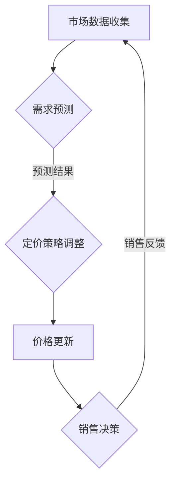

                 

关键词：动态定价、策略、算法、数学模型、实践、应用、展望

> 摘要：本文将深入探讨动态定价策略在商业和IT领域的技术实现。首先，我们将介绍动态定价的基本概念及其重要性。随后，文章将详细解释核心算法原理、数学模型以及实际应用场景。通过项目实践和代码实例，我们将展示动态定价策略的具体实现过程。最后，我们将展望动态定价策略的未来发展趋势和面临的挑战。

## 1. 背景介绍

在当今充满竞争的商业环境中，企业必须不断调整其定价策略以保持竞争力。传统的定价方法通常基于固定价格，而动态定价策略则允许企业根据市场条件和需求实时调整价格。这种方法能够帮助企业最大化利润、提高市场份额并增强客户忠诚度。

动态定价策略的实施依赖于现代信息技术和数据分析能力。通过整合各种数据源（如客户行为、市场趋势、竞争对手策略等），企业可以构建复杂的算法模型，预测市场需求并制定相应的定价策略。

## 2. 核心概念与联系

### 动态定价基本概念

动态定价，也称为实时定价或弹性定价，是指企业根据市场需求、供应条件、竞争环境等因素，实时调整其产品或服务的价格。

### 动态定价的重要性

- **提高利润率**：通过优化定价策略，企业可以在不同市场条件下实现最大化利润。
- **增加市场份额**：动态定价有助于企业更有效地应对市场变化，从而抢占市场份额。
- **客户忠诚度**：灵活的定价策略可以吸引不同类型的客户，提高客户忠诚度。

### 动态定价架构


### Mermaid 流程图



## 3. 核心算法原理 & 具体操作步骤

### 3.1 算法原理概述

动态定价算法通常基于需求预测和利润最大化原则。算法的核心步骤包括数据收集、需求预测、定价策略制定和价格更新。

### 3.2 算法步骤详解

#### 3.2.1 数据收集

数据收集是动态定价策略的基础。数据来源包括市场调研、客户行为分析、竞争对手策略等。

#### 3.2.2 需求预测

需求预测是算法的关键步骤。通过历史数据分析和机器学习技术，算法可以预测未来的市场需求。

#### 3.2.3 定价策略调整

基于需求预测结果，算法将调整定价策略。定价策略可以包括折扣、优惠券、捆绑销售等。

#### 3.2.4 价格更新

价格更新是动态定价策略的最终步骤。算法将实时更新价格，以响应市场需求变化。

### 3.3 算法优缺点

#### 优点：

- **提高利润率**：通过优化定价策略，企业可以最大化利润。
- **增加市场份额**：动态定价策略有助于企业抢占市场份额。
- **客户满意度**：灵活的定价策略可以满足不同客户的需求。

#### 缺点：

- **技术门槛**：实现动态定价策略需要复杂的技术支持和数据分析能力。
- **风险**：不恰当的定价策略可能导致客户流失。

### 3.4 算法应用领域

动态定价策略广泛应用于电子商务、酒店预订、航空票务等行业。以下是几个典型的应用场景：

- **电子商务**：通过动态定价策略，电商平台可以根据客户行为和需求调整商品价格，提高转化率。
- **酒店预订**：酒店可以通过动态定价策略，根据客户需求和预订时间调整价格，优化收入。
- **航空票务**：航空公司利用动态定价策略，根据市场需求和航班剩余座位调整机票价格。

## 4. 数学模型和公式

### 4.1 数学模型构建

动态定价策略的数学模型通常基于需求函数、成本函数和利润函数。以下是基本的数学模型：

$$
需求函数：Q = f(P, C)
$$

$$
成本函数：C = g(Q, T)
$$

$$
利润函数：\Pi = Q \cdot (P - C)
$$

### 4.2 公式推导过程

#### 需求函数推导

需求函数描述了市场需求与价格之间的关系。常见的需求函数包括线性需求函数和对数需求函数：

$$
Q = a - bP
$$

$$
Q = \frac{k}{P^c}
$$

#### 成本函数推导

成本函数描述了生产或提供产品或服务的成本与需求量之间的关系。常见的成本函数包括线性成本函数和二次成本函数：

$$
C = wQ
$$

$$
C = \frac{aQ^2 + bQ + c}{2}
$$

#### 利润函数推导

利润函数是需求函数和成本函数的差值：

$$
\Pi = Q \cdot (P - C)
$$

### 4.3 案例分析与讲解

#### 案例一：电子商务平台

假设某电子商务平台的产品需求函数为线性需求函数：

$$
Q = 100 - 2P
$$

成本函数为线性成本函数：

$$
C = 10Q
$$

利润函数为：

$$
\Pi = (100 - 2P) \cdot (P - 10)
$$

通过求解利润函数的最大值，可以得出最优定价策略。

#### 案例二：酒店预订

假设某酒店的日需求函数为对数需求函数：

$$
Q = \frac{1000}{P^2}
$$

成本函数为二次成本函数：

$$
C = 5000 + 100Q + 0.1Q^2
$$

利润函数为：

$$
\Pi = \frac{1000}{P^2} \cdot (P - 5000 - 100Q - 0.1Q^2)
$$

通过求解利润函数的最大值，可以得出最优定价策略。

## 5. 项目实践：代码实例和详细解释说明

### 5.1 开发环境搭建

为了实现动态定价策略，我们需要搭建一个开发环境。以下是所需的工具和软件：

- Python 3.8+
- Jupyter Notebook
- Pandas
- Scikit-learn
- Matplotlib

### 5.2 源代码详细实现

以下是一个简单的动态定价策略实现代码实例：

```python
import pandas as pd
from sklearn.linear_model import LinearRegression
import matplotlib.pyplot as plt

# 数据预处理
data = pd.read_csv('data.csv')
X = data[['price', 'demand']]
y = data['profit']

# 模型训练
model = LinearRegression()
model.fit(X, y)

# 预测
predicted_profit = model.predict(X)

# 可视化
plt.scatter(X['price'], y)
plt.plot(X['price'], predicted_profit, color='red')
plt.xlabel('Price')
plt.ylabel('Profit')
plt.title('Price vs Profit')
plt.show()
```

### 5.3 代码解读与分析

上述代码使用了线性回归模型来预测利润。数据集包含价格、需求和利润的值。通过训练模型，我们可以预测在不同价格下的利润。可视化部分展示了价格与利润之间的关系。

### 5.4 运行结果展示

运行上述代码后，我们将得到一个散点图和一个红色趋势线。红色趋势线表示在不同价格下的预测利润。

## 6. 实际应用场景

动态定价策略在商业和IT领域有着广泛的应用。以下是几个典型的应用场景：

- **电子商务**：电商平台可以通过动态定价策略调整商品价格，提高转化率。
- **酒店预订**：酒店可以通过动态定价策略优化收入，满足不同客户的需求。
- **航空票务**：航空公司可以通过动态定价策略调整机票价格，提高航班上座率。
- **共享经济**：共享经济平台如滴滴出行、Airbnb等可以利用动态定价策略提高资源利用率。

## 7. 工具和资源推荐

### 7.1 学习资源推荐

- **书籍**：
  - 《大数据定价：策略、技术和案例》（Big Data Pricing: Strategies, Techniques, and Applications）
  - 《价格策略：如何通过定价优化业务和利润》（Pricing Strategy: How to Price to Optimize Business and Profit）
- **在线课程**：
  - Coursera上的“电子商务策略”（E-commerce Strategies）课程
  - Udemy上的“动态定价：策略与实施”（Dynamic Pricing: Strategies and Implementation）

### 7.2 开发工具推荐

- **Python**：强大的数据处理和机器学习库，如Pandas、Scikit-learn
- **Jupyter Notebook**：交互式的开发环境，方便进行数据分析和模型构建
- **数据可视化工具**：如Matplotlib、Seaborn等

### 7.3 相关论文推荐

- “Dynamic Pricing: An Overview of Concepts and Applications”
- “Pricing Strategies in E-commerce: A Survey”
- “Recommender Systems and Dynamic Pricing in E-commerce: A Multi-Agent-Based Approach”

## 8. 总结：未来发展趋势与挑战

### 8.1 研究成果总结

动态定价策略在商业和IT领域的应用已经取得了显著成果。通过大数据分析和机器学习技术，企业可以更有效地制定和调整定价策略，提高利润和市场份额。

### 8.2 未来发展趋势

- **个性化定价**：利用用户数据和机器学习技术，实现更加个性化的定价策略。
- **实时定价**：通过物联网和传感器技术，实现实时数据采集和定价策略调整。
- **跨界合作**：与其他行业合作，探索跨领域的动态定价应用。

### 8.3 面临的挑战

- **数据隐私和安全**：动态定价需要大量的用户数据，如何保护用户隐私和数据安全是一个重要挑战。
- **技术实现**：动态定价策略的实施需要复杂的技术支持和数据分析能力。

### 8.4 研究展望

未来，动态定价策略将继续发展，成为企业竞争的重要手段。随着人工智能和大数据技术的发展，动态定价策略将变得更加智能和精准，为企业带来更大的竞争优势。

## 9. 附录：常见问题与解答

### 问题1：动态定价策略的实施成本高吗？

动态定价策略的实施成本取决于多个因素，如数据收集和处理的复杂性、技术支持等。对于中小企业来说，实施成本可能较高。但是，随着云计算和大数据技术的发展，这些成本正在逐渐降低。

### 问题2：动态定价策略适用于所有产品和服务吗？

动态定价策略主要适用于需求波动大、竞争激烈的产品和服务。对于需求稳定、竞争较少的产品和服务，传统定价策略可能更加适用。

### 问题3：动态定价策略会损害客户忠诚度吗？

动态定价策略需要根据市场需求和客户需求进行调整。如果定价策略合理且透明，不会损害客户忠诚度。相反，灵活的定价策略可以吸引不同类型的客户，提高客户满意度。

# 作者署名
作者：禅与计算机程序设计艺术 / Zen and the Art of Computer Programming

