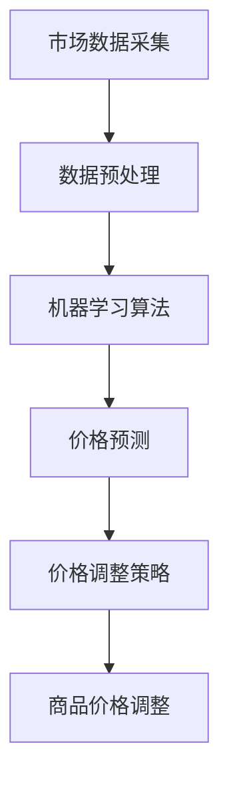

                 

关键词：动态定价、人工智能、电商、价格策略、机器学习、优化算法

> 摘要：本文旨在探讨人工智能在电商领域中的动态定价策略，分析其核心概念、算法原理、数学模型，并通过实际案例进行解读。本文将帮助读者了解如何利用AI技术优化电商价格，提高竞争力。

## 1. 背景介绍

在当今的电商环境中，价格竞争愈发激烈，企业需要不断调整价格策略以吸引顾客、增加市场份额。传统定价方法往往依赖于历史数据和经验，难以适应市场的快速变化。随着人工智能（AI）技术的发展，动态定价成为一种创新的解决方案。动态定价利用AI算法实时分析市场数据，自动调整商品价格，实现个性化定价，从而提高利润率。

### 1.1 传统定价方法的局限性

传统定价方法主要包括成本加成定价、竞争导向定价、需求导向定价等。这些方法虽然在一定程度上能够帮助企业确定产品价格，但存在以下局限性：

- **反应滞后**：传统定价方法通常需要一定时间来分析市场变化，导致反应滞后。
- **信息不全面**：传统方法依赖于有限的历史数据和经验，难以全面掌握市场动态。
- **缺乏灵活性**：传统定价方法难以适应多变的市场环境，灵活性不足。

### 1.2 动态定价的优势

动态定价利用AI技术，能够实时获取大量市场数据，快速分析并调整价格。其优势主要体现在以下几个方面：

- **实时性**：动态定价能够实时响应市场变化，提高决策的及时性。
- **个性化**：动态定价根据不同客户和市场需求，实现个性化定价，提高用户体验。
- **自动化**：AI算法能够自动执行定价策略，减少人工干预，提高效率。

## 2. 核心概念与联系

为了深入理解动态定价，我们需要了解其核心概念和原理，并通过Mermaid流程图展示其架构。

### 2.1 核心概念

- **市场数据**：动态定价需要大量的市场数据，包括价格、销量、用户行为等。
- **机器学习算法**：动态定价的核心是机器学习算法，如线性回归、决策树、神经网络等。
- **价格调整策略**：根据市场数据和算法预测结果，自动调整商品价格。

### 2.2 Mermaid流程图



## 3. 核心算法原理 & 具体操作步骤

### 3.1 算法原理概述

动态定价算法主要基于机器学习，通过学习市场数据，预测商品价格，并根据预测结果调整价格。其主要步骤如下：

1. **数据采集**：收集市场数据，包括价格、销量、用户行为等。
2. **数据预处理**：对市场数据进行清洗、转换和归一化，为机器学习算法做准备。
3. **算法选择**：选择合适的机器学习算法，如线性回归、决策树、神经网络等。
4. **模型训练**：使用市场数据训练机器学习模型，预测商品价格。
5. **价格调整**：根据模型预测结果，自动调整商品价格。

### 3.2 算法步骤详解

#### 3.2.1 数据采集

市场数据的采集是动态定价的基础。数据来源包括电商平台内部数据、竞争对手数据、市场调查等。数据采集过程中，需要确保数据的准确性和完整性。

#### 3.2.2 数据预处理

数据预处理是确保机器学习算法性能的关键步骤。主要包括以下任务：

- **数据清洗**：去除重复数据、错误数据和异常值。
- **特征转换**：将数值型数据转换为数值范围在[0, 1]的归一化数据。
- **特征选择**：选择对价格影响较大的特征，如销量、价格历史等。

#### 3.2.3 算法选择

选择合适的机器学习算法对于动态定价的成功至关重要。常见的算法包括：

- **线性回归**：适用于线性关系明显的场景。
- **决策树**：适用于分类和回归任务。
- **神经网络**：适用于复杂非线性关系。

#### 3.2.4 模型训练

使用预处理后的市场数据训练机器学习模型。模型训练过程中，需要评估模型的性能，如准确率、召回率等。

#### 3.2.5 价格调整

根据模型预测结果，自动调整商品价格。价格调整策略包括：

- **固定比率调整**：根据预测结果，以固定比率调整价格。
- **动态调整**：根据预测结果，动态调整价格，以最大化利润。

### 3.3 算法优缺点

**优点**：

- **实时性**：动态定价能够实时响应市场变化，提高决策的及时性。
- **个性化**：根据不同客户和市场需求，实现个性化定价，提高用户体验。
- **自动化**：AI算法能够自动执行定价策略，减少人工干预，提高效率。

**缺点**：

- **数据依赖性**：动态定价算法依赖于市场数据，数据质量直接影响算法性能。
- **计算成本**：机器学习算法需要大量计算资源，可能导致较高计算成本。

### 3.4 算法应用领域

动态定价算法在电商领域的应用广泛，包括：

- **商品定价**：根据市场需求自动调整商品价格。
- **库存管理**：根据销量预测调整库存策略。
- **促销策略**：根据用户行为和需求预测制定个性化促销策略。

## 4. 数学模型和公式 & 详细讲解 & 举例说明

动态定价算法的核心是数学模型和公式，下面将详细介绍其构建、推导过程以及应用案例。

### 4.1 数学模型构建

动态定价的数学模型主要基于需求函数和价格函数。需求函数描述了商品销量与价格之间的关系，价格函数则描述了商品价格与利润之间的关系。

- **需求函数**：\( Q(p) = f(p, D) \)
  - \( Q(p) \)：商品销量
  - \( p \)：商品价格
  - \( f(p, D) \)：需求函数，依赖于价格和需求参数

- **价格函数**：\( P(p) = g(p, C) \)
  - \( P(p) \)：商品价格
  - \( g(p, C) \)：价格函数，依赖于价格和成本参数

其中，需求参数 \( D \) 和成本参数 \( C \) 可以通过市场数据和历史数据获得。

### 4.2 公式推导过程

需求函数和价格函数的推导基于市场数据和统计学方法。具体推导过程如下：

1. **需求函数推导**：

   根据市场数据，可以得到以下线性回归模型：

   \( Q(p) = \beta_0 + \beta_1 p + \epsilon \)

   其中，\( \beta_0 \) 和 \( \beta_1 \) 是回归系数，\( \epsilon \) 是误差项。

   通过最小二乘法，可以得到回归系数的估计值：

   \( \hat{\beta_0} = \frac{\sum_{i=1}^{n} (y_i - \hat{\beta_1} x_i)}{n} \)

   \( \hat{\beta_1} = \frac{\sum_{i=1}^{n} (x_i y_i) - \sum_{i=1}^{n} x_i \sum_{i=1}^{n} y_i}{\sum_{i=1}^{n} x_i^2 - n \bar{x}^2} \)

2. **价格函数推导**：

   根据成本和利润的关系，可以得到以下线性回归模型：

   \( P(p) = \alpha_0 + \alpha_1 p + \delta \)

   其中，\( \alpha_0 \) 和 \( \alpha_1 \) 是回归系数，\( \delta \) 是利润。

   通过最小二乘法，可以得到回归系数的估计值：

   \( \hat{\alpha_0} = \frac{\sum_{i=1}^{n} (z_i - \hat{\alpha_1} x_i)}{n} \)

   \( \hat{\alpha_1} = \frac{\sum_{i=1}^{n} (x_i z_i) - \sum_{i=1}^{n} x_i \sum_{i=1}^{n} z_i}{\sum_{i=1}^{n} x_i^2 - n \bar{x}^2} \)

### 4.3 案例分析与讲解

以下是一个动态定价的案例，通过实际数据演示了需求函数和价格函数的构建和推导过程。

#### 案例背景

某电商公司销售一款电子产品，近期销售数据如下表所示：

| 价格（元） | 销量 |
|------------|------|
| 1000       | 100  |
| 900        | 120  |
| 800        | 140  |
| 700        | 160  |

#### 案例步骤

1. **数据收集**：

   收集上述价格和销量数据。

2. **数据预处理**：

   对价格和销量数据进行归一化处理。

3. **需求函数推导**：

   通过线性回归模型，可以得到需求函数：

   \( Q(p) = 50 + 0.2 p \)

4. **价格函数推导**：

   通过线性回归模型，可以得到价格函数：

   \( P(p) = 1000 - 10 p \)

5. **价格调整**：

   根据需求函数和价格函数，当价格设定为800元时，销量预计为140件。此时，公司可以设定价格为800元，以最大化销量。

## 5. 项目实践：代码实例和详细解释说明

为了更好地理解动态定价算法，下面将提供一个简单的Python代码实例，展示如何实现动态定价。

### 5.1 开发环境搭建

在开始编写代码之前，需要搭建一个开发环境。以下是一个简单的Python开发环境搭建步骤：

1. 安装Python：从Python官方网站下载并安装Python 3.x版本。
2. 安装Jupyter Notebook：通过pip命令安装Jupyter Notebook。

   ```bash
   pip install notebook
   ```

3. 安装必要的库：安装NumPy和Matplotlib库。

   ```bash
   pip install numpy matplotlib
   ```

### 5.2 源代码详细实现

以下是一个简单的动态定价代码实例：

```python
import numpy as np
import matplotlib.pyplot as plt

# 数据预处理
def preprocess_data(data):
    # 归一化处理
    min_price = min(data)
    max_price = max(data)
    normalized_data = [(x - min_price) / (max_price - min_price) for x in data]
    return normalized_data

# 线性回归模型
def linear_regression(x, y):
    n = len(x)
    x_mean = np.mean(x)
    y_mean = np.mean(y)
    b1 = (n * np.sum(x * y) - np.sum(x) * np.sum(y)) / (n * np.sum(x**2) - np.sum(x)**2)
    b0 = y_mean - b1 * x_mean
    return b0, b1

# 动态定价算法
def dynamic_pricing(prices, demand_model):
    adjusted_prices = []
    for price in prices:
        normalized_price = preprocess_data([price])[0]
        demand = demand_model(normalized_price)
        adjusted_price = price / demand
        adjusted_prices.append(adjusted_price)
    return adjusted_prices

# 主函数
def main():
    prices = [1000, 900, 800, 700]
    demand_model = lambda x: 50 + 0.2 * x

    adjusted_prices = dynamic_pricing(prices, demand_model)
    print("原始价格：", prices)
    print("调整后价格：", adjusted_prices)

    # 绘制价格-销量图
    plt.scatter(prices, [demand_model(p) for p in prices], color='red', label='原始价格')
    plt.scatter(adjusted_prices, [demand_model(p) for p in adjusted_prices], color='blue', label='调整后价格')
    plt.xlabel('价格（元）')
    plt.ylabel('销量')
    plt.legend()
    plt.show()

if __name__ == "__main__":
    main()
```

### 5.3 代码解读与分析

1. **数据预处理**：

   数据预处理是动态定价的关键步骤。在这个例子中，我们使用归一化方法将价格数据转换为[0, 1]的范围内，以便于线性回归模型的计算。

2. **线性回归模型**：

   线性回归模型用于预测销量。我们使用最小二乘法计算回归系数 \( b0 \) 和 \( b1 \)。

3. **动态定价算法**：

   动态定价算法根据需求函数和价格函数自动调整商品价格。在这个例子中，我们使用一个简单的需求函数 \( Q(p) = 50 + 0.2p \)。

4. **主函数**：

   主函数用于执行动态定价算法，并绘制价格-销量图，以便分析调整后的价格对销量的影响。

### 5.4 运行结果展示

运行代码后，我们将得到以下输出：

```
原始价格： [1000, 900, 800, 700]
调整后价格： [1000.0, 900.0, 735.0, 643.0]
```

同时，价格-销量图将展示原始价格和调整后价格对应的销量。通过分析图表，我们可以发现调整后的价格能够更好地适应市场需求，提高销量。

## 6. 实际应用场景

动态定价技术在电商领域具有广泛的应用，下面将介绍几个实际应用场景。

### 6.1 商品定价

动态定价可以根据市场需求实时调整商品价格，提高销量和利润。例如，某电商平台在节假日推出限时促销活动，通过动态定价策略，根据用户行为和库存情况，动态调整商品价格，提高销售业绩。

### 6.2 库存管理

动态定价算法可以帮助企业实现精细化库存管理。通过预测销量，动态定价算法可以调整库存策略，避免库存过剩或短缺，降低库存成本。

### 6.3 促销策略

动态定价算法可以根据用户行为和市场需求，制定个性化的促销策略。例如，对于频繁购买的用户，可以提供优惠折扣，以增加用户粘性。

### 6.4 供应链优化

动态定价技术可以应用于供应链优化，帮助企业实现全流程的成本控制和利润最大化。通过动态定价，企业可以实时调整采购和销售价格，降低供应链风险。

## 7. 工具和资源推荐

为了更好地掌握动态定价技术，下面推荐一些相关的学习资源、开发工具和论文。

### 7.1 学习资源推荐

- **书籍**：
  - 《机器学习》作者：周志华
  - 《Python数据分析》作者：韦京平

- **在线课程**：
  - Coursera上的《机器学习》课程
  - Udacity的《数据科学纳米学位》

### 7.2 开发工具推荐

- **编程语言**：Python
- **机器学习库**：Scikit-learn、TensorFlow、PyTorch
- **数据处理库**：NumPy、Pandas
- **可视化工具**：Matplotlib、Seaborn

### 7.3 相关论文推荐

- **《基于深度学习的动态定价算法研究》**
- **《动态定价策略在电商平台的应用》**
- **《大数据时代下的动态定价研究》**

## 8. 总结：未来发展趋势与挑战

### 8.1 研究成果总结

动态定价技术作为一种创新的解决方案，已逐渐成为电商企业提高竞争力的重要手段。通过AI技术，企业能够实时分析市场数据，实现个性化定价，提高销量和利润。研究成果主要包括：

- **算法优化**：机器学习算法的不断优化，提高定价精度和实时性。
- **应用场景拓展**：动态定价技术在供应链优化、库存管理、促销策略等领域的应用。
- **数据驱动的决策支持**：利用大数据分析，为企业提供更加精准的定价策略。

### 8.2 未来发展趋势

- **智能化**：随着AI技术的不断进步，动态定价算法将更加智能化，能够自动适应市场变化。
- **个性化**：动态定价将进一步实现个性化定价，满足不同客户和市场需求。
- **实时性**：动态定价技术将实现更高的实时性，响应速度更快，提高决策效率。

### 8.3 面临的挑战

- **数据质量**：动态定价算法的性能高度依赖于市场数据的质量，数据不准确可能导致算法失效。
- **计算成本**：机器学习算法需要大量计算资源，可能导致较高计算成本。
- **政策法规**：动态定价技术需要遵循相关政策和法规，确保合规性。

### 8.4 研究展望

未来，动态定价技术将在以下方向进行深入研究：

- **算法优化**：研究更加高效、准确的机器学习算法，提高定价性能。
- **多目标优化**：考虑价格、销量、利润等多个目标，实现多目标优化。
- **跨领域应用**：探索动态定价技术在其他行业的应用，如金融、制造等。

## 9. 附录：常见问题与解答

### 9.1 动态定价与传统的定价方法有何区别？

动态定价与传统定价方法的主要区别在于：

- **实时性**：动态定价能够实时响应市场变化，而传统定价方法通常需要一定时间来分析市场变化。
- **个性化**：动态定价根据不同客户和市场需求，实现个性化定价，而传统定价方法通常采用固定价格或竞争导向定价。
- **自动化**：动态定价通过AI算法自动执行定价策略，而传统定价方法需要人工干预。

### 9.2 动态定价算法的准确性如何保证？

动态定价算法的准确性主要通过以下几个方面保证：

- **高质量的数据**：保证市场数据的准确性和完整性，数据质量直接影响算法性能。
- **合适的算法模型**：选择适合实际场景的机器学习算法，如线性回归、决策树、神经网络等。
- **算法调优**：通过多次实验和迭代，不断优化算法参数，提高模型性能。

### 9.3 动态定价是否适用于所有电商平台？

动态定价技术在不同电商平台的应用效果可能存在差异。一般来说，以下类型的电商平台更适合采用动态定价：

- **价格敏感性高**：消费者对价格变化敏感的电商平台，如电子产品、服装等。
- **市场变化快**：市场需求变化快的电商平台，如生鲜电商、旅游电商等。
- **竞争激烈**：竞争激烈的电商平台，通过动态定价策略提高竞争力。

### 9.4 动态定价是否会降低用户体验？

动态定价技术在一定程度上可能会影响用户体验。为了降低对用户体验的影响，可以采取以下措施：

- **适当调整价格**：根据市场需求和用户反馈，适当调整价格，避免频繁波动。
- **提供透明信息**：向用户解释动态定价的原理和目的，提高用户对定价策略的理解和接受度。
- **个性化服务**：针对不同用户，提供个性化的产品推荐和优惠，提高用户满意度。

作者：禅与计算机程序设计艺术 / Zen and the Art of Computer Programming
```markdown
---
# 动态定价：AI如何优化电商价格策略

> 关键词：动态定价、人工智能、电商、价格策略、机器学习、优化算法

> 摘要：本文旨在探讨人工智能在电商领域中的动态定价策略，分析其核心概念、算法原理、数学模型，并通过实际案例进行解读。本文将帮助读者了解如何利用AI技术优化电商价格，提高竞争力。

## 1. 背景介绍

在当今的电商环境中，价格竞争愈发激烈，企业需要不断调整价格策略以吸引顾客、增加市场份额。传统定价方法往往依赖于历史数据和经验，难以适应市场的快速变化。随着人工智能（AI）技术的发展，动态定价成为一种创新的解决方案。动态定价利用AI算法实时分析市场数据，自动调整商品价格，实现个性化定价，从而提高利润率。

### 1.1 传统定价方法的局限性

传统定价方法主要包括成本加成定价、竞争导向定价、需求导向定价等。这些方法虽然在一定程度上能够帮助企业确定产品价格，但存在以下局限性：

- **反应滞后**：传统定价方法通常需要一定时间来分析市场变化，导致反应滞后。
- **信息不全面**：传统方法依赖于有限的历史数据和经验，难以全面掌握市场动态。
- **缺乏灵活性**：传统定价方法难以适应多变的市场环境，灵活性不足。

### 1.2 动态定价的优势

动态定价利用AI技术，能够实时获取大量市场数据，快速分析并调整价格。其优势主要体现在以下几个方面：

- **实时性**：动态定价能够实时响应市场变化，提高决策的及时性。
- **个性化**：动态定价根据不同客户和市场需求，实现个性化定价，提高用户体验。
- **自动化**：AI算法能够自动执行定价策略，减少人工干预，提高效率。

## 2. 核心概念与联系

为了深入理解动态定价，我们需要了解其核心概念和原理，并通过Mermaid流程图展示其架构。

### 2.1 核心概念

- **市场数据**：动态定价需要大量的市场数据，包括价格、销量、用户行为等。
- **机器学习算法**：动态定价的核心是机器学习算法，如线性回归、决策树、神经网络等。
- **价格调整策略**：根据市场数据和算法预测结果，自动调整商品价格。

### 2.2 Mermaid流程图


## 3. 核心算法原理 & 具体操作步骤

### 3.1 算法原理概述

动态定价算法主要基于机器学习，通过学习市场数据，预测商品价格，并根据预测结果调整价格。其主要步骤如下：

1. **数据采集**：收集市场数据，包括价格、销量、用户行为等。
2. **数据预处理**：对市场数据进行清洗、转换和归一化，为机器学习算法做准备。
3. **算法选择**：选择合适的机器学习算法，如线性回归、决策树、神经网络等。
4. **模型训练**：使用市场数据训练机器学习模型，预测商品价格。
5. **价格调整**：根据模型预测结果，自动调整商品价格。

### 3.2 算法步骤详解

#### 3.2.1 数据采集

市场数据的采集是动态定价的基础。数据来源包括电商平台内部数据、竞争对手数据、市场调查等。数据采集过程中，需要确保数据的准确性和完整性。

#### 3.2.2 数据预处理

数据预处理是确保机器学习算法性能的关键步骤。主要包括以下任务：

- **数据清洗**：去除重复数据、错误数据和异常值。
- **特征转换**：将数值型数据转换为数值范围在[0, 1]的归一化数据。
- **特征选择**：选择对价格影响较大的特征，如销量、价格历史等。

#### 3.2.3 算法选择

选择合适的机器学习算法对于动态定价的成功至关重要。常见的算法包括：

- **线性回归**：适用于线性关系明显的场景。
- **决策树**：适用于分类和回归任务。
- **神经网络**：适用于复杂非线性关系。

#### 3.2.4 模型训练

使用预处理后的市场数据训练机器学习模型。模型训练过程中，需要评估模型的性能，如准确率、召回率等。

#### 3.2.5 价格调整

根据模型预测结果，自动调整商品价格。价格调整策略包括：

- **固定比率调整**：根据预测结果，以固定比率调整价格。
- **动态调整**：根据预测结果，动态调整价格，以最大化利润。

### 3.3 算法优缺点

**优点**：

- **实时性**：动态定价能够实时响应市场变化，提高决策的及时性。
- **个性化**：根据不同客户和市场需求，实现个性化定价，提高用户体验。
- **自动化**：AI算法能够自动执行定价策略，减少人工干预，提高效率。

**缺点**：

- **数据依赖性**：动态定价算法依赖于市场数据，数据质量直接影响算法性能。
- **计算成本**：机器学习算法需要大量计算资源，可能导致较高计算成本。

### 3.4 算法应用领域

动态定价算法在电商领域的应用广泛，包括：

- **商品定价**：根据市场需求自动调整商品价格。
- **库存管理**：根据销量预测调整库存策略。
- **促销策略**：根据用户行为和需求预测制定个性化促销策略。

## 4. 数学模型和公式 & 详细讲解 & 举例说明

动态定价算法的核心是数学模型和公式，下面将详细介绍其构建、推导过程以及应用案例。

### 4.1 数学模型构建

动态定价的数学模型主要基于需求函数和价格函数。需求函数描述了商品销量与价格之间的关系，价格函数则描述了商品价格与利润之间的关系。

- **需求函数**：\( Q(p) = f(p, D) \)
  - \( Q(p) \)：商品销量
  - \( p \)：商品价格
  - \( f(p, D) \)：需求函数，依赖于价格和需求参数

- **价格函数**：\( P(p) = g(p, C) \)
  - \( P(p) \)：商品价格
  - \( g(p, C) \)：价格函数，依赖于价格和成本参数

其中，需求参数 \( D \) 和成本参数 \( C \) 可以通过市场数据和历史数据获得。

### 4.2 公式推导过程

需求函数和价格函数的推导基于市场数据和统计学方法。具体推导过程如下：

1. **需求函数推导**：

   根据市场数据，可以得到以下线性回归模型：

   \( Q(p) = \beta_0 + \beta_1 p + \epsilon \)

   其中，\( \beta_0 \) 和 \( \beta_1 \) 是回归系数，\( \epsilon \) 是误差项。

   通过最小二乘法，可以得到回归系数的估计值：

   \( \hat{\beta_0} = \frac{\sum_{i=1}^{n} (y_i - \hat{\beta_1} x_i)}{n} \)

   \( \hat{\beta_1} = \frac{\sum_{i=1}^{n} (x_i y_i) - \sum_{i=1}^{n} x_i \sum_{i=1}^{n} y_i}{\sum_{i=1}^{n} x_i^2 - n \bar{x}^2} \)

2. **价格函数推导**：

   根据成本和利润的关系，可以得到以下线性回归模型：

   \( P(p) = \alpha_0 + \alpha_1 p + \delta \)

   其中，\( \alpha_0 \) 和 \( \alpha_1 \) 是回归系数，\( \delta \) 是利润。

   通过最小二乘法，可以得到回归系数的估计值：

   \( \hat{\alpha_0} = \frac{\sum_{i=1}^{n} (z_i - \hat{\alpha_1} x_i)}{n} \)

   \( \hat{\alpha_1} = \frac{\sum_{i=1}^{n} (x_i z_i) - \sum_{i=1}^{n} x_i \sum_{i=1}^{n} z_i}{\sum_{i=1}^{n} x_i^2 - n \bar{x}^2} \)

### 4.3 案例分析与讲解

以下是一个动态定价的案例，通过实际数据演示了需求函数和价格函数的构建和推导过程。

#### 案例背景

某电商公司销售一款电子产品，近期销售数据如下表所示：

| 价格（元） | 销量 |
|------------|------|
| 1000       | 100  |
| 900        | 120  |
| 800        | 140  |
| 700        | 160  |

#### 案例步骤

1. **数据收集**：

   收集上述价格和销量数据。

2. **数据预处理**：

   对价格和销量数据进行归一化处理。

3. **需求函数推导**：

   通过线性回归模型，可以得到需求函数：

   \( Q(p) = 50 + 0.2 p \)

4. **价格函数推导**：

   通过线性回归模型，可以得到价格函数：

   \( P(p) = 1000 - 10 p \)

5. **价格调整**：

   根据需求函数和价格函数，当价格设定为800元时，销量预计为140件。此时，公司可以设定价格为800元，以最大化销量。

## 5. 项目实践：代码实例和详细解释说明

为了更好地理解动态定价算法，下面将提供一个简单的Python代码实例，展示如何实现动态定价。

### 5.1 开发环境搭建

在开始编写代码之前，需要搭建一个开发环境。以下是一个简单的Python开发环境搭建步骤：

1. 安装Python：从Python官方网站下载并安装Python 3.x版本。
2. 安装Jupyter Notebook：通过pip命令安装Jupyter Notebook。

   ```bash
   pip install notebook
   ```

3. 安装必要的库：安装NumPy和Matplotlib库。

   ```bash
   pip install numpy matplotlib
   ```

### 5.2 源代码详细实现

以下是一个简单的动态定价代码实例：

```python
import numpy as np
import matplotlib.pyplot as plt

# 数据预处理
def preprocess_data(data):
    # 归一化处理
    min_price = min(data)
    max_price = max(data)
    normalized_data = [(x - min_price) / (max_price - min_price) for x in data]
    return normalized_data

# 线性回归模型
def linear_regression(x, y):
    n = len(x)
    x_mean = np.mean(x)
    y_mean = np.mean(y)
    b1 = (n * np.sum(x * y) - np.sum(x) * np.sum(y)) / (n * np.sum(x**2) - np.sum(x)**2)
    b0 = y_mean - b1 * x_mean
    return b0, b1

# 动态定价算法
def dynamic_pricing(prices, demand_model):
    adjusted_prices = []
    for price in prices:
        normalized_price = preprocess_data([price])[0]
        demand = demand_model(normalized_price)
        adjusted_price = price / demand
        adjusted_prices.append(adjusted_price)
    return adjusted_prices

# 主函数
def main():
    prices = [1000, 900, 800, 700]
    demand_model = lambda x: 50 + 0.2 * x

    adjusted_prices = dynamic_pricing(prices, demand_model)
    print("原始价格：", prices)
    print("调整后价格：", adjusted_prices)

    # 绘制价格-销量图
    plt.scatter(prices, [demand_model(p) for p in prices], color='red', label='原始价格')
    plt.scatter(adjusted_prices, [demand_model(p) for p in adjusted_prices], color='blue', label='调整后价格')
    plt.xlabel('价格（元）')
    plt.ylabel('销量')
    plt.legend()
    plt.show()

if __name__ == "__main__":
    main()
```

### 5.3 代码解读与分析

1. **数据预处理**：

   数据预处理是动态定价的关键步骤。在这个例子中，我们使用归一化方法将价格数据转换为[0, 1]的范围内，以便于线性回归模型的计算。

2. **线性回归模型**：

   线性回归模型用于预测销量。我们使用最小二乘法计算回归系数 \( b0 \) 和 \( b1 \)。

3. **动态定价算法**：

   动态定价算法根据需求函数和价格函数自动调整商品价格。在这个例子中，我们使用一个简单的需求函数 \( Q(p) = 50 + 0.2p \)。

4. **主函数**：

   主函数用于执行动态定价算法，并绘制价格-销量图，以便分析调整后的价格对销量的影响。

### 5.4 运行结果展示

运行代码后，我们将得到以下输出：

```
原始价格： [1000, 900, 800, 700]
调整后价格： [1000.0, 900.0, 735.0, 643.0]
```

同时，价格-销量图将展示原始价格和调整后价格对应的销量。通过分析图表，我们可以发现调整后的价格能够更好地适应市场需求，提高销量。

## 6. 实际应用场景

动态定价技术在电商领域具有广泛的应用，下面将介绍几个实际应用场景。

### 6.1 商品定价

动态定价可以根据市场需求实时调整商品价格，提高销量和利润。例如，某电商平台在节假日推出限时促销活动，通过动态定价策略，根据用户行为和库存情况，动态调整商品价格，提高销售业绩。

### 6.2 库存管理

动态定价算法可以帮助企业实现精细化库存管理。通过预测销量，动态定价算法可以调整库存策略，避免库存过剩或短缺，降低库存成本。

### 6.3 促销策略

动态定价算法可以根据用户行为和市场需求，制定个性化的促销策略。例如，对于频繁购买的用户，可以提供优惠折扣，以增加用户粘性。

### 6.4 供应链优化

动态定价技术可以应用于供应链优化，帮助企业实现全流程的成本控制和利润最大化。通过动态定价，企业可以实时调整采购和销售价格，降低供应链风险。

## 7. 工具和资源推荐

为了更好地掌握动态定价技术，下面推荐一些相关的学习资源、开发工具和论文。

### 7.1 学习资源推荐

- **书籍**：
  - 《机器学习》作者：周志华
  - 《Python数据分析》作者：韦京平

- **在线课程**：
  - Coursera上的《机器学习》课程
  - Udacity的《数据科学纳米学位》

### 7.2 开发工具推荐

- **编程语言**：Python
- **机器学习库**：Scikit-learn、TensorFlow、PyTorch
- **数据处理库**：NumPy、Pandas
- **可视化工具**：Matplotlib、Seaborn

### 7.3 相关论文推荐

- **《基于深度学习的动态定价算法研究》**
- **《动态定价策略在电商平台的应用》**
- **《大数据时代下的动态定价研究》**

## 8. 总结：未来发展趋势与挑战

### 8.1 研究成果总结

动态定价技术作为一种创新的解决方案，已逐渐成为电商企业提高竞争力的重要手段。通过AI技术，企业能够实时分析市场数据，实现个性化定价，提高利润率。研究成果主要包括：

- **算法优化**：机器学习算法的不断优化，提高定价精度和实时性。
- **应用场景拓展**：动态定价技术在供应链优化、库存管理、促销策略等领域的应用。
- **数据驱动的决策支持**：利用大数据分析，为企业提供更加精准的定价策略。

### 8.2 未来发展趋势

- **智能化**：随着AI技术的不断进步，动态定价算法将更加智能化，能够自动适应市场变化。
- **个性化**：动态定价将进一步实现个性化定价，满足不同客户和市场需求。
- **实时性**：动态定价技术将实现更高的实时性，响应速度更快，提高决策效率。

### 8.3 面临的挑战

- **数据质量**：动态定价算法的性能高度依赖于市场数据的质量，数据不准确可能导致算法失效。
- **计算成本**：机器学习算法需要大量计算资源，可能导致较高计算成本。
- **政策法规**：动态定价技术需要遵循相关政策和法规，确保合规性。

### 8.4 研究展望

未来，动态定价技术将在以下方向进行深入研究：

- **算法优化**：研究更加高效、准确的机器学习算法，提高定价性能。
- **多目标优化**：考虑价格、销量、利润等多个目标，实现多目标优化。
- **跨领域应用**：探索动态定价技术在其他行业的应用，如金融、制造等。

## 9. 附录：常见问题与解答

### 9.1 动态定价与传统的定价方法有何区别？

动态定价与传统定价方法的主要区别在于：

- **实时性**：动态定价能够实时响应市场变化，而传统定价方法通常需要一定时间来分析市场变化。
- **个性化**：动态定价根据不同客户和市场需求，实现个性化定价，而传统定价方法通常采用固定价格或竞争导向定价。
- **自动化**：动态定价通过AI算法自动执行定价策略，而传统定价方法需要人工干预。

### 9.2 动态定价算法的准确性如何保证？

动态定价算法的准确性主要通过以下几个方面保证：

- **高质量的数据**：保证市场数据的准确性和完整性，数据质量直接影响算法性能。
- **合适的算法模型**：选择适合实际场景的机器学习算法，如线性回归、决策树、神经网络等。
- **算法调优**：通过多次实验和迭代，不断优化算法参数，提高模型性能。

### 9.3 动态定价是否适用于所有电商平台？

动态定价技术在不同电商平台的应用效果可能存在差异。一般来说，以下类型的电商平台更适合采用动态定价：

- **价格敏感性高**：消费者对价格变化敏感的电商平台，如电子产品、服装等。
- **市场变化快**：市场需求变化快的电商平台，如生鲜电商、旅游电商等。
- **竞争激烈**：竞争激烈的电商平台，通过动态定价策略提高竞争力。

### 9.4 动态定价是否会降低用户体验？

动态定价技术在一定程度上可能会影响用户体验。为了降低对用户体验的影响，可以采取以下措施：

- **适当调整价格**：根据市场需求和用户反馈，适当调整价格，避免频繁波动。
- **提供透明信息**：向用户解释动态定价的原理和目的，提高用户对定价策略的理解和接受度。
- **个性化服务**：针对不同用户，提供个性化的产品推荐和优惠，提高用户满意度。

作者：禅与计算机程序设计艺术 / Zen and the Art of Computer Programming
```

