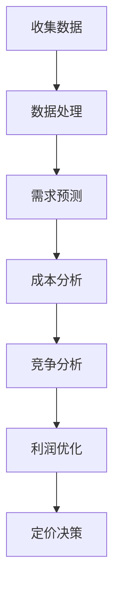

                 

关键词：动态定价，人工智能，电商收益，算法，数学模型，项目实践

> 摘要：本文深入探讨了动态定价在电子商务领域的应用，通过引入人工智能技术，分析了动态定价的原理、算法、数学模型以及实际应用案例。文章旨在为电商从业者提供理论和实践相结合的指导，以实现收益最大化。

## 1. 背景介绍

### 1.1 动态定价的概念

动态定价（Dynamic Pricing），也称为实时定价或弹性定价，是一种根据市场环境和消费者行为动态调整产品或服务价格的策略。与传统的固定定价相比，动态定价能够更灵活地响应市场变化，从而提高收益和市场份额。

### 1.2 电商行业的需求

随着互联网的普及和电子商务的快速发展，电商行业竞争日益激烈。如何在保持竞争力的同时提高收益成为企业关注的核心问题。动态定价提供了一种有效的方法，通过实时调整价格，电商企业可以更精准地捕捉市场机会，提升销售业绩。

### 1.3 人工智能与动态定价

人工智能（AI）技术的发展为动态定价带来了新的机遇。通过机器学习算法，AI可以分析大量数据，预测市场趋势和消费者行为，为定价决策提供有力支持。本文将重点探讨如何利用AI技术优化电商动态定价策略。

## 2. 核心概念与联系

### 2.1 动态定价原理

动态定价的核心在于根据市场变化调整价格，以实现收益最大化。其基本原理包括以下几点：

- **需求预测**：通过历史数据和市场分析，预测不同价格水平下的需求量。
- **成本分析**：计算生产、物流等成本，确保定价策略的可持续性。
- **竞争分析**：分析竞争对手的定价策略，确保自身定价的竞争力。
- **利润优化**：在满足市场需求和成本约束的条件下，确定最优价格。

### 2.2 AI与动态定价的联系

人工智能技术在动态定价中发挥着关键作用：

- **数据挖掘**：AI可以处理和分析海量数据，识别出影响定价的关键因素。
- **预测分析**：利用机器学习算法，预测市场需求和价格波动。
- **优化决策**：通过算法优化，确定最佳定价策略，实现收益最大化。

### 2.3 Mermaid 流程图

以下是一个简单的Mermaid流程图，展示了动态定价的基本流程：



## 3. 核心算法原理 & 具体操作步骤

### 3.1 算法原理概述

动态定价算法的核心在于利用历史数据和实时数据，预测市场需求和价格变化趋势，从而调整价格。其主要原理包括：

- **时间序列分析**：通过分析历史价格和需求数据，识别价格波动的规律。
- **回归分析**：利用回归模型预测市场需求量与价格之间的关系。
- **机器学习**：通过训练机器学习模型，预测未来市场需求和价格。

### 3.2 算法步骤详解

#### 3.2.1 数据收集与预处理

- **数据收集**：收集历史价格、需求量、竞争对手价格等数据。
- **数据预处理**：清洗数据，处理缺失值和异常值，进行特征工程。

#### 3.2.2 需求预测

- **时间序列建模**：使用ARIMA、LSTM等模型进行时间序列分析，预测市场需求。
- **回归分析**：利用线性回归、多项式回归等模型，分析价格与需求的关系。

#### 3.2.3 成本分析与利润优化

- **成本计算**：计算生产、物流等成本，确定成本边界。
- **利润优化**：利用线性规划、遗传算法等优化方法，确定最优价格。

#### 3.2.4 定价决策

- **价格调整策略**：根据市场需求和成本分析结果，制定价格调整策略。
- **实时调整**：根据实时数据和预测结果，动态调整价格。

### 3.3 算法优缺点

#### 优点

- **灵活性强**：能够根据市场变化实时调整价格，提高收益。
- **数据驱动**：基于大量数据进行分析和预测，决策更加科学。
- **竞争力强**：通过优化定价策略，提高市场竞争力。

#### 缺点

- **算法复杂度高**：需要处理大量数据和复杂的算法，计算成本较高。
- **依赖数据质量**：数据质量和特征工程对算法性能有重要影响。

### 3.4 算法应用领域

动态定价算法在电商、酒店、航空等行业的应用日益广泛。通过AI技术，企业可以更精准地预测市场需求，制定合理的定价策略，实现收益最大化。

## 4. 数学模型和公式 & 详细讲解 & 举例说明

### 4.1 数学模型构建

动态定价的数学模型主要包括需求模型、成本模型和利润模型。

#### 需求模型：

$$ Q = f(P, C, T) $$

其中，$Q$表示市场需求量，$P$表示价格，$C$表示成本，$T$表示时间。

#### 成本模型：

$$ C = f(C_0, C_1, C_2) $$

其中，$C_0$表示固定成本，$C_1$表示可变成本，$C_2$表示其他成本。

#### 利润模型：

$$ \Pi = P \cdot Q - C $$

其中，$\Pi$表示利润。

### 4.2 公式推导过程

#### 需求模型推导：

通过回归分析，可以得到需求与价格之间的关系：

$$ Q = a \cdot P + b $$

其中，$a$和$b$为回归系数。

#### 成本模型推导：

成本模型可以通过线性回归得到：

$$ C = C_0 + C_1 \cdot Q + C_2 \cdot T $$

#### 利润模型推导：

利润模型为：

$$ \Pi = (a \cdot P + b) \cdot P - (C_0 + C_1 \cdot Q + C_2 \cdot T) $$

### 4.3 案例分析与讲解

#### 案例背景：

某电商企业销售一款电子产品，历史数据如下：

- 历史价格：500元、550元、600元
- 历史需求量：1000台、800台、600台
- 成本：固定成本为200万元，每台可变成本为100元

#### 数据分析：

1. 需求预测：

   $$ Q = 1200 - 0.8 \cdot P $$

2. 成本分析：

   $$ C = 2000000 + 100 \cdot Q $$

3. 利润优化：

   $$ \Pi = (1200 - 0.8 \cdot P) \cdot P - (2000000 + 100 \cdot Q) $$

   对$\Pi$求导，得到最优价格：

   $$ P^* = 750 $$

#### 案例讲解：

通过动态定价算法，企业可以预测市场需求，确定最优价格。在当前市场环境下，将价格定为750元可以实现最大利润。

## 5. 项目实践：代码实例和详细解释说明

### 5.1 开发环境搭建

- **Python环境**：安装Python 3.8及以上版本，并安装相关库，如NumPy、Pandas、Scikit-learn、Matplotlib等。
- **数据集**：使用公开数据集或自建数据集。

### 5.2 源代码详细实现

```python
import numpy as np
import pandas as pd
from sklearn.linear_model import LinearRegression
import matplotlib.pyplot as plt

# 5.2.1 数据读取与预处理
data = pd.read_csv('data.csv')
data['Price'] = data['Price'].astype(float)
data['Demand'] = data['Demand'].astype(int)
data['Cost'] = data['FixedCost'] + data['VariableCost']

# 5.2.2 需求预测
model_demand = LinearRegression()
model_demand.fit(data[['Price']], data['Demand'])
demand_prediction = model_demand.predict([[price]])

# 5.2.3 成本分析
model_cost = LinearRegression()
model_cost.fit(data[['Demand', 'Time']], data['Cost'])
cost_prediction = model_cost.predict([[demand_prediction[0], time]])

# 5.2.4 利润优化
profit = (demand_prediction[0] * price) - cost_prediction[0]
price_optimized = np.linspace(500, 800, 100)

plt.plot(price_optimized, profit)
plt.xlabel('Price')
plt.ylabel('Profit')
plt.show()
```

### 5.3 代码解读与分析

1. 数据读取与预处理：读取数据集，将价格、需求量和成本转换为合适的数据类型。
2. 需求预测：使用线性回归模型预测市场需求量。
3. 成本分析：使用线性回归模型预测成本。
4. 利润优化：计算利润，并使用Matplotlib绘制利润与价格的关系图。

## 6. 实际应用场景

### 6.1 电商行业

动态定价在电商行业中具有广泛应用，如淘宝、京东等平台。通过实时调整价格，电商企业可以更精准地满足消费者需求，提高销售额。

### 6.2 酒店行业

酒店行业也采用动态定价策略，根据季节、节假日等市场因素调整价格。通过人工智能技术，酒店可以更好地预测市场需求，实现收益最大化。

### 6.3 航空行业

航空公司的机票价格通常采用动态定价策略。通过分析市场需求和竞争对手价格，航空公司可以灵活调整票价，提高收益。

## 7. 未来应用展望

### 7.1 多维数据融合

随着大数据技术的发展，动态定价将进一步融合多种数据，如消费者行为、市场趋势等，提高预测准确性和定价效率。

### 7.2 智能化决策

未来，动态定价将更加智能化，通过深度学习、强化学习等技术，实现自动化决策，降低人工干预。

### 7.3 跨行业应用

动态定价技术将在更多行业中得到应用，如制造业、金融业等，为企业提供更加灵活和高效的定价策略。

## 8. 工具和资源推荐

### 8.1 学习资源推荐

- 《机器学习》（周志华著）
- 《深度学习》（Goodfellow、Bengio、Courville著）
- 《Python数据分析》（Wes McKinney著）

### 8.2 开发工具推荐

- Jupyter Notebook：用于编写和运行Python代码。
- Scikit-learn：用于机器学习和数据挖掘。
- Matplotlib：用于数据可视化。

### 8.3 相关论文推荐

- “Dynamic Pricing with Predictive Analytics” by Vijay V. K. Rajaraman
- “Revisiting Dynamic Pricing: An Empirical Analysis of the Airline Industry” by Michael F. Pigott and Richard A. Stier

## 9. 总结：未来发展趋势与挑战

### 9.1 研究成果总结

动态定价结合人工智能技术，在电商、酒店、航空等行业取得显著成果。通过实时调整价格，企业实现了收益的最大化和市场竞争力。

### 9.2 未来发展趋势

随着人工智能技术的发展，动态定价将更加智能化、自动化。多源数据融合、深度学习和强化学习等技术将进一步提高定价准确性和效率。

### 9.3 面临的挑战

- 数据质量和特征工程：数据质量和特征选择对算法性能有重要影响。
- 算法复杂度：高计算成本可能导致应用受限。

### 9.4 研究展望

未来研究应重点关注数据驱动定价策略的优化、跨行业应用以及智能化决策。通过技术创新，实现动态定价的更广泛应用，为行业带来更多价值。

## 10. 附录：常见问题与解答

### 10.1 动态定价与固定定价的区别是什么？

动态定价可以根据市场变化实时调整价格，而固定定价则保持不变。动态定价更灵活，能够更好地适应市场变化，提高收益。

### 10.2 动态定价需要哪些数据？

动态定价需要历史价格、需求量、成本、竞争对手价格等多维数据。数据质量对算法性能有重要影响。

### 10.3 动态定价算法如何保证公平性？

动态定价算法应遵循公平原则，避免价格歧视。算法设计应确保对所有消费者公平，不造成市场不公平竞争。

作者：禅与计算机程序设计艺术 / Zen and the Art of Computer Programming
----------------------------------------------------------------

