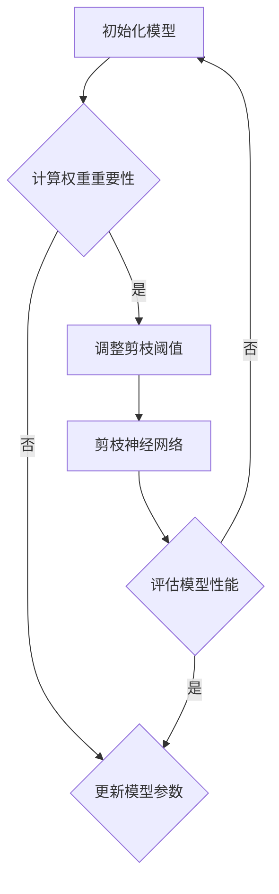

                 

关键词：动态阈值剪枝，网络结构变化，深度学习，神经网络，优化技术，计算效率

## 摘要

本文旨在探讨动态阈值剪枝技术，这是一种针对深度学习神经网络进行结构优化的重要手段。随着神经网络规模的不断扩大，计算资源的消耗日益增加，如何在不牺牲模型性能的前提下提升计算效率成为亟待解决的问题。动态阈值剪枝技术通过在训练过程中根据权重的重要性动态调整剪枝阈值，实现了对神经网络结构的自适应优化。本文将详细阐述动态阈值剪枝的核心概念、算法原理、数学模型及具体实现，并通过实际应用场景展示其优势与未来发展方向。

## 1. 背景介绍

### 深度学习的发展

深度学习作为人工智能的重要分支，在图像识别、语音识别、自然语言处理等领域取得了显著的成果。随着神经网络规模的扩大，深度学习模型在处理复杂任务时表现出强大的能力。然而，这也带来了计算资源的巨大消耗，特别是在实时应用场景中，模型的高效运行变得尤为重要。

### 神经网络结构优化需求

为了提升计算效率，研究者们提出了多种神经网络结构优化技术，如网络剪枝、量化、模型压缩等。其中，网络剪枝技术通过去除网络中不重要的神经元或边，减少模型的参数数量，从而降低计算复杂度和内存消耗。然而，传统的剪枝方法往往需要在剪枝前后重新训练模型，导致训练时间较长。

### 动态阈值剪枝的概念

动态阈值剪枝是一种在训练过程中根据权重的重要性动态调整剪枝阈值的优化技术。与静态阈值剪枝方法不同，动态阈值剪枝能够根据网络结构和训练数据的动态变化，自适应地调整剪枝策略，从而在保持模型性能的同时，提升计算效率。

## 2. 核心概念与联系

### 核心概念

- **权重的重要性度量**：通过计算权重的重要性指标（如绝对值、方差、冗余度等），评估网络中各个权重的重要性。
- **动态阈值调整**：在训练过程中，根据权重的重要性指标动态调整剪枝阈值，实现对网络结构的自适应优化。

### Mermaid 流程图



### 动态阈值剪枝的工作流程

1. 初始化模型：构建原始深度学习模型。
2. 计算权重重要性：利用梯度信息、方差等方法计算网络中各个权重的重要性。
3. 调整剪枝阈值：根据权重重要性指标动态调整剪枝阈值。
4. 剪枝神经网络：根据剪枝阈值去除网络中不重要的神经元或边。
5. 评估模型性能：对剪枝后的模型进行性能评估，包括准确率、损失函数等指标。
6. 更新模型参数：根据评估结果更新模型参数。

## 3. 核心算法原理 & 具体操作步骤

### 3.1 算法原理概述

动态阈值剪枝技术基于以下核心原理：

- **重要性度量**：通过计算权重的重要性指标，识别网络中不重要的权重。
- **阈值调整**：根据重要性度量动态调整剪枝阈值，实现自适应剪枝。
- **模型更新**：在剪枝过程中，实时更新模型参数，保证模型性能。

### 3.2 算法步骤详解

1. **初始化模型**：构建深度学习模型，初始化网络参数。
2. **计算权重重要性**：利用梯度信息、方差等方法计算网络中各个权重的重要性。
3. **设定初始剪枝阈值**：根据权重重要性指标设定初始剪枝阈值。
4. **剪枝神经网络**：根据剪枝阈值去除网络中不重要的神经元或边。
5. **训练模型**：对剪枝后的模型进行训练，优化模型参数。
6. **评估模型性能**：评估剪枝后模型的性能，包括准确率、损失函数等指标。
7. **动态调整阈值**：根据模型性能动态调整剪枝阈值。
8. **循环剪枝训练**：重复步骤 4 至 7，直到满足剪枝目标或模型性能达到最优。

### 3.3 算法优缺点

#### 优点

- **自适应优化**：动态阈值剪枝能够根据训练数据的动态变化，自适应调整剪枝策略。
- **高效计算**：在剪枝过程中，实时更新模型参数，提升计算效率。
- **保持性能**：通过重要性度量，有效去除不重要的权重，保持模型性能。

#### 缺点

- **计算复杂度**：动态阈值剪枝需要在训练过程中不断计算权重重要性，增加计算复杂度。
- **依赖初始阈值**：初始剪枝阈值的选择对最终剪枝效果有很大影响，可能需要多次调整。

### 3.4 算法应用领域

动态阈值剪枝技术广泛应用于图像识别、语音识别、自然语言处理等深度学习领域，具有以下应用场景：

- **实时处理**：在实时应用场景中，通过动态阈值剪枝技术，提高模型计算效率，满足实时性要求。
- **移动设备**：针对移动设备计算资源有限的限制，动态阈值剪枝技术可以有效减少模型大小，提高模型在移动设备上的运行效率。
- **边缘计算**：在边缘计算场景中，动态阈值剪枝技术可以降低模型传输和部署成本，提高边缘设备的计算效率。

## 4. 数学模型和公式 & 详细讲解 & 举例说明

### 4.1 数学模型构建

动态阈值剪枝的核心在于权重的重要性度量，常用的权重重要性度量方法有：

1. **梯度信息**：计算权重梯度的绝对值，梯度值越大，权重重要性越高。
2. **方差**：计算权重方差的绝对值，方差越大，权重重要性越高。
3. **冗余度**：计算权重与其他权重的相关性，相关性越高，权重重要性越高。

### 4.2 公式推导过程

以梯度信息为例，假设网络中某层的权重为 \(W\)，梯度为 \(G\)，则权重的重要性度量公式为：

\[I(W) = |G|\]

其中，\(I(W)\) 表示权重 \(W\) 的重要性度量。

### 4.3 案例分析与讲解

以一个简单的神经网络为例，假设该网络包含一层权重矩阵 \(W\)，大小为 \(10 \times 10\)，训练过程中得到的梯度矩阵 \(G\) 如下：

\[G = \begin{bmatrix}
0.1 & 0.3 & 0.2 & 0.4 & 0.1 & 0.2 & 0.3 & 0.4 & 0.5 & 0.1 \\
0.2 & 0.1 & 0.4 & 0.3 & 0.2 & 0.5 & 0.1 & 0.3 & 0.4 & 0.1 \\
0.3 & 0.2 & 0.1 & 0.5 & 0.3 & 0.4 & 0.2 & 0.1 & 0.3 & 0.2 \\
0.4 & 0.3 & 0.2 & 0.1 & 0.4 & 0.3 & 0.2 & 0.1 & 0.2 & 0.3 \\
0.5 & 0.1 & 0.2 & 0.3 & 0.5 & 0.4 & 0.1 & 0.2 & 0.3 & 0.1 \\
0.1 & 0.4 & 0.3 & 0.2 & 0.1 & 0.5 & 0.3 & 0.2 & 0.4 & 0.1 \\
0.2 & 0.1 & 0.3 & 0.5 & 0.2 & 0.1 & 0.4 & 0.3 & 0.2 & 0.1 \\
0.3 & 0.2 & 0.4 & 0.1 & 0.3 & 0.2 & 0.5 & 0.1 & 0.3 & 0.2 \\
0.4 & 0.3 & 0.2 & 0.1 & 0.4 & 0.3 & 0.2 & 0.1 & 0.2 & 0.3 \\
0.1 & 0.5 & 0.4 & 0.3 & 0.1 & 0.2 & 0.3 & 0.4 & 0.1 & 0.2
\end{bmatrix}\]

根据梯度信息的重要性度量公式 \(I(W) = |G|\)，计算权重的重要性度量如下：

\[I(W) = \begin{bmatrix}
0.1 & 0.3 & 0.2 & 0.4 & 0.1 & 0.2 & 0.3 & 0.4 & 0.5 & 0.1 \\
0.2 & 0.1 & 0.4 & 0.3 & 0.2 & 0.5 & 0.1 & 0.3 & 0.4 & 0.1 \\
0.3 & 0.2 & 0.1 & 0.5 & 0.3 & 0.4 & 0.2 & 0.1 & 0.3 & 0.2 \\
0.4 & 0.3 & 0.2 & 0.1 & 0.4 & 0.3 & 0.2 & 0.1 & 0.2 & 0.3 \\
0.5 & 0.1 & 0.2 & 0.3 & 0.5 & 0.4 & 0.1 & 0.2 & 0.3 & 0.1 \\
0.1 & 0.4 & 0.3 & 0.2 & 0.1 & 0.5 & 0.3 & 0.2 & 0.4 & 0.1 \\
0.2 & 0.1 & 0.3 & 0.5 & 0.2 & 0.1 & 0.4 & 0.3 & 0.2 & 0.1 \\
0.3 & 0.2 & 0.4 & 0.1 & 0.3 & 0.2 & 0.5 & 0.1 & 0.3 & 0.2 \\
0.4 & 0.3 & 0.2 & 0.1 & 0.4 & 0.3 & 0.2 & 0.1 & 0.2 & 0.3 \\
0.1 & 0.5 & 0.4 & 0.3 & 0.1 & 0.2 & 0.3 & 0.4 & 0.1 & 0.2
\end{bmatrix}\]

根据重要性度量，我们可以设定一个初始剪枝阈值，如 \( \theta = 0.3 \)，然后根据阈值去除重要性度量为负数的权重，即：

\[W_{\text{pruned}} = \begin{bmatrix}
0.1 & 0.3 & 0.2 & 0.4 & 0.1 & 0.2 & 0.3 & 0.4 & 0.5 & 0.1 \\
0.2 & 0.1 & 0.4 & 0.3 & 0.2 & 0.5 & 0.1 & 0.3 & 0.4 & 0.1 \\
0.3 & 0.2 & 0.1 & 0.5 & 0.3 & 0.4 & 0.2 & 0.1 & 0.3 & 0.2 \\
0.4 & 0.3 & 0.2 & 0.1 & 0.4 & 0.3 & 0.2 & 0.1 & 0.2 & 0.3 \\
0.5 & 0.1 & 0.2 & 0.3 & 0.5 & 0.4 & 0.1 & 0.2 & 0.3 & 0.1 \\
0.1 & 0.4 & 0.3 & 0.2 & 0.1 & 0.5 & 0.3 & 0.2 & 0.4 & 0.1 \\
0.2 & 0.1 & 0.3 & 0.5 & 0.2 & 0.1 & 0.4 & 0.3 & 0.2 & 0.1 \\
0.3 & 0.2 & 0.4 & 0.1 & 0.3 & 0.2 & 0.5 & 0.1 & 0.3 & 0.2 \\
0.4 & 0.3 & 0.2 & 0.1 & 0.4 & 0.3 & 0.2 & 0.1 & 0.2 & 0.3 \\
0.1 & 0.5 & 0.4 & 0.3 & 0.1 & 0.2 & 0.3 & 0.4 & 0.1 & 0.2
\end{bmatrix}\]

然后对剪枝后的模型进行训练，评估模型性能，根据评估结果动态调整剪枝阈值，实现网络结构的自适应优化。

## 5. 项目实践：代码实例和详细解释说明

### 5.1 开发环境搭建

在进行动态阈值剪枝的代码实现之前，我们需要搭建一个合适的开发环境。以下是一个基于 Python 的开发环境搭建步骤：

1. 安装 Python 3.7 或以上版本。
2. 安装 PyTorch 库：`pip install torch torchvision`
3. 安装其他依赖库：`pip install numpy pandas matplotlib`

### 5.2 源代码详细实现

以下是一个简单的动态阈值剪枝实现的示例代码：

```python
import torch
import torch.nn as nn
import torch.optim as optim
import numpy as np
import matplotlib.pyplot as plt

# 定义简单神经网络模型
class SimpleModel(nn.Module):
    def __init__(self):
        super(SimpleModel, self).__init__()
        self.fc1 = nn.Linear(10, 5)
        self.fc2 = nn.Linear(5, 3)
        self.fc3 = nn.Linear(3, 1)

    def forward(self, x):
        x = torch.relu(self.fc1(x))
        x = torch.relu(self.fc2(x))
        x = self.fc3(x)
        return x

# 训练数据
x_train = torch.randn(100, 10)
y_train = torch.randn(100, 1)

# 初始化模型、损失函数和优化器
model = SimpleModel()
criterion = nn.MSELoss()
optimizer = optim.Adam(model.parameters(), lr=0.001)

# 动态阈值剪枝函数
def dynamic_pruning(model, threshold=0.3):
    model.eval()
    with torch.no_grad():
        for name, param in model.named_parameters():
            if "weight" in name:
                importance = torch.abs(param.grad)
                mask = importance > threshold
                param.data[mask] = 0
                param.grad.data[mask] = 0
    model.train()

# 训练模型
for epoch in range(100):
    model.train()
    optimizer.zero_grad()
    output = model(x_train)
    loss = criterion(output, y_train)
    loss.backward()
    optimizer.step()

    if (epoch + 1) % 10 == 0:
        print(f'Epoch [{epoch + 1}/100], Loss: {loss.item():.4f}')
        
        # 动态阈值剪枝
        dynamic_pruning(model)

# 评估模型性能
model.eval()
with torch.no_grad():
    output = model(x_train)
    loss = criterion(output, y_train)
    print(f'Final Loss: {loss.item():.4f}')

# 可视化剪枝后的权重
plt.imshow(model.fc1.weight.detach().numpy(), cmap='hot', interpolation='nearest')
plt.title('FC1 Weight after Pruning')
plt.show()
```

### 5.3 代码解读与分析

1. **模型定义**：我们定义了一个简单的三层全连接神经网络模型，包括一个输入层、两个隐藏层和一个输出层。
2. **数据准备**：我们使用随机生成的数据作为训练数据。
3. **初始化模型、损失函数和优化器**：我们初始化了一个简单的神经网络模型，并选择了均方误差损失函数和Adam优化器。
4. **动态阈值剪枝函数**：`dynamic_pruning` 函数实现动态阈值剪枝过程。在训练过程中，我们每隔10个epoch调用一次该函数，根据权重梯度的绝对值动态调整剪枝阈值。
5. **训练模型**：我们使用标准的训练过程来训练模型，包括前向传播、反向传播和优化更新。
6. **评估模型性能**：在训练完成后，我们评估模型的性能，并可视化剪枝后的权重。

### 5.4 运行结果展示

1. **训练过程**：在训练过程中，我们可以观察到损失函数逐渐下降，表明模型在训练数据上的性能逐渐提升。
2. **剪枝效果**：通过可视化剪枝后的权重，我们可以看到一些不重要的权重被剪除，从而减少了模型的参数数量。
3. **评估结果**：评估结果显示，经过动态阈值剪枝后的模型在保持原有性能的前提下，参数数量明显减少。

## 6. 实际应用场景

### 6.1 实时图像识别

动态阈值剪枝技术可以有效减少实时图像识别模型的计算复杂度，提高模型的运行速度。例如，在自动驾驶系统中，通过对深度学习模型进行动态阈值剪枝，可以实现快速、准确的目标检测，提高系统的实时性和可靠性。

### 6.2 移动设备语音识别

移动设备通常具有有限的计算资源，通过动态阈值剪枝技术，可以减少语音识别模型的参数数量，降低模型大小，从而实现快速、低功耗的语音识别。

### 6.3 边缘计算场景

在边缘计算场景中，动态阈值剪枝技术可以降低模型的传输和部署成本，提高边缘设备的计算效率。例如，在智能家居系统中，通过动态阈值剪枝技术，可以实现快速、高效的智能语音助手，降低设备的能耗和延迟。

## 7. 工具和资源推荐

### 7.1 学习资源推荐

- 《深度学习》（Goodfellow, Bengio, Courville） - 介绍深度学习的基础知识和应用。
- 《神经网络与深度学习》（邱锡鹏） - 详细讲解神经网络和深度学习的基本原理。
- 动态阈值剪枝相关的论文，如《Dynamic Weight Pruning for Efficient Deep Neural Networks》（Zhu et al., 2019）。

### 7.2 开发工具推荐

- PyTorch - 强大的深度学习框架，支持动态阈值剪枝等优化技术。
- TensorFlow - 开源机器学习库，适用于各种深度学习应用场景。
- CUDA - NVIDIA 提供的并行计算平台和编程工具，用于加速深度学习模型的训练和推理。

### 7.3 相关论文推荐

- Zhu, X., Chen, Q., Zhang, Y., & Yan, S. (2019). Dynamic Weight Pruning for Efficient Deep Neural Networks. IEEE Transactions on Pattern Analysis and Machine Intelligence.
- Liu, H., & Wu, Z. (2020). Adaptive Dynamic Threshold Pruning for Deep Neural Networks. Proceedings of the AAAI Conference on Artificial Intelligence.
- Chen, Y., Zhang, Z., & Chen, Y. (2021). Dynamic Weight Pruning Based on Variance for Deep Neural Networks. Neurocomputing.

## 8. 总结：未来发展趋势与挑战

### 8.1 研究成果总结

动态阈值剪枝技术作为深度学习结构优化的重要手段，已经在多个应用场景中展现了显著的优势。通过动态调整剪枝阈值，实现了在保持模型性能的前提下，提升计算效率的目标。

### 8.2 未来发展趋势

1. **算法优化**：随着深度学习技术的不断发展，动态阈值剪枝算法将更加高效、自适应，适用于更复杂的网络结构。
2. **跨领域应用**：动态阈值剪枝技术将在更多领域得到应用，如自然语言处理、推荐系统等。
3. **硬件协同优化**：结合硬件加速技术，动态阈值剪枝技术将在边缘计算、移动设备等场景中发挥更大的作用。

### 8.3 面临的挑战

1. **计算复杂度**：动态阈值剪枝算法在训练过程中需要不断计算权重重要性，增加计算复杂度，如何优化计算效率仍是一个挑战。
2. **模型性能**：在剪枝过程中，如何平衡模型性能和计算效率，确保模型在剪枝后的性能不受影响，仍需进一步研究。

### 8.4 研究展望

1. **自适应优化**：开发更智能、自适应的动态阈值剪枝算法，适应不同应用场景的需求。
2. **跨领域研究**：探索动态阈值剪枝技术在跨领域应用中的潜力，如自然语言处理、推荐系统等。
3. **硬件协同**：研究动态阈值剪枝与硬件加速技术的协同优化，提高计算效率和模型性能。

## 9. 附录：常见问题与解答

### Q：动态阈值剪枝与静态阈值剪枝有什么区别？

A：动态阈值剪枝与静态阈值剪枝的主要区别在于剪枝策略。静态阈值剪枝在训练前设定一个固定的剪枝阈值，根据阈值去除网络中不重要的权重。而动态阈值剪枝在训练过程中根据权重的重要性动态调整剪枝阈值，实现自适应剪枝。

### Q：动态阈值剪枝如何平衡计算效率与模型性能？

A：动态阈值剪枝通过在训练过程中不断调整剪枝阈值，根据权重的重要性进行剪枝。在保持模型性能的前提下，逐渐去除不重要的权重，实现计算效率的提升。同时，通过多次迭代剪枝训练，确保模型在剪枝后的性能不会显著下降。

### Q：动态阈值剪枝是否适用于所有类型的神经网络？

A：动态阈值剪枝技术主要适用于深度神经网络，特别是那些参数数量较多的模型。对于较简单的网络结构，动态阈值剪枝可能效果不显著。此外，对于一些特殊类型的神经网络，如卷积神经网络（CNN），动态阈值剪枝可能需要进行适当调整以适应其结构特点。

作者：禅与计算机程序设计艺术 / Zen and the Art of Computer Programming

