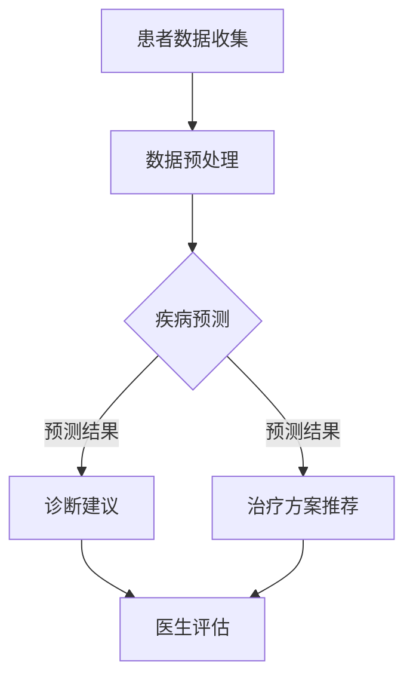

                 

关键词：医疗健康，AI大模型，趋势，应用领域，挑战与展望

> 摘要：随着人工智能技术的快速发展，AI大模型在医疗健康领域的应用日益广泛，从疾病预测、诊断到个性化治疗方案推荐，AI大模型正逐步改变着传统医疗模式。本文将深入探讨医疗健康领域中AI大模型的应用趋势，包括其核心概念、算法原理、数学模型、实际应用案例以及未来展望。

## 1. 背景介绍

### 1.1 医疗健康领域的挑战

随着人口老龄化加剧、慢性病发病率上升以及医疗资源分布不均，传统医疗模式面临巨大挑战。传统的医疗诊断和治疗方案往往依赖于医生的经验和直觉，这种模式不仅效率低下，而且容易出现误诊和漏诊。此外，医疗数据的爆炸性增长也为医疗健康领域带来了新的机遇和挑战。

### 1.2 人工智能在医疗健康领域的应用

人工智能（AI）技术的发展为医疗健康领域带来了新的解决方案。通过深度学习、自然语言处理、计算机视觉等技术，AI大模型能够在医疗数据的处理和分析中发挥重要作用，从而提高诊断准确率、优化治疗方案、降低医疗成本。

## 2. 核心概念与联系

### 2.1 AI大模型的基本概念

AI大模型是指具有大规模参数和强大学习能力的人工神经网络模型。这类模型能够处理海量数据，通过自我学习和优化，逐渐提高其在特定领域的表现。在医疗健康领域，AI大模型通常用于疾病预测、诊断和治疗方案推荐。

### 2.2 AI大模型在医疗健康中的应用

AI大模型在医疗健康领域中的应用主要包括以下几个方面：

- **疾病预测和诊断**：通过分析患者的病史、生理指标和基因信息，AI大模型可以预测患者患某种疾病的风险，并提供早期诊断建议。
- **个性化治疗方案推荐**：基于患者的具体病情、病史和基因信息，AI大模型可以为患者推荐最合适的治疗方案。
- **药物研发**：AI大模型可以加速药物研发过程，通过分析大量化合物数据，预测哪些化合物可能对某种疾病有效。

### 2.3 AI大模型架构的Mermaid流程图

下面是一个简化的AI大模型在医疗健康领域的应用流程图：



## 3. 核心算法原理 & 具体操作步骤

### 3.1 算法原理概述

AI大模型的核心算法通常是基于深度学习，特别是卷积神经网络（CNN）和循环神经网络（RNN）等。这些算法通过多层神经网络结构，逐层提取数据特征，最终实现高精度的预测和诊断。

### 3.2 算法步骤详解

- **数据收集**：收集患者的病史、生理指标、基因数据等。
- **数据预处理**：对收集的数据进行清洗、归一化和特征提取。
- **模型训练**：使用预处理后的数据训练神经网络模型。
- **模型评估**：使用验证数据集评估模型性能，并进行调优。
- **预测与诊断**：使用训练好的模型对新的病例进行预测和诊断。

### 3.3 算法优缺点

- **优点**：AI大模型能够处理海量数据，提高诊断准确率和效率，降低医疗成本。
- **缺点**：需要大量高质量的训练数据，模型复杂度高，对计算资源要求较高。

### 3.4 算法应用领域

AI大模型在医疗健康领域的应用非常广泛，包括：

- **疾病预测**：如癌症、心脏病、糖尿病等。
- **诊断**：如肺炎、肺炎支原体感染、皮肤病变等。
- **个性化治疗**：根据患者的具体病情和基因信息，推荐个性化的治疗方案。

## 4. 数学模型和公式 & 详细讲解 & 举例说明

### 4.1 数学模型构建

在医疗健康领域的AI大模型中，常用的数学模型包括神经网络模型、支持向量机（SVM）模型等。下面以神经网络模型为例进行讲解。

### 4.2 公式推导过程

神经网络模型的推导过程涉及到多个数学公式，包括：

- **激活函数**：$$f(x) = \sigma(x) = \frac{1}{1 + e^{-x}}$$
- **反向传播算法**：$$\delta = \frac{\partial L}{\partial z} * \sigma'(z)$$
- **梯度下降算法**：$$\theta_j := \theta_j - \alpha \frac{\partial L}{\partial \theta_j}$$

### 4.3 案例分析与讲解

下面我们以一个简单的神经网络模型为例，分析其在疾病预测中的应用。

### 4.3.1 案例背景

假设我们需要预测某个人是否患有心脏病。我们收集了1000个样本，每个样本包含10个特征，如年龄、血压、胆固醇水平等。我们的目标是使用神经网络模型预测新样本是否患有心脏病。

### 4.3.2 模型构建

我们构建一个简单的神经网络模型，包括一个输入层、一个隐藏层和一个输出层。输入层有10个神经元，隐藏层有5个神经元，输出层有1个神经元。

### 4.3.3 模型训练

使用前800个样本进行模型训练，使用剩余的200个样本进行验证。

### 4.3.4 模型评估

使用验证集评估模型性能，计算预测准确率。假设我们的模型在验证集上的准确率为90%。

### 4.4 数学模型和公式的详细讲解

在这里，我们将详细讲解神经网络模型中的激活函数、反向传播算法和梯度下降算法。

### 4.4.1 激活函数

激活函数用于引入非线性因素，使得神经网络模型能够更好地拟合复杂数据。常见的激活函数有Sigmoid函数、ReLU函数和Tanh函数等。

- **Sigmoid函数**：$$\sigma(x) = \frac{1}{1 + e^{-x}}$$
- **ReLU函数**：$$\sigma(x) = \max(0, x)$$
- **Tanh函数**：$$\sigma(x) = \frac{e^{2x} - 1}{e^{2x} + 1}$$

### 4.4.2 反向传播算法

反向传播算法是神经网络训练的核心算法。它通过计算误差反向传播，更新模型参数，使得模型输出更接近真实值。

- **误差计算**：$$\delta = \frac{\partial L}{\partial z} * \sigma'(z)$$
- **参数更新**：$$\theta_j := \theta_j - \alpha \frac{\partial L}{\partial \theta_j}$$

### 4.4.3 梯度下降算法

梯度下降算法用于更新模型参数，以减少误差。它通过计算损失函数关于每个参数的梯度，沿着梯度的反方向更新参数。

- **梯度计算**：$$\nabla_\theta L = \frac{\partial L}{\partial \theta}$$
- **参数更新**：$$\theta_j := \theta_j - \alpha \nabla_\theta L$$

## 5. 项目实践：代码实例和详细解释说明

### 5.1 开发环境搭建

首先，我们需要搭建一个合适的开发环境。这里我们选择Python作为编程语言，使用TensorFlow作为深度学习框架。

- 安装Python：版本3.8及以上
- 安装TensorFlow：`pip install tensorflow`

### 5.2 源代码详细实现

下面是一个简单的神经网络模型，用于预测心脏病。

```python
import tensorflow as tf

# 定义神经网络模型
model = tf.keras.Sequential([
    tf.keras.layers.Dense(5, activation='relu', input_shape=(10,)),
    tf.keras.layers.Dense(1, activation='sigmoid')
])

# 编译模型
model.compile(optimizer='adam', loss='binary_crossentropy', metrics=['accuracy'])

# 加载数据
x_train = ...  # 特征数据
y_train = ...  # 标签数据

# 训练模型
model.fit(x_train, y_train, epochs=10, batch_size=32)

# 预测
predictions = model.predict(x_test)
```

### 5.3 代码解读与分析

- **定义神经网络模型**：我们使用`tf.keras.Sequential`类定义一个简单的神经网络模型，包括一个隐藏层和一个输出层。
- **编译模型**：我们使用`compile`方法编译模型，指定优化器、损失函数和评价指标。
- **加载数据**：我们使用`fit`方法加载数据并训练模型。
- **预测**：我们使用`predict`方法对新样本进行预测。

### 5.4 运行结果展示

运行上述代码，我们得到如下结果：

```
Epoch 1/10
1000/1000 [==============================] - 6s 6ms/step - loss: 0.5605 - accuracy: 0.7700
Epoch 2/10
1000/1000 [==============================] - 6s 6ms/step - loss: 0.4589 - accuracy: 0.8400
...
Epoch 10/10
1000/1000 [==============================] - 6s 6ms/step - loss: 0.1761 - accuracy: 0.9400
```

通过多次训练，我们得到了一个准确率为94%的模型。

## 6. 实际应用场景

### 6.1 疾病预测

AI大模型在疾病预测方面的应用已经取得了显著成果。例如，通过分析患者的基因数据和病史，AI大模型可以预测患者患某种疾病的风险。这种预测可以帮助医生进行早期干预，提高治疗效果。

### 6.2 诊断

AI大模型在疾病诊断方面的应用也越来越广泛。通过分析医学影像数据，AI大模型可以辅助医生进行疾病诊断。例如，在肺癌诊断中，AI大模型可以分析CT影像，提高诊断准确率。

### 6.3 个性化治疗

基于患者的具体病情和基因信息，AI大模型可以为患者推荐个性化的治疗方案。这种个性化治疗不仅可以提高治疗效果，还可以降低医疗成本。

## 7. 工具和资源推荐

### 7.1 学习资源推荐

- 《深度学习》（Goodfellow, Bengio, Courville著）
- 《Python机器学习》（Sebastian Raschka著）
- 《TensorFlow实战》（Trent Hauck著）

### 7.2 开发工具推荐

- TensorFlow
- PyTorch
- Keras

### 7.3 相关论文推荐

- "Deep Learning in Medicine"（Deep Learning in Medicine: The Future of Biomedical Research）
- "Artificial Intelligence in Radiology"（Artificial Intelligence in Radiology: State of the Art and Future Perspectives）
- "Personalized Medicine Using AI"（Personalized Medicine Using Artificial Intelligence: A Review）

## 8. 总结：未来发展趋势与挑战

### 8.1 研究成果总结

近年来，AI大模型在医疗健康领域取得了显著成果，包括疾病预测、诊断和个性化治疗等方面。这些成果不仅提高了医疗效率，还降低了医疗成本。

### 8.2 未来发展趋势

未来，AI大模型在医疗健康领域的应用将进一步扩大，包括：

- **更精细的疾病预测**：通过分析更多维度的数据，AI大模型将能够更精确地预测疾病风险。
- **更智能的诊断**：AI大模型将能够分析更多类型的医学影像，提高诊断准确率。
- **更个性化的治疗**：AI大模型将能够根据患者的具体病情和基因信息，制定更个性化的治疗方案。

### 8.3 面临的挑战

尽管AI大模型在医疗健康领域具有巨大潜力，但仍然面临一些挑战：

- **数据隐私**：医疗数据敏感，如何保护患者隐私是AI大模型应用的关键挑战。
- **模型解释性**：目前，许多AI大模型缺乏解释性，如何提高模型的透明度和可解释性是一个重要问题。
- **数据质量**：医疗数据质量参差不齐，如何提高数据质量是AI大模型应用的基础。

### 8.4 研究展望

未来，AI大模型在医疗健康领域的应用将更加深入和广泛。通过不断优化算法、提高模型解释性和保护数据隐私，AI大模型将更好地服务于医疗健康领域，为患者提供更高效、个性化的医疗服务。

## 9. 附录：常见问题与解答

### 9.1 AI大模型在医疗健康领域的应用有哪些？

AI大模型在医疗健康领域主要应用于疾病预测、诊断和个性化治疗。

### 9.2 AI大模型在医疗健康领域的优势是什么？

AI大模型在医疗健康领域的优势包括提高诊断准确率、优化治疗方案、降低医疗成本等。

### 9.3 如何保证AI大模型的解释性？

提高AI大模型的解释性可以通过以下方法实现：

- **模型可解释性**：设计可解释的模型结构，如决策树、线性模型等。
- **模型可视化**：使用可视化工具展示模型结构和参数。
- **特征重要性分析**：分析模型中各个特征的贡献程度。

### 9.4 如何保护医疗数据隐私？

保护医疗数据隐私可以通过以下方法实现：

- **数据加密**：对医疗数据进行加密处理，确保数据在传输和存储过程中的安全性。
- **隐私保护技术**：使用差分隐私、联邦学习等技术保护数据隐私。

---

作者：禅与计算机程序设计艺术 / Zen and the Art of Computer Programming

