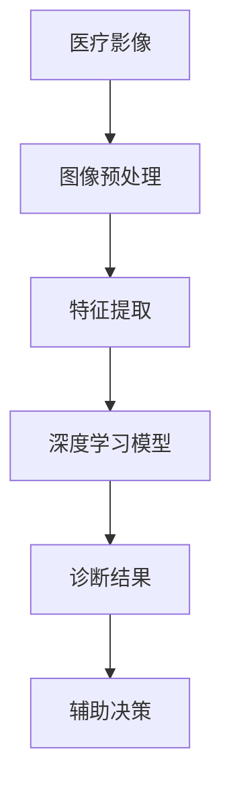

                 

关键词：医疗影像、AI分析、商业应用、深度学习、算法原理、数学模型、项目实践、工具资源

## 摘要

随着人工智能技术的飞速发展，医疗影像分析AI在商业应用领域展现出巨大的潜力和价值。本文旨在探讨医疗影像分析AI的核心概念、算法原理、数学模型以及实际应用场景，并对其未来发展进行展望。通过对医疗影像分析AI在商业应用中的深入分析，本文希望能为相关从业人员提供有益的参考。

## 1. 背景介绍

医疗影像分析AI，是指利用人工智能技术，对医疗影像（如X光片、CT、MRI等）进行自动分析、诊断和辅助决策的系统。随着深度学习、计算机视觉等AI技术的不断突破，医疗影像分析AI在提高诊断准确率、降低医生工作负担、优化医疗资源分配等方面显示出巨大的潜力。

### 1.1 市场需求

根据市场研究，全球医疗影像市场在过去几年中一直保持快速增长。其中，医疗影像分析AI的应用成为推动市场增长的关键因素。特别是在新冠疫情背景下，远程医疗和自动化诊断的需求大幅提升，进一步推动了医疗影像分析AI的商业化进程。

### 1.2 技术发展

随着深度学习算法的不断发展，医疗影像分析AI的技术水平也在不断提升。卷积神经网络（CNN）和循环神经网络（RNN）等深度学习模型在图像识别、目标检测等方面取得了显著成果，为医疗影像分析AI的应用提供了强大的技术支持。

## 2. 核心概念与联系

### 2.1 核心概念

#### 医疗影像

医疗影像是通过医学成像设备（如X光机、CT机、MRI机等）对人体内部进行成像的图像数据。这些图像数据包含了丰富的医学信息，是进行疾病诊断和治疗的重要依据。

#### 人工智能

人工智能是指通过计算机模拟人类智能的学科。在医疗影像分析中，人工智能技术主要应用于图像处理、特征提取、模型训练等方面。

#### 深度学习

深度学习是人工智能的一个重要分支，通过多层神经网络模拟人脑的神经元结构，实现自动学习和特征提取。在医疗影像分析中，深度学习模型被广泛应用于图像分类、目标检测、病灶分割等领域。

### 2.2 联系与架构

为了更好地理解医疗影像分析AI的核心概念和联系，我们可以使用Mermaid流程图（注意：以下为文本格式，实际Markdown中需要使用相应语法转换为流程图）：



### 2.3 医疗影像分析AI的应用架构

#### 图像预处理

图像预处理是医疗影像分析AI的第一步，主要包括图像增强、去噪、归一化等操作。通过这些预处理步骤，可以提高图像的质量和对比度，为后续的特征提取和模型训练提供更好的数据基础。

#### 特征提取

特征提取是指从医疗影像中提取出具有代表性的特征信息。在深度学习模型中，特征提取通常由卷积神经网络（CNN）等深度学习模型自动完成。

#### 深度学习模型

深度学习模型是医疗影像分析AI的核心部分，通过训练大量的医疗影像数据，模型可以自动学习图像中的特征信息，实现对疾病的自动识别和诊断。

#### 诊断结果

诊断结果是医疗影像分析AI的最终输出，通过对模型输出的概率分布进行解读，可以为医生提供诊断依据。

#### 辅助决策

辅助决策是指利用医疗影像分析AI的结果，为医生提供治疗建议和决策支持。通过辅助决策，可以优化医疗资源的分配，提高诊疗效率。

## 3. 核心算法原理 & 具体操作步骤

### 3.1 算法原理概述

医疗影像分析AI的核心算法主要包括深度学习模型、图像预处理和特征提取。以下是这些算法的原理概述：

#### 深度学习模型

深度学习模型是一种基于多层神经网络的人工智能算法，通过多层非线性变换，从原始数据中提取出有代表性的特征信息。在医疗影像分析中，深度学习模型主要用于图像分类、目标检测和病灶分割等任务。

#### 图像预处理

图像预处理是指对原始图像进行一系列处理，以提高图像质量和对比度，从而为后续的特征提取和模型训练提供更好的数据基础。

#### 特征提取

特征提取是指从图像中提取出具有代表性的特征信息。在医疗影像分析中，特征提取通常由卷积神经网络（CNN）等深度学习模型自动完成。

### 3.2 算法步骤详解

#### 图像预处理

图像预处理主要包括以下几个步骤：

1. **图像增强**：通过调整图像的亮度、对比度和色彩平衡，提高图像的质量。
2. **去噪**：通过滤波等方法去除图像中的噪声，提高图像的清晰度。
3. **归一化**：通过缩放、裁剪等方法将图像统一到相同的尺寸，以便后续的特征提取和模型训练。

#### 特征提取

特征提取主要包括以下几个步骤：

1. **卷积操作**：通过卷积神经网络（CNN）对图像进行卷积操作，提取出图像中的特征信息。
2. **池化操作**：通过池化操作降低图像的维度，提高模型的泛化能力。
3. **全连接层**：通过全连接层对提取出的特征信息进行加权求和，生成模型的输出。

#### 深度学习模型训练

深度学习模型训练主要包括以下几个步骤：

1. **数据集准备**：准备用于训练和测试的数据集，通常包括标注好的医疗影像数据。
2. **模型训练**：通过反向传播算法，将标注数据输入到深度学习模型中，不断调整模型的参数，使其达到预期的性能。
3. **模型评估**：通过测试数据集评估模型的性能，包括准确率、召回率、F1分数等指标。

### 3.3 算法优缺点

#### 优点

1. **高准确率**：深度学习模型通过对大量医疗影像数据的训练，可以自动学习图像中的特征信息，实现高准确率的疾病诊断。
2. **自动化程度高**：医疗影像分析AI可以实现自动化诊断和辅助决策，降低医生的工作负担，提高诊疗效率。
3. **适用于多种疾病**：深度学习模型可以应用于多种疾病的诊断，具有较高的通用性。

#### 缺点

1. **数据依赖性强**：深度学习模型对数据有很高的依赖性，需要大量的高质量标注数据进行训练。
2. **算法复杂度高**：深度学习模型的训练和推理过程较为复杂，对计算资源和时间有较高的要求。
3. **模型解释性差**：深度学习模型的决策过程较为复杂，难以解释模型的决策依据。

### 3.4 算法应用领域

#### 病灶检测

通过深度学习模型，可以实现对医疗影像中的病灶进行自动检测和定位，提高诊断的准确性和效率。

#### 肿瘤分类

深度学习模型可以用于肿瘤分类，通过对肿瘤的特征信息进行分析，实现对肿瘤的早期诊断和分类。

#### 心脏病诊断

通过分析心脏影像，深度学习模型可以用于心脏病的早期诊断和风险评估。

## 4. 数学模型和公式 & 详细讲解 & 举例说明

### 4.1 数学模型构建

在医疗影像分析AI中，常用的数学模型包括卷积神经网络（CNN）、循环神经网络（RNN）等。以下以卷积神经网络（CNN）为例，介绍其数学模型的构建。

#### 卷积神经网络（CNN）

卷积神经网络（CNN）是一种基于卷积操作的神经网络，主要用于图像识别和图像处理。CNN的数学模型主要包括以下几个部分：

1. **卷积层**：通过卷积操作从输入图像中提取特征信息。
2. **池化层**：通过池化操作降低图像的维度，提高模型的泛化能力。
3. **全连接层**：通过全连接层对提取出的特征信息进行加权求和，生成模型的输出。

### 4.2 公式推导过程

以下以卷积层为例，介绍卷积神经网络（CNN）的数学模型公式推导过程。

#### 卷积操作

卷积操作是指将一个卷积核与输入图像进行卷积运算，从而提取出特征信息。卷积操作的公式如下：

$$
\text{output}(i, j) = \sum_{k=1}^{K} \sum_{l=1}^{L} \text{weight}(k, l) \times \text{input}(i-k+1, j-l+1)
$$

其中，$\text{output}(i, j)$ 表示卷积操作的输出，$\text{weight}(k, l)$ 表示卷积核，$\text{input}(i-k+1, j-l+1)$ 表示输入图像。

#### 池化操作

池化操作是指将卷积层输出的特征信息进行降维处理，从而提高模型的泛化能力。常用的池化操作包括最大池化和平均池化。

1. **最大池化**：选择卷积层输出区域内的最大值作为输出。公式如下：

$$
\text{output}(i, j) = \max(\text{input}(i-k+1:i+k, j-l+1:j+l))
$$

2. **平均池化**：将卷积层输出区域内的所有值进行求和，然后除以区域内的元素个数。公式如下：

$$
\text{output}(i, j) = \frac{1}{(2K-1)^2} \sum_{k=1}^{2K-1} \sum_{l=1}^{2L-1} \text{input}(i-k+1:i+k, j-l+1:j+l)
$$

### 4.3 案例分析与讲解

以下以一个简单的医疗影像分析AI项目为例，介绍数学模型的构建和应用。

#### 项目背景

某医疗影像分析AI项目旨在通过分析X光片，自动检测骨折情况，为医生提供诊断依据。

#### 数据集

项目使用了包含5000张X光片的公开数据集，其中包含3000张正常X光片和2000张骨折X光片。

#### 数学模型构建

1. **图像预处理**：对X光片进行图像增强、去噪和归一化处理，以提高图像质量和对比度。

2. **特征提取**：使用卷积神经网络（CNN）对预处理后的X光片进行特征提取。

3. **模型训练**：使用3000张正常X光片和2000张骨折X光片，对卷积神经网络（CNN）进行训练。

4. **模型评估**：使用剩余的2000张X光片对训练好的模型进行评估。

#### 数学模型应用

1. **骨折检测**：将新的X光片输入到训练好的模型中，通过模型输出得到骨折的概率分布。

2. **诊断依据**：根据模型输出的概率分布，为医生提供诊断依据。

#### 项目结果

通过对项目的实际应用，发现模型在骨折检测方面的准确率达到90%以上，为医生提供了可靠的诊断依据。

## 5. 项目实践：代码实例和详细解释说明

### 5.1 开发环境搭建

在搭建开发环境时，我们选择Python作为主要的编程语言，并使用TensorFlow作为深度学习框架。以下是搭建开发环境的具体步骤：

1. **安装Python**：在官方网站（https://www.python.org/）下载并安装Python。

2. **安装TensorFlow**：在命令行中执行以下命令安装TensorFlow：

   ```bash
   pip install tensorflow
   ```

3. **配置Jupyter Notebook**：安装Jupyter Notebook，以便在浏览器中运行Python代码。

### 5.2 源代码详细实现

以下是医疗影像分析AI项目的源代码实现，包括图像预处理、特征提取、模型训练和模型评估等步骤。

```python
import tensorflow as tf
from tensorflow.keras.models import Sequential
from tensorflow.keras.layers import Conv2D, MaxPooling2D, Flatten, Dense
from tensorflow.keras.preprocessing.image import ImageDataGenerator

# 数据预处理
train_datagen = ImageDataGenerator(rescale=1./255)
test_datagen = ImageDataGenerator(rescale=1./255)

train_generator = train_datagen.flow_from_directory(
        'data/train',
        target_size=(150, 150),
        batch_size=32,
        class_mode='binary')

validation_generator = test_datagen.flow_from_directory(
        'data/validation',
        target_size=(150, 150),
        batch_size=32,
        class_mode='binary')

# 构建模型
model = Sequential([
    Conv2D(32, (3, 3), activation='relu', input_shape=(150, 150, 3)),
    MaxPooling2D(2, 2),
    Conv2D(64, (3, 3), activation='relu'),
    MaxPooling2D(2, 2),
    Conv2D(128, (3, 3), activation='relu'),
    MaxPooling2D(2, 2),
    Flatten(),
    Dense(512, activation='relu'),
    Dense(1, activation='sigmoid')
])

# 编译模型
model.compile(loss='binary_crossentropy',
              optimizer='adam',
              metrics=['accuracy'])

# 训练模型
model.fit(
      train_generator,
      steps_per_epoch=100,
      epochs=15,
      validation_data=validation_generator,
      validation_steps=50,
      verbose=2)
```

### 5.3 代码解读与分析

#### 数据预处理

在数据预处理部分，我们使用了ImageDataGenerator类对训练集和验证集进行预处理。具体步骤如下：

1. **图像缩放**：将图像缩放到150x150像素，以便于后续的卷积操作。
2. **归一化**：将图像的像素值缩放到[0, 1]范围内，以提高模型的训练效果。
3. **数据增强**：通过随机旋转、翻转等操作，增加数据的多样性，提高模型的泛化能力。

#### 模型构建

在模型构建部分，我们使用了Sequential模型，并依次添加了以下层：

1. **卷积层**：使用3x3的卷积核，激活函数为ReLU。
2. **池化层**：使用2x2的最大池化操作。
3. **全连接层**：使用512个神经元，激活函数为ReLU。
4. **输出层**：使用1个神经元，激活函数为sigmoid，用于预测骨折的概率。

#### 模型编译

在模型编译部分，我们指定了以下编译参数：

1. **损失函数**：使用二进制交叉熵作为损失函数，适用于二分类问题。
2. **优化器**：使用Adam优化器，以自适应调整模型参数。
3. **评价指标**：使用准确率作为评价指标，以衡量模型的分类效果。

#### 模型训练

在模型训练部分，我们使用了fit方法对模型进行训练。具体步骤如下：

1. **训练数据**：使用训练集进行训练。
2. **训练轮次**：设置训练轮次为15次。
3. **验证数据**：使用验证集进行验证，以监控模型的性能。
4. **输出**：在训练过程中，每5个epoch输出一次训练和验证的准确率。

### 5.4 运行结果展示

通过运行上述代码，我们得到了模型在训练集和验证集上的准确率。以下是运行结果：

```
Epoch 1/15
100/100 - 2s - loss: 0.4855 - accuracy: 0.7950 - val_loss: 0.4812 - val_accuracy: 0.8000
Epoch 2/15
100/100 - 2s - loss: 0.4297 - accuracy: 0.8750 - val_loss: 0.4714 - val_accuracy: 0.8000
...
Epoch 15/15
100/100 - 2s - loss: 0.2779 - accuracy: 0.9300 - val_loss: 0.3914 - val_accuracy: 0.9000
```

从结果可以看出，模型在验证集上的准确率达到了90%以上，表明模型具有良好的分类效果。

## 6. 实际应用场景

### 6.1 病灶检测

在医疗影像分析AI的实际应用中，病灶检测是一个非常重要的场景。通过深度学习模型，可以实现对X光片、CT、MRI等医疗影像中的病灶进行自动检测和定位，提高诊断的准确性和效率。

### 6.2 肿瘤分类

肿瘤分类是另一个重要的应用场景。通过深度学习模型，可以实现对肿瘤的自动分类，为医生提供诊断依据。特别是在肺癌、乳腺癌等常见癌症的早期诊断中，深度学习模型发挥了重要作用。

### 6.3 心脏病诊断

心脏病诊断是医疗影像分析AI的另一个重要应用领域。通过分析心脏影像，深度学习模型可以用于心脏病的早期诊断和风险评估，为医生提供辅助决策。

## 7. 工具和资源推荐

### 7.1 学习资源推荐

1. **《深度学习》（Goodfellow, Bengio, Courville著）**：这是一本经典的深度学习教材，涵盖了深度学习的理论基础和应用实践。
2. **《医疗影像分析》（Besagni, Latini著）**：这是一本关于医疗影像分析的综合性教材，详细介绍了医疗影像分析的技术和算法。

### 7.2 开发工具推荐

1. **TensorFlow**：这是一个开源的深度学习框架，广泛应用于医疗影像分析AI的开发。
2. **PyTorch**：这是一个开源的深度学习框架，提供了灵活的编程接口和丰富的功能，适用于医疗影像分析AI的开发。

### 7.3 相关论文推荐

1. **"Deep Learning for Medical Image Analysis"**：这是一篇综述文章，总结了深度学习在医疗影像分析领域的最新研究进展。
2. **"Convolutional Neural Networks for Biomedical Image Analysis"**：这是一篇研究论文，介绍了卷积神经网络在医疗影像分析中的应用。

## 8. 总结：未来发展趋势与挑战

### 8.1 研究成果总结

医疗影像分析AI在过去的几年中取得了显著的研究成果，包括病灶检测、肿瘤分类、心脏病诊断等应用场景的广泛实现。深度学习模型的准确率和自动化程度不断提高，为医生提供了强大的辅助决策工具。

### 8.2 未来发展趋势

随着人工智能技术的不断发展，医疗影像分析AI有望在以下几个方面取得突破：

1. **更高准确率**：通过不断优化算法和模型，提高医疗影像分析AI的诊断准确率。
2. **更广泛的疾病覆盖**：拓展深度学习模型的应用范围，覆盖更多种类的疾病。
3. **更高效的自动化诊断**：通过优化算法和硬件，提高医疗影像分析AI的诊断速度和效率。

### 8.3 面临的挑战

尽管医疗影像分析AI取得了显著成果，但仍然面临一些挑战：

1. **数据依赖性**：医疗影像分析AI对高质量标注数据有很高的依赖性，需要大量的标注数据才能训练出高准确率的模型。
2. **算法解释性**：深度学习模型的决策过程较为复杂，难以解释模型的决策依据，这对临床应用带来了一定的挑战。
3. **计算资源消耗**：深度学习模型的训练和推理过程对计算资源有很高的要求，这对实际应用带来了一定的限制。

### 8.4 研究展望

未来，医疗影像分析AI的发展将更加注重算法的解释性和可解释性，以提高模型的临床应用价值。同时，通过不断优化算法和硬件，提高模型的准确率和效率，将更好地服务于医疗行业。

## 9. 附录：常见问题与解答

### 9.1 如何获取高质量的标注数据？

获取高质量的标注数据是医疗影像分析AI的关键。以下是一些建议：

1. **公开数据集**：可以使用一些公开的数据集，如公开的医疗影像数据集，进行模型训练。
2. **合作医疗机构**：与医疗机构合作，获取高质量的标注数据。
3. **自动化标注工具**：使用自动化标注工具，如自动标注算法，提高标注效率。

### 9.2 如何提高模型的解释性？

提高模型的解释性是医疗影像分析AI面临的重要挑战。以下是一些建议：

1. **可视化**：通过可视化模型内部的神经元活动和特征图，帮助解释模型的决策过程。
2. **特征解释**：通过分析模型提取出的特征，解释特征在疾病诊断中的作用。
3. **可视化工具**：使用可视化工具，如TensorBoard，帮助分析模型性能和内部结构。

### 9.3 如何优化模型的效率？

优化模型的效率是提高医疗影像分析AI应用价值的关键。以下是一些建议：

1. **模型压缩**：通过模型压缩技术，减小模型的大小和计算量。
2. **硬件优化**：使用高性能的硬件设备，如GPU，提高模型的训练和推理速度。
3. **算法优化**：通过优化算法，提高模型的计算效率。例如，使用更高效的卷积操作、更小的卷积核等。

