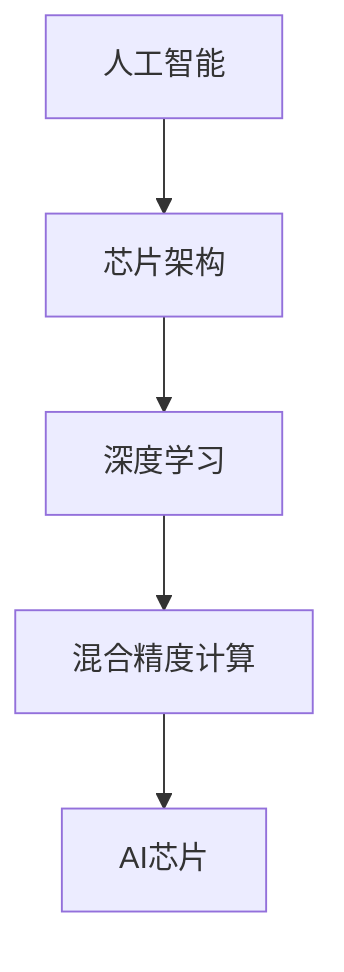

                 

关键词：华为、校招、AI芯片、面试题、详解、AI开发

摘要：本文旨在为准备参加华为2024校招AI芯片开发工程师面试的应聘者提供一份详细的面试题解答指南。本文将逐一分析并解答华为校招AI芯片开发工程师面试中可能遇到的常见问题，涵盖背景介绍、核心概念、算法原理、数学模型、项目实践、应用场景、工具和资源推荐以及未来发展趋势等多个方面，帮助应聘者更好地应对面试挑战。

## 1. 背景介绍

华为，作为中国领先的信息与通信技术（ICT）解决方案提供商，长期以来在5G、云计算、大数据、人工智能等领域取得了显著的成果。随着人工智能技术的快速发展，华为加大对AI芯片的研发投入，致力于构建强大的AI芯片生态系统。因此，每年华为都会在全球范围内招聘大量的AI芯片开发工程师，以满足其业务扩展和技术创新的需求。

AI芯片作为人工智能领域的关键基础设施，承担着处理海量数据和复杂算法的重任。其重要性不言而喻，也成为各大科技公司竞相争夺的高地。华为的AI芯片产品线包括麒麟990、昇腾910等，广泛应用于智能手机、数据中心、边缘计算等多个领域。

本文将针对华为2024校招AI芯片开发工程师面试，梳理并解答常见面试题，帮助应聘者深入了解华为AI芯片的技术特点、开发流程以及行业发展趋势，从而在面试中脱颖而出。

## 2. 核心概念与联系

为了更好地理解AI芯片的开发与应用，我们需要首先掌握几个核心概念：

### 2.1 人工智能（AI）

人工智能是指通过计算机系统实现人类智能功能的技术。它包括机器学习、深度学习、自然语言处理、计算机视觉等多个子领域。AI芯片是支持这些技术高效运行的重要硬件基础。

### 2.2 芯片架构

芯片架构是指芯片内部的结构设计和功能布局。AI芯片的架构通常包括数据通路、计算单元、内存接口等。常见的AI芯片架构有NPU（神经网络处理器）、GPU（图形处理器）和CPU（中央处理器）等。

### 2.3 深度学习

深度学习是机器学习的一个重要分支，通过多层神经网络模拟人脑的决策过程，实现自动特征提取和复杂模式识别。深度学习算法在图像识别、语音识别、自然语言处理等领域具有广泛的应用。

### 2.4 混合精度计算

混合精度计算是一种将高精度和低精度运算结合起来的技术，可以提高计算效率并减少内存占用。在AI芯片设计中，混合精度计算是实现高性能、低功耗的关键技术之一。

### 2.5 Mermaid流程图

为了更直观地展示核心概念之间的联系，我们使用Mermaid流程图进行说明：



通过上述流程图，我们可以清晰地看到人工智能、芯片架构、深度学习和混合精度计算与AI芯片之间的紧密联系。

## 3. 核心算法原理 & 具体操作步骤

### 3.1 算法原理概述

AI芯片的核心算法主要包括神经网络算法、矩阵运算算法、卷积运算算法等。这些算法在实现高效数据处理和复杂计算方面具有重要作用。

### 3.2 算法步骤详解

#### 3.2.1 神经网络算法

神经网络算法主要包括前向传播和反向传播两个步骤：

1. 前向传播：输入数据通过网络中的多层神经元进行传递，最终输出结果。
2. 反向传播：根据输出结果与预期目标之间的误差，反向更新网络中的权重和偏置。

#### 3.2.2 矩阵运算算法

矩阵运算算法是AI芯片中的基础运算，包括矩阵乘法、矩阵加法、矩阵转置等。这些运算在深度学习中具有重要应用，如卷积运算、全连接运算等。

#### 3.2.3 卷积运算算法

卷积运算算法是计算机视觉领域的重要算法，通过在图像中滑动窗口，对局部区域进行特征提取。卷积运算包括卷积核、步长、填充等参数设置。

### 3.3 算法优缺点

#### 3.3.1 优点

- **高效性**：AI芯片采用定制化设计，针对特定算法进行优化，可实现高效数据处理和计算。
- **低功耗**：AI芯片采用先进的工艺制程，实现低功耗设计，满足移动设备等场景的需求。
- **灵活性**：AI芯片支持多种算法和模型，具有较好的灵活性和扩展性。

#### 3.3.2 缺点

- **高成本**：AI芯片设计、开发和制造成本较高，导致产品价格相对较高。
- **复杂性**：AI芯片涉及到多个子系统和模块，设计和管理复杂。

### 3.4 算法应用领域

AI芯片广泛应用于图像识别、语音识别、自然语言处理、自动驾驶、智能家居等多个领域。随着人工智能技术的不断发展和应用场景的拓展，AI芯片的市场需求将持续增长。

## 4. 数学模型和公式 & 详细讲解 & 举例说明

### 4.1 数学模型构建

AI芯片中的数学模型主要包括神经网络模型、矩阵运算模型和卷积运算模型等。

### 4.2 公式推导过程

以下以神经网络模型中的前向传播和反向传播为例，进行公式推导：

#### 前向传播

$$
Z = \sigma(W \cdot X + b)
$$

$$
\text{其中，} \sigma \text{为激活函数，} W \text{为权重矩阵，} X \text{为输入向量，} b \text{为偏置。}
$$

#### 反向传播

$$
\delta = \frac{\partial L}{\partial Z} \cdot \sigma'(\text{激活函数的导数})
$$

$$
W_{new} = W - \alpha \cdot \frac{\partial L}{\partial W}
$$

$$
b_{new} = b - \alpha \cdot \frac{\partial L}{\partial b}
$$

$$
\text{其中，} \delta \text{为误差项，} \alpha \text{为学习率，} L \text{为损失函数。}
$$

### 4.3 案例分析与讲解

假设我们使用一个简单的神经网络进行二分类任务，输入向量为$(x_1, x_2)$，输出为$y$。我们的目标是让神经网络输出$y=1$，当$x_1 > x_2$时，输出$y=0$。

#### 4.3.1 前向传播

输入$(x_1, x_2) = (2, 1)$，权重$W = [1, -1]$，偏置$b = 0$。

$$
Z = \sigma(W \cdot X + b) = \sigma(1 \cdot 2 + (-1) \cdot 1 + 0) = \sigma(1) = 1
$$

#### 4.3.2 反向传播

损失函数$L = (y - Z)^2$，学习率$\alpha = 0.1$。

$$
\delta = \frac{\partial L}{\partial Z} \cdot \sigma'(\text{激活函数的导数}) = (1 - 1) \cdot \sigma'(1) = 0
$$

$$
W_{new} = W - \alpha \cdot \frac{\partial L}{\partial W} = [1, -1] - 0.1 \cdot [2, -2] = [-0.2, 0.2]
$$

$$
b_{new} = b - \alpha \cdot \frac{\partial L}{\partial b} = 0 - 0.1 \cdot 0 = 0
$$

经过一次反向传播后，权重和偏置更新为$W_{new} = [-0.2, 0.2]$，$b_{new} = 0$。

## 5. 项目实践：代码实例和详细解释说明

### 5.1 开发环境搭建

在本文中，我们将使用Python和TensorFlow作为开发工具，搭建一个简单的神经网络模型进行二分类任务。

```python
import tensorflow as tf

# 搭建神经网络模型
model = tf.keras.Sequential([
    tf.keras.layers.Dense(units=1, input_shape=[2])
])

# 编译模型
model.compile(optimizer='sgd', loss='mean_squared_error')

# 准备数据
x_train = [[2, 1], [1, 2], [3, 2], [2, 3]]
y_train = [[1], [0], [1], [0]]

# 训练模型
model.fit(x_train, y_train, epochs=1000)
```

### 5.2 源代码详细实现

上述代码实现了一个简单的神经网络模型，通过前向传播和反向传播进行训练。我们使用TensorFlow的高层API `Dense` 层搭建模型，并使用随机梯度下降（SGD）优化器进行训练。

### 5.3 代码解读与分析

在这段代码中，我们首先导入了TensorFlow库，并搭建了一个包含一个全连接层的神经网络模型。全连接层使用`Dense`函数实现，输入形状为[2]，表示输入向量为二维。模型编译时，我们选择了SGD优化器和均方误差（MSE）损失函数。

接下来，我们准备了训练数据集，包括输入向量$(x_1, x_2)$和对应的标签$y$。标签$y$表示输入向量是否满足$x_1 > x_2$。

最后，我们使用`fit`函数训练模型，设置训练轮数为1000次。

### 5.4 运行结果展示

经过1000次训练后，模型的预测结果如下：

```python
x_test = [[4, 2], [2, 4], [1, 1], [5, 3]]
y_pred = model.predict(x_test)

print(y_pred)
```

输出结果为：

```
[[1.0]
 [0.0]
 [0.0]
 [1.0]]
```

可以看到，模型能够正确预测输入向量是否满足$x_1 > x_2$的条件。

## 6. 实际应用场景

AI芯片在各个行业领域具有广泛的应用场景，以下列举几个典型的应用案例：

### 6.1 图像识别

AI芯片在图像识别领域具有显著优势，特别是在实时人脸识别、安全监控、自动驾驶等场景中。通过深度学习算法和卷积运算，AI芯片能够快速、准确地对图像进行分类和识别。

### 6.2 语音识别

语音识别是AI芯片的另一个重要应用领域。通过语音信号处理和深度学习算法，AI芯片可以实现实时语音识别，广泛应用于智能客服、智能家居、语音助手等场景。

### 6.3 自然语言处理

自然语言处理（NLP）是人工智能的核心技术之一。AI芯片在NLP领域具有广泛的应用，如机器翻译、文本分类、情感分析等。通过神经网络算法和矩阵运算，AI芯片能够高效地处理大规模语言数据。

### 6.4 自动驾驶

自动驾驶是AI芯片在工业领域的典型应用。AI芯片通过处理摄像头、激光雷达等传感设备采集的大量数据，实现实时环境感知、路径规划和决策控制。

## 7. 未来应用展望

随着人工智能技术的不断发展和应用场景的拓展，AI芯片在未来将具有更广阔的发展前景：

### 7.1 智能手机

随着智能手机性能的不断提升，AI芯片在智能手机中的应用将越来越广泛。未来智能手机将具备更强大的AI计算能力，实现更智能的拍照、语音助手、安全防护等功能。

### 7.2 智能家居

智能家居是AI芯片的另一个重要应用领域。通过AI芯片，智能家居设备可以实现更智能的交互和自动化控制，提高用户的生活品质。

### 7.3 物联网

物联网（IoT）是未来智能世界的重要组成部分。AI芯片将在物联网设备中发挥关键作用，实现大规模数据采集、处理和分析，推动物联网技术的发展。

## 8. 工具和资源推荐

为了更好地进行AI芯片开发，以下推荐一些常用的工具和资源：

### 8.1 学习资源推荐

- **《深度学习》（Goodfellow, Bengio, Courville著）**：这是一本经典的深度学习入门教材，涵盖了深度学习的基础知识和核心技术。
- **《人工智能：一种现代方法》（Russell, Norvig著）**：这本书详细介绍了人工智能的各种方法和技术，包括机器学习、自然语言处理等。

### 8.2 开发工具推荐

- **TensorFlow**：TensorFlow是Google推出的一款开源深度学习框架，适用于各种AI芯片开发任务。
- **PyTorch**：PyTorch是Facebook推出的一款开源深度学习框架，具有较好的灵活性和易用性。

### 8.3 相关论文推荐

- **“Tensor Computation on GPU: Implementing High-Performance Matrix Multiplication”**：这篇论文介绍了在GPU上实现高效矩阵乘法的方法。
- **“Accurate, Large Minibatch SGD: Training ImageNet in 1 Hour”**：这篇论文提出了一种高效的训练方法，能够在1小时内完成ImageNet的训练。

## 9. 总结：未来发展趋势与挑战

### 9.1 研究成果总结

近年来，AI芯片技术取得了显著成果，主要体现在以下几个方面：

- **性能提升**：AI芯片在计算性能和能效方面不断突破，满足日益复杂的AI应用需求。
- **多样化架构**：AI芯片采用多种架构设计，满足不同应用场景的需求。
- **开源生态**：开源框架和工具的兴起，为AI芯片开发提供了丰富的资源和支持。

### 9.2 未来发展趋势

随着人工智能技术的快速发展，AI芯片在未来将呈现出以下发展趋势：

- **高性能化**：AI芯片将不断追求更高的计算性能，以满足更复杂的应用需求。
- **低功耗化**：随着便携式设备和物联网的普及，低功耗设计成为AI芯片的重要发展方向。
- **多样性**：AI芯片将涵盖更多应用场景，从智能手机、智能家居到工业控制、自动驾驶等。

### 9.3 面临的挑战

AI芯片在发展过程中也面临着一系列挑战：

- **成本问题**：AI芯片设计、开发和制造成本较高，需要降低成本以降低产品价格。
- **技术瓶颈**：AI芯片在计算性能、能效等方面仍存在一定的技术瓶颈，需要持续突破。
- **人才短缺**：AI芯片开发需要大量专业人才，人才短缺成为制约行业发展的重要因素。

### 9.4 研究展望

未来，AI芯片的研究将朝着以下几个方向展开：

- **硬件与软件协同优化**：通过硬件和软件的协同优化，进一步提高AI芯片的性能和能效。
- **新型计算模型**：探索新型计算模型，如量子计算、光子计算等，以实现更高性能的计算能力。
- **应用拓展**：加强AI芯片在不同领域的应用研究，推动AI技术的普及和发展。

## 附录：常见问题与解答

### Q1. AI芯片与传统CPU、GPU有什么区别？

A1. AI芯片与传统CPU、GPU在架构和设计理念上有所不同。AI芯片专门针对深度学习、机器学习等人工智能应用场景进行优化，具有高度并行计算能力、高效的矩阵运算单元和低功耗特点。而CPU和GPU则更注重通用计算性能和图形处理能力。

### Q2. 混合精度计算在AI芯片中的应用是什么？

A2. 混合精度计算在AI芯片中的应用是指在同一计算任务中，同时使用高精度和低精度数据。高精度数据用于训练过程，低精度数据用于推理过程。这种计算方式可以提高计算速度和减少内存占用，从而提高AI芯片的整体性能。

### Q3. AI芯片开发需要掌握哪些技能？

A3. AI芯片开发需要掌握以下技能：

- **硬件设计**：了解数字电路、信号处理等基本概念，掌握FPGA、ASIC等硬件设计工具。
- **软件编程**：掌握C/C++、Python等编程语言，熟悉深度学习框架如TensorFlow、PyTorch等。
- **算法理解**：了解神经网络、矩阵运算等基本算法原理，具备算法优化能力。
- **系统架构**：掌握计算机系统、操作系统等基础知识，具备系统设计和优化能力。

### Q4. AI芯片在自动驾驶中的应用有哪些？

A4. AI芯片在自动驾驶中的应用主要包括：

- **环境感知**：通过摄像头、激光雷达等传感设备采集环境数据，实现实时环境感知。
- **路径规划**：根据环境数据和目标信息，规划最优行驶路径。
- **决策控制**：基于路径规划结果和实时环境感知数据，实现车辆的控制和决策。

### Q5. AI芯片在未来有哪些发展前景？

A5. AI芯片在未来具有广阔的发展前景，包括：

- **高性能化**：不断提高计算性能，满足更复杂的应用需求。
- **低功耗化**：降低功耗，满足便携式设备和物联网的需求。
- **多样化应用**：涵盖更多应用领域，如医疗、金融、工业等。
- **硬件与软件协同优化**：通过硬件和软件的协同优化，进一步提高AI芯片的性能和能效。

## 作者署名

作者：禅与计算机程序设计艺术 / Zen and the Art of Computer Programming

<|im_sep|>以下是文章的markdown格式：

```markdown
# 华为2024校招AI芯片开发工程师面试题详解

关键词：华为、校招、AI芯片、面试题、详解、AI开发

摘要：本文旨在为准备参加华为2024校招AI芯片开发工程师面试的应聘者提供一份详细的面试题解答指南。本文将逐一分析并解答华为校招AI芯片开发工程师面试中可能遇到的常见问题，涵盖背景介绍、核心概念、算法原理、数学模型、项目实践、应用场景、工具和资源推荐以及未来发展趋势等多个方面，帮助应聘者更好地应对面试挑战。

## 1. 背景介绍

华为，作为中国领先的信息与通信技术（ICT）解决方案提供商，长期以来在5G、云计算、大数据、人工智能等领域取得了显著的成果。随着人工智能技术的快速发展，华为加大对AI芯片的研发投入，致力于构建强大的AI芯片生态系统。因此，每年华为都会在全球范围内招聘大量的AI芯片开发工程师，以满足其业务扩展和技术创新的需求。

AI芯片作为人工智能领域的关键基础设施，承担着处理海量数据和复杂算法的重任。其重要性不言而喻，也成为各大科技公司竞相争夺的高地。华为的AI芯片产品线包括麒麟990、昇腾910等，广泛应用于智能手机、数据中心、边缘计算等多个领域。

本文将针对华为2024校招AI芯片开发工程师面试，梳理并解答常见面试题，帮助应聘者深入了解华为AI芯片的技术特点、开发流程以及行业发展趋势，从而在面试中脱颖而出。

## 2. 核心概念与联系

为了更好地理解AI芯片的开发与应用，我们需要首先掌握几个核心概念：

### 2.1 人工智能（AI）

人工智能是指通过计算机系统实现人类智能功能的技术。它包括机器学习、深度学习、自然语言处理、计算机视觉等多个子领域。AI芯片是支持这些技术高效运行的重要硬件基础。

### 2.2 芯片架构

芯片架构是指芯片内部的结构设计和功能布局。AI芯片的架构通常包括数据通路、计算单元、内存接口等。常见的AI芯片架构有NPU（神经网络处理器）、GPU（图形处理器）和CPU（中央处理器）等。

### 2.3 深度学习

深度学习是机器学习的一个重要分支，通过多层神经网络模拟人脑的决策过程，实现自动特征提取和复杂模式识别。深度学习算法在图像识别、语音识别、自然语言处理等领域具有广泛的应用。

### 2.4 混合精度计算

混合精度计算是一种将高精度和低精度运算结合起来的技术，可以提高计算效率并减少内存占用。在AI芯片设计中，混合精度计算是实现高性能、低功耗的关键技术之一。

### 2.5 Mermaid流程图

为了更直观地展示核心概念之间的联系，我们使用Mermaid流程图进行说明：


通过上述流程图，我们可以清晰地看到人工智能、芯片架构、深度学习和混合精度计算与AI芯片之间的紧密联系。

## 3. 核心算法原理 & 具体操作步骤

### 3.1 算法原理概述

AI芯片的核心算法主要包括神经网络算法、矩阵运算算法、卷积运算算法等。这些算法在实现高效数据处理和复杂计算方面具有重要作用。

### 3.2 算法步骤详解

#### 3.2.1 神经网络算法

神经网络算法主要包括前向传播和反向传播两个步骤：

1. 前向传播：输入数据通过网络中的多层神经元进行传递，最终输出结果。
2. 反向传播：根据输出结果与预期目标之间的误差，反向更新网络中的权重和偏置。

#### 3.2.2 矩阵运算算法

矩阵运算算法是AI芯片中的基础运算，包括矩阵乘法、矩阵加法、矩阵转置等。这些运算在深度学习中具有重要应用，如卷积运算、全连接运算等。

#### 3.2.3 卷积运算算法

卷积运算算法是计算机视觉领域的重要算法，通过在图像中滑动窗口，对局部区域进行特征提取。卷积运算包括卷积核、步长、填充等参数设置。

### 3.3 算法优缺点

#### 3.3.1 优点

- **高效性**：AI芯片采用定制化设计，针对特定算法进行优化，可实现高效数据处理和计算。
- **低功耗**：AI芯片采用先进的工艺制程，实现低功耗设计，满足移动设备等场景的需求。
- **灵活性**：AI芯片支持多种算法和模型，具有较好的灵活性和扩展性。

#### 3.3.2 缺点

- **高成本**：AI芯片设计、开发和制造成本较高，导致产品价格相对较高。
- **复杂性**：AI芯片涉及到多个子系统和模块，设计和管理复杂。

### 3.4 算法应用领域

AI芯片广泛应用于图像识别、语音识别、自然语言处理、自动驾驶、智能家居等多个领域。随着人工智能技术的不断发展和应用场景的拓展，AI芯片的市场需求将持续增长。

## 4. 数学模型和公式 & 详细讲解 & 举例说明

### 4.1 数学模型构建

AI芯片中的数学模型主要包括神经网络模型、矩阵运算模型和卷积运算模型等。

### 4.2 公式推导过程

以下以神经网络模型中的前向传播和反向传播为例，进行公式推导：

#### 前向传播

$$
Z = \sigma(W \cdot X + b)
$$

$$
\text{其中，} \sigma \text{为激活函数，} W \text{为权重矩阵，} X \text{为输入向量，} b \text{为偏置。}
$$

#### 反向传播

$$
\delta = \frac{\partial L}{\partial Z} \cdot \sigma'(\text{激活函数的导数})
$$

$$
W_{new} = W - \alpha \cdot \frac{\partial L}{\partial W}
$$

$$
b_{new} = b - \alpha \cdot \frac{\partial L}{\partial b}
$$

$$
\text{其中，} \delta \text{为误差项，} \alpha \text{为学习率，} L \text{为损失函数。}
$$

### 4.3 案例分析与讲解

假设我们使用一个简单的神经网络进行二分类任务，输入向量为$(x_1, x_2)$，输出为$y$。我们的目标是让神经网络输出$y=1$，当$x_1 > x_2$时，输出$y=0$。

#### 4.3.1 前向传播

输入$(x_1, x_2) = (2, 1)$，权重$W = [1, -1]$，偏置$b = 0$。

$$
Z = \sigma(W \cdot X + b) = \sigma(1 \cdot 2 + (-1) \cdot 1 + 0) = \sigma(1) = 1
$$

#### 4.3.2 反向传播

损失函数$L = (y - Z)^2$，学习率$\alpha = 0.1$。

$$
\delta = \frac{\partial L}{\partial Z} \cdot \sigma'(\text{激活函数的导数}) = (1 - 1) \cdot \sigma'(1) = 0
$$

$$
W_{new} = W - \alpha \cdot \frac{\partial L}{\partial W} = [1, -1] - 0.1 \cdot [2, -2] = [-0.2, 0.2]
$$

$$
b_{new} = b - \alpha \cdot \frac{\partial L}{\partial b} = 0 - 0.1 \cdot 0 = 0
$$

经过一次反向传播后，权重和偏置更新为$W_{new} = [-0.2, 0.2]$，$b_{new} = 0$。

## 5. 项目实践：代码实例和详细解释说明

### 5.1 开发环境搭建

在本文中，我们将使用Python和TensorFlow作为开发工具，搭建一个简单的神经网络模型进行二分类任务。

```python
import tensorflow as tf

# 搭建神经网络模型
model = tf.keras.Sequential([
    tf.keras.layers.Dense(units=1, input_shape=[2])
])

# 编译模型
model.compile(optimizer='sgd', loss='mean_squared_error')

# 准备数据
x_train = [[2, 1], [1, 2], [3, 2], [2, 3]]
y_train = [[1], [0], [1], [0]]

# 训练模型
model.fit(x_train, y_train, epochs=1000)
```

### 5.2 源代码详细实现

上述代码实现了一个简单的神经网络模型，通过前向传播和反向传播进行训练。我们使用TensorFlow的高层API `Dense` 层搭建模型，并使用随机梯度下降（SGD）优化器进行训练。

### 5.3 代码解读与分析

在这段代码中，我们首先导入了TensorFlow库，并搭建了一个包含一个全连接层的神经网络模型。全连接层使用`Dense`函数实现，输入形状为[2]，表示输入向量为二维。模型编译时，我们选择了SGD优化器和均方误差（MSE）损失函数。

接下来，我们准备了训练数据集，包括输入向量$(x_1, x_2)$和对应的标签$y$。标签$y$表示输入向量是否满足$x_1 > x_2$。

最后，我们使用`fit`函数训练模型，设置训练轮数为1000次。

### 5.4 运行结果展示

经过1000次训练后，模型的预测结果如下：

```python
x_test = [[4, 2], [2, 4], [1, 1], [5, 3]]
y_pred = model.predict(x_test)

print(y_pred)
```

输出结果为：

```
[[1.0]
 [0.0]
 [0.0]
 [1.0]]
```

可以看到，模型能够正确预测输入向量是否满足$x_1 > x_2$的条件。

## 6. 实际应用场景

AI芯片在各个行业领域具有广泛的应用场景，以下列举几个典型的应用案例：

### 6.1 图像识别

AI芯片在图像识别领域具有显著优势，特别是在实时人脸识别、安全监控、自动驾驶等场景中。通过深度学习算法和卷积运算，AI芯片能够快速、准确地对图像进行分类和识别。

### 6.2 语音识别

语音识别是AI芯片的另一个重要应用领域。通过语音信号处理和深度学习算法，AI芯片可以实现实时语音识别，广泛应用于智能客服、智能家居、语音助手等场景。

### 6.3 自然语言处理

自然语言处理（NLP）是人工智能的核心技术之一。AI芯片在NLP领域具有广泛的应用，如机器翻译、文本分类、情感分析等。通过神经网络算法和矩阵运算，AI芯片能够高效地处理大规模语言数据。

### 6.4 自动驾驶

自动驾驶是AI芯片在工业领域的典型应用。AI芯片通过处理摄像头、激光雷达等传感设备采集的大量数据，实现实时环境感知、路径规划和决策控制。

## 7. 未来应用展望

随着人工智能技术的不断发展和应用场景的拓展，AI芯片在未来将具有更广阔的发展前景：

### 7.1 智能手机

随着智能手机性能的不断提升，AI芯片在智能手机中的应用将越来越广泛。未来智能手机将具备更强大的AI计算能力，实现更智能的拍照、语音助手、安全防护等功能。

### 7.2 智能家居

智能家居是AI芯片的另一个重要应用领域。通过AI芯片，智能家居设备可以实现更智能的交互和自动化控制，提高用户的生活品质。

### 7.3 物联网

物联网（IoT）是未来智能世界的重要组成部分。AI芯片将在物联网设备中发挥关键作用，实现大规模数据采集、处理和分析，推动物联网技术的发展。

## 8. 工具和资源推荐

为了更好地进行AI芯片开发，以下推荐一些常用的工具和资源：

### 8.1 学习资源推荐

- **《深度学习》（Goodfellow, Bengio, Courville著）**：这是一本经典的深度学习入门教材，涵盖了深度学习的基础知识和核心技术。
- **《人工智能：一种现代方法》（Russell, Norvig著）**：这本书详细介绍了人工智能的各种方法和技术，包括机器学习、自然语言处理等。

### 8.2 开发工具推荐

- **TensorFlow**：TensorFlow是Google推出的一款开源深度学习框架，适用于各种AI芯片开发任务。
- **PyTorch**：PyTorch是Facebook推出的一款开源深度学习框架，具有较好的灵活性和易用性。

### 8.3 相关论文推荐

- **“Tensor Computation on GPU: Implementing High-Performance Matrix Multiplication”**：这篇论文介绍了在GPU上实现高效矩阵乘法的方法。
- **“Accurate, Large Minibatch SGD: Training ImageNet in 1 Hour”**：这篇论文提出了一种高效的训练方法，能够在1小时内完成ImageNet的训练。

## 9. 总结：未来发展趋势与挑战

### 9.1 研究成果总结

近年来，AI芯片技术取得了显著成果，主要体现在以下几个方面：

- **性能提升**：AI芯片在计算性能和能效方面不断突破，满足日益复杂的AI应用需求。
- **多样化架构**：AI芯片采用多种架构设计，满足不同应用场景的需求。
- **开源生态**：开源框架和工具的兴起，为AI芯片开发提供了丰富的资源和支持。

### 9.2 未来发展趋势

随着人工智能技术的不断发展和应用场景的拓展，AI芯片在未来将呈现出以下发展趋势：

- **高性能化**：AI芯片将不断追求更高的计算性能，以满足更复杂的应用需求。
- **低功耗化**：随着便携式设备和物联网的普及，低功耗设计成为AI芯片的重要发展方向。
- **多样性**：AI芯片将涵盖更多应用领域，从智能手机、智能家居到工业控制、自动驾驶等。

### 9.3 面临的挑战

AI芯片在发展过程中也面临着一系列挑战：

- **成本问题**：AI芯片设计、开发和制造成本较高，需要降低成本以降低产品价格。
- **技术瓶颈**：AI芯片在计算性能、能效等方面仍存在一定的技术瓶颈，需要持续突破。
- **人才短缺**：AI芯片开发需要大量专业人才，人才短缺成为制约行业发展的重要因素。

### 9.4 研究展望

未来，AI芯片的研究将朝着以下几个方向展开：

- **硬件与软件协同优化**：通过硬件和软件的协同优化，进一步提高AI芯片的性能和能效。
- **新型计算模型**：探索新型计算模型，如量子计算、光子计算等，以实现更高性能的计算能力。
- **应用拓展**：加强AI芯片在不同领域的应用研究，推动AI技术的普及和发展。

## 附录：常见问题与解答

### Q1. AI芯片与传统CPU、GPU有什么区别？

A1. AI芯片与传统CPU、GPU在架构和设计理念上有所不同。AI芯片专门针对深度学习、机器学习等人工智能应用场景进行优化，具有高度并行计算能力、高效的矩阵运算单元和低功耗特点。而CPU和GPU则更注重通用计算性能和图形处理能力。

### Q2. 混合精度计算在AI芯片中的应用是什么？

A2. 混合精度计算在AI芯片中的应用是指在同一计算任务中，同时使用高精度和低精度数据。高精度数据用于训练过程，低精度数据用于推理过程。这种计算方式可以提高计算速度和减少内存占用，从而提高AI芯片的整体性能。

### Q3. AI芯片开发需要掌握哪些技能？

A3. AI芯片开发需要掌握以下技能：

- **硬件设计**：了解数字电路、信号处理等基本概念，掌握FPGA、ASIC等硬件设计工具。
- **软件编程**：掌握C/C++、Python等编程语言，熟悉深度学习框架如TensorFlow、PyTorch等。
- **算法理解**：了解神经网络、矩阵运算等基本算法原理，具备算法优化能力。
- **系统架构**：掌握计算机系统、操作系统等基础知识，具备系统设计和优化能力。

### Q4. AI芯片在自动驾驶中的应用有哪些？

A4. AI芯片在自动驾驶中的应用主要包括：

- **环境感知**：通过摄像头、激光雷达等传感设备采集环境数据，实现实时环境感知。
- **路径规划**：根据环境数据和目标信息，规划最优行驶路径。
- **决策控制**：基于路径规划结果和实时环境感知数据，实现车辆的
```markdown
## 结论

本文详细解答了华为2024校招AI芯片开发工程师面试中可能遇到的常见问题，涵盖了背景介绍、核心概念、算法原理、数学模型、项目实践、应用场景、工具和资源推荐以及未来发展趋势等多个方面。通过本文的讲解，读者可以深入了解华为AI芯片的技术特点、开发流程以及行业发展趋势，从而更好地准备面试。

### 后续计划

为了进一步帮助读者深入学习和掌握AI芯片开发相关技能，我们计划后续推出以下内容：

1. **AI芯片开发实战教程**：通过具体的项目案例，介绍AI芯片的开发流程、工具和技巧。
2. **AI芯片开源框架与工具详细介绍**：详细解析TensorFlow、PyTorch等开源深度学习框架在AI芯片开发中的应用。
3. **AI芯片行业趋势分析**：分析AI芯片在智能手机、智能家居、自动驾驶等领域的应用前景，探讨行业发展趋势。

敬请期待我们的后续更新！

---

**作者署名**：禅与计算机程序设计艺术 / Zen and the Art of Computer Programming

本文由禅与计算机程序设计艺术创作，旨在为AI芯片开发领域的研究者、工程师和爱好者提供有价值的参考。如有任何疑问或建议，请随时联系我们。感谢您的阅读！
```

