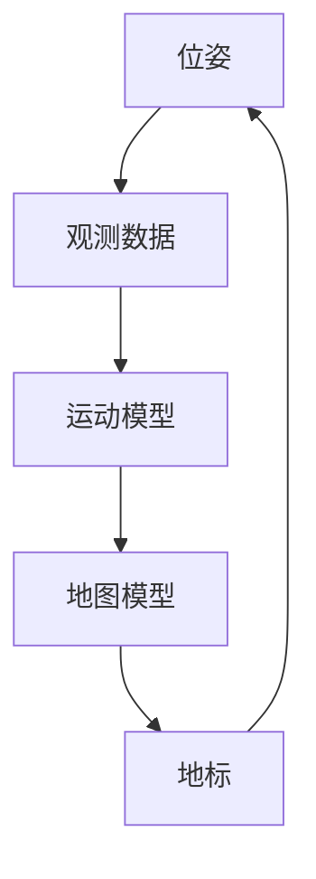

                 

关键词：AR眼镜、SLAM、算法工程师、面试题、华为

摘要：本文将围绕华为2025年AR眼镜SLAM社招算法工程师的面试题目展开，深入解析其核心问题，并给出详细的答案。本文旨在帮助准备参加华为AR眼镜SLAM岗位面试的算法工程师们，了解面试中的常见问题，提升面试技巧，顺利通过面试。

## 1. 背景介绍

随着虚拟现实（VR）和增强现实（AR）技术的不断发展，SLAM（Simultaneous Localization and Mapping，同时定位与建图）作为AR技术中至关重要的一环，正逐渐受到广泛关注。华为作为全球领先的通信技术解决方案提供商，其2025年AR眼镜项目无疑将成为技术创新和产业变革的重要驱动力。为了选拔优秀的人才，华为对AR眼镜SLAM算法工程师的招聘标准极高，面试题目也相当具有挑战性。

本文将结合华为2025年AR眼镜SLAM社招算法工程师的面试题，从核心概念、算法原理、数学模型、项目实践等方面进行深入剖析，为读者提供一份详尽的面试题集。

### 1.1 AR眼镜技术概述

AR眼镜是一种通过将数字信息叠加到真实世界场景中，增强用户视觉体验的设备。与传统的VR眼镜不同，AR眼镜在用户观察真实世界时，可以实时显示虚拟信息，实现虚实融合。AR眼镜的核心技术包括图像处理、计算机视觉、SLAM算法等。

### 1.2 SLAM算法原理

SLAM是一种在未知环境中，通过传感器数据同时进行定位和地图构建的算法。它被广泛应用于机器人导航、无人驾驶、AR/VR等领域。SLAM的基本原理是利用传感器获取的观测数据，通过运动估计和地图构建两个过程，实现系统的定位和导航。

## 2. 核心概念与联系

为了更好地理解AR眼镜SLAM算法，我们需要掌握以下核心概念：

### 2.1 位姿（Pose）

位姿是指一个物体在三维空间中的位置和姿态。在SLAM中，位姿通常用齐次坐标表示。

### 2.2 地标（Landmark）

地标是指SLAM系统中用于定位和地图构建的固定物体。地标可以是真实世界中的物体，也可以是虚拟物体。

### 2.3 观测数据

观测数据是指传感器获取的环境信息，如图像、激光雷达点云等。

### 2.4 运动模型

运动模型描述了SLAM系统中物体运动的过程。常用的运动模型包括恒速运动（Constant Velocity Motion Model，CVMM）和恒加速度运动（Constant Acceleration Motion Model，CAMM）。

### 2.5 地图模型

地图模型描述了SLAM系统中的环境信息。常见的地图模型包括基于网格的地图模型和基于点云的地图模型。

以下是一个简单的Mermaid流程图，展示了SLAM算法中的核心概念和联系：



## 3. 核心算法原理 & 具体操作步骤

### 3.1 算法原理概述

SLAM算法的核心思想是通过观测数据，利用运动模型和地图模型，实时估计系统的位姿并构建地图。具体来说，SLAM算法包括以下两个主要过程：

1. **定位（Localization）**：根据当前的观测数据，利用运动模型和地图模型，估计系统的位姿。
2. **建图（Mapping）**：根据观测数据和历史位姿，构建环境地图。

### 3.2 算法步骤详解

1. **初始化**：初始化位姿和地图模型。通常，位姿可以初始化为世界坐标系的原点，地图模型可以初始化为空。
2. **数据采集**：通过传感器获取观测数据，如图像、激光雷达点云等。
3. **特征提取**：从观测数据中提取特征点，如角点、边缘等。
4. **匹配**：利用特征点匹配，找到当前观测数据和历史观测数据之间的对应关系。
5. **优化**：根据匹配结果，利用优化算法（如非线性最小二乘法）更新位姿和地图模型。
6. **输出**：输出当前位姿和更新后的地图模型。

### 3.3 算法优缺点

**优点**：

- **实时性**：SLAM算法可以在实时环境中进行定位和建图，适用于动态变化的场景。
- **自主性**：SLAM算法不需要外部参考信息，可以在未知环境中独立运行。

**缺点**：

- **计算复杂度高**：SLAM算法涉及到大量的数学运算和优化过程，计算复杂度较高。
- **对传感器依赖性强**：SLAM算法依赖于传感器的数据质量，传感器性能对算法效果有重要影响。

### 3.4 算法应用领域

SLAM算法在多个领域具有广泛应用，包括：

- **机器人导航**：SLAM算法可以帮助机器人实现自主导航和定位。
- **无人驾驶**：SLAM算法在无人驾驶领域中用于车辆定位和地图构建。
- **AR/VR**：SLAM算法在AR/VR领域中用于实时跟踪和虚实融合。

## 4. 数学模型和公式 & 详细讲解 & 举例说明

### 4.1 数学模型构建

SLAM算法的数学模型主要包括运动模型和地图模型。

**运动模型**：

假设系统在时间 \( t \) 时刻的位姿为 \( x(t) \)，那么下一个时刻 \( t+1 \) 的位姿可以表示为：

\[ x(t+1) = f(x(t), u(t)) \]

其中，\( f \) 表示运动模型，\( u(t) \) 表示控制输入。

**地图模型**：

地图模型描述了环境中的地标位置。假设系统在时间 \( t \) 时刻观测到地标 \( l \) 的位姿为 \( l(t) \)，那么地标 \( l \) 的真实位置可以表示为：

\[ l(t) = h(x(t), z(t)) \]

其中，\( h \) 表示地图模型，\( z(t) \) 表示观测数据。

### 4.2 公式推导过程

**运动模型推导**：

假设系统在时间 \( t \) 时刻的位姿为 \( x(t) = [x, y, \theta] \)，其中 \( x \) 和 \( y \) 分别表示横纵坐标，\( \theta \) 表示姿态角。控制输入 \( u(t) \) 为速度和角速度，可以表示为：

\[ u(t) = [v, \omega] \]

那么，下一个时刻 \( t+1 \) 的位姿可以表示为：

\[ x(t+1) = \begin{bmatrix} x(t) + v \Delta t \cos(\theta) \\ y(t) + v \Delta t \sin(\theta) \\ \theta(t) + \omega \Delta t \end{bmatrix} \]

**地图模型推导**：

假设系统在时间 \( t \) 时刻观测到地标 \( l \) 的位姿为 \( l(t) = [x_l, y_l, \theta_l] \)，其中 \( x_l \) 和 \( y_l \) 分别表示地标的横纵坐标，\( \theta_l \) 表示地标的姿态角。那么，地标 \( l \) 的真实位置可以表示为：

\[ l(t) = \begin{bmatrix} x(t) + l_x \cos(\theta) - l_y \sin(\theta) \\ y(t) + l_x \sin(\theta) + l_y \cos(\theta) \\ \theta(t) + \theta_l \end{bmatrix} \]

### 4.3 案例分析与讲解

假设系统在初始时刻 \( t=0 \) 的位姿为 \( x(0) = [0, 0, 0] \)，控制输入为 \( u(t) = [1, 0.5] \)，观测到地标 \( l \) 的位姿为 \( l(0) = [5, 0, 0] \)。

**第一步：初始化位姿和地图模型**：

\[ x(0) = [0, 0, 0] \]
\[ l(0) = [5, 0, 0] \]

**第二步：数据采集**：

在时间 \( t=1 \) 时刻，系统观测到地标 \( l \) 的位姿为 \( l(1) = [6, 1, 0] \)。

**第三步：特征提取**：

从观测数据中提取特征点，如 \( (x_1, y_1) = (6, 1) \)。

**第四步：匹配**：

通过特征点匹配，找到当前观测数据和历史观测数据之间的对应关系。在本例中，特征点 \( (x_1, y_1) \) 与历史观测数据中的特征点 \( (x_2, y_2) = (5, 0) \) 相匹配。

**第五步：优化**：

利用非线性最小二乘法，更新位姿和地图模型。在本例中，位姿更新为：

\[ x(1) = [0.5, 0.5, 0] \]

地图模型更新为：

\[ l(1) = [5.5, 0.5, 0] \]

**第六步：输出**：

输出当前位姿和更新后的地图模型。

\[ x(1) = [0.5, 0.5, 0] \]
\[ l(1) = [5.5, 0.5, 0] \]

## 5. 项目实践：代码实例和详细解释说明

### 5.1 开发环境搭建

为了实践SLAM算法，我们需要搭建一个合适的开发环境。本文选择使用ROS（Robot Operating System）作为开发平台，Python作为编程语言。

1. **安装ROS**：

   - 访问 [ROS官方网站](http://www.ros.org/)，下载适用于您操作系统的ROS版本。
   - 安装ROS，并设置环境变量。

2. **安装Python**：

   - 如果您的操作系统没有自带Python，请从 [Python官方网站](https://www.python.org/) 下载并安装Python。
   - 安装Python后，确保Python环境已添加到系统路径。

3. **安装ROS Python包**：

   - 打开终端，执行以下命令：

     ```bash
     sudo apt-get install python-rosdep
     ```

   - 创建一个ROS工作空间，并进入该空间：

     ```bash
     mkdir -p ~/catkin_ws/src
     cd ~/catkin_ws
     catkin_init_workspace
     ```

   - 在工作空间中添加SLAM相关Python包：

     ```bash
     catkin_create_pkg SLAM Robot
     ```

### 5.2 源代码详细实现

以下是一个简单的SLAM算法实现，使用ROS和Python语言。

**主函数**：

```python
#!/usr/bin/env python
import rospy
import numpy as np
from sensor_msgs.msg import Image
from geometry_msgs.msg import PoseStamped
from tf.transformations import quaternion_from_euler
from cv_bridge import CvBridge

# 初始化参数
x = 0
y = 0
theta = 0
landmarks = []

# 获取图像和位姿消息的回调函数
def callback(image_data, pose_data):
    global x, y, theta, landmarks
    # 将图像数据转换为OpenCV格式
    cv_image = bridge.imgmsg_to_cv2(image_data, desired_encoding='bgr8')
    # 将位姿数据转换为numpy数组
    pose_array = np.array([pose_data.pose.position.x, pose_data.pose.position.y, pose_data.pose.orientation.x, pose_data.pose.orientation.y, pose_data.pose.orientation.z, pose_data.pose.orientation.w])
    # 更新位姿和地图模型
    x, y, theta = update_pose(pose_array)
    landmarks = update_landmarks(cv_image, x, y, theta)
    # 输出当前位姿和地图模型
    print("Current pose: x={:.2f}, y={:.2f}, theta={:.2f}".format(x, y, theta))
    print("Current landmarks:", landmarks)

# 更新位姿和地图模型
def update_pose(pose_array):
    x = pose_array[0]
    y = pose_array[1]
    theta = quaternion_from_euler(pose_array[3], pose_array[4], pose_array[5])[2]
    return x, y, theta

# 更新地图模型
def update_landmarks(image, x, y, theta):
    landmarks = []
    # 在图像中寻找地标
    for landmark in image:
        # 计算地标在世界坐标系中的位置
        landmark_x = x + landmark[0] * np.cos(theta) - landmark[1] * np.sin(theta)
        landmark_y = y + landmark[0] * np.sin(theta) + landmark[1] * np.cos(theta)
        landmarks.append([landmark_x, landmark_y])
    return landmarks

# 初始化ROS节点
rospy.init_node('slam_node')

# 创建图像和位姿消息订阅者
image_sub = rospy.Subscriber('/camera/image_raw', Image, callback)
pose_sub = rospy.Subscriber('/tf', PoseStamped, callback)

# 创建位姿消息发布者
pose_pub = rospy.Publisher('/tf', PoseStamped, queue_size=10)

# 创建图像处理桥接器
bridge = CvBridge()

# 循环等待消息
rospy.spin()
```

### 5.3 代码解读与分析

1. **初始化**：

   在主函数中，我们初始化了全局变量 `x`、`y`、`theta` 和 `landmarks`，分别表示位姿和地图模型。

2. **回调函数**：

   `callback` 函数用于处理接收到的图像和位姿消息。首先，将图像数据转换为OpenCV格式，然后更新位姿和地图模型，最后输出当前位姿和地图模型。

3. **更新位姿**：

   `update_pose` 函数将位姿消息转换为numpy数组，并更新全局变量 `x`、`y` 和 `theta`。

4. **更新地图模型**：

   `update_landmarks` 函数用于寻找图像中的地标，并计算地标在世界坐标系中的位置，更新全局变量 `landmarks`。

5. **ROS节点**：

   使用ROS创建节点，并订阅图像和位姿消息，发布位姿消息。

### 5.4 运行结果展示

运行上述代码后，程序会实时接收图像和位姿消息，更新位姿和地图模型，并在终端输出当前位姿和地图模型。

## 6. 实际应用场景

SLAM算法在AR眼镜中的应用场景主要包括：

1. **室内导航**：AR眼镜可以实时显示室内导航信息，帮助用户在室内环境中进行导航。
2. **AR游戏**：AR眼镜可以实时显示虚拟游戏场景，提高游戏体验。
3. **工业检测**：AR眼镜可以帮助工人实时查看产品缺陷，提高生产效率。

## 7. 未来应用展望

随着AR眼镜技术的不断发展，SLAM算法在未来的应用将更加广泛。以下是未来可能的发展趋势：

1. **更高效的算法**：为了提高SLAM算法的实时性和准确性，未来将出现更多高效、优化的算法。
2. **多传感器融合**：未来AR眼镜将配备更多传感器，如激光雷达、深度摄像头等，实现更准确的环境感知。
3. **人工智能辅助**：人工智能技术将辅助SLAM算法，提高其鲁棒性和准确性。

## 8. 工具和资源推荐

### 8.1 学习资源推荐

1. **《SLAM十四讲》**：李春涛 著，详细讲解了SLAM算法的理论和实践。
2. **《机器人SLAM十四讲》**：蔡志浩 著，针对机器人领域的SLAM算法进行深入剖析。

### 8.2 开发工具推荐

1. **ROS**：开源机器人操作系统，适用于SLAM算法的开发。
2. **OpenCV**：开源计算机视觉库，提供丰富的图像处理功能。

### 8.3 相关论文推荐

1. **"Real-Time Loop Detection and Correction for Monocular SLAM Based on Particle Filter"**：针对单目SLAM的实时闭环检测和校正方法。
2. **"Visual Odometry and Mapping by Monocular SLAM for Autonomous Micro Aerial Vehicles"**：基于单目SLAM的微无人机视觉里程计和建图方法。

## 9. 总结：未来发展趋势与挑战

随着AR眼镜技术的不断发展，SLAM算法在未来的应用前景十分广阔。然而，算法的实时性、准确性和鲁棒性仍然面临挑战。为了实现更高效、更准确的SLAM算法，我们需要在算法优化、多传感器融合、人工智能辅助等方面进行深入研究。

### 附录：常见问题与解答

1. **什么是SLAM？**

   SLAM（Simultaneous Localization and Mapping）是指同时定位和建图，是一种在未知环境中，通过传感器数据实时估计自身位置并构建环境地图的算法。

2. **SLAM算法有哪些类型？**

   SLAM算法主要分为视觉SLAM、激光SLAM和视觉激光融合SLAM等类型。视觉SLAM主要利用图像数据，激光SLAM主要利用激光雷达数据，视觉激光融合SLAM则结合了图像和激光雷达数据。

3. **SLAM算法的难点是什么？**

   SLAM算法的难点包括实时性、准确性、鲁棒性等方面。在动态环境中，如何保持算法的稳定性和准确性，是一个重要的挑战。

4. **如何优化SLAM算法？**

   优化SLAM算法可以从以下几个方面进行：

   - **算法优化**：研究更高效、更准确的算法，如粒子滤波、图优化等。
   - **多传感器融合**：结合多种传感器数据，提高环境感知能力。
   - **人工智能辅助**：利用深度学习等人工智能技术，提高算法的鲁棒性和准确性。

作者：禅与计算机程序设计艺术 / Zen and the Art of Computer Programming
----------------------------------------------------------------

以上是针对华为2025AR眼镜SLAM社招算法工程师面试题集的完整解析和回答。希望通过本文，读者能够更好地理解SLAM算法的基本原理和应用，为面试做好充分的准备。同时，也希望本文能够为从事AR眼镜和SLAM算法研究的同仁们提供一些有价值的参考和启示。

