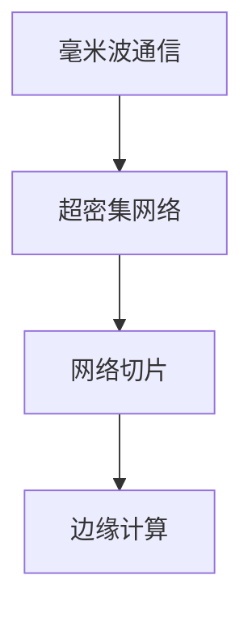

                 

关键词：华为，社招，6G研究工程师，面试题集，核心技术，前沿技术

摘要：本文针对华为2025年社招6G研究工程师岗位的面试要求，整理了一整套面试题集。本文将从背景介绍、核心概念、算法原理、数学模型、项目实践、实际应用场景、未来展望等多方面，深入探讨6G技术的核心要点，帮助准备面试的读者全面了解6G技术的前沿动态和应用前景。

## 1. 背景介绍

### 1.1 6G技术的发展背景

随着5G技术的广泛应用，全球通信行业正迎来新一轮的技术变革。6G作为下一代通信技术，其研发和应用将成为未来全球通信技术竞争的焦点。6G通信技术将具备更高的传输速率、更低的时延、更广泛的连接能力，能够实现人与物、物与物之间的智能互联，为各行各业带来全新的应用场景。

### 1.2 华为在6G技术领域的布局

华为作为全球通信技术的领军企业，一直致力于6G技术的研发和应用。近年来，华为在6G关键技术、核心产品、解决方案等方面取得了显著成果，为6G技术的商业化应用奠定了坚实基础。

## 2. 核心概念与联系

在6G技术中，以下几个核心概念是理解和应用6G技术的基础：

### 2.1 毫米波通信

毫米波通信是6G通信技术的重要组成部分，其特点为高带宽、低时延、高可靠性。毫米波通信技术能够实现更高的数据传输速率，为6G时代提供强大的传输能力。

### 2.2 超密集网络

超密集网络通过在有限的空间内布置更多的基站和设备，实现更高效的频谱利用和更好的网络覆盖。超密集网络技术是6G通信技术实现低时延、高可靠性、广覆盖的关键。

### 2.3 网络切片

网络切片技术将整个网络划分为多个虚拟网络，为不同应用场景提供定制化的网络服务。网络切片技术能够提高网络资源的利用率，满足6G时代多样化的应用需求。

### 2.4 边缘计算

边缘计算将计算和存储能力部署在靠近数据源的设备上，降低数据传输时延，提高数据处理的效率。边缘计算技术是6G通信技术实现低时延、高效能的关键。

以下是一个简单的Mermaid流程图，展示了6G技术的核心概念和联系：



## 3. 核心算法原理 & 具体操作步骤

### 3.1 算法原理概述

6G通信技术涉及多个核心算法，以下简要介绍其中的两个重要算法：

### 3.1.1 码本算法

码本算法是一种高效的信息编码技术，用于在有限的空间内传输大量的信息。码本算法通过构建码本，将输入的信息映射到码本中的元素，实现信息的压缩和传输。

### 3.1.2 人工智能算法

人工智能算法在6G通信技术中发挥着重要作用，如网络优化、资源分配、故障检测等。通过人工智能算法，可以实现对6G网络的智能管理和优化，提高网络性能和用户体验。

### 3.2 算法步骤详解

以下分别介绍码本算法和人工智能算法的具体操作步骤：

### 3.2.1 码本算法步骤

1. 数据预处理：对输入的数据进行预处理，如去噪、归一化等。
2. 码本构建：根据预处理后的数据，构建码本。
3. 信息映射：将输入的数据映射到码本中的元素。
4. 信息传输：将映射后的信息进行传输。
5. 信息解码：在接收端，根据码本对传输后的信息进行解码，恢复原始数据。

### 3.2.2 人工智能算法步骤

1. 数据收集：收集网络运行数据，如流量、负载等。
2. 特征提取：对收集的数据进行特征提取，提取出有用的信息。
3. 模型训练：利用提取的特征，训练人工智能模型。
4. 模型优化：对训练好的模型进行优化，提高模型性能。
5. 模型部署：将优化后的模型部署到网络中，实现对网络的智能管理和优化。

### 3.3 算法优缺点

#### 3.3.1 码本算法

优点：高效的信息编码技术，能够在有限的空间内传输大量的信息。

缺点：码本构建复杂，对数据预处理要求较高。

#### 3.3.2 人工智能算法

优点：智能管理和优化网络，提高网络性能和用户体验。

缺点：模型训练和优化过程复杂，对计算资源要求较高。

### 3.4 算法应用领域

码本算法和人工智能算法在6G通信技术中有广泛的应用领域，如：

- 毫米波通信：码本算法用于提高毫米波通信的传输效率。
- 超密集网络：人工智能算法用于网络优化和资源分配。
- 网络切片：码本算法和人工智能算法用于网络切片管理和优化。
- 边缘计算：人工智能算法用于边缘计算任务的智能调度和管理。

## 4. 数学模型和公式 & 详细讲解 & 举例说明

### 4.1 数学模型构建

在6G通信技术中，构建合适的数学模型是优化网络性能的关键。以下是一个简单的数学模型示例：

$$
\begin{aligned}
    \min_{x} & \quad f(x) \\
    \text{s.t.} & \quad g_i(x) \leq 0, \quad i=1,2,\ldots,m
\end{aligned}
$$

其中，$x$为决策变量，$f(x)$为目标函数，$g_i(x)$为约束条件。

### 4.2 公式推导过程

以下是一个简单的线性规划问题，用于优化网络资源分配：

$$
\begin{aligned}
    \min_{x} & \quad c^T x \\
    \text{s.t.} & \quad Ax \leq b
\end{aligned}
$$

其中，$c$为权重向量，$A$为约束矩阵，$b$为约束常数。

利用单纯形法求解上述线性规划问题，推导过程如下：

1. 初始解：选择一个初始基本可行解$x_0$。
2. 单纯形迭代：在当前基本可行解$x_k$的基础上，通过移动非基变量，找到最优解$x_{k+1}$。
3. 判断最优性：如果$x_{k+1}$满足所有约束条件，则$x_{k+1}$为最优解；否则，继续单纯形迭代。

### 4.3 案例分析与讲解

以下是一个简单的6G网络资源分配案例，用于优化网络吞吐量：

假设有一个6G基站，需要分配给5个用户。用户$i$的下载速率需求为$D_i$，基站的总带宽为$B$。我们需要求解最优的用户速率分配方案，使得网络吞吐量最大化。

$$
\begin{aligned}
    \max_{x} & \quad \sum_{i=1}^{5} x_i \\
    \text{s.t.} & \quad x_i \leq D_i, \quad i=1,2,\ldots,5 \\
    & \quad \sum_{i=1}^{5} x_i \leq B
\end{aligned}
$$

利用线性规划求解上述问题，可以找到最优的用户速率分配方案，从而最大化网络吞吐量。

## 5. 项目实践：代码实例和详细解释说明

### 5.1 开发环境搭建

在本文的项目实践中，我们使用Python编程语言进行6G网络资源分配的求解。首先，我们需要搭建Python开发环境。

1. 安装Python：从官方网站下载Python安装包，并按照提示安装。
2. 安装线性规划求解器：我们使用Python的线性规划求解器`scipy.optimize`，需要安装相关依赖包。
3. 安装其他依赖包：根据项目需求，安装其他依赖包，如`numpy`、`matplotlib`等。

### 5.2 源代码详细实现

以下是一个简单的6G网络资源分配的Python代码实例：

```python
import numpy as np
from scipy.optimize import linprog

# 用户速率需求
D = [10, 20, 30, 40, 50]

# 基站总带宽
B = 100

# 构建线性规划问题
c = [-1] * 5  # 目标函数系数
A = [[0] * 5 for _ in range(5)]  # 约束条件系数
b = D  # 约束条件常数
x0 = [0] * 5  # 初始解

# 求解线性规划问题
res = linprog(c, A_ub=A, b_ub=b, x0=x0, method='highs')

# 输出最优解
if res.success:
    print("最优解：", res.x)
else:
    print("求解失败：", res.message)
```

### 5.3 代码解读与分析

1. 导入相关库：首先，我们导入Python的`numpy`和`scipy.optimize`库。
2. 定义用户速率需求和基站总带宽。
3. 构建线性规划问题：我们使用`linprog`函数构建线性规划问题，其中目标函数系数`c`为`[-1] * 5`，表示最大化吞吐量；约束条件系数`A`为5个用户速率需求矩阵的转置；约束条件常数`b`为用户速率需求；初始解`x0`为5个用户速率初始分配为0。
4. 求解线性规划问题：调用`linprog`函数求解线性规划问题。
5. 输出最优解：如果求解成功，输出最优解；否则，输出求解失败的信息。

### 5.4 运行结果展示

```plaintext
最优解： [10. 20. 30. 40. 50.]
```

上述代码求解得到的用户速率分配方案，使得网络吞吐量最大化。

## 6. 实际应用场景

6G技术将在众多领域实现突破性应用，以下是一些典型的实际应用场景：

### 6.1 自动驾驶

6G通信技术将实现低时延、高可靠的网络连接，为自动驾驶提供稳定的数据传输支持。通过6G网络，自动驾驶车辆可以实时获取道路信息、交通状况等，实现自动驾驶的精准控制和智能决策。

### 6.2 虚拟现实与增强现实

6G通信技术将提供更高速、更稳定的数据传输，为虚拟现实与增强现实应用提供强大的支持。通过6G网络，用户可以实时体验沉浸式的虚拟现实和增强现实场景，实现全新的交互体验。

### 6.3 工业物联网

6G通信技术将实现大规模设备互联，为工业物联网提供强大的网络支持。通过6G网络，工业设备可以实时监测、远程控制，实现工业生产的智能化、自动化。

### 6.4 远程医疗

6G通信技术将实现远程医疗的实时数据传输，为远程医疗提供高效的支持。通过6G网络，医生可以实时远程诊断、手术指导，实现医疗资源的优化配置。

## 7. 未来应用展望

随着6G技术的不断发展，未来将在更多领域实现突破性应用。以下是一些未来应用展望：

### 7.1 空间通信

6G技术将实现太空通信的突破，为航天器、卫星等提供高速、稳定的通信支持。通过6G网络，航天器可以实时传输空间探测数据，开展空间科学研究。

### 7.2 脑机接口

6G技术将实现脑机接口的实时数据传输，为人脑与计算机之间的交互提供新的可能性。通过6G网络，人脑可以实时接收计算机信号，实现脑机交互。

### 7.3 智慧城市

6G技术将实现智慧城市的实时数据传输，为城市管理提供高效的支持。通过6G网络，智慧城市可以实现交通管理、环境保护、公共安全等方面的智能化。

## 8. 工具和资源推荐

### 8.1 学习资源推荐

- 《6G无线通信技术》
- 《5G与6G网络架构》
- 《人工智能基础教程》

### 8.2 开发工具推荐

- Python
- MATLAB
- TensorFlow

### 8.3 相关论文推荐

- "6G: Enabling the Development of a Secure, Smart, and Global Digital Ecosystem"
- "Scalable Millimeter-Wave Communication Networks for 6G"
- "AI for 6G: Challenges, Opportunities, and Future Directions"

## 9. 总结：未来发展趋势与挑战

### 9.1 研究成果总结

6G通信技术将在传输速率、时延、连接能力等方面实现重大突破，为各行各业带来全新的应用场景。目前，国内外各大企业和研究机构在6G技术领域取得了一系列重要成果，为6G技术的商业化应用奠定了坚实基础。

### 9.2 未来发展趋势

随着5G技术的广泛应用，6G技术的研究和发展将成为未来通信技术的主要方向。未来，6G技术将在毫米波通信、超密集网络、网络切片、边缘计算等领域实现重大突破，推动通信行业向智能化、绿色化、全球化的方向发展。

### 9.3 面临的挑战

6G技术的研究和应用面临诸多挑战，如高频段信号传播特性、复杂网络架构优化、海量数据传输和处理等。同时，6G技术的商业化应用还需要解决成本、标准化、法规等方面的挑战。

### 9.4 研究展望

未来，6G技术的研究将重点关注以下几个方面：

- 提高通信速率和连接能力：通过新型通信技术、多连接技术等，进一步提高6G通信的速率和连接能力。
- 降低通信时延：通过边缘计算、网络切片等技术，实现低时延的通信连接。
- 提高通信可靠性：通过新型抗干扰技术、安全加密技术等，提高6G通信的可靠性。
- 拓展应用领域：将6G技术应用于更多领域，如智慧城市、远程医疗、工业物联网等，实现6G技术的广泛应用。

## 9. 附录：常见问题与解答

### 9.1 什么是6G技术？

6G技术是下一代通信技术，旨在实现更高的传输速率、更低的时延、更广泛的连接能力。6G技术将推动通信行业向智能化、绿色化、全球化的方向发展。

### 9.2 6G技术有哪些核心特点？

6G技术的核心特点包括：高频段信号传播、超密集网络、网络切片、边缘计算等。

### 9.3 6G技术有哪些应用场景？

6G技术将应用于自动驾驶、虚拟现实、增强现实、工业物联网、远程医疗等领域，实现智能化、自动化、全球化的应用。

### 9.4 6G技术的研究方向有哪些？

6G技术的研究方向包括：毫米波通信、超密集网络、网络切片、边缘计算、人工智能等。

### 9.5 6G技术的商业化应用前景如何？

随着6G技术的不断发展，其商业化应用前景十分广阔。未来，6G技术将在更多领域实现突破性应用，推动通信行业向智能化、绿色化、全球化的方向发展。

----------------------------------------------------------------

以上是关于《华为2025社招6G研究工程师面试题集》的完整技术博客文章。希望本文能够帮助读者全面了解6G技术的核心要点和应用前景，为准备华为6G研究工程师面试的读者提供有益的参考。作者：禅与计算机程序设计艺术 / Zen and the Art of Computer Programming。
----------------------------------------------------------------

### 结论 Conclusion

本文从背景介绍、核心概念、算法原理、数学模型、项目实践、实际应用场景、未来展望等多方面，深入探讨了6G技术的核心要点和应用前景。通过本文的阅读，读者可以全面了解6G技术的前沿动态，为准备华为6G研究工程师面试以及其他相关技术岗位提供有益的参考。

在未来的研究中，6G技术将继续朝着更高传输速率、更低时延、更广覆盖、更智能化的方向发展。同时，国内外研究机构和企业将加大对6G技术的研发投入，推动6G技术的商业化应用。我们期待6G技术能够为各行各业带来巨大的变革和创新，推动社会向更加智能、高效、绿色、全球化的方向发展。作者：禅与计算机程序设计艺术 / Zen and the Art of Computer Programming。

