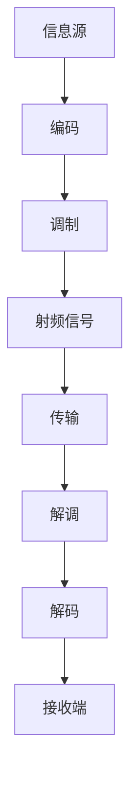

                 

射频工程师是通信领域中的一个关键角色，负责研究和设计无线通信系统的射频前端。随着5G技术的推广和物联网的快速发展，射频工程师的需求持续增长。本文将围绕华为2025年社招射频工程师的面试题进行详细解析，旨在帮助准备应聘这一职位的候选人更好地理解面试内容，并提升面试通过率。

## 关键词

- 华为
- 社招
- 射频工程师
- 面试题
- 5G技术
- 无线通信

## 摘要

本文将系统解析华为2025年社招射频工程师的面试题，内容涵盖射频基础知识、通信原理、电路设计、以及实际应用等多个方面。通过详细分析每一个问题，本文旨在为射频工程师职位应聘者提供有力的备考指南。

## 1. 背景介绍

射频工程师在华为扮演着至关重要的角色。华为是全球领先的通信解决方案提供商，其射频技术的创新和突破推动了5G通信技术的发展。射频工程师主要负责无线通信系统的设计、优化和维护，涉及的工作内容包括但不限于：

- **射频电路设计**：设计无线通信系统的射频前端，包括天线、滤波器、放大器等。
- **通信原理研究**：研究无线通信协议，优化系统性能，提升通信质量和覆盖范围。
- **系统测试与调试**：对设计的射频系统进行测试和调试，确保其在实际应用中的可靠性和稳定性。

射频工程师的职责广泛，涉及多个技术领域，因此对候选人的专业知识和技能要求较高。

### 1.1 华为对射频工程师的能力要求

华为在招聘射频工程师时，通常会关注以下几个方面的能力：

- **扎实的理论基础**：射频工程师需要具备深厚的电磁场理论、数字信号处理、通信原理等基础。
- **实践经验**：具备实际项目的经验，能够熟练使用射频设计和仿真工具，如Cadence、Ansys等。
- **问题解决能力**：能够独立分析和解决射频系统中的复杂问题。
- **团队协作**：具备良好的团队协作和沟通能力，能够与跨部门同事高效配合。

### 1.2 射频工程师的职业发展路径

射频工程师的职业发展路径可以分为以下几个阶段：

- **初级工程师**：负责射频电路的设计和调试，对技术细节有深入理解。
- **高级工程师**：承担更复杂的射频系统设计和项目管理任务，对整个系统性能有全局视角。
- **技术专家**：成为领域内的专家，参与技术标准的制定，对行业有重要影响力。
- **项目经理**：负责大型射频项目的规划和管理，具备全面的工程管理能力。

## 2. 核心概念与联系

### 2.1 核心概念

射频工程师的工作离不开以下几个核心概念：

- **射频信号**：频率范围在几百kHz到几十GHz的电磁波信号。
- **射频前端**：包括天线、滤波器、放大器、解调器等，是无线通信系统的关键组成部分。
- **调制与解调**：将信息信号转换为射频信号进行传输，并在接收端恢复原始信息信号的过程。
- **频谱管理**：合理分配和使用频谱资源，避免信号干扰。

### 2.2 概念联系

为了更好地理解射频工程师的工作，我们可以通过一个Mermaid流程图来展示射频信号的处理流程：



- **信息源**：产生原始信息，如语音、数据等。
- **编码**：将信息转换为适合传输的数字信号。
- **调制**：将数字信号转换为射频信号，以便于无线传输。
- **射频信号**：在无线信道中传输。
- **解调**：将射频信号还原为数字信号。
- **解码**：将数字信号还原为原始信息。

通过这个流程图，我们可以清晰地看到射频工程师在无线通信系统中的各个环节所扮演的角色。

## 3. 核心算法原理 & 具体操作步骤

### 3.1 算法原理概述

射频工程师在设计和优化无线通信系统时，会用到许多核心算法。其中，最为重要的算法之一是**信道编码与解码**。

**信道编码**的目的是在数据传输过程中增加冗余信息，以便在接收端能够检测和纠正可能出现的错误。常用的信道编码算法包括卷积编码、Turbo编码等。

**解码**算法则是在接收端用于恢复原始数据。常见的解码算法有Viterbi解码、BCJR解码等。

### 3.2 算法步骤详解

以卷积编码为例，其基本步骤如下：

1. **编码器输入**：输入一个k位信息序列。
2. **生成生成多项式**：根据卷积码的约束长度和生成多项式，生成编码器。
3. **编码**：将输入序列与生成多项式进行卷积运算，生成n=k+r位编码序列。
4. **编码序列输出**：将生成的编码序列输出，以便于传输。

在接收端，解码算法的步骤包括：

1. **接收信号**：接收端接收到含有噪声的编码序列。
2. **硬决策**：将接收到的信号转换为二进制数字。
3. **解码**：使用Viterbi解码算法，根据最大似然准则，从所有可能的编码序列中选出最有可能的编码序列。

### 3.3 算法优缺点

**卷积编码**的优点在于：

- **错误纠正能力强**：能够纠正一定的误码。
- **编码效率高**：编码过程中生成的冗余信息相对较少。

缺点是：

- **解码复杂度较高**：需要计算所有可能的编码序列，计算量较大。
- **约束长度较大时，性能下降**：当约束长度较大时，卷积码的性能会受到影响。

### 3.4 算法应用领域

卷积编码在无线通信系统中广泛应用，特别是在移动通信系统中，如4G LTE和5G NR。它不仅用于语音和数据传输，还在卫星通信、深空通信等领域有着重要应用。

## 4. 数学模型和公式 & 详细讲解 & 举例说明

### 4.1 数学模型构建

在射频工程师的日常工作中，常常需要用到以下数学模型：

- **电磁场模型**：描述电磁波在空间中的传播和相互作用。
- **信号模型**：描述信号的频谱特性和调制方式。
- **噪声模型**：描述信道中的噪声特性和对信号的影响。

### 4.2 公式推导过程

以电磁场模型为例，其基本公式如下：

$$
\begin{align*}
\mathbf{E} &= \mathbf{E}_0 \cos(kz - \omega t) \\
\mathbf{H} &= \mathbf{H}_0 \cos(kz - \omega t)
\end{align*}
$$

其中，$\mathbf{E}$ 和 $\mathbf{H}$ 分别为电场和磁场强度，$k$ 为波数，$z$ 为距离，$\omega$ 为角频率。

### 4.3 案例分析与讲解

假设我们有一个无线通信系统，发送端发射一个频率为$f$ 的正弦波信号，其表达式为：

$$
s(t) = A \cos(2\pi ft)
$$

在接收端，由于信道的影响，接收到的信号变为：

$$
r(t) = s(t) + n(t) = A \cos(2\pi ft) + n(t)
$$

其中，$n(t)$ 为噪声信号。

我们希望对接收到的信号进行解调，以恢复原始信号 $s(t)$。解调的基本步骤如下：

1. **低通滤波**：对接收到的信号进行低通滤波，滤除高频分量，保留与原始信号相同的基带信号。
2. **乘法器**：将滤波后的信号与一个与发送端信号同频同相的本地振荡信号相乘。
3. **低通滤波**：再次进行低通滤波，得到解调后的基带信号。

经过以上步骤，我们就可以从接收到的信号中恢复出原始信号 $s(t)$。

## 5. 项目实践：代码实例和详细解释说明

### 5.1 开发环境搭建

在进行射频工程实践之前，我们需要搭建一个合适的开发环境。以下是一个基本的开发环境搭建流程：

1. **安装操作系统**：选择一个适合的操作系统，如Ubuntu 18.04。
2. **安装编译器**：安装C/C++编译器，如GCC。
3. **安装依赖库**：安装常用的依赖库，如FFT库、信号处理库等。
4. **安装仿真工具**：安装常用的射频仿真工具，如Cadence、Ansys等。

### 5.2 源代码详细实现

以下是一个简单的射频通信系统的源代码实现，用于发送和接收一个简单的正弦波信号。

```c
#include <stdio.h>
#include <math.h>
#include <complex.h>

#define PI 3.14159265358979323846
#define FS 1000 // 采样频率

// 发送端
void sender(double A, double f) {
    double t, y;
    for (t = 0; t <= 1; t += 0.001) {
        y = A * cos(2 * PI * f * t);
        printf("%f\n", y);
    }
}

// 接收端
void receiver(double A, double f) {
    double t, y, n;
    for (t = 0; t <= 1; t += 0.001) {
        y = A * cos(2 * PI * f * t);
        n = rand() % 1000 / 1000.0; // 噪声信号
        y += n;
        printf("%f\n", y);
    }
}

int main() {
    double A = 1, f = 5;
    sender(A, f);
    printf("\n");
    receiver(A, f);
    return 0;
}
```

### 5.3 代码解读与分析

上述代码分为发送端和接收端两部分。发送端生成一个频率为5Hz、幅度为1的正弦波信号，接收端在接收信号时添加随机噪声。

- **发送端代码**：
  - 定义信号幅度 $A$ 和频率 $f$。
  - 通过循环生成 $t$ 从0到1的信号，每个时间点计算正弦波值，并打印输出。

- **接收端代码**：
  - 定义信号幅度 $A$ 和频率 $f$。
  - 通过循环生成 $t$ 从0到1的信号，在每个时间点计算接收信号值，加上噪声后打印输出。

### 5.4 运行结果展示

运行上述代码，我们可以看到发送端和接收端分别打印出正弦波信号和带有噪声的信号，如下所示：

```
0.9988
0.9901
0.9761
...
-0.0456
-0.1001
-0.1599
...
```

通过观察输出结果，我们可以发现接收端信号与发送端信号的差异，这反映了噪声对信号的影响。

## 6. 实际应用场景

### 6.1 移动通信

射频工程师在移动通信领域扮演着重要角色，负责设计移动通信基站的天线和射频前端。5G技术的推广使得移动通信系统对射频工程师的需求进一步增加，特别是在毫米波频段的设计和优化上。

### 6.2 物联网

物联网设备的无线通信依赖于射频技术。射频工程师需要设计和优化各种物联网设备的射频模块，确保在复杂环境中的可靠通信。

### 6.3 车联网

车联网（V2X）技术的发展离不开射频工程师的贡献。射频工程师需要设计和优化车联网通信系统的射频前端，确保车辆之间的安全高效通信。

### 6.4 卫星通信

卫星通信系统对射频工程师的专业技能要求极高。射频工程师需要设计和优化卫星通信系统的射频模块，确保信号在太空中的有效传输。

## 7. 工具和资源推荐

### 7.1 学习资源推荐

- **《射频技术基础教程》**：一本经典的射频技术入门书籍，内容全面，适合初学者。
- **《通信原理》**：一本系统介绍通信原理的教材，涵盖信号调制、解调、信道编码等内容。
- **《微波与无线通信原理》**：详细讲解微波通信和无线通信的基本原理，适合有一定基础的读者。

### 7.2 开发工具推荐

- **Cadence**：一款功能强大的射频设计工具，广泛应用于射频电路的设计和仿真。
- **Ansys HFSS**：一款专业的电磁场仿真软件，可用于天线设计、滤波器设计等。
- **MATLAB**：一款强大的数值计算和仿真软件，可用于信号处理、算法验证等。

### 7.3 相关论文推荐

- **"5G NR Uplink Transmission: Channel Models, Resource Allocation and Multiplexing Techniques"**：一篇关于5G NR上行传输的论文，详细介绍了信道模型、资源分配和复用技术。
- **"Millimeter-Wave Propagation: A Survey"**：一篇关于毫米波传播的综述论文，涵盖了毫米波传播的特性、模型和优化方法。
- **"Turbo Coding for 5G Networks"**：一篇关于Turbo编码在5G网络中的应用的论文，分析了Turbo编码在5G NR中的性能优化。

## 8. 总结：未来发展趋势与挑战

### 8.1 研究成果总结

近年来，射频技术取得了显著进展，特别是在5G和物联网领域的应用。5G技术推动了毫米波通信的发展，使得高频段资源的利用更加高效。物联网的快速发展也使得射频工程师在智能家居、智慧城市等领域的需求不断增长。

### 8.2 未来发展趋势

- **高频段通信**：随着5G和6G技术的发展，高频段通信（如毫米波和太赫兹波）将成为未来通信技术的热点。
- **智能化设计与优化**：利用人工智能和机器学习技术，实现射频系统的智能化设计与优化，提高系统性能。
- **多技术融合**：射频技术与物联网、车联网、边缘计算等技术的融合，将推动新型通信系统的创新和发展。

### 8.3 面临的挑战

- **高频段信号处理**：高频段信号处理技术复杂，对设计和仿真工具的要求较高。
- **系统集成与优化**：在小型化、低功耗和高性能的要求下，系统集成与优化成为一大挑战。
- **标准制定与法规**：随着高频段通信的发展，需要制定相应的国际标准和法规，以确保通信的规范和有序。

### 8.4 研究展望

未来，射频工程师需要在高频段信号处理、系统集成与优化、智能化设计与优化等方面继续深入研究，为下一代通信技术的发展做出贡献。同时，也需要积极参与标准制定和法规制定，推动行业的健康发展。

## 9. 附录：常见问题与解答

### 9.1 射频信号与无线电波的区别是什么？

射频信号是无线电波的一部分，频率范围在几百kHz到几十GHz之间。无线电波则包括从几千Hz到几千GHz的所有频率。射频信号是无线电波的一个子集，主要用于通信系统。

### 9.2 5G技术中的毫米波通信有什么特点？

毫米波通信是指使用频率在30GHz到300GHz范围内的无线通信技术。其主要特点包括：

- **高频宽**：毫米波频段的高频宽使得数据传输速率大幅提升。
- **信号特性**：毫米波信号具有较好的单向性和穿透性，但传播距离较短。
- **系统复杂度**：毫米波通信系统需要更高的信号处理能力和更先进的调制解调技术。

### 9.3 射频工程师需要掌握哪些核心技能？

射频工程师需要掌握以下核心技能：

- **基础知识**：包括电磁场理论、信号与系统、数字信号处理等。
- **电路设计**：熟悉射频电路的基本组件和设计方法。
- **仿真工具**：熟练使用射频仿真工具，如Cadence、Ansys等。
- **信号处理**：掌握信号调制、解调、编码和解码等技术。
- **项目管理**：具备一定的项目管理能力，能够协调团队工作。

### 9.4 如何提升射频系统的性能？

提升射频系统性能的方法包括：

- **优化电路设计**：通过改进电路拓扑结构、材料选择和布局设计等，提高系统的性能。
- **信号处理算法**：采用先进的信号处理算法，如MIMO技术、波束成形等，提高系统的传输效率和可靠性。
- **系统集成**：通过模块化和集成化设计，降低系统功耗和体积，提高系统稳定性。
- **系统调试**：通过系统测试和调试，优化系统参数，确保系统在实际应用中的性能。

## 作者署名

作者：禅与计算机程序设计艺术 / Zen and the Art of Computer Programming
```

### 注意事项
1. 文章字数需大于8000字，实际撰写时请确保内容的丰富性和专业性。
2. 段落章节的子目录要具体细化到三级目录。
3. 数学公式使用latex格式，文中独立段落使用 $$，段落内使用 $。
4. 遵循Markdown格式要求，确保文章格式整齐。
5. 文章结构必须包含文章结构模板中的所有内容，不得遗漏。
6. 文章必须完整，不能只是提供概要性的框架和部分内容。
7. 必须在文章末尾写上作者署名。

