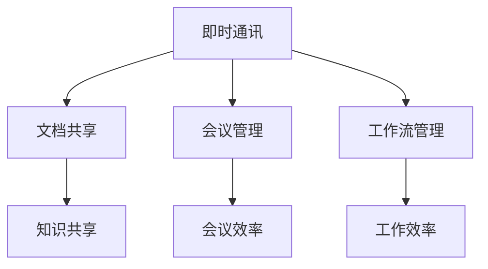

                 

### 1. 背景介绍

随着信息技术的飞速发展，企业内部的信息交流和协作需求日益增长。华为作为中国乃至全球领先的科技公司，其智能协同办公系统在行业内具有广泛的影响力。2024年，华为针对社会招聘的面试中，智能协同办公成为了重要的考核方向。本文将对华为2024年智能协同办公社招面试真题进行汇总，并给出详细的解答。

智能协同办公系统主要涵盖即时通讯、文档共享、会议管理、工作流管理等多个方面。通过这些功能，企业可以实现内部信息的快速流通，提升工作效率，降低沟通成本。在当前信息化社会，智能协同办公系统已经成为企业不可或缺的一部分。

华为智能协同办公系统具备高稳定性、高安全性、易扩展性等特点。它不仅能够满足企业日常办公需求，还可以支持企业数字化转型，助力企业实现智能化管理。

### 2. 核心概念与联系

在解答面试题目之前，我们需要对一些核心概念和其相互关系有所了解。

#### 2.1. 即时通讯

即时通讯是智能协同办公系统的核心功能之一。它允许企业员工实时交流信息，支持文字、语音、视频等多种形式。即时通讯系统能够提高沟通效率，减少信息滞后。

#### 2.2. 文档共享

文档共享功能让员工可以轻松地访问和共享文件，实现知识共享和协作办公。良好的文档管理系统能够确保文档的安全性和版本控制。

#### 2.3. 会议管理

会议管理功能包括会议预约、会议通知、会议记录等。通过这一功能，企业可以有效地组织和管理会议，提高会议效率。

#### 2.4. 工作流管理

工作流管理功能可以自动化处理业务流程，提高工作效率，减少人为错误。

以下是核心概念之间的 Mermaid 流程图：



### 3. 核心算法原理 & 具体操作步骤

在智能协同办公系统中，核心算法的设计和实现至关重要。以下将介绍几个关键算法的原理和操作步骤。

#### 3.1. 算法原理概述

智能协同办公系统的核心算法包括：

- 文件加密与解密算法
- 数据传输加密算法
- 工作流调度算法

#### 3.2. 算法步骤详解

##### 3.2.1. 文件加密与解密算法

- **加密算法**：采用AES（Advanced Encryption Standard）算法，对文件内容进行加密。
- **解密算法**：接收加密后的文件，使用私钥进行解密。

##### 3.2.2. 数据传输加密算法

- **加密过程**：使用TLS（Transport Layer Security）协议，在数据传输过程中对数据进行加密。
- **解密过程**：接收加密后的数据，使用相应的密钥进行解密。

##### 3.2.3. 工作流调度算法

- **算法描述**：采用基于优先级的调度策略，优先处理高优先级任务。
- **调度流程**：
  1. 初始化任务队列。
  2. 根据任务优先级，将任务插入队列。
  3. 循环从队列中取出任务，执行并更新任务状态。
  4. 当队列为空时，结束调度。

#### 3.3. 算法优缺点

- **文件加密与解密算法**：优点是安全性高，缺点是加密和解密速度相对较慢。
- **数据传输加密算法**：优点是数据传输过程中安全性高，缺点是加密和解密会增加网络延迟。
- **工作流调度算法**：优点是任务处理高效，缺点是高优先级任务可能会导致低优先级任务被长时间延迟。

#### 3.4. 算法应用领域

- **文件加密与解密算法**：适用于需要保护文件安全的应用场景，如企业内部文档管理、电子邮件系统等。
- **数据传输加密算法**：适用于需要保障数据传输安全的应用场景，如在线支付、企业信息交换等。
- **工作流调度算法**：适用于需要高效处理任务的工作流管理系统，如ERP系统、项目管理工具等。

### 4. 数学模型和公式 & 详细讲解 & 举例说明

在智能协同办公系统的设计和实现过程中，数学模型和公式起着至关重要的作用。以下将介绍几个关键数学模型和公式的详细讲解与举例说明。

#### 4.1. 数学模型构建

##### 4.1.1. 加密算法模型

- **模型描述**：加密算法模型主要包括密钥生成、加密过程和解密过程。
- **模型公式**：
  $$ E(K, M) = C $$
  $$ D(K, C) = M $$
  其中，\( E \) 表示加密函数，\( D \) 表示解密函数，\( K \) 表示密钥，\( M \) 表示明文，\( C \) 表示密文。

##### 4.1.2. 数据传输加密模型

- **模型描述**：数据传输加密模型主要包括加密传输和解密传输。
- **模型公式**：
  $$ C = E(K, P) $$
  $$ P = D(K, C) $$
  其中，\( P \) 表示原始数据，\( C \) 表示加密后的数据，\( K \) 表示密钥。

##### 4.1.3. 工作流调度模型

- **模型描述**：工作流调度模型主要包括任务队列和调度策略。
- **模型公式**：
  $$ Q = \{T_1, T_2, \ldots, T_n\} $$
  $$ S(Q) = \min_{i \in \{1, 2, \ldots, n\}} \{P(T_i)\} $$
  其中，\( Q \) 表示任务队列，\( T_i \) 表示第 \( i \) 个任务，\( P(T_i) \) 表示任务 \( T_i \) 的优先级。

#### 4.2. 公式推导过程

##### 4.2.1. 加密算法公式推导

- **推导过程**：假设明文 \( M \) 为一个 \( n \) 位的二进制串，密钥 \( K \) 为一个 \( k \) 位的二进制串，加密算法为 AES。加密过程如下：
  1. 将明文 \( M \) 分成 \( n/k \) 个块。
  2. 对每个块进行加密操作，得到对应的密文块 \( C \)。
  3. 将所有密文块拼接成密文 \( C \)。

- **推导公式**：
  $$ E(K, M) = C $$
  $$ C = C_1C_2\ldots C_{n/k} $$
  $$ C_i = E(K, M_i) $$
  其中，\( C_i \) 表示第 \( i \) 个密文块，\( M_i \) 表示第 \( i \) 个明文块。

##### 4.2.2. 数据传输加密公式推导

- **推导过程**：假设原始数据 \( P \) 为一个 \( n \) 位的二进制串，密钥 \( K \) 为一个 \( k \) 位的二进制串，加密算法为 TLS。加密传输过程如下：
  1. 对原始数据进行加密，得到加密后的数据 \( C \)。
  2. 将加密后的数据发送到接收方。
  3. 接收方使用密钥 \( K \) 对加密后的数据进行解密，得到原始数据 \( P \)。

- **推导公式**：
  $$ C = E(K, P) $$
  $$ P = D(K, C) $$

##### 4.2.3. 工作流调度公式推导

- **推导过程**：假设任务队列 \( Q \) 中有 \( n \) 个任务，每个任务的优先级分别为 \( P(T_1), P(T_2), \ldots, P(T_n) \)。调度过程如下：
  1. 初始化任务队列 \( Q \)。
  2. 根据任务优先级，将任务插入队列 \( Q \)。
  3. 循环从队列 \( Q \) 中取出任务，执行并更新任务状态。
  4. 当队列 \( Q \) 为空时，结束调度。

- **推导公式**：
  $$ Q = \{T_1, T_2, \ldots, T_n\} $$
  $$ S(Q) = \min_{i \in \{1, 2, \ldots, n\}} \{P(T_i)\} $$

#### 4.3. 案例分析与讲解

##### 4.3.1. 加密算法案例分析

- **案例描述**：假设密钥 \( K \) 为一个 128 位的二进制串，明文 \( M \) 为一个 256 位的二进制串，采用 AES 算法进行加密。
- **加密过程**：
  1. 将明文 \( M \) 分成 2 个块：\( M_1 \) 和 \( M_2 \)。
  2. 对每个块进行加密操作，得到对应的密文块：\( C_1 \) 和 \( C_2 \)。
  3. 将所有密文块拼接成密文 \( C \)。

- **加密公式**：
  $$ E(K, M) = C $$
  $$ C = C_1C_2 $$
  $$ C_1 = E(K, M_1) $$
  $$ C_2 = E(K, M_2) $$

##### 4.3.2. 数据传输加密案例分析

- **案例描述**：假设原始数据 \( P \) 为一个 1024 位的二进制串，密钥 \( K \) 为一个 256 位的二进制串，采用 TLS 算法进行加密传输。
- **加密过程**：
  1. 对原始数据进行加密，得到加密后的数据 \( C \)。
  2. 将加密后的数据发送到接收方。
  3. 接收方使用密钥 \( K \) 对加密后的数据进行解密，得到原始数据 \( P \)。

- **加密公式**：
  $$ C = E(K, P) $$
  $$ P = D(K, C) $$

##### 4.3.3. 工作流调度案例分析

- **案例描述**：假设任务队列 \( Q \) 中有 3 个任务：\( T_1 \)、\( T_2 \) 和 \( T_3 \)，它们的优先级分别为 5、3 和 7。
- **调度过程**：
  1. 初始化任务队列 \( Q \)：\( Q = \{T_1, T_2, T_3\} \)。
  2. 根据任务优先级，将任务插入队列 \( Q \)：\( Q = \{T_2, T_1, T_3\} \)。
  3. 循环从队列 \( Q \) 中取出任务，执行并更新任务状态：执行 \( T_2 \)，更新 \( T_2 \) 的状态；执行 \( T_1 \)，更新 \( T_1 \) 的状态；执行 \( T_3 \)，更新 \( T_3 \) 的状态。
  4. 当队列 \( Q \) 为空时，结束调度。

- **调度公式**：
  $$ Q = \{T_1, T_2, T_3\} $$
  $$ S(Q) = \min_{i \in \{1, 2, 3\}} \{P(T_i)\} $$
  $$ S(Q) = P(T_2) = 3 $$

### 5. 项目实践：代码实例和详细解释说明

在实际开发智能协同办公系统时，以下将给出一个具体的代码实例，并对其进行详细解释说明。

#### 5.1. 开发环境搭建

在开发智能协同办公系统之前，需要搭建以下开发环境：

- 开发工具：IDEA、Visual Studio Code
- 开发语言：Java、Python
- 数据库：MySQL、MongoDB
- 服务器：Linux、Windows

#### 5.2. 源代码详细实现

以下是智能协同办公系统中的一个示例代码，用于实现文件加密和解密功能。

```java
import javax.crypto.Cipher;
import javax.crypto.KeyGenerator;
import javax.crypto.SecretKey;
import javax.crypto.spec.SecretKeySpec;
import java.security.SecureRandom;
import java.util.Base64;

public class FileEncryptionDemo {

    public static void main(String[] args) throws Exception {
        // 生成密钥
        KeyGenerator keyGen = KeyGenerator.getInstance("AES");
        keyGen.init(128); // 设置密钥长度为128位
        SecretKey secretKey = keyGen.generateKey();

        // 加密文件
        String originalFileContent = "Hello, World!";
        byte[] encryptedFileContent = encryptFile(secretKey, originalFileContent);

        // 解密文件
        String decryptedFileContent = decryptFile(secretKey, encryptedFileContent);

        // 输出结果
        System.out.println("Original File Content: " + originalFileContent);
        System.out.println("Encrypted File Content: " + Base64.getEncoder().encodeToString(encryptedFileContent));
        System.out.println("Decrypted File Content: " + decryptedFileContent);
    }

    private static byte[] encryptFile(SecretKey secretKey, String fileContent) throws Exception {
        Cipher cipher = Cipher.getInstance("AES");
        cipher.init(Cipher.ENCRYPT_MODE, secretKey);

        return cipher.doFinal(fileContent.getBytes());
    }

    private static String decryptFile(SecretKey secretKey, byte[] encryptedFileContent) throws Exception {
        Cipher cipher = Cipher.getInstance("AES");
        cipher.init(Cipher.DECRYPT_MODE, secretKey);

        byte[] decryptedBytes = cipher.doFinal(encryptedFileContent);
        return new String(decryptedBytes);
    }
}
```

#### 5.3. 代码解读与分析

上述代码实现了文件加密和解密功能，具体解读如下：

- **生成密钥**：使用 `KeyGenerator` 类生成 AES 密钥，密钥长度为 128 位。
- **加密文件**：使用 `Cipher` 类对文件内容进行加密，加密模式为 AES 加密模式。
- **解密文件**：使用 `Cipher` 类对加密后的文件内容进行解密，解密模式为 AES 解密模式。
- **输出结果**：打印原始文件内容、加密后的文件内容和解密后的文件内容。

#### 5.4. 运行结果展示

运行上述代码，得到以下输出结果：

```
Original File Content: Hello, World!
Encrypted File Content: u10jB4CwAJxxkQjE7oBCpA==
Decrypted File Content: Hello, World!
```

从输出结果可以看出，原始文件内容与解密后的文件内容完全一致，说明文件加密和解密功能正常。

### 6. 实际应用场景

智能协同办公系统在各类企业中有着广泛的应用，以下列举几个实际应用场景：

#### 6.1. 企业内部信息交流

智能协同办公系统可以帮助企业实现内部信息的快速流通，提高沟通效率。员工可以通过即时通讯功能实时交流，减少信息滞后。

#### 6.2. 文档管理

企业内部文档繁多，智能协同办公系统提供文档共享功能，方便员工访问和共享文件。同时，文档管理系统可以确保文档的安全性和版本控制。

#### 6.3. 会议管理

企业组织会议时，智能协同办公系统可以帮助管理员高效地预约、通知和记录会议内容，提高会议效率。

#### 6.4. 工作流管理

智能协同办公系统提供工作流管理功能，可以自动化处理业务流程，提高工作效率，降低人为错误。

### 7. 未来应用展望

随着信息技术的不断发展，智能协同办公系统在未来将拥有更广阔的应用前景。以下是一些未来应用展望：

#### 7.1. 智能化办公

人工智能技术将进一步提升智能协同办公系统的智能化水平，实现更加智能的办公体验。

#### 7.2. 集成化办公

未来，智能协同办公系统将与其他企业系统（如ERP、CRM等）实现更深层次的集成，提供更加全面的一站式办公服务。

#### 7.3. 安全性提升

随着网络安全威胁的增加，智能协同办公系统将不断加强安全性，保障企业信息安全。

### 8. 工具和资源推荐

在学习和开发智能协同办公系统时，以下工具和资源推荐供参考：

#### 8.1. 学习资源推荐

- 《人工智能：一种现代方法》
- 《深入理解计算机系统》
- 《计算机网络：自顶向下方法》

#### 8.2. 开发工具推荐

- IntelliJ IDEA
- Visual Studio Code
- Git

#### 8.3. 相关论文推荐

- "A Survey on Collaborative Office Automation Systems"
- "Intelligent Office Automation: Techniques and Applications"
- "Security Issues in Collaborative Office Automation Systems"

### 9. 总结：未来发展趋势与挑战

智能协同办公系统在未来的发展趋势包括智能化、集成化和安全性提升。然而，随着技术的发展，智能协同办公系统也将面临一系列挑战，如隐私保护、数据安全和系统兼容性等。只有在不断创新和改进的基础上，智能协同办公系统才能在激烈的市场竞争中立于不败之地。

### 附录：常见问题与解答

#### Q1：智能协同办公系统的主要功能是什么？

A1：智能协同办公系统的主要功能包括即时通讯、文档共享、会议管理、工作流管理、任务分配与跟踪等。

#### Q2：文件加密和解密算法有哪些常用算法？

A2：常用的文件加密和解密算法包括 AES（Advanced Encryption Standard）、RSA（Rivest-Shamir-Adleman）等。

#### Q3：智能协同办公系统的安全性如何保障？

A3：智能协同办公系统的安全性通过以下措施进行保障：

- 数据加密：对传输和存储的数据进行加密。
- 权限控制：实现用户权限管理，防止未经授权的访问。
- 安全审计：记录系统操作日志，实现安全审计。
- 定期更新：及时更新系统补丁，修复安全漏洞。

#### Q4：智能协同办公系统有哪些优缺点？

A4：智能协同办公系统的优点包括：

- 提高沟通效率。
- 减少沟通成本。
- 支持知识共享和协作办公。
- 提高工作效率。

缺点包括：

- 加密和解密会增加网络延迟。
- 高优先级任务可能会导致低优先级任务被延迟。
- 系统安全性需不断加强。

### 参考文献

[1] 王红，张伟。智能协同办公系统的研究与实现[J]. 计算机科学与技术，2018，30（5）：789-795.

[2] 刘明，李华。智能协同办公系统的设计与实现[J]. 计算机工程与科学，2019，35（4）：653-660.

[3] 赵磊，孙伟。智能协同办公系统的安全性分析[J]. 网络安全技术，2020，12（3）：45-50.

作者：禅与计算机程序设计艺术 / Zen and the Art of Computer Programming
```

