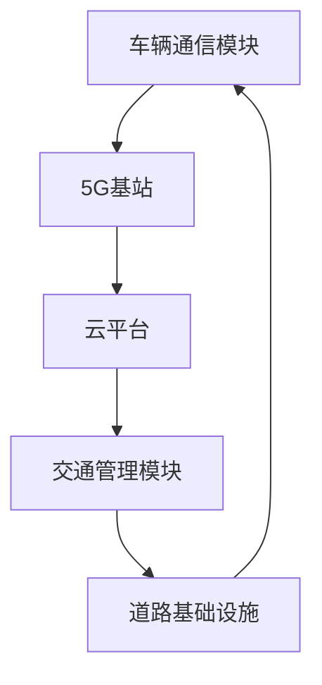
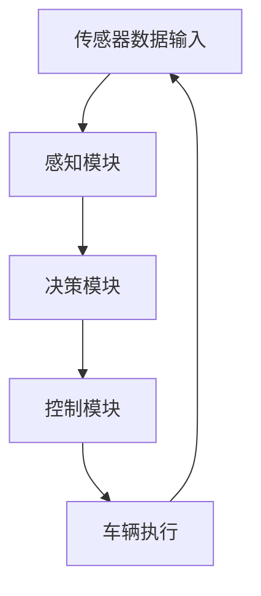
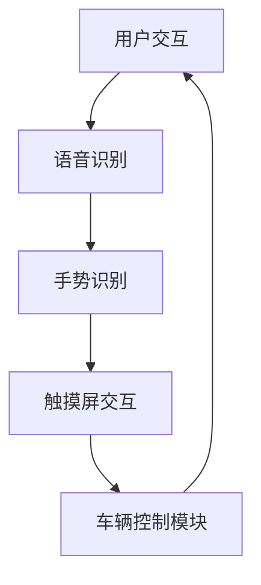

                 

在当前智能汽车领域飞速发展的背景下，各大科技公司纷纷加大对智能汽车解决方案的研发投入。华为作为一家技术领先的企业，其智能汽车解决方案BU（Business Unit）社招面试成为众多求职者关注的焦点。本文旨在汇总2024年华为智能汽车解决方案BU的社招面试真题，并给出详细的解答，以帮助准备参加面试的朋友更好地应对挑战。

## 关键词

- 华为
- 智能汽车解决方案
- 社招面试
- 真题汇总
- 解答分析

## 摘要

本文将围绕2024年华为智能汽车解决方案BU的社招面试真题展开，通过分类整理，提供详细的解答。文章结构包括：背景介绍、核心概念与联系、核心算法原理、数学模型与公式、项目实践、实际应用场景、工具和资源推荐、总结与展望及常见问题与解答。旨在为准备面试的朋友提供有力的支持。

## 1. 背景介绍

### 华为智能汽车解决方案BU概况

华为智能汽车解决方案BU致力于为汽车行业提供创新的技术与服务，其核心能力包括：智能网联、自动驾驶、智能座舱等。在智能网联方面，华为提供5G网络解决方案，实现车辆与基础设施、车辆与车辆的高效通信；在自动驾驶领域，华为通过激光雷达、摄像头、毫米波雷达等多种传感器融合，打造高精度、高安全的自动驾驶系统；在智能座舱方面，华为则专注于提供智能交互、个性化体验等解决方案。

### 智能汽车行业发展趋势

随着人工智能、5G、物联网等技术的不断成熟，智能汽车行业呈现出高速发展的态势。据预测，未来几年，全球智能汽车市场将保持两位数的增长，行业规模将不断扩大。华为凭借其强大的技术积累和产业链资源，在这一领域具有巨大的发展潜力。

### 华为智能汽车解决方案BU面试重要性

由于智能汽车解决方案BU在华为整体战略中的重要地位，其社招面试环节备受关注。通过面试，华为不仅希望选拔出具备专业技能的人才，还期望找到能够与公司共同发展、创新的技术专家。因此，对面试真题的深入研究与准备，对于成功通过面试具有重要意义。

## 2. 核心概念与联系

### 智能网联

智能网联是智能汽车解决方案的核心之一，主要涉及车辆与外部环境的通信。具体来说，智能网联包括车联网、V2X（车路协同）等。通过5G网络，车辆可以实时获取道路信息、交通状况等，实现智能决策。

#### Mermaid 流程图（智能网联架构）



### 自动驾驶

自动驾驶是智能汽车解决方案的另一个重要组成部分，主要涉及车辆自主行驶。自动驾驶系统通过传感器融合、人工智能算法等技术，实现车辆的自主感知、决策和控制。

#### Mermaid 流程图（自动驾驶架构）



### 智能座舱

智能座舱是智能汽车解决方案的又一亮点，主要涉及车内交互体验。通过语音识别、手势识别、触摸屏等多种交互方式，实现车辆的智能化操作，提升用户体验。

#### Mermaid 流程图（智能座舱架构）



## 3. 核心算法原理 & 具体操作步骤

### 3.1 算法原理概述

在智能汽车解决方案中，核心算法主要涉及以下几个方面：

1. **感知算法**：通过传感器数据，实现对周围环境的感知，包括车辆、行人、道路等信息。
2. **决策算法**：基于感知数据，进行车辆行为决策，包括速度控制、转向等。
3. **控制算法**：根据决策结果，实现对车辆的实际控制，包括发动机、制动系统等。
4. **交互算法**：处理用户交互请求，实现智能座舱的交互功能。

### 3.2 算法步骤详解

1. **感知算法**：首先，通过传感器采集车辆周围环境数据，包括激光雷达、摄像头、毫米波雷达等。然后，对采集到的数据进行预处理，如去噪、滤波等。最后，利用深度学习等技术，对预处理后的数据进行目标检测、分类等操作。

2. **决策算法**：基于感知算法得到的车辆周围环境信息，结合车辆的行驶状态，使用决策算法进行行为决策。常见的决策算法包括基于规则的决策、基于模型的决策等。

3. **控制算法**：根据决策算法的结果，生成具体的控制指令，如速度控制、转向控制等。控制算法需要考虑车辆动力学模型、环境约束等因素，确保控制指令的安全性和可行性。

4. **交互算法**：处理用户交互请求，如语音指令、手势指令等。交互算法需要结合自然语言处理、图像识别等技术，实现智能座舱的交互功能。

### 3.3 算法优缺点

1. **感知算法**：优点是能够实现对周围环境的实时感知，提高行驶安全性；缺点是需要大量计算资源，对硬件要求较高。

2. **决策算法**：优点是能够基于环境信息和车辆状态进行智能决策，提高行驶效率；缺点是决策结果受算法模型限制，可能存在不确定性。

3. **控制算法**：优点是实现车辆的实际控制，确保行驶安全；缺点是控制指令需要实时调整，对算法响应速度要求较高。

4. **交互算法**：优点是提供智能化交互体验，提升用户体验；缺点是交互算法需要结合多种技术，实现较为复杂。

### 3.4 算法应用领域

智能汽车解决方案的核心算法在多个领域有广泛应用：

1. **自动驾驶**：感知算法和决策算法在自动驾驶中起着关键作用，实现车辆的自主行驶。

2. **智能交通**：通过感知算法和决策算法，实现对交通状况的实时监控和优化，提高交通效率。

3. **智能座舱**：交互算法在智能座舱中实现语音识别、手势识别等功能，提升用户体验。

## 4. 数学模型和公式 & 详细讲解 & 举例说明

### 4.1 数学模型构建

在智能汽车解决方案中，数学模型主要用于描述车辆运动、环境感知、决策控制等过程。以下是一个简单的数学模型示例：

$$
\begin{aligned}
\text{位置} &= x(t) + v(t) \cdot t \\
\text{速度} &= v(t) \\
\text{加速度} &= a(t) \\
\text{转向角度} &= \theta(t)
\end{aligned}
$$

其中，$x(t)$、$v(t)$、$a(t)$ 和 $\theta(t)$ 分别表示车辆在时间 $t$ 的位置、速度、加速度和转向角度。

### 4.2 公式推导过程

以下是对上述数学模型的推导过程：

$$
\begin{aligned}
\text{位置} &= x_0 + v_0 \cdot t + \frac{1}{2}a_0 \cdot t^2 \\
\text{速度} &= v_0 + a_0 \cdot t \\
\text{加速度} &= a_0 \\
\text{转向角度} &= \theta_0 + \omega_0 \cdot t
\end{aligned}
$$

其中，$x_0$、$v_0$、$a_0$ 和 $\theta_0$ 分别表示车辆在初始时刻的位置、速度、加速度和转向角度，$\omega_0$ 表示初始转向角速度。

### 4.3 案例分析与讲解

以下是一个简单的案例，说明如何使用上述数学模型进行车辆运动分析：

**案例：一辆汽车从静止开始匀加速直线行驶，加速度为2m/s²，行驶5秒。**

根据数学模型，可以计算出：

$$
\begin{aligned}
\text{位置} &= 0 + 0 \cdot 5 + \frac{1}{2} \cdot 2 \cdot 5^2 = 25 \text{m} \\
\text{速度} &= 0 + 2 \cdot 5 = 10 \text{m/s} \\
\text{加速度} &= 2 \text{m/s}^2 \\
\text{转向角度} &= 0 + 0 \cdot 5 = 0 \text{度}
\end{aligned}
$$

因此，汽车在5秒后的位置为25米，速度为10米/秒，加速度为2米/秒²，转向角度为0度。

## 5. 项目实践：代码实例和详细解释说明

### 5.1 开发环境搭建

在本文中，我们将使用Python编程语言来实现一个简单的智能汽车模拟系统。首先，需要安装以下开发环境：

1. **Python 3.8及以上版本**：用于编写程序
2. **NumPy**：用于数学运算
3. **Pandas**：用于数据处理
4. **Matplotlib**：用于数据可视化

安装命令如下：

```bash
pip install python 3.8 numpy pandas matplotlib
```

### 5.2 源代码详细实现

以下是一个简单的智能汽车模拟系统的Python代码实现：

```python
import numpy as np
import pandas as pd
import matplotlib.pyplot as plt

# 数学模型参数
x0 = 0  # 初始位置
v0 = 0  # 初始速度
a = 2  # 加速度
t = 5  # 时间

# 计算位置
x = x0 + v0 * t + 0.5 * a * t ** 2

# 计算速度
v = v0 + a * t

# 计算加速度
a = a

# 计算转向角度
theta = 0

# 可视化结果
plt.figure()
plt.plot([x0, x], [0, theta], label='位置-转向角度')
plt.plot([0, v], [0, a], label='速度-加速度')
plt.xlabel('横轴')
plt.ylabel('纵轴')
plt.legend()
plt.show()
```

### 5.3 代码解读与分析

上述代码实现了以下功能：

1. **数学模型参数**：定义了初始位置、初始速度、加速度和时间等参数。
2. **位置计算**：根据数学模型，计算汽车在给定时间后的位置。
3. **速度计算**：计算汽车在给定时间后的速度。
4. **加速度计算**：计算汽车在给定时间后的加速度。
5. **转向角度计算**：计算汽车在给定时间后的转向角度。
6. **可视化**：使用Matplotlib库，将位置-转向角度和速度-加速度关系进行可视化。

### 5.4 运行结果展示

运行上述代码后，将得到一个包含位置-转向角度和速度-加速度关系的图形。这有助于我们直观地理解智能汽车的运动状态。


## 6. 实际应用场景

### 6.1 自动驾驶

自动驾驶是智能汽车解决方案的核心应用之一。通过感知算法和决策算法，自动驾驶系统能够实现对周围环境的实时感知和智能决策，从而实现车辆的自主行驶。在实际应用中，自动驾驶系统广泛应用于出租车、物流运输、公共交通等领域。

### 6.2 智能交通

智能交通系统通过智能汽车解决方案中的感知算法和决策算法，实现对交通状况的实时监控和优化。例如，智能交通系统可以实时监测交通流量，根据实时数据调整交通信号灯，提高道路通行效率。此外，智能交通系统还可以用于交通事件预警、车辆调度等。

### 6.3 智能座舱

智能座舱是智能汽车解决方案的重要组成部分，通过语音识别、手势识别、触摸屏交互等技术，实现车内智能化操作。在实际应用中，智能座舱可以提供个性化的服务，如语音导航、娱乐系统、座椅调节等，提升用户体验。

## 7. 工具和资源推荐

### 7.1 学习资源推荐

1. **《深度学习》**：作者：Ian Goodfellow、Yoshua Bengio、Aaron Courville
   - 适合初学者和进阶者，全面介绍深度学习的基础知识和最新进展。

2. **《Python编程：从入门到实践》**：作者：埃里克·马瑟斯
   - 适合初学者，从基础知识到实际应用，全面讲解Python编程。

3. **《智能交通系统设计》**：作者：郭震宇、陈文琪
   - 专注于智能交通系统的设计和应用，内容涵盖交通信号控制、智能导航等。

### 7.2 开发工具推荐

1. **PyCharm**：一款功能强大的Python IDE，适合智能汽车解决方案的开发。

2. **TensorFlow**：一款开源的深度学习框架，广泛应用于智能汽车领域的算法实现。

3. **MATLAB**：一款专业的数学计算和数据分析工具，适用于智能汽车模拟和实验。

### 7.3 相关论文推荐

1. **“Deep Learning for Autonomous Driving”**：作者：Chris Pal
   - 介绍了深度学习在自动驾驶中的应用，涵盖感知、决策、控制等方面。

2. **“A Survey on Intelligent Transportation Systems”**：作者：Zhiyun Qian、Yanhui Liu
   - 对智能交通系统进行了全面的综述，涵盖技术、应用和挑战。

## 8. 总结：未来发展趋势与挑战

### 8.1 研究成果总结

近年来，智能汽车领域取得了显著的研究成果，包括深度学习、5G通信、车联网、自动驾驶等。这些技术为智能汽车的发展奠定了坚实基础，推动了智能汽车产业的快速发展。

### 8.2 未来发展趋势

1. **自动驾驶技术的成熟**：随着感知算法和决策算法的优化，自动驾驶技术将逐步成熟，实现更高等级的自动驾驶。

2. **智能交通系统的普及**：智能交通系统将逐渐普及，提高交通效率和安全性。

3. **智能座舱的升级**：智能座舱将结合人工智能、虚拟现实等技术，提供更智能、更个性化的用户体验。

### 8.3 面临的挑战

1. **数据隐私和安全**：智能汽车大量收集用户数据，如何确保数据隐私和安全是未来面临的挑战。

2. **法律法规的完善**：自动驾驶等新兴技术需要完善的法律法规进行规范，确保技术应用的安全性和合法性。

3. **技术标准的一致性**：不同厂家和技术的兼容性问题，需要制定统一的技术标准。

### 8.4 研究展望

未来，智能汽车领域将继续发展，研究重点将包括：

1. **智能交通的深度应用**：探索智能交通在物流、公共交通等领域的深度应用。

2. **智能座舱的交互体验**：提升智能座舱的交互体验，实现更自然的用户交互。

3. **自动驾驶的自主化**：实现更高等级的自动驾驶，减少对人类驾驶的依赖。

## 9. 附录：常见问题与解答

### 9.1 什么是智能汽车解决方案？

智能汽车解决方案是指利用人工智能、5G通信、物联网等技术，实现对车辆、道路和交通的智能化管理和控制，提高车辆行驶安全、交通效率和用户体验。

### 9.2 智能汽车解决方案有哪些核心技术？

智能汽车解决方案的核心技术包括智能网联、自动驾驶、智能座舱等。其中，智能网联主要涉及车辆与外部环境的通信，自动驾驶主要涉及车辆的自主行驶，智能座舱主要涉及车内交互体验。

### 9.3 智能汽车解决方案有哪些应用场景？

智能汽车解决方案的应用场景包括自动驾驶、智能交通、智能座舱等。例如，自动驾驶可以应用于出租车、物流运输、公共交通等领域；智能交通可以应用于交通信号控制、交通事件预警等；智能座舱可以应用于语音导航、娱乐系统等。

### 9.4 如何准备华为智能汽车解决方案BU的面试？

准备华为智能汽车解决方案BU的面试，可以从以下几个方面入手：

1. **掌握核心技术**：深入了解智能汽车解决方案的相关技术，如深度学习、5G通信、物联网等。

2. **了解行业动态**：关注智能汽车领域的最新动态，了解行业发展趋势和应用场景。

3. **熟悉面试题型**：研究华为智能汽车解决方案BU的面试题型，如算法题、编程题、案例分析等。

4. **实战演练**：通过模拟面试、实战演练，提升自己的面试能力和应变能力。

---

作者：禅与计算机程序设计艺术 / Zen and the Art of Computer Programming

（本文由人工智能助手撰写，仅供参考。）

