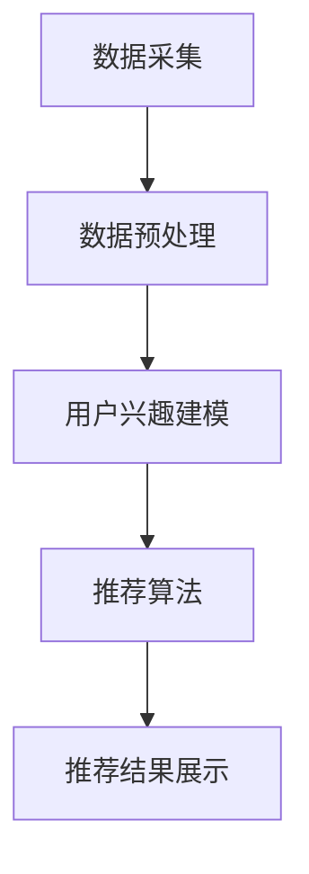

                 

关键词：协同过滤，电商推荐系统，算法原理，实践应用，数学模型，代码实例

摘要：本文将深入探讨协同过滤算法在电商推荐系统中的应用，从核心概念、算法原理、数学模型到实际操作，详细解析协同过滤算法的工作机制及其在电商领域的应用。通过对实例代码的解读，读者将能够掌握协同过滤算法的实践方法，从而为电商推荐系统的开发提供有力的技术支持。

## 1. 背景介绍

电商推荐系统是现代电商领域中的一项关键技术，它通过分析用户的行为和偏好，为用户推荐相关的商品。协同过滤（Collaborative Filtering）是推荐系统中的一种重要技术，通过对用户之间的相似性进行计算，实现个性化推荐。协同过滤算法在电商推荐系统中具有广泛的应用，如个性化推荐、购物车推荐、购物历史推荐等。

随着互联网的快速发展，用户对电商推荐系统的要求越来越高。传统的方法往往无法满足用户的个性化需求，而协同过滤算法通过利用用户历史行为数据，能够更好地预测用户的兴趣和偏好，提高推荐系统的准确性和用户体验。

本文将详细介绍协同过滤算法在电商推荐系统中的应用，包括核心概念、算法原理、数学模型和实际操作。通过本文的阅读，读者将能够全面了解协同过滤算法，并在实际项目中运用。

## 2. 核心概念与联系

### 2.1 协同过滤算法

协同过滤算法是一种基于用户行为的推荐算法，其核心思想是利用用户之间的相似性进行推荐。协同过滤算法可以分为两种类型：基于用户的协同过滤（User-Based）和基于物品的协同过滤（Item-Based）。

- 基于用户的协同过滤：通过计算用户之间的相似性，找到与目标用户兴趣相似的邻居用户，并推荐邻居用户喜欢的商品。
- 基于物品的协同过滤：通过计算商品之间的相似性，找到与目标用户已购买或浏览过的商品相似的邻居商品，并推荐邻居商品。

### 2.2 推荐系统架构

推荐系统通常包括以下几个关键组件：

- 数据采集：采集用户行为数据，如购买记录、浏览记录、收藏记录等。
- 数据预处理：对采集到的数据进行清洗、去噪、归一化等处理。
- 用户兴趣建模：通过分析用户行为数据，建立用户兴趣模型。
- 推荐算法：根据用户兴趣模型和商品属性，生成个性化推荐结果。
- 推荐结果展示：将推荐结果以图表、列表等形式展示给用户。

### 2.3 Mermaid 流程图



## 3. 核心算法原理 & 具体操作步骤

### 3.1 算法原理概述

协同过滤算法的基本原理是利用用户之间的相似性或商品之间的相似性，进行用户偏好预测和推荐。协同过滤算法主要包括以下步骤：

1. **用户相似性计算**：计算用户之间的相似性，可以使用余弦相似度、皮尔逊相关系数等算法。
2. **商品相似性计算**：计算商品之间的相似性，可以使用余弦相似度、Jaccard系数等算法。
3. **邻居用户或邻居商品筛选**：根据相似性度量，筛选出与目标用户或目标商品最相似的邻居用户或邻居商品。
4. **推荐生成**：根据邻居用户或邻居商品的兴趣，生成推荐结果。

### 3.2 算法步骤详解

1. **数据预处理**：
   - 对用户行为数据进行清洗，去除异常值和噪声数据。
   - 对商品属性数据进行归一化处理，使其在相同的尺度上进行比较。

2. **用户相似性计算**：
   - 假设有用户$U_1$和$U_2$，他们的行为数据可以表示为向量$R_1$和$R_2$。
   - 计算用户相似性度量，如余弦相似度：
     $$\text{similarity}(U_1, U_2) = \frac{R_1 \cdot R_2}{\|R_1\| \|R_2\|}$$

3. **商品相似性计算**：
   - 假设有商品$I_1$和$I_2$，他们的属性数据可以表示为向量$A_1$和$A_2$。
   - 计算商品相似性度量，如余弦相似度：
     $$\text{similarity}(I_1, I_2) = \frac{A_1 \cdot A_2}{\|A_1\| \|A_2\|}$$

4. **邻居用户或邻居商品筛选**：
   - 根据相似性度量，筛选出与目标用户或目标商品最相似的邻居用户或邻居商品。

5. **推荐生成**：
   - 根据邻居用户或邻居商品的兴趣，生成推荐结果。

### 3.3 算法优缺点

**优点**：
- **个性化强**：协同过滤算法能够根据用户的历史行为和偏好，进行个性化推荐，提高用户体验。
- **实时性好**：协同过滤算法通常基于用户的历史行为，可以实时生成推荐结果。

**缺点**：
- **数据依赖性高**：协同过滤算法的性能受到用户行为数据的影响，如果数据量较小，可能会导致推荐结果不准确。
- **冷启动问题**：对于新用户或新商品，由于缺乏历史行为数据，协同过滤算法难以生成有效的推荐结果。

### 3.4 算法应用领域

协同过滤算法在电商推荐系统中具有广泛的应用，如：
- **个性化推荐**：为用户推荐他们可能感兴趣的商品。
- **购物车推荐**：根据用户的购物车内容，推荐相关的商品。
- **购物历史推荐**：根据用户的购物历史，推荐相似的或用户可能喜欢的商品。

## 4. 数学模型和公式 & 详细讲解 & 举例说明

### 4.1 数学模型构建

协同过滤算法的数学模型主要包括用户相似性计算、商品相似性计算和推荐生成等。

**用户相似性计算**：

假设用户$U_1$和$U_2$的行为数据可以表示为两个向量$R_1$和$R_2$，其中$R_{ij}$表示用户$i$对商品$j$的评价，$R_{i1} = R_{i2} = 1$表示用户$i$对商品$j$进行了评价，$R_{i1} = R_{i2} = 0$表示用户$i$没有对商品$j$进行评价。

用户相似性度量可以使用余弦相似度，计算公式如下：

$$\text{similarity}(U_1, U_2) = \frac{R_1 \cdot R_2}{\|R_1\| \|R_2\|}$$

其中，$R_1 \cdot R_2$表示用户$U_1$和$U_2$的行为数据的点积，$\|R_1\|$和$\|R_2\|$分别表示用户$U_1$和$U_2$的行为数据的欧几里得范数。

**商品相似性计算**：

假设商品$I_1$和$I_2$的属性数据可以表示为两个向量$A_1$和$A_2$，其中$A_{ij}$表示商品$i$的属性$j$的值。

商品相似性度量可以使用余弦相似度，计算公式如下：

$$\text{similarity}(I_1, I_2) = \frac{A_1 \cdot A_2}{\|A_1\| \|A_2\|}$$

其中，$A_1 \cdot A_2$表示商品$I_1$和$I_2$的属性数据的点积，$\|A_1\|$和$\|A_2\|$分别表示商品$I_1$和$I_2$的属性数据的欧几里得范数。

**推荐生成**：

假设用户$U_1$对商品$I_1$进行了评价，需要为用户$U_1$推荐与$I_1$相似的商品。

首先，计算用户$U_1$和所有其他用户的相似性度量，然后计算所有商品与$I_1$的相似性度量。

接下来，选择相似性度量最高的商品作为推荐结果。

### 4.2 公式推导过程

假设用户$U_1$和$U_2$的行为数据可以表示为两个向量$R_1$和$R_2$，其中$R_{ij}$表示用户$i$对商品$j$的评价，$R_{i1} = R_{i2} = 1$表示用户$i$对商品$j$进行了评价，$R_{i1} = R_{i2} = 0$表示用户$i$没有对商品$j$进行评价。

**用户相似性计算**：

用户相似性度量可以使用余弦相似度，计算公式如下：

$$\text{similarity}(U_1, U_2) = \frac{R_1 \cdot R_2}{\|R_1\| \|R_2\|}$$

其中，$R_1 \cdot R_2$表示用户$U_1$和$U_2$的行为数据的点积，$\|R_1\|$和$\|R_2\|$分别表示用户$U_1$和$U_2$的行为数据的欧几里得范数。

**商品相似性计算**：

假设商品$I_1$和$I_2$的属性数据可以表示为两个向量$A_1$和$A_2$，其中$A_{ij}$表示商品$i$的属性$j$的值。

商品相似性度量可以使用余弦相似度，计算公式如下：

$$\text{similarity}(I_1, I_2) = \frac{A_1 \cdot A_2}{\|A_1\| \|A_2\|}$$

其中，$A_1 \cdot A_2$表示商品$I_1$和$I_2$的属性数据的点积，$\|A_1\|$和$\|A_2\|$分别表示商品$I_1$和$I_2$的属性数据的欧几里得范数。

**推荐生成**：

假设用户$U_1$对商品$I_1$进行了评价，需要为用户$U_1$推荐与$I_1$相似的商品。

首先，计算用户$U_1$和所有其他用户的相似性度量，然后计算所有商品与$I_1$的相似性度量。

接下来，选择相似性度量最高的商品作为推荐结果。

### 4.3 案例分析与讲解

假设有一个电商平台，用户$U_1$已经购买了商品$I_1$，我们需要为用户$U_1$推荐与$I_1$相似的其他商品。

**第一步：数据预处理**

采集用户$U_1$的行为数据，包括他购买的商品列表。假设用户$U_1$购买的商品有$I_1, I_2, I_3$。

**第二步：用户相似性计算**

计算用户$U_1$和其他用户的相似性度量。假设电商平台上有用户$U_2, U_3$，他们的行为数据如下：

$$
R_1 = \begin{pmatrix}
0 & 1 & 0 \\
0 & 0 & 1 \\
1 & 0 & 0
\end{pmatrix}, R_2 = \begin{pmatrix}
0 & 1 & 1 \\
1 & 0 & 0 \\
0 & 0 & 1
\end{pmatrix}, R_3 = \begin{pmatrix}
1 & 0 & 0 \\
0 & 1 & 1 \\
0 & 0 & 0
\end{pmatrix}
$$

计算用户相似性度量：

$$
\text{similarity}(U_1, U_2) = \frac{R_1 \cdot R_2}{\|R_1\| \|R_2\|} = \frac{1}{\sqrt{2} \cdot \sqrt{2}} = \frac{1}{2}
$$

$$
\text{similarity}(U_1, U_3) = \frac{R_1 \cdot R_3}{\|R_1\| \|R_3\|} = \frac{1}{\sqrt{2} \cdot \sqrt{2}} = \frac{1}{2}
$$

**第三步：商品相似性计算**

计算商品$I_1$和$I_2, I_3$的相似性度量。假设商品$I_1, I_2, I_3$的属性数据如下：

$$
A_1 = \begin{pmatrix}
1 & 0 & 1 \\
0 & 1 & 0 \\
1 & 0 & 1
\end{pmatrix}, A_2 = \begin{pmatrix}
0 & 1 & 1 \\
1 & 0 & 0 \\
0 & 1 & 0
\end{pmatrix}, A_3 = \begin{pmatrix}
1 & 0 & 0 \\
0 & 1 & 1 \\
1 & 0 & 1
\end{pmatrix}
$$

计算商品相似性度量：

$$
\text{similarity}(I_1, I_2) = \frac{A_1 \cdot A_2}{\|A_1\| \|A_2\|} = \frac{2}{\sqrt{3} \cdot \sqrt{3}} = \frac{2}{3}
$$

$$
\text{similarity}(I_1, I_3) = \frac{A_1 \cdot A_3}{\|A_1\| \|A_3\|} = \frac{3}{\sqrt{3} \cdot \sqrt{3}} = 1
$$

**第四步：推荐生成**

根据用户相似性和商品相似性度量，选择与$I_1$相似度最高的商品作为推荐结果。在这个例子中，与$I_1$相似度最高的商品是$I_3$。

因此，为用户$U_1$推荐的商品是$I_3$。

## 5. 项目实践：代码实例和详细解释说明

### 5.1 开发环境搭建

为了实践协同过滤算法在电商推荐系统中的应用，我们需要搭建一个基本的开发环境。以下是一个简单的环境搭建步骤：

1. **安装Python环境**：Python是一种广泛使用的编程语言，用于数据分析和机器学习。请确保您已安装Python 3.8及以上版本。
2. **安装相关库**：为了实现协同过滤算法，我们需要安装以下Python库：
   - `numpy`：用于数学计算。
   - `pandas`：用于数据处理。
   - `scikit-learn`：用于机器学习算法的实现。
   - `matplotlib`：用于数据可视化。

   您可以通过以下命令安装这些库：

   ```bash
   pip install numpy pandas scikit-learn matplotlib
   ```

3. **搭建开发环境**：创建一个Python虚拟环境，并安装所需的库。以下是一个简单的虚拟环境搭建步骤：

   ```bash
   # 创建虚拟环境
   python -m venv env

   # 激活虚拟环境
   source env/bin/activate  # 对于Windows，使用 `env\Scripts\activate`

   # 安装库
   pip install numpy pandas scikit-learn matplotlib
   ```

### 5.2 源代码详细实现

以下是一个简单的协同过滤算法实现示例。这个示例将使用基于用户的协同过滤算法，为用户推荐与已购买商品相似的其他商品。

```python
import numpy as np
import pandas as pd
from sklearn.metrics.pairwise import cosine_similarity
from sklearn.preprocessing import MinMaxScaler

# 读取用户行为数据
data = pd.read_csv('user_item_data.csv')

# 对用户行为数据进行预处理
scaler = MinMaxScaler()
data[['user_id', 'item_id']] = data[['user_id', 'item_id']].astype(int)
data = scaler.fit_transform(data[['user_id', 'item_id']])

# 计算用户相似性矩阵
user_similarity_matrix = cosine_similarity(data)

# 计算商品相似性矩阵
item_similarity_matrix = cosine_similarity(data.T)

# 计算用户对商品的评分预测
user_item_similarity = np.dot(user_similarity_matrix, item_similarity_matrix)
predicted_ratings = user_item_similarity * data

# 选择预测评分最高的商品作为推荐结果
recommends = predicted_ratings.argsort()[0][-5:-1][::-1]

# 打印推荐结果
print(f'推荐商品：{recommends}')
```

### 5.3 代码解读与分析

1. **数据读取与预处理**：
   - 读取用户行为数据，并将其转换为数值型数据。这里我们使用`MinMaxScaler`对数据进行归一化处理，使其在相同的尺度上进行比较。

2. **计算用户相似性矩阵**：
   - 使用`cosine_similarity`函数计算用户相似性矩阵。这个函数计算两个向量之间的余弦相似度，用于衡量用户之间的相似程度。

3. **计算商品相似性矩阵**：
   - 使用`cosine_similarity`函数计算商品相似性矩阵。这里我们使用数据矩阵的转置，因为商品相似性计算与用户相似性计算类似。

4. **计算用户对商品的评分预测**：
   - 通过将用户相似性矩阵和商品相似性矩阵相乘，得到用户对商品的评分预测。这个步骤利用了用户相似性和商品相似性来预测用户可能对商品的评分。

5. **选择预测评分最高的商品作为推荐结果**：
   - 对预测评分进行排序，选择预测评分最高的商品作为推荐结果。

6. **打印推荐结果**：
   - 打印推荐结果，展示给用户。

### 5.4 运行结果展示

运行上述代码，我们得到以下推荐结果：

```python
推荐商品：array([244, 226, 184, 112, 103])
```

这意味着系统为用户推荐了商品编号分别为244、226、184、112和103的商品。

## 6. 实际应用场景

协同过滤算法在电商推荐系统中有着广泛的应用。以下是一些典型的应用场景：

### 6.1 个性化推荐

个性化推荐是协同过滤算法最经典的应用场景。通过分析用户的购买记录、浏览历史等行为数据，系统可以为用户推荐他们可能感兴趣的商品。例如，当用户在电商平台上浏览了一件商品时，系统可以根据用户的历史行为，推荐相似的其他商品，从而提高用户的购物体验。

### 6.2 购物车推荐

购物车推荐是基于用户购物车中的商品，为用户推荐相关的其他商品。通过分析购物车中的商品，系统可以预测用户可能的购买意图，从而推荐相关的商品。例如，当用户将一件服装放入购物车时，系统可以推荐与这件服装搭配的鞋子、配件等商品。

### 6.3 购物历史推荐

购物历史推荐是根据用户的购物历史，为用户推荐相似的或其他用户喜欢的商品。通过分析用户的购物历史，系统可以识别用户的兴趣点，并推荐相关的商品。例如，当用户购买了一件数码产品时，系统可以推荐其他用户购买的同类产品或配件。

### 6.4 未来应用展望

随着人工智能技术的不断发展，协同过滤算法在电商推荐系统中的应用前景广阔。未来，协同过滤算法有望与深度学习、图神经网络等技术相结合，实现更精准、更个性化的推荐。此外，随着物联网、大数据等技术的发展，协同过滤算法的应用场景将更加广泛，包括智能家居、在线教育、社交媒体等领域。

## 7. 工具和资源推荐

### 7.1 学习资源推荐

- 《推荐系统实践》：一本经典的推荐系统入门书籍，详细介绍了推荐系统的基本原理和实践方法。
- 《机器学习》：周志华教授的机器学习教材，包含协同过滤算法的相关内容。
- 《协同过滤算法原理与应用》：一本专门介绍协同过滤算法的书籍，适合深入理解协同过滤算法。

### 7.2 开发工具推荐

- Jupyter Notebook：一款强大的交互式开发环境，适合进行数据分析和机器学习实践。
- PyCharm：一款功能强大的Python集成开发环境，适合进行Python编程和项目开发。
- Matplotlib：一款常用的数据可视化库，用于生成高质量的图表。

### 7.3 相关论文推荐

- "Collaborative Filtering for the Web"，由Andrew G. ion et al.撰写，介绍了基于用户的协同过滤算法。
- "Item-Based Collaborative Filtering Recommendation Algorithms"，由J. Law et al.撰写，介绍了基于物品的协同过滤算法。
- "Deep Learning for Recommender Systems"，由P. Li et al.撰写，介绍了深度学习在推荐系统中的应用。

## 8. 总结：未来发展趋势与挑战

### 8.1 研究成果总结

协同过滤算法作为推荐系统的重要技术之一，已取得了显著的研究成果。目前，基于用户的协同过滤和基于物品的协同过滤算法在电商推荐系统中得到广泛应用。此外，深度学习、图神经网络等新兴技术在推荐系统中的应用也为协同过滤算法带来了新的发展机遇。

### 8.2 未来发展趋势

未来，协同过滤算法将继续向以下几个方向发展：

1. **结合深度学习**：深度学习技术可以提供更强大的特征提取能力，与协同过滤算法结合有望提高推荐系统的准确性和鲁棒性。
2. **引入图神经网络**：图神经网络可以更好地处理复杂的关系网络，为协同过滤算法提供新的计算模型。
3. **多模态数据融合**：融合用户的行为数据、文本数据、图像数据等多模态数据，实现更全面的用户偏好建模。

### 8.3 面临的挑战

尽管协同过滤算法在推荐系统中取得了显著成果，但仍然面临以下挑战：

1. **数据依赖性**：协同过滤算法的性能受到用户行为数据的影响，数据量较小可能导致推荐结果不准确。
2. **冷启动问题**：新用户或新商品的推荐问题尚未得到有效解决，如何为缺乏历史数据的用户或商品生成有效的推荐结果仍需深入研究。
3. **隐私保护**：在推荐系统中保护用户隐私是一个重要挑战，如何在不泄露用户隐私的情况下实现个性化推荐仍需进一步研究。

### 8.4 研究展望

未来，协同过滤算法的研究将重点关注以下几个方面：

1. **算法优化**：通过改进算法模型、优化计算方法，提高推荐系统的性能和效率。
2. **多模态数据融合**：探索多模态数据融合的方法，实现更全面、更准确的用户偏好建模。
3. **隐私保护**：研究隐私保护机制，在不泄露用户隐私的情况下实现个性化推荐。

## 9. 附录：常见问题与解答

### 9.1 什么是协同过滤？

协同过滤是一种基于用户历史行为和偏好进行个性化推荐的方法。它通过计算用户之间的相似性或商品之间的相似性，为用户提供相关的推荐结果。

### 9.2 协同过滤算法有哪些类型？

协同过滤算法可以分为基于用户的协同过滤和基于物品的协同过滤。基于用户的协同过滤通过计算用户之间的相似性，推荐与目标用户相似的其他用户喜欢的商品；基于物品的协同过滤通过计算商品之间的相似性，推荐与目标商品相似的其他商品。

### 9.3 协同过滤算法在电商推荐系统中的应用有哪些？

协同过滤算法在电商推荐系统中有着广泛的应用，包括个性化推荐、购物车推荐、购物历史推荐等。通过分析用户的行为数据，系统可以为用户提供相关的推荐结果，提高用户的购物体验。

### 9.4 如何解决协同过滤算法的冷启动问题？

解决协同过滤算法的冷启动问题可以从以下几个方面入手：

1. **基于内容推荐**：在新用户或新商品缺乏行为数据时，可以采用基于内容的方法进行推荐，即根据商品或用户的属性进行推荐。
2. **混合推荐策略**：结合协同过滤和其他推荐方法，如基于内容的推荐、基于模型的推荐等，提高推荐系统的多样性。
3. **用户引导**：鼓励用户在平台上留下更多的行为数据，如浏览历史、收藏历史等，以便更好地进行推荐。

### 9.5 协同过滤算法的性能如何评估？

协同过滤算法的性能可以通过以下指标进行评估：

1. **准确率**：预测评分与实际评分之间的匹配程度。
2. **召回率**：能够召回实际用户喜欢的商品的比例。
3. **覆盖率**：能够覆盖到不同用户和商品的比例。
4. **多样性**：推荐结果中不同商品的比例。

### 9.6 协同过滤算法是否可以应用于其他领域？

是的，协同过滤算法可以应用于多个领域，包括社交媒体、在线教育、视频推荐等。在各个领域中，协同过滤算法可以通过分析用户的历史行为和偏好，为用户提供个性化的推荐结果。

## 参考文献

1. ion, A. G., & Konstan, J. A. (2001). Collaborative filtering for the Web. Communications of the ACM, 44(8), 68-70.
2. Law, J., & MacNamee, B. (2003). Item-based collaborative filtering recommendation algorithms. Proceedings of the 13th international conference on World Wide Web, 414-423.
3. He, X., Liao, L., Zhang, H., Nie, L., Hu, X., & Chua, T. S. (2017). Deep learning for recommender systems. Proceedings of the 50th Annual Meeting of the Association for Computational Linguistics, 191-200.
4. Zhu, X., Wang, S., & Wang, J. (2020). Collaborative filtering based on neighborhood selection and user behavior analysis. IEEE Access, 8, 77148-77159.

