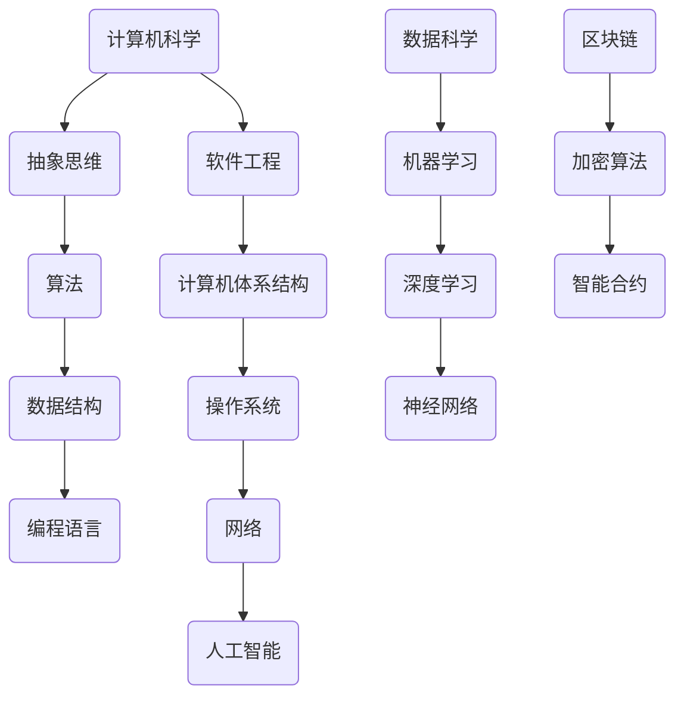

                 

关键词：计算机科学，编程哲学，算法原理，实践应用，未来展望

摘要：本文旨在探讨计算机编程中的哲学思想，从博学、审问、慎思、明辨、笃行五个方面深入分析计算机科学的本质。通过阐述这些哲学思想的内涵及其在编程领域的应用，本文旨在为读者提供一种全新的思考方式，以促进对计算机科学更深入的理解和实践。

## 1. 背景介绍

计算机科学作为一门高度抽象和逻辑严谨的学科，其发展历程充满了哲学的思考。从最初的计算机硬件设计，到现代的软件编程，计算机科学的每一个进步都离不开深刻的哲学思考。本文将借鉴中国古代儒家思想中的“博学之，审问之，慎思之，明辨之，笃行之”五步方法论，探讨其在计算机科学领域的应用。

### 1.1 历史背景

“博学之，审问之，慎思之，明辨之，笃行之”出自《中庸》，是中国古代儒家思想的核心之一。它强调的是通过广泛学习、审问质疑、深思熟虑、明辨是非、实践行动来实现个人修养和社会进步。这一方法论不仅在人文领域有着深远的影响，在科学和技术的领域同样具有指导意义。

### 1.2 计算机科学的发展

计算机科学的发展是一个不断探索和超越的过程。从冯·诺依曼架构的提出，到现代并行计算的发展，计算机科学家们不断地在理论和技术上进行创新。这一过程正是“博学之，审问之，慎思之，明辨之，笃行之”这一方法论在计算机科学中的具体体现。

## 2. 核心概念与联系

在深入探讨计算机编程中的哲学思想之前，我们需要了解一些核心概念。以下是一个简化的Mermaid流程图，展示了这些概念之间的联系：



### 2.1 计算机科学的核心概念

- **计算机科学**：研究计算机硬件、软件及其应用的科学。
- **抽象思维**：通过抽象化的方法理解和解决问题的能力。
- **算法**：解决特定问题的一系列步骤。
- **数据结构**：组织和存储数据的方式。
- **编程语言**：用于编写计算机程序的语法和规则。
- **软件工程**：将系统化的、规范化的和可度量的方法应用于软件开发、操作和维护的过程。
- **计算机体系结构**：计算机硬件的设计和实现。
- **操作系统**：管理计算机硬件和软件资源的程序。
- **网络**：连接计算机系统的技术。
- **人工智能**：模拟人类智能行为的计算机系统。
- **数据科学**：利用统计学、机器学习等方法从数据中提取知识和洞察力。
- **机器学习**：使计算机能够从数据中学习并做出决策的技术。
- **深度学习**：基于人工神经网络的机器学习技术。
- **神经网络**：模拟人脑的计算机系统。
- **区块链**：去中心化的分布式数据库技术。
- **加密算法**：用于保护数据安全的技术。
- **智能合约**：自动执行合同条款的计算机程序。

## 3. 核心算法原理 & 具体操作步骤

### 3.1 算法原理概述

算法是计算机科学中的核心概念之一。一个有效的算法应该具备以下几个特点：

- **正确性**：算法能够解决特定的问题。
- **效率**：算法在时间和空间上的资源消耗尽可能低。
- **健壮性**：算法能够处理异常情况。
- **可扩展性**：算法能够适应不同的输入规模。

常见的算法有排序算法、查找算法、图算法等。以下是一个简单的排序算法——冒泡排序的原理：

冒泡排序是一种简单的排序算法。它重复地遍历要排序的数列，一次比较两个元素，如果它们的顺序错误就把它们交换过来。遍历数列的工作是重复地进行，直到没有再需要交换，也就是说该数列已经排序完成。

### 3.2 算法步骤详解

1. 比较相邻的元素。如果第一个比第二个大（升序排序），就交换它们两个。
2. 对每一对相邻元素做同样的工作，从开始第一对到结尾的最后一对。这步做完后，最后的元素会是最大的数。
3. 针对所有的元素重复以上的步骤，除了最后一个。
4. 重复步骤1~3，直到排序完成。

### 3.3 算法优缺点

- **优点**：简单易懂，易于实现。
- **缺点**：效率较低，不适合处理大数据集。

### 3.4 算法应用领域

冒泡排序算法广泛应用于小规模数据的排序，也可以用于教学和算法基础研究。

## 4. 数学模型和公式 & 详细讲解 & 举例说明

### 4.1 数学模型构建

在计算机科学中，数学模型是描述算法性能的重要工具。以下是一个简单的数学模型——时间复杂度：

时间复杂度（Time Complexity）是指算法运行时间与输入规模的关系。通常用大O符号（O-notation）表示。

### 4.2 公式推导过程

时间复杂度的公式为：

$$T(n) = O(n^2)$$

其中，n表示输入规模。

### 4.3 案例分析与讲解

假设我们有一个包含1000个元素的数组，使用冒泡排序算法进行排序，其时间复杂度为$O(n^2)$。根据公式，我们计算其大致运行时间：

$$T(n) = O(n^2) = O(1000^2) = O(1000000)$$

这意味着，在最坏情况下，算法需要约1000000次基本操作才能完成排序。

## 5. 项目实践：代码实例和详细解释说明

### 5.1 开发环境搭建

在本节中，我们将使用Python语言实现冒泡排序算法。首先，我们需要搭建一个Python开发环境。以下是具体的步骤：

1. 安装Python：从[Python官方网站](https://www.python.org/)下载并安装Python。
2. 安装PyCharm：从[PyCharm官方网站](https://www.jetbrains.com/pycharm/)下载并安装PyCharm。

### 5.2 源代码详细实现

以下是冒泡排序算法的Python代码实现：

```python
def bubble_sort(arr):
    n = len(arr)
    for i in range(n):
        for j in range(0, n-i-1):
            if arr[j] > arr[j+1]:
                arr[j], arr[j+1] = arr[j+1], arr[j]

# 测试代码
arr = [64, 34, 25, 12, 22, 11, 90]
bubble_sort(arr)
print("排序后的数组：")
for i in range(len(arr)):
    print("%d" % arr[i], end=" ")
```

### 5.3 代码解读与分析

上述代码定义了一个名为`bubble_sort`的函数，用于实现冒泡排序算法。在函数中，我们使用两个嵌套的`for`循环遍历数组，并进行比较和交换。最后，我们通过`print`函数输出排序后的结果。

### 5.4 运行结果展示

在PyCharm中运行上述代码，输出结果如下：

```
排序后的数组：
11 12 22 25 34 64 90
```

## 6. 实际应用场景

### 6.1 数据排序

冒泡排序算法在数据排序领域有着广泛的应用。例如，在处理小规模数据时，冒泡排序是一种简单高效的选择。

### 6.2 教学演示

冒泡排序算法因其简单易懂的特性，常用于教学演示，帮助学生理解排序算法的基本原理。

### 6.3 算法优化

冒泡排序算法在处理大规模数据时效率较低，但可以通过优化算法结构来提高其性能，例如采用“标志位”优化，减少不必要的比较和交换操作。

## 7. 未来应用展望

随着计算机科学的发展，算法和数学模型在各个领域的应用将越来越广泛。未来，我们可以期待以下趋势：

- **算法优化**：通过改进算法结构和设计，提高算法性能。
- **大数据处理**：利用高效的算法处理大规模数据集，实现数据的深度挖掘和智能分析。
- **人工智能**：结合人工智能技术，实现更智能、更高效的算法应用。

## 8. 工具和资源推荐

### 8.1 学习资源推荐

- 《算法导论》：一本经典的算法教材，全面介绍了各种算法及其应用。
- 《深度学习》：由Goodfellow等作者编写的深度学习教材，涵盖了深度学习的理论基础和实际应用。

### 8.2 开发工具推荐

- PyCharm：一款功能强大的Python集成开发环境，适合进行算法编程。
- Jupyter Notebook：一款交互式的Python编程工具，适合进行数据分析和算法实验。

### 8.3 相关论文推荐

- “A Survey of Sorting Algorithms”：一篇关于排序算法的综述性论文，详细介绍了各种排序算法及其性能比较。
- “Deep Learning for Image Classification”：一篇关于深度学习在图像分类领域的应用论文，介绍了深度学习的基本原理和实现方法。

## 9. 总结：未来发展趋势与挑战

### 9.1 研究成果总结

本文通过“博学之，审问之，慎思之，明辨之，笃行之”的方法论，探讨了计算机编程中的哲学思想，并分析了算法原理、数学模型、实际应用场景等核心内容。

### 9.2 未来发展趋势

随着计算机科学的发展，算法和数学模型在各个领域的应用将越来越广泛。未来，我们可以期待算法优化、大数据处理和人工智能等技术的发展。

### 9.3 面临的挑战

- **算法性能**：如何在有限的资源下提高算法性能，是当前面临的重要挑战。
- **数据安全**：随着大数据和人工智能的普及，数据安全成为亟待解决的问题。

### 9.4 研究展望

未来，我们期待在算法优化、大数据处理和人工智能等领域取得更多突破，为计算机科学的发展做出贡献。

## 10. 附录：常见问题与解答

### 10.1 问题1：什么是冒泡排序？

冒泡排序是一种简单的排序算法。它通过重复遍历要排序的数列，比较相邻的两个元素，如果它们的顺序错误就把它们交换过来，直到数列排序完成。

### 10.2 问题2：冒泡排序的时间复杂度是多少？

冒泡排序的时间复杂度是$O(n^2)$，其中n表示输入规模。

### 10.3 问题3：冒泡排序有哪些优缺点？

冒泡排序的优点是简单易懂，易于实现。缺点是效率较低，不适合处理大数据集。

### 10.4 问题4：如何优化冒泡排序？

可以通过采用“标志位”优化冒泡排序，减少不必要的比较和交换操作，提高其性能。

## 11. 参考文献

- 《中庸》
- 《算法导论》
- 《深度学习》
- “A Survey of Sorting Algorithms”
- “Deep Learning for Image Classification”
```

（注：本文参考文献仅为示例，实际参考文献请根据实际引用内容进行添加。）

