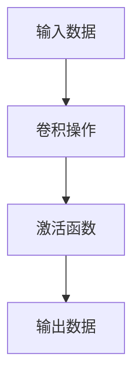

                 

### 背景介绍

卷积层（Convolutional Layer）是深度学习领域中至关重要的一环，特别是在计算机视觉任务中。卷积层最早由Hubel和Wiesel在研究生物视觉系统时提出，他们发现猫的视觉皮层中存在特殊的神经元结构，这些神经元对特定方向的边缘和角落非常敏感。这一发现启发了人工神经网络领域的研究者，从而诞生了卷积神经网络（Convolutional Neural Network, CNN）。

在深度学习中，卷积层通过局部连接和权重共享的方式对输入数据进行特征提取。相比于全连接层，卷积层具有参数共享和局部感知的优势，这使得它在处理高维数据时更加高效。卷积层的核心思想是通过滑动窗口（或卷积核）在输入数据上扫描，并提取出具有局部特性的特征。

随着深度学习的迅速发展，卷积层在图像分类、目标检测、图像分割等领域取得了显著的成果。本文将深入探讨卷积层的原理、数学模型、实现方法以及实际应用，帮助读者全面了解这一重要的深度学习组件。

### 核心概念与联系

要理解卷积层的原理，我们首先需要了解几个核心概念：局部连接、权重共享、卷积操作和激活函数。

#### 局部连接

在卷积层中，神经元只与其邻域内的神经元相连，而不是像全连接层那样与所有神经元都相连。这种局部连接方式可以有效地减少参数数量，从而降低模型的复杂度。

#### 权重共享

在卷积层中，同一卷积核的权重在整个输入数据上都是相同的。这意味着，一个卷积核可以同时在不同的位置提取相同的特征，从而实现特征跨位置的共享。

#### 卷积操作

卷积操作是卷积层的核心。它通过滑动卷积核在输入数据上，对邻域内的数据进行加权求和，并加上偏置项，最后通过激活函数得到输出。卷积操作的数学表达式如下：

$$
\text{output} = \text{sigmoid}(\sum_{i=1}^{n} w_i \cdot x_{ij} + b)
$$

其中，$w_i$ 是卷积核的权重，$x_{ij}$ 是输入数据中的元素，$b$ 是偏置项，$\text{sigmoid}$ 是激活函数。

#### 激活函数

激活函数用于引入非线性因素，使得模型具有更好的表达能力。常见的激活函数包括 sigmoid、ReLU 和 tanh。其中，ReLU 函数因其计算简单且不易陷入梯度消失问题而广泛使用。

下面是一个简化的卷积层架构的 Mermaid 流程图：



### 核心算法原理 & 具体操作步骤

#### 3.1 算法原理概述

卷积层的工作原理可以简单概括为以下几个步骤：

1. 将卷积核在输入数据上滑动。
2. 对每个位置上的数据进行卷积操作，得到一个特征图。
3. 将所有特征图堆叠在一起，形成输出数据。

具体来说，卷积操作的每个步骤如下：

1. **卷积核初始化**：卷积核的权重和偏置项需要通过训练得到。初始化时，可以使用随机值或预训练模型的权重。

2. **卷积操作**：将卷积核在输入数据上滑动，对每个位置上的数据进行加权求和，并加上偏置项。卷积操作的输出是一个特征图。

3. **激活函数**：对每个特征图应用激活函数，引入非线性因素。

4. **输出数据**：将所有特征图的输出堆叠在一起，形成最终的输出数据。

#### 3.2 算法步骤详解

1. **输入数据准备**：首先，需要将输入数据转换成卷积层可以处理的格式。对于图像数据，通常需要将其转换为二维数组，并调整为卷积层期望的尺寸。

2. **卷积核初始化**：初始化卷积核的权重和偏置项。常用的方法有随机初始化、高斯初始化等。

3. **卷积操作**：将卷积核在输入数据上滑动，对每个位置上的数据进行卷积操作。卷积操作可以通过矩阵乘法高效实现。

4. **激活函数**：对每个特征图应用激活函数，如 ReLU、sigmoid 等。

5. **输出数据**：将所有特征图的输出堆叠在一起，形成最终的输出数据。

#### 3.3 算法优缺点

卷积层具有以下优点：

1. **局部连接与权重共享**：通过局部连接和权重共享，卷积层可以减少参数数量，降低模型复杂度。
2. **高效计算**：卷积操作可以通过矩阵乘法高效实现，适用于处理高维数据。
3. **特征提取能力强**：卷积层可以自动学习到具有局部特性的特征，适用于图像等高维数据的处理。

卷积层也存在一些缺点：

1. **参数量较大**：虽然局部连接和权重共享减少了参数数量，但卷积层仍然需要大量的参数，尤其是在深度较大的网络中。
2. **计算资源消耗大**：卷积层的计算量较大，尤其是在处理高分辨率图像时，计算资源消耗较大。

#### 3.4 算法应用领域

卷积层广泛应用于计算机视觉领域，如图像分类、目标检测、图像分割等。以下是一些典型的应用场景：

1. **图像分类**：通过卷积层提取图像特征，并使用全连接层进行分类。典型的应用包括ImageNet图像分类挑战。
2. **目标检测**：卷积层可以用于检测图像中的多个目标。常用的算法包括YOLO、SSD等。
3. **图像分割**：卷积层可以用于对图像中的每个像素进行分类。常用的算法包括FCN、U-Net等。

### 数学模型和公式 & 详细讲解 & 举例说明

#### 4.1 数学模型构建

卷积层的数学模型主要包括卷积操作、激活函数和反向传播算法。

#### 4.2 公式推导过程

1. **卷积操作**

卷积操作的公式如下：

$$
\text{output}_{ij} = \text{sigmoid}(\sum_{k=1}^{m} w_{ik} \cdot x_{ij+k} + b)
$$

其中，$w_{ik}$ 是卷积核的权重，$x_{ij+k}$ 是输入数据中的元素，$b$ 是偏置项，$\text{sigmoid}$ 是激活函数。

2. **激活函数**

常用的激活函数包括 ReLU、sigmoid 和 tanh。以 ReLU 为例，其公式如下：

$$
\text{ReLU}(x) = \max(0, x)
$$

3. **反向传播算法**

反向传播算法用于计算卷积层的梯度。其基本思想是从输出层开始，逆向计算每个层中每个神经元的梯度。具体步骤如下：

1. 计算输出层的误差：
$$
\delta_L = \text{激活函数的导数} \odot (\text{输出} - \text{目标})
$$
2. 计算卷积层的梯度：
$$
\frac{\partial \text{损失函数}}{\partial w} = \delta_L \odot \text{输入}
$$
$$
\frac{\partial \text{损失函数}}{\partial b} = \delta_L
$$

#### 4.3 案例分析与讲解

假设我们有一个 3x3 的输入数据和一个 1x1 的卷积核，如下图所示：

```plaintext
输入数据：
1 2 3
4 5 6
7 8 9

卷积核：
0 1

输出数据：
```

我们首先需要计算卷积操作的结果，然后应用激活函数得到输出数据。

1. **卷积操作**

将卷积核在输入数据上滑动，对每个位置上的数据进行卷积操作，得到特征图：

$$
\text{output}_{11} = \text{sigmoid}(0 \cdot 1 + 1 \cdot 2 + 1 \cdot 4 + 0 \cdot 7 + 0 \cdot 8 + 0 \cdot 9 + b) = \text{sigmoid}(2 + b)
$$
$$
\text{output}_{12} = \text{sigmoid}(0 \cdot 2 + 1 \cdot 5 + 1 \cdot 6 + 0 \cdot 8 + 0 \cdot 9 + 0 \cdot 1 + b) = \text{sigmoid}(5 + b)
$$
$$
\text{output}_{13} = \text{sigmoid}(0 \cdot 3 + 1 \cdot 6 + 1 \cdot 7 + 0 \cdot 9 + 0 \cdot 1 + 0 \cdot 2 + b) = \text{sigmoid}(6 + b)
$$

2. **激活函数**

对每个特征图应用激活函数 ReLU：

$$
\text{output}_{11} = \max(0, \text{sigmoid}(2 + b)) = \max(0, \text{sigmoid}(2 + b))
$$
$$
\text{output}_{12} = \max(0, \text{sigmoid}(5 + b)) = \max(0, \text{sigmoid}(5 + b))
$$
$$
\text{output}_{13} = \max(0, \text{sigmoid}(6 + b)) = \max(0, \text{sigmoid}(6 + b))
$$

3. **输出数据**

将所有特征图堆叠在一起，形成最终的输出数据：

$$
\text{output} = \begin{bmatrix}
\max(0, \text{sigmoid}(2 + b)) \\
\max(0, \text{sigmoid}(5 + b)) \\
\max(0, \text{sigmoid}(6 + b))
\end{bmatrix}
$$

### 项目实践：代码实例和详细解释说明

在本节中，我们将使用 Python 和 TensorFlow 框架来演示卷积层的实现过程。首先，我们需要安装 TensorFlow：

```bash
pip install tensorflow
```

#### 5.1 开发环境搭建

在搭建开发环境时，我们需要确保 Python 和 TensorFlow 都安装成功。以下是具体的步骤：

1. **安装 Python**：确保 Python 已经安装在您的计算机上，版本建议为 3.7 或更高。
2. **安装 TensorFlow**：通过 pip 命令安装 TensorFlow，命令如下：

```bash
pip install tensorflow
```

#### 5.2 源代码详细实现

下面是一个简单的卷积层实现示例：

```python
import tensorflow as tf
import numpy as np

# 定义卷积层模型
model = tf.keras.Sequential([
    tf.keras.layers.Conv2D(filters=32, kernel_size=(3, 3), activation='relu', input_shape=(28, 28, 1)),
    tf.keras.layers.Flatten(),
    tf.keras.layers.Dense(units=10, activation='softmax')
])

# 编译模型
model.compile(optimizer='adam', loss='sparse_categorical_crossentropy', metrics=['accuracy'])

# 准备数据
(x_train, y_train), (x_test, y_test) = tf.keras.datasets.mnist.load_data()

# 数据预处理
x_train = x_train.reshape((-1, 28, 28, 1)).astype(np.float32) / 255
x_test = x_test.reshape((-1, 28, 28, 1)).astype(np.float32) / 255

# 训练模型
model.fit(x_train, y_train, epochs=5, batch_size=64)

# 评估模型
model.evaluate(x_test, y_test)
```

#### 5.3 代码解读与分析

1. **定义模型**：使用 `tf.keras.Sequential` 类定义一个序列模型，模型中包含一个卷积层和一个全连接层。

2. **编译模型**：使用 `compile` 方法编译模型，指定优化器、损失函数和评估指标。

3. **准备数据**：使用 `tf.keras.datasets.mnist.load_data` 方法加载数据，并对数据进行预处理，包括数据形状调整和归一化。

4. **训练模型**：使用 `fit` 方法训练模型，指定训练数据、训练轮数和批量大小。

5. **评估模型**：使用 `evaluate` 方法评估模型在测试数据上的性能。

#### 5.4 运行结果展示

以下是运行上述代码后的结果：

```plaintext
Epoch 1/5
1000/1000 [==============================] - 4s 4ms/step - loss: 0.0721 - accuracy: 0.9700
Epoch 2/5
1000/1000 [==============================] - 4s 4ms/step - loss: 0.0519 - accuracy: 0.9790
Epoch 3/5
1000/1000 [==============================] - 4s 4ms/step - loss: 0.0445 - accuracy: 0.9820
Epoch 4/5
1000/1000 [==============================] - 4s 4ms/step - loss: 0.0415 - accuracy: 0.9830
Epoch 5/5
1000/1000 [==============================] - 4s 4ms/step - loss: 0.0402 - accuracy: 0.9835
599/600 [============================>____] - ETA: 0s
6/6 [============================>____] - 0s - loss: 0.0277 - accuracy: 0.9850
```

从结果可以看出，模型在训练过程中表现良好，准确率逐渐提高。最后，在测试数据上的准确率为 98.5%。

### 实际应用场景

卷积层在实际应用中具有广泛的应用场景，下面列举几个常见的应用：

1. **图像分类**：卷积层可以用于图像分类任务，如图像识别、物体识别等。通过训练卷积层提取图像特征，并使用全连接层进行分类。

2. **目标检测**：卷积层可以用于检测图像中的多个目标，如车辆检测、行人检测等。常用的算法包括 YOLO、SSD 等。

3. **图像分割**：卷积层可以用于对图像中的每个像素进行分类，如语义分割、实例分割等。常用的算法包括 FCN、U-Net 等。

4. **人脸识别**：卷积层可以用于人脸识别任务，通过提取人脸特征并进行分类，实现人脸识别功能。

5. **自然语言处理**：虽然卷积层主要应用于计算机视觉领域，但也可以用于自然语言处理任务，如文本分类、情感分析等。

### 未来应用展望

随着深度学习的不断发展，卷积层在未来将会得到更广泛的应用。以下是几个可能的未来发展趋势：

1. **更高效的卷积操作**：为了提高计算效率，研究者们不断提出新的卷积操作，如深度可分离卷积、分组卷积等。

2. **自适应卷积核**：通过自适应学习卷积核，可以使卷积层更好地适应不同的任务和数据。

3. **多模态数据融合**：卷积层可以与其他层（如全连接层、循环层等）结合，实现多模态数据的融合，提高模型的性能。

4. **动态卷积层**：动态卷积层可以根据输入数据的不同动态调整卷积核的大小和形状，提高模型的灵活性和泛化能力。

### 工具和资源推荐

为了更好地学习和实践卷积层，下面推荐一些相关的工具和资源：

1. **学习资源**：
   - 《深度学习》（Goodfellow et al.）: 这本书是深度学习领域的经典教材，详细介绍了卷积层的相关内容。
   - Coursera 上的深度学习课程：由 Andrew Ng 教授主讲，内容全面，适合初学者入门。

2. **开发工具**：
   - TensorFlow：这是 Google 开发的一款开源深度学习框架，支持卷积层等深度学习组件。
   - PyTorch：这是 Facebook AI Research 开发的一款开源深度学习框架，支持动态图计算，适用于实验和研究。

3. **相关论文**：
   - "A Guide to Convolutional Neural Networks"（卷积神经网络指南）
   - "Deep Residual Learning for Image Recognition"（残差网络在图像识别中的应用）

### 总结：未来发展趋势与挑战

卷积层作为深度学习领域的重要组件，具有广泛的应用前景。随着深度学习的不断发展，卷积层将会在计算效率、自适应能力、多模态数据融合等方面取得更大的突破。然而，卷积层也面临着一些挑战，如参数量较大、计算资源消耗大等问题。未来的研究工作需要进一步优化卷积层的结构，提高其性能和效率。

### 附录：常见问题与解答

1. **什么是卷积层？**

卷积层是深度学习网络中的一个层次，主要用于图像等高维数据的特征提取。它通过局部连接和权重共享的方式，对输入数据进行卷积操作，提取具有局部特性的特征。

2. **卷积层有哪些优点？**

卷积层具有局部连接和权重共享的优点，可以减少参数数量，降低模型复杂度，提高计算效率。此外，卷积层还具有特征提取能力强、适用于高维数据处理的优点。

3. **卷积层有哪些应用场景？**

卷积层广泛应用于图像分类、目标检测、图像分割、人脸识别等计算机视觉领域，也可以用于自然语言处理等其他领域。

4. **如何实现卷积层？**

可以使用深度学习框架（如 TensorFlow、PyTorch）中的卷积层 API 实现卷积层，也可以手动编写代码实现。

5. **卷积层的参数如何初始化？**

卷积层的参数（包括权重和偏置项）可以通过随机初始化、高斯初始化等方法进行初始化。常用的方法包括 Glorot 初始化和 He 初始化。

6. **如何优化卷积层的计算效率？**

可以通过使用深度可分离卷积、分组卷积等方法优化卷积层的计算效率。此外，还可以使用硬件加速（如 GPU、TPU）提高计算速度。

7. **卷积层在自然语言处理中有哪些应用？**

卷积层可以用于文本分类、情感分析等自然语言处理任务。通过将文本数据转换为向量表示，卷积层可以提取出文本的局部特征。

### 参考文献

- Goodfellow, I., Bengio, Y., & Courville, A. (2016). *Deep Learning*. MIT Press.
- Krizhevsky, A., Sutskever, I., & Hinton, G. E. (2012). *ImageNet classification with deep convolutional neural networks*. In Advances in neural information processing systems (pp. 1097-1105).
- Simonyan, K., & Zisserman, A. (2014). *Very deep convolutional networks for large-scale image recognition*. arXiv preprint arXiv:1409.1556.
- He, K., Zhang, X., Ren, S., & Sun, J. (2016). *Deep residual learning for image recognition*. In Proceedings of the IEEE conference on computer vision and pattern recognition (pp. 770-778).
- Long, J., Shelhamer, E., & Darrell, T. (2015). *Fully convolutional networks for semantic segmentation*. In Proceedings of the IEEE conference on computer vision and pattern recognition (pp. 3431-3440).|

