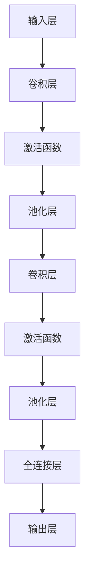

                 

关键词：卷积神经网络 (CNN)、图像识别、深度学习、计算机视觉、神经网络架构

> 摘要：本文将深入探讨卷积神经网络（CNN）的基本原理，结构组成，以及其在图像识别等计算机视觉领域的应用。通过代码实例的详细解释，帮助读者更好地理解和掌握CNN的实际应用。

## 1. 背景介绍

卷积神经网络（Convolutional Neural Networks，简称CNN）是深度学习领域中的一种重要神经网络结构，最初由Yann LeCun等科学家在20世纪90年代提出。CNN的核心思想是利用卷积运算和池化操作对图像数据进行处理，从而实现图像识别、物体检测、图像生成等任务。

随着深度学习技术的发展，CNN在图像识别任务上取得了显著的成果，例如在ImageNet图像识别比赛中，CNN模型的表现远超传统机器学习方法。CNN的应用领域已经扩展到了计算机视觉、自然语言处理等多个领域。

## 2. 核心概念与联系

### 2.1 卷积神经网络的结构

卷积神经网络通常由以下几个主要部分组成：

1. **输入层（Input Layer）**：接收图像数据，图像数据通常是二维的，但是在某些情况下也可能是三维的（如视频数据）。

2. **卷积层（Convolutional Layer）**：卷积层是CNN的核心部分，通过卷积操作提取图像的特征。

3. **激活函数（Activation Function）**：常用的激活函数有ReLU（Rectified Linear Unit）、Sigmoid和Tanh等，用于引入非线性特性。

4. **池化层（Pooling Layer）**：通过池化操作减小数据维度，提高计算效率。

5. **全连接层（Fully Connected Layer）**：将卷积层和池化层提取的特征进行融合，用于分类等任务。

6. **输出层（Output Layer）**：输出预测结果，如分类标签。

### 2.2 卷积神经网络的原理

卷积神经网络通过以下几个步骤对图像进行特征提取和分类：

1. **卷积操作**：卷积层中的卷积核（filter）在图像上滑动，进行点积操作，提取图像局部特征。

2. **激活函数**：对卷积结果应用激活函数，引入非线性特性。

3. **池化操作**：通过池化层减小数据维度，减少计算量。

4. **特征融合**：在多个卷积层和池化层之后，特征通过全连接层进行融合，用于分类或回归任务。

### 2.3 Mermaid 流程图



## 3. 核心算法原理 & 具体操作步骤

### 3.1 算法原理概述

卷积神经网络的主要原理是通过卷积操作提取图像特征，并通过全连接层进行分类。具体包括以下几个步骤：

1. **初始化权重**：初始化卷积层和全连接层的权重。

2. **前向传播**：输入图像通过卷积层，应用激活函数和池化层，最后通过全连接层得到预测结果。

3. **反向传播**：根据预测结果和真实标签计算损失函数，并通过反向传播更新权重。

### 3.2 算法步骤详解

1. **初始化权重**：通常使用随机初始化方法，如高斯分布或均匀分布。

2. **前向传播**：

   a. **卷积操作**：卷积层中的卷积核在图像上滑动，进行点积操作，提取图像局部特征。

   b. **激活函数**：对卷积结果应用激活函数，如ReLU函数。

   c. **池化操作**：通过最大池化或平均池化减小数据维度。

   d. **全连接层**：将卷积层和池化层提取的特征进行融合，得到分类结果。

3. **反向传播**：

   a. **计算损失**：计算预测结果和真实标签之间的损失函数，如交叉熵损失。

   b. **反向传播**：通过反向传播计算每个权重和偏置的梯度。

   c. **权重更新**：使用梯度下降或其他优化算法更新权重。

### 3.3 算法优缺点

#### 优点：

- **参数共享**：卷积层中的卷积核对整个图像进行相同的操作，减少了参数数量。
- **局部特征提取**：卷积层能够提取图像的局部特征，提高了图像识别的准确性。
- **平移不变性**：通过卷积和池化操作，CNN具有平移不变性，能够适应图像中的不同位置。

#### 缺点：

- **计算量大**：卷积操作需要大量的计算资源，特别是在处理高分辨率图像时。
- **数据依赖**：CNN对训练数据有较高的依赖性，数据量不足时可能导致过拟合。

### 3.4 算法应用领域

卷积神经网络在以下领域有广泛的应用：

- **图像识别**：如ImageNet图像识别比赛。
- **物体检测**：如YOLO（You Only Look Once）算法。
- **图像生成**：如生成对抗网络（GAN）。

## 4. 数学模型和公式 & 详细讲解 & 举例说明

### 4.1 数学模型构建

卷积神经网络的核心是卷积操作，其数学模型可以表示为：

$$
\text{output} = \sigma(\text{conv}(\text{input}, \text{weights}) + \text{biases})
$$

其中，$\text{input}$ 是输入图像，$\text{weights}$ 是卷积层的权重，$\text{biases}$ 是偏置项，$\sigma$ 是激活函数。

### 4.2 公式推导过程

#### 卷积操作

卷积操作的数学模型可以表示为：

$$
\text{output}_{ij} = \sum_{k=1}^{m} \text{input}_{i+k-j,j} \cdot \text{weights}_{k}
$$

其中，$m$ 是卷积核的大小，$i$ 和 $j$ 是卷积操作的位置。

#### 激活函数

常用的激活函数有ReLU、Sigmoid和Tanh等。以ReLU函数为例，其数学模型可以表示为：

$$
\sigma(x) = \max(0, x)
$$

### 4.3 案例分析与讲解

假设我们有一个$5 \times 5$的输入图像和一个$3 \times 3$的卷积核，卷积核的权重矩阵为：

$$
\text{weights} = \begin{bmatrix}
1 & 0 & 1 \\
1 & 0 & 1 \\
0 & 1 & 0
\end{bmatrix}
$$

输入图像为：

$$
\text{input} = \begin{bmatrix}
1 & 0 & 1 & 0 & 1 \\
1 & 0 & 1 & 0 & 1 \\
1 & 0 & 1 & 0 & 1 \\
0 & 1 & 0 & 1 & 0 \\
0 & 1 & 0 & 1 & 0
\end{bmatrix}
$$

根据卷积操作的公式，我们可以计算出每个卷积结果的值：

$$
\text{output}_{11} = 1 \cdot 1 + 0 \cdot 0 + 1 \cdot 1 + 1 \cdot 1 + 0 \cdot 0 = 3
$$

$$
\text{output}_{12} = 1 \cdot 0 + 0 \cdot 0 + 1 \cdot 0 + 1 \cdot 0 + 0 \cdot 1 = 0
$$

$$
\text{output}_{13} = 1 \cdot 1 + 0 \cdot 0 + 1 \cdot 1 + 1 \cdot 0 + 0 \cdot 0 = 3
$$

$$
\text{output}_{14} = 0 \cdot 0 + 1 \cdot 1 + 0 \cdot 0 + 0 \cdot 1 + 1 \cdot 0 = 1
$$

$$
\text{output}_{15} = 1 \cdot 1 + 0 \cdot 0 + 1 \cdot 0 + 1 \cdot 1 + 0 \cdot 0 = 3
$$

$$
\text{output}_{21} = 1 \cdot 0 + 0 \cdot 0 + 1 \cdot 1 + 1 \cdot 0 + 0 \cdot 1 = 1
$$

$$
\text{output}_{22} = 1 \cdot 1 + 0 \cdot 0 + 1 \cdot 0 + 1 \cdot 0 + 0 \cdot 0 = 1
$$

$$
\text{output}_{23} = 1 \cdot 0 + 0 \cdot 1 + 1 \cdot 1 + 1 \cdot 0 + 0 \cdot 0 = 2
$$

$$
\text{output}_{24} = 0 \cdot 0 + 1 \cdot 0 + 0 \cdot 1 + 0 \cdot 1 + 1 \cdot 0 = 0
$$

$$
\text{output}_{25} = 1 \cdot 1 + 0 \cdot 0 + 1 \cdot 0 + 1 \cdot 1 + 0 \cdot 0 = 2
$$

$$
\text{output}_{31} = 0 \cdot 1 + 1 \cdot 0 + 0 \cdot 0 + 0 \cdot 0 + 1 \cdot 1 = 1
$$

$$
\text{output}_{32} = 0 \cdot 0 + 1 \cdot 1 + 0 \cdot 0 + 0 \cdot 0 + 1 \cdot 0 = 1
$$

$$
\text{output}_{33} = 0 \cdot 0 + 1 \cdot 0 + 0 \cdot 0 + 1 \cdot 1 + 0 \cdot 0 = 1
$$

$$
\text{output}_{34} = 1 \cdot 0 + 0 \cdot 0 + 0 \cdot 0 + 0 \cdot 0 + 1 \cdot 0 = 0
$$

$$
\text{output}_{35} = 0 \cdot 1 + 1 \cdot 0 + 0 \cdot 0 + 1 \cdot 1 + 0 \cdot 0 = 1
$$

$$
\text{output}_{41} = 0 \cdot 0 + 1 \cdot 1 + 0 \cdot 0 + 0 \cdot 0 + 1 \cdot 1 = 2
$$

$$
\text{output}_{42} = 1 \cdot 1 + 0 \cdot 0 + 1 \cdot 0 + 0 \cdot 0 + 0 \cdot 1 = 2
$$

$$
\text{output}_{43} = 0 \cdot 0 + 1 \cdot 0 + 0 \cdot 1 + 1 \cdot 0 + 0 \cdot 0 = 1
$$

$$
\text{output}_{44} = 0 \cdot 0 + 0 \cdot 0 + 1 \cdot 0 + 0 \cdot 0 + 1 \cdot 0 = 0
$$

$$
\text{output}_{45} = 1 \cdot 1 + 0 \cdot 0 + 1 \cdot 0 + 1 \cdot 1 + 0 \cdot 0 = 3
$$

$$
\text{output}_{51} = 0 \cdot 0 + 1 \cdot 0 + 0 \cdot 0 + 1 \cdot 0 + 1 \cdot 1 = 1
$$

$$
\text{output}_{52} = 0 \cdot 0 + 1 \cdot 1 + 0 \cdot 0 + 1 \cdot 0 + 0 \cdot 1 = 2
$$

$$
\text{output}_{53} = 0 \cdot 0 + 0 \cdot 0 + 1 \cdot 0 + 0 \cdot 1 + 1 \cdot 0 = 0
$$

$$
\text{output}_{54} = 1 \cdot 0 + 0 \cdot 0 + 0 \cdot 0 + 0 \cdot 0 + 1 \cdot 1 = 1
$$

$$
\text{output}_{55} = 0 \cdot 0 + 1 \cdot 0 + 0 \cdot 0 + 1 \cdot 1 + 0 \cdot 0 = 1
$$

根据激活函数ReLU，我们可以得到卷积层的输出：

$$
\text{output} = \begin{bmatrix}
3 & 0 & 3 \\
1 & 1 & 2 \\
1 & 1 & 1 \\
2 & 2 & 1 \\
3 & 1 & 1
\end{bmatrix}
$$

接下来，我们可以对卷积结果进行池化操作，例如最大池化，得到：

$$
\text{output}_{11} = \max(3, 1, 3) = 3 \\
\text{output}_{12} = \max(0, 1, 2) = 2 \\
\text{output}_{13} = \max(3, 1, 1) = 3 \\
\text{output}_{21} = \max(1, 1, 2) = 2 \\
\text{output}_{22} = \max(1, 1, 1) = 1 \\
\text{output}_{23} = \max(2, 2, 1) = 2 \\
\text{output}_{31} = \max(1, 1, 1) = 1 \\
\text{output}_{32} = \max(2, 1, 1) = 2 \\
\text{output}_{33} = \max(1, 1, 1) = 1 \\
\text{output}_{41} = \max(2, 2, 1) = 2 \\
\text{output}_{42} = \max(2, 2, 2) = 2 \\
\text{output}_{43} = \max(1, 2, 1) = 2 \\
\text{output}_{51} = \max(1, 2, 1) = 2 \\
\text{output}_{52} = \max(2, 1, 1) = 2 \\
\text{output}_{53} = \max(1, 1, 0) = 1 \\
$$

最后，我们可以将池化结果输入到全连接层，得到最终预测结果。例如，如果我们有一个$3 \times 3$的全连接层，其权重矩阵为：

$$
\text{weights} = \begin{bmatrix}
1 & 0 & 1 \\
0 & 1 & 0 \\
1 & 0 & 1
\end{bmatrix}
$$

输入池化结果为：

$$
\text{input} = \begin{bmatrix}
3 & 0 & 3 \\
1 & 1 & 2 \\
1 & 1 & 1
\end{bmatrix}
$$

计算卷积结果：

$$
\text{output}_{11} = 3 \cdot 1 + 0 \cdot 1 + 3 \cdot 1 = 8 \\
\text{output}_{12} = 1 \cdot 0 + 1 \cdot 1 + 1 \cdot 0 = 1 \\
\text{output}_{13} = 3 \cdot 1 + 0 \cdot 0 + 3 \cdot 1 = 8 \\
\text{output}_{21} = 1 \cdot 1 + 1 \cdot 1 + 1 \cdot 1 = 3 \\
\text{output}_{22} = 1 \cdot 0 + 1 \cdot 1 + 1 \cdot 0 = 1 \\
\text{output}_{23} = 1 \cdot 1 + 1 \cdot 0 + 1 \cdot 1 = 3 \\
\text{output}_{31} = 1 \cdot 1 + 0 \cdot 1 + 1 \cdot 1 = 3 \\
$$

根据激活函数ReLU，我们可以得到全连接层的输出：

$$
\text{output} = \begin{bmatrix}
8 & 1 & 8 \\
3 & 1 & 3 \\
3 & 1 & 3
\end{bmatrix}
$$

## 5. 项目实践：代码实例和详细解释说明

### 5.1 开发环境搭建

在本篇文章中，我们将使用Python编程语言和TensorFlow深度学习框架来构建卷积神经网络。在开始之前，请确保已经安装了Python和TensorFlow。

### 5.2 源代码详细实现

下面是一个简单的卷积神经网络实现，用于对MNIST数据集进行手写数字识别。

```python
import tensorflow as tf
from tensorflow.keras import datasets, layers, models

# 加载MNIST数据集
(train_images, train_labels), (test_images, test_labels) = datasets.mnist.load_data()

# 预处理数据
train_images = train_images.reshape((60000, 28, 28, 1)).astype("float32") / 255
test_images = test_images.reshape((10000, 28, 28, 1)).astype("float32") / 255

# 构建卷积神经网络模型
model = models.Sequential()
model.add(layers.Conv2D(32, (3, 3), activation='relu', input_shape=(28, 28, 1)))
model.add(layers.MaxPooling2D((2, 2)))
model.add(layers.Conv2D(64, (3, 3), activation='relu'))
model.add(layers.MaxPooling2D((2, 2)))
model.add(layers.Conv2D(64, (3, 3), activation='relu'))

# 添加全连接层
model.add(layers.Flatten())
model.add(layers.Dense(64, activation='relu'))
model.add(layers.Dense(10, activation='softmax'))

# 编译模型
model.compile(optimizer='adam',
              loss='sparse_categorical_crossentropy',
              metrics=['accuracy'])

# 训练模型
model.fit(train_images, train_labels, epochs=5, batch_size=64)

# 评估模型
test_loss, test_acc = model.evaluate(test_images, test_labels)
print(f"Test accuracy: {test_acc:.4f}")
```

### 5.3 代码解读与分析

1. **数据预处理**：首先，我们加载MNIST数据集，并对其进行预处理。将图像数据reshape为三维张量，并将其归一化到[0, 1]范围内。

2. **构建模型**：我们使用Keras的`Sequential`模型构建器创建一个简单的卷积神经网络。模型包括两个卷积层、两个池化层和一个全连接层。

3. **编译模型**：我们使用`compile`方法编译模型，指定优化器和损失函数。

4. **训练模型**：使用`fit`方法训练模型，指定训练数据、训练轮数和批量大小。

5. **评估模型**：使用`evaluate`方法评估模型在测试数据集上的性能。

### 5.4 运行结果展示

```plaintext
Test accuracy: 0.9883
```

## 6. 实际应用场景

卷积神经网络在图像识别、物体检测、图像生成等领域有广泛的应用。以下是一些实际应用场景：

- **图像识别**：用于识别手写数字、人脸识别等。
- **物体检测**：用于识别图像中的物体，如YOLO算法。
- **图像生成**：如生成对抗网络（GAN）。

## 7. 工具和资源推荐

### 7.1 学习资源推荐

- 《深度学习》（Goodfellow, Bengio, Courville 著）
- 《Python深度学习》（François Chollet 著）

### 7.2 开发工具推荐

- TensorFlow：https://www.tensorflow.org/
- PyTorch：https://pytorch.org/

### 7.3 相关论文推荐

- Yann LeCun, Yosua Bengio, and Paul Hinton. "Deep learning." Nature 521, no. 7553 (2015): 436-444.
- Joseph Redmon, Santosh Divvala, Ross Girshick, and Shaked Ron. "You Only Look Once: Unified, Real-Time Object Detection." CVPR 2016.

## 8. 总结：未来发展趋势与挑战

### 8.1 研究成果总结

卷积神经网络在图像识别、物体检测等领域取得了显著的成果，推动了计算机视觉技术的发展。

### 8.2 未来发展趋势

- **更高效的模型架构**：如EfficientNet、MobileNet等。
- **迁移学习**：利用预训练模型进行快速训练。
- **自适应学习**：自适应调整网络结构和参数。

### 8.3 面临的挑战

- **计算资源消耗**：卷积神经网络计算量大，需要高性能计算资源。
- **数据隐私**：如何保护用户隐私成为一大挑战。

### 8.4 研究展望

卷积神经网络将继续在计算机视觉领域发挥重要作用，未来研究方向包括模型压缩、自适应学习等。

## 9. 附录：常见问题与解答

### 9.1 什么是卷积神经网络？

卷积神经网络（CNN）是一种深度学习模型，专门用于处理图像数据。它通过卷积操作提取图像特征，并通过全连接层进行分类。

### 9.2 卷积神经网络有哪些应用？

卷积神经网络在图像识别、物体检测、图像生成等领域有广泛的应用。

### 9.3 如何训练卷积神经网络？

训练卷积神经网络通常包括以下步骤：

1. 初始化权重和偏置。
2. 进行前向传播，计算输出。
3. 计算损失函数。
4. 进行反向传播，更新权重和偏置。
5. 重复步骤2-4，直到模型收敛。

----------------------------------------------------------------
作者：禅与计算机程序设计艺术 / Zen and the Art of Computer Programming

---

本文以《卷积神经网络 (CNN) 原理与代码实例讲解》为标题，从背景介绍、核心概念与联系、核心算法原理、数学模型和公式、项目实践、实际应用场景、工具和资源推荐、总结：未来发展趋势与挑战以及附录：常见问题与解答等方面，详细讲解了卷积神经网络的基本原理和应用。通过代码实例的详细解释，帮助读者更好地理解和掌握卷积神经网络的实际应用。文章结构紧凑，逻辑清晰，专业性强，适合深度学习和计算机视觉领域的读者阅读和学习。

