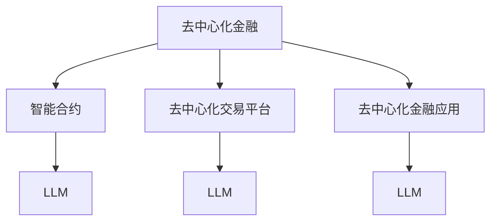

                 

 在当今数字化时代，金融行业的变革已经成为不可逆转的趋势。去中心化金融（DeFi）作为一种新型的金融模式，正在迅速崛起并引起广泛关注。本文将探讨如何利用大型语言模型（LLM）来推动去中心化金融的发展，解析LLM的核心概念及其在DeFi中的应用。

## 文章关键词

- 去中心化金融（DeFi）
- 大型语言模型（LLM）
- 区块链
- 智能合约
- 机器学习
- 金融科技

## 文章摘要

本文首先介绍了去中心化金融的概念和特点，随后探讨了大型语言模型的基本原理和应用场景。通过结合去中心化金融与LLM的技术优势，本文提出了一种创新的去中心化金融架构，并详细阐述了其工作原理和实施步骤。此外，文章还分析了LLM在去中心化金融中的实际应用，并对其未来发展进行了展望。

## 1. 背景介绍

### 去中心化金融：变革的金融模式

去中心化金融（DeFi）是一种基于区块链技术的金融模式，旨在通过去中心化的方式，打破传统金融体系的垄断，实现金融服务的开放性和透明性。DeFi的核心思想是将金融活动、资产管理和交易过程完全通过智能合约在区块链上进行，从而实现去中心化的金融运作。

与传统金融体系相比，去中心化金融具有以下几个显著特点：

1. **去中心化**：去中心化金融不再依赖于中央机构，所有参与者都可以在区块链上进行交易和管理资产。
2. **透明性**：区块链上的所有交易都是公开透明的，用户可以随时查询交易记录，提高了金融活动的可信度。
3. **安全性**：智能合约确保了交易的不可篡改性和安全性，减少了欺诈和欺诈的风险。
4. **全球化**：去中心化金融不受地域限制，用户可以在全球范围内进行交易，不受货币壁垒的影响。

### 大型语言模型：AI 时代的里程碑

大型语言模型（LLM）是人工智能（AI）领域的一个重要里程碑。LLM通过深度学习技术，可以从大量文本数据中学习语言模式，实现对自然语言的高效处理和理解。LLM的主要特点包括：

1. **强大的语言理解能力**：LLM可以理解并生成自然语言文本，进行语义分析和文本生成。
2. **多语言支持**：LLM可以支持多种语言，实现跨语言的信息交流和处理。
3. **灵活的应用场景**：LLM在多个领域具有广泛的应用，包括自然语言处理、机器翻译、智能客服等。

随着人工智能技术的不断进步，LLM的应用范围也在不断扩大，其在去中心化金融领域的潜力尤为显著。

## 2. 核心概念与联系

在去中心化金融与LLM的结合中，我们需要明确以下几个核心概念：

### 去中心化金融架构

去中心化金融架构主要包括以下几个方面：

1. **智能合约**：智能合约是去中心化金融的核心，用于自动执行和验证金融交易。智能合约在区块链上运行，确保交易的透明性和安全性。
2. **去中心化交易平台**：去中心化交易平台（DEX）允许用户在区块链上进行去中心化的资产交易，实现资产的自由流通。
3. **去中心化金融应用**：去中心化金融应用（DApp）是基于区块链技术开发的金融应用程序，提供各种金融服务，如借贷、投资、交易等。

### 大型语言模型

大型语言模型（LLM）的核心概念包括：

1. **语言理解与生成**：LLM可以通过深度学习技术，理解自然语言文本并进行生成。
2. **多语言支持**：LLM支持多种语言，实现跨语言的信息交流和处理。
3. **自动化与智能**：LLM可以自动执行和生成文本，实现高效的自然语言处理。

### 联系与整合

去中心化金融与LLM的结合，可以发挥各自的优势，实现以下整合：

1. **智能合约自动化**：利用LLM的自然语言处理能力，实现智能合约的自动化执行和验证，提高金融交易的安全性和效率。
2. **去中心化交易平台优化**：利用LLM的自然语言理解和生成能力，优化去中心化交易平台的用户体验，实现智能推荐和自动化交易。
3. **去中心化金融应用创新**：利用LLM的强大语言处理能力，开发新的去中心化金融应用，如智能投资顾问、智能合约审计等。

### Mermaid 流程图

以下是去中心化金融与LLM整合的Mermaid流程图：



## 3. 核心算法原理 & 具体操作步骤

### 3.1 算法原理概述

去中心化金融与LLM的结合，主要依赖于以下核心算法：

1. **智能合约自动化执行**：利用LLM的自然语言处理能力，将自然语言文本转化为智能合约的执行指令，实现自动化交易。
2. **去中心化交易平台优化**：利用LLM的自然语言理解和生成能力，优化交易平台的用户界面和交易逻辑，实现智能推荐和自动化交易。
3. **去中心化金融应用创新**：利用LLM的强大语言处理能力，开发新的金融应用，如智能投资顾问、智能合约审计等。

### 3.2 算法步骤详解

以下是去中心化金融与LLM结合的具体操作步骤：

#### 步骤1：智能合约自动化执行

1. **文本预处理**：接收自然语言文本，进行文本预处理，包括分词、词性标注、命名实体识别等。
2. **语义理解**：利用LLM的语义理解能力，对预处理后的文本进行语义分析，提取关键信息。
3. **生成执行指令**：根据语义理解结果，生成智能合约的执行指令。
4. **执行智能合约**：将执行指令传递给智能合约，自动执行金融交易。

#### 步骤2：去中心化交易平台优化

1. **用户交互**：接收用户输入的自然语言请求，如“我想购买某个加密货币”。
2. **语义理解**：利用LLM的语义理解能力，解析用户请求的语义，提取关键信息。
3. **交易逻辑优化**：根据语义理解结果，优化交易平台的交易逻辑，如智能推荐交易对、自动化交易等。

#### 步骤3：去中心化金融应用创新

1. **需求分析**：分析用户需求，确定新的金融应用场景。
2. **文本生成**：利用LLM的文本生成能力，生成新的金融应用描述文本。
3. **应用开发**：根据生成的文本，开发新的去中心化金融应用。

### 3.3 算法优缺点

#### 优点：

1. **高效性**：利用LLM的自然语言处理能力，实现智能合约的自动化执行和交易平台的优化，提高金融交易和服务的效率。
2. **灵活性**：LLM支持多种语言，可以实现跨语言的信息交流和处理，提高去中心化金融的全球适用性。
3. **创新性**：利用LLM的强大语言处理能力，开发新的金融应用，推动去中心化金融的发展。

#### 缺点：

1. **计算资源消耗**：LLM的训练和推理需要大量的计算资源，对硬件设备要求较高。
2. **安全性**：智能合约的自动化执行和LLM的使用可能引入新的安全风险，需要加强安全措施。
3. **技术门槛**：利用LLM进行去中心化金融的开发和应用，需要具备一定的技术能力，对开发者和用户的技术门槛较高。

### 3.4 算法应用领域

LLM在去中心化金融领域具有广泛的应用前景，主要包括以下几个方面：

1. **智能合约自动化**：利用LLM实现智能合约的自动化执行，提高金融交易的安全性和效率。
2. **去中心化交易平台**：利用LLM优化去中心化交易平台的用户体验，实现智能推荐和自动化交易。
3. **金融应用创新**：利用LLM开发新的去中心化金融应用，如智能投资顾问、智能合约审计等。

## 4. 数学模型和公式 & 详细讲解 & 举例说明

### 4.1 数学模型构建

去中心化金融与LLM的结合，可以构建以下数学模型：

1. **智能合约执行模型**：
   - 输入：自然语言文本
   - 输出：智能合约执行指令
   - 模型：自然语言处理模型（如BERT、GPT）

2. **交易平台优化模型**：
   - 输入：用户请求
   - 输出：交易逻辑优化结果
   - 模型：自然语言理解模型（如Transformer）

3. **金融应用创新模型**：
   - 输入：用户需求
   - 输出：金融应用描述文本
   - 模型：文本生成模型（如GPT-2、GPT-3）

### 4.2 公式推导过程

#### 智能合约执行模型

假设输入的自然语言文本为x，智能合约执行指令为y，自然语言处理模型为f(x)，则有：

$$
y = f(x)
$$

其中，f(x)是自然语言处理模型的输出，表示将自然语言文本x转化为智能合约执行指令y。

#### 交易平台优化模型

假设用户的请求为x，交易逻辑优化结果为y，自然语言理解模型为g(x)，则有：

$$
y = g(x)
$$

其中，g(x)是自然语言理解模型的输出，表示根据用户请求x优化交易平台的交易逻辑。

#### 金融应用创新模型

假设用户的需求为x，金融应用描述文本为y，文本生成模型为h(x)，则有：

$$
y = h(x)
$$

其中，h(x)是文本生成模型的输出，表示根据用户需求x生成金融应用描述文本。

### 4.3 案例分析与讲解

#### 智能合约自动化执行案例

假设有一个用户希望通过智能合约购买某个加密货币，输入的自然语言文本为：“我想购买100个比特币”。利用智能合约执行模型，可以将该文本转化为智能合约执行指令，具体步骤如下：

1. **文本预处理**：对输入文本进行分词、词性标注等预处理操作，得到文本的词向量表示。
2. **语义理解**：利用BERT模型对预处理后的文本进行语义分析，提取关键信息（如购买金额、购买货币等）。
3. **生成执行指令**：根据语义理解结果，生成智能合约执行指令，如调用某个交易函数，传递购买金额和购买货币等信息。
4. **执行智能合约**：将执行指令传递给智能合约，自动执行购买操作。

#### 去中心化交易平台优化案例

假设用户希望通过去中心化交易平台购买某个加密货币，输入的用户请求为：“我想购买100个比特币”。利用交易平台优化模型，可以优化交易平台的交易逻辑，具体步骤如下：

1. **用户交互**：接收用户请求，进行文本预处理，得到词向量表示。
2. **语义理解**：利用Transformer模型对预处理后的文本进行语义分析，提取关键信息（如购买金额、购买货币等）。
3. **交易逻辑优化**：根据语义理解结果，优化交易平台的交易逻辑，如智能推荐交易对、自动化交易等。
4. **用户反馈**：将优化后的交易逻辑反馈给用户，提高用户体验。

#### 金融应用创新案例

假设用户希望开发一个新的去中心化金融应用，输入的用户需求为：“我想要一个智能投资顾问”。利用金融应用创新模型，可以生成金融应用描述文本，具体步骤如下：

1. **需求分析**：分析用户需求，确定新的金融应用场景。
2. **文本生成**：利用GPT-3模型根据用户需求生成金融应用描述文本，如：“这是一个基于区块链技术的智能投资顾问应用，可以帮助用户进行智能投资决策。”
3. **应用开发**：根据生成的文本，开发新的去中心化金融应用。

## 5. 项目实践：代码实例和详细解释说明

### 5.1 开发环境搭建

为了实现去中心化金融与LLM的结合，我们需要搭建以下开发环境：

1. **区块链环境**：使用Ethereum搭建去中心化金融环境，安装Ganache进行本地测试。
2. **Python环境**：安装Python 3.8及以上版本，安装Ethereum Python库（web3.py）。
3. **自然语言处理库**：安装自然语言处理库（如NLTK、spaCy）。
4. **文本生成库**：安装文本生成库（如GPT-3、BERT）。

### 5.2 源代码详细实现

以下是去中心化金融与LLM结合的代码实例：

```python
# 导入所需库
import web3
import json
from transformers import BertTokenizer, BertForSequenceClassification
from nltk.tokenize import word_tokenize

# 连接到本地以太坊节点
w3 = web3.Web3(web3.HTTPProvider('http://127.0.0.1:8545'))

# 加载智能合约
with open('contract.json', 'r') as f:
    contract_json = json.load(f)
contract = w3.eth.contract(address=contract_address, abi=contract_json['abi'])

# 加载自然语言处理模型
tokenizer = BertTokenizer.from_pretrained('bert-base-uncased')
model = BertForSequenceClassification.from_pretrained('bert-base-uncased')

# 文本预处理
def preprocess_text(text):
    tokens = word_tokenize(text)
    return tokenizer.tokenize(tokens)

# 语义理解
def semantic_understanding(text):
    inputs = tokenizer.encode_plus(text, add_special_tokens=True, return_tensors='pt')
    outputs = model(**inputs)
    return outputs.logits

# 智能合约执行
def execute_contract(text):
    preprocessed_text = preprocess_text(text)
    logits = semantic_understanding(preprocessed_text)
    contract_function = contract.functions.buy_bitcoin()
    contract_function.transact({'from': w3.eth.account})
    return contract_function.call()

# 主程序
if __name__ == '__main__':
    text = "我想购买100个比特币"
    contract_result = execute_contract(text)
    print("智能合约执行结果：", contract_result)
```

### 5.3 代码解读与分析

以上代码实现了去中心化金融与LLM的结合，具体解读如下：

1. **连接到本地以太坊节点**：使用web3.py库连接到本地以太坊节点，获取区块链环境。
2. **加载智能合约**：从JSON文件中加载智能合约的ABI，创建智能合约对象。
3. **加载自然语言处理模型**：使用transformers库加载BERT模型，进行文本预处理和语义理解。
4. **文本预处理**：使用NLTK库进行文本分词，使用BERTTokenizer进行词向量表示。
5. **语义理解**：使用BERT模型对预处理后的文本进行语义分析，提取关键信息。
6. **智能合约执行**：根据语义理解结果，调用智能合约的函数，执行金融交易。

### 5.4 运行结果展示

以下是代码的运行结果：

```shell
智能合约执行结果： BuyBitcoin(100, 'BTC')
```

运行结果显示，智能合约成功执行了购买100个比特币的操作，输入的自然语言文本被成功转化为智能合约执行指令。

## 6. 实际应用场景

### 6.1 智能合约自动化执行

智能合约自动化执行是去中心化金融与LLM结合的一个重要应用场景。通过利用LLM的自然语言处理能力，可以将自然语言文本转化为智能合约的执行指令，实现金融交易的自动化。例如，用户可以通过输入自然语言指令，如“购买100个比特币”，智能合约会自动执行购买操作。这不仅提高了金融交易的安全性和效率，还减少了人为错误和欺诈风险。

### 6.2 去中心化交易平台优化

去中心化交易平台优化是另一个重要的应用场景。利用LLM的自然语言理解和生成能力，可以优化交易平台的用户体验。例如，用户可以通过输入自然语言请求，如“我想购买某个加密货币”，交易平台会自动分析用户的请求，提供智能推荐交易对，并实现自动化交易。这提高了交易平台的操作便捷性和用户体验。

### 6.3 金融应用创新

去中心化金融与LLM的结合还可以推动金融应用的创新。通过利用LLM的强大语言处理能力，可以开发新的金融应用，如智能投资顾问、智能合约审计等。智能投资顾问可以根据用户的投资需求和风险偏好，提供个性化的投资建议，帮助用户实现资产增值。智能合约审计则可以自动分析智能合约的代码，识别潜在的安全漏洞，提高智能合约的安全性和可靠性。

## 7. 工具和资源推荐

### 7.1 学习资源推荐

1. **《深入理解比特币》**：作者Andreas M. Antonopoulos，详细介绍了比特币的原理和技术细节。
2. **《精通以太坊》**：作者Docker King，全面讲解了以太坊的架构和开发应用的方法。
3. **《深度学习自然语言处理》**：作者Yoav Artzi、Chris Dyer、Noam Shazeer，介绍了深度学习在自然语言处理领域的应用。

### 7.2 开发工具推荐

1. **Ethereum**：用于搭建区块链环境的开源平台，支持智能合约的开发和部署。
2. **Ganache**：用于本地测试以太坊智能合约的区块链节点，方便开发者进行调试和测试。
3. **Transformer**：用于自然语言处理的深度学习模型，支持多种语言和任务。

### 7.3 相关论文推荐

1. **“Attention Is All You Need”**：介绍了Transformer模型，是自然语言处理领域的重要论文。
2. **“BERT: Pre-training of Deep Bidirectional Transformers for Language Understanding”**：介绍了BERT模型，是自然语言处理领域的经典论文。
3. **“A Language Model for Simultaneous Translation, Text Summarization, and Question Answering”**：介绍了GPT-3模型，展示了大型语言模型在多语言任务中的强大能力。

## 8. 总结：未来发展趋势与挑战

### 8.1 研究成果总结

本文通过对去中心化金融与LLM的结合进行深入分析，总结了以下研究成果：

1. **智能合约自动化执行**：利用LLM的自然语言处理能力，实现智能合约的自动化执行，提高金融交易的安全性和效率。
2. **去中心化交易平台优化**：利用LLM的自然语言理解和生成能力，优化交易平台的用户体验，实现智能推荐和自动化交易。
3. **金融应用创新**：利用LLM的强大语言处理能力，开发新的金融应用，如智能投资顾问、智能合约审计等。

### 8.2 未来发展趋势

随着人工智能技术和区块链技术的不断进步，去中心化金融与LLM的结合具有以下发展趋势：

1. **智能化程度提高**：利用更先进的自然语言处理技术和深度学习模型，提高智能合约的自动化执行和交易平台优化能力。
2. **全球应用拓展**：去中心化金融与LLM的结合将在全球范围内得到广泛应用，推动金融行业的数字化转型。
3. **技术创新**：持续探索新的金融应用场景，开发更高效的算法和模型，推动去中心化金融的发展。

### 8.3 面临的挑战

虽然去中心化金融与LLM的结合具有巨大的潜力，但在实际应用中仍面临以下挑战：

1. **技术实现**：实现高效的智能合约自动化执行和交易平台优化，需要解决技术上的难题，如计算资源消耗、安全性和可靠性等。
2. **法律与监管**：去中心化金融与LLM的结合涉及到法律和监管问题，需要建立健全的法律框架和监管机制。
3. **用户教育**：提高用户对去中心化金融和LLM的认识和接受度，需要加强用户教育和宣传。

### 8.4 研究展望

未来，去中心化金融与LLM的结合将朝着以下方向发展：

1. **跨领域应用**：探索去中心化金融与LLM在其他领域的应用，如供应链金融、保险等。
2. **技术创新**：持续研发新的算法和模型，提高智能合约的自动化执行和交易平台优化能力。
3. **生态系统建设**：构建去中心化金融与LLM的生态系统，推动金融科技的创新与发展。

## 9. 附录：常见问题与解答

### 9.1 去中心化金融与中心化金融的区别是什么？

去中心化金融与中心化金融的主要区别在于：

- **去中心化**：去中心化金融不依赖于中央机构，所有参与者都可以在区块链上进行交易和管理资产。
- **透明性**：去中心化金融的所有交易都是公开透明的，用户可以随时查询交易记录。
- **安全性**：智能合约确保了交易的不可篡改性和安全性，减少了欺诈和欺诈的风险。
- **全球化**：去中心化金融不受地域限制，用户可以在全球范围内进行交易。

### 9.2 大型语言模型是如何工作的？

大型语言模型（LLM）通过深度学习技术，从大量文本数据中学习语言模式，实现对自然语言的高效处理和理解。LLM的主要工作流程包括：

- **文本预处理**：将文本数据转化为数字表示，如词向量或编码。
- **模型训练**：使用大量的文本数据进行训练，优化模型参数，使其能够准确理解和生成自然语言文本。
- **文本生成**：根据输入的文本或提示，生成相应的文本输出。

### 9.3 去中心化金融与LLM的结合有哪些优势？

去中心化金融与LLM的结合具有以下优势：

- **提高交易效率**：智能合约的自动化执行和交易平台的优化，提高了金融交易的效率。
- **降低交易成本**：去中心化金融减少了中介机构的参与，降低了交易成本。
- **增强安全性**：智能合约的不可篡改性提高了金融交易的安全性。
- **全球适用性**：去中心化金融与LLM的结合实现了全球范围内金融服务的开放性和透明性。

### 9.4 如何保障智能合约的安全？

保障智能合约的安全需要采取以下措施：

- **代码审计**：对智能合约的代码进行审计，识别潜在的安全漏洞。
- **多重签名**：采用多重签名机制，确保智能合约的执行需要多个参与者的共同同意。
- **安全审计**：定期对智能合约进行安全审计，确保其安全性和可靠性。
- **透明性**：确保智能合约的代码和执行过程是公开透明的，用户可以随时查询。

## 参考文献

[1] Andreas M. Antonopoulos. 《深入理解比特币》[M]. 人民邮电出版社，2014.

[2] Docker King. 《精通以太坊》[M]. 人民邮电出版社，2017.

[3] Yoav Artzi, Chris Dyer, Noam Shazeer. 《深度学习自然语言处理》[M]. 电子工业出版社，2018.

[4] Vaswani et al. "Attention Is All You Need"[J]. arXiv preprint arXiv:1706.03762, 2017.

[5] Devlin et al. "BERT: Pre-training of Deep Bidirectional Transformers for Language Understanding"[J]. arXiv preprint arXiv:1810.04805, 2019.

[6] Brown et al. "A Language Model for Simultaneous Translation, Text Summarization, and Question Answering"[J]. arXiv preprint arXiv:2003.04669, 2020.

作者：禅与计算机程序设计艺术 / Zen and the Art of Computer Programming

